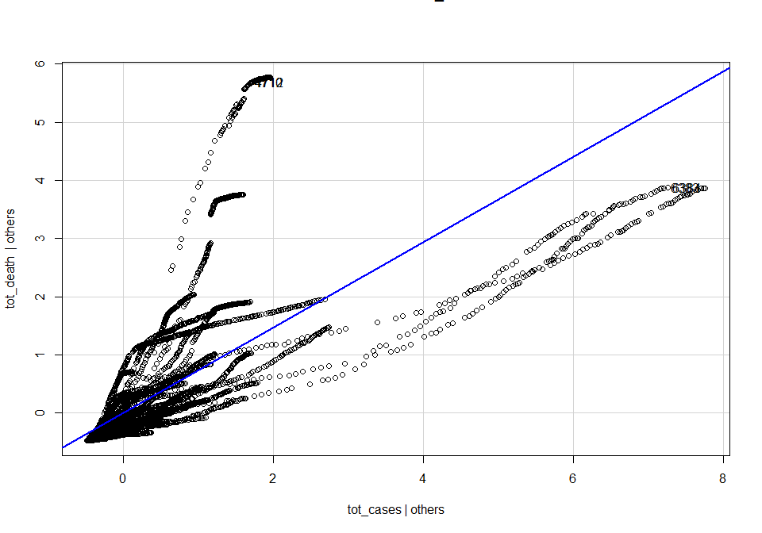

Covid-Case-Study
================
Sarwesh Khairnar
2022-06-10

<center>


</center>

# Installing the Dependencies

``` r
#install.packages("readxl")
#install.packages("lubridate")
#install.packages("scales")
#install.packages("klaR")
```

# Importing Libraries

``` r
library(tm)
```

    ## Warning: package 'tm' was built under R version 4.1.3

    ## Loading required package: NLP

``` r
library("plotrix")
library(lessR)
```

    ## Warning: package 'lessR' was built under R version 4.1.3

    ## 
    ## lessR 4.1.8                         feedback: gerbing@pdx.edu 
    ## --------------------------------------------------------------
    ## > d <- Read("")   Read text, Excel, SPSS, SAS, or R data file
    ##   d is default data frame, data= in analysis routines optional
    ## 
    ## Learn about reading, writing, and manipulating data, graphics,
    ## testing means and proportions, regression, factor analysis,
    ## customization, and descriptive statistics from pivot tables.
    ##   Enter:  browseVignettes("lessR")
    ## 
    ## View changes in this or recent versions of lessR.
    ##   Enter: help(package=lessR)  Click: Package NEWS
    ##   Enter: interact()  for access to interactive graphics
    ##   New function: reshape_long() to move data from wide to long

    ## 
    ## Attaching package: 'lessR'

    ## The following object is masked from 'package:plotrix':
    ## 
    ##     rescale

``` r
library(dplyr)
```

    ## 
    ## Attaching package: 'dplyr'

    ## The following objects are masked from 'package:lessR':
    ## 
    ##     recode, rename

    ## The following objects are masked from 'package:stats':
    ## 
    ##     filter, lag

    ## The following objects are masked from 'package:base':
    ## 
    ##     intersect, setdiff, setequal, union

``` r
library(scales)
```

    ## 
    ## Attaching package: 'scales'

    ## The following object is masked from 'package:lessR':
    ## 
    ##     rescale

    ## The following object is masked from 'package:plotrix':
    ## 
    ##     rescale

``` r
library(ggplot2)
```

    ## 
    ## Attaching package: 'ggplot2'

    ## The following object is masked from 'package:NLP':
    ## 
    ##     annotate

``` r
library(ggpubr)
library(wordcloud)
```

    ## Loading required package: RColorBrewer

``` r
library(RColorBrewer)
library(wordcloud2)
library(readxl)
library(lubridate)
```

    ## 
    ## Attaching package: 'lubridate'

    ## The following objects are masked from 'package:base':
    ## 
    ##     date, intersect, setdiff, union

``` r
library(caret)
```

    ## Loading required package: lattice

``` r
library(klaR)
```

    ## Loading required package: MASS

    ## 
    ## Attaching package: 'MASS'

    ## The following object is masked from 'package:dplyr':
    ## 
    ##     select

``` r
library(car)
```

    ## Loading required package: carData

    ## 
    ## Attaching package: 'car'

    ## The following object is masked from 'package:dplyr':
    ## 
    ##     recode

    ## The following objects are masked from 'package:lessR':
    ## 
    ##     bc, recode, sp

``` r
library('caTools')
library(caTools)
library(ROCR)
```

# Importing dataset

``` r
raw_data <- read.csv("C:\\Users\\sarwe\\Desktop\\Tutorial\\SY\\SY-II\\DS\\Home Assignment\\covidcases_time.csv")
```

``` r
summary(raw_data)
```

    ##  submission_date       state             tot_cases        conf_cases    
    ##  Length:15962       Length:15962       Min.   :     0   Min.   :     0  
    ##  Class :character   Class :character   1st Qu.:    12   1st Qu.:  4937  
    ##  Mode  :character   Mode  :character   Median :  6138   Median : 26431  
    ##                                        Mean   : 44062   Mean   : 52524  
    ##                                        3rd Qu.: 47709   3rd Qu.: 80719  
    ##                                        Max.   :852406   Max.   :324743  
    ##                                        NA's   :2        NA's   :10427   
    ##    prob_cases       new_case          pnew_case          tot_death    
    ##  Min.   :    0   Min.   :-10427.0   Min.   :-4832.00   Min.   :    0  
    ##  1st Qu.:    0   1st Qu.:     0.0   1st Qu.:    0.00   1st Qu.:    0  
    ##  Median :  538   Median :   100.0   Median :    0.00   Median :  144  
    ##  Mean   : 2242   Mean   :   490.9   Mean   :   22.16   Mean   : 1585  
    ##  3rd Qu.: 3157   3rd Qu.:   530.0   3rd Qu.:    5.00   3rd Qu.: 1323  
    ##  Max.   :27887   Max.   : 17844.0   Max.   : 5014.00   Max.   :23905  
    ##  NA's   :10427   NA's   :2          NA's   :5266       NA's   :2      
    ##    conf_death      prob_death       new_death          pnew_death       
    ##  Min.   :    0   Min.   :   0.0   Min.   :-1824.00   Min.   :-5482.000  
    ##  1st Qu.:  193   1st Qu.:   0.0   1st Qu.:    0.00   1st Qu.:    0.000  
    ##  Median :  984   Median :  21.0   Median :    1.00   Median :    0.000  
    ##  Mean   : 2518   Mean   : 271.3   Mean   :   13.48   Mean   :    1.126  
    ##  3rd Qu.: 3081   3rd Qu.: 171.0   3rd Qu.:   10.00   3rd Qu.:    0.000  
    ##  Max.   :19258   Max.   :5482.0   Max.   : 4585.00   Max.   : 5482.000  
    ##  NA's   :10072   NA's   :10072    NA's   :2          NA's   :5268       
    ##   created_at        consent_cases      consent_deaths    
    ##  Length:15962       Length:15962       Length:15962      
    ##  Class :character   Class :character   Class :character  
    ##  Mode  :character   Mode  :character   Mode  :character  
    ##                                                          
    ##                                                          
    ##                                                          
    ## 

``` r
dim(raw_data)
```

    ## [1] 15962    15

# Data Preprocessing

``` r
data <- subset(raw_data, select = -c(conf_cases, prob_cases, pnew_case, conf_death, prob_death, pnew_death, created_at, submission_date
))
```

``` r
unique(raw_data$state)
```

    ##  [1] "CO"  "FL"  "AZ"  "SC"  "CT"  "NE"  "KY"  "WY"  "IA"  "NM"  "ND"  "WA" 
    ## [13] "RMI" "TN"  "AS"  "MA"  "PA"  "NYC" "OH"  "AL"  "VA"  "MI"  "MS"  "CA" 
    ## [25] "IL"  "TX"  "WI"  "NV"  "NJ"  "LA"  "PR"  "OK"  "IN"  "NC"  "GA"  "OR" 
    ## [37] "MD"  "NY"  "ID"  "AR"  "UT"  "MO"  "DE"  "MN"  "WV"  "RI"  "SD"  "DC" 
    ## [49] "ME"  "NH"  "KS"  "MT"  "HI"  "AK"  "VT"  "GU"  "VI"  "MP"  "FSM" "PW" 
    ## [61] ""

``` r
new_data <- raw_data[raw_data$state %in% c("CO", "SC", "NE", "AZ", "KY", "ND"), ]
unique(new_data$state)
```

    ## [1] "CO" "AZ" "SC" "NE" "KY" "ND"

# Modelling the rise

``` r
rise_model <- new_data[new_data$state %in% c("CO", "SC", "NE"), ]
unique(rise_model$state)
```

    ## [1] "CO" "SC" "NE"

``` r
rise_model
```

    ##      submission_date state tot_cases conf_cases prob_cases new_case pnew_case
    ## 1         01/22/2020    CO         0         NA         NA        0        NA
    ## 2         01/23/2020    CO         0         NA         NA        0        NA
    ## 3         01/24/2020    CO         0         NA         NA        0        NA
    ## 4         01/25/2020    CO         0         NA         NA        0        NA
    ## 5         01/26/2020    CO         0         NA         NA        0        NA
    ## 6         01/27/2020    CO         0         NA         NA        0        NA
    ## 7         01/28/2020    CO         0         NA         NA        0        NA
    ## 8         01/29/2020    CO         0         NA         NA        0        NA
    ## 9         01/30/2020    CO         0         NA         NA        0        NA
    ## 10        01/31/2020    CO         0         NA         NA        0        NA
    ## 11        02-01-2020    CO         0         NA         NA        0        NA
    ## 12        02-02-2020    CO         0         NA         NA        0        NA
    ## 13        02-03-2020    CO         0         NA         NA        0        NA
    ## 14        02-04-2020    CO         0         NA         NA        0        NA
    ## 15        02-05-2020    CO         0         NA         NA        0        NA
    ## 16        02-06-2020    CO         0         NA         NA        0        NA
    ## 17        02-07-2020    CO         0         NA         NA        0        NA
    ## 18        02-08-2020    CO         0         NA         NA        0        NA
    ## 19        02-09-2020    CO         0         NA         NA        0        NA
    ## 20        02-10-2020    CO         0         NA         NA        0        NA
    ## 21        02-11-2020    CO         0         NA         NA        0        NA
    ## 22        02-12-2020    CO         0         NA         NA        0        NA
    ## 23        02/13/2020    CO         0         NA         NA        0        NA
    ## 24        02/14/2020    CO         0         NA         NA        0        NA
    ## 25        02/15/2020    CO         0         NA         NA        0        NA
    ## 26        02/16/2020    CO         0         NA         NA        0        NA
    ## 27        02/17/2020    CO         0         NA         NA        0        NA
    ## 28        02/18/2020    CO         0         NA         NA        0        NA
    ## 29        02/19/2020    CO         0         NA         NA        0        NA
    ## 30        02/20/2020    CO         0         NA         NA        0        NA
    ## 31        02/21/2020    CO         0         NA         NA        0        NA
    ## 32        02/22/2020    CO         0         NA         NA        0        NA
    ## 33        02/23/2020    CO         0         NA         NA        0        NA
    ## 34        02/24/2020    CO         0         NA         NA        0        NA
    ## 35        02/25/2020    CO         0         NA         NA        0        NA
    ## 36        02/26/2020    CO         0         NA         NA        0        NA
    ## 37        02/27/2020    CO         0         NA         NA        0        NA
    ## 38        02/28/2020    CO         0         NA         NA        0        NA
    ## 39        02/29/2020    CO         0         NA         NA        0        NA
    ## 40        03-01-2020    CO         0         NA         NA        0        NA
    ## 41        03-02-2020    CO         0         NA         NA        0        NA
    ## 42        03-03-2020    CO         0         NA         NA        0        NA
    ## 43        03-04-2020    CO         0         NA         NA        0        NA
    ## 44        03-05-2020    CO         1         NA         NA        1        NA
    ## 45        03-06-2020    CO         2         NA         NA        1        NA
    ## 46        03-07-2020    CO         8         NA         NA        6        NA
    ## 47        03-08-2020    CO         8         NA         NA        0        NA
    ## 48        03-09-2020    CO        12         NA         NA        4        NA
    ## 49        03-10-2020    CO        17         NA         NA        5        NA
    ## 50        03-11-2020    CO        34         NA         NA       17        NA
    ## 51        03-12-2020    CO        49         NA         NA       15        NA
    ## 52        03/13/2020    CO        49         NA         NA        0        NA
    ## 53        03/14/2020    CO        49         NA         NA        0        NA
    ## 54        03/15/2020    CO       144         NA         NA       95        NA
    ## 55        03/16/2020    CO       160         NA         NA       16        NA
    ## 56        03/17/2020    CO       183         NA         NA       23        NA
    ## 57        03/18/2020    CO       216         NA         NA       33        NA
    ## 58        03/19/2020    CO       277         NA         NA       61        NA
    ## 59        03/20/2020    CO       363         NA         NA       86        NA
    ## 60        03/21/2020    CO       475         NA         NA      112        NA
    ## 61        03/22/2020    CO       591         NA         NA      116        NA
    ## 62        03/23/2020    CO       720         NA         NA      129        NA
    ## 63        03/24/2020    CO       921         NA         NA      201        NA
    ## 64        03/25/2020    CO      1086         NA         NA      165        NA
    ## 65        03/26/2020    CO      1430         NA         NA      344        NA
    ## 66        03/27/2020    CO      1734         NA         NA      304        NA
    ## 67        03/28/2020    CO      2061         NA         NA      327        NA
    ## 68        03/29/2020    CO      2307         NA         NA      246        NA
    ## 69        03/30/2020    CO      2627         NA         NA      320        NA
    ## 70        03/31/2020    CO      2966         NA         NA      339        NA
    ## 71        04-01-2020    CO      3342         NA         NA      376        NA
    ## 72        04-02-2020    CO      3728         NA         NA      386        NA
    ## 73        04-03-2020    CO      4173         NA         NA      445        NA
    ## 74        04-04-2020    CO      4565         NA         NA      392        NA
    ## 75        04-05-2020    CO      4950         NA         NA      385        NA
    ## 76        04-06-2020    CO      5172         NA         NA      222        NA
    ## 77        04-07-2020    CO      5429         NA         NA      257        NA
    ## 78        04-08-2020    CO      5655         NA         NA      226        NA
    ## 79        04-09-2020    CO      6202         NA         NA      547        NA
    ## 80        04-10-2020    CO      6365         NA         NA      163        NA
    ## 81        04-11-2020    CO      6893         NA         NA      528        NA
    ## 82        04-12-2020    CO      7303         NA         NA      410        NA
    ## 83        04/13/2020    CO      7691         NA         NA      388        NA
    ## 84        04/14/2020    CO      7941         NA         NA      250        NA
    ## 85        04/15/2020    CO      8280         NA         NA      339        NA
    ## 86        04/16/2020    CO      8582       7941        641      302       641
    ## 87        04/17/2020    CO      9047         NA         NA      465        NA
    ## 88        04/18/2020    CO      9433         NA         NA      386        NA
    ## 89        04/19/2020    CO      9634       8915        719      201       719
    ## 90        04/20/2020    CO     10019       9260        759      385        40
    ## 91        04/21/2020    CO     10368       9536        832      349        73
    ## 92        04/22/2020    CO     10825       9878        947      457       115
    ## 93        04/23/2020    CO     11182      10208        974      357        27
    ## 94        04/24/2020    CO     12184      10995       1189     1002       215
    ## 95        04/25/2020    CO     12868      11533       1335      684       146
    ## 96        04/26/2020    CO     13350      11980       1370      482        35
    ## 97        04/27/2020    CO     13798      12374       1424      448        54
    ## 98        04/28/2020    CO     14238      12741       1497      440        73
    ## 99        04/29/2020    CO     14675      13148       1527      437        30
    ## 100       04/30/2020    CO     15182      13637       1545      507        18
    ## 101       05-01-2020    CO     15668      14078       1590      486        45
    ## 102       05-02-2020    CO     16120      14498       1622      452        32
    ## 103       05-03-2020    CO     16534      14897       1637      414        15
    ## 104       05-04-2020    CO     16878      15169       1709      344        72
    ## 105       05-05-2020    CO     17317      15600       1717      439         8
    ## 106       05-06-2020    CO     17738      16012       1726      421         9
    ## 107       05-07-2020    CO     18318      16532       1786      580        60
    ## 108       05-08-2020    CO     18793      16969       1824      475        38
    ## 109       05-09-2020    CO     19316      17491       1825      523         1
    ## 110       05-10-2020    CO     19632      17809       1823      316        -2
    ## 111       05-11-2020    CO     19735      17893       1842      103        19
    ## 112       05-12-2020    CO     20091      18211       1880      356        38
    ## 113       05/13/2020    CO     20401      18461       1940      310        60
    ## 114       05/14/2020    CO     20762      18804       1958      361        18
    ## 115       05/15/2020    CO     21131      19151       1980      369        22
    ## 116       05/16/2020    CO     21511      19507       2004      380        24
    ## 117       05/17/2020    CO     21797      19773       2024      286        20
    ## 118       05/18/2020    CO     22095      20028       2067      298        43
    ## 119       05/19/2020    CO     22399      20304       2095      304        28
    ## 120       05/20/2020    CO     22752      20595       2157      353        62
    ## 121       05/21/2020    CO     23121      20903       2218      369        61
    ## 122       05/22/2020    CO     23455      21202       2253      334        35
    ## 123       05/23/2020    CO     23937      21657       2280      482        27
    ## 124       05/24/2020    CO     24137      21857       2280      200         0
    ## 125       05/25/2020    CO     24226      21941       2285       89         5
    ## 126       05/26/2020    CO     24503      22208       2295      277        10
    ## 127       05/27/2020    CO     24995      22640       2355      492        60
    ## 128       05/28/2020    CO     25121      22758       2363      126         8
    ## 129       05/29/2020    CO     25613      23172       2441      492        78
    ## 130       05/30/2020    CO     26098      23667       2431      485       -10
    ## 131       05/31/2020    CO     26378      23949       2429      280        -2
    ## 132       06-01-2020    CO     26577      24109       2468      199        39
    ## 133       06-02-2020    CO     26788      24311       2477      211         9
    ## 134       06-03-2020    CO     27060      24557       2503      272        26
    ## 135       06-04-2020    CO     27360      24848       2512      300         9
    ## 136       06-05-2020    CO     27615      25099       2516      255         4
    ## 137       06-06-2020    CO     27848      25319       2529      233        13
    ## 138       06-07-2020    CO     28001      25457       2544      153        15
    ## 139       06-08-2020    CO     28183      25627       2556      182        12
    ## 140       06-09-2020    CO     28347      25787       2560      164         4
    ## 141       06-10-2020    CO     28499      25915       2584      152        24
    ## 142       06-11-2020    CO     28647      26040       2607      148        23
    ## 143       06-12-2020    CO     28822      26215       2607      175         0
    ## 144       06/13/2020    CO     29017      26408       2609      195         2
    ## 145       06/14/2020    CO     29130      26523       2607      113        -2
    ## 146       06/15/2020    CO     29299      26666       2633      169        26
    ## 147       06/16/2020    CO     29442      26795       2647      143        14
    ## 148       06/17/2020    CO     29673      27003       2670      231        23
    ## 149       06/18/2020    CO     29901      27218       2683      228        13
    ## 150       06/19/2020    CO     30187      27453       2734      286        51
    ## 151       06/20/2020    CO     30349      27608       2741      162         7
    ## 152       06/21/2020    CO     30539      27800       2739      190        -2
    ## 153       06/22/2020    CO     30705      27959       2746      166         7
    ## 154       06/23/2020    CO     30893      28138       2755      188         9
    ## 155       06/24/2020    CO     31155      28374       2781      262        26
    ## 156       06/25/2020    CO     31479      28674       2805      324        24
    ## 157       06/26/2020    CO     31796      28972       2824      317        19
    ## 158       06/27/2020    CO     32022      29194       2828      226         4
    ## 159       06/28/2020    CO     32307      29476       2831      285         3
    ## 160       06/29/2020    CO     32511      29651       2860      204        29
    ## 161       06/30/2020    CO     32715      29844       2871      204        11
    ## 162       07-01-2020    CO     33029      30133       2896      314        25
    ## 163       07-02-2020    CO     33352      30453       2899      323         3
    ## 164       07-03-2020    CO     33612      30715       2897      260        -2
    ## 165       07-04-2020    CO     33866      30970       2896      254        -1
    ## 166       07-05-2020    CO     34065      31168       2897      199         1
    ## 167       07-06-2020    CO     34257      31368       2889      192        -8
    ## 168       07-07-2020    CO     34664      31736       2928      407        39
    ## 169       07-08-2020    CO     35116      32138       2978      452        50
    ## 170       07-09-2020    CO     35525      32546       2979      409         1
    ## 171       07-10-2020    CO     36191      33189       3002      666        23
    ## 172       07-11-2020    CO     36591      33587       3004      400         2
    ## 173       07-12-2020    CO     36913      33911       3002      322        -2
    ## 174       07/13/2020    CO     37242      34229       3013      329        11
    ## 175       07/14/2020    CO     37686      34663       3023      444        10
    ## 176       07/15/2020    CO     38155      35126       3029      469         6
    ## 177       07/16/2020    CO     38726      35690       3036      571         7
    ## 178       07/17/2020    CO     39344      36260       3084      618        48
    ## 179       07/18/2020    CO     39788      36698       3090      444         6
    ## 180       07/19/2020    CO     40142      37041       3101      354        11
    ## 181       07/20/2020    CO     40566      37471       3095      424        -6
    ## 182       07/21/2020    CO     41059      37947       3112      493        17
    ## 183       07/22/2020    CO     41698      38562       3136      639        24
    ## 184       07/23/2020    CO     42314      39163       3151      616        15
    ## 185       07/24/2020    CO     42980      39822       3158      666         7
    ## 186       07/25/2020    CO     43789      40628       3161      809         3
    ## 187       07/26/2020    CO     44336      41174       3162      547         1
    ## 188       07/27/2020    CO     44565      41400       3165      229         3
    ## 189       07/28/2020    CO     45314      42149       3165      749         0
    ## 190       07/29/2020    CO     45796      42626       3170      482         5
    ## 191       07/30/2020    CO     46204      43032       3172      408         2
    ## 192       07/31/2020    CO     46809      43626       3183      605        11
    ## 193       08-01-2020    CO     47267      44077       3190      458         7
    ## 194       08-02-2020    CO     47716      44527       3189      449        -1
    ## 195       08-03-2020    CO     47968      44773       3195      252         6
    ## 196       08-04-2020    CO     48394      45177       3217      426        22
    ## 197       08-05-2020    CO     48988      45755       3233      594        16
    ## 198       08-06-2020    CO     49436      46200       3236      448         3
    ## 199       08-07-2020    CO     49893      46656       3237      457         1
    ## 200       08-08-2020    CO     50324      47083       3241      431         4
    ## 201       08-09-2020    CO     50660      47367       3293      336        52
    ## 202       08-10-2020    CO     51039      47651       3388      379        95
    ## 203       08-11-2020    CO     51441      48008       3433      402        45
    ## 204       08-12-2020    CO     51756      48262       3494      315        61
    ## 205       08/13/2020    CO     52129      48677       3452      373       -42
    ## 206       08/14/2020    CO     52538      48985       3553      409       101
    ## 207       08/15/2020    CO     52838      49278       3560      300         7
    ## 208       08/16/2020    CO     53176      49611       3565      338         5
    ## 209       08/17/2020    CO     53370      49801       3569      194         4
    ## 210       08/18/2020    CO     53631      50050       3581      261        12
    ## 211       08/19/2020    CO     53901      50313       3588      270         7
    ## 212       08/20/2020    CO     54230      50627       3603      329        15
    ## 213       08/21/2020    CO     54586      50967       3619      356        16
    ## 214       08/22/2020    CO     54883      51258       3625      297         6
    ## 215       08/23/2020    CO     55133      51505       3628      250         3
    ## 216       08/24/2020    CO     55341      51676       3665      208        37
    ## 217       08/25/2020    CO     55800      52074       3726      459        61
    ## 218       08/26/2020    CO     55994      52229       3765      194        39
    ## 219       08/27/2020    CO     56343      52562       3781      349        16
    ## 220       08/28/2020    CO     56773      52958       3815      430        34
    ## 221       08/29/2020    CO     57041      53209       3832      268        17
    ## 222       08/30/2020    CO     57223      53394       3829      182        -3
    ## 223       08/31/2020    CO     57424      53579       3845      201        16
    ## 224       09-01-2020    CO     57775      53878       3897      351        52
    ## 225       09-02-2020    CO     58019      54109       3910      244        13
    ## 226       09-03-2020    CO     58287      54367       3920      268        10
    ## 227       09-04-2020    CO     58655      54709       3946      368        26
    ## 228       09-05-2020    CO     58989      54980       4009      334        63
    ## 229       09-06-2020    CO     59274      55256       4018      285         9
    ## 230       09-07-2020    CO     59487      55458       4029      213        11
    ## 231       09-08-2020    CO     59674      55642       4032      187         3
    ## 232       09-09-2020    CO     59920      55866       4054      246        22
    ## 233       09-10-2020    CO     60185      56113       4072      265        18
    ## 234       09-11-2020    CO     60492      56378       4114      307        42
    ## 235       09-12-2020    CO     60907      56704       4203      415        89
    ## 236       09/13/2020    CO     61324      57099       4225      417        22
    ## 237       09/14/2020    CO     61699      57453       4246      375        21
    ## 238       09/15/2020    CO     62099      57805       4294      400        48
    ## 239       09/16/2020    CO     62686      58257       4429      587       135
    ## 240       09/17/2020    CO     63145      58671       4474      459        45
    ## 241       09/18/2020    CO     63750      59236       4514      605        40
    ## 242       09/19/2020    CO     64356      59782       4574      606        60
    ## 243       09/20/2020    CO     64857      60256       4601      501        27
    ## 244       09/21/2020    CO     65399      60792       4607      542         6
    ## 245       09/22/2020    CO     66053      61394       4659      654        52
    ## 246       09/23/2020    CO     66669      61983       4686      616        27
    ## 247       09/24/2020    CO     67217      62520       4697      548        11
    ## 248       09/25/2020    CO     67926      63137       4789      709        92
    ## 249       09/26/2020    CO     68510      63689       4821      584        32
    ## 250       09/27/2020    CO     69079      64237       4842      569        21
    ## 251       09/28/2020    CO     69490      64612       4878      411        36
    ## 252       09/29/2020    CO     70025      65115       4910      535        32
    ## 253       09/30/2020    CO     70536      65578       4958      511        48
    ## 254       10-01-2020    CO     71218      66242       4976      682        18
    ## 255       10-02-2020    CO     71898      66891       5007      680        31
    ## 256       10-03-2020    CO     71898      66891       5007        0         0
    ## 257       10-04-2020    CO     73076      68016       5060     1178        53
    ## 258       10-05-2020    CO     73537      68449       5088      461        28
    ## 259       10-06-2020    CO     74191      69049       5142      654        54
    ## 260       10-07-2020    CO     74922      69748       5174      731        32
    ## 261       10-08-2020    CO     75785      70559       5226      863        52
    ## 262       10-09-2020    CO     76619      71349       5270      834        44
    ## 263       10-10-2020    CO     77642      72316       5326     1023        56
    ## 264       10-11-2020    CO     78461      73116       5345      819        19
    ## 265       10-12-2020    CO     79037      73644       5393      576        48
    ## 266       10/13/2020    CO     80085      74655       5430     1048        37
    ## 799       01/22/2020    SC         0         NA         NA        0        NA
    ## 800       01/23/2020    SC         0         NA         NA        0        NA
    ## 801       01/24/2020    SC         0         NA         NA        0        NA
    ## 802       01/25/2020    SC         0         NA         NA        0        NA
    ## 803       01/26/2020    SC         0         NA         NA        0        NA
    ## 804       01/27/2020    SC         0         NA         NA        0        NA
    ## 805       01/28/2020    SC         0         NA         NA        0        NA
    ## 806       01/29/2020    SC         0         NA         NA        0        NA
    ## 807       01/30/2020    SC         0         NA         NA        0        NA
    ## 808       01/31/2020    SC         0         NA         NA        0        NA
    ## 809       02-01-2020    SC         0         NA         NA        0        NA
    ## 810       02-02-2020    SC         0         NA         NA        0        NA
    ## 811       02-03-2020    SC         0         NA         NA        0        NA
    ## 812       02-04-2020    SC         0         NA         NA        0        NA
    ## 813       02-05-2020    SC         0         NA         NA        0        NA
    ## 814       02-06-2020    SC         0         NA         NA        0        NA
    ## 815       02-07-2020    SC         0         NA         NA        0        NA
    ## 816       02-08-2020    SC         0         NA         NA        0        NA
    ## 817       02-09-2020    SC         0         NA         NA        0        NA
    ## 818       02-10-2020    SC         0         NA         NA        0        NA
    ## 819       02-11-2020    SC         0         NA         NA        0        NA
    ## 820       02-12-2020    SC         0         NA         NA        0        NA
    ## 821       02/13/2020    SC         0         NA         NA        0        NA
    ## 822       02/14/2020    SC         0         NA         NA        0        NA
    ## 823       02/15/2020    SC         0         NA         NA        0        NA
    ## 824       02/16/2020    SC         0         NA         NA        0        NA
    ## 825       02/17/2020    SC         0         NA         NA        0        NA
    ## 826       02/18/2020    SC         0         NA         NA        0        NA
    ## 827       02/19/2020    SC         0         NA         NA        0        NA
    ## 828       02/20/2020    SC         0         NA         NA        0        NA
    ## 829       02/21/2020    SC         0         NA         NA        0        NA
    ## 830       02/22/2020    SC         0         NA         NA        0        NA
    ## 831       02/23/2020    SC         0         NA         NA        0        NA
    ## 832       02/24/2020    SC         0         NA         NA        0        NA
    ## 833       02/25/2020    SC         0         NA         NA        0        NA
    ## 834       02/26/2020    SC         0         NA         NA        0        NA
    ## 835       02/27/2020    SC         0         NA         NA        0        NA
    ## 836       02/28/2020    SC         0         NA         NA        0        NA
    ## 837       02/29/2020    SC         0         NA         NA        0        NA
    ## 838       03-01-2020    SC         0         NA         NA        0        NA
    ## 839       03-02-2020    SC         0         NA         NA        0        NA
    ## 840       03-03-2020    SC         0         NA         NA        0        NA
    ## 841       03-04-2020    SC         0         NA         NA        0        NA
    ## 842       03-05-2020    SC         0         NA         NA        0        NA
    ## 843       03-06-2020    SC         0         NA         NA        0        NA
    ## 844       03-07-2020    SC         2         NA         NA        2        NA
    ## 845       03-08-2020    SC         6         NA         NA        4        NA
    ## 846       03-09-2020    SC         7         NA         NA        1        NA
    ## 847       03-10-2020    SC         9         NA         NA        2        NA
    ## 848       03-11-2020    SC        10         NA         NA        1        NA
    ## 849       03-12-2020    SC        12         NA         NA        2        NA
    ## 850       03/13/2020    SC        12         NA         NA        0        NA
    ## 851       03/14/2020    SC        12         NA         NA        0        NA
    ## 852       03/15/2020    SC        28         NA         NA       16        NA
    ## 853       03/16/2020    SC        33         NA         NA        5        NA
    ## 854       03/17/2020    SC        47         NA         NA       14        NA
    ## 855       03/18/2020    SC        60         NA         NA       13        NA
    ## 856       03/19/2020    SC        81         NA         NA       21        NA
    ## 857       03/20/2020    SC       125         NA         NA       44        NA
    ## 858       03/21/2020    SC       173         NA         NA       48        NA
    ## 859       03/22/2020    SC       195         NA         NA       22        NA
    ## 860       03/23/2020    SC       298         NA         NA      103        NA
    ## 861       03/24/2020    SC       342         NA         NA       44        NA
    ## 862       03/25/2020    SC       424         NA         NA       82        NA
    ## 863       03/26/2020    SC       456         NA         NA       32        NA
    ## 864       03/27/2020    SC       539         NA         NA       83        NA
    ## 865       03/28/2020    SC       660         NA         NA      121        NA
    ## 866       03/29/2020    SC       774         NA         NA      114        NA
    ## 867       03/30/2020    SC       925         NA         NA      151        NA
    ## 868       03/31/2020    SC      1083         NA         NA      158        NA
    ## 869       04-01-2020    SC      1293         NA         NA      210        NA
    ## 870       04-02-2020    SC      1554         NA         NA      261        NA
    ## 871       04-03-2020    SC      1700         NA         NA      146        NA
    ## 872       04-04-2020    SC      1917         NA         NA      217        NA
    ## 873       04-05-2020    SC      2049         NA         NA      132        NA
    ## 874       04-06-2020    SC      2232         NA         NA      183        NA
    ## 875       04-07-2020    SC      2417         NA         NA      185        NA
    ## 876       04-08-2020    SC      2552         NA         NA      135        NA
    ## 877       04-09-2020    SC      2792         NA         NA      240        NA
    ## 878       04-10-2020    SC      3065         NA         NA      273        NA
    ## 879       04-11-2020    SC      3207         NA         NA      142        NA
    ## 880       04-12-2020    SC      3319         NA         NA      112        NA
    ## 881       04/13/2020    SC      3439         NA         NA      120        NA
    ## 882       04/14/2020    SC      3553         NA         NA      114        NA
    ## 883       04/15/2020    SC      3656         NA         NA      103        NA
    ## 884       04/16/2020    SC      3931         NA         NA      275        NA
    ## 885       04/17/2020    SC      4086         NA         NA      155        NA
    ## 886       04/18/2020    SC      4246         NA         NA      160        NA
    ## 887       04/19/2020    SC      4377       4377          0      131         0
    ## 888       04/20/2020    SC      4439       4439          0       62         0
    ## 889       04/21/2020    SC      4608       4608          0      169         0
    ## 890       04/22/2020    SC      4761       4761          0      153         0
    ## 891       04/23/2020    SC      4917       4917          0      156         0
    ## 892       04/24/2020    SC      5070       5070          0      153         0
    ## 893       04/25/2020    SC      5253       5253          0      183         0
    ## 894       04/26/2020    SC      5490       5490          0      237         0
    ## 895       04/27/2020    SC      5613       5613          0      123         0
    ## 896       04/28/2020    SC      5735       5735          0      122         0
    ## 897       04/29/2020    SC      5881       5881          0      146         0
    ## 898       04/30/2020    SC      6095       6095          0      214         0
    ## 899       05-01-2020    SC      6258       6258          0      163         0
    ## 900       05-02-2020    SC      6489       6489          0      231         0
    ## 901       05-03-2020    SC      6626       6626          0      137         0
    ## 902       05-04-2020    SC      6757       6757          0      131         0
    ## 903       05-05-2020    SC      6841       6841          0       84         0
    ## 904       05-06-2020    SC      6936       6936          0       95         0
    ## 905       05-07-2020    SC      7142       7142          0      206         0
    ## 906       05-08-2020    SC      7367       7367          0      225         0
    ## 907       05-09-2020    SC      7531       7531          0      164         0
    ## 908       05-10-2020    SC      7653       7653          0      122         0
    ## 909       05-11-2020    SC      7792       7792          0      139         0
    ## 910       05-12-2020    SC      7927       7927          0      135         0
    ## 911       05/13/2020    SC      8030       8030          0      103         0
    ## 912       05/14/2020    SC      8189       8189          0      159         0
    ## 913       05/15/2020    SC      8407       8407          0      218         0
    ## 914       05/16/2020    SC      8661       8661          0      254         0
    ## 915       05/17/2020    SC      8816       8816          0      155         0
    ## 916       05/18/2020    SC      8942       8942          0      126         0
    ## 917       05/19/2020    SC      9056       9056          0      114         0
    ## 918       05/20/2020    SC      9175       9175          0      119         0
    ## 919       05/21/2020    SC      9379       9379          0      204         0
    ## 920       05/22/2020    SC      9638       9638          0      259         0
    ## 921       05/23/2020    SC      9895       9895          0      257         0
    ## 922       05/24/2020    SC     10096      10096          0      201         0
    ## 923       05/25/2020    SC     10178      10178          0       82         0
    ## 924       05/26/2020    SC     10416      10416          0      238         0
    ## 925       05/27/2020    SC     10623      10623          0      207         0
    ## 926       05/28/2020    SC     10788      10788          0      165         0
    ## 927       05/29/2020    SC     11131      11131          0      343         0
    ## 928       05/30/2020    SC     11394      11394          0      263         0
    ## 929       05/31/2020    SC     11861      11861          0      467         0
    ## 930       06-01-2020    SC     12148      12148          0      287         0
    ## 931       06-02-2020    SC     12415      12415          0      267         0
    ## 932       06-03-2020    SC     12651      12651          0      236         0
    ## 933       06-04-2020    SC     13005      13005          0      354         0
    ## 934       06-05-2020    SC     13453      13453          0      448         0
    ## 935       06-06-2020    SC     13916      13916          0      463         0
    ## 936       06-07-2020    SC     14286      14286          0      370         0
    ## 937       06-08-2020    SC     14800      14800          0      514         0
    ## 938       06-09-2020    SC     15228      15228          0      428         0
    ## 939       06-10-2020    SC     15759      15759          0      531         0
    ## 940       06-11-2020    SC     16441      16441          0      682         0
    ## 941       06-12-2020    SC     17170      17170          0      729         0
    ## 942       06/13/2020    SC     17955      17955          0      785         0
    ## 943       06/14/2020    SC     18795      18795          0      840         0
    ## 944       06/15/2020    SC     19378      19378          0      583         0
    ## 945       06/16/2020    SC     19990      19990          0      612         0
    ## 946       06/17/2020    SC     20556      20551          5      566         5
    ## 947       06/18/2020    SC     21548      21533         15      992        10
    ## 948       06/19/2020    SC     22631      22608         23     1083         8
    ## 949       06/20/2020    SC     23786      23756         30     1155         7
    ## 950       06/21/2020    SC     24693      24661         32      907         2
    ## 951       06/22/2020    SC     25701      25666         35     1008         3
    ## 952       06/23/2020    SC     26613      26572         41      912         6
    ## 953       06/24/2020    SC     27897      27842         55     1284        14
    ## 954       06/25/2020    SC     29022      28962         60     1125         5
    ## 955       06/26/2020    SC     30335      30263         72     1313        12
    ## 956       06/27/2020    SC     31939      31850         89     1604        17
    ## 957       06/28/2020    SC     33320      33221         99     1381        10
    ## 958       06/29/2020    SC     34644      34546         98     1324        -1
    ## 959       06/30/2020    SC     36399      36297        102     1755         4
    ## 960       07-01-2020    SC     37919      37809        110     1520         8
    ## 961       07-02-2020    SC     39701      39587        114     1782         4
    ## 962       07-03-2020    SC     41532      41413        119     1831         5
    ## 963       07-04-2020    SC     43386      43260        126     1854         7
    ## 964       07-05-2020    SC     44847      44717        130     1461         4
    ## 965       07-06-2020    SC     46380      46247        133     1533         3
    ## 966       07-07-2020    SC     47352      47214        138      972         5
    ## 967       07-08-2020    SC     48909      48770        139     1557         1
    ## 968       07-09-2020    SC     50691      50548        143     1782         4
    ## 969       07-10-2020    SC     52419      52273        146     1728         3
    ## 970       07-11-2020    SC     54699      54538        161     2280        15
    ## 971       07-12-2020    SC     56648      56485        163     1949         2
    ## 972       07/13/2020    SC     58168      58003        165     1520         2
    ## 973       07/14/2020    SC     60389      60220        169     2221         4
    ## 974       07/15/2020    SC     62245      62071        174     1856         5
    ## 975       07/16/2020    SC     64083      63880        203     1838        29
    ## 976       07/17/2020    SC     66060      65857        203     1977         0
    ## 977       07/18/2020    SC     67612      67396        216     1552        13
    ## 978       07/19/2020    SC     69986      69765        221     2374         5
    ## 979       07/20/2020    SC     71445      71213        232     1459        11
    ## 980       07/21/2020    SC     73337      73101        236     1892         4
    ## 981       07/22/2020    SC     75042      74761        281     1705        45
    ## 982       07/23/2020    SC     76606      76315        291     1564        10
    ## 983       07/24/2020    SC     78607      78298        309     2001        18
    ## 984       07/25/2020    SC     80008      79674        334     1401        25
    ## 985       07/26/2020    SC     81199      80856        343     1191         9
    ## 986       07/27/2020    SC     82417      82071        346     1218         3
    ## 987       07/28/2020    SC     84109      83720        389     1692        43
    ## 988       07/29/2020    SC     85846      85423        423     1737        34
    ## 989       07/30/2020    SC     87572      87117        455     1726        32
    ## 990       07/31/2020    SC     89016      88523        493     1444        38
    ## 991       08-01-2020    SC     90599      90076        523     1583        30
    ## 992       08-02-2020    SC     91788      91257        531     1189         8
    ## 993       08-03-2020    SC     92951      92404        547     1163        16
    ## 994       08-04-2020    SC     94190      93604        586     1239        39
    ## 995       08-05-2020    SC     95472      94837        635     1282        49
    ## 996       08-06-2020    SC     96797      96132        665     1325        30
    ## 997       08-07-2020    SC     98219      97554        665     1422         0
    ## 998       08-08-2020    SC     99460      98743        717     1241        52
    ## 999       08-09-2020    SC    100435      99713        722      975         5
    ## 1000      08-10-2020    SC    101159     100431        728      724         6
    ## 1001      08-11-2020    SC    102130     101360        770      971        42
    ## 1002      08-12-2020    SC    102974     102143        831      844        61
    ## 1003      08/13/2020    SC    103909     103051        858      935        27
    ## 1004      08/14/2020    SC    104841     103880        961      932       103
    ## 1005      08/15/2020    SC    105882     104874       1008     1041        47
    ## 1006      08/16/2020    SC    106497     105466       1031      615        23
    ## 1007      08/17/2020    SC    106953     105905       1048      456        17
    ## 1008      08/18/2020    SC    107672     106574       1098      719        50
    ## 1009      08/19/2020    SC    108411     107274       1137      739        39
    ## 1010      08/20/2020    SC    109320     108146       1174      909        37
    ## 1011      08/21/2020    SC    110378     109135       1243     1058        69
    ## 1012      08/22/2020    SC    111295     109962       1333      917        90
    ## 1013      08/23/2020    SC    111988     110658       1330      693        -3
    ## 1014      08/24/2020    SC    112551     111202       1349      563        19
    ## 1015      08/25/2020    SC    113488     112088       1400      937        51
    ## 1016      08/26/2020    SC    114093     112643       1450      605        50
    ## 1017      08/27/2020    SC    114598     113107       1491      505        41
    ## 1018      08/28/2020    SC    115951     114400       1551     1353        60
    ## 1019      08/29/2020    SC    117249     115661       1588     1298        37
    ## 1020      08/30/2020    SC    118324     116697       1627     1075        39
    ## 1021      08/31/2020    SC    118992     117333       1659      668        32
    ## 1022      09-01-2020    SC    119846     118116       1730      854        71
    ## 1023      09-02-2020    SC    120503     118699       1804      657        74
    ## 1024      09-03-2020    SC    121696     119822       1874     1193        70
    ## 1025      09-04-2020    SC    123325     121378       1947     1629        73
    ## 1026      09-05-2020    SC    124289     122313       1976      964        29
    ## 1027      09-06-2020    SC    124952     122944       2008      663        32
    ## 1028      09-07-2020    SC    125607     123552       2055      655        47
    ## 1029      09-08-2020    SC    125908     123801       2107      301        52
    ## 1030      09-09-2020    SC    126213     124097       2116      305         9
    ## 1031      09-10-2020    SC    126592     124397       2195      379        79
    ## 1032      09-11-2020    SC    129046     126792       2254     2454        59
    ## 1033      09-12-2020    SC    129978     127646       2332      932        78
    ## 1034      09/13/2020    SC    131864     129484       2380     1886        48
    ## 1035      09/14/2020    SC    132680     130256       2424      816        44
    ## 1036      09/15/2020    SC    133470     130917       2553      790       129
    ## 1037      09/16/2020    SC    134122     131428       2694      652       141
    ## 1038      09/17/2020    SC    135446     132565       2881     1324       187
    ## 1039      09/18/2020    SC    136318     133310       3008      872       127
    ## 1040      09/19/2020    SC    137240     134052       3188      922       180
    ## 1041      09/20/2020    SC    137708     134494       3214      468        26
    ## 1042      09/21/2020    SC    138124     134884       3240      416        26
    ## 1043      09/22/2020    SC    140789     137406       3383     2665       143
    ## 1044      09/23/2020    SC    141686     138171       3515      897       132
    ## 1045      09/24/2020    SC    142707     139021       3686     1021       171
    ## 1046      09/25/2020    SC    143902     140056       3846     1195       160
    ## 1047      09/26/2020    SC    145273     141338       3935     1371        89
    ## 1048      09/27/2020    SC    145887     141909       3978      614        43
    ## 1049      09/28/2020    SC    146455     142449       4006      568        28
    ## 1050      09/29/2020    SC    147634     143495       4139     1179       133
    ## 1051      09/30/2020    SC    147942     143623       4319      308       180
    ## 1052      10-01-2020    SC    148323     143787       4536      381       217
    ## 1053      10-02-2020    SC    149185     144366       4819      862       283
    ## 1054      10-03-2020    SC    150891     145953       4938     1706       119
    ## 1055      10-04-2020    SC    151582     146576       5006      691        68
    ## 1056      10-05-2020    SC    152159     147116       5043      577        37
    ## 1057      10-06-2020    SC    152970     147800       5170      811       127
    ## 1058      10-07-2020    SC    153705     148334       5371      735       201
    ## 1059      10-08-2020    SC    154755     149219       5536     1050       165
    ## 1060      10-09-2020    SC    155676     150033       5643      921       107
    ## 1061      10-10-2020    SC    156621     150915       5706      945        63
    ## 1062      10-11-2020    SC    157406     151649       5757      785        51
    ## 1063      10-12-2020    SC    158055     152242       5813      649        56
    ## 1064      10/13/2020    SC    158883     152963       5920      828       107
    ## 1331      01/22/2020    NE         0         NA         NA        0        NA
    ## 1332      01/23/2020    NE         0         NA         NA        0        NA
    ## 1333      01/24/2020    NE         0         NA         NA        0        NA
    ## 1334      01/25/2020    NE         0         NA         NA        0        NA
    ## 1335      01/26/2020    NE         0         NA         NA        0        NA
    ## 1336      01/27/2020    NE         0         NA         NA        0        NA
    ## 1337      01/28/2020    NE         0         NA         NA        0        NA
    ## 1338      01/29/2020    NE         0         NA         NA        0        NA
    ## 1339      01/30/2020    NE         0         NA         NA        0        NA
    ## 1340      01/31/2020    NE         0         NA         NA        0        NA
    ## 1341      02-01-2020    NE         0         NA         NA        0        NA
    ## 1342      02-02-2020    NE         0         NA         NA        0        NA
    ## 1343      02-03-2020    NE         0         NA         NA        0        NA
    ## 1344      02-04-2020    NE         0         NA         NA        0        NA
    ## 1345      02-05-2020    NE         0         NA         NA        0        NA
    ## 1346      02-06-2020    NE         0         NA         NA        0        NA
    ## 1347      02-07-2020    NE         0         NA         NA        0        NA
    ## 1348      02-08-2020    NE         0         NA         NA        0        NA
    ## 1349      02-09-2020    NE         0         NA         NA        0        NA
    ## 1350      02-10-2020    NE         0         NA         NA        0        NA
    ## 1351      02-11-2020    NE         0         NA         NA        0        NA
    ## 1352      02-12-2020    NE         0         NA         NA        0        NA
    ## 1353      02/13/2020    NE         0         NA         NA        0        NA
    ## 1354      02/14/2020    NE         0         NA         NA        0        NA
    ## 1355      02/15/2020    NE         0         NA         NA        0        NA
    ## 1356      02/16/2020    NE         0         NA         NA        0        NA
    ## 1357      02/17/2020    NE         0         NA         NA        0        NA
    ## 1358      02/18/2020    NE         0         NA         NA        0        NA
    ## 1359      02/19/2020    NE         0         NA         NA        0        NA
    ## 1360      02/20/2020    NE         0         NA         NA        0        NA
    ## 1361      02/21/2020    NE         0         NA         NA        0        NA
    ## 1362      02/22/2020    NE         0         NA         NA        0        NA
    ## 1363      02/23/2020    NE         0         NA         NA        0        NA
    ## 1364      02/24/2020    NE         0         NA         NA        0        NA
    ## 1365      02/25/2020    NE         0         NA         NA        0        NA
    ## 1366      02/26/2020    NE         0         NA         NA        0        NA
    ## 1367      02/27/2020    NE         0         NA         NA        0        NA
    ## 1368      02/28/2020    NE         0         NA         NA        0        NA
    ## 1369      02/29/2020    NE         0         NA         NA        0        NA
    ## 1370      03-01-2020    NE         0         NA         NA        0        NA
    ## 1371      03-02-2020    NE         0         NA         NA        0        NA
    ## 1372      03-03-2020    NE         0         NA         NA        0        NA
    ## 1373      03-04-2020    NE         0         NA         NA        0        NA
    ## 1374      03-05-2020    NE         0         NA         NA        0        NA
    ## 1375      03-06-2020    NE         1         NA         NA        1        NA
    ## 1376      03-07-2020    NE         2         NA         NA        1        NA
    ## 1377      03-08-2020    NE         2         NA         NA        0        NA
    ## 1378      03-09-2020    NE         4         NA         NA        2        NA
    ## 1379      03-10-2020    NE         4         NA         NA        0        NA
    ## 1380      03-11-2020    NE         5         NA         NA        1        NA
    ## 1381      03-12-2020    NE        10         NA         NA        5        NA
    ## 1382      03/13/2020    NE        10         NA         NA        0        NA
    ## 1383      03/14/2020    NE        10         NA         NA        0        NA
    ## 1384      03/15/2020    NE        18         NA         NA        8        NA
    ## 1385      03/16/2020    NE        18         NA         NA        0        NA
    ## 1386      03/17/2020    NE        21         NA         NA        3        NA
    ## 1387      03/18/2020    NE        27         NA         NA        6        NA
    ## 1388      03/19/2020    NE        27         NA         NA        0        NA
    ## 1389      03/20/2020    NE        38         NA         NA       11        NA
    ## 1390      03/21/2020    NE        42         NA         NA        4        NA
    ## 1391      03/22/2020    NE        50         NA         NA        8        NA
    ## 1392      03/23/2020    NE        52         NA         NA        2        NA
    ## 1393      03/24/2020    NE        53         NA         NA        1        NA
    ## 1394      03/25/2020    NE        64         NA         NA       11        NA
    ## 1395      03/26/2020    NE        73         NA         NA        9        NA
    ## 1396      03/27/2020    NE        89         NA         NA       16        NA
    ## 1397      03/28/2020    NE       108         NA         NA       19        NA
    ## 1398      03/29/2020    NE       120         NA         NA       12        NA
    ## 1399      03/30/2020    NE       145         NA         NA       25        NA
    ## 1400      03/31/2020    NE       177         NA         NA       32        NA
    ## 1401      04-01-2020    NE       214         NA         NA       37        NA
    ## 1402      04-02-2020    NE       255         NA         NA       41        NA
    ## 1403      04-03-2020    NE       285         NA         NA       30        NA
    ## 1404      04-04-2020    NE       323         NA         NA       38        NA
    ## 1405      04-05-2020    NE       367         NA         NA       44        NA
    ## 1406      04-06-2020    NE       412         NA         NA       45        NA
    ## 1407      04-07-2020    NE       478         NA         NA       66        NA
    ## 1408      04-08-2020    NE       523         NA         NA       45        NA
    ## 1409      04-09-2020    NE       577         NA         NA       54        NA
    ## 1410      04-10-2020    NE       648         NA         NA       71        NA
    ## 1411      04-11-2020    NE       704         NA         NA       56        NA
    ## 1412      04-12-2020    NE       814         NA         NA      110        NA
    ## 1413      04/13/2020    NE       871         NA         NA       57        NA
    ## 1414      04/14/2020    NE       901         NA         NA       30        NA
    ## 1415      04/15/2020    NE       952         NA         NA       51        NA
    ## 1416      04/16/2020    NE      1066         NA         NA      114        NA
    ## 1417      04/17/2020    NE      1138         NA         NA       72        NA
    ## 1418      04/18/2020    NE      1287         NA         NA      149        NA
    ## 1419      04/19/2020    NE      1474         NA         NA      187         0
    ## 1420      04/20/2020    NE      1648         NA         NA      174         0
    ## 1421      04/21/2020    NE      1722         NA         NA       74         0
    ## 1422      04/22/2020    NE      1813         NA         NA       91         0
    ## 1423      04/23/2020    NE      2124         NA         NA      311         0
    ## 1424      04/24/2020    NE      2421         NA         NA      297         0
    ## 1425      04/25/2020    NE      2732         NA         NA      311         0
    ## 1426      04/26/2020    NE      3028         NA         NA      296         0
    ## 1427      04/27/2020    NE      3358         NA         NA      330         0
    ## 1428      04/28/2020    NE      3374         NA         NA       16         0
    ## 1429      04/29/2020    NE      3784         NA         NA      410         0
    ## 1430      04/30/2020    NE      4281         NA         NA      497         0
    ## 1431      05-01-2020    NE      4838         NA         NA      557         0
    ## 1432      05-02-2020    NE      5326         NA         NA      488         0
    ## 1433      05-03-2020    NE      5659         NA         NA      333         0
    ## 1434      05-04-2020    NE      6083         NA         NA      424         0
    ## 1435      05-05-2020    NE      6438         NA         NA      355         0
    ## 1436      05-06-2020    NE      6771         NA         NA      333         0
    ## 1437      05-07-2020    NE      7190         NA         NA      419         0
    ## 1438      05-08-2020    NE      7831         NA         NA      641         0
    ## 1439      05-09-2020    NE      8234         NA         NA      403         0
    ## 1440      05-10-2020    NE      8315         NA         NA       81         0
    ## 1441      05-11-2020    NE      8572         NA         NA      257         0
    ## 1442      05-12-2020    NE      8692         NA         NA      120         0
    ## 1443      05/13/2020    NE      9075         NA         NA      383         0
    ## 1444      05/14/2020    NE      9416         NA         NA      341         0
    ## 1445      05/15/2020    NE      9772         NA         NA      356         0
    ## 1446      05/16/2020    NE     10220         NA         NA      448         0
    ## 1447      05/17/2020    NE     10348         NA         NA      128         0
    ## 1448      05/18/2020    NE     10625         NA         NA      277         0
    ## 1449      05/19/2020    NE     10846         NA         NA      221         0
    ## 1450      05/20/2020    NE     11122         NA         NA      276         0
    ## 1451      05/21/2020    NE     11425         NA         NA      303         0
    ## 1452      05/22/2020    NE     11662         NA         NA      237         0
    ## 1453      05/23/2020    NE     11989         NA         NA      327         0
    ## 1454      05/24/2020    NE     12134         NA         NA      145         0
    ## 1455      05/25/2020    NE     12355         NA         NA      221         0
    ## 1456      05/26/2020    NE     12619         NA         NA      264         0
    ## 1457      05/27/2020    NE     12976         NA         NA      357         0
    ## 1458      05/28/2020    NE     13261         NA         NA      285         0
    ## 1459      05/29/2020    NE     13654         NA         NA      393         0
    ## 1460      05/30/2020    NE     13905         NA         NA      251         0
    ## 1461      05/31/2020    NE     14101         NA         NA      196         0
    ## 1462      06-01-2020    NE     14345         NA         NA      244         0
    ## 1463      06-02-2020    NE     14611         NA         NA      266         0
    ## 1464      06-03-2020    NE     14866         NA         NA      255         0
    ## 1465      06-04-2020    NE     15117         NA         NA      251         0
    ## 1466      06-05-2020    NE     15379         NA         NA      262         0
    ## 1467      06-06-2020    NE     15543         NA         NA      164         0
    ## 1468      06-07-2020    NE     15634         NA         NA       91         0
    ## 1469      06-08-2020    NE     15752         NA         NA      118         0
    ## 1470      06-09-2020    NE     15883         NA         NA      131         0
    ## 1471      06-10-2020    NE     16025         NA         NA      142         0
    ## 1472      06-11-2020    NE     16315         NA         NA      290         0
    ## 1473      06-12-2020    NE     16513         NA         NA      198         0
    ## 1474      06/13/2020    NE     16633         NA         NA      120         0
    ## 1475      06/14/2020    NE     16725         NA         NA       92         0
    ## 1476      06/15/2020    NE     16851         NA         NA      126         0
    ## 1477      06/16/2020    NE     17031         NA         NA      180         0
    ## 1478      06/17/2020    NE     17226         NA         NA      195         0
    ## 1479      06/18/2020    NE     17415         NA         NA      189         0
    ## 1480      06/19/2020    NE     17591         NA         NA      176         0
    ## 1481      06/20/2020    NE     17707         NA         NA      116         0
    ## 1482      06/21/2020    NE     17810         NA         NA      103         0
    ## 1483      06/22/2020    NE     17957         NA         NA      147         0
    ## 1484      06/23/2020    NE     18092         NA         NA      135         0
    ## 1485      06/24/2020    NE     18221         NA         NA      129         0
    ## 1486      06/25/2020    NE     18346         NA         NA      125         0
    ## 1487      06/26/2020    NE     18524         NA         NA      178         0
    ## 1488      06/27/2020    NE     18775         NA         NA      251         0
    ## 1489      06/28/2020    NE     18899         NA         NA      124         0
    ## 1490      06/29/2020    NE     19042         NA         NA      143         0
    ## 1491      06/30/2020    NE     19177         NA         NA      135         0
    ## 1492      07-01-2020    NE     19310         NA         NA      133         0
    ## 1493      07-02-2020    NE     19452         NA         NA      142         0
    ## 1494      07-03-2020    NE     19660         NA         NA      208         0
    ## 1495      07-04-2020    NE     19827         NA         NA      167         0
    ## 1496      07-05-2020    NE     19929         NA         NA      102         0
    ## 1497      07-06-2020    NE     20046         NA         NA      117         0
    ## 1498      07-07-2020    NE     20201         NA         NA      155         0
    ## 1499      07-08-2020    NE     20425         NA         NA      224         0
    ## 1500      07-09-2020    NE     20623         NA         NA      198         0
    ## 1501      07-10-2020    NE     20777         NA         NA      154         0
    ## 1502      07-11-2020    NE     20998         NA         NA      221         0
    ## 1503      07-12-2020    NE     21172         NA         NA      174         0
    ## 1504      07/13/2020    NE     21399         NA         NA      227         0
    ## 1505      07/14/2020    NE     21717         NA         NA      318         0
    ## 1506      07/15/2020    NE     21979         NA         NA      262         0
    ## 1507      07/16/2020    NE     22134         NA         NA      155         0
    ## 1508      07/17/2020    NE     22361         NA         NA      227         0
    ## 1509      07/18/2020    NE     22481         NA         NA      120         0
    ## 1510      07/19/2020    NE     22583         NA         NA      102         0
    ## 1511      07/20/2020    NE     22847         NA         NA      264         0
    ## 1512      07/21/2020    NE     23190         NA         NA      343         0
    ## 1513      07/22/2020    NE     23486         NA         NA      296         0
    ## 1514      07/23/2020    NE     23818         NA         NA      332         0
    ## 1515      07/24/2020    NE     24174         NA         NA      356         0
    ## 1516      07/25/2020    NE     24395         NA         NA      221         0
    ## 1517      07/26/2020    NE     24618         NA         NA      223         0
    ## 1518      07/27/2020    NE     24889         NA         NA      271         0
    ## 1519      07/28/2020    NE     25157         NA         NA      268         0
    ## 1520      07/29/2020    NE     25422         NA         NA      265         0
    ## 1521      07/30/2020    NE     25766         NA         NA      344         0
    ## 1522      07/31/2020    NE     26211         NA         NA      445         0
    ## 1523      08-01-2020    NE     26391         NA         NA      180         0
    ## 1524      08-02-2020    NE     26702         NA         NA      311         0
    ## 1525      08-03-2020    NE     26956         NA         NA      254         0
    ## 1526      08-04-2020    NE     27178         NA         NA      222         0
    ## 1527      08-05-2020    NE     27489         NA         NA      311         0
    ## 1528      08-06-2020    NE     27821         NA         NA      332         0
    ## 1529      08-07-2020    NE     28104         NA         NA      283         0
    ## 1530      08-08-2020    NE     28245         NA         NA      141         0
    ## 1531      08-09-2020    NE     28432         NA         NA      187         0
    ## 1532      08-10-2020    NE     28696         NA         NA      264         0
    ## 1533      08-11-2020    NE     29030         NA         NA      334         0
    ## 1534      08-12-2020    NE     29244         NA         NA      214         0
    ## 1535      08/13/2020    NE     29660         NA         NA      416         0
    ## 1536      08/14/2020    NE     29988         NA         NA      328         0
    ## 1537      08/15/2020    NE     30241         NA         NA      253         0
    ## 1538      08/16/2020    NE     30372         NA         NA      131         0
    ## 1539      08/17/2020    NE     30563         NA         NA      191         0
    ## 1540      08/18/2020    NE     30825         NA         NA      262         0
    ## 1541      08/19/2020    NE     31040         NA         NA      215         0
    ## 1542      08/20/2020    NE     31348         NA         NA      308         0
    ## 1543      08/21/2020    NE     31626         NA         NA      278         0
    ## 1544      08/22/2020    NE     31780         NA         NA      154         0
    ## 1545      08/23/2020    NE     31889         NA         NA      109         0
    ## 1546      08/24/2020    NE     32047         NA         NA      158         0
    ## 1547      08/25/2020    NE     32348         NA         NA      301         0
    ## 1548      08/26/2020    NE     32727         NA         NA      379         0
    ## 1549      08/27/2020    NE     33101         NA         NA      374         0
    ## 1550      08/28/2020    NE     33436         NA         NA      335         0
    ## 1551      08/29/2020    NE     33753         NA         NA      317         0
    ## 1552      08/30/2020    NE     34046         NA         NA      293         0
    ## 1553      08/31/2020    NE     34287         NA         NA      241         0
    ## 1554      09-01-2020    NE     34574         NA         NA      287         0
    ## 1555      09-02-2020    NE     34995         NA         NA      421         0
    ## 1556      09-03-2020    NE     35469         NA         NA      474         0
    ## 1557      09-04-2020    NE     35661         NA         NA      192         0
    ## 1558      09-05-2020    NE     35805         NA         NA      144         0
    ## 1559      09-06-2020    NE     35886         NA         NA       81         0
    ## 1560      09-07-2020    NE     35975         NA         NA       89         0
    ## 1561      09-08-2020    NE     36477         NA         NA      502         0
    ## 1562      09-09-2020    NE     36917         NA         NA      440         0
    ## 1563      09-10-2020    NE     37373         NA         NA      456         0
    ## 1564      09-11-2020    NE     37841         NA         NA      468         0
    ## 1565      09-12-2020    NE     38108         NA         NA      267         0
    ## 1566      09/13/2020    NE     38188         NA         NA       80         0
    ## 1567      09/14/2020    NE     38642         NA         NA      454         0
    ## 1568      09/15/2020    NE     38970         NA         NA      328         0
    ## 1569      09/16/2020    NE     39419         NA         NA      449         0
    ## 1570      09/17/2020    NE     39921         NA         NA      502         0
    ## 1571      09/18/2020    NE     40387         NA         NA      466         0
    ## 1572      09/19/2020    NE     40797         NA         NA      410         0
    ## 1573      09/20/2020    NE     41083         NA         NA      286         0
    ## 1574      09/21/2020    NE     41388         NA         NA      305         0
    ## 1575      09/22/2020    NE     41785         NA         NA      397         0
    ## 1576      09/23/2020    NE     42278         NA         NA      493         0
    ## 1577      09/24/2020    NE     42731         NA         NA      453         0
    ## 1578      09/25/2020    NE     43162         NA         NA      431         0
    ## 1579      09/26/2020    NE     43596         NA         NA      434         0
    ## 1580      09/27/2020    NE     44063         NA         NA      467         0
    ## 1581      09/28/2020    NE     44578         NA         NA      515         0
    ## 1582      09/29/2020    NE     45044         NA         NA      466         0
    ## 1583      09/30/2020    NE     45564         NA         NA      520         0
    ## 1584      10-01-2020    NE     46185         NA         NA      621         0
    ## 1585      10-02-2020    NE     46977         NA         NA      792         0
    ## 1586      10-03-2020    NE     47403         NA         NA      426         0
    ## 1587      10-04-2020    NE     47807         NA         NA      404         0
    ## 1588      10-05-2020    NE     48259         NA         NA      452         0
    ## 1589      10-06-2020    NE     48757         NA         NA      498         0
    ## 1590      10-07-2020    NE     49396         NA         NA      639         0
    ## 1591      10-08-2020    NE     50059         NA         NA      663         0
    ## 1592      10-09-2020    NE     50059         NA         NA        0         0
    ## 1593      10-10-2020    NE     51144         NA         NA     1085         0
    ## 1594      10-11-2020    NE     52382         NA         NA     1238         0
    ## 1595      10-12-2020    NE     52839         NA         NA      457         0
    ## 1596      10/13/2020    NE     53543         NA         NA      704         0
    ##      tot_death conf_death prob_death new_death pnew_death
    ## 1            0         NA         NA         0         NA
    ## 2            0         NA         NA         0         NA
    ## 3            0         NA         NA         0         NA
    ## 4            0         NA         NA         0         NA
    ## 5            0         NA         NA         0         NA
    ## 6            0         NA         NA         0         NA
    ## 7            0         NA         NA         0         NA
    ## 8            0         NA         NA         0         NA
    ## 9            0         NA         NA         0         NA
    ## 10           0         NA         NA         0         NA
    ## 11           0         NA         NA         0         NA
    ## 12           0         NA         NA         0         NA
    ## 13           0         NA         NA         0         NA
    ## 14           0         NA         NA         0         NA
    ## 15           0         NA         NA         0         NA
    ## 16           0         NA         NA         0         NA
    ## 17           0         NA         NA         0         NA
    ## 18           0         NA         NA         0         NA
    ## 19           0         NA         NA         0         NA
    ## 20           0         NA         NA         0         NA
    ## 21           0         NA         NA         0         NA
    ## 22           0         NA         NA         0         NA
    ## 23           0         NA         NA         0         NA
    ## 24           0         NA         NA         0         NA
    ## 25           0         NA         NA         0         NA
    ## 26           0         NA         NA         0         NA
    ## 27           0         NA         NA         0         NA
    ## 28           0         NA         NA         0         NA
    ## 29           0         NA         NA         0         NA
    ## 30           0         NA         NA         0         NA
    ## 31           0         NA         NA         0         NA
    ## 32           0         NA         NA         0         NA
    ## 33           0         NA         NA         0         NA
    ## 34           0         NA         NA         0         NA
    ## 35           0         NA         NA         0         NA
    ## 36           0         NA         NA         0         NA
    ## 37           0         NA         NA         0         NA
    ## 38           0         NA         NA         0         NA
    ## 39           0         NA         NA         0         NA
    ## 40           0         NA         NA         0         NA
    ## 41           0         NA         NA         0         NA
    ## 42           0         NA         NA         0         NA
    ## 43           0         NA         NA         0         NA
    ## 44           0         NA         NA         0         NA
    ## 45           0         NA         NA         0         NA
    ## 46           0         NA         NA         0         NA
    ## 47           0         NA         NA         0         NA
    ## 48           0         NA         NA         0         NA
    ## 49           0         NA         NA         0         NA
    ## 50           0         NA         NA         0         NA
    ## 51           0         NA         NA         0         NA
    ## 52           0         NA         NA         0         NA
    ## 53           0         NA         NA         0         NA
    ## 54           1         NA         NA         1         NA
    ## 55           1         NA         NA         0         NA
    ## 56           2         NA         NA         1         NA
    ## 57           2         NA         NA         0         NA
    ## 58           2         NA         NA         0         NA
    ## 59           4         NA         NA         2         NA
    ## 60           5         NA         NA         1         NA
    ## 61           6         NA         NA         1         NA
    ## 62           7         NA         NA         1         NA
    ## 63          11         NA         NA         4         NA
    ## 64          19         NA         NA         8         NA
    ## 65          24         NA         NA         5         NA
    ## 66          31         NA         NA         7         NA
    ## 67          44         NA         NA        13         NA
    ## 68          47         NA         NA         3         NA
    ## 69          51         NA         NA         4         NA
    ## 70          69         NA         NA        18         NA
    ## 71          80         NA         NA        11         NA
    ## 72          97         NA         NA        17         NA
    ## 73         111         NA         NA        14         NA
    ## 74         126         NA         NA        15         NA
    ## 75         140         NA         NA        14         NA
    ## 76         150         NA         NA        10         NA
    ## 77         179         NA         NA        29         NA
    ## 78         193         NA         NA        14         NA
    ## 79         226         NA         NA        33         NA
    ## 80         250         NA         NA        24         NA
    ## 81         274         NA         NA        24         NA
    ## 82         290         NA         NA        16         NA
    ## 83         308         NA         NA        18         NA
    ## 84         329         NA         NA        21         NA
    ## 85         357         NA         NA        28         NA
    ## 86         373        363         10        16         10
    ## 87         391         NA         NA        18         NA
    ## 88         411         NA         NA        20         NA
    ## 89         421        408         13        10         13
    ## 90         448        435         13        27          0
    ## 91         485        471         14        37          1
    ## 92         507        491         16        22          2
    ## 93         551        526         25        44          9
    ## 94         672        551        121       121         96
    ## 95         670        564        106        -2        -15
    ## 96         679        572        107         9          1
    ## 97         706        595        111        27          4
    ## 98         736        617        119        30          8
    ## 99         766        642        124        30          5
    ## 100        777        652        125        11          1
    ## 101        820        693        127        43          2
    ## 102        832        701        131        12          4
    ## 103        842        705        137        10          6
    ## 104        851        712        139         9          2
    ## 105        903        762        141        52          2
    ## 106        921        778        143        18          2
    ## 107        944        800        144        23          1
    ## 108        960        817        143        16         -1
    ## 109        967        824        143         7          0
    ## 110        971        828        143         4          0
    ## 111        986        842        144        15          1
    ## 112       1006        855        151        20          7
    ## 113       1059        881        178        53         27
    ## 114       1090        906        184        31          6
    ## 115       1150        944        206        60         22
    ## 116       1192        963        229        42         23
    ## 117       1215        966        249        23         20
    ## 118       1224        975        249         9          0
    ## 119       1257       1001        256        33          7
    ## 120       1299       1026        273        42         17
    ## 121       1309       1036        273        10          0
    ## 122       1323       1048        275        14          2
    ## 123       1327       1052        275         4          0
    ## 124       1330       1055        275         3          0
    ## 125       1331       1056        275         1          0
    ## 126       1350       1075        275        19          0
    ## 127       1392       1096        296        42         21
    ## 128       1421       1115        306        29         10
    ## 129       1436       1129        307        15          1
    ## 130       1443       1138        305         7         -2
    ## 131       1445       1140        305         2          0
    ## 132       1458       1152        306        13          1
    ## 133       1474       1162        312        16          6
    ## 134       1494       1182        312        20          0
    ## 135       1512       1195        317        18          5
    ## 136       1524       1205        319        12          2
    ## 137       1527       1209        318         3         -1
    ## 138       1527       1209        318         0          0
    ## 139       1543       1224        319        16          1
    ## 140       1553       1233        320        10          1
    ## 141       1573       1250        323        20          3
    ## 142       1583       1258        325        10          2
    ## 143       1595       1268        327        12          2
    ## 144       1598       1272        326         3         -1
    ## 145       1599       1273        326         1          0
    ## 146       1605       1279        326         6          0
    ## 147       1617       1291        326        12          0
    ## 148       1631       1299        332        14          6
    ## 149       1638       1303        335         7          3
    ## 150       1643       1306        337         5          2
    ## 151       1647       1310        337         4          0
    ## 152       1647       1310        337         0          0
    ## 153       1651       1314        337         4          0
    ## 154       1665       1330        335        14         -2
    ## 155       1667       1335        332         2         -3
    ## 156       1669       1337        332         2          0
    ## 157       1673       1342        331         4         -1
    ## 158       1674       1343        331         1          0
    ## 159       1676       1344        332         2          1
    ## 160       1682       1350        332         6          0
    ## 161       1690       1355        335         8          3
    ## 162       1697       1362        335         7          0
    ## 163       1701       1365        336         4          1
    ## 164       1701       1365        336         0          0
    ## 165       1701       1365        336         0          0
    ## 166       1701       1365        336         0          0
    ## 167       1691       1367        324       -10        -12
    ## 168       1696       1372        324         5          0
    ## 169       1704       1377        327         8          3
    ## 170       1706       1379        327         2          0
    ## 171       1724       1397        327        18          0
    ## 172       1725       1398        327         1          0
    ## 173       1725       1398        327         0          0
    ## 174       1727       1400        327         2          0
    ## 175       1738       1408        330        11          3
    ## 176       1744       1413        331         6          1
    ## 177       1745       1413        332         1          1
    ## 178       1751       1419        332         6          0
    ## 179       1752       1420        332         1          0
    ## 180       1752       1420        332         0          0
    ## 181       1758       1426        332         6          0
    ## 182       1763       1430        333         5          1
    ## 183       1771       1435        336         8          3
    ## 184       1786       1450        336        15          0
    ## 185       1790       1454        336         4          0
    ## 186       1794       1458        336         4          0
    ## 187       1794       1458        336         0          0
    ## 188       1799       1463        336         5          0
    ## 189       1807       1470        337         8          1
    ## 190       1822       1483        339        15          2
    ## 191       1822       1483        339         0          0
    ## 192       1838       1498        340        16          1
    ## 193       1844       1501        343         6          3
    ## 194       1844       1502        342         0         -1
    ## 195       1844       1503        341         0         -1
    ## 196       1849       1508        341         5          0
    ## 197       1851       1510        341         2          0
    ## 198       1852       1511        341         1          0
    ## 199       1857       1516        341         5          0
    ## 200       1857       1516        341         0          0
    ## 201       1858       1517        341         1          0
    ## 202       1863       1522        341         5          0
    ## 203       1875       1533        342        12          1
    ## 204       1875       1533        342         0          0
    ## 205       1882       1539        343         7          1
    ## 206       1888       1545        343         6          0
    ## 207       1896       1552        344         8          1
    ## 208       1896       1552        344         0          0
    ## 209       1896       1552        344         0          0
    ## 210       1899       1555        344         3          0
    ## 211       1900       1556        344         1          0
    ## 212       1903       1559        344         3          0
    ## 213       1910       1566        344         7          0
    ## 214       1918       1573        345         8          1
    ## 215       1918       1573        345         0          0
    ## 216       1919       1574        345         1          0
    ## 217       1926       1580        346         7          1
    ## 218       1927       1581        346         1          0
    ## 219       1931       1585        346         4          0
    ## 220       1937       1591        346         6          0
    ## 221       1944       1596        348         7          2
    ## 222       1944       1596        348         0          0
    ## 223       1945       1597        348         1          0
    ## 224       1946       1598        348         1          0
    ## 225       1952       1604        348         6          0
    ## 226       1955       1606        349         3          1
    ## 227       1966       1617        349        11          0
    ## 228       1971       1622        349         5          0
    ## 229       1972       1623        349         1          0
    ## 230       1973       1623        350         1          1
    ## 231       1973       1623        350         0          0
    ## 232       1977       1627        350         4          0
    ## 233       1979       1629        350         2          0
    ## 234       1985       1634        351         6          1
    ## 235       1988       1637        351         3          0
    ## 236       1988       1637        351         0          0
    ## 237       1990       1639        351         2          0
    ## 238       1996       1645        351         6          0
    ## 239       2002       1651        351         6          0
    ## 240       2006       1655        351         4          0
    ## 241       2009       1658        351         3          0
    ## 242       2013       1662        351         4          0
    ## 243       2014       1663        351         1          0
    ## 244       2018       1666        352         4          1
    ## 245       2025       1672        353         7          1
    ## 246       2030       1676        354         5          1
    ## 247       2033       1678        355         3          1
    ## 248       2037       1682        355         4          0
    ## 249       2040       1684        356         3          1
    ## 250       2041       1685        356         1          0
    ## 251       2044       1687        357         3          1
    ## 252       2046       1689        357         2          0
    ## 253       2051       1694        357         5          0
    ## 254       2054       1696        358         3          1
    ## 255       2057       1696        361         3          3
    ## 256       2057       1696        361         0          0
    ## 257       2067       1706        361        10          0
    ## 258       2069       1707        362         2          1
    ## 259       2081       1718        363        12          1
    ## 260       2085       1720        365         4          2
    ## 261       2095       1729        366        10          1
    ## 262       2103       1736        367         8          1
    ## 263       2112       1744        368         9          1
    ## 264       2113       1745        368         1          0
    ## 265       2116       1747        369         3          1
    ## 266       2153       1777        376        37          7
    ## 799          0         NA         NA         0         NA
    ## 800          0         NA         NA         0         NA
    ## 801          0         NA         NA         0         NA
    ## 802          0         NA         NA         0         NA
    ## 803          0         NA         NA         0         NA
    ## 804          0         NA         NA         0         NA
    ## 805          0         NA         NA         0         NA
    ## 806          0         NA         NA         0         NA
    ## 807          0         NA         NA         0         NA
    ## 808          0         NA         NA         0         NA
    ## 809          0         NA         NA         0         NA
    ## 810          0         NA         NA         0         NA
    ## 811          0         NA         NA         0         NA
    ## 812          0         NA         NA         0         NA
    ## 813          0         NA         NA         0         NA
    ## 814          0         NA         NA         0         NA
    ## 815          0         NA         NA         0         NA
    ## 816          0         NA         NA         0         NA
    ## 817          0         NA         NA         0         NA
    ## 818          0         NA         NA         0         NA
    ## 819          0         NA         NA         0         NA
    ## 820          0         NA         NA         0         NA
    ## 821          0         NA         NA         0         NA
    ## 822          0         NA         NA         0         NA
    ## 823          0         NA         NA         0         NA
    ## 824          0         NA         NA         0         NA
    ## 825          0         NA         NA         0         NA
    ## 826          0         NA         NA         0         NA
    ## 827          0         NA         NA         0         NA
    ## 828          0         NA         NA         0         NA
    ## 829          0         NA         NA         0         NA
    ## 830          0         NA         NA         0         NA
    ## 831          0         NA         NA         0         NA
    ## 832          0         NA         NA         0         NA
    ## 833          0         NA         NA         0         NA
    ## 834          0         NA         NA         0         NA
    ## 835          0         NA         NA         0         NA
    ## 836          0         NA         NA         0         NA
    ## 837          0         NA         NA         0         NA
    ## 838          0         NA         NA         0         NA
    ## 839          0         NA         NA         0         NA
    ## 840          0         NA         NA         0         NA
    ## 841          0         NA         NA         0         NA
    ## 842          0         NA         NA         0         NA
    ## 843          0         NA         NA         0         NA
    ## 844          0         NA         NA         0         NA
    ## 845          0         NA         NA         0         NA
    ## 846          0         NA         NA         0         NA
    ## 847          0         NA         NA         0         NA
    ## 848          0         NA         NA         0         NA
    ## 849          0         NA         NA         0         NA
    ## 850          0         NA         NA         0         NA
    ## 851          0         NA         NA         0         NA
    ## 852          0         NA         NA         0         NA
    ## 853          1         NA         NA         1         NA
    ## 854          1         NA         NA         0         NA
    ## 855          1         NA         NA         0         NA
    ## 856          1         NA         NA         0         NA
    ## 857          3         NA         NA         2         NA
    ## 858          3         NA         NA         0         NA
    ## 859          3         NA         NA         0         NA
    ## 860          5         NA         NA         2         NA
    ## 861          7         NA         NA         2         NA
    ## 862          7         NA         NA         0         NA
    ## 863          9         NA         NA         2         NA
    ## 864         13         NA         NA         4         NA
    ## 865         15         NA         NA         2         NA
    ## 866         16         NA         NA         1         NA
    ## 867         18         NA         NA         2         NA
    ## 868         22         NA         NA         4         NA
    ## 869         26         NA         NA         4         NA
    ## 870         31         NA         NA         5         NA
    ## 871         34         NA         NA         3         NA
    ## 872         40         NA         NA         6         NA
    ## 873         44         NA         NA         4         NA
    ## 874         48         NA         NA         4         NA
    ## 875         51         NA         NA         3         NA
    ## 876         63         NA         NA        12         NA
    ## 877         67         NA         NA         4         NA
    ## 878         72         NA         NA         5         NA
    ## 879         80         NA         NA         8         NA
    ## 880         82         NA         NA         2         NA
    ## 881         87         NA         NA         5         NA
    ## 882         97         NA         NA        10         NA
    ## 883        107         NA         NA        10         NA
    ## 884        109         NA         NA         2         NA
    ## 885        116         NA         NA         7         NA
    ## 886        119         NA         NA         3         NA
    ## 887        120        120          0         1          0
    ## 888        124         NA         NA         4         NA
    ## 889        135        135          0        11          0
    ## 890        140        140          0         5          0
    ## 891        150        150          0        10          0
    ## 892        157        157          0         7          0
    ## 893        166        166          0         9          0
    ## 894        174        174          0         8          0
    ## 895        177        177          0         3          0
    ## 896        192        192          0        15          0
    ## 897        203        203          0        11          0
    ## 898        244        244          0        41          0
    ## 899        256        256          0        12          0
    ## 900        267        267          0        11          0
    ## 901        275        275          0         8          0
    ## 902        283        283          0         8          0
    ## 903        296        296          0        13          0
    ## 904        305        305          0         9          0
    ## 905        316        316          0        11          0
    ## 906        320        320          0         4          0
    ## 907        330        330          0        10          0
    ## 908        331        331          0         1          0
    ## 909        346        346          0        15          0
    ## 910        355        355          0         9          0
    ## 911        362        362          0         7          0
    ## 912        371        371          0         9          0
    ## 913        380        380          0         9          0
    ## 914        380        380          0         0          0
    ## 915        385        385          0         5          0
    ## 916        391        391          0         6          0
    ## 917        399        399          0         8          0
    ## 918        407        407          0         8          0
    ## 919        416        416          0         9          0
    ## 920        419        419          0         3          0
    ## 921        425        425          0         6          0
    ## 922        435        435          0        10          0
    ## 923        440        440          0         5          0
    ## 924        446        446          0         6          0
    ## 925        466        466          0        20          0
    ## 926        470        470          0         4          0
    ## 927        483        483          0        13          0
    ## 928        487        487          0         4          0
    ## 929        494        494          0         7          0
    ## 930        500        500          0         6          0
    ## 931        501        501          0         1          0
    ## 932        518        518          0        17          0
    ## 933        525        525          0         7          0
    ## 934        538        538          0        13          0
    ## 935        545        545          0         7          0
    ## 936        546        546          0         1          0
    ## 937        557        557          0        11          0
    ## 938        568        568          0        11          0
    ## 939        575        575          0         7          0
    ## 940        588        588          0        13          0
    ## 941        593        593          0         5          0
    ## 942        599        599          0         6          0
    ## 943        600        600          0         1          0
    ## 944        602        602          0         2          0
    ## 945        607        607          0         5          0
    ## 946        617        617          0        10          0
    ## 947        621        621          0         4          0
    ## 948        639        639          0        18          0
    ## 949        644        644          0         5          0
    ## 950        653        653          0         9          0
    ## 951        659        659          0         6          0
    ## 952        673        673          0        14          0
    ## 953        683        683          0        10          0
    ## 954        693        691          2        10          2
    ## 955        694        692          2         1          0
    ## 956        711        707          4        17          2
    ## 957        716        712          4         5          0
    ## 958        720        717          3         4         -1
    ## 959        739        735          4        19          1
    ## 960        766        759          7        27          3
    ## 961        784        777          7        18          0
    ## 962        793        787          6         9         -1
    ## 963        813        806          7        20          1
    ## 964        820        813          7         7          0
    ## 965        827        819          8         7          1
    ## 966        846        838          8        19          0
    ## 967        884        876          8        38          0
    ## 968        905        898          7        21         -1
    ## 969        929        922          7        24          0
    ## 970        951        940         11        22          4
    ## 971        961        950         11        10          0
    ## 972        972        961         11        11          0
    ## 973        993        984          9        21         -2
    ## 974        998        984         14         5          5
    ## 975       1070       1053         17        72          3
    ## 976       1096       1078         18        26          1
    ## 977       1135       1117         18        39          0
    ## 978       1155       1138         17        20         -1
    ## 979       1164       1147         17         9          0
    ## 980       1221       1203         18        57          1
    ## 981       1285       1242         43        64         25
    ## 982       1334       1294         40        49         -3
    ## 983       1385       1339         46        51          6
    ## 984       1465       1412         53        80          7
    ## 985       1491       1436         55        26          2
    ## 986       1506       1452         54        15         -1
    ## 987       1565       1505         60        59          6
    ## 988       1615       1551         64        50          4
    ## 989       1667       1600         67        52          3
    ## 990       1712       1647         65        45         -2
    ## 991       1751       1683         68        39          3
    ## 992       1777       1709         68        26          0
    ## 993       1793       1721         72        16          4
    ## 994       1847       1774         73        54          1
    ## 995       1894       1819         75        47          2
    ## 996       1943       1863         80        49          5
    ## 997       1962       1883         79        19         -1
    ## 998       2007       1931         76        45         -3
    ## 999       2031       1949         82        24          6
    ## 1000      2049       1966         83        18          1
    ## 1001      2098       2012         86        49          3
    ## 1002      2144       2057         87        46          1
    ## 1003      2186       2089         97        42         10
    ## 1004      2204       2106         98        18          1
    ## 1005      2260       2156        104        56          6
    ## 1006      2269       2165        104         9          0
    ## 1007      2288       2185        103        19         -1
    ## 1008      2343       2230        113        55         10
    ## 1009      2360       2248        112        17         -1
    ## 1010      2401       2289        112        41          0
    ## 1011      2459       2339        120        58          8
    ## 1012      2493       2372        121        34          1
    ## 1013      2504       2380        124        11          3
    ## 1014      2511       2387        124         7          0
    ## 1015      2529       2408        121        18         -3
    ## 1016      2573       2451        122        44          1
    ## 1017      2628       2494        134        55         12
    ## 1018      2655       2521        134        27          0
    ## 1019      2698       2563        135        43          1
    ## 1020      2709       2574        135        11          0
    ## 1021      2720       2588        132        11         -3
    ## 1022      2757       2626        131        37         -1
    ## 1023      2794       2652        142        37         11
    ## 1024      2807       2667        140        13         -2
    ## 1025      2846       2706        140        39          0
    ## 1026      2877       2738        139        31         -1
    ## 1027      2887       2748        139        10          0
    ## 1028      2907       2767        140        20          1
    ## 1029      2912       2772        140         5          0
    ## 1030      2942       2800        142        30          2
    ## 1031      2975       2823        152        33         10
    ## 1032      3028       2877        151        53         -1
    ## 1033      3040       2891        149        12         -2
    ## 1034      3064       2915        149        24          0
    ## 1035      3077       2922        155        13          6
    ## 1036      3098       2943        155        21          0
    ## 1037      3132       2968        164        34          9
    ## 1038      3158       2992        166        26          2
    ## 1039      3177       3010        167        19          1
    ## 1040      3188       3017        171        11          4
    ## 1041      3199       3028        171        11          0
    ## 1042      3212       3040        172        13          1
    ## 1043      3243       3067        176        31          4
    ## 1044      3262       3085        177        19          1
    ## 1045      3279       3097        182        17          5
    ## 1046      3297       3114        183        18          1
    ## 1047      3323       3141        182        26         -1
    ## 1048      3326       3144        182         3          0
    ## 1049      3337       3154        183        11          1
    ## 1050      3359       3173        186        22          3
    ## 1051      3378       3186        192        19          6
    ## 1052      3400       3203        197        22          5
    ## 1053      3409       3211        198         9          1
    ## 1054      3442       3243        199        33          1
    ## 1055      3453       3255        198        11         -1
    ## 1056      3456       3258        198         3          0
    ## 1057      3471       3275        196        15         -2
    ## 1058      3502       3300        202        31          6
    ## 1059      3514       3311        203        12          1
    ## 1060      3530       3325        205        16          2
    ## 1061      3551       3346        205        21          0
    ## 1062      3552       3348        204         1         -1
    ## 1063      3559       3355        204         7          0
    ## 1064      3576       3371        205        17          1
    ## 1331         0         NA         NA         0         NA
    ## 1332         0         NA         NA         0         NA
    ## 1333         0         NA         NA         0         NA
    ## 1334         0         NA         NA         0         NA
    ## 1335         0         NA         NA         0         NA
    ## 1336         0         NA         NA         0         NA
    ## 1337         0         NA         NA         0         NA
    ## 1338         0         NA         NA         0         NA
    ## 1339         0         NA         NA         0         NA
    ## 1340         0         NA         NA         0         NA
    ## 1341         0         NA         NA         0         NA
    ## 1342         0         NA         NA         0         NA
    ## 1343         0         NA         NA         0         NA
    ## 1344         0         NA         NA         0         NA
    ## 1345         0         NA         NA         0         NA
    ## 1346         0         NA         NA         0         NA
    ## 1347         0         NA         NA         0         NA
    ## 1348         0         NA         NA         0         NA
    ## 1349         0         NA         NA         0         NA
    ## 1350         0         NA         NA         0         NA
    ## 1351         0         NA         NA         0         NA
    ## 1352         0         NA         NA         0         NA
    ## 1353         0         NA         NA         0         NA
    ## 1354         0         NA         NA         0         NA
    ## 1355         0         NA         NA         0         NA
    ## 1356         0         NA         NA         0         NA
    ## 1357         0         NA         NA         0         NA
    ## 1358         0         NA         NA         0         NA
    ## 1359         0         NA         NA         0         NA
    ## 1360         0         NA         NA         0         NA
    ## 1361         0         NA         NA         0         NA
    ## 1362         0         NA         NA         0         NA
    ## 1363         0         NA         NA         0         NA
    ## 1364         0         NA         NA         0         NA
    ## 1365         0         NA         NA         0         NA
    ## 1366         0         NA         NA         0         NA
    ## 1367         0         NA         NA         0         NA
    ## 1368         0         NA         NA         0         NA
    ## 1369         0         NA         NA         0         NA
    ## 1370         0         NA         NA         0         NA
    ## 1371         0         NA         NA         0         NA
    ## 1372         0         NA         NA         0         NA
    ## 1373         0         NA         NA         0         NA
    ## 1374         0         NA         NA         0         NA
    ## 1375         0         NA         NA         0         NA
    ## 1376         0         NA         NA         0         NA
    ## 1377         0         NA         NA         0         NA
    ## 1378         0         NA         NA         0         NA
    ## 1379         0         NA         NA         0         NA
    ## 1380         0         NA         NA         0         NA
    ## 1381         0         NA         NA         0         NA
    ## 1382         0         NA         NA         0         NA
    ## 1383         0         NA         NA         0         NA
    ## 1384         0         NA         NA         0         NA
    ## 1385         0         NA         NA         0         NA
    ## 1386         0         NA         NA         0         NA
    ## 1387         0         NA         NA         0         NA
    ## 1388         0         NA         NA         0         NA
    ## 1389         0         NA         NA         0         NA
    ## 1390         0         NA         NA         0         NA
    ## 1391         0         NA         NA         0         NA
    ## 1392         0         NA         NA         0         NA
    ## 1393         0         NA         NA         0         NA
    ## 1394         0         NA         NA         0         NA
    ## 1395         0         NA         NA         0         NA
    ## 1396         2         NA         NA         2         NA
    ## 1397         2         NA         NA         0         NA
    ## 1398         2         NA         NA         0         NA
    ## 1399         2         NA         NA         0         NA
    ## 1400         3         NA         NA         1         NA
    ## 1401         4         NA         NA         1         NA
    ## 1402         5         NA         NA         1         NA
    ## 1403         6         NA         NA         1         NA
    ## 1404         8         NA         NA         2         NA
    ## 1405         8         NA         NA         0         NA
    ## 1406         8         NA         NA         0         NA
    ## 1407        10         NA         NA         2         NA
    ## 1408        14         NA         NA         4         NA
    ## 1409        15         NA         NA         1         NA
    ## 1410        17         NA         NA         2         NA
    ## 1411        17         NA         NA         0         NA
    ## 1412        17         NA         NA         0         NA
    ## 1413        18         NA         NA         1         NA
    ## 1414        20         NA         NA         2         NA
    ## 1415        21         NA         NA         1         NA
    ## 1416        24         NA         NA         3         NA
    ## 1417        24         NA         NA         0         NA
    ## 1418        28         NA         NA         4         NA
    ## 1419        28         NA         NA         0          0
    ## 1420        33         NA         NA         5          0
    ## 1421        38         NA         NA         5          0
    ## 1422        42         NA         NA         4          0
    ## 1423        47         NA         NA         5          0
    ## 1424        50         NA         NA         3          0
    ## 1425        53         NA         NA         3          0
    ## 1426        56         NA         NA         3          0
    ## 1427        55         NA         NA        -1          0
    ## 1428        55         NA         NA         0          0
    ## 1429        68         NA         NA        13          0
    ## 1430        70         NA         NA         2          0
    ## 1431        73         NA         NA         3          0
    ## 1432        76         NA         NA         3          0
    ## 1433        78         NA         NA         2          0
    ## 1434        78         NA         NA         0          0
    ## 1435        82         NA         NA         4          0
    ## 1436        86         NA         NA         4          0
    ## 1437        90         NA         NA         4          0
    ## 1438        92         NA         NA         2          0
    ## 1439        96         NA         NA         4          0
    ## 1440        98         NA         NA         2          0
    ## 1441       100         NA         NA         2          0
    ## 1442       103         NA         NA         3          0
    ## 1443       107         NA         NA         4          0
    ## 1444       113         NA         NA         6          0
    ## 1445       119         NA         NA         6          0
    ## 1446       123         NA         NA         4          0
    ## 1447       123         NA         NA         0          0
    ## 1448       125         NA         NA         2          0
    ## 1449       132         NA         NA         7          0
    ## 1450       138         NA         NA         6          0
    ## 1451       143         NA         NA         5          0
    ## 1452       147         NA         NA         4          0
    ## 1453       147         NA         NA         0          0
    ## 1454       150         NA         NA         3          0
    ## 1455       150         NA         NA         0          0
    ## 1456       153         NA         NA         3          0
    ## 1457       163         NA         NA        10          0
    ## 1458       164         NA         NA         1          0
    ## 1459       170         NA         NA         6          0
    ## 1460       170         NA         NA         0          0
    ## 1461       170         NA         NA         0          0
    ## 1462       178         NA         NA         8          0
    ## 1463       181         NA         NA         3          0
    ## 1464       187         NA         NA         6          0
    ## 1465       186         NA         NA        -1          0
    ## 1466       186         NA         NA         0          0
    ## 1467       188         NA         NA         2          0
    ## 1468       188         NA         NA         0          0
    ## 1469       188         NA         NA         0          0
    ## 1470       191         NA         NA         3          0
    ## 1471       195         NA         NA         4          0
    ## 1472       212         NA         NA        17          0
    ## 1473       216         NA         NA         4          0
    ## 1474       216         NA         NA         0          0
    ## 1475       216         NA         NA         0          0
    ## 1476       220         NA         NA         4          0
    ## 1477       231         NA         NA        11          0
    ## 1478       234         NA         NA         3          0
    ## 1479       240         NA         NA         6          0
    ## 1480       244         NA         NA         4          0
    ## 1481       244         NA         NA         0          0
    ## 1482       244         NA         NA         0          0
    ## 1483       249         NA         NA         5          0
    ## 1484       256         NA         NA         7          0
    ## 1485       257         NA         NA         1          0
    ## 1486       260         NA         NA         3          0
    ## 1487       266         NA         NA         6          0
    ## 1488       267         NA         NA         1          0
    ## 1489       267         NA         NA         0          0
    ## 1490       269         NA         NA         2          0
    ## 1491       274         NA         NA         5          0
    ## 1492       276         NA         NA         2          0
    ## 1493       282         NA         NA         6          0
    ## 1494       284         NA         NA         2          0
    ## 1495       284         NA         NA         0          0
    ## 1496       284         NA         NA         0          0
    ## 1497       283         NA         NA        -1          0
    ## 1498       282         NA         NA        -1          0
    ## 1499       282         NA         NA         0          0
    ## 1500       284         NA         NA         2          0
    ## 1501       286         NA         NA         2          0
    ## 1502       285         NA         NA        -1          0
    ## 1503       285         NA         NA         0          0
    ## 1504       288         NA         NA         3          0
    ## 1505       286         NA         NA        -2          0
    ## 1506       291         NA         NA         5          0
    ## 1507       299         NA         NA         8          0
    ## 1508       301         NA         NA         2          0
    ## 1509       301         NA         NA         0          0
    ## 1510       301         NA         NA         0          0
    ## 1511       313         NA         NA        12          0
    ## 1512       310         NA         NA        -3          0
    ## 1513       311         NA         NA         1          0
    ## 1514       316         NA         NA         5          0
    ## 1515       316         NA         NA         0          0
    ## 1516       316         NA         NA         0          0
    ## 1517       316         NA         NA         0          0
    ## 1518       317         NA         NA         1          0
    ## 1519       321         NA         NA         4          0
    ## 1520       324         NA         NA         3          0
    ## 1521       328         NA         NA         4          0
    ## 1522       332         NA         NA         4          0
    ## 1523       332         NA         NA         0          0
    ## 1524       332         NA         NA         0          0
    ## 1525       332         NA         NA         0          0
    ## 1526       332         NA         NA         0          0
    ## 1527       335         NA         NA         3          0
    ## 1528       340         NA         NA         5          0
    ## 1529       345         NA         NA         5          0
    ## 1530       345         NA         NA         0          0
    ## 1531       345         NA         NA         0          0
    ## 1532       348         NA         NA         3          0
    ## 1533       351         NA         NA         3          0
    ## 1534       356         NA         NA         5          0
    ## 1535       360         NA         NA         4          0
    ## 1536       361         NA         NA         1          0
    ## 1537       361         NA         NA         0          0
    ## 1538       361         NA         NA         0          0
    ## 1539       362         NA         NA         1          0
    ## 1540       368         NA         NA         6          0
    ## 1541       371         NA         NA         3          0
    ## 1542       373         NA         NA         2          0
    ## 1543       376         NA         NA         3          0
    ## 1544       376         NA         NA         0          0
    ## 1545       378         NA         NA         2          0
    ## 1546       383         NA         NA         5          0
    ## 1547       383         NA         NA         0          0
    ## 1548       386         NA         NA         3          0
    ## 1549       391         NA         NA         5          0
    ## 1550       392         NA         NA         1          0
    ## 1551       392         NA         NA         0          0
    ## 1552       392         NA         NA         0          0
    ## 1553       397         NA         NA         5          0
    ## 1554       399         NA         NA         2          0
    ## 1555       399         NA         NA         0          0
    ## 1556       404         NA         NA         5          0
    ## 1557       404         NA         NA         0          0
    ## 1558       404         NA         NA         0          0
    ## 1559       404         NA         NA         0          0
    ## 1560       404         NA         NA         0          0
    ## 1561       406         NA         NA         2          0
    ## 1562       421         NA         NA        15          0
    ## 1563       430         NA         NA         9          0
    ## 1564       434         NA         NA         4          0
    ## 1565       434         NA         NA         0          0
    ## 1566       434         NA         NA         0          0
    ## 1567       435         NA         NA         1          0
    ## 1568       436         NA         NA         1          0
    ## 1569       439         NA         NA         3          0
    ## 1570       442         NA         NA         3          0
    ## 1571       442         NA         NA         0          0
    ## 1572       442         NA         NA         0          0
    ## 1573       442         NA         NA         0          0
    ## 1574       452         NA         NA        10          0
    ## 1575       461         NA         NA         9          0
    ## 1576       462         NA         NA         1          0
    ## 1577       462         NA         NA         0          0
    ## 1578       468         NA         NA         6          0
    ## 1579       469         NA         NA         1          0
    ## 1580       470         NA         NA         1          0
    ## 1581       472         NA         NA         2          0
    ## 1582       478         NA         NA         6          0
    ## 1583       478         NA         NA         0          0
    ## 1584       493         NA         NA        15          0
    ## 1585       493         NA         NA         0          0
    ## 1586       497         NA         NA         4          0
    ## 1587       501         NA         NA         4          0
    ## 1588       503         NA         NA         2          0
    ## 1589       507         NA         NA         4          0
    ## 1590       507         NA         NA         0          0
    ## 1591       514         NA         NA         7          0
    ## 1592       514         NA         NA         0          0
    ## 1593       519         NA         NA         5          0
    ## 1594       519         NA         NA         0          0
    ## 1595       522         NA         NA         3          0
    ## 1596       527         NA         NA         5          0
    ##                  created_at consent_cases consent_deaths
    ## 1    03/26/2020 04:22:39 PM         Agree          Agree
    ## 2    03/26/2020 04:22:39 PM         Agree          Agree
    ## 3    03/26/2020 04:22:39 PM         Agree          Agree
    ## 4    03/26/2020 04:22:39 PM         Agree          Agree
    ## 5    03/26/2020 04:22:39 PM         Agree          Agree
    ## 6    03/26/2020 04:22:39 PM         Agree          Agree
    ## 7    03/26/2020 04:22:39 PM         Agree          Agree
    ## 8    03/26/2020 04:22:39 PM         Agree          Agree
    ## 9    03/26/2020 04:22:39 PM         Agree          Agree
    ## 10   03/26/2020 04:22:39 PM         Agree          Agree
    ## 11   03/26/2020 04:22:39 PM         Agree          Agree
    ## 12   03/26/2020 04:22:39 PM         Agree          Agree
    ## 13   03/26/2020 04:22:39 PM         Agree          Agree
    ## 14   03/26/2020 04:22:39 PM         Agree          Agree
    ## 15   03/26/2020 04:22:39 PM         Agree          Agree
    ## 16   03/26/2020 04:22:39 PM         Agree          Agree
    ## 17   03/26/2020 04:22:39 PM         Agree          Agree
    ## 18   03/26/2020 04:22:39 PM         Agree          Agree
    ## 19   03/26/2020 04:22:39 PM         Agree          Agree
    ## 20   03/26/2020 04:22:39 PM         Agree          Agree
    ## 21   03/26/2020 04:22:39 PM         Agree          Agree
    ## 22   03/26/2020 04:22:39 PM         Agree          Agree
    ## 23   03/26/2020 04:22:39 PM         Agree          Agree
    ## 24   03/26/2020 04:22:39 PM         Agree          Agree
    ## 25   03/26/2020 04:22:39 PM         Agree          Agree
    ## 26   03/26/2020 04:22:39 PM         Agree          Agree
    ## 27   03/26/2020 04:22:39 PM         Agree          Agree
    ## 28   03/26/2020 04:22:39 PM         Agree          Agree
    ## 29   03/26/2020 04:22:39 PM         Agree          Agree
    ## 30   03/26/2020 04:22:39 PM         Agree          Agree
    ## 31   03/26/2020 04:22:39 PM         Agree          Agree
    ## 32   03/26/2020 04:22:39 PM         Agree          Agree
    ## 33   03/26/2020 04:22:39 PM         Agree          Agree
    ## 34   03/26/2020 04:22:39 PM         Agree          Agree
    ## 35   03/26/2020 04:22:39 PM         Agree          Agree
    ## 36   03/26/2020 04:22:39 PM         Agree          Agree
    ## 37   03/26/2020 04:22:39 PM         Agree          Agree
    ## 38   03/26/2020 04:22:39 PM         Agree          Agree
    ## 39   03/26/2020 04:22:39 PM         Agree          Agree
    ## 40   03/26/2020 04:22:39 PM         Agree          Agree
    ## 41   03/26/2020 04:22:39 PM         Agree          Agree
    ## 42   03/26/2020 04:22:39 PM         Agree          Agree
    ## 43   03/26/2020 04:22:39 PM         Agree          Agree
    ## 44   03/26/2020 04:22:39 PM         Agree          Agree
    ## 45   03/26/2020 04:22:39 PM         Agree          Agree
    ## 46   03/26/2020 04:22:39 PM         Agree          Agree
    ## 47   03/26/2020 04:22:39 PM         Agree          Agree
    ## 48   03/26/2020 04:22:39 PM         Agree          Agree
    ## 49   03/26/2020 04:22:39 PM         Agree          Agree
    ## 50   03/26/2020 04:22:39 PM         Agree          Agree
    ## 51   03/26/2020 04:22:39 PM         Agree          Agree
    ## 52   03/26/2020 04:22:39 PM         Agree          Agree
    ## 53   03/26/2020 04:22:39 PM         Agree          Agree
    ## 54   03/26/2020 04:22:39 PM         Agree          Agree
    ## 55   03/26/2020 04:22:39 PM         Agree          Agree
    ## 56   03/26/2020 04:22:39 PM         Agree          Agree
    ## 57   03/26/2020 04:22:39 PM         Agree          Agree
    ## 58   03/26/2020 04:22:39 PM         Agree          Agree
    ## 59   03/26/2020 04:22:39 PM         Agree          Agree
    ## 60   03/26/2020 04:22:39 PM         Agree          Agree
    ## 61   03/26/2020 04:22:39 PM         Agree          Agree
    ## 62   03/26/2020 04:22:39 PM         Agree          Agree
    ## 63   03/26/2020 04:22:39 PM         Agree          Agree
    ## 64   03/26/2020 04:22:39 PM         Agree          Agree
    ## 65   03/26/2020 04:22:39 PM         Agree          Agree
    ## 66   03/26/2020 04:22:39 PM         Agree          Agree
    ## 67   03/28/2020 04:22:39 PM         Agree          Agree
    ## 68   03/28/2020 04:22:39 PM         Agree          Agree
    ## 69   03/29/2020 04:22:39 PM         Agree          Agree
    ## 70   03/30/2020 04:22:39 PM         Agree          Agree
    ## 71   03/31/2020 04:22:39 PM         Agree          Agree
    ## 72         04-01-2020 16:22         Agree          Agree
    ## 73         04-03-2020 16:22         Agree          Agree
    ## 74         04-03-2020 16:22         Agree          Agree
    ## 75         04-04-2020 16:22         Agree          Agree
    ## 76         04-05-2020 16:22         Agree          Agree
    ## 77         04-07-2020 16:22         Agree          Agree
    ## 78         04-07-2020 16:22         Agree          Agree
    ## 79         04-08-2020 16:22         Agree          Agree
    ## 80         04-09-2020 16:22         Agree          Agree
    ## 81         04-10-2020 16:22         Agree          Agree
    ## 82         04-11-2020 16:22         Agree          Agree
    ## 83         04-12-2020 16:22         Agree          Agree
    ## 84   04/13/2020 04:22:39 PM         Agree          Agree
    ## 85   04/15/2020 04:22:39 PM         Agree          Agree
    ## 86   04/16/2020 04:22:39 PM         Agree          Agree
    ## 87   04/17/2020 04:22:39 PM         Agree          Agree
    ## 88   04/18/2020 04:22:39 PM         Agree          Agree
    ## 89   04/19/2020 04:22:39 PM         Agree          Agree
    ## 90   04/20/2020 04:22:39 PM         Agree          Agree
    ## 91   04/21/2020 04:22:39 PM         Agree          Agree
    ## 92   04/22/2020 04:22:39 PM         Agree          Agree
    ## 93   05/25/2020 03:38:40 PM         Agree          Agree
    ## 94   05/25/2020 03:38:40 PM         Agree          Agree
    ## 95   05/25/2020 03:38:40 PM         Agree          Agree
    ## 96   05/25/2020 03:38:40 PM         Agree          Agree
    ## 97   05/25/2020 03:38:40 PM         Agree          Agree
    ## 98   04/29/2020 06:12:08 PM         Agree          Agree
    ## 99   04/30/2020 04:07:01 PM         Agree          Agree
    ## 100        05-01-2020 21:00         Agree          Agree
    ## 101        05-02-2020 15:47         Agree          Agree
    ## 102        05-03-2020 15:36         Agree          Agree
    ## 103        05-04-2020 22:49         Agree          Agree
    ## 104        05-05-2020 17:25         Agree          Agree
    ## 105        05-06-2020 16:23         Agree          Agree
    ## 106        05-07-2020 22:59         Agree          Agree
    ## 107        05-08-2020 21:26         Agree          Agree
    ## 108        05-09-2020 21:26         Agree          Agree
    ## 109        05-10-2020 21:26         Agree          Agree
    ## 110        05-11-2020 21:26         Agree          Agree
    ## 111        05-12-2020 17:26         Agree          Agree
    ## 112  05/13/2020 03:26:08 PM         Agree          Agree
    ## 113  05/14/2020 05:25:44 PM         Agree          Agree
    ## 114  05/15/2020 04:11:22 PM         Agree          Agree
    ## 115  05/16/2020 03:46:44 PM         Agree          Agree
    ## 116  05/17/2020 03:27:46 PM         Agree          Agree
    ## 117  05/18/2020 04:01:54 PM         Agree          Agree
    ## 118  05/19/2020 03:45:23 PM         Agree          Agree
    ## 119  05/20/2020 03:28:26 PM         Agree          Agree
    ## 120  05/21/2020 03:41:38 PM         Agree          Agree
    ## 121  05/22/2020 03:31:45 PM         Agree          Agree
    ## 122  05/23/2020 05:58:16 PM         Agree          Agree
    ## 123  05/24/2020 02:15:55 PM         Agree          Agree
    ## 124  05/25/2020 02:12:49 PM         Agree          Agree
    ## 125  05/26/2020 02:23:02 PM         Agree          Agree
    ## 126  05/27/2020 03:37:59 PM         Agree          Agree
    ## 127  05/28/2020 03:12:25 PM         Agree          Agree
    ## 128  05/29/2020 02:19:55 PM         Agree          Agree
    ## 129  05/30/2020 03:47:59 PM         Agree          Agree
    ## 130  05/31/2020 02:43:17 PM         Agree          Agree
    ## 131        06-01-2020 14:17         Agree          Agree
    ## 132        06-02-2020 14:16         Agree          Agree
    ## 133        06-03-2020 14:11         Agree          Agree
    ## 134        06-04-2020 15:03         Agree          Agree
    ## 135        06-05-2020 15:17         Agree          Agree
    ## 136        06-06-2020 14:31         Agree          Agree
    ## 137        06-07-2020 14:23         Agree          Agree
    ## 138        06-08-2020 14:55         Agree          Agree
    ## 139        06-09-2020 16:49         Agree          Agree
    ## 140        06-10-2020 20:56         Agree          Agree
    ## 141        06-11-2020 14:48         Agree          Agree
    ## 142        06-12-2020 14:17         Agree          Agree
    ## 143  06/13/2020 05:46:26 PM         Agree          Agree
    ## 144  06/14/2020 02:19:43 PM         Agree          Agree
    ## 145  06/15/2020 02:33:03 PM         Agree          Agree
    ## 146  06/16/2020 02:10:11 PM         Agree          Agree
    ## 147  06/17/2020 03:06:04 PM         Agree          Agree
    ## 148  06/18/2020 05:16:14 PM         Agree          Agree
    ## 149  06/19/2020 03:01:11 PM         Agree          Agree
    ## 150  06/20/2020 02:15:45 PM         Agree          Agree
    ## 151  06/21/2020 02:32:57 PM         Agree          Agree
    ## 152  06/22/2020 03:24:02 PM         Agree          Agree
    ## 153  06/23/2020 02:28:19 PM         Agree          Agree
    ## 154  06/24/2020 03:03:27 PM         Agree          Agree
    ## 155  06/25/2020 02:07:27 PM         Agree          Agree
    ## 156  06/26/2020 07:18:27 PM         Agree          Agree
    ## 157  06/27/2020 05:51:58 PM         Agree          Agree
    ## 158  06/28/2020 02:59:02 PM         Agree          Agree
    ## 159  06/29/2020 02:37:31 PM         Agree          Agree
    ## 160  06/30/2020 03:27:33 PM         Agree          Agree
    ## 161        07-01-2020 15:45         Agree          Agree
    ## 162        07-02-2020 15:10         Agree          Agree
    ## 163        07-03-2020 15:01         Agree          Agree
    ## 164        07-04-2020 15:30         Agree          Agree
    ## 165        07-05-2020 15:00         Agree          Agree
    ## 166        07-06-2020 15:16         Agree          Agree
    ## 167        07-07-2020 14:58         Agree          Agree
    ## 168        07-08-2020 14:12         Agree          Agree
    ## 169        07-09-2020 15:14         Agree          Agree
    ## 170        07-10-2020 15:35         Agree          Agree
    ## 171        07-11-2020 18:25         Agree          Agree
    ## 172        07-12-2020 15:13         Agree          Agree
    ## 173  07/13/2020 03:19:34 PM         Agree          Agree
    ## 174  07/14/2020 03:13:07 PM         Agree          Agree
    ## 175  07/15/2020 03:05:12 PM         Agree          Agree
    ## 176  07/16/2020 02:22:21 PM         Agree          Agree
    ## 177  07/17/2020 02:31:01 PM         Agree          Agree
    ## 178  07/18/2020 04:14:26 PM         Agree          Agree
    ## 179  07/19/2020 03:05:47 PM         Agree          Agree
    ## 180  07/20/2020 02:35:44 PM         Agree          Agree
    ## 181  07/21/2020 02:50:17 PM         Agree          Agree
    ## 182  07/22/2020 02:51:28 PM         Agree          Agree
    ## 183  07/23/2020 02:48:19 PM         Agree          Agree
    ## 184  07/24/2020 02:18:40 PM         Agree          Agree
    ## 185  07/25/2020 05:40:06 PM         Agree          Agree
    ## 186  07/26/2020 03:17:16 PM         Agree          Agree
    ## 187  07/27/2020 02:16:42 PM         Agree          Agree
    ## 188  07/28/2020 02:21:07 PM         Agree          Agree
    ## 189  07/29/2020 02:34:46 PM         Agree          Agree
    ## 190  07/30/2020 02:42:43 PM         Agree          Agree
    ## 191  07/31/2020 02:35:06 PM         Agree          Agree
    ## 192        08-01-2020 14:38         Agree          Agree
    ## 193        08-02-2020 14:54         Agree          Agree
    ## 194        08-03-2020 14:31         Agree          Agree
    ## 195        08-04-2020 14:09         Agree          Agree
    ## 196        08-05-2020 14:13         Agree          Agree
    ## 197        08-06-2020 14:12         Agree          Agree
    ## 198        08-07-2020 23:57         Agree          Agree
    ## 199        08-08-2020 14:58         Agree          Agree
    ## 200        08-09-2020 14:03         Agree          Agree
    ## 201        08-10-2020 14:23         Agree          Agree
    ## 202        08-11-2020 14:16         Agree          Agree
    ## 203        08-12-2020 13:50         Agree          Agree
    ## 204  08/13/2020 02:12:28 PM         Agree          Agree
    ## 205  08/14/2020 02:30:03 PM         Agree          Agree
    ## 206  08/15/2020 02:02:05 PM         Agree          Agree
    ## 207  08/16/2020 02:57:14 PM         Agree          Agree
    ## 208  08/17/2020 02:26:31 PM         Agree          Agree
    ## 209  08/18/2020 02:26:55 PM         Agree          Agree
    ## 210  08/19/2020 02:23:51 PM         Agree          Agree
    ## 211  08/20/2020 03:11:45 PM         Agree          Agree
    ## 212  08/21/2020 02:27:34 PM         Agree          Agree
    ## 213  08/22/2020 02:21:09 PM         Agree          Agree
    ## 214  08/23/2020 02:15:28 PM         Agree          Agree
    ## 215  08/24/2020 01:54:34 PM         Agree          Agree
    ## 216  08/25/2020 02:02:54 PM         Agree          Agree
    ## 217  08/26/2020 01:51:40 PM         Agree          Agree
    ## 218  08/27/2020 01:42:08 PM         Agree          Agree
    ## 219  08/28/2020 01:43:49 PM         Agree          Agree
    ## 220  08/29/2020 01:42:50 PM         Agree          Agree
    ## 221  08/30/2020 02:49:52 PM         Agree          Agree
    ## 222  08/31/2020 02:05:56 PM         Agree          Agree
    ## 223        09-01-2020 14:09         Agree          Agree
    ## 224        09-02-2020 13:49         Agree          Agree
    ## 225        09-03-2020 14:18         Agree          Agree
    ## 226        09-04-2020 13:36         Agree          Agree
    ## 227        09-05-2020 14:09         Agree          Agree
    ## 228        09-06-2020 14:09         Agree          Agree
    ## 229        09-07-2020 13:37         Agree          Agree
    ## 230        09-08-2020 14:47         Agree          Agree
    ## 231        09-09-2020 13:47         Agree          Agree
    ## 232        09-10-2020 14:02         Agree          Agree
    ## 233        09-11-2020 13:51         Agree          Agree
    ## 234        09-12-2020 14:12         Agree          Agree
    ## 235  09/13/2020 04:17:15 PM         Agree          Agree
    ## 236  09/14/2020 02:01:21 PM         Agree          Agree
    ## 237  09/15/2020 02:03:59 PM         Agree          Agree
    ## 238  09/16/2020 01:53:41 PM         Agree          Agree
    ## 239  09/17/2020 01:45:45 PM         Agree          Agree
    ## 240  09/18/2020 01:48:37 PM         Agree          Agree
    ## 241  09/19/2020 02:00:26 PM         Agree          Agree
    ## 242  09/20/2020 01:53:10 PM         Agree          Agree
    ## 243  09/21/2020 01:47:41 PM         Agree          Agree
    ## 244  09/22/2020 01:51:57 PM         Agree          Agree
    ## 245  09/23/2020 01:51:22 PM         Agree          Agree
    ## 246  09/24/2020 01:54:02 PM         Agree          Agree
    ## 247  09/25/2020 01:54:10 PM         Agree          Agree
    ## 248  09/26/2020 01:46:07 PM         Agree          Agree
    ## 249  09/27/2020 01:39:49 PM         Agree          Agree
    ## 250  09/28/2020 01:50:59 PM         Agree          Agree
    ## 251  09/29/2020 01:50:42 PM         Agree          Agree
    ## 252  09/30/2020 02:17:41 PM         Agree          Agree
    ## 253        10-01-2020 13:42         Agree          Agree
    ## 254        10-02-2020 13:40         Agree          Agree
    ## 255        10-03-2020 13:39         Agree          Agree
    ## 256        10-04-2020 13:35         Agree          Agree
    ## 257        10-05-2020 13:49         Agree          Agree
    ## 258        10-06-2020 13:33         Agree          Agree
    ## 259        10-07-2020 13:45         Agree          Agree
    ## 260        10-08-2020 13:56         Agree          Agree
    ## 261        10-09-2020 13:43         Agree          Agree
    ## 262        10-10-2020 13:30         Agree          Agree
    ## 263        10-11-2020 13:47         Agree          Agree
    ## 264        10-12-2020 14:07         Agree          Agree
    ## 265  10/13/2020 01:29:38 PM         Agree          Agree
    ## 266  10/14/2020 01:28:39 PM         Agree          Agree
    ## 799  03/26/2020 04:22:39 PM         Agree          Agree
    ## 800  03/26/2020 04:22:39 PM         Agree          Agree
    ## 801  03/26/2020 04:22:39 PM         Agree          Agree
    ## 802  03/26/2020 04:22:39 PM         Agree          Agree
    ## 803  03/26/2020 04:22:39 PM         Agree          Agree
    ## 804  03/26/2020 04:22:39 PM         Agree          Agree
    ## 805  03/26/2020 04:22:39 PM         Agree          Agree
    ## 806  03/26/2020 04:22:39 PM         Agree          Agree
    ## 807  03/26/2020 04:22:39 PM         Agree          Agree
    ## 808  03/26/2020 04:22:39 PM         Agree          Agree
    ## 809  03/26/2020 04:22:39 PM         Agree          Agree
    ## 810  03/26/2020 04:22:39 PM         Agree          Agree
    ## 811  03/26/2020 04:22:39 PM         Agree          Agree
    ## 812  03/26/2020 04:22:39 PM         Agree          Agree
    ## 813  03/26/2020 04:22:39 PM         Agree          Agree
    ## 814  03/26/2020 04:22:39 PM         Agree          Agree
    ## 815  03/26/2020 04:22:39 PM         Agree          Agree
    ## 816  03/26/2020 04:22:39 PM         Agree          Agree
    ## 817  03/26/2020 04:22:39 PM         Agree          Agree
    ## 818  03/26/2020 04:22:39 PM         Agree          Agree
    ## 819  03/26/2020 04:22:39 PM         Agree          Agree
    ## 820  03/26/2020 04:22:39 PM         Agree          Agree
    ## 821  03/26/2020 04:22:39 PM         Agree          Agree
    ## 822  03/26/2020 04:22:39 PM         Agree          Agree
    ## 823  03/26/2020 04:22:39 PM         Agree          Agree
    ## 824  03/26/2020 04:22:39 PM         Agree          Agree
    ## 825  03/26/2020 04:22:39 PM         Agree          Agree
    ## 826  03/26/2020 04:22:39 PM         Agree          Agree
    ## 827  03/26/2020 04:22:39 PM         Agree          Agree
    ## 828  03/26/2020 04:22:39 PM         Agree          Agree
    ## 829  03/26/2020 04:22:39 PM         Agree          Agree
    ## 830  03/26/2020 04:22:39 PM         Agree          Agree
    ## 831  03/26/2020 04:22:39 PM         Agree          Agree
    ## 832  03/26/2020 04:22:39 PM         Agree          Agree
    ## 833  03/26/2020 04:22:39 PM         Agree          Agree
    ## 834  03/26/2020 04:22:39 PM         Agree          Agree
    ## 835  03/26/2020 04:22:39 PM         Agree          Agree
    ## 836  03/26/2020 04:22:39 PM         Agree          Agree
    ## 837  03/26/2020 04:22:39 PM         Agree          Agree
    ## 838  03/26/2020 04:22:39 PM         Agree          Agree
    ## 839  03/26/2020 04:22:39 PM         Agree          Agree
    ## 840  03/26/2020 04:22:39 PM         Agree          Agree
    ## 841  03/26/2020 04:22:39 PM         Agree          Agree
    ## 842  03/26/2020 04:22:39 PM         Agree          Agree
    ## 843  03/26/2020 04:22:39 PM         Agree          Agree
    ## 844  03/26/2020 04:22:39 PM         Agree          Agree
    ## 845  03/26/2020 04:22:39 PM         Agree          Agree
    ## 846  03/26/2020 04:22:39 PM         Agree          Agree
    ## 847  03/26/2020 04:22:39 PM         Agree          Agree
    ## 848  03/26/2020 04:22:39 PM         Agree          Agree
    ## 849  03/26/2020 04:22:39 PM         Agree          Agree
    ## 850  03/26/2020 04:22:39 PM         Agree          Agree
    ## 851  03/26/2020 04:22:39 PM         Agree          Agree
    ## 852  03/26/2020 04:22:39 PM         Agree          Agree
    ## 853  03/26/2020 04:22:39 PM         Agree          Agree
    ## 854  03/26/2020 04:22:39 PM         Agree          Agree
    ## 855  03/26/2020 04:22:39 PM         Agree          Agree
    ## 856  03/26/2020 04:22:39 PM         Agree          Agree
    ## 857  03/26/2020 04:22:39 PM         Agree          Agree
    ## 858  03/26/2020 04:22:39 PM         Agree          Agree
    ## 859  03/26/2020 04:22:39 PM         Agree          Agree
    ## 860  03/26/2020 04:22:39 PM         Agree          Agree
    ## 861  03/26/2020 04:22:39 PM         Agree          Agree
    ## 862  03/26/2020 04:22:39 PM         Agree          Agree
    ## 863  03/26/2020 04:22:39 PM         Agree          Agree
    ## 864  03/26/2020 04:22:39 PM         Agree          Agree
    ## 865  03/28/2020 04:22:39 PM         Agree          Agree
    ## 866  03/28/2020 04:22:39 PM         Agree          Agree
    ## 867  03/29/2020 04:22:39 PM         Agree          Agree
    ## 868  03/30/2020 04:22:39 PM         Agree          Agree
    ## 869  03/31/2020 04:22:39 PM         Agree          Agree
    ## 870        04-01-2020 16:22         Agree          Agree
    ## 871        04-03-2020 16:22         Agree          Agree
    ## 872        04-03-2020 16:22         Agree          Agree
    ## 873        04-04-2020 16:22         Agree          Agree
    ## 874        04-05-2020 16:22         Agree          Agree
    ## 875        04-07-2020 16:22         Agree          Agree
    ## 876        04-07-2020 16:22         Agree          Agree
    ## 877        04-08-2020 16:22         Agree          Agree
    ## 878        04-09-2020 16:22         Agree          Agree
    ## 879        04-10-2020 16:22         Agree          Agree
    ## 880        04-11-2020 16:22         Agree          Agree
    ## 881        04-12-2020 16:22         Agree          Agree
    ## 882  04/13/2020 04:22:39 PM         Agree          Agree
    ## 883  04/15/2020 04:22:39 PM         Agree          Agree
    ## 884  04/16/2020 04:22:39 PM         Agree          Agree
    ## 885  04/17/2020 04:22:39 PM         Agree          Agree
    ## 886  04/18/2020 04:22:39 PM         Agree          Agree
    ## 887  04/19/2020 04:22:39 PM         Agree          Agree
    ## 888  04/20/2020 04:22:39 PM         Agree          Agree
    ## 889  04/21/2020 04:22:39 PM         Agree          Agree
    ## 890  04/22/2020 04:22:39 PM         Agree          Agree
    ## 891  05/25/2020 03:38:40 PM         Agree          Agree
    ## 892  05/25/2020 03:38:40 PM         Agree          Agree
    ## 893  05/25/2020 03:38:40 PM         Agree          Agree
    ## 894  05/25/2020 03:38:40 PM         Agree          Agree
    ## 895  05/25/2020 03:38:40 PM         Agree          Agree
    ## 896  04/29/2020 06:12:08 PM         Agree          Agree
    ## 897  04/30/2020 04:07:01 PM         Agree          Agree
    ## 898        05-01-2020 21:00         Agree          Agree
    ## 899        05-02-2020 15:47         Agree          Agree
    ## 900        05-03-2020 15:36         Agree          Agree
    ## 901        05-04-2020 22:49         Agree          Agree
    ## 902        05-05-2020 17:25         Agree          Agree
    ## 903        05-06-2020 16:23         Agree          Agree
    ## 904        05-07-2020 22:59         Agree          Agree
    ## 905        05-08-2020 21:26         Agree          Agree
    ## 906        05-09-2020 21:26         Agree          Agree
    ## 907        05-10-2020 21:26         Agree          Agree
    ## 908        05-11-2020 21:26         Agree          Agree
    ## 909        05-12-2020 17:26         Agree          Agree
    ## 910  05/13/2020 03:26:08 PM         Agree          Agree
    ## 911  05/14/2020 05:25:44 PM         Agree          Agree
    ## 912  05/15/2020 04:11:22 PM         Agree          Agree
    ## 913  05/16/2020 03:46:44 PM         Agree          Agree
    ## 914  05/17/2020 03:27:46 PM         Agree          Agree
    ## 915  05/18/2020 04:01:54 PM         Agree          Agree
    ## 916  05/19/2020 03:45:23 PM         Agree          Agree
    ## 917  05/20/2020 03:28:26 PM         Agree          Agree
    ## 918  05/21/2020 03:41:38 PM         Agree          Agree
    ## 919  05/22/2020 03:31:45 PM         Agree          Agree
    ## 920  05/23/2020 05:58:16 PM         Agree          Agree
    ## 921  05/24/2020 02:15:55 PM         Agree          Agree
    ## 922  05/25/2020 02:12:49 PM         Agree          Agree
    ## 923  05/26/2020 02:23:02 PM         Agree          Agree
    ## 924  05/27/2020 03:37:59 PM         Agree          Agree
    ## 925  05/28/2020 03:12:25 PM         Agree          Agree
    ## 926  05/29/2020 02:19:55 PM         Agree          Agree
    ## 927  05/30/2020 03:47:59 PM         Agree          Agree
    ## 928  05/31/2020 02:43:17 PM         Agree          Agree
    ## 929        06-01-2020 14:17         Agree          Agree
    ## 930        06-02-2020 14:16         Agree          Agree
    ## 931        06-03-2020 14:11         Agree          Agree
    ## 932        06-04-2020 15:03         Agree          Agree
    ## 933        06-05-2020 15:17         Agree          Agree
    ## 934        06-06-2020 14:31         Agree          Agree
    ## 935        06-07-2020 14:23         Agree          Agree
    ## 936        06-08-2020 14:55         Agree          Agree
    ## 937        06-09-2020 16:49         Agree          Agree
    ## 938        06-10-2020 20:56         Agree          Agree
    ## 939        06-11-2020 14:48         Agree          Agree
    ## 940        06-12-2020 14:17         Agree          Agree
    ## 941  06/13/2020 05:46:26 PM         Agree          Agree
    ## 942  06/14/2020 02:19:43 PM         Agree          Agree
    ## 943  06/15/2020 02:33:03 PM         Agree          Agree
    ## 944  06/16/2020 02:10:11 PM         Agree          Agree
    ## 945  06/17/2020 03:06:04 PM         Agree          Agree
    ## 946  06/18/2020 05:16:14 PM         Agree          Agree
    ## 947  06/19/2020 03:01:11 PM         Agree          Agree
    ## 948  06/20/2020 02:15:45 PM         Agree          Agree
    ## 949  06/21/2020 02:32:57 PM         Agree          Agree
    ## 950  06/22/2020 03:24:02 PM         Agree          Agree
    ## 951  06/23/2020 02:28:19 PM         Agree          Agree
    ## 952  06/24/2020 03:03:27 PM         Agree          Agree
    ## 953  06/25/2020 02:07:27 PM         Agree          Agree
    ## 954  06/26/2020 07:18:27 PM         Agree          Agree
    ## 955  06/27/2020 05:51:58 PM         Agree          Agree
    ## 956  06/28/2020 02:59:02 PM         Agree          Agree
    ## 957  06/29/2020 02:37:31 PM         Agree          Agree
    ## 958  06/30/2020 03:27:33 PM         Agree          Agree
    ## 959        07-01-2020 15:45         Agree          Agree
    ## 960        07-02-2020 15:10         Agree          Agree
    ## 961        07-03-2020 15:01         Agree          Agree
    ## 962        07-04-2020 15:30         Agree          Agree
    ## 963        07-05-2020 15:00         Agree          Agree
    ## 964        07-06-2020 15:16         Agree          Agree
    ## 965        07-07-2020 14:58         Agree          Agree
    ## 966        07-08-2020 14:12         Agree          Agree
    ## 967        07-09-2020 15:14         Agree          Agree
    ## 968        07-10-2020 15:35         Agree          Agree
    ## 969        07-11-2020 18:25         Agree          Agree
    ## 970        07-12-2020 15:13         Agree          Agree
    ## 971  07/13/2020 03:19:34 PM         Agree          Agree
    ## 972  07/14/2020 03:13:07 PM         Agree          Agree
    ## 973  07/15/2020 03:05:12 PM         Agree          Agree
    ## 974  07/16/2020 02:22:21 PM         Agree          Agree
    ## 975  07/17/2020 02:31:01 PM         Agree          Agree
    ## 976  07/18/2020 04:14:26 PM         Agree          Agree
    ## 977  07/19/2020 03:05:47 PM         Agree          Agree
    ## 978  07/20/2020 02:35:44 PM         Agree          Agree
    ## 979  07/21/2020 02:50:17 PM         Agree          Agree
    ## 980  07/22/2020 02:51:28 PM         Agree          Agree
    ## 981  07/23/2020 02:48:19 PM         Agree          Agree
    ## 982  07/24/2020 02:18:40 PM         Agree          Agree
    ## 983  07/25/2020 05:40:06 PM         Agree          Agree
    ## 984  07/26/2020 03:17:16 PM         Agree          Agree
    ## 985  07/27/2020 02:16:42 PM         Agree          Agree
    ## 986  07/28/2020 02:21:07 PM         Agree          Agree
    ## 987  07/29/2020 02:34:46 PM         Agree          Agree
    ## 988  07/30/2020 02:42:43 PM         Agree          Agree
    ## 989  07/31/2020 02:35:06 PM         Agree          Agree
    ## 990        08-01-2020 14:38         Agree          Agree
    ## 991        08-02-2020 14:54         Agree          Agree
    ## 992        08-03-2020 14:31         Agree          Agree
    ## 993        08-04-2020 14:09         Agree          Agree
    ## 994        08-05-2020 14:13         Agree          Agree
    ## 995        08-06-2020 14:12         Agree          Agree
    ## 996        08-07-2020 23:57         Agree          Agree
    ## 997        08-08-2020 14:58         Agree          Agree
    ## 998        08-09-2020 14:03         Agree          Agree
    ## 999        08-10-2020 14:23         Agree          Agree
    ## 1000       08-11-2020 14:16         Agree          Agree
    ## 1001       08-12-2020 13:50         Agree          Agree
    ## 1002 08/13/2020 02:12:28 PM         Agree          Agree
    ## 1003 08/14/2020 02:30:03 PM         Agree          Agree
    ## 1004 08/15/2020 02:02:05 PM         Agree          Agree
    ## 1005 08/16/2020 02:57:14 PM         Agree          Agree
    ## 1006 08/17/2020 02:26:31 PM         Agree          Agree
    ## 1007 08/18/2020 02:26:55 PM         Agree          Agree
    ## 1008 08/19/2020 02:23:51 PM         Agree          Agree
    ## 1009 08/20/2020 03:11:45 PM         Agree          Agree
    ## 1010 08/21/2020 02:27:34 PM         Agree          Agree
    ## 1011 08/22/2020 02:21:09 PM         Agree          Agree
    ## 1012 08/23/2020 02:15:28 PM         Agree          Agree
    ## 1013 08/24/2020 01:54:34 PM         Agree          Agree
    ## 1014 08/25/2020 02:02:54 PM         Agree          Agree
    ## 1015 08/26/2020 01:51:40 PM         Agree          Agree
    ## 1016 08/27/2020 01:42:08 PM         Agree          Agree
    ## 1017 08/28/2020 01:43:49 PM         Agree          Agree
    ## 1018 08/29/2020 01:42:50 PM         Agree          Agree
    ## 1019 08/30/2020 02:49:52 PM         Agree          Agree
    ## 1020 08/31/2020 02:05:56 PM         Agree          Agree
    ## 1021       09-01-2020 14:09         Agree          Agree
    ## 1022       09-02-2020 13:49         Agree          Agree
    ## 1023       09-03-2020 14:18         Agree          Agree
    ## 1024       09-04-2020 13:36         Agree          Agree
    ## 1025       09-05-2020 14:09         Agree          Agree
    ## 1026       09-06-2020 14:09         Agree          Agree
    ## 1027       09-07-2020 13:37         Agree          Agree
    ## 1028       09-08-2020 14:47         Agree          Agree
    ## 1029       09-09-2020 13:47         Agree          Agree
    ## 1030       09-10-2020 14:02         Agree          Agree
    ## 1031       09-11-2020 13:51         Agree          Agree
    ## 1032       09-12-2020 14:12         Agree          Agree
    ## 1033 09/13/2020 04:17:15 PM         Agree          Agree
    ## 1034 09/14/2020 02:01:21 PM         Agree          Agree
    ## 1035 09/15/2020 02:03:59 PM         Agree          Agree
    ## 1036 09/16/2020 01:53:41 PM         Agree          Agree
    ## 1037 09/17/2020 01:45:45 PM         Agree          Agree
    ## 1038 09/18/2020 01:48:37 PM         Agree          Agree
    ## 1039 09/19/2020 02:00:26 PM         Agree          Agree
    ## 1040 09/20/2020 01:53:10 PM         Agree          Agree
    ## 1041 09/21/2020 01:47:41 PM         Agree          Agree
    ## 1042 09/22/2020 01:51:57 PM         Agree          Agree
    ## 1043 09/23/2020 01:51:22 PM         Agree          Agree
    ## 1044 09/24/2020 01:54:02 PM         Agree          Agree
    ## 1045 09/25/2020 01:54:10 PM         Agree          Agree
    ## 1046 09/26/2020 01:46:07 PM         Agree          Agree
    ## 1047 09/27/2020 01:39:49 PM         Agree          Agree
    ## 1048 09/28/2020 01:50:59 PM         Agree          Agree
    ## 1049 09/29/2020 01:50:42 PM         Agree          Agree
    ## 1050 09/30/2020 02:17:41 PM         Agree          Agree
    ## 1051       10-01-2020 13:42         Agree          Agree
    ## 1052       10-02-2020 13:40         Agree          Agree
    ## 1053       10-03-2020 13:39         Agree          Agree
    ## 1054       10-04-2020 13:35         Agree          Agree
    ## 1055       10-05-2020 13:49         Agree          Agree
    ## 1056       10-06-2020 13:33         Agree          Agree
    ## 1057       10-07-2020 13:45         Agree          Agree
    ## 1058       10-08-2020 13:56         Agree          Agree
    ## 1059       10-09-2020 13:43         Agree          Agree
    ## 1060       10-10-2020 13:30         Agree          Agree
    ## 1061       10-11-2020 13:47         Agree          Agree
    ## 1062       10-12-2020 14:07         Agree          Agree
    ## 1063 10/13/2020 01:29:38 PM         Agree          Agree
    ## 1064 10/14/2020 01:28:39 PM         Agree          Agree
    ## 1331 03/26/2020 04:22:39 PM     Not agree      Not agree
    ## 1332 03/26/2020 04:22:39 PM     Not agree      Not agree
    ## 1333 03/26/2020 04:22:39 PM     Not agree      Not agree
    ## 1334 03/26/2020 04:22:39 PM     Not agree      Not agree
    ## 1335 03/26/2020 04:22:39 PM     Not agree      Not agree
    ## 1336 03/26/2020 04:22:39 PM     Not agree      Not agree
    ## 1337 03/26/2020 04:22:39 PM     Not agree      Not agree
    ## 1338 03/26/2020 04:22:39 PM     Not agree      Not agree
    ## 1339 03/26/2020 04:22:39 PM     Not agree      Not agree
    ## 1340 03/26/2020 04:22:39 PM     Not agree      Not agree
    ## 1341 03/26/2020 04:22:39 PM     Not agree      Not agree
    ## 1342 03/26/2020 04:22:39 PM     Not agree      Not agree
    ## 1343 03/26/2020 04:22:39 PM     Not agree      Not agree
    ## 1344 03/26/2020 04:22:39 PM     Not agree      Not agree
    ## 1345 03/26/2020 04:22:39 PM     Not agree      Not agree
    ## 1346 03/26/2020 04:22:39 PM     Not agree      Not agree
    ## 1347 03/26/2020 04:22:39 PM     Not agree      Not agree
    ## 1348 03/26/2020 04:22:39 PM     Not agree      Not agree
    ## 1349 03/26/2020 04:22:39 PM     Not agree      Not agree
    ## 1350 03/26/2020 04:22:39 PM     Not agree      Not agree
    ## 1351 03/26/2020 04:22:39 PM     Not agree      Not agree
    ## 1352 03/26/2020 04:22:39 PM     Not agree      Not agree
    ## 1353 03/26/2020 04:22:39 PM     Not agree      Not agree
    ## 1354 03/26/2020 04:22:39 PM     Not agree      Not agree
    ## 1355 03/26/2020 04:22:39 PM     Not agree      Not agree
    ## 1356 03/26/2020 04:22:39 PM     Not agree      Not agree
    ## 1357 03/26/2020 04:22:39 PM     Not agree      Not agree
    ## 1358 03/26/2020 04:22:39 PM     Not agree      Not agree
    ## 1359 03/26/2020 04:22:39 PM     Not agree      Not agree
    ## 1360 03/26/2020 04:22:39 PM     Not agree      Not agree
    ## 1361 03/26/2020 04:22:39 PM     Not agree      Not agree
    ## 1362 03/26/2020 04:22:39 PM     Not agree      Not agree
    ## 1363 03/26/2020 04:22:39 PM     Not agree      Not agree
    ## 1364 03/26/2020 04:22:39 PM     Not agree      Not agree
    ## 1365 03/26/2020 04:22:39 PM     Not agree      Not agree
    ## 1366 03/26/2020 04:22:39 PM     Not agree      Not agree
    ## 1367 03/26/2020 04:22:39 PM     Not agree      Not agree
    ## 1368 03/26/2020 04:22:39 PM     Not agree      Not agree
    ## 1369 03/26/2020 04:22:39 PM     Not agree      Not agree
    ## 1370 03/26/2020 04:22:39 PM     Not agree      Not agree
    ## 1371 03/26/2020 04:22:39 PM     Not agree      Not agree
    ## 1372 03/26/2020 04:22:39 PM     Not agree      Not agree
    ## 1373 03/26/2020 04:22:39 PM     Not agree      Not agree
    ## 1374 03/26/2020 04:22:39 PM     Not agree      Not agree
    ## 1375 03/26/2020 04:22:39 PM     Not agree      Not agree
    ## 1376 03/26/2020 04:22:39 PM     Not agree      Not agree
    ## 1377 03/26/2020 04:22:39 PM     Not agree      Not agree
    ## 1378 03/26/2020 04:22:39 PM     Not agree      Not agree
    ## 1379 03/26/2020 04:22:39 PM     Not agree      Not agree
    ## 1380 03/26/2020 04:22:39 PM     Not agree      Not agree
    ## 1381 03/26/2020 04:22:39 PM     Not agree      Not agree
    ## 1382 03/26/2020 04:22:39 PM     Not agree      Not agree
    ## 1383 03/26/2020 04:22:39 PM     Not agree      Not agree
    ## 1384 03/26/2020 04:22:39 PM     Not agree      Not agree
    ## 1385 03/26/2020 04:22:39 PM     Not agree      Not agree
    ## 1386 03/26/2020 04:22:39 PM     Not agree      Not agree
    ## 1387 03/26/2020 04:22:39 PM     Not agree      Not agree
    ## 1388 03/26/2020 04:22:39 PM     Not agree      Not agree
    ## 1389 03/26/2020 04:22:39 PM     Not agree      Not agree
    ## 1390 03/26/2020 04:22:39 PM     Not agree      Not agree
    ## 1391 03/26/2020 04:22:39 PM     Not agree      Not agree
    ## 1392 03/26/2020 04:22:39 PM     Not agree      Not agree
    ## 1393 03/26/2020 04:22:39 PM     Not agree      Not agree
    ## 1394 03/26/2020 04:22:39 PM     Not agree      Not agree
    ## 1395 03/26/2020 04:22:39 PM     Not agree      Not agree
    ## 1396 03/26/2020 04:22:39 PM     Not agree      Not agree
    ## 1397 03/28/2020 04:22:39 PM     Not agree      Not agree
    ## 1398 03/28/2020 04:22:39 PM     Not agree      Not agree
    ## 1399 03/29/2020 04:22:39 PM     Not agree      Not agree
    ## 1400 03/30/2020 04:22:39 PM     Not agree      Not agree
    ## 1401 03/31/2020 04:22:39 PM     Not agree      Not agree
    ## 1402       04-01-2020 16:22     Not agree      Not agree
    ## 1403       04-03-2020 16:22     Not agree      Not agree
    ## 1404       04-03-2020 16:22     Not agree      Not agree
    ## 1405       04-04-2020 16:22     Not agree      Not agree
    ## 1406       04-05-2020 16:22     Not agree      Not agree
    ## 1407       04-07-2020 16:22     Not agree      Not agree
    ## 1408       04-07-2020 16:22     Not agree      Not agree
    ## 1409       04-08-2020 16:22     Not agree      Not agree
    ## 1410       04-09-2020 16:22     Not agree      Not agree
    ## 1411       04-10-2020 16:22     Not agree      Not agree
    ## 1412       04-11-2020 16:22     Not agree      Not agree
    ## 1413       04-12-2020 16:22     Not agree      Not agree
    ## 1414 04/13/2020 04:22:39 PM     Not agree      Not agree
    ## 1415 04/15/2020 04:22:39 PM     Not agree      Not agree
    ## 1416 04/16/2020 04:22:39 PM     Not agree      Not agree
    ## 1417 04/17/2020 04:22:39 PM     Not agree      Not agree
    ## 1418 04/18/2020 04:22:39 PM     Not agree      Not agree
    ## 1419 04/19/2020 04:22:39 PM     Not agree      Not agree
    ## 1420 04/20/2020 04:22:39 PM     Not agree      Not agree
    ## 1421 04/21/2020 04:22:39 PM     Not agree      Not agree
    ## 1422 04/22/2020 04:22:39 PM     Not agree      Not agree
    ## 1423 05/25/2020 03:38:40 PM     Not agree      Not agree
    ## 1424 05/25/2020 03:38:40 PM     Not agree      Not agree
    ## 1425 05/25/2020 03:38:40 PM     Not agree      Not agree
    ## 1426 05/25/2020 03:38:40 PM     Not agree      Not agree
    ## 1427 05/25/2020 03:38:40 PM     Not agree      Not agree
    ## 1428 04/29/2020 06:12:08 PM     Not agree      Not agree
    ## 1429 04/30/2020 04:07:01 PM     Not agree      Not agree
    ## 1430       05-01-2020 21:00     Not agree      Not agree
    ## 1431       05-02-2020 15:47     Not agree      Not agree
    ## 1432       05-03-2020 15:36     Not agree      Not agree
    ## 1433       05-04-2020 22:49     Not agree      Not agree
    ## 1434       05-05-2020 17:25     Not agree      Not agree
    ## 1435       05-06-2020 16:23     Not agree      Not agree
    ## 1436       05-07-2020 22:59     Not agree      Not agree
    ## 1437       05-08-2020 21:26     Not agree      Not agree
    ## 1438       05-09-2020 21:26     Not agree      Not agree
    ## 1439       05-10-2020 21:26     Not agree      Not agree
    ## 1440       05-11-2020 21:26     Not agree      Not agree
    ## 1441       05-12-2020 17:26     Not agree      Not agree
    ## 1442 05/13/2020 03:26:08 PM     Not agree      Not agree
    ## 1443 05/14/2020 05:25:44 PM     Not agree      Not agree
    ## 1444 05/15/2020 04:11:22 PM     Not agree      Not agree
    ## 1445 05/16/2020 03:46:44 PM     Not agree      Not agree
    ## 1446 05/17/2020 03:27:46 PM     Not agree      Not agree
    ## 1447 05/18/2020 04:01:54 PM     Not agree      Not agree
    ## 1448 05/19/2020 03:45:23 PM     Not agree      Not agree
    ## 1449 05/20/2020 03:28:26 PM     Not agree      Not agree
    ## 1450 05/21/2020 03:41:38 PM     Not agree      Not agree
    ## 1451 05/22/2020 03:31:45 PM     Not agree      Not agree
    ## 1452 05/23/2020 05:58:16 PM     Not agree      Not agree
    ## 1453 05/24/2020 02:15:55 PM     Not agree      Not agree
    ## 1454 05/25/2020 02:12:49 PM     Not agree      Not agree
    ## 1455 05/26/2020 02:23:02 PM     Not agree      Not agree
    ## 1456 05/27/2020 03:37:59 PM     Not agree      Not agree
    ## 1457 05/28/2020 03:12:25 PM     Not agree      Not agree
    ## 1458 05/29/2020 02:19:55 PM     Not agree      Not agree
    ## 1459 05/30/2020 03:47:59 PM     Not agree      Not agree
    ## 1460 05/31/2020 02:43:17 PM     Not agree      Not agree
    ## 1461       06-01-2020 14:17     Not agree      Not agree
    ## 1462       06-02-2020 14:16     Not agree      Not agree
    ## 1463       06-03-2020 14:11     Not agree      Not agree
    ## 1464       06-04-2020 15:03     Not agree      Not agree
    ## 1465       06-05-2020 15:17     Not agree      Not agree
    ## 1466       06-06-2020 14:31     Not agree      Not agree
    ## 1467       06-07-2020 14:23     Not agree      Not agree
    ## 1468       06-08-2020 14:55     Not agree      Not agree
    ## 1469       06-09-2020 16:49     Not agree      Not agree
    ## 1470       06-10-2020 20:56     Not agree      Not agree
    ## 1471       06-11-2020 14:48     Not agree      Not agree
    ## 1472       06-12-2020 14:17     Not agree      Not agree
    ## 1473 06/13/2020 05:46:26 PM     Not agree      Not agree
    ## 1474 06/14/2020 02:19:43 PM     Not agree      Not agree
    ## 1475 06/15/2020 02:33:03 PM     Not agree      Not agree
    ## 1476 06/16/2020 02:10:11 PM     Not agree      Not agree
    ## 1477 06/17/2020 03:06:04 PM     Not agree      Not agree
    ## 1478 06/18/2020 05:16:14 PM     Not agree      Not agree
    ## 1479 06/19/2020 03:01:11 PM     Not agree      Not agree
    ## 1480 06/20/2020 02:15:45 PM     Not agree      Not agree
    ## 1481 06/21/2020 02:32:57 PM     Not agree      Not agree
    ## 1482 06/22/2020 03:24:02 PM     Not agree      Not agree
    ## 1483 06/23/2020 02:28:19 PM     Not agree      Not agree
    ## 1484 06/24/2020 03:03:27 PM     Not agree      Not agree
    ## 1485 06/25/2020 02:07:27 PM     Not agree      Not agree
    ## 1486 06/26/2020 07:18:27 PM     Not agree      Not agree
    ## 1487 06/27/2020 05:51:58 PM     Not agree      Not agree
    ## 1488 06/28/2020 02:59:02 PM     Not agree      Not agree
    ## 1489 06/29/2020 02:37:31 PM     Not agree      Not agree
    ## 1490 06/30/2020 03:27:33 PM     Not agree      Not agree
    ## 1491       07-01-2020 15:45     Not agree      Not agree
    ## 1492       07-02-2020 15:10     Not agree      Not agree
    ## 1493       07-03-2020 15:01     Not agree      Not agree
    ## 1494       07-04-2020 15:30     Not agree      Not agree
    ## 1495       07-05-2020 15:00     Not agree      Not agree
    ## 1496       07-06-2020 15:16     Not agree      Not agree
    ## 1497       07-07-2020 14:58     Not agree      Not agree
    ## 1498       07-08-2020 14:12     Not agree      Not agree
    ## 1499       07-09-2020 15:14     Not agree      Not agree
    ## 1500       07-10-2020 15:35     Not agree      Not agree
    ## 1501       07-11-2020 18:25     Not agree      Not agree
    ## 1502       07-12-2020 15:13     Not agree      Not agree
    ## 1503 07/13/2020 03:19:34 PM     Not agree      Not agree
    ## 1504 07/14/2020 03:13:07 PM     Not agree      Not agree
    ## 1505 07/15/2020 03:05:12 PM     Not agree      Not agree
    ## 1506 07/16/2020 02:22:21 PM     Not agree      Not agree
    ## 1507 07/17/2020 02:31:01 PM     Not agree      Not agree
    ## 1508 07/18/2020 04:14:26 PM     Not agree      Not agree
    ## 1509 07/19/2020 03:05:47 PM     Not agree      Not agree
    ## 1510 07/20/2020 02:35:44 PM     Not agree      Not agree
    ## 1511 07/21/2020 02:50:17 PM     Not agree      Not agree
    ## 1512 07/22/2020 02:51:28 PM     Not agree      Not agree
    ## 1513 07/23/2020 02:48:19 PM     Not agree      Not agree
    ## 1514 07/24/2020 02:18:40 PM     Not agree      Not agree
    ## 1515 07/25/2020 05:40:06 PM     Not agree      Not agree
    ## 1516 07/26/2020 03:17:16 PM     Not agree      Not agree
    ## 1517 07/27/2020 02:16:42 PM     Not agree      Not agree
    ## 1518 07/28/2020 02:21:07 PM     Not agree      Not agree
    ## 1519 07/29/2020 02:34:46 PM     Not agree      Not agree
    ## 1520 07/30/2020 02:42:43 PM     Not agree      Not agree
    ## 1521 07/31/2020 02:35:06 PM     Not agree      Not agree
    ## 1522       08-01-2020 14:38     Not agree      Not agree
    ## 1523       08-02-2020 14:54     Not agree      Not agree
    ## 1524       08-03-2020 14:31     Not agree      Not agree
    ## 1525       08-04-2020 14:09     Not agree      Not agree
    ## 1526       08-05-2020 14:13     Not agree      Not agree
    ## 1527       08-06-2020 14:12     Not agree      Not agree
    ## 1528       08-07-2020 23:57     Not agree      Not agree
    ## 1529       08-08-2020 14:58     Not agree      Not agree
    ## 1530       08-09-2020 14:03     Not agree      Not agree
    ## 1531       08-10-2020 14:23     Not agree      Not agree
    ## 1532       08-11-2020 14:16     Not agree      Not agree
    ## 1533       08-12-2020 13:50     Not agree      Not agree
    ## 1534 08/13/2020 02:12:28 PM     Not agree      Not agree
    ## 1535 08/14/2020 02:30:03 PM     Not agree      Not agree
    ## 1536 08/15/2020 02:02:05 PM     Not agree      Not agree
    ## 1537 08/16/2020 02:57:14 PM     Not agree      Not agree
    ## 1538 08/17/2020 02:26:31 PM     Not agree      Not agree
    ## 1539 08/18/2020 02:26:55 PM     Not agree      Not agree
    ## 1540 08/19/2020 02:23:51 PM     Not agree      Not agree
    ## 1541 08/20/2020 03:11:45 PM     Not agree      Not agree
    ## 1542 08/21/2020 02:27:34 PM     Not agree      Not agree
    ## 1543 08/22/2020 02:21:09 PM     Not agree      Not agree
    ## 1544 08/23/2020 02:15:28 PM     Not agree      Not agree
    ## 1545 08/24/2020 01:54:34 PM     Not agree      Not agree
    ## 1546 08/25/2020 02:02:54 PM     Not agree      Not agree
    ## 1547 08/26/2020 01:51:40 PM     Not agree      Not agree
    ## 1548 08/27/2020 01:42:08 PM     Not agree      Not agree
    ## 1549 08/28/2020 01:43:49 PM     Not agree      Not agree
    ## 1550 08/29/2020 01:42:50 PM     Not agree      Not agree
    ## 1551 08/30/2020 02:49:52 PM     Not agree      Not agree
    ## 1552 08/31/2020 02:05:56 PM     Not agree      Not agree
    ## 1553       09-01-2020 14:09     Not agree      Not agree
    ## 1554       09-02-2020 13:49     Not agree      Not agree
    ## 1555       09-03-2020 14:18     Not agree      Not agree
    ## 1556       09-04-2020 13:36     Not agree      Not agree
    ## 1557       09-05-2020 14:09     Not agree      Not agree
    ## 1558       09-06-2020 14:09     Not agree      Not agree
    ## 1559       09-07-2020 13:37     Not agree      Not agree
    ## 1560       09-08-2020 14:47     Not agree      Not agree
    ## 1561       09-09-2020 13:47     Not agree      Not agree
    ## 1562       09-10-2020 14:02     Not agree      Not agree
    ## 1563       09-11-2020 13:51     Not agree      Not agree
    ## 1564       09-12-2020 14:12     Not agree      Not agree
    ## 1565 09/13/2020 04:17:15 PM     Not agree      Not agree
    ## 1566 09/14/2020 02:01:21 PM     Not agree      Not agree
    ## 1567 09/15/2020 02:03:59 PM     Not agree      Not agree
    ## 1568 09/16/2020 01:53:41 PM     Not agree      Not agree
    ## 1569 09/17/2020 01:45:45 PM     Not agree      Not agree
    ## 1570 09/18/2020 01:48:37 PM     Not agree      Not agree
    ## 1571 09/19/2020 02:00:26 PM     Not agree      Not agree
    ## 1572 09/20/2020 01:53:10 PM     Not agree      Not agree
    ## 1573 09/21/2020 01:47:41 PM     Not agree      Not agree
    ## 1574 09/22/2020 01:51:57 PM     Not agree      Not agree
    ## 1575 09/23/2020 01:51:22 PM     Not agree      Not agree
    ## 1576 09/24/2020 01:54:02 PM     Not agree      Not agree
    ## 1577 09/25/2020 01:54:10 PM     Not agree      Not agree
    ## 1578 09/26/2020 01:46:07 PM     Not agree      Not agree
    ## 1579 09/27/2020 01:39:49 PM     Not agree      Not agree
    ## 1580 09/28/2020 01:50:59 PM     Not agree      Not agree
    ## 1581 09/29/2020 01:50:42 PM     Not agree      Not agree
    ## 1582 09/30/2020 02:17:41 PM     Not agree      Not agree
    ## 1583       10-01-2020 13:42     Not agree      Not agree
    ## 1584       10-02-2020 13:40     Not agree      Not agree
    ## 1585       10-03-2020 13:39     Not agree      Not agree
    ## 1586       10-04-2020 13:35     Not agree      Not agree
    ## 1587       10-05-2020 13:49     Not agree      Not agree
    ## 1588       10-06-2020 13:33     Not agree      Not agree
    ## 1589       10-07-2020 13:45     Not agree      Not agree
    ## 1590       10-08-2020 13:56     Not agree      Not agree
    ## 1591       10-09-2020 13:43     Not agree      Not agree
    ## 1592       10-10-2020 13:30     Not agree      Not agree
    ## 1593       10-11-2020 13:47     Not agree      Not agree
    ## 1594       10-12-2020 14:07     Not agree      Not agree
    ## 1595 10/13/2020 01:29:38 PM     Not agree      Not agree
    ## 1596 10/14/2020 01:28:39 PM     Not agree      Not agree

``` r
rise_model <- subset(rise_model, select = -c(conf_cases, prob_cases, pnew_case, conf_death, prob_death, pnew_death))
```

``` r
rise_model <- na.omit(rise_model)
```

``` r
rise_model <- rise_model[rise_model$tot_cases != 0,]
```

``` r
#rise_model$submission_date <- as.Date(rise_model$submission_date)
```

``` r
rise_model$submission_date <- lubridate::mdy(as.character(rise_model$submission_date))
```

``` r
#rise_model$submission_date <- as.Date(rise_model$submission_date)
```

``` r
rise_model <- rise_model[order(rise_model$submission_date) , ]
```

``` r
CO_data <- rise_model[rise_model$state == "CO",]
co_plt <- ggplot(CO_data, aes(x=submission_date, y=tot_cases)) +
  geom_point(shape=23, fill="blue", color="darkred", size=3)+xlab("Submission Dates")+ylab("Total Cases")+scale_x_date(date_breaks = "2 week",date_labels = "%Y-%m")+ggtitle("CO state Rise in cases by dates")
co_plt
```

<!-- -->

``` r
SC_data <- rise_model[rise_model$state == "SC",]
sc_plt <- ggplot(SC_data, aes(x=submission_date, y=tot_cases)) +
  geom_point(shape=23, fill="red", color="darkred", size=3)+xlab("Submission Dates")+ylab("Total Cases")+scale_x_date(date_breaks = "2 week",date_labels = "%Y-%m")+ggtitle("SC state Rise in cases by dates")
sc_plt
```

<!-- -->

``` r
NE_data <- rise_model[rise_model$state == "NE",]
ne_plt <- ggplot(NE_data, aes(x=submission_date, y=tot_cases)) +
  geom_point(shape=23, fill="yellow", color="darkred", size=3)+xlab("Submission Dates")+ylab("Total Cases")+scale_x_date(date_breaks = "2 week",date_labels = "%Y-%m")+ggtitle("NE state Rise in cases by dates")
ne_plt
```

<!-- -->

# Analyzing Relation Between Cases and Deaths

``` r
co_totcase <- sum(rise_model[rise_model$state == "CO","tot_cases"])
sc_totcase <- sum(rise_model[rise_model$state == "SC","tot_cases"])
ne_totcase <- sum(rise_model[rise_model$state == "NE","tot_cases"])
totcase <- data.frame(State = c("CO","SC","NE"),Total = c(co_totcase,sc_totcase,ne_totcase))
```

``` r
ggplot(data=totcase, aes(x=State, y=Total)) +
  geom_bar(stat="identity", fill="steelblue")+
  geom_text(aes(label=Total), vjust=1.6, color="white", size=3.5)+theme_bw()
```

<!-- -->

``` r
co_totdeath <- sum(rise_model[rise_model$state == "CO","tot_death"])
sc_totdeath <- sum(rise_model[rise_model$state == "SC","tot_death"])
ne_totdeath <- sum(rise_model[rise_model$state == "NE","tot_death"])
totdeath <- data.frame(State = c("CO","SC","NE"),Total = c(co_totdeath,sc_totdeath,ne_totdeath))
totdeath
```

    ##   State  Total
    ## 1    CO 295715
    ## 2    SC 277030
    ## 3    NE  51662

``` r
ggplot(data=totdeath, aes(x=State, y=Total)) +
  geom_bar(stat="identity", fill="steelblue")+
  geom_text(aes(label=Total), vjust=1.6, color="white", size=3.5)+theme_bw()
```

<!-- -->

``` r
SC_death <- rise_model[rise_model$state == "SC",]
sc_death_plt <- ggplot(SC_death, aes(x=submission_date, y=tot_death)) +
  geom_point(shape=20, fill="red", color="darkred", size=3)+xlab("Submission Dates")+ylab("Total Cases")+scale_x_date(date_breaks = "2 week",date_labels = "%Y-%m")+ggtitle("SC state rise in death")
sc_death_plt
```

<!-- -->

``` r
NE_death <- rise_model[rise_model$state == "NE",]
ne_death_plt <- ggplot(NE_death, aes(x=submission_date, y=tot_death)) +
  geom_point(shape=20, fill="red", color="darkred", size=3)+xlab("Submission Dates")+ylab("Total Cases")+scale_x_date(date_breaks = "2 week",date_labels = "%Y-%m")+ggtitle("NE state rise in death")
ne_death_plt
```

<!-- -->

``` r
CO_death <- rise_model[rise_model$state == "CO",]
co_death_plt <- ggplot(CO_death, aes(x=submission_date, y=tot_death)) +
  geom_point(shape=20, fill="red", color="darkred", size=3)+xlab("Submission Dates")+ylab("Total Cases")+scale_x_date(date_breaks = "2 week",date_labels = "%Y-%m")+ggtitle("CO state rise in death")
co_death_plt
```

<!-- -->

``` r
NE_death_case <- rise_model[rise_model$state == "NE",]
ne_death_case_plt <- ggplot(NE_death_case, aes(x=tot_cases, y=tot_death)) +
  geom_point(shape=20, fill="red", color="darkred", size=3)+xlab("Total Cases")+ylab("Total Deaths")+ggtitle("Total Cases vs Deaths for NE")
ne_death_case_plt
```

<!-- -->

``` r
SC_death_case <- rise_model[rise_model$state == "SC",]
sc_death_case_plt <- ggplot(SC_death_case, aes(x=tot_cases, y=tot_death)) +
  geom_point(shape=20, fill="red", color="darkred", size=3)+xlab("Total Cases")+ylab("Total Deaths")+ggtitle("Total Cases vs Deaths for SC")
sc_death_case_plt
```

<!-- -->

``` r
CO_death_case <- rise_model[rise_model$state == "CO",]
co_death_case_plt <- ggplot(CO_death_case, aes(x=tot_cases, y=tot_death)) +
  geom_point(shape=20, fill="red", color="darkred", size=3)+xlab("Total Cases")+ylab("Total Deaths")+ggtitle("Total Cases vs Deaths for CO")
co_death_case_plt
```

<!-- -->

``` r
SC <- c(sc_totcase, sc_totdeath)
CO <- c(co_totcase, co_totdeath)
NE <- c(ne_totcase, ne_totdeath)

sdata <- cbind(SC,CO,NE)

barplot(sdata, beside=T)
```

<!-- -->

``` r
x1 <- CO_data$submission_date
y1 <- CO_data$tot_cases
y2 <- SC_data$tot_cases
y3 <- NE_data$tot_cases

length(y1) <- length(x1)
length(y2) <- length(x1)
length(y3) <- length(x1)

df <- data.frame(x=x1, CO = y1, SC=y2, NE = y3)
```

``` r
length(CO_data$submission_date)
```

    ## [1] 223

``` r
length(SC_data$submission_date)
```

    ## [1] 221

``` r
length(NE_data$submission_date)
```

    ## [1] 222

``` r
plt <- ggplot(df, aes(x)) +  
    geom_line(aes(y = CO), color = "black") +
     geom_line(aes(y = SC), color = "red") +
    geom_line(aes(y = NE), color = "green")+scale_x_date(date_breaks = "2 week",date_labels = "%Y-%m")+
  xlab("Submission Dates")+ylab("Cases")
plt
```

<!-- -->

``` r
d1 <- CO_data$submission_date
y1 <- CO_data$tot_death
y2 <- SC_data$tot_death
y3 <- NE_data$tot_death

length(y1) <- length(d1)
length(y2) <- length(d1)
length(y3) <- length(d1)

df <- data.frame(x=d1, CO = y1, SC=y2, NE = y3)
```

``` r
plt <- ggplot(df, aes(x)) +  
    geom_line(aes(y = CO), color = "black") +
     geom_line(aes(y = SC), color = "red") +
    geom_line(aes(y = NE), color = "green")+xlab("Submission Dates")+ylab("Death Count")
plt
```

<!-- -->

# Correlations

``` r
cordata <- new_data[new_data$state %in% c("AZ", "KY", "ND"), ]
```

``` r
azdata <- new_data[new_data$state %in% c("AZ"), ]
az_cor <- cor(azdata$tot_cases, azdata$tot_death)
```

``` r
kydata <- new_data[new_data$state %in% c("KY"), ]
ky_cor <- cor(kydata$tot_cases, kydata$tot_death)
```

``` r
nddata <- new_data[new_data$state %in% c("ND"), ]
nd_cor <- cor(nddata$tot_cases, nddata$tot_death)
```

``` r
corr <- data.frame(State = c("AZ", "KY", "ND"), Correlation = c(az_cor, ky_cor, nd_cor))
ggplot(data=corr, aes(x=State, y=Correlation)) +
  geom_bar(stat="identity", fill="steelblue")+
  geom_text(aes(label=Correlation), vjust=1.6, color="white", size=3.5)+theme_bw()+ggtitle("Correlation Factor of Cases with Deaths")
```

<!-- -->

# Data Propocessing for Model Training

``` r
encode_ordinal <- function(x, order = unique(x)) {
  x <- as.numeric(factor(x, levels = order, exclude = NULL))
  x
}
```

# Taking Care of Missing Data

``` r
data <- na.exclude(data)
data
```

    ##       state tot_cases new_case tot_death new_death consent_cases consent_deaths
    ## 1        CO         0        0         0         0         Agree          Agree
    ## 2        CO         0        0         0         0         Agree          Agree
    ## 3        CO         0        0         0         0         Agree          Agree
    ## 4        CO         0        0         0         0         Agree          Agree
    ## 5        CO         0        0         0         0         Agree          Agree
    ## 6        CO         0        0         0         0         Agree          Agree
    ## 7        CO         0        0         0         0         Agree          Agree
    ## 8        CO         0        0         0         0         Agree          Agree
    ## 9        CO         0        0         0         0         Agree          Agree
    ## 10       CO         0        0         0         0         Agree          Agree
    ## 11       CO         0        0         0         0         Agree          Agree
    ## 12       CO         0        0         0         0         Agree          Agree
    ## 13       CO         0        0         0         0         Agree          Agree
    ## 14       CO         0        0         0         0         Agree          Agree
    ## 15       CO         0        0         0         0         Agree          Agree
    ## 16       CO         0        0         0         0         Agree          Agree
    ## 17       CO         0        0         0         0         Agree          Agree
    ## 18       CO         0        0         0         0         Agree          Agree
    ## 19       CO         0        0         0         0         Agree          Agree
    ## 20       CO         0        0         0         0         Agree          Agree
    ## 21       CO         0        0         0         0         Agree          Agree
    ## 22       CO         0        0         0         0         Agree          Agree
    ## 23       CO         0        0         0         0         Agree          Agree
    ## 24       CO         0        0         0         0         Agree          Agree
    ## 25       CO         0        0         0         0         Agree          Agree
    ## 26       CO         0        0         0         0         Agree          Agree
    ## 27       CO         0        0         0         0         Agree          Agree
    ## 28       CO         0        0         0         0         Agree          Agree
    ## 29       CO         0        0         0         0         Agree          Agree
    ## 30       CO         0        0         0         0         Agree          Agree
    ## 31       CO         0        0         0         0         Agree          Agree
    ## 32       CO         0        0         0         0         Agree          Agree
    ## 33       CO         0        0         0         0         Agree          Agree
    ## 34       CO         0        0         0         0         Agree          Agree
    ## 35       CO         0        0         0         0         Agree          Agree
    ## 36       CO         0        0         0         0         Agree          Agree
    ## 37       CO         0        0         0         0         Agree          Agree
    ## 38       CO         0        0         0         0         Agree          Agree
    ## 39       CO         0        0         0         0         Agree          Agree
    ## 40       CO         0        0         0         0         Agree          Agree
    ## 41       CO         0        0         0         0         Agree          Agree
    ## 42       CO         0        0         0         0         Agree          Agree
    ## 43       CO         0        0         0         0         Agree          Agree
    ## 44       CO         1        1         0         0         Agree          Agree
    ## 45       CO         2        1         0         0         Agree          Agree
    ## 46       CO         8        6         0         0         Agree          Agree
    ## 47       CO         8        0         0         0         Agree          Agree
    ## 48       CO        12        4         0         0         Agree          Agree
    ## 49       CO        17        5         0         0         Agree          Agree
    ## 50       CO        34       17         0         0         Agree          Agree
    ## 51       CO        49       15         0         0         Agree          Agree
    ## 52       CO        49        0         0         0         Agree          Agree
    ## 53       CO        49        0         0         0         Agree          Agree
    ## 54       CO       144       95         1         1         Agree          Agree
    ## 55       CO       160       16         1         0         Agree          Agree
    ## 56       CO       183       23         2         1         Agree          Agree
    ## 57       CO       216       33         2         0         Agree          Agree
    ## 58       CO       277       61         2         0         Agree          Agree
    ## 59       CO       363       86         4         2         Agree          Agree
    ## 60       CO       475      112         5         1         Agree          Agree
    ## 61       CO       591      116         6         1         Agree          Agree
    ## 62       CO       720      129         7         1         Agree          Agree
    ## 63       CO       921      201        11         4         Agree          Agree
    ## 64       CO      1086      165        19         8         Agree          Agree
    ## 65       CO      1430      344        24         5         Agree          Agree
    ## 66       CO      1734      304        31         7         Agree          Agree
    ## 67       CO      2061      327        44        13         Agree          Agree
    ## 68       CO      2307      246        47         3         Agree          Agree
    ## 69       CO      2627      320        51         4         Agree          Agree
    ## 70       CO      2966      339        69        18         Agree          Agree
    ## 71       CO      3342      376        80        11         Agree          Agree
    ## 72       CO      3728      386        97        17         Agree          Agree
    ## 73       CO      4173      445       111        14         Agree          Agree
    ## 74       CO      4565      392       126        15         Agree          Agree
    ## 75       CO      4950      385       140        14         Agree          Agree
    ## 76       CO      5172      222       150        10         Agree          Agree
    ## 77       CO      5429      257       179        29         Agree          Agree
    ## 78       CO      5655      226       193        14         Agree          Agree
    ## 79       CO      6202      547       226        33         Agree          Agree
    ## 80       CO      6365      163       250        24         Agree          Agree
    ## 81       CO      6893      528       274        24         Agree          Agree
    ## 82       CO      7303      410       290        16         Agree          Agree
    ## 83       CO      7691      388       308        18         Agree          Agree
    ## 84       CO      7941      250       329        21         Agree          Agree
    ## 85       CO      8280      339       357        28         Agree          Agree
    ## 86       CO      8582      302       373        16         Agree          Agree
    ## 87       CO      9047      465       391        18         Agree          Agree
    ## 88       CO      9433      386       411        20         Agree          Agree
    ## 89       CO      9634      201       421        10         Agree          Agree
    ## 90       CO     10019      385       448        27         Agree          Agree
    ## 91       CO     10368      349       485        37         Agree          Agree
    ## 92       CO     10825      457       507        22         Agree          Agree
    ## 93       CO     11182      357       551        44         Agree          Agree
    ## 94       CO     12184     1002       672       121         Agree          Agree
    ## 95       CO     12868      684       670        -2         Agree          Agree
    ## 96       CO     13350      482       679         9         Agree          Agree
    ## 97       CO     13798      448       706        27         Agree          Agree
    ## 98       CO     14238      440       736        30         Agree          Agree
    ## 99       CO     14675      437       766        30         Agree          Agree
    ## 100      CO     15182      507       777        11         Agree          Agree
    ## 101      CO     15668      486       820        43         Agree          Agree
    ## 102      CO     16120      452       832        12         Agree          Agree
    ## 103      CO     16534      414       842        10         Agree          Agree
    ## 104      CO     16878      344       851         9         Agree          Agree
    ## 105      CO     17317      439       903        52         Agree          Agree
    ## 106      CO     17738      421       921        18         Agree          Agree
    ## 107      CO     18318      580       944        23         Agree          Agree
    ## 108      CO     18793      475       960        16         Agree          Agree
    ## 109      CO     19316      523       967         7         Agree          Agree
    ## 110      CO     19632      316       971         4         Agree          Agree
    ## 111      CO     19735      103       986        15         Agree          Agree
    ## 112      CO     20091      356      1006        20         Agree          Agree
    ## 113      CO     20401      310      1059        53         Agree          Agree
    ## 114      CO     20762      361      1090        31         Agree          Agree
    ## 115      CO     21131      369      1150        60         Agree          Agree
    ## 116      CO     21511      380      1192        42         Agree          Agree
    ## 117      CO     21797      286      1215        23         Agree          Agree
    ## 118      CO     22095      298      1224         9         Agree          Agree
    ## 119      CO     22399      304      1257        33         Agree          Agree
    ## 120      CO     22752      353      1299        42         Agree          Agree
    ## 121      CO     23121      369      1309        10         Agree          Agree
    ## 122      CO     23455      334      1323        14         Agree          Agree
    ## 123      CO     23937      482      1327         4         Agree          Agree
    ## 124      CO     24137      200      1330         3         Agree          Agree
    ## 125      CO     24226       89      1331         1         Agree          Agree
    ## 126      CO     24503      277      1350        19         Agree          Agree
    ## 127      CO     24995      492      1392        42         Agree          Agree
    ## 128      CO     25121      126      1421        29         Agree          Agree
    ## 129      CO     25613      492      1436        15         Agree          Agree
    ## 130      CO     26098      485      1443         7         Agree          Agree
    ## 131      CO     26378      280      1445         2         Agree          Agree
    ## 132      CO     26577      199      1458        13         Agree          Agree
    ## 133      CO     26788      211      1474        16         Agree          Agree
    ## 134      CO     27060      272      1494        20         Agree          Agree
    ## 135      CO     27360      300      1512        18         Agree          Agree
    ## 136      CO     27615      255      1524        12         Agree          Agree
    ## 137      CO     27848      233      1527         3         Agree          Agree
    ## 138      CO     28001      153      1527         0         Agree          Agree
    ## 139      CO     28183      182      1543        16         Agree          Agree
    ## 140      CO     28347      164      1553        10         Agree          Agree
    ## 141      CO     28499      152      1573        20         Agree          Agree
    ## 142      CO     28647      148      1583        10         Agree          Agree
    ## 143      CO     28822      175      1595        12         Agree          Agree
    ## 144      CO     29017      195      1598         3         Agree          Agree
    ## 145      CO     29130      113      1599         1         Agree          Agree
    ## 146      CO     29299      169      1605         6         Agree          Agree
    ## 147      CO     29442      143      1617        12         Agree          Agree
    ## 148      CO     29673      231      1631        14         Agree          Agree
    ## 149      CO     29901      228      1638         7         Agree          Agree
    ## 150      CO     30187      286      1643         5         Agree          Agree
    ## 151      CO     30349      162      1647         4         Agree          Agree
    ## 152      CO     30539      190      1647         0         Agree          Agree
    ## 153      CO     30705      166      1651         4         Agree          Agree
    ## 154      CO     30893      188      1665        14         Agree          Agree
    ## 155      CO     31155      262      1667         2         Agree          Agree
    ## 156      CO     31479      324      1669         2         Agree          Agree
    ## 157      CO     31796      317      1673         4         Agree          Agree
    ## 158      CO     32022      226      1674         1         Agree          Agree
    ## 159      CO     32307      285      1676         2         Agree          Agree
    ## 160      CO     32511      204      1682         6         Agree          Agree
    ## 161      CO     32715      204      1690         8         Agree          Agree
    ## 162      CO     33029      314      1697         7         Agree          Agree
    ## 163      CO     33352      323      1701         4         Agree          Agree
    ## 164      CO     33612      260      1701         0         Agree          Agree
    ## 165      CO     33866      254      1701         0         Agree          Agree
    ## 166      CO     34065      199      1701         0         Agree          Agree
    ## 167      CO     34257      192      1691       -10         Agree          Agree
    ## 168      CO     34664      407      1696         5         Agree          Agree
    ## 169      CO     35116      452      1704         8         Agree          Agree
    ## 170      CO     35525      409      1706         2         Agree          Agree
    ## 171      CO     36191      666      1724        18         Agree          Agree
    ## 172      CO     36591      400      1725         1         Agree          Agree
    ## 173      CO     36913      322      1725         0         Agree          Agree
    ## 174      CO     37242      329      1727         2         Agree          Agree
    ## 175      CO     37686      444      1738        11         Agree          Agree
    ## 176      CO     38155      469      1744         6         Agree          Agree
    ## 177      CO     38726      571      1745         1         Agree          Agree
    ## 178      CO     39344      618      1751         6         Agree          Agree
    ## 179      CO     39788      444      1752         1         Agree          Agree
    ## 180      CO     40142      354      1752         0         Agree          Agree
    ## 181      CO     40566      424      1758         6         Agree          Agree
    ## 182      CO     41059      493      1763         5         Agree          Agree
    ## 183      CO     41698      639      1771         8         Agree          Agree
    ## 184      CO     42314      616      1786        15         Agree          Agree
    ## 185      CO     42980      666      1790         4         Agree          Agree
    ## 186      CO     43789      809      1794         4         Agree          Agree
    ## 187      CO     44336      547      1794         0         Agree          Agree
    ## 188      CO     44565      229      1799         5         Agree          Agree
    ## 189      CO     45314      749      1807         8         Agree          Agree
    ## 190      CO     45796      482      1822        15         Agree          Agree
    ## 191      CO     46204      408      1822         0         Agree          Agree
    ## 192      CO     46809      605      1838        16         Agree          Agree
    ## 193      CO     47267      458      1844         6         Agree          Agree
    ## 194      CO     47716      449      1844         0         Agree          Agree
    ## 195      CO     47968      252      1844         0         Agree          Agree
    ## 196      CO     48394      426      1849         5         Agree          Agree
    ## 197      CO     48988      594      1851         2         Agree          Agree
    ## 198      CO     49436      448      1852         1         Agree          Agree
    ## 199      CO     49893      457      1857         5         Agree          Agree
    ## 200      CO     50324      431      1857         0         Agree          Agree
    ## 201      CO     50660      336      1858         1         Agree          Agree
    ## 202      CO     51039      379      1863         5         Agree          Agree
    ## 203      CO     51441      402      1875        12         Agree          Agree
    ## 204      CO     51756      315      1875         0         Agree          Agree
    ## 205      CO     52129      373      1882         7         Agree          Agree
    ## 206      CO     52538      409      1888         6         Agree          Agree
    ## 207      CO     52838      300      1896         8         Agree          Agree
    ## 208      CO     53176      338      1896         0         Agree          Agree
    ## 209      CO     53370      194      1896         0         Agree          Agree
    ## 210      CO     53631      261      1899         3         Agree          Agree
    ## 211      CO     53901      270      1900         1         Agree          Agree
    ## 212      CO     54230      329      1903         3         Agree          Agree
    ## 213      CO     54586      356      1910         7         Agree          Agree
    ## 214      CO     54883      297      1918         8         Agree          Agree
    ## 215      CO     55133      250      1918         0         Agree          Agree
    ## 216      CO     55341      208      1919         1         Agree          Agree
    ## 217      CO     55800      459      1926         7         Agree          Agree
    ## 218      CO     55994      194      1927         1         Agree          Agree
    ## 219      CO     56343      349      1931         4         Agree          Agree
    ## 220      CO     56773      430      1937         6         Agree          Agree
    ## 221      CO     57041      268      1944         7         Agree          Agree
    ## 222      CO     57223      182      1944         0         Agree          Agree
    ## 223      CO     57424      201      1945         1         Agree          Agree
    ## 224      CO     57775      351      1946         1         Agree          Agree
    ## 225      CO     58019      244      1952         6         Agree          Agree
    ## 226      CO     58287      268      1955         3         Agree          Agree
    ## 227      CO     58655      368      1966        11         Agree          Agree
    ## 228      CO     58989      334      1971         5         Agree          Agree
    ## 229      CO     59274      285      1972         1         Agree          Agree
    ## 230      CO     59487      213      1973         1         Agree          Agree
    ## 231      CO     59674      187      1973         0         Agree          Agree
    ## 232      CO     59920      246      1977         4         Agree          Agree
    ## 233      CO     60185      265      1979         2         Agree          Agree
    ## 234      CO     60492      307      1985         6         Agree          Agree
    ## 235      CO     60907      415      1988         3         Agree          Agree
    ## 236      CO     61324      417      1988         0         Agree          Agree
    ## 237      CO     61699      375      1990         2         Agree          Agree
    ## 238      CO     62099      400      1996         6         Agree          Agree
    ## 239      CO     62686      587      2002         6         Agree          Agree
    ## 240      CO     63145      459      2006         4         Agree          Agree
    ## 241      CO     63750      605      2009         3         Agree          Agree
    ## 242      CO     64356      606      2013         4         Agree          Agree
    ## 243      CO     64857      501      2014         1         Agree          Agree
    ## 244      CO     65399      542      2018         4         Agree          Agree
    ## 245      CO     66053      654      2025         7         Agree          Agree
    ## 246      CO     66669      616      2030         5         Agree          Agree
    ## 247      CO     67217      548      2033         3         Agree          Agree
    ## 248      CO     67926      709      2037         4         Agree          Agree
    ## 249      CO     68510      584      2040         3         Agree          Agree
    ## 250      CO     69079      569      2041         1         Agree          Agree
    ## 251      CO     69490      411      2044         3         Agree          Agree
    ## 252      CO     70025      535      2046         2         Agree          Agree
    ## 253      CO     70536      511      2051         5         Agree          Agree
    ## 254      CO     71218      682      2054         3         Agree          Agree
    ## 255      CO     71898      680      2057         3         Agree          Agree
    ## 256      CO     71898        0      2057         0         Agree          Agree
    ## 257      CO     73076     1178      2067        10         Agree          Agree
    ## 258      CO     73537      461      2069         2         Agree          Agree
    ## 259      CO     74191      654      2081        12         Agree          Agree
    ## 260      CO     74922      731      2085         4         Agree          Agree
    ## 261      CO     75785      863      2095        10         Agree          Agree
    ## 262      CO     76619      834      2103         8         Agree          Agree
    ## 263      CO     77642     1023      2112         9         Agree          Agree
    ## 264      CO     78461      819      2113         1         Agree          Agree
    ## 265      CO     79037      576      2116         3         Agree          Agree
    ## 266      CO     80085     1048      2153        37         Agree          Agree
    ## 267      FL         0        0         0         0     Not agree      Not agree
    ## 268      FL         0        0         0         0     Not agree      Not agree
    ## 269      FL         0        0         0         0     Not agree      Not agree
    ## 270      FL         0        0         0         0     Not agree      Not agree
    ## 271      FL         0        0         0         0     Not agree      Not agree
    ## 272      FL         0        0         0         0     Not agree      Not agree
    ## 273      FL         0        0         0         0     Not agree      Not agree
    ## 274      FL         0        0         0         0     Not agree      Not agree
    ## 275      FL         0        0         0         0     Not agree      Not agree
    ## 276      FL         0        0         0         0     Not agree      Not agree
    ## 277      FL         0        0         0         0     Not agree      Not agree
    ## 278      FL         0        0         0         0     Not agree      Not agree
    ## 279      FL         0        0         0         0     Not agree      Not agree
    ## 280      FL         0        0         0         0     Not agree      Not agree
    ## 281      FL         0        0         0         0     Not agree      Not agree
    ## 282      FL         0        0         0         0     Not agree      Not agree
    ## 283      FL         0        0         0         0     Not agree      Not agree
    ## 284      FL         0        0         0         0     Not agree      Not agree
    ## 285      FL         0        0         0         0     Not agree      Not agree
    ## 286      FL         0        0         0         0     Not agree      Not agree
    ## 287      FL         0        0         0         0     Not agree      Not agree
    ## 288      FL         0        0         0         0     Not agree      Not agree
    ## 289      FL         0        0         0         0     Not agree      Not agree
    ## 290      FL         0        0         0         0     Not agree      Not agree
    ## 291      FL         0        0         0         0     Not agree      Not agree
    ## 292      FL         0        0         0         0     Not agree      Not agree
    ## 293      FL         0        0         0         0     Not agree      Not agree
    ## 294      FL         0        0         0         0     Not agree      Not agree
    ## 295      FL         0        0         0         0     Not agree      Not agree
    ## 296      FL         0        0         0         0     Not agree      Not agree
    ## 297      FL         0        0         0         0     Not agree      Not agree
    ## 298      FL         0        0         0         0     Not agree      Not agree
    ## 299      FL         0        0         0         0     Not agree      Not agree
    ## 300      FL         0        0         0         0     Not agree      Not agree
    ## 301      FL         0        0         0         0     Not agree      Not agree
    ## 302      FL         0        0         0         0     Not agree      Not agree
    ## 303      FL         0        0         0         0     Not agree      Not agree
    ## 304      FL         0        0         0         0     Not agree      Not agree
    ## 305      FL         0        0         0         0     Not agree      Not agree
    ## 306      FL         0        0         0         0     Not agree      Not agree
    ## 307      FL         1        1         0         0     Not agree      Not agree
    ## 308      FL         2        1         0         0     Not agree      Not agree
    ## 309      FL         2        0         0         0     Not agree      Not agree
    ## 310      FL         3        1         0         0     Not agree      Not agree
    ## 311      FL         3        0         0         0     Not agree      Not agree
    ## 312      FL         6        3         0         0     Not agree      Not agree
    ## 313      FL         6        0         0         0     Not agree      Not agree
    ## 314      FL        19       13         2         2     Not agree      Not agree
    ## 315      FL        19        0         2         0     Not agree      Not agree
    ## 316      FL        26        7         2         0     Not agree      Not agree
    ## 317      FL        31        5         2         0     Not agree      Not agree
    ## 318      FL        31        0         2         0     Not agree      Not agree
    ## 319      FL        55       24         3         1     Not agree      Not agree
    ## 320      FL       136       81         4         1     Not agree      Not agree
    ## 321      FL       142        6         5         1     Not agree      Not agree
    ## 322      FL       195       53         7         2     Not agree      Not agree
    ## 323      FL       299      104         8         1     Not agree      Not agree
    ## 324      FL       393       94         9         1     Not agree      Not agree
    ## 325      FL       510      117        11         2     Not agree      Not agree
    ## 326      FL       706      196        12         1     Not agree      Not agree
    ## 327      FL       937      231        13         1     Not agree      Not agree
    ## 328      FL      1141      204        17         4     Not agree      Not agree
    ## 329      FL      1373      232        20         3     Not agree      Not agree
    ## 330      FL      1861      488        23         3     Not agree      Not agree
    ## 331      FL      2352      491        29         6     Not agree      Not agree
    ## 332      FL      3054      702        46        17     Not agree      Not agree
    ## 333      FL      3877      823        56        10     Not agree      Not agree
    ## 334      FL      4768      891        60         4     Not agree      Not agree
    ## 335      FL      5489      721        71        11     Not agree      Not agree
    ## 336      FL      6490     1001        85        14     Not agree      Not agree
    ## 337      FL      7495     1005       101        16     Not agree      Not agree
    ## 338      FL      8694     1199       144        43     Not agree      Not agree
    ## 339      FL      9925     1231       170        26     Not agree      Not agree
    ## 340      FL     11173     1248       195        25     Not agree      Not agree
    ## 341      FL     11961      788       221        26     Not agree      Not agree
    ## 342      FL     13214     1253       254        33     Not agree      Not agree
    ## 343      FL     14302     1088       296        42     Not agree      Not agree
    ## 344      FL     15234      932       323        27     Not agree      Not agree
    ## 345      FL     16323     1089       371        48     Not agree      Not agree
    ## 346      FL     17448     1125       419        48     Not agree      Not agree
    ## 347      FL     18445      997       446        27     Not agree      Not agree
    ## 348      FL     19337      892       461        15     Not agree      Not agree
    ## 349      FL     20394     1057       499        38     Not agree      Not agree
    ## 350      FL     20984      590       571        72     Not agree      Not agree
    ## 351      FL     21865      881       614        43     Not agree      Not agree
    ## 352      FL     22674      809       668        54     Not agree      Not agree
    ## 353      FL     24066     1392       726        58     Not agree      Not agree
    ## 354      FL     24797      731       748        22     Not agree      Not agree
    ## 355      FL     25598      801       774        26     Not agree      Not agree
    ## 356      FL     26329      731       823        49     Not agree      Not agree
    ## 357      FL     27127      798       867        44     Not agree      Not agree
    ## 358      FL     27791      664       927        60     Not agree      Not agree
    ## 359      FL     28843     1052       987        60     Not agree      Not agree
    ## 360      FL     29707      864      1046        59     Not agree      Not agree
    ## 361      FL     29996      289      1055         9     Not agree      Not agree
    ## 362      FL     30680      684      1074        19     Not agree      Not agree
    ## 363      FL     31290      610      1088        14     Not agree      Not agree
    ## 364      FL     31986      696      1171        83     Not agree      Not agree
    ## 365      FL     32318      332      1218        47     Not agree      Not agree
    ## 366      FL     33690     1372      1268        50     Not agree      Not agree
    ## 367      FL     34728     1038      1314        46     Not agree      Not agree
    ## 368      FL     35463      735      1364        50     Not agree      Not agree
    ## 369      FL     35969      506      1399        35     Not agree      Not agree
    ## 370      FL     36897      928      1399         0     Not agree      Not agree
    ## 371      FL     37439      542      1471        72     Not agree      Not agree
    ## 372      FL     38002      563      1539        68     Not agree      Not agree
    ## 373      FL     38828      826      1600        61     Not agree      Not agree
    ## 374      FL     39199      371      1669        69     Not agree      Not agree
    ## 375      FL     40001      802      1715        46     Not agree      Not agree
    ## 376      FL     39888     -113      1735        20     Not agree      Not agree
    ## 377      FL     40982     1094      1735         0     Not agree      Not agree
    ## 378      FL     41923      941      1779        44     Not agree      Not agree
    ## 379      FL     42402      479      1827        48     Not agree      Not agree
    ## 380      FL     43210      808      1875        48     Not agree      Not agree
    ## 381      FL     42940     -270      1917        42     Not agree      Not agree
    ## 382      FL     44811     1871      1964        47     Not agree      Not agree
    ## 383      FL     45588      777      1973         9     Not agree      Not agree
    ## 384      FL     46442      854      1997        24     Not agree      Not agree
    ## 385      FL     46944      502      2052        55     Not agree      Not agree
    ## 386      FL     47471      527      2096        44     Not agree      Not agree
    ## 387      FL     48675     1204      2144        48     Not agree      Not agree
    ## 388      FL     49451      776      2190        46     Not agree      Not agree
    ## 389      FL     50127      676      2233        43     Not agree      Not agree
    ## 390      FL     50867      740      2237         4     Not agree      Not agree
    ## 391      FL     51746      879      2252        15     Not agree      Not agree
    ## 392      FL     52255      509      2259         7     Not agree      Not agree
    ## 393      FL     52634      379      2319        60     Not agree      Not agree
    ## 394      FL     51918     -716      2364        45     Not agree      Not agree
    ## 395      FL     53114     1196      2413        49     Not agree      Not agree
    ## 396      FL     54029      915      2447        34     Not agree      Not agree
    ## 397      FL     54764      735      2451         4     Not agree      Not agree
    ## 398      FL     55415      651      2460         9     Not agree      Not agree
    ## 399      FL     56001      586      2530        70     Not agree      Not agree
    ## 400      FL     57293     1292      2566        36     Not agree      Not agree
    ## 401      FL     58701     1408      2607        41     Not agree      Not agree
    ## 402      FL     59993     1292      2660        53     Not agree      Not agree
    ## 403      FL     61246     1253      2688        28     Not agree      Not agree
    ## 404      FL     62416     1170      2700        12     Not agree      Not agree
    ## 405      FL     63378      962      2712        12     Not agree      Not agree
    ## 406      FL     64448     1070      2765        53     Not agree      Not agree
    ## 407      FL     65779     1331      2801        36     Not agree      Not agree
    ## 408      FL     67456     1677      2848        47     Not agree      Not agree
    ## 409      FL     69341     1885      2877        29     Not agree      Not agree
    ## 410      FL     71589     2248      2925        48     Not agree      Not agree
    ## 411      FL     73650     2061      2931         6     Not agree      Not agree
    ## 412      FL     75388     1738      2938         7     Not agree      Not agree
    ## 413      FL     78128     2740      2993        55     Not agree      Not agree
    ## 414      FL     80676     2548      3018        25     Not agree      Not agree
    ## 415      FL     83854     3178      3061        43     Not agree      Not agree
    ## 416      FL     87643     3789      3104        43     Not agree      Not agree
    ## 417      FL     91670     4027      3144        40     Not agree      Not agree
    ## 418      FL     95139     3469      3161        17     Not agree      Not agree
    ## 419      FL     98047     2908      3173        12     Not agree      Not agree
    ## 420      FL    101303     3256      3238        65     Not agree      Not agree
    ## 421      FL    106743     5440      3281        43     Not agree      Not agree
    ## 422      FL    111724     4981      3327        46     Not agree      Not agree
    ## 423      FL    120574     8850      3366        39     Not agree      Not agree
    ## 424      FL    130092     9518      3390        24     Not agree      Not agree
    ## 425      FL    138567     8475      3419        29     Not agree      Not agree
    ## 426      FL    143805     5238      3447        28     Not agree      Not agree
    ## 427      FL    149781     5976      3505        58     Not agree      Not agree
    ## 428      FL    156288     6507      3550        45     Not agree      Not agree
    ## 429      FL    166303    10015      3617        67     Not agree      Not agree
    ## 430      FL    175718     9415      3684        67     Not agree      Not agree
    ## 431      FL    187090    11372      3702        18     Not agree      Not agree
    ## 432      FL    197076     9986      3731        29     Not agree      Not agree
    ## 433      FL    203376     6300      3778        47     Not agree      Not agree
    ## 434      FL    210594     7218      3841        63     Not agree      Not agree
    ## 435      FL    220476     9882      3953       112     Not agree      Not agree
    ## 436      FL    229367     8891      4009        56     Not agree      Not agree
    ## 437      FL    240710    11343      4102        93     Not agree      Not agree
    ## 438      FL    250984    10274      4197        95     Not agree      Not agree
    ## 439      FL    266119    15135      4242        45     Not agree      Not agree
    ## 440      FL    278667    12548      4277        35     Not agree      Not agree
    ## 441      FL    287789     9122      4409       132     Not agree      Not agree
    ## 442      FL    297876    10087      4521       112     Not agree      Not agree
    ## 443      FL    311640    13764      4677       156     Not agree      Not agree
    ## 444      FL    323002    11362      4805       128     Not agree      Not agree
    ## 445      FL    333201    10199      4895        90     Not agree      Not agree
    ## 446      FL    345612    12411      4982        87     Not agree      Not agree
    ## 447      FL    355899    10287      5072        90     Not agree      Not agree
    ## 448      FL    365244     9345      5206       134     Not agree      Not agree
    ## 449      FL    374920     9676      5345       139     Not agree      Not agree
    ## 450      FL    385091    10171      5518       173     Not agree      Not agree
    ## 451      FL    397470    12379      5653       135     Not agree      Not agree
    ## 452      FL    409585    12115      5777       124     Not agree      Not agree
    ## 453      FL    418844     9259      5854        77     Not agree      Not agree
    ## 454      FL    427698     8854      5931        77     Not agree      Not agree
    ## 455      FL    436867     9169      6117       186     Not agree      Not agree
    ## 456      FL    446251     9384      6333       216     Not agree      Not agree
    ## 457      FL    456105     9854      6586       253     Not agree      Not agree
    ## 458      FL    465030     8925      6843       257     Not agree      Not agree
    ## 459      FL    474621     9591      7022       179     Not agree      Not agree
    ## 460      FL    481668     7047      7084        62     Not agree      Not agree
    ## 461      FL    486426     4758      7292       208     Not agree      Not agree
    ## 462      FL    491773     5347      7402       110     Not agree      Not agree
    ## 463      FL    497181     5408      7627       225     Not agree      Not agree
    ## 464      FL    504768     7587      7747       120     Not agree      Not agree
    ## 465      FL    512421     7653      7927       180     Not agree      Not agree
    ## 466      FL    520846     8425      8109       182     Not agree      Not agree
    ## 467      FL    527036     6190      8186        77     Not agree      Not agree
    ## 468      FL    531188     4152      8359       173     Not agree      Not agree
    ## 469      FL    536981     5793      8553       194     Not agree      Not agree
    ## 470      FL    545040     8059      8765       212     Not agree      Not agree
    ## 471      FL    551232     6192      8913       148     Not agree      Not agree
    ## 472      FL    557337     6105      9141       228     Not agree      Not agree
    ## 473      FL    563628     6291      9345       204     Not agree      Not agree
    ## 474      FL    567375     3747      9452       107     Not agree      Not agree
    ## 475      FL    570024     2649      9539        87     Not agree      Not agree
    ## 476      FL    573811     3787      9758       219     Not agree      Not agree
    ## 477      FL    577891     4080      9932       174     Not agree      Not agree
    ## 478      FL    582407     4516     10049       117     Not agree      Not agree
    ## 479      FL    587023     4616     10168       119     Not agree      Not agree
    ## 480      FL    591283     4260     10274       106     Not agree      Not agree
    ## 481      FL    594287     3004     10325        51     Not agree      Not agree
    ## 482      FL    596511     2224     10397        72     Not agree      Not agree
    ## 483      FL    599176     2665     10580       183     Not agree      Not agree
    ## 484      FL    602113     2937     10733       153     Not agree      Not agree
    ## 485      FL    605342     3229     10868       135     Not agree      Not agree
    ## 486      FL    609074     3732     10957        89     Not agree      Not agree
    ## 487      FL    612206     3132     11105       148     Not agree      Not agree
    ## 488      FL    614753     2547     11119        14     Not agree      Not agree
    ## 489      FL    616629     1876     11187        68     Not agree      Not agree
    ## 490      FL    624116     7487     11374       187     Not agree      Not agree
    ## 491      FL    626426     2310     11501       127     Not agree      Not agree
    ## 492      FL    629913     3487     11650       149     Not agree      Not agree
    ## 493      FL    633060     3147     11750       100     Not agree      Not agree
    ## 494      FL    636653     3593     11811        61     Not agree      Not agree
    ## 495      FL    639166     2513     11849        38     Not agree      Not agree
    ## 496      FL    640978     1812     11871        22     Not agree      Not agree
    ## 497      FL    642775     1797     11915        44     Not agree      Not agree
    ## 498      FL    644781     2006     12115       200     Not agree      Not agree
    ## 499      FL    647318     2537     12326       211     Not agree      Not agree
    ## 500      FL    650922     3604     12502       176     Not agree      Not agree
    ## 501      FL    654090     3168     12600        98     Not agree      Not agree
    ## 502      FL    656485     2395     12608         8     Not agree      Not agree
    ## 503      FL    658203     1718     12642        34     Not agree      Not agree
    ## 504      FL    660946     2743     12787       145     Not agree      Not agree
    ## 505      FL    663234     2288     12939       152     Not agree      Not agree
    ## 506      FL    666507     3273     13086       147     Not agree      Not agree
    ## 507      FL    669684     3177     13225       139     Not agree      Not agree
    ## 508      FL    673194     3510     13287        62     Not agree      Not agree
    ## 509      FL    675691     2497     13296         9     Not agree      Not agree
    ## 510      FL    677362     1671     13317        21     Not agree      Not agree
    ## 511      FL    679776     2414     13416        99     Not agree      Not agree
    ## 512      FL    682370     2594     13618       202     Not agree      Not agree
    ## 513      FL    684847     2477     13795       177     Not agree      Not agree
    ## 514      FL    687656     2809     13915       120     Not agree      Not agree
    ## 515      FL    690387     2731     14022       107     Not agree      Not agree
    ## 516      FL    692234     1847     14032        10     Not agree      Not agree
    ## 517      FL    692962      728     14037         5     Not agree      Not agree
    ## 518      FL    696171     3209     14143       106     Not agree      Not agree
    ## 519      FL    698051     1880     14317       174     Not agree      Not agree
    ## 520      FL    700602     2551     14444       127     Not agree      Not agree
    ## 521      FL    703212     2610     14554       110     Not agree      Not agree
    ## 522      FL    705938     2726     14628        74     Not agree      Not agree
    ## 523      FL    707751     1813     14671        43     Not agree      Not agree
    ## 524      FL    709156     1405     14712        41     Not agree      Not agree
    ## 525      FL    711358     2202     14767        55     Not agree      Not agree
    ## 526      FL    713902     2544     14904       137     Not agree      Not agree
    ## 527      FL    717148     3246     15068       164     Not agree      Not agree
    ## 528      FL    720001     2853     15186       118     Not agree      Not agree
    ## 529      FL    720001        0     15186         0     Not agree      Not agree
    ## 530      FL    725415     5414     15364       178     Not agree      Not agree
    ## 531      FL    726934     1519     15412        48     Not agree      Not agree
    ## 532      FL    729591     2657     15531       119     Not agree      Not agree
    ## 533      AZ         0        0         0         0         Agree          Agree
    ## 534      AZ         0        0         0         0         Agree          Agree
    ## 535      AZ         0        0         0         0         Agree          Agree
    ## 536      AZ         0        0         0         0         Agree          Agree
    ## 537      AZ         1        1         0         0         Agree          Agree
    ## 538      AZ         1        0         0         0         Agree          Agree
    ## 539      AZ         1        0         0         0         Agree          Agree
    ## 540      AZ         1        0         0         0         Agree          Agree
    ## 541      AZ         1        0         0         0         Agree          Agree
    ## 542      AZ         1        0         0         0         Agree          Agree
    ## 543      AZ         1        0         0         0         Agree          Agree
    ## 544      AZ         1        0         0         0         Agree          Agree
    ## 545      AZ         1        0         0         0         Agree          Agree
    ## 546      AZ         1        0         0         0         Agree          Agree
    ## 547      AZ         1        0         0         0         Agree          Agree
    ## 548      AZ         1        0         0         0         Agree          Agree
    ## 549      AZ         1        0         0         0         Agree          Agree
    ## 550      AZ         1        0         0         0         Agree          Agree
    ## 551      AZ         1        0         0         0         Agree          Agree
    ## 552      AZ         1        0         0         0         Agree          Agree
    ## 553      AZ         1        0         0         0         Agree          Agree
    ## 554      AZ         1        0         0         0         Agree          Agree
    ## 555      AZ         1        0         0         0         Agree          Agree
    ## 556      AZ         1        0         0         0         Agree          Agree
    ## 557      AZ         1        0         0         0         Agree          Agree
    ## 558      AZ         1        0         0         0         Agree          Agree
    ## 559      AZ         1        0         0         0         Agree          Agree
    ## 560      AZ         1        0         0         0         Agree          Agree
    ## 561      AZ         1        0         0         0         Agree          Agree
    ## 562      AZ         1        0         0         0         Agree          Agree
    ## 563      AZ         1        0         0         0         Agree          Agree
    ## 564      AZ         1        0         0         0         Agree          Agree
    ## 565      AZ         1        0         0         0         Agree          Agree
    ## 566      AZ         1        0         0         0         Agree          Agree
    ## 567      AZ         1        0         0         0         Agree          Agree
    ## 568      AZ         1        0         0         0         Agree          Agree
    ## 569      AZ         1        0         0         0         Agree          Agree
    ## 570      AZ         1        0         0         0         Agree          Agree
    ## 571      AZ         1        0         0         0         Agree          Agree
    ## 572      AZ         1        0         0         0         Agree          Agree
    ## 573      AZ         1        0         0         0         Agree          Agree
    ## 574      AZ         2        1         0         0         Agree          Agree
    ## 575      AZ         2        0         0         0         Agree          Agree
    ## 576      AZ         3        1         0         0         Agree          Agree
    ## 577      AZ         3        0         0         0         Agree          Agree
    ## 578      AZ         5        2         0         0         Agree          Agree
    ## 579      AZ         5        0         0         0         Agree          Agree
    ## 580      AZ         6        1         0         0         Agree          Agree
    ## 581      AZ         8        2         0         0         Agree          Agree
    ## 582      AZ         9        1         0         0         Agree          Agree
    ## 583      AZ         9        0         0         0         Agree          Agree
    ## 584      AZ        10        1         0         0         Agree          Agree
    ## 585      AZ        12        2         0         0         Agree          Agree
    ## 586      AZ        13        1         0         0         Agree          Agree
    ## 587      AZ        18        5         0         0         Agree          Agree
    ## 588      AZ        18        0         0         0         Agree          Agree
    ## 589      AZ        27        9         0         0         Agree          Agree
    ## 590      AZ        44       17         0         0         Agree          Agree
    ## 591      AZ        63       19         1         1         Agree          Agree
    ## 592      AZ       104       41         1         0         Agree          Agree
    ## 593      AZ       152       48         2         1         Agree          Agree
    ## 594      AZ       253      101         2         0         Agree          Agree
    ## 595      AZ       326       73         5         3         Agree          Agree
    ## 596      AZ       401       75         6         1         Agree          Agree
    ## 597      AZ       508      107         8         2         Agree          Agree
    ## 598      AZ       665      157        13         5         Agree          Agree
    ## 599      AZ       773      108        15         2         Agree          Agree
    ## 600      AZ       919      146        17         2         Agree          Agree
    ## 601      AZ      1157      238        20         3         Agree          Agree
    ## 602      AZ      1289      132        24         4         Agree          Agree
    ## 603      AZ      1413      124        29         5         Agree          Agree
    ## 604      AZ      1598      185        32         3         Agree          Agree
    ## 605      AZ      1769      171        41         9         Agree          Agree
    ## 606      AZ      2019      250        52        11         Agree          Agree
    ## 607      AZ      2269      250        64        12         Agree          Agree
    ## 608      AZ      2456      187        65         1         Agree          Agree
    ## 609      AZ      2575      119        73         8         Agree          Agree
    ## 610      AZ      2726      151        80         7         Agree          Agree
    ## 611      AZ      3018      292        89         9         Agree          Agree
    ## 612      AZ      3112       94        97         8         Agree          Agree
    ## 613      AZ      3393      281       108        11         Agree          Agree
    ## 614      AZ      3539      146       115         7         Agree          Agree
    ## 615      AZ      3702      163       122         7         Agree          Agree
    ## 616      AZ      3806      104       131         9         Agree          Agree
    ## 617      AZ      3962      156       142        11         Agree          Agree
    ## 618      AZ      4234      272       150         8         Agree          Agree
    ## 619      AZ      4507      273       169        19         Agree          Agree
    ## 620      AZ      4719      212       177         8         Agree          Agree
    ## 621      AZ      4929      210       184         7         Agree          Agree
    ## 622      AZ      5064      135       187         3         Agree          Agree
    ## 623      AZ      5251      187       208        21         Agree          Agree
    ## 624      AZ      5459      208       229        21         Agree          Agree
    ## 625      AZ      5769      310       249        20         Agree          Agree
    ## 626      AZ      6045      276       266        17         Agree          Agree
    ## 627      AZ      6280      235       273         7         Agree          Agree
    ## 628      AZ      6526      246       275         2         Agree          Agree
    ## 629      AZ      6716      190       275         0         Agree          Agree
    ## 630      AZ      6948      232       293        18         Agree          Agree
    ## 631      AZ      7202      254       254       -39         Agree          Agree
    ## 632      AZ      7648      446       320        66         Agree          Agree
    ## 633      AZ      7962      314       330        10         Agree          Agree
    ## 634      AZ      8364      402       348        18         Agree          Agree
    ## 635      AZ      8640      276       362        14         Agree          Agree
    ## 636      AZ      8919      279       362         0         Agree          Agree
    ## 637      AZ      9305      386       395        33         Agree          Agree
    ## 638      AZ      9707      402       426        31         Agree          Agree
    ## 639      AZ      9945      238       450        24         Agree          Agree
    ## 640      AZ     10526      581       517        67         Agree          Agree
    ## 641      AZ     10960      434       532        15         Agree          Agree
    ## 642      AZ     11119      159       536         4         Agree          Agree
    ## 643      AZ     11380      261       542         6         Agree          Agree
    ## 644      AZ     11736      356       562        20         Agree          Agree
    ## 645      AZ     12176      440       594        32         Agree          Agree
    ## 646      AZ     12674      498       624        30         Agree          Agree
    ## 647      AZ     13169      495       651        27         Agree          Agree
    ## 648      AZ     13631      462       679        28         Agree          Agree
    ## 649      AZ     13937      306       680         1         Agree          Agree
    ## 650      AZ     14170      233       686         6         Agree          Agree
    ## 651      AZ     14566      396       704        18         Agree          Agree
    ## 652      AZ     14897      331       747        43         Agree          Agree
    ## 653      AZ     15315      418       763        16         Agree          Agree
    ## 654      AZ     15608      293       775        12         Agree          Agree
    ## 655      AZ     16039      431       799        24         Agree          Agree
    ## 656      AZ     16339      300       800         1         Agree          Agree
    ## 657      AZ     16561      222       806         6         Agree          Agree
    ## 658      AZ     16783      222       807         1         Agree          Agree
    ## 659      AZ     17262      479       831        24         Agree          Agree
    ## 660      AZ     17763      501       857        26         Agree          Agree
    ## 661      AZ     18465      702       885        28         Agree          Agree
    ## 662      AZ     19255      790       903        18         Agree          Agree
    ## 663      AZ     19936      681       906         3         Agree          Agree
    ## 664      AZ     20123      187       917        11         Agree          Agree
    ## 665      AZ     21250     1127       941        24         Agree          Agree
    ## 666      AZ     22223      973       981        40         Agree          Agree
    ## 667      AZ     22753      530       996        15         Agree          Agree
    ## 668      AZ     24332     1579      1012        16         Agree          Agree
    ## 669      AZ     25451     1119      1042        30         Agree          Agree
    ## 670      AZ     26889     1438      1044         2         Agree          Agree
    ## 671      AZ     27678      789      1047         3         Agree          Agree
    ## 672      AZ     28296      618      1070        23         Agree          Agree
    ## 673      AZ     29852     1556      1095        25         Agree          Agree
    ## 674      AZ     31264     1412      1127        32         Agree          Agree
    ## 675      AZ     32918     1654      1144        17         Agree          Agree
    ## 676      AZ     34458     1540      1183        39         Agree          Agree
    ## 677      AZ     35691     1233      1186         3         Agree          Agree
    ## 678      AZ     36705     1014      1194         8         Agree          Agree
    ## 679      AZ     39097     2392      1219        25         Agree          Agree
    ## 680      AZ     40924     1827      1239        20         Agree          Agree
    ## 681      AZ     43443     2519      1271        32         Agree          Agree
    ## 682      AZ     46689     3246      1312        41         Agree          Agree
    ## 683      AZ     49798     3109      1338        26         Agree          Agree
    ## 684      AZ     52390     2592      1339         1         Agree          Agree
    ## 685      AZ     54586     2196      1342         3         Agree          Agree
    ## 686      AZ     58179     3593      1384        42         Agree          Agree
    ## 687      AZ     59974     1795      1463        79         Agree          Agree
    ## 688      AZ     63030     3056      1490        27         Agree          Agree
    ## 689      AZ     66458     3428      1535        45         Agree          Agree
    ## 690      AZ     70051     3593      1579        44         Agree          Agree
    ## 691      AZ     73908     3857      1588         9         Agree          Agree
    ## 692      AZ     74533      625      1588         0         Agree          Agree
    ## 693      AZ     79215     4682      1632        44         Agree          Agree
    ## 694      AZ     84092     4877      1720        88         Agree          Agree
    ## 695      AZ     87425     3333      1757        37         Agree          Agree
    ## 696      AZ     91858     4433      1788        31         Agree          Agree
    ## 697      AZ     94553     2695      1805        17         Agree          Agree
    ## 698      AZ     98089     3536      1809         4         Agree          Agree
    ## 699      AZ    101441     3352      1810         1         Agree          Agree
    ## 700      AZ    105094     3653      1927       117         Agree          Agree
    ## 701      AZ    108614     3520      1963        36         Agree          Agree
    ## 702      AZ    112671     4057      2038        75         Agree          Agree
    ## 703      AZ    116892     4221      2082        44         Agree          Agree
    ## 704      AZ    119930     3038      2151        69         Agree          Agree
    ## 705      AZ    122467     2537      2237        86         Agree          Agree
    ## 706      AZ    123824     1357      2245         8         Agree          Agree
    ## 707      AZ    128097     4273      2337        92         Agree          Agree
    ## 708      AZ    131354     3257      2434        97         Agree          Agree
    ## 709      AZ    134613     3259      2492        58         Agree          Agree
    ## 710      AZ    138523     3910      2583        91         Agree          Agree
    ## 711      AZ    141265     2742      2730       147         Agree          Agree
    ## 712      AZ    143624     2359      2761        31         Agree          Agree
    ## 713      AZ    145183     1559      2784        23         Agree          Agree
    ## 714      AZ    148683     3500      2918       134         Agree          Agree
    ## 715      AZ    150609     1926      2974        56         Agree          Agree
    ## 716      AZ    152944     2335      3063        89         Agree          Agree
    ## 717      AZ    156301     3357      3142        79         Agree          Agree
    ## 718      AZ    160041     3740      3286       144         Agree          Agree
    ## 719      AZ    162014     1973      3305        19         Agree          Agree
    ## 720      AZ    163827     1813      3304        -1         Agree          Agree
    ## 721      AZ    165934     2107      3408       104         Agree          Agree
    ## 722      AZ    168273     2339      3454        46         Agree          Agree
    ## 723      AZ    170798     2525      3626       172         Agree          Agree
    ## 724      AZ    174010     3212      3694        68         Agree          Agree
    ## 725      AZ    177022     3012      3747        53         Agree          Agree
    ## 726      AZ    178467     1445      3765        18         Agree          Agree
    ## 727      AZ    179497     1030      3779        14         Agree          Agree
    ## 728      AZ    180505     1008      3845        66         Agree          Agree
    ## 729      AZ    182203     1698      3932        87         Agree          Agree
    ## 730      AZ    183647     1444      4002        70         Agree          Agree
    ## 731      AZ    185053     1406      4081        79         Agree          Agree
    ## 732      AZ    186107     1054      4137        56         Agree          Agree
    ## 733      AZ    186923      816      4150        13         Agree          Agree
    ## 734      AZ    187523      600      4154         4         Agree          Agree
    ## 735      AZ    188737     1214      4199        45         Agree          Agree
    ## 736      AZ    189443      706      4347       148         Agree          Agree
    ## 737      AZ    190794     1351      4383        36         Agree          Agree
    ## 738      AZ    191721      927      4423        40         Agree          Agree
    ## 739      AZ    192654      933      4492        69         Agree          Agree
    ## 740      AZ    193537      883      4506        14         Agree          Agree
    ## 741      AZ    194005      468      4506         0         Agree          Agree
    ## 742      AZ    194920      915      4529        23         Agree          Agree
    ## 743      AZ    195557      637      4634       105         Agree          Agree
    ## 744      AZ    196280      723      4684        50         Agree          Agree
    ## 745      AZ    196899      619      4688         4         Agree          Agree
    ## 746      AZ    197895      996      4756        68         Agree          Agree
    ## 747      AZ    198103      208      4771        15         Agree          Agree
    ## 748      AZ    198414      311      4771         0         Agree          Agree
    ## 749      AZ    199273      859      4792        21         Agree          Agree
    ## 750      AZ    199459      186      4896       104         Agree          Agree
    ## 751      AZ    200139      680      4929        33         Agree          Agree
    ## 752      AZ    200658      519      4978        49         Agree          Agree
    ## 753      AZ    201287      629      5007        29         Agree          Agree
    ## 754      AZ    201661      374      5030        23         Agree          Agree
    ## 755      AZ    201835      174      5029        -1         Agree          Agree
    ## 756      AZ    202342      507      5044        15         Agree          Agree
    ## 757      AZ    202861      519      5065        21         Agree          Agree
    ## 758      AZ    203953     1092      5130        65         Agree          Agree
    ## 759      AZ    204681      728      5171        41         Agree          Agree
    ## 760      AZ    205516      835      5207        36         Agree          Agree
    ## 761      AZ    205766      250      5221        14         Agree          Agree
    ## 762      AZ    205964      198      5219        -2         Agree          Agree
    ## 763      AZ    206045       81      5221         2         Agree          Agree
    ## 764      AZ    206541      496      5251        30         Agree          Agree
    ## 765      AZ    207002      461      5273        22         Agree          Agree
    ## 766      AZ    207523      521      5288        15         Agree          Agree
    ## 767      AZ    208128      605      5315        27         Agree          Agree
    ## 768      AZ    208512      384      5322         7         Agree          Agree
    ## 769      AZ    208725      213      5322         0         Agree          Agree
    ## 770      AZ    209209      484      5344        22         Agree          Agree
    ## 771      AZ    209907      698      5371        27         Agree          Agree
    ## 772      AZ    211660     1753      5409        38         Agree          Agree
    ## 773      AZ    212942     1282      5451        42         Agree          Agree
    ## 774      AZ    213551      609      5467        16         Agree          Agree
    ## 775      AZ    214018      467      5476         9         Agree          Agree
    ## 776      AZ    214251      233      5478         2         Agree          Agree
    ## 777      AZ    214846      595      5498        20         Agree          Agree
    ## 778      AZ    215284      438      5525        27         Agree          Agree
    ## 779      AZ    215852      568      5559        34         Agree          Agree
    ## 780      AZ    216367      515      5587        28         Agree          Agree
    ## 781      AZ    216826      459      5622        35         Agree          Agree
    ## 782      AZ    217237      411      5623         1         Agree          Agree
    ## 783      AZ    217510      273      5624         1         Agree          Agree
    ## 784      AZ    218184      674      5632         8         Agree          Agree
    ## 785      AZ    218507      323      5650        18         Agree          Agree
    ## 786      AZ    219212      705      5674        24         Agree          Agree
    ## 787      AZ    219763      551      5693        19         Agree          Agree
    ## 788      AZ    220399      636      5705        12         Agree          Agree
    ## 789      AZ    220754      355      5706         1         Agree          Agree
    ## 790      AZ    221070      316      5707         1         Agree          Agree
    ## 791      AZ    221934      864      5713         6         Agree          Agree
    ## 792      AZ    222538      604      5733        20         Agree          Agree
    ## 793      AZ    223401      863      5743        10         Agree          Agree
    ## 794      AZ    224084      683      5746         3         Agree          Agree
    ## 795      AZ    224978      894      5759        13         Agree          Agree
    ## 796      AZ    225575      597      5759         0         Agree          Agree
    ## 797      AZ    226050      475      5759         0         Agree          Agree
    ## 798      AZ    226734      684      5767         8         Agree          Agree
    ## 799      SC         0        0         0         0         Agree          Agree
    ## 800      SC         0        0         0         0         Agree          Agree
    ## 801      SC         0        0         0         0         Agree          Agree
    ## 802      SC         0        0         0         0         Agree          Agree
    ## 803      SC         0        0         0         0         Agree          Agree
    ## 804      SC         0        0         0         0         Agree          Agree
    ## 805      SC         0        0         0         0         Agree          Agree
    ## 806      SC         0        0         0         0         Agree          Agree
    ## 807      SC         0        0         0         0         Agree          Agree
    ## 808      SC         0        0         0         0         Agree          Agree
    ## 809      SC         0        0         0         0         Agree          Agree
    ## 810      SC         0        0         0         0         Agree          Agree
    ## 811      SC         0        0         0         0         Agree          Agree
    ## 812      SC         0        0         0         0         Agree          Agree
    ## 813      SC         0        0         0         0         Agree          Agree
    ## 814      SC         0        0         0         0         Agree          Agree
    ## 815      SC         0        0         0         0         Agree          Agree
    ## 816      SC         0        0         0         0         Agree          Agree
    ## 817      SC         0        0         0         0         Agree          Agree
    ## 818      SC         0        0         0         0         Agree          Agree
    ## 819      SC         0        0         0         0         Agree          Agree
    ## 820      SC         0        0         0         0         Agree          Agree
    ## 821      SC         0        0         0         0         Agree          Agree
    ## 822      SC         0        0         0         0         Agree          Agree
    ## 823      SC         0        0         0         0         Agree          Agree
    ## 824      SC         0        0         0         0         Agree          Agree
    ## 825      SC         0        0         0         0         Agree          Agree
    ## 826      SC         0        0         0         0         Agree          Agree
    ## 827      SC         0        0         0         0         Agree          Agree
    ## 828      SC         0        0         0         0         Agree          Agree
    ## 829      SC         0        0         0         0         Agree          Agree
    ## 830      SC         0        0         0         0         Agree          Agree
    ## 831      SC         0        0         0         0         Agree          Agree
    ## 832      SC         0        0         0         0         Agree          Agree
    ## 833      SC         0        0         0         0         Agree          Agree
    ## 834      SC         0        0         0         0         Agree          Agree
    ## 835      SC         0        0         0         0         Agree          Agree
    ## 836      SC         0        0         0         0         Agree          Agree
    ## 837      SC         0        0         0         0         Agree          Agree
    ## 838      SC         0        0         0         0         Agree          Agree
    ## 839      SC         0        0         0         0         Agree          Agree
    ## 840      SC         0        0         0         0         Agree          Agree
    ## 841      SC         0        0         0         0         Agree          Agree
    ## 842      SC         0        0         0         0         Agree          Agree
    ## 843      SC         0        0         0         0         Agree          Agree
    ## 844      SC         2        2         0         0         Agree          Agree
    ## 845      SC         6        4         0         0         Agree          Agree
    ## 846      SC         7        1         0         0         Agree          Agree
    ## 847      SC         9        2         0         0         Agree          Agree
    ## 848      SC        10        1         0         0         Agree          Agree
    ## 849      SC        12        2         0         0         Agree          Agree
    ## 850      SC        12        0         0         0         Agree          Agree
    ## 851      SC        12        0         0         0         Agree          Agree
    ## 852      SC        28       16         0         0         Agree          Agree
    ## 853      SC        33        5         1         1         Agree          Agree
    ## 854      SC        47       14         1         0         Agree          Agree
    ## 855      SC        60       13         1         0         Agree          Agree
    ## 856      SC        81       21         1         0         Agree          Agree
    ## 857      SC       125       44         3         2         Agree          Agree
    ## 858      SC       173       48         3         0         Agree          Agree
    ## 859      SC       195       22         3         0         Agree          Agree
    ## 860      SC       298      103         5         2         Agree          Agree
    ## 861      SC       342       44         7         2         Agree          Agree
    ## 862      SC       424       82         7         0         Agree          Agree
    ## 863      SC       456       32         9         2         Agree          Agree
    ## 864      SC       539       83        13         4         Agree          Agree
    ## 865      SC       660      121        15         2         Agree          Agree
    ## 866      SC       774      114        16         1         Agree          Agree
    ## 867      SC       925      151        18         2         Agree          Agree
    ## 868      SC      1083      158        22         4         Agree          Agree
    ## 869      SC      1293      210        26         4         Agree          Agree
    ## 870      SC      1554      261        31         5         Agree          Agree
    ## 871      SC      1700      146        34         3         Agree          Agree
    ## 872      SC      1917      217        40         6         Agree          Agree
    ## 873      SC      2049      132        44         4         Agree          Agree
    ## 874      SC      2232      183        48         4         Agree          Agree
    ## 875      SC      2417      185        51         3         Agree          Agree
    ## 876      SC      2552      135        63        12         Agree          Agree
    ## 877      SC      2792      240        67         4         Agree          Agree
    ## 878      SC      3065      273        72         5         Agree          Agree
    ## 879      SC      3207      142        80         8         Agree          Agree
    ## 880      SC      3319      112        82         2         Agree          Agree
    ## 881      SC      3439      120        87         5         Agree          Agree
    ## 882      SC      3553      114        97        10         Agree          Agree
    ## 883      SC      3656      103       107        10         Agree          Agree
    ## 884      SC      3931      275       109         2         Agree          Agree
    ## 885      SC      4086      155       116         7         Agree          Agree
    ## 886      SC      4246      160       119         3         Agree          Agree
    ## 887      SC      4377      131       120         1         Agree          Agree
    ## 888      SC      4439       62       124         4         Agree          Agree
    ## 889      SC      4608      169       135        11         Agree          Agree
    ## 890      SC      4761      153       140         5         Agree          Agree
    ## 891      SC      4917      156       150        10         Agree          Agree
    ## 892      SC      5070      153       157         7         Agree          Agree
    ## 893      SC      5253      183       166         9         Agree          Agree
    ## 894      SC      5490      237       174         8         Agree          Agree
    ## 895      SC      5613      123       177         3         Agree          Agree
    ## 896      SC      5735      122       192        15         Agree          Agree
    ## 897      SC      5881      146       203        11         Agree          Agree
    ## 898      SC      6095      214       244        41         Agree          Agree
    ## 899      SC      6258      163       256        12         Agree          Agree
    ## 900      SC      6489      231       267        11         Agree          Agree
    ## 901      SC      6626      137       275         8         Agree          Agree
    ## 902      SC      6757      131       283         8         Agree          Agree
    ## 903      SC      6841       84       296        13         Agree          Agree
    ## 904      SC      6936       95       305         9         Agree          Agree
    ## 905      SC      7142      206       316        11         Agree          Agree
    ## 906      SC      7367      225       320         4         Agree          Agree
    ## 907      SC      7531      164       330        10         Agree          Agree
    ## 908      SC      7653      122       331         1         Agree          Agree
    ## 909      SC      7792      139       346        15         Agree          Agree
    ## 910      SC      7927      135       355         9         Agree          Agree
    ## 911      SC      8030      103       362         7         Agree          Agree
    ## 912      SC      8189      159       371         9         Agree          Agree
    ## 913      SC      8407      218       380         9         Agree          Agree
    ## 914      SC      8661      254       380         0         Agree          Agree
    ## 915      SC      8816      155       385         5         Agree          Agree
    ## 916      SC      8942      126       391         6         Agree          Agree
    ## 917      SC      9056      114       399         8         Agree          Agree
    ## 918      SC      9175      119       407         8         Agree          Agree
    ## 919      SC      9379      204       416         9         Agree          Agree
    ## 920      SC      9638      259       419         3         Agree          Agree
    ## 921      SC      9895      257       425         6         Agree          Agree
    ## 922      SC     10096      201       435        10         Agree          Agree
    ## 923      SC     10178       82       440         5         Agree          Agree
    ## 924      SC     10416      238       446         6         Agree          Agree
    ## 925      SC     10623      207       466        20         Agree          Agree
    ## 926      SC     10788      165       470         4         Agree          Agree
    ## 927      SC     11131      343       483        13         Agree          Agree
    ## 928      SC     11394      263       487         4         Agree          Agree
    ## 929      SC     11861      467       494         7         Agree          Agree
    ## 930      SC     12148      287       500         6         Agree          Agree
    ## 931      SC     12415      267       501         1         Agree          Agree
    ## 932      SC     12651      236       518        17         Agree          Agree
    ## 933      SC     13005      354       525         7         Agree          Agree
    ## 934      SC     13453      448       538        13         Agree          Agree
    ## 935      SC     13916      463       545         7         Agree          Agree
    ## 936      SC     14286      370       546         1         Agree          Agree
    ## 937      SC     14800      514       557        11         Agree          Agree
    ## 938      SC     15228      428       568        11         Agree          Agree
    ## 939      SC     15759      531       575         7         Agree          Agree
    ## 940      SC     16441      682       588        13         Agree          Agree
    ## 941      SC     17170      729       593         5         Agree          Agree
    ## 942      SC     17955      785       599         6         Agree          Agree
    ## 943      SC     18795      840       600         1         Agree          Agree
    ## 944      SC     19378      583       602         2         Agree          Agree
    ## 945      SC     19990      612       607         5         Agree          Agree
    ## 946      SC     20556      566       617        10         Agree          Agree
    ## 947      SC     21548      992       621         4         Agree          Agree
    ## 948      SC     22631     1083       639        18         Agree          Agree
    ## 949      SC     23786     1155       644         5         Agree          Agree
    ## 950      SC     24693      907       653         9         Agree          Agree
    ## 951      SC     25701     1008       659         6         Agree          Agree
    ## 952      SC     26613      912       673        14         Agree          Agree
    ## 953      SC     27897     1284       683        10         Agree          Agree
    ## 954      SC     29022     1125       693        10         Agree          Agree
    ## 955      SC     30335     1313       694         1         Agree          Agree
    ## 956      SC     31939     1604       711        17         Agree          Agree
    ## 957      SC     33320     1381       716         5         Agree          Agree
    ## 958      SC     34644     1324       720         4         Agree          Agree
    ## 959      SC     36399     1755       739        19         Agree          Agree
    ## 960      SC     37919     1520       766        27         Agree          Agree
    ## 961      SC     39701     1782       784        18         Agree          Agree
    ## 962      SC     41532     1831       793         9         Agree          Agree
    ## 963      SC     43386     1854       813        20         Agree          Agree
    ## 964      SC     44847     1461       820         7         Agree          Agree
    ## 965      SC     46380     1533       827         7         Agree          Agree
    ## 966      SC     47352      972       846        19         Agree          Agree
    ## 967      SC     48909     1557       884        38         Agree          Agree
    ## 968      SC     50691     1782       905        21         Agree          Agree
    ## 969      SC     52419     1728       929        24         Agree          Agree
    ## 970      SC     54699     2280       951        22         Agree          Agree
    ## 971      SC     56648     1949       961        10         Agree          Agree
    ## 972      SC     58168     1520       972        11         Agree          Agree
    ## 973      SC     60389     2221       993        21         Agree          Agree
    ## 974      SC     62245     1856       998         5         Agree          Agree
    ## 975      SC     64083     1838      1070        72         Agree          Agree
    ## 976      SC     66060     1977      1096        26         Agree          Agree
    ## 977      SC     67612     1552      1135        39         Agree          Agree
    ## 978      SC     69986     2374      1155        20         Agree          Agree
    ## 979      SC     71445     1459      1164         9         Agree          Agree
    ## 980      SC     73337     1892      1221        57         Agree          Agree
    ## 981      SC     75042     1705      1285        64         Agree          Agree
    ## 982      SC     76606     1564      1334        49         Agree          Agree
    ## 983      SC     78607     2001      1385        51         Agree          Agree
    ## 984      SC     80008     1401      1465        80         Agree          Agree
    ## 985      SC     81199     1191      1491        26         Agree          Agree
    ## 986      SC     82417     1218      1506        15         Agree          Agree
    ## 987      SC     84109     1692      1565        59         Agree          Agree
    ## 988      SC     85846     1737      1615        50         Agree          Agree
    ## 989      SC     87572     1726      1667        52         Agree          Agree
    ## 990      SC     89016     1444      1712        45         Agree          Agree
    ## 991      SC     90599     1583      1751        39         Agree          Agree
    ## 992      SC     91788     1189      1777        26         Agree          Agree
    ## 993      SC     92951     1163      1793        16         Agree          Agree
    ## 994      SC     94190     1239      1847        54         Agree          Agree
    ## 995      SC     95472     1282      1894        47         Agree          Agree
    ## 996      SC     96797     1325      1943        49         Agree          Agree
    ## 997      SC     98219     1422      1962        19         Agree          Agree
    ## 998      SC     99460     1241      2007        45         Agree          Agree
    ## 999      SC    100435      975      2031        24         Agree          Agree
    ## 1000     SC    101159      724      2049        18         Agree          Agree
    ## 1001     SC    102130      971      2098        49         Agree          Agree
    ## 1002     SC    102974      844      2144        46         Agree          Agree
    ## 1003     SC    103909      935      2186        42         Agree          Agree
    ## 1004     SC    104841      932      2204        18         Agree          Agree
    ## 1005     SC    105882     1041      2260        56         Agree          Agree
    ## 1006     SC    106497      615      2269         9         Agree          Agree
    ## 1007     SC    106953      456      2288        19         Agree          Agree
    ## 1008     SC    107672      719      2343        55         Agree          Agree
    ## 1009     SC    108411      739      2360        17         Agree          Agree
    ## 1010     SC    109320      909      2401        41         Agree          Agree
    ## 1011     SC    110378     1058      2459        58         Agree          Agree
    ## 1012     SC    111295      917      2493        34         Agree          Agree
    ## 1013     SC    111988      693      2504        11         Agree          Agree
    ## 1014     SC    112551      563      2511         7         Agree          Agree
    ## 1015     SC    113488      937      2529        18         Agree          Agree
    ## 1016     SC    114093      605      2573        44         Agree          Agree
    ## 1017     SC    114598      505      2628        55         Agree          Agree
    ## 1018     SC    115951     1353      2655        27         Agree          Agree
    ## 1019     SC    117249     1298      2698        43         Agree          Agree
    ## 1020     SC    118324     1075      2709        11         Agree          Agree
    ## 1021     SC    118992      668      2720        11         Agree          Agree
    ## 1022     SC    119846      854      2757        37         Agree          Agree
    ## 1023     SC    120503      657      2794        37         Agree          Agree
    ## 1024     SC    121696     1193      2807        13         Agree          Agree
    ## 1025     SC    123325     1629      2846        39         Agree          Agree
    ## 1026     SC    124289      964      2877        31         Agree          Agree
    ## 1027     SC    124952      663      2887        10         Agree          Agree
    ## 1028     SC    125607      655      2907        20         Agree          Agree
    ## 1029     SC    125908      301      2912         5         Agree          Agree
    ## 1030     SC    126213      305      2942        30         Agree          Agree
    ## 1031     SC    126592      379      2975        33         Agree          Agree
    ## 1032     SC    129046     2454      3028        53         Agree          Agree
    ## 1033     SC    129978      932      3040        12         Agree          Agree
    ## 1034     SC    131864     1886      3064        24         Agree          Agree
    ## 1035     SC    132680      816      3077        13         Agree          Agree
    ## 1036     SC    133470      790      3098        21         Agree          Agree
    ## 1037     SC    134122      652      3132        34         Agree          Agree
    ## 1038     SC    135446     1324      3158        26         Agree          Agree
    ## 1039     SC    136318      872      3177        19         Agree          Agree
    ## 1040     SC    137240      922      3188        11         Agree          Agree
    ## 1041     SC    137708      468      3199        11         Agree          Agree
    ## 1042     SC    138124      416      3212        13         Agree          Agree
    ## 1043     SC    140789     2665      3243        31         Agree          Agree
    ## 1044     SC    141686      897      3262        19         Agree          Agree
    ## 1045     SC    142707     1021      3279        17         Agree          Agree
    ## 1046     SC    143902     1195      3297        18         Agree          Agree
    ## 1047     SC    145273     1371      3323        26         Agree          Agree
    ## 1048     SC    145887      614      3326         3         Agree          Agree
    ## 1049     SC    146455      568      3337        11         Agree          Agree
    ## 1050     SC    147634     1179      3359        22         Agree          Agree
    ## 1051     SC    147942      308      3378        19         Agree          Agree
    ## 1052     SC    148323      381      3400        22         Agree          Agree
    ## 1053     SC    149185      862      3409         9         Agree          Agree
    ## 1054     SC    150891     1706      3442        33         Agree          Agree
    ## 1055     SC    151582      691      3453        11         Agree          Agree
    ## 1056     SC    152159      577      3456         3         Agree          Agree
    ## 1057     SC    152970      811      3471        15         Agree          Agree
    ## 1058     SC    153705      735      3502        31         Agree          Agree
    ## 1059     SC    154755     1050      3514        12         Agree          Agree
    ## 1060     SC    155676      921      3530        16         Agree          Agree
    ## 1061     SC    156621      945      3551        21         Agree          Agree
    ## 1062     SC    157406      785      3552         1         Agree          Agree
    ## 1063     SC    158055      649      3559         7         Agree          Agree
    ## 1064     SC    158883      828      3576        17         Agree          Agree
    ## 1065     CT         0        0         0         0         Agree          Agree
    ## 1066     CT         0        0         0         0         Agree          Agree
    ## 1067     CT         0        0         0         0         Agree          Agree
    ## 1068     CT         0        0         0         0         Agree          Agree
    ## 1069     CT         0        0         0         0         Agree          Agree
    ## 1070     CT         0        0         0         0         Agree          Agree
    ## 1071     CT         0        0         0         0         Agree          Agree
    ## 1072     CT         0        0         0         0         Agree          Agree
    ## 1073     CT         0        0         0         0         Agree          Agree
    ## 1074     CT         0        0         0         0         Agree          Agree
    ## 1075     CT         0        0         0         0         Agree          Agree
    ## 1076     CT         0        0         0         0         Agree          Agree
    ## 1077     CT         0        0         0         0         Agree          Agree
    ## 1078     CT         0        0         0         0         Agree          Agree
    ## 1079     CT         0        0         0         0         Agree          Agree
    ## 1080     CT         0        0         0         0         Agree          Agree
    ## 1081     CT         0        0         0         0         Agree          Agree
    ## 1082     CT         0        0         0         0         Agree          Agree
    ## 1083     CT         0        0         0         0         Agree          Agree
    ## 1084     CT         0        0         0         0         Agree          Agree
    ## 1085     CT         0        0         0         0         Agree          Agree
    ## 1086     CT         0        0         0         0         Agree          Agree
    ## 1087     CT         0        0         0         0         Agree          Agree
    ## 1088     CT         0        0         0         0         Agree          Agree
    ## 1089     CT         0        0         0         0         Agree          Agree
    ## 1090     CT         0        0         0         0         Agree          Agree
    ## 1091     CT         0        0         0         0         Agree          Agree
    ## 1092     CT         0        0         0         0         Agree          Agree
    ## 1093     CT         0        0         0         0         Agree          Agree
    ## 1094     CT         0        0         0         0         Agree          Agree
    ## 1095     CT         0        0         0         0         Agree          Agree
    ## 1096     CT         0        0         0         0         Agree          Agree
    ## 1097     CT         0        0         0         0         Agree          Agree
    ## 1098     CT         0        0         0         0         Agree          Agree
    ## 1099     CT         0        0         0         0         Agree          Agree
    ## 1100     CT         0        0         0         0         Agree          Agree
    ## 1101     CT         0        0         0         0         Agree          Agree
    ## 1102     CT         0        0         0         0         Agree          Agree
    ## 1103     CT         0        0         0         0         Agree          Agree
    ## 1104     CT         0        0         0         0         Agree          Agree
    ## 1105     CT         0        0         0         0         Agree          Agree
    ## 1106     CT         0        0         0         0         Agree          Agree
    ## 1107     CT         0        0         0         0         Agree          Agree
    ## 1108     CT         0        0         0         0         Agree          Agree
    ## 1109     CT         0        0         0         0         Agree          Agree
    ## 1110     CT         0        0         0         0         Agree          Agree
    ## 1111     CT         1        1         0         0         Agree          Agree
    ## 1112     CT         1        0         0         0         Agree          Agree
    ## 1113     CT         2        1         0         0         Agree          Agree
    ## 1114     CT         3        1         0         0         Agree          Agree
    ## 1115     CT         7        4         0         0         Agree          Agree
    ## 1116     CT         7        0         0         0         Agree          Agree
    ## 1117     CT         7        0         0         0         Agree          Agree
    ## 1118     CT        26       19         0         0         Agree          Agree
    ## 1119     CT        41       15         0         0         Agree          Agree
    ## 1120     CT        68       27         0         0         Agree          Agree
    ## 1121     CT        96       28         1         1         Agree          Agree
    ## 1122     CT       159       63         3         2         Agree          Agree
    ## 1123     CT       194       35         4         1         Agree          Agree
    ## 1124     CT       223       29         5         1         Agree          Agree
    ## 1125     CT       327      104         8         3         Agree          Agree
    ## 1126     CT       415       88        10         2         Agree          Agree
    ## 1127     CT       618      203        12         2         Agree          Agree
    ## 1128     CT       875      257        19         7         Agree          Agree
    ## 1129     CT      1012      137        21         2         Agree          Agree
    ## 1130     CT      1291      279        27         6         Agree          Agree
    ## 1131     CT      1524      233        33         6         Agree          Agree
    ## 1132     CT      1993      469        34         1         Agree          Agree
    ## 1133     CT      2571      578        36         2         Agree          Agree
    ## 1134     CT      3128      557        69        33         Agree          Agree
    ## 1135     CT      3557      429        85        16         Agree          Agree
    ## 1136     CT      3824      267       112        27         Agree          Agree
    ## 1137     CT      4915     1091       132        20         Agree          Agree
    ## 1138     CT      5276      361       165        33         Agree          Agree
    ## 1139     CT      5675      399       189        24         Agree          Agree
    ## 1140     CT      6906     1231       206        17         Agree          Agree
    ## 1141     CT      7781      875       277        71         Agree          Agree
    ## 1142     CT      8781     1000       335        58         Agree          Agree
    ## 1143     CT      9784     1003       380        45         Agree          Agree
    ## 1144     CT     10131      347       444        64         Agree          Agree
    ## 1145     CT     11510     1379       494        50         Agree          Agree
    ## 1146     CT     12035      525       554        60         Agree          Agree
    ## 1147     CT     13381     1346       602        48         Agree          Agree
    ## 1148     CT     13989      608       608         6         Agree          Agree
    ## 1149     CT     14755      766       868       260         Agree          Agree
    ## 1150     CT     15884     1129       971       103         Agree          Agree
    ## 1151     CT     16809      925      1036        65         Agree          Agree
    ## 1152     CT     17550      741      1086        50         Agree          Agree
    ## 1153     CT     17962      412      1127        41         Agree          Agree
    ## 1154     CT     19815     1853      1331       204         Agree          Agree
    ## 1155     CT     20360      545      1423        92         Agree          Agree
    ## 1156     CT     22469     2109      1544       121         Agree          Agree
    ## 1157     CT     23100      631      1639        95         Agree          Agree
    ## 1158     CT     23921      821      1764       125         Agree          Agree
    ## 1159     CT     24582      661      1862        98         Agree          Agree
    ## 1160     CT     25269      687      1924        62         Agree          Agree
    ## 1161     CT     25997      728      2012        88         Agree          Agree
    ## 1162     CT     26312      315      2089        77         Agree          Agree
    ## 1163     CT     26767      455      2168        79         Agree          Agree
    ## 1164     CT     27700      933      2257        89         Agree          Agree
    ## 1165     CT     28764     1064      2339        82         Agree          Agree
    ## 1166     CT     29287      523      2436        97         Agree          Agree
    ## 1167     CT     29312       25      2495        59         Agree          Agree
    ## 1168     CT     29973      661      2556        61         Agree          Agree
    ## 1169     CT     30621      648      2633        77         Agree          Agree
    ## 1170     CT     30995      374      2718        85         Agree          Agree
    ## 1171     CT     31784      789      2797        79         Agree          Agree
    ## 1172     CT     32411      627      2874        77         Agree          Agree
    ## 1173     CT     32984      573      2932        58         Agree          Agree
    ## 1174     CT     33554      570      2967        35         Agree          Agree
    ## 1175     CT     33765      211      3008        41         Agree          Agree
    ## 1176     CT     34333      568      3041        33         Agree          Agree
    ## 1177     CT     34855      522      3125        84         Agree          Agree
    ## 1178     CT     35464      609      3219        94         Agree          Agree
    ## 1179     CT     36085      621      3285        66         Agree          Agree
    ## 1180     CT     36703      618      3339        54         Agree          Agree
    ## 1181     CT     37419      716      3408        69         Agree          Agree
    ## 1182     CT     38116      697      3449        41         Agree          Agree
    ## 1183     CT     38430      314      3472        23         Agree          Agree
    ## 1184     CT     39017      587      3529        57         Agree          Agree
    ## 1185     CT     39208      191      3582        53         Agree          Agree
    ## 1186     CT     39640      432      3637        55         Agree          Agree
    ## 1187     CT     40022      382      3675        38         Agree          Agree
    ## 1188     CT     40468      446      3693        18         Agree          Agree
    ## 1189     CT     40873      405      3742        49         Agree          Agree
    ## 1190     CT     41303      430      3769        27         Agree          Agree
    ## 1191     CT     41288      -15      3803        34         Agree          Agree
    ## 1192     CT     41559      271      3826        23         Agree          Agree
    ## 1193     CT     41762      203      3868        42         Agree          Agree
    ## 1194     CT     42022      260      3912        44         Agree          Agree
    ## 1195     CT     42201      179      3944        32         Agree          Agree
    ## 1196     CT     42740      539      3964        20         Agree          Agree
    ## 1197     CT     42979      239      3972         8         Agree          Agree
    ## 1198     CT     43091      112      3989        17         Agree          Agree
    ## 1199     CT     43239      148      4007        18         Agree          Agree
    ## 1200     CT     43460      221      4038        31         Agree          Agree
    ## 1201     CT     43818      358      4055        17         Agree          Agree
    ## 1202     CT     43968      150      4071        16         Agree          Agree
    ## 1203     CT     44092      124      4084        13         Agree          Agree
    ## 1204     CT     44179       87      4097        13         Agree          Agree
    ## 1205     CT     44347      168      4120        23         Agree          Agree
    ## 1206     CT     44461      114      4146        26         Agree          Agree
    ## 1207     CT     44689      228      4159        13         Agree          Agree
    ## 1208     CT     44994      305      4186        27         Agree          Agree
    ## 1209     CT     45088       94      4201        15         Agree          Agree
    ## 1210     CT     45235      147      4204         3         Agree          Agree
    ## 1211     CT     45349      114      4210         6         Agree          Agree
    ## 1212     CT     45429       80      4219         9         Agree          Agree
    ## 1213     CT     45440       11      4226         7         Agree          Agree
    ## 1214     CT     45557      117      4238        12         Agree          Agree
    ## 1215     CT     45715      158      4251        13         Agree          Agree
    ## 1216     CT     45755       40      4260         9         Agree          Agree
    ## 1217     CT     45782       27      4263         3         Agree          Agree
    ## 1218     CT     45899      117      4277        14         Agree          Agree
    ## 1219     CT     45913       14      4287        10         Agree          Agree
    ## 1220     CT     45994       81      4298        11         Agree          Agree
    ## 1221     CT     46059       65      4307         9         Agree          Agree
    ## 1222     CT     46206      147      4311         4         Agree          Agree
    ## 1223     CT     46303       97      4316         5         Agree          Agree
    ## 1224     CT     46362       59      4320         4         Agree          Agree
    ## 1225     CT     46514      152      4322         2         Agree          Agree
    ## 1226     CT     46572       58      4324         2         Agree          Agree
    ## 1227     CT     46646       74      4326         2         Agree          Agree
    ## 1228     CT     46717       71      4335         9         Agree          Agree
    ## 1229     CT     46717        0      4335         0         Agree          Agree
    ## 1230     CT     46717        0      4335         0         Agree          Agree
    ## 1231     CT     46976      259      4338         3         Agree          Agree
    ## 1232     CT     47033       57      4338         0         Agree          Agree
    ## 1233     CT     47108       75      4343         5         Agree          Agree
    ## 1234     CT     47209      101      4348         5         Agree          Agree
    ## 1235     CT     47287       78      4348         0         Agree          Agree
    ## 1236     CT     47287        0      4348         0         Agree          Agree
    ## 1237     CT     47287        0      4348         0         Agree          Agree
    ## 1238     CT     47510      223      4371        23         Agree          Agree
    ## 1239     CT     47530       20      4372         1         Agree          Agree
    ## 1240     CT     47636      106      4380         8         Agree          Agree
    ## 1241     CT     47750      114      4389         9         Agree          Agree
    ## 1242     CT     47893      143      4396         7         Agree          Agree
    ## 1243     CT     47893        0      4396         0         Agree          Agree
    ## 1244     CT     47893        0      4396         0         Agree          Agree
    ## 1245     CT     48055      162      4406        10         Agree          Agree
    ## 1246     CT     48096       41      4406         0         Agree          Agree
    ## 1247     CT     48223      127      4406         0         Agree          Agree
    ## 1248     CT     48232        9      4410         4         Agree          Agree
    ## 1249     CT     48776      544      4413         3         Agree          Agree
    ## 1250     CT     48776        0      4413         0         Agree          Agree
    ## 1251     CT     48776        0      4413         0         Agree          Agree
    ## 1252     CT     48983      207      4418         5         Agree          Agree
    ## 1253     CT     49077       94      4423         5         Agree          Agree
    ## 1254     CT     49540      463      4425         2         Agree          Agree
    ## 1255     CT     49670      130      4431         6         Agree          Agree
    ## 1256     CT     49810      140      4432         1         Agree          Agree
    ## 1257     CT     49810        0      4432         0         Agree          Agree
    ## 1258     CT     49810        0      4432         0         Agree          Agree
    ## 1259     CT     50062      252      4437         5         Agree          Agree
    ## 1260     CT     50110       48      4437         0         Agree          Agree
    ## 1261     CT     50225      115      4437         0         Agree          Agree
    ## 1262     CT     50245       20      4437         0         Agree          Agree
    ## 1263     CT     50320       75      4441         4         Agree          Agree
    ## 1264     CT     50320        0      4441         0         Agree          Agree
    ## 1265     CT     50320        0      4441         0         Agree          Agree
    ## 1266     CT     50567      247      4444         3         Agree          Agree
    ## 1267     CT     50684      117      4444         0         Agree          Agree
    ## 1268     CT     50706       22      4450         6         Agree          Agree
    ## 1269     CT     50782       76      4450         0         Agree          Agree
    ## 1270     CT     50897      115      4453         3         Agree          Agree
    ## 1271     CT     50897        0      4453         0         Agree          Agree
    ## 1272     CT     50897        0      4453         0         Agree          Agree
    ## 1273     CT     51267      370      4456         3         Agree          Agree
    ## 1274     CT     51255      -12      4456         0         Agree          Agree
    ## 1275     CT     51314       59      4457         1         Agree          Agree
    ## 1276     CT     51432      118      4458         1         Agree          Agree
    ## 1277     CT     51519       87      4460         2         Agree          Agree
    ## 1278     CT     51519        0      4460         0         Agree          Agree
    ## 1279     CT     51519        0      4460         0         Agree          Agree
    ## 1280     CT     52011      492      4460         0         Agree          Agree
    ## 1281     CT     52040       29      4463         3         Agree          Agree
    ## 1282     CT     52220      180      4463         0         Agree          Agree
    ## 1283     CT     52350      130      4465         2         Agree          Agree
    ## 1284     CT     52495      145      4465         0         Agree          Agree
    ## 1285     CT     52495        0      4465         0         Agree          Agree
    ## 1286     CT     52495        0      4465         0         Agree          Agree
    ## 1287     CT     52879      384      4465         0         Agree          Agree
    ## 1288     CT     53006      127      4466         1         Agree          Agree
    ## 1289     CT     53108      102      4467         1         Agree          Agree
    ## 1290     CT     53209      101      4468         1         Agree          Agree
    ## 1291     CT     53365      156      4468         0         Agree          Agree
    ## 1292     CT     53365        0      4468         0         Agree          Agree
    ## 1293     CT     53365        0      4468         0         Agree          Agree
    ## 1294     CT     53365        0      4468         0         Agree          Agree
    ## 1295     CT     53782      417      4474         6         Agree          Agree
    ## 1296     CT     53871       89      4474         0         Agree          Agree
    ## 1297     CT     54093      222      4478         4         Agree          Agree
    ## 1298     CT     54326      233      4480         2         Agree          Agree
    ## 1299     CT     54326        0      4480         0         Agree          Agree
    ## 1300     CT     54326        0      4480         0         Agree          Agree
    ## 1301     CT     54895      569      4485         5         Agree          Agree
    ## 1302     CT     55031      136      4485         0         Agree          Agree
    ## 1303     CT     55166      135      4487         2         Agree          Agree
    ## 1304     CT     55386      220      4488         1         Agree          Agree
    ## 1305     CT     55527      141      4492         4         Agree          Agree
    ## 1306     CT     55527        0      4492         0         Agree          Agree
    ## 1307     CT     55527        0      4492         0         Agree          Agree
    ## 1308     CT     56024      497      4495         3         Agree          Agree
    ## 1309     CT     56160      136      4496         1         Agree          Agree
    ## 1310     CT     56315      155      4497         1         Agree          Agree
    ## 1311     CT     56472      157      4499         2         Agree          Agree
    ## 1312     CT     56587      115      4501         2         Agree          Agree
    ## 1313     CT     56587        0      4501         0         Agree          Agree
    ## 1314     CT     56587        0      4501         0         Agree          Agree
    ## 1315     CT     57147      560      4503         2         Agree          Agree
    ## 1316     CT     57329      182      4505         2         Agree          Agree
    ## 1317     CT     57550      221      4508         3         Agree          Agree
    ## 1318     CT     57742      192      4511         3         Agree          Agree
    ## 1319     CT     58297      555      4513         2         Agree          Agree
    ## 1320     CT     58297        0      4513         0         Agree          Agree
    ## 1321     CT     58297        0      4513         0         Agree          Agree
    ## 1322     CT     59120      823      4517         4         Agree          Agree
    ## 1323     CT     59241      121      4521         4         Agree          Agree
    ## 1324     CT     59364      123      4522         1         Agree          Agree
    ## 1325     CT     59748      384      4527         5         Agree          Agree
    ## 1326     CT     60038      290      4530         3         Agree          Agree
    ## 1327     CT     60038        0      4530         0         Agree          Agree
    ## 1328     CT     60038        0      4530         0         Agree          Agree
    ## 1329     CT     61377     1339      4532         2         Agree          Agree
    ## 1330     CT     61697      320      4533         1         Agree          Agree
    ## 1331     NE         0        0         0         0     Not agree      Not agree
    ## 1332     NE         0        0         0         0     Not agree      Not agree
    ## 1333     NE         0        0         0         0     Not agree      Not agree
    ## 1334     NE         0        0         0         0     Not agree      Not agree
    ## 1335     NE         0        0         0         0     Not agree      Not agree
    ## 1336     NE         0        0         0         0     Not agree      Not agree
    ## 1337     NE         0        0         0         0     Not agree      Not agree
    ## 1338     NE         0        0         0         0     Not agree      Not agree
    ## 1339     NE         0        0         0         0     Not agree      Not agree
    ## 1340     NE         0        0         0         0     Not agree      Not agree
    ## 1341     NE         0        0         0         0     Not agree      Not agree
    ## 1342     NE         0        0         0         0     Not agree      Not agree
    ## 1343     NE         0        0         0         0     Not agree      Not agree
    ## 1344     NE         0        0         0         0     Not agree      Not agree
    ## 1345     NE         0        0         0         0     Not agree      Not agree
    ## 1346     NE         0        0         0         0     Not agree      Not agree
    ## 1347     NE         0        0         0         0     Not agree      Not agree
    ## 1348     NE         0        0         0         0     Not agree      Not agree
    ## 1349     NE         0        0         0         0     Not agree      Not agree
    ## 1350     NE         0        0         0         0     Not agree      Not agree
    ## 1351     NE         0        0         0         0     Not agree      Not agree
    ## 1352     NE         0        0         0         0     Not agree      Not agree
    ## 1353     NE         0        0         0         0     Not agree      Not agree
    ## 1354     NE         0        0         0         0     Not agree      Not agree
    ## 1355     NE         0        0         0         0     Not agree      Not agree
    ## 1356     NE         0        0         0         0     Not agree      Not agree
    ## 1357     NE         0        0         0         0     Not agree      Not agree
    ## 1358     NE         0        0         0         0     Not agree      Not agree
    ## 1359     NE         0        0         0         0     Not agree      Not agree
    ## 1360     NE         0        0         0         0     Not agree      Not agree
    ## 1361     NE         0        0         0         0     Not agree      Not agree
    ## 1362     NE         0        0         0         0     Not agree      Not agree
    ## 1363     NE         0        0         0         0     Not agree      Not agree
    ## 1364     NE         0        0         0         0     Not agree      Not agree
    ## 1365     NE         0        0         0         0     Not agree      Not agree
    ## 1366     NE         0        0         0         0     Not agree      Not agree
    ## 1367     NE         0        0         0         0     Not agree      Not agree
    ## 1368     NE         0        0         0         0     Not agree      Not agree
    ## 1369     NE         0        0         0         0     Not agree      Not agree
    ## 1370     NE         0        0         0         0     Not agree      Not agree
    ## 1371     NE         0        0         0         0     Not agree      Not agree
    ## 1372     NE         0        0         0         0     Not agree      Not agree
    ## 1373     NE         0        0         0         0     Not agree      Not agree
    ## 1374     NE         0        0         0         0     Not agree      Not agree
    ## 1375     NE         1        1         0         0     Not agree      Not agree
    ## 1376     NE         2        1         0         0     Not agree      Not agree
    ## 1377     NE         2        0         0         0     Not agree      Not agree
    ## 1378     NE         4        2         0         0     Not agree      Not agree
    ## 1379     NE         4        0         0         0     Not agree      Not agree
    ## 1380     NE         5        1         0         0     Not agree      Not agree
    ## 1381     NE        10        5         0         0     Not agree      Not agree
    ## 1382     NE        10        0         0         0     Not agree      Not agree
    ## 1383     NE        10        0         0         0     Not agree      Not agree
    ## 1384     NE        18        8         0         0     Not agree      Not agree
    ## 1385     NE        18        0         0         0     Not agree      Not agree
    ## 1386     NE        21        3         0         0     Not agree      Not agree
    ## 1387     NE        27        6         0         0     Not agree      Not agree
    ## 1388     NE        27        0         0         0     Not agree      Not agree
    ## 1389     NE        38       11         0         0     Not agree      Not agree
    ## 1390     NE        42        4         0         0     Not agree      Not agree
    ## 1391     NE        50        8         0         0     Not agree      Not agree
    ## 1392     NE        52        2         0         0     Not agree      Not agree
    ## 1393     NE        53        1         0         0     Not agree      Not agree
    ## 1394     NE        64       11         0         0     Not agree      Not agree
    ## 1395     NE        73        9         0         0     Not agree      Not agree
    ## 1396     NE        89       16         2         2     Not agree      Not agree
    ## 1397     NE       108       19         2         0     Not agree      Not agree
    ## 1398     NE       120       12         2         0     Not agree      Not agree
    ## 1399     NE       145       25         2         0     Not agree      Not agree
    ## 1400     NE       177       32         3         1     Not agree      Not agree
    ## 1401     NE       214       37         4         1     Not agree      Not agree
    ## 1402     NE       255       41         5         1     Not agree      Not agree
    ## 1403     NE       285       30         6         1     Not agree      Not agree
    ## 1404     NE       323       38         8         2     Not agree      Not agree
    ## 1405     NE       367       44         8         0     Not agree      Not agree
    ## 1406     NE       412       45         8         0     Not agree      Not agree
    ## 1407     NE       478       66        10         2     Not agree      Not agree
    ## 1408     NE       523       45        14         4     Not agree      Not agree
    ## 1409     NE       577       54        15         1     Not agree      Not agree
    ## 1410     NE       648       71        17         2     Not agree      Not agree
    ## 1411     NE       704       56        17         0     Not agree      Not agree
    ## 1412     NE       814      110        17         0     Not agree      Not agree
    ## 1413     NE       871       57        18         1     Not agree      Not agree
    ## 1414     NE       901       30        20         2     Not agree      Not agree
    ## 1415     NE       952       51        21         1     Not agree      Not agree
    ## 1416     NE      1066      114        24         3     Not agree      Not agree
    ## 1417     NE      1138       72        24         0     Not agree      Not agree
    ## 1418     NE      1287      149        28         4     Not agree      Not agree
    ## 1419     NE      1474      187        28         0     Not agree      Not agree
    ## 1420     NE      1648      174        33         5     Not agree      Not agree
    ## 1421     NE      1722       74        38         5     Not agree      Not agree
    ## 1422     NE      1813       91        42         4     Not agree      Not agree
    ## 1423     NE      2124      311        47         5     Not agree      Not agree
    ## 1424     NE      2421      297        50         3     Not agree      Not agree
    ## 1425     NE      2732      311        53         3     Not agree      Not agree
    ## 1426     NE      3028      296        56         3     Not agree      Not agree
    ## 1427     NE      3358      330        55        -1     Not agree      Not agree
    ## 1428     NE      3374       16        55         0     Not agree      Not agree
    ## 1429     NE      3784      410        68        13     Not agree      Not agree
    ## 1430     NE      4281      497        70         2     Not agree      Not agree
    ## 1431     NE      4838      557        73         3     Not agree      Not agree
    ## 1432     NE      5326      488        76         3     Not agree      Not agree
    ## 1433     NE      5659      333        78         2     Not agree      Not agree
    ## 1434     NE      6083      424        78         0     Not agree      Not agree
    ## 1435     NE      6438      355        82         4     Not agree      Not agree
    ## 1436     NE      6771      333        86         4     Not agree      Not agree
    ## 1437     NE      7190      419        90         4     Not agree      Not agree
    ## 1438     NE      7831      641        92         2     Not agree      Not agree
    ## 1439     NE      8234      403        96         4     Not agree      Not agree
    ## 1440     NE      8315       81        98         2     Not agree      Not agree
    ## 1441     NE      8572      257       100         2     Not agree      Not agree
    ## 1442     NE      8692      120       103         3     Not agree      Not agree
    ## 1443     NE      9075      383       107         4     Not agree      Not agree
    ## 1444     NE      9416      341       113         6     Not agree      Not agree
    ## 1445     NE      9772      356       119         6     Not agree      Not agree
    ## 1446     NE     10220      448       123         4     Not agree      Not agree
    ## 1447     NE     10348      128       123         0     Not agree      Not agree
    ## 1448     NE     10625      277       125         2     Not agree      Not agree
    ## 1449     NE     10846      221       132         7     Not agree      Not agree
    ## 1450     NE     11122      276       138         6     Not agree      Not agree
    ## 1451     NE     11425      303       143         5     Not agree      Not agree
    ## 1452     NE     11662      237       147         4     Not agree      Not agree
    ## 1453     NE     11989      327       147         0     Not agree      Not agree
    ## 1454     NE     12134      145       150         3     Not agree      Not agree
    ## 1455     NE     12355      221       150         0     Not agree      Not agree
    ## 1456     NE     12619      264       153         3     Not agree      Not agree
    ## 1457     NE     12976      357       163        10     Not agree      Not agree
    ## 1458     NE     13261      285       164         1     Not agree      Not agree
    ## 1459     NE     13654      393       170         6     Not agree      Not agree
    ## 1460     NE     13905      251       170         0     Not agree      Not agree
    ## 1461     NE     14101      196       170         0     Not agree      Not agree
    ## 1462     NE     14345      244       178         8     Not agree      Not agree
    ## 1463     NE     14611      266       181         3     Not agree      Not agree
    ## 1464     NE     14866      255       187         6     Not agree      Not agree
    ## 1465     NE     15117      251       186        -1     Not agree      Not agree
    ## 1466     NE     15379      262       186         0     Not agree      Not agree
    ## 1467     NE     15543      164       188         2     Not agree      Not agree
    ## 1468     NE     15634       91       188         0     Not agree      Not agree
    ## 1469     NE     15752      118       188         0     Not agree      Not agree
    ## 1470     NE     15883      131       191         3     Not agree      Not agree
    ## 1471     NE     16025      142       195         4     Not agree      Not agree
    ## 1472     NE     16315      290       212        17     Not agree      Not agree
    ## 1473     NE     16513      198       216         4     Not agree      Not agree
    ## 1474     NE     16633      120       216         0     Not agree      Not agree
    ## 1475     NE     16725       92       216         0     Not agree      Not agree
    ## 1476     NE     16851      126       220         4     Not agree      Not agree
    ## 1477     NE     17031      180       231        11     Not agree      Not agree
    ## 1478     NE     17226      195       234         3     Not agree      Not agree
    ## 1479     NE     17415      189       240         6     Not agree      Not agree
    ## 1480     NE     17591      176       244         4     Not agree      Not agree
    ## 1481     NE     17707      116       244         0     Not agree      Not agree
    ## 1482     NE     17810      103       244         0     Not agree      Not agree
    ## 1483     NE     17957      147       249         5     Not agree      Not agree
    ## 1484     NE     18092      135       256         7     Not agree      Not agree
    ## 1485     NE     18221      129       257         1     Not agree      Not agree
    ## 1486     NE     18346      125       260         3     Not agree      Not agree
    ## 1487     NE     18524      178       266         6     Not agree      Not agree
    ## 1488     NE     18775      251       267         1     Not agree      Not agree
    ## 1489     NE     18899      124       267         0     Not agree      Not agree
    ## 1490     NE     19042      143       269         2     Not agree      Not agree
    ## 1491     NE     19177      135       274         5     Not agree      Not agree
    ## 1492     NE     19310      133       276         2     Not agree      Not agree
    ## 1493     NE     19452      142       282         6     Not agree      Not agree
    ## 1494     NE     19660      208       284         2     Not agree      Not agree
    ## 1495     NE     19827      167       284         0     Not agree      Not agree
    ## 1496     NE     19929      102       284         0     Not agree      Not agree
    ## 1497     NE     20046      117       283        -1     Not agree      Not agree
    ## 1498     NE     20201      155       282        -1     Not agree      Not agree
    ## 1499     NE     20425      224       282         0     Not agree      Not agree
    ## 1500     NE     20623      198       284         2     Not agree      Not agree
    ## 1501     NE     20777      154       286         2     Not agree      Not agree
    ## 1502     NE     20998      221       285        -1     Not agree      Not agree
    ## 1503     NE     21172      174       285         0     Not agree      Not agree
    ## 1504     NE     21399      227       288         3     Not agree      Not agree
    ## 1505     NE     21717      318       286        -2     Not agree      Not agree
    ## 1506     NE     21979      262       291         5     Not agree      Not agree
    ## 1507     NE     22134      155       299         8     Not agree      Not agree
    ## 1508     NE     22361      227       301         2     Not agree      Not agree
    ## 1509     NE     22481      120       301         0     Not agree      Not agree
    ## 1510     NE     22583      102       301         0     Not agree      Not agree
    ## 1511     NE     22847      264       313        12     Not agree      Not agree
    ## 1512     NE     23190      343       310        -3     Not agree      Not agree
    ## 1513     NE     23486      296       311         1     Not agree      Not agree
    ## 1514     NE     23818      332       316         5     Not agree      Not agree
    ## 1515     NE     24174      356       316         0     Not agree      Not agree
    ## 1516     NE     24395      221       316         0     Not agree      Not agree
    ## 1517     NE     24618      223       316         0     Not agree      Not agree
    ## 1518     NE     24889      271       317         1     Not agree      Not agree
    ## 1519     NE     25157      268       321         4     Not agree      Not agree
    ## 1520     NE     25422      265       324         3     Not agree      Not agree
    ## 1521     NE     25766      344       328         4     Not agree      Not agree
    ## 1522     NE     26211      445       332         4     Not agree      Not agree
    ## 1523     NE     26391      180       332         0     Not agree      Not agree
    ## 1524     NE     26702      311       332         0     Not agree      Not agree
    ## 1525     NE     26956      254       332         0     Not agree      Not agree
    ## 1526     NE     27178      222       332         0     Not agree      Not agree
    ## 1527     NE     27489      311       335         3     Not agree      Not agree
    ## 1528     NE     27821      332       340         5     Not agree      Not agree
    ## 1529     NE     28104      283       345         5     Not agree      Not agree
    ## 1530     NE     28245      141       345         0     Not agree      Not agree
    ## 1531     NE     28432      187       345         0     Not agree      Not agree
    ## 1532     NE     28696      264       348         3     Not agree      Not agree
    ## 1533     NE     29030      334       351         3     Not agree      Not agree
    ## 1534     NE     29244      214       356         5     Not agree      Not agree
    ## 1535     NE     29660      416       360         4     Not agree      Not agree
    ## 1536     NE     29988      328       361         1     Not agree      Not agree
    ## 1537     NE     30241      253       361         0     Not agree      Not agree
    ## 1538     NE     30372      131       361         0     Not agree      Not agree
    ## 1539     NE     30563      191       362         1     Not agree      Not agree
    ## 1540     NE     30825      262       368         6     Not agree      Not agree
    ## 1541     NE     31040      215       371         3     Not agree      Not agree
    ## 1542     NE     31348      308       373         2     Not agree      Not agree
    ## 1543     NE     31626      278       376         3     Not agree      Not agree
    ## 1544     NE     31780      154       376         0     Not agree      Not agree
    ## 1545     NE     31889      109       378         2     Not agree      Not agree
    ## 1546     NE     32047      158       383         5     Not agree      Not agree
    ## 1547     NE     32348      301       383         0     Not agree      Not agree
    ## 1548     NE     32727      379       386         3     Not agree      Not agree
    ## 1549     NE     33101      374       391         5     Not agree      Not agree
    ## 1550     NE     33436      335       392         1     Not agree      Not agree
    ## 1551     NE     33753      317       392         0     Not agree      Not agree
    ## 1552     NE     34046      293       392         0     Not agree      Not agree
    ## 1553     NE     34287      241       397         5     Not agree      Not agree
    ## 1554     NE     34574      287       399         2     Not agree      Not agree
    ## 1555     NE     34995      421       399         0     Not agree      Not agree
    ## 1556     NE     35469      474       404         5     Not agree      Not agree
    ## 1557     NE     35661      192       404         0     Not agree      Not agree
    ## 1558     NE     35805      144       404         0     Not agree      Not agree
    ## 1559     NE     35886       81       404         0     Not agree      Not agree
    ## 1560     NE     35975       89       404         0     Not agree      Not agree
    ## 1561     NE     36477      502       406         2     Not agree      Not agree
    ## 1562     NE     36917      440       421        15     Not agree      Not agree
    ## 1563     NE     37373      456       430         9     Not agree      Not agree
    ## 1564     NE     37841      468       434         4     Not agree      Not agree
    ## 1565     NE     38108      267       434         0     Not agree      Not agree
    ## 1566     NE     38188       80       434         0     Not agree      Not agree
    ## 1567     NE     38642      454       435         1     Not agree      Not agree
    ## 1568     NE     38970      328       436         1     Not agree      Not agree
    ## 1569     NE     39419      449       439         3     Not agree      Not agree
    ## 1570     NE     39921      502       442         3     Not agree      Not agree
    ## 1571     NE     40387      466       442         0     Not agree      Not agree
    ## 1572     NE     40797      410       442         0     Not agree      Not agree
    ## 1573     NE     41083      286       442         0     Not agree      Not agree
    ## 1574     NE     41388      305       452        10     Not agree      Not agree
    ## 1575     NE     41785      397       461         9     Not agree      Not agree
    ## 1576     NE     42278      493       462         1     Not agree      Not agree
    ## 1577     NE     42731      453       462         0     Not agree      Not agree
    ## 1578     NE     43162      431       468         6     Not agree      Not agree
    ## 1579     NE     43596      434       469         1     Not agree      Not agree
    ## 1580     NE     44063      467       470         1     Not agree      Not agree
    ## 1581     NE     44578      515       472         2     Not agree      Not agree
    ## 1582     NE     45044      466       478         6     Not agree      Not agree
    ## 1583     NE     45564      520       478         0     Not agree      Not agree
    ## 1584     NE     46185      621       493        15     Not agree      Not agree
    ## 1585     NE     46977      792       493         0     Not agree      Not agree
    ## 1586     NE     47403      426       497         4     Not agree      Not agree
    ## 1587     NE     47807      404       501         4     Not agree      Not agree
    ## 1588     NE     48259      452       503         2     Not agree      Not agree
    ## 1589     NE     48757      498       507         4     Not agree      Not agree
    ## 1590     NE     49396      639       507         0     Not agree      Not agree
    ## 1591     NE     50059      663       514         7     Not agree      Not agree
    ## 1592     NE     50059        0       514         0     Not agree      Not agree
    ## 1593     NE     51144     1085       519         5     Not agree      Not agree
    ## 1594     NE     52382     1238       519         0     Not agree      Not agree
    ## 1595     NE     52839      457       522         3     Not agree      Not agree
    ## 1596     NE     53543      704       527         5     Not agree      Not agree
    ## 1597     KY         0        0         0         0         Agree          Agree
    ## 1598     KY         0        0         0         0         Agree          Agree
    ## 1599     KY         0        0         0         0         Agree          Agree
    ## 1600     KY         0        0         0         0         Agree          Agree
    ## 1601     KY         0        0         0         0         Agree          Agree
    ## 1602     KY         0        0         0         0         Agree          Agree
    ## 1603     KY         0        0         0         0         Agree          Agree
    ## 1604     KY         0        0         0         0         Agree          Agree
    ## 1605     KY         0        0         0         0         Agree          Agree
    ## 1606     KY         0        0         0         0         Agree          Agree
    ## 1607     KY         0        0         0         0         Agree          Agree
    ## 1608     KY         0        0         0         0         Agree          Agree
    ## 1609     KY         0        0         0         0         Agree          Agree
    ## 1610     KY         0        0         0         0         Agree          Agree
    ## 1611     KY         0        0         0         0         Agree          Agree
    ## 1612     KY         0        0         0         0         Agree          Agree
    ## 1613     KY         0        0         0         0         Agree          Agree
    ## 1614     KY         0        0         0         0         Agree          Agree
    ## 1615     KY         0        0         0         0         Agree          Agree
    ## 1616     KY         0        0         0         0         Agree          Agree
    ## 1617     KY         0        0         0         0         Agree          Agree
    ## 1618     KY         0        0         0         0         Agree          Agree
    ## 1619     KY         0        0         0         0         Agree          Agree
    ## 1620     KY         0        0         0         0         Agree          Agree
    ## 1621     KY         0        0         0         0         Agree          Agree
    ## 1622     KY         0        0         0         0         Agree          Agree
    ## 1623     KY         0        0         0         0         Agree          Agree
    ## 1624     KY         0        0         0         0         Agree          Agree
    ## 1625     KY         0        0         0         0         Agree          Agree
    ## 1626     KY         0        0         0         0         Agree          Agree
    ## 1627     KY         0        0         0         0         Agree          Agree
    ## 1628     KY         0        0         0         0         Agree          Agree
    ## 1629     KY         0        0         0         0         Agree          Agree
    ## 1630     KY         0        0         0         0         Agree          Agree
    ## 1631     KY         0        0         0         0         Agree          Agree
    ## 1632     KY         0        0         0         0         Agree          Agree
    ## 1633     KY         0        0         0         0         Agree          Agree
    ## 1634     KY         0        0         0         0         Agree          Agree
    ## 1635     KY         0        0         0         0         Agree          Agree
    ## 1636     KY         0        0         0         0         Agree          Agree
    ## 1637     KY         0        0         0         0         Agree          Agree
    ## 1638     KY         0        0         0         0         Agree          Agree
    ## 1639     KY         0        0         0         0         Agree          Agree
    ## 1640     KY         0        0         0         0         Agree          Agree
    ## 1641     KY         0        0         0         0         Agree          Agree
    ## 1642     KY         1        1         0         0         Agree          Agree
    ## 1643     KY         1        0         0         0         Agree          Agree
    ## 1644     KY         1        0         0         0         Agree          Agree
    ## 1645     KY         4        3         0         0         Agree          Agree
    ## 1646     KY         4        0         0         0         Agree          Agree
    ## 1647     KY        11        7         0         0         Agree          Agree
    ## 1648     KY        11        0         0         0         Agree          Agree
    ## 1649     KY        15        4         0         0         Agree          Agree
    ## 1650     KY        20        5         0         0         Agree          Agree
    ## 1651     KY        22        2         0         0         Agree          Agree
    ## 1652     KY        26        4         0         0         Agree          Agree
    ## 1653     KY        35        9         1         1         Agree          Agree
    ## 1654     KY        43        8         2         1         Agree          Agree
    ## 1655     KY        48        5         2         0         Agree          Agree
    ## 1656     KY        87       39         3         1         Agree          Agree
    ## 1657     KY       103       16         3         0         Agree          Agree
    ## 1658     KY       124       21         4         1         Agree          Agree
    ## 1659     KY       163       39         4         0         Agree          Agree
    ## 1660     KY       198       35         5         1         Agree          Agree
    ## 1661     KY       248       50         5         0         Agree          Agree
    ## 1662     KY       302       54         8         3         Agree          Agree
    ## 1663     KY       394       92         9         1         Agree          Agree
    ## 1664     KY       439       45         9         0         Agree          Agree
    ## 1665     KY       480       41        11         2         Agree          Agree
    ## 1666     KY       591      111        18         7         Agree          Agree
    ## 1667     KY       680       89        20         2         Agree          Agree
    ## 1668     KY       770       90        31        11         Agree          Agree
    ## 1669     KY       831       61        37         6         Agree          Agree
    ## 1670     KY       917       86        40         3         Agree          Agree
    ## 1671     KY       955       38        45         5         Agree          Agree
    ## 1672     KY      1008       53        59        14         Agree          Agree
    ## 1673     KY      1149      141        65         6         Agree          Agree
    ## 1674     KY      1346      197        73         8         Agree          Agree
    ## 1675     KY      1452      106        79         6         Agree          Agree
    ## 1676     KY      1693      241        90        11         Agree          Agree
    ## 1677     KY      1840      147        94         4         Agree          Agree
    ## 1678     KY      1963      123        97         3         Agree          Agree
    ## 1679     KY      2048       85       104         7         Agree          Agree
    ## 1680     KY      2210      162       115        11         Agree          Agree
    ## 1681     KY      2291       81       122         7         Agree          Agree
    ## 1682     KY      2429      138       129         7         Agree          Agree
    ## 1683     KY      2522       93       137         8         Agree          Agree
    ## 1684     KY      2707      185       144         7         Agree          Agree
    ## 1685     KY      2960      253       148         4         Agree          Agree
    ## 1686     KY      3050       90       154         6         Agree          Agree
    ## 1687     KY      3192      142       171        17         Agree          Agree
    ## 1688     KY      3373      181       185        14         Agree          Agree
    ## 1689     KY      3481      108       191         6         Agree          Agree
    ## 1690     KY      3779      298       200         9         Agree          Agree
    ## 1691     KY      3905      126       205         5         Agree          Agree
    ## 1692     KY      4074      169       208         3         Agree          Agree
    ## 1693     KY      4146       72       213         5         Agree          Agree
    ## 1694     KY      4375      229       225        12         Agree          Agree
    ## 1695     KY      4539      164       235        10         Agree          Agree
    ## 1696     KY      4708      169       240         5         Agree          Agree
    ## 1697     KY      4879      171       248         8         Agree          Agree
    ## 1698     KY      4879        0       248         0         Agree          Agree
    ## 1699     KY      5130      251       253         5         Agree          Agree
    ## 1700     KY      5245      115       261         8         Agree          Agree
    ## 1701     KY      5822      577       275        14         Agree          Agree
    ## 1702     KY      5934      112       283         8         Agree          Agree
    ## 1703     KY      6129      195       294        11         Agree          Agree
    ## 1704     KY      6288      159       298         4         Agree          Agree
    ## 1705     KY      6440      152       304         6         Agree          Agree
    ## 1706     KY      6440        0       304         0         Agree          Agree
    ## 1707     KY      6677      237       311         7         Agree          Agree
    ## 1708     KY      6853      176       321        10         Agree          Agree
    ## 1709     KY      7080      227       326         5         Agree          Agree
    ## 1710     KY      7225      145       328         2         Agree          Agree
    ## 1711     KY      7444      219       332         4         Agree          Agree
    ## 1712     KY      7688      244       334         2         Agree          Agree
    ## 1713     KY      7688        0       334         0         Agree          Agree
    ## 1714     KY      7935      247       346        12         Agree          Agree
    ## 1715     KY      8069      134       366        20         Agree          Agree
    ## 1716     KY      8167       98       376        10         Agree          Agree
    ## 1717     KY      8286      119       386        10         Agree          Agree
    ## 1718     KY      8426      140       391         5         Agree          Agree
    ## 1719     KY      8571      145       391         0         Agree          Agree
    ## 1720     KY      8571        0       391         0         Agree          Agree
    ## 1721     KY      8571        0       391         0         Agree          Agree
    ## 1722     KY      8951      380       394         3         Agree          Agree
    ## 1723     KY      9077      126       400         6         Agree          Agree
    ## 1724     KY      9184      107       409         9         Agree          Agree
    ## 1725     KY      9464      280       418         9         Agree          Agree
    ## 1726     KY      9704      240       431        13         Agree          Agree
    ## 1727     KY      9704        0       431         0         Agree          Agree
    ## 1728     KY     10046      342       439         8         Agree          Agree
    ## 1729     KY     10185      139       442         3         Agree          Agree
    ## 1730     KY     10410      225       450         8         Agree          Agree
    ## 1731     KY     10705      295       458         8         Agree          Agree
    ## 1732     KY     10977      272       466         8         Agree          Agree
    ## 1733     KY     11287      310       470         4         Agree          Agree
    ## 1734     KY     11287        0       470         0         Agree          Agree
    ## 1735     KY     11476      189       472         2         Agree          Agree
    ## 1736     KY     11708      232       477         5         Agree          Agree
    ## 1737     KY     11883      175       484         7         Agree          Agree
    ## 1738     KY     11945       62       493         9         Agree          Agree
    ## 1739     KY     12166      221       497         4         Agree          Agree
    ## 1740     KY     12445      279       499         2         Agree          Agree
    ## 1741     KY     12445        0       499         0         Agree          Agree
    ## 1742     KY     12647      202       505         6         Agree          Agree
    ## 1743     KY     12829      182       512         7         Agree          Agree
    ## 1744     KY     12995      166       518         6         Agree          Agree
    ## 1745     KY     13197      202       520         2         Agree          Agree
    ## 1746     KY     13454      257       522         2         Agree          Agree
    ## 1747     KY     13630      176       524         2         Agree          Agree
    ## 1748     KY     13750      120       526         2         Agree          Agree
    ## 1749     KY     13839       89       526         0         Agree          Agree
    ## 1750     KY     14141      302       537        11         Agree          Agree
    ## 1751     KY     14363      222       538         1         Agree          Agree
    ## 1752     KY     14617      254       546         8         Agree          Agree
    ## 1753     KY     14859      242       553         7         Agree          Agree
    ## 1754     KY     15167      308       554         1         Agree          Agree
    ## 1755     KY     15232       65       558         4         Agree          Agree
    ## 1756     KY     15347      115       560         2         Agree          Agree
    ## 1757     KY     15624      277       565         5         Agree          Agree
    ## 1758     KY     15842      218       572         7         Agree          Agree
    ## 1759     KY     16079      237       581         9         Agree          Agree
    ## 1760     KY     16376      297       585         4         Agree          Agree
    ## 1761     KY     16376        0       585         0         Agree          Agree
    ## 1762     KY     16376        0       585         0         Agree          Agree
    ## 1763     KY     17152      776       593         8         Agree          Agree
    ## 1764     KY     17519      367       602         9         Agree          Agree
    ## 1765     KY     17919      400       608         6         Agree          Agree
    ## 1766     KY     18245      326       612         4         Agree          Agree
    ## 1767     KY     18670      425       620         8         Agree          Agree
    ## 1768     KY     19121      451       622         2         Agree          Agree
    ## 1769     KY     19389      268       625         3         Agree          Agree
    ## 1770     KY     19653      264       629         4         Agree          Agree
    ## 1771     KY     20223      570       635         6         Agree          Agree
    ## 1772     KY     20677      454       645        10         Agree          Agree
    ## 1773     KY     21083      406       650         5         Agree          Agree
    ## 1774     KY     21605      522       658         8         Agree          Agree
    ## 1775     KY     22184      579       667         9         Agree          Agree
    ## 1776     KY     23161      977       670         3         Agree          Agree
    ## 1777     KY     23414      253       671         1         Agree          Agree
    ## 1778     KY     24060      646       674         3         Agree          Agree
    ## 1779     KY     24540      480       677         3         Agree          Agree
    ## 1780     KY     25147      607       684         7         Agree          Agree
    ## 1781     KY     25931      784       691         7         Agree          Agree
    ## 1782     KY     26764      833       696         5         Agree          Agree
    ## 1783     KY     27079      315       700         4         Agree          Agree
    ## 1784     KY     27601      522       709         9         Agree          Agree
    ## 1785     KY     28126      525       719        10         Agree          Agree
    ## 1786     KY     28727      601       724         5         Agree          Agree
    ## 1787     KY     29386      659       731         7         Agree          Agree
    ## 1788     KY     30151      765       735         4         Agree          Agree
    ## 1789     KY     30723      572       740         5         Agree          Agree
    ## 1790     KY     31185      462       742         2         Agree          Agree
    ## 1791     KY     31508      323       744         2         Agree          Agree
    ## 1792     KY     32197      689       751         7         Agree          Agree
    ## 1793     KY     32741      544       752         1         Agree          Agree
    ## 1794     KY     33254      513       760         8         Agree          Agree
    ## 1795     KY     33796      542       764         4         Agree          Agree
    ## 1796     KY     34758      962       772         8         Agree          Agree
    ## 1797     KY     34982      224       773         1         Agree          Agree
    ## 1798     KY     35254      272       775         2         Agree          Agree
    ## 1799     KY     35793      539       783         8         Agree          Agree
    ## 1800     KY     36945     1152       790         7         Agree          Agree
    ## 1801     KY     37686      741       796         6         Agree          Agree
    ## 1802     KY     38298      612       804         8         Agree          Agree
    ## 1803     KY     38930      632       810         6         Agree          Agree
    ## 1804     KY     39315      385       813         3         Agree          Agree
    ## 1805     KY     39691      376       818         5         Agree          Agree
    ## 1806     KY     40299      608       830        12         Agree          Agree
    ## 1807     KY     40926      627       842        12         Agree          Agree
    ## 1808     KY     41626      700       856        14         Agree          Agree
    ## 1809     KY     42265      639       864         8         Agree          Agree
    ## 1810     KY     43066      801       872         8         Agree          Agree
    ## 1811     KY     43529      463       881         9         Agree          Agree
    ## 1812     KY     43899      370       885         4         Agree          Agree
    ## 1813     KY     44568      669       895        10         Agree          Agree
    ## 1814     KY     45230      662       902         7         Agree          Agree
    ## 1815     KY     45978      748       910         8         Agree          Agree
    ## 1816     KY     46757      779       918         8         Agree          Agree
    ## 1817     KY     47577      820       921         3         Agree          Agree
    ## 1818     KY     48032      455       930         9         Agree          Agree
    ## 1819     KY     48396      364       933         3         Agree          Agree
    ## 1820     KY     49185      789       948        15         Agree          Agree
    ## 1821     KY     49991      806       966        18         Agree          Agree
    ## 1822     KY     50885      894       976        10         Agree          Agree
    ## 1823     KY     51677      792       987        11         Agree          Agree
    ## 1824     KY     51677        0       987         0         Agree          Agree
    ## 1825     KY     52774     1097       996         9         Agree          Agree
    ## 1826     KY     53064      290       996         0         Agree          Agree
    ## 1827     KY     53319      255       997         1         Agree          Agree
    ## 1828     KY     53977      658      1013        16         Agree          Agree
    ## 1829     KY     54772      795      1035        22         Agree          Agree
    ## 1830     KY     55704      932      1044         9         Agree          Agree
    ## 1831     KY     56415      711      1057        13         Agree          Agree
    ## 1832     KY     56945      530      1060         3         Agree          Agree
    ## 1833     KY     57282      337      1065         5         Agree          Agree
    ## 1834     KY     58000      718      1074         9         Agree          Agree
    ## 1835     KY     58764      764      1082         8         Agree          Agree
    ## 1836     KY     59370      606      1093        11         Agree          Agree
    ## 1837     KY     60128      758      1101         8         Agree          Agree
    ## 1838     KY     61106      978      1108         7         Agree          Agree
    ## 1839     KY     61542      436      1111         3         Agree          Agree
    ## 1840     KY     61917      375      1112         1         Agree          Agree
    ## 1841     KY     62731      814      1119         7         Agree          Agree
    ## 1842     KY     63517      786      1124         5         Agree          Agree
    ## 1843     KY     64158      641      1137        13         Agree          Agree
    ## 1844     KY     65066      908      1149        12         Agree          Agree
    ## 1845     KY     66036      970      1154         5         Agree          Agree
    ## 1846     KY     66491      455      1157         3         Agree          Agree
    ## 1847     KY     66939      448      1162         5         Agree          Agree
    ## 1848     KY     67856      917      1170         8         Agree          Agree
    ## 1849     KY     68840      984      1174         4         Agree          Agree
    ## 1850     KY     69728      888      1191        17         Agree          Agree
    ## 1851     KY     70727      999      1197         6         Agree          Agree
    ## 1852     KY     72001     1274      1205         8         Agree          Agree
    ## 1853     KY     72617      616      1209         4         Agree          Agree
    ## 1854     KY     73158      541      1214         5         Agree          Agree
    ## 1855     KY     74194     1036      1218         4         Agree          Agree
    ## 1856     KY     76587     2393      1223         5         Agree          Agree
    ## 1857     KY     77455      868      1234        11         Agree          Agree
    ## 1858     KY     78456     1001      1242         8         Agree          Agree
    ## 1859     KY     79445      989      1249         7         Agree          Agree
    ## 1860     KY     80292      847      1252         3         Agree          Agree
    ## 1861     KY     80930      638      1255         3         Agree          Agree
    ## 1862     KY     81691      761      1269        14         Agree          Agree
    ## 1863     WY         0        0         0         0         Agree          Agree
    ## 1864     WY         0        0         0         0         Agree          Agree
    ## 1865     WY         0        0         0         0         Agree          Agree
    ## 1866     WY         0        0         0         0         Agree          Agree
    ## 1867     WY         0        0         0         0         Agree          Agree
    ## 1868     WY         0        0         0         0         Agree          Agree
    ## 1869     WY         0        0         0         0         Agree          Agree
    ## 1870     WY         0        0         0         0         Agree          Agree
    ## 1871     WY         0        0         0         0         Agree          Agree
    ## 1872     WY         0        0         0         0         Agree          Agree
    ## 1873     WY         0        0         0         0         Agree          Agree
    ## 1874     WY         0        0         0         0         Agree          Agree
    ## 1875     WY         0        0         0         0         Agree          Agree
    ## 1876     WY         0        0         0         0         Agree          Agree
    ## 1877     WY         0        0         0         0         Agree          Agree
    ## 1878     WY         0        0         0         0         Agree          Agree
    ## 1879     WY         0        0         0         0         Agree          Agree
    ## 1880     WY         0        0         0         0         Agree          Agree
    ## 1881     WY         0        0         0         0         Agree          Agree
    ## 1882     WY         0        0         0         0         Agree          Agree
    ## 1883     WY         0        0         0         0         Agree          Agree
    ## 1884     WY         0        0         0         0         Agree          Agree
    ## 1885     WY         0        0         0         0         Agree          Agree
    ## 1886     WY         0        0         0         0         Agree          Agree
    ## 1887     WY         0        0         0         0         Agree          Agree
    ## 1888     WY         0        0         0         0         Agree          Agree
    ## 1889     WY         0        0         0         0         Agree          Agree
    ## 1890     WY         0        0         0         0         Agree          Agree
    ## 1891     WY         0        0         0         0         Agree          Agree
    ## 1892     WY         0        0         0         0         Agree          Agree
    ## 1893     WY         0        0         0         0         Agree          Agree
    ## 1894     WY         0        0         0         0         Agree          Agree
    ## 1895     WY         0        0         0         0         Agree          Agree
    ## 1896     WY         0        0         0         0         Agree          Agree
    ## 1897     WY         0        0         0         0         Agree          Agree
    ## 1898     WY         0        0         0         0         Agree          Agree
    ## 1899     WY         0        0         0         0         Agree          Agree
    ## 1900     WY         0        0         0         0         Agree          Agree
    ## 1901     WY         0        0         0         0         Agree          Agree
    ## 1902     WY         0        0         0         0         Agree          Agree
    ## 1903     WY         0        0         0         0         Agree          Agree
    ## 1904     WY         0        0         0         0         Agree          Agree
    ## 1905     WY         0        0         0         0         Agree          Agree
    ## 1906     WY         0        0         0         0         Agree          Agree
    ## 1907     WY         0        0         0         0         Agree          Agree
    ## 1908     WY         0        0         0         0         Agree          Agree
    ## 1909     WY         0        0         0         0         Agree          Agree
    ## 1910     WY         0        0         0         0         Agree          Agree
    ## 1911     WY         0        0         0         0         Agree          Agree
    ## 1912     WY         0        0         0         0         Agree          Agree
    ## 1913     WY         1        1         0         0         Agree          Agree
    ## 1914     WY         1        0         0         0         Agree          Agree
    ## 1915     WY         2        1         0         0         Agree          Agree
    ## 1916     WY         3        1         0         0         Agree          Agree
    ## 1917     WY         3        0         0         0         Agree          Agree
    ## 1918     WY        11        8         0         0         Agree          Agree
    ## 1919     WY        16        5         0         0         Agree          Agree
    ## 1920     WY        18        2         0         0         Agree          Agree
    ## 1921     WY        22        4         0         0         Agree          Agree
    ## 1922     WY        24        2         0         0         Agree          Agree
    ## 1923     WY        24        0         0         0         Agree          Agree
    ## 1924     WY        26        2         0         0         Agree          Agree
    ## 1925     WY        30        4         0         0         Agree          Agree
    ## 1926     WY        44       14         0         0         Agree          Agree
    ## 1927     WY        55       11         0         0         Agree          Agree
    ## 1928     WY        73       18         0         0         Agree          Agree
    ## 1929     WY        84       11         0         0         Agree          Agree
    ## 1930     WY        87        3         0         0         Agree          Agree
    ## 1931     WY        95        8         0         0         Agree          Agree
    ## 1932     WY       120       25         0         0         Agree          Agree
    ## 1933     WY       137       17         0         0         Agree          Agree
    ## 1934     WY       150       13         0         0         Agree          Agree
    ## 1935     WY       166       16         0         0         Agree          Agree
    ## 1936     WY       187       21         0         0         Agree          Agree
    ## 1937     WY       200       13         0         0         Agree          Agree
    ## 1938     WY       212       12         0         0         Agree          Agree
    ## 1939     WY       221        9         0         0         Agree          Agree
    ## 1940     WY       230        9         0         0         Agree          Agree
    ## 1941     WY       239        9         0         0         Agree          Agree
    ## 1942     WY       253       14         0         0         Agree          Agree
    ## 1943     WY       261        8         0         0         Agree          Agree
    ## 1944     WY       270        9         0         0         Agree          Agree
    ## 1945     WY       373      103         1         1         Agree          Agree
    ## 1946     WY       494      121         1         0         Agree          Agree
    ## 1947     WY       393     -101         2         1         Agree          Agree
    ## 1948     WY       401        8         2         0         Agree          Agree
    ## 1949     WY       412       11         2         0         Agree          Agree
    ## 1950     WY       423       11         2         0         Agree          Agree
    ## 1951     WY       426        3         2         0         Agree          Agree
    ## 1952     WY       428        2         2         0         Agree          Agree
    ## 1953     WY       441       13         6         4         Agree          Agree
    ## 1954     WY       447        6         6         0         Agree          Agree
    ## 1955     WY       453        6         7         1         Agree          Agree
    ## 1956     WY       473       20         7         0         Agree          Agree
    ## 1957     WY       491       18         7         0         Agree          Agree
    ## 1958     WY       502       11         7         0         Agree          Agree
    ## 1959     WY       520       18         7         0         Agree          Agree
    ## 1960     WY       536       16         7         0         Agree          Agree
    ## 1961     WY       544        8         7         0         Agree          Agree
    ## 1962     WY       559       15         7         0         Agree          Agree
    ## 1963     WY       566        7         7         0         Agree          Agree
    ## 1964     WY       579       13         7         0         Agree          Agree
    ## 1965     WY       586        7         7         0         Agree          Agree
    ## 1966     WY       596       10         7         0         Agree          Agree
    ## 1967     WY       604        8         7         0         Agree          Agree
    ## 1968     WY       631       27         7         0         Agree          Agree
    ## 1969     WY       635        4         7         0         Agree          Agree
    ## 1970     WY       644        9         7         0         Agree          Agree
    ## 1971     WY       653        9         7         0         Agree          Agree
    ## 1972     WY       662        9         7         0         Agree          Agree
    ## 1973     WY       669        7         7         0         Agree          Agree
    ## 1974     WY       675        6         7         0         Agree          Agree
    ## 1975     WY       688       13         7         0         Agree          Agree
    ## 1976     WY       701       13         7         0         Agree          Agree
    ## 1977     WY       716       15         7         0         Agree          Agree
    ## 1978     WY       741       25         7         0         Agree          Agree
    ## 1979     WY       754       13         8         1         Agree          Agree
    ## 1980     WY       766       12        10         2         Agree          Agree
    ## 1981     WY       776       10        10         0         Agree          Agree
    ## 1982     WY       787       11        11         1         Agree          Agree
    ## 1983     WY       801       14        12         1         Agree          Agree
    ## 1984     WY       803        2        12         0         Agree          Agree
    ## 1985     WY       813       10        12         0         Agree          Agree
    ## 1986     WY       838       25        12         0         Agree          Agree
    ## 1987     WY       843        5        12         0         Agree          Agree
    ## 1988     WY       850        7        13         1         Agree          Agree
    ## 1989     WY       860       10        14         1         Agree          Agree
    ## 1990     WY       876       16        15         1         Agree          Agree
    ## 1991     WY       891       15        15         0         Agree          Agree
    ## 1992     WY       898        7        16         1         Agree          Agree
    ## 1993     WY       903        5        17         1         Agree          Agree
    ## 1994     WY       910        7        17         0         Agree          Agree
    ## 1995     WY       912        2        17         0         Agree          Agree
    ## 1996     WY       915        3        17         0         Agree          Agree
    ## 1997     WY       921        6        17         0         Agree          Agree
    ## 1998     WY       933       12        17         0         Agree          Agree
    ## 1999     WY       939        6        17         0         Agree          Agree
    ## 2000     WY       947        8        17         0         Agree          Agree
    ## 2001     WY       960       13        17         0         Agree          Agree
    ## 2002     WY       970       10        17         0         Agree          Agree
    ## 2003     WY       980       10        18         1         Agree          Agree
    ## 2004     WY      1009       29        18         0         Agree          Agree
    ## 2005     WY      1027       18        18         0         Agree          Agree
    ## 2006     WY      1050       23        18         0         Agree          Agree
    ## 2007     WY      1060       10        18         0         Agree          Agree
    ## 2008     WY      1079       19        18         0         Agree          Agree
    ## 2009     WY      1089       10        18         0         Agree          Agree
    ## 2010     WY      1114       25        18         0         Agree          Agree
    ## 2011     WY      1144       30        18         0         Agree          Agree
    ## 2012     WY      1173       29        20         2         Agree          Agree
    ## 2013     WY      1179        6        20         0         Agree          Agree
    ## 2014     WY      1197       18        20         0         Agree          Agree
    ## 2015     WY      1230       33        20         0         Agree          Agree
    ## 2016     WY      1254       24        20         0         Agree          Agree
    ## 2017     WY      1282       28        20         0         Agree          Agree
    ## 2018     WY      1326       44        20         0         Agree          Agree
    ## 2019     WY      1368       42        20         0         Agree          Agree
    ## 2020     WY      1392       24        20         0         Agree          Agree
    ## 2021     WY      1417       25        20         0         Agree          Agree
    ## 2022     WY      1450       33        20         0         Agree          Agree
    ## 2023     WY      1487       37        20         0         Agree          Agree
    ## 2024     WY      1514       27        20         0         Agree          Agree
    ## 2025     WY      1550       36        20         0         Agree          Agree
    ## 2026     WY      1582       32        20         0         Agree          Agree
    ## 2027     WY      1606       24        20         0         Agree          Agree
    ## 2028     WY      1634       28        20         0         Agree          Agree
    ## 2029     WY      1675       41        20         0         Agree          Agree
    ## 2030     WY      1711       36        20         0         Agree          Agree
    ## 2031     WY      1740       29        21         1         Agree          Agree
    ## 2032     WY      1774       34        21         0         Agree          Agree
    ## 2033     WY      1790       16        21         0         Agree          Agree
    ## 2034     WY      1839       49        21         0         Agree          Agree
    ## 2035     WY      1862       23        21         0         Agree          Agree
    ## 2036     WY      1903       41        21         0         Agree          Agree
    ## 2037     WY      1951       48        22         1         Agree          Agree
    ## 2038     WY      1985       34        22         0         Agree          Agree
    ## 2039     WY      2026       41        24         2         Agree          Agree
    ## 2040     WY      2069       43        24         0         Agree          Agree
    ## 2041     WY      2108       39        24         0         Agree          Agree
    ## 2042     WY      2126       18        24         0         Agree          Agree
    ## 2043     WY      2187       61        24         0         Agree          Agree
    ## 2044     WY      2238       51        25         1         Agree          Agree
    ## 2045     WY      2288       50        25         0         Agree          Agree
    ## 2046     WY      2347       59        25         0         Agree          Agree
    ## 2047     WY      2405       58        25         0         Agree          Agree
    ## 2048     WY      2446       41        25         0         Agree          Agree
    ## 2049     WY      2475       29        25         0         Agree          Agree
    ## 2050     WY      2520       45        25         0         Agree          Agree
    ## 2051     WY      2589       69        26         1         Agree          Agree
    ## 2052     WY      2628       39        26         0         Agree          Agree
    ## 2053     WY      2686       58        26         0         Agree          Agree
    ## 2054     WY      2726       40        26         0         Agree          Agree
    ## 2055     WY      2769       43        26         0         Agree          Agree
    ## 2056     WY      2808       39        26         0         Agree          Agree
    ## 2057     WY      2848       40        27         1         Agree          Agree
    ## 2058     WY      2884       36        27         0         Agree          Agree
    ## 2059     WY      2923       39        27         0         Agree          Agree
    ## 2060     WY      2958       35        27         0         Agree          Agree
    ## 2061     WY      3000       42        28         1         Agree          Agree
    ## 2062     WY      3013       13        28         0         Agree          Agree
    ## 2063     WY      3050       37        28         0         Agree          Agree
    ## 2064     WY      3042       -8        28         0         Agree          Agree
    ## 2065     WY      3073       31        29         1         Agree          Agree
    ## 2066     WY      3086       13        29         0         Agree          Agree
    ## 2067     WY      3119       33        30         1         Agree          Agree
    ## 2068     WY      3183       64        30         0         Agree          Agree
    ## 2069     WY      3227       44        30         0         Agree          Agree
    ## 2070     WY      3286       59        30         0         Agree          Agree
    ## 2071     WY      3331       45        33         3         Agree          Agree
    ## 2072     WY      3363       32        34         1         Agree          Agree
    ## 2073     WY      3430       67        34         0         Agree          Agree
    ## 2074     WY      3468       38        34         0         Agree          Agree
    ## 2075     WY      3524       56        37         3         Agree          Agree
    ## 2076     WY      3543       19        37         0         Agree          Agree
    ## 2077     WY      3579       36        37         0         Agree          Agree
    ## 2078     WY      3603       24        37         0         Agree          Agree
    ## 2079     WY      3634       31        37         0         Agree          Agree
    ## 2080     WY      3684       50        37         0         Agree          Agree
    ## 2081     WY      3722       38        37         0         Agree          Agree
    ## 2082     WY      3763       41        37         0         Agree          Agree
    ## 2083     WY      3784       21        37         0         Agree          Agree
    ## 2084     WY      3820       36        37         0         Agree          Agree
    ## 2085     WY      3842       22        37         0         Agree          Agree
    ## 2086     WY      3866       24        41         4         Agree          Agree
    ## 2087     WY      3911       45        41         0         Agree          Agree
    ## 2088     WY      3939       28        41         0         Agree          Agree
    ## 2089     WY      3989       50        42         1         Agree          Agree
    ## 2090     WY      4006       17        42         0         Agree          Agree
    ## 2091     WY      4032       26        42         0         Agree          Agree
    ## 2092     WY      4032        0        42         0         Agree          Agree
    ## 2093     WY      4103       71        42         0         Agree          Agree
    ## 2094     WY      4151       48        42         0         Agree          Agree
    ## 2095     WY      4200       49        42         0         Agree          Agree
    ## 2096     WY      4264       64        42         0         Agree          Agree
    ## 2097     WY      4297       33        42         0         Agree          Agree
    ## 2098     WY      4346       49        42         0         Agree          Agree
    ## 2099     WY      4392       46        46         4         Agree          Agree
    ## 2100     WY      4438       46        46         0         Agree          Agree
    ## 2101     WY      4566      128        46         0         Agree          Agree
    ## 2102     WY      4652       86        49         3         Agree          Agree
    ## 2103     WY      4747       95        49         0         Agree          Agree
    ## 2104     WY      4780       33        49         0         Agree          Agree
    ## 2105     WY      4871       91        49         0         Agree          Agree
    ## 2106     WY      4944       73        49         0         Agree          Agree
    ## 2107     WY      5016       72        49         0         Agree          Agree
    ## 2108     WY      5169      153        50         1         Agree          Agree
    ## 2109     WY      5305      136        50         0         Agree          Agree
    ## 2110     WY      5420      115        50         0         Agree          Agree
    ## 2111     WY      5465       45        50         0         Agree          Agree
    ## 2112     WY      5633      168        50         0         Agree          Agree
    ## 2113     WY      5754      121        50         0         Agree          Agree
    ## 2114     WY      5821       67        50         0         Agree          Agree
    ## 2115     WY      5948      127        50         0         Agree          Agree
    ## 2116     WY      6083      135        53         3         Agree          Agree
    ## 2117     WY      6214      131        53         0         Agree          Agree
    ## 2118     WY      6365      151        53         0         Agree          Agree
    ## 2119     WY      6504      139        53         0         Agree          Agree
    ## 2120     WY      6629      125        53         0         Agree          Agree
    ## 2121     WY      6770      141        53         0         Agree          Agree
    ## 2122     WY      6899      129        53         0         Agree          Agree
    ## 2123     WY      7092      193        54         1         Agree          Agree
    ## 2124     WY      7335      243        54         0         Agree          Agree
    ## 2125     WY      7455      120        54         0         Agree          Agree
    ## 2126     WY      7611      156        54         0         Agree          Agree
    ## 2127     WY      7802      191        54         0         Agree          Agree
    ## 2128     WY      7964      162        57         3         Agree          Agree
    ## 2129     IA         0        0         0         0     Not agree      Not agree
    ## 2130     IA         0        0         0         0     Not agree      Not agree
    ## 2131     IA         0        0         0         0     Not agree      Not agree
    ## 2132     IA         0        0         0         0     Not agree      Not agree
    ## 2133     IA         0        0         0         0     Not agree      Not agree
    ## 2134     IA         0        0         0         0     Not agree      Not agree
    ## 2135     IA         0        0         0         0     Not agree      Not agree
    ## 2136     IA         0        0         0         0     Not agree      Not agree
    ## 2137     IA         0        0         0         0     Not agree      Not agree
    ## 2138     IA         0        0         0         0     Not agree      Not agree
    ## 2139     IA         0        0         0         0     Not agree      Not agree
    ## 2140     IA         0        0         0         0     Not agree      Not agree
    ## 2141     IA         0        0         0         0     Not agree      Not agree
    ## 2142     IA         0        0         0         0     Not agree      Not agree
    ## 2143     IA         0        0         0         0     Not agree      Not agree
    ## 2144     IA         0        0         0         0     Not agree      Not agree
    ## 2145     IA         0        0         0         0     Not agree      Not agree
    ## 2146     IA         0        0         0         0     Not agree      Not agree
    ## 2147     IA         0        0         0         0     Not agree      Not agree
    ## 2148     IA         0        0         0         0     Not agree      Not agree
    ## 2149     IA         0        0         0         0     Not agree      Not agree
    ## 2150     IA         0        0         0         0     Not agree      Not agree
    ## 2151     IA         0        0         0         0     Not agree      Not agree
    ## 2152     IA         0        0         0         0     Not agree      Not agree
    ## 2153     IA         0        0         0         0     Not agree      Not agree
    ## 2154     IA         0        0         0         0     Not agree      Not agree
    ## 2155     IA         0        0         0         0     Not agree      Not agree
    ## 2156     IA         0        0         0         0     Not agree      Not agree
    ## 2157     IA         0        0         0         0     Not agree      Not agree
    ## 2158     IA         0        0         0         0     Not agree      Not agree
    ## 2159     IA         0        0         0         0     Not agree      Not agree
    ## 2160     IA         0        0         0         0     Not agree      Not agree
    ## 2161     IA         0        0         0         0     Not agree      Not agree
    ## 2162     IA         0        0         0         0     Not agree      Not agree
    ## 2163     IA         0        0         0         0     Not agree      Not agree
    ## 2164     IA         0        0         0         0     Not agree      Not agree
    ## 2165     IA         0        0         0         0     Not agree      Not agree
    ## 2166     IA         0        0         0         0     Not agree      Not agree
    ## 2167     IA         0        0         0         0     Not agree      Not agree
    ## 2168     IA         0        0         0         0     Not agree      Not agree
    ## 2169     IA         0        0         0         0     Not agree      Not agree
    ## 2170     IA         0        0         0         0     Not agree      Not agree
    ## 2171     IA         0        0         0         0     Not agree      Not agree
    ## 2172     IA         0        0         0         0     Not agree      Not agree
    ## 2173     IA         0        0         0         0     Not agree      Not agree
    ## 2174     IA         0        0         0         0     Not agree      Not agree
    ## 2175     IA         3        3         0         0     Not agree      Not agree
    ## 2176     IA         8        5         0         0     Not agree      Not agree
    ## 2177     IA        13        5         0         0     Not agree      Not agree
    ## 2178     IA        14        1         0         0     Not agree      Not agree
    ## 2179     IA        16        2         0         0     Not agree      Not agree
    ## 2180     IA        16        0         0         0     Not agree      Not agree
    ## 2181     IA        16        0         0         0     Not agree      Not agree
    ## 2182     IA        22        6         0         0     Not agree      Not agree
    ## 2183     IA        23        1         0         0     Not agree      Not agree
    ## 2184     IA        29        6         0         0     Not agree      Not agree
    ## 2185     IA        38        9         0         0     Not agree      Not agree
    ## 2186     IA        44        6         0         0     Not agree      Not agree
    ## 2187     IA        45        1         0         0     Not agree      Not agree
    ## 2188     IA        68       23         0         0     Not agree      Not agree
    ## 2189     IA        90       22         0         0     Not agree      Not agree
    ## 2190     IA       105       15         0         0     Not agree      Not agree
    ## 2191     IA       124       19         0         0     Not agree      Not agree
    ## 2192     IA       145       21         1         1     Not agree      Not agree
    ## 2193     IA       179       34         1         0     Not agree      Not agree
    ## 2194     IA       235       56         3         2     Not agree      Not agree
    ## 2195     IA       298       63         3         0     Not agree      Not agree
    ## 2196     IA       336       38         4         1     Not agree      Not agree
    ## 2197     IA       424       88         6         2     Not agree      Not agree
    ## 2198     IA       497       73         7         1     Not agree      Not agree
    ## 2199     IA       549       52         9         2     Not agree      Not agree
    ## 2200     IA       614       65        11         2     Not agree      Not agree
    ## 2201     IA       699       85        11         0     Not agree      Not agree
    ## 2202     IA       786       87        14         3     Not agree      Not agree
    ## 2203     IA       868       82        22         8     Not agree      Not agree
    ## 2204     IA       946       78        25         3     Not agree      Not agree
    ## 2205     IA      1048      102        26         1     Not agree      Not agree
    ## 2206     IA      1145       97        27         1     Not agree      Not agree
    ## 2207     IA      1270      125        29         2     Not agree      Not agree
    ## 2208     IA      1388      118        31         2     Not agree      Not agree
    ## 2209     IA      1510      122        34         3     Not agree      Not agree
    ## 2210     IA      1587       77        41         7     Not agree      Not agree
    ## 2211     IA      1710      123        43         2     Not agree      Not agree
    ## 2212     IA      1899      189        49         6     Not agree      Not agree
    ## 2213     IA      1995       96        53         4     Not agree      Not agree
    ## 2214     IA      2141      146        60         7     Not agree      Not agree
    ## 2215     IA      2332      191        64         4     Not agree      Not agree
    ## 2216     IA      2513      181        74        10     Not agree      Not agree
    ## 2217     IA      2902      389        75         1     Not agree      Not agree
    ## 2218     IA      3159      257        79         4     Not agree      Not agree
    ## 2219     IA      3641      482        83         4     Not agree      Not agree
    ## 2220     IA      3748      107        90         7     Not agree      Not agree
    ## 2221     IA      3924      176        96         6     Not agree      Not agree
    ## 2222     IA      4445      521       107        11     Not agree      Not agree
    ## 2223     IA      5092      647       112         5     Not agree      Not agree
    ## 2224     IA      5475      383       118         6     Not agree      Not agree
    ## 2225     IA      5868      393       127         9     Not agree      Not agree
    ## 2226     IA      6376      508       136         9     Not agree      Not agree
    ## 2227     IA      6843      467       148        12     Not agree      Not agree
    ## 2228     IA      7145      302       162        14     Not agree      Not agree
    ## 2229     IA      7884      739       170         8     Not agree      Not agree
    ## 2230     IA      8641      757       175         5     Not agree      Not agree
    ## 2231     IA      9169      528       184         9     Not agree      Not agree
    ## 2232     IA      9703      534       188         4     Not agree      Not agree
    ## 2233     IA     10111      408       207        19     Not agree      Not agree
    ## 2234     IA     10404      293       219        12     Not agree      Not agree
    ## 2235     IA     11059      655       231        12     Not agree      Not agree
    ## 2236     IA     11457      398       243        12     Not agree      Not agree
    ## 2237     IA     11671      214       252         9     Not agree      Not agree
    ## 2238     IA     11959      288       265        13     Not agree      Not agree
    ## 2239     IA     12373      414       271         6     Not agree      Not agree
    ## 2240     IA     12912      539       289        18     Not agree      Not agree
    ## 2241     IA     13289      377       306        17     Not agree      Not agree
    ## 2242     IA     13675      386       318        12     Not agree      Not agree
    ## 2243     IA     14049      374       336        18     Not agree      Not agree
    ## 2244     IA     14328      279       346        10     Not agree      Not agree
    ## 2245     IA     14651      323       351         5     Not agree      Not agree
    ## 2246     IA     15082      431       364        13     Not agree      Not agree
    ## 2247     IA     15349      267       372         8     Not agree      Not agree
    ## 2248     IA     15595      246       386        14     Not agree      Not agree
    ## 2249     IA     16170      575       407        21     Not agree      Not agree
    ## 2250     IA     16504      334       424        17     Not agree      Not agree
    ## 2251     IA     16898      394       445        21     Not agree      Not agree
    ## 2252     IA     17250      352       454         9     Not agree      Not agree
    ## 2253     IA     17577      327       459         5     Not agree      Not agree
    ## 2254     IA     17703      126       475        16     Not agree      Not agree
    ## 2255     IA     18357      654       492        17     Not agree      Not agree
    ## 2256     IA     18585      228       506        14     Not agree      Not agree
    ## 2257     IA     18956      371       523        17     Not agree      Not agree
    ## 2258     IA     19244      288       531         8     Not agree      Not agree
    ## 2259     IA     19552      308       534         3     Not agree      Not agree
    ## 2260     IA     19698      146       549        15     Not agree      Not agree
    ## 2261     IA     20015      317       561        12     Not agree      Not agree
    ## 2262     IA     20108       93       574        13     Not agree      Not agree
    ## 2263     IA     20804      696       580         6     Not agree      Not agree
    ## 2264     IA     21146      342       592        12     Not agree      Not agree
    ## 2265     IA     21478      332       598         6     Not agree      Not agree
    ## 2266     IA     21588      110       604         6     Not agree      Not agree
    ## 2267     IA     21988      400       614        10     Not agree      Not agree
    ## 2268     IA     22237      249       624        10     Not agree      Not agree
    ## 2269     IA     22603      366       631         7     Not agree      Not agree
    ## 2270     IA     22973      370       640         9     Not agree      Not agree
    ## 2271     IA     23348      375       643         3     Not agree      Not agree
    ## 2272     IA     23717      369       650         7     Not agree      Not agree
    ## 2273     IA     23926      209       652         2     Not agree      Not agree
    ## 2274     IA     24077      151       655         3     Not agree      Not agree
    ## 2275     IA     24179      102       669        14     Not agree      Not agree
    ## 2276     IA     24461      282       673         4     Not agree      Not agree
    ## 2277     IA     24854      393       680         7     Not agree      Not agree
    ## 2278     IA     25275      421       681         1     Not agree      Not agree
    ## 2279     IA     25496      221       682         1     Not agree      Not agree
    ## 2280     IA     25957      461       685         3     Not agree      Not agree
    ## 2281     IA     26051       94       686         1     Not agree      Not agree
    ## 2282     IA     26372      321       688         2     Not agree      Not agree
    ## 2283     IA     26705      333       692         4     Not agree      Not agree
    ## 2284     IA     27257      552       695         3     Not agree      Not agree
    ## 2285     IA     27685      428       704         9     Not agree      Not agree
    ## 2286     IA     28012      327       704         0     Not agree      Not agree
    ## 2287     IA     28489      477       705         1     Not agree      Not agree
    ## 2288     IA     28782      293       708         3     Not agree      Not agree
    ## 2289     IA     28947      165       714         6     Not agree      Not agree
    ## 2290     IA     29458      511       717         3     Not agree      Not agree
    ## 2291     IA     30209      751       718         1     Not agree      Not agree
    ## 2292     IA     30430      221       721         3     Not agree      Not agree
    ## 2293     IA     31061      631       721         0     Not agree      Not agree
    ## 2294     IA     31353      292       721         0     Not agree      Not agree
    ## 2295     IA     31657      304       723         2     Not agree      Not agree
    ## 2296     IA     32029      372       725         2     Not agree      Not agree
    ## 2297     IA     32509      480       735        10     Not agree      Not agree
    ## 2298     IA     33243      734       740         5     Not agree      Not agree
    ## 2299     IA     33896      653       743         3     Not agree      Not agree
    ## 2300     IA     34647      751       748         5     Not agree      Not agree
    ## 2301     IA     35171      524       750         2     Not agree      Not agree
    ## 2302     IA     35529      358       754         4     Not agree      Not agree
    ## 2303     IA     35850      321       757         3     Not agree      Not agree
    ## 2304     IA     36294      444       767        10     Not agree      Not agree
    ## 2305     IA     37132      838       778        11     Not agree      Not agree
    ## 2306     IA     37722      590       784         6     Not agree      Not agree
    ## 2307     IA     38041      319       787         3     Not agree      Not agree
    ## 2308     IA     38723      682       793         6     Not agree      Not agree
    ## 2309     IA     39224      501       797         4     Not agree      Not agree
    ## 2310     IA     39473      249       802         5     Not agree      Not agree
    ## 2311     IA     40000      527       808         6     Not agree      Not agree
    ## 2312     IA     40635      635       818        10     Not agree      Not agree
    ## 2313     IA     41271      636       823         5     Not agree      Not agree
    ## 2314     IA     41671      400       826         3     Not agree      Not agree
    ## 2315     IA     42199      528       827         1     Not agree      Not agree
    ## 2316     IA     42554      355       834         7     Not agree      Not agree
    ## 2317     IA     42782      228       839         5     Not agree      Not agree
    ## 2318     IA     43280      498       845         6     Not agree      Not agree
    ## 2319     IA     44039      759       857        12     Not agree      Not agree
    ## 2320     IA     44582      543       867        10     Not agree      Not agree
    ## 2321     IA     44981      399       871         4     Not agree      Not agree
    ## 2322     IA     45492      511       876         5     Not agree      Not agree
    ## 2323     IA     45845      353       883         7     Not agree      Not agree
    ## 2324     IA     46045      200       887         4     Not agree      Not agree
    ## 2325     IA     46659      614       899        12     Not agree      Not agree
    ## 2326     IA     47362      703       908         9     Not agree      Not agree
    ## 2327     IA     47865      503       913         5     Not agree      Not agree
    ## 2328     IA     48286      421       925        12     Not agree      Not agree
    ## 2329     IA     48789      503       930         5     Not agree      Not agree
    ## 2330     IA     49074      285       933         3     Not agree      Not agree
    ## 2331     IA     49329      255       940         7     Not agree      Not agree
    ## 2332     IA     49806      477       951        11     Not agree      Not agree
    ## 2333     IA     50336      530       959         8     Not agree      Not agree
    ## 2334     IA     50935      599       966         7     Not agree      Not agree
    ## 2335     IA     51793      858       973         7     Not agree      Not agree
    ## 2336     IA     52433      640       975         2     Not agree      Not agree
    ## 2337     IA     52829      396       987        12     Not agree      Not agree
    ## 2338     IA     52969      140       989         2     Not agree      Not agree
    ## 2339     IA     53280      311      1005        16     Not agree      Not agree
    ## 2340     IA     54533     1253      1016        11     Not agree      Not agree
    ## 2341     IA     55006      473      1021         5     Not agree      Not agree
    ## 2342     IA     55735      729      1030         9     Not agree      Not agree
    ## 2343     IA     56275      540      1036         6     Not agree      Not agree
    ## 2344     IA     56631      356      1044         8     Not agree      Not agree
    ## 2345     IA     57294      663      1052         8     Not agree      Not agree
    ## 2346     IA     58215      921      1066        14     Not agree      Not agree
    ## 2347     IA     61484     3269      1091        25     Not agree      Not agree
    ## 2348     IA     62828     1344      1095         4     Not agree      Not agree
    ## 2349     IA     63199      371      1108        13     Not agree      Not agree
    ## 2350     IA     64208     1009      1113         5     Not agree      Not agree
    ## 2351     IA     64823      615      1116         3     Not agree      Not agree
    ## 2352     IA     65448      625      1122         6     Not agree      Not agree
    ## 2353     IA     66266      818      1126         4     Not agree      Not agree
    ## 2354     IA     67151      885      1135         9     Not agree      Not agree
    ## 2355     IA     68256     1105      1141         6     Not agree      Not agree
    ## 2356     IA     69247      991      1161        20     Not agree      Not agree
    ## 2357     IA     70010      763      1165         4     Not agree      Not agree
    ## 2358     IA     70403      393      1168         3     Not agree      Not agree
    ## 2359     IA     70865      462      1179        11     Not agree      Not agree
    ## 2360     IA     71265      400      1194        15     Not agree      Not agree
    ## 2361     IA     72275     1010      1207        13     Not agree      Not agree
    ## 2362     IA     73070      795      1212         5     Not agree      Not agree
    ## 2363     IA     73697      627      1217         5     Not agree      Not agree
    ## 2364     IA     74506      809      1218         1     Not agree      Not agree
    ## 2365     IA     74935      429      1224         6     Not agree      Not agree
    ## 2366     IA     75389      454      1234        10     Not agree      Not agree
    ## 2367     IA     76679     1290      1248        14     Not agree      Not agree
    ## 2368     IA     77315      636      1251         3     Not agree      Not agree
    ## 2369     IA     78556     1241      1260         9     Not agree      Not agree
    ## 2370     IA     79384      828      1264         4     Not agree      Not agree
    ## 2371     IA     80048      664      1265         1     Not agree      Not agree
    ## 2372     IA     80740      692      1274         9     Not agree      Not agree
    ## 2373     IA     81301      561      1286        12     Not agree      Not agree
    ## 2374     IA     82357     1056      1294         8     Not agree      Not agree
    ## 2375     IA     83582     1225      1302         8     Not agree      Not agree
    ## 2376     IA     84685     1103      1307         5     Not agree      Not agree
    ## 2377     IA     85588      903      1311         4     Not agree      Not agree
    ## 2378     IA     86357      769      1315         4     Not agree      Not agree
    ## 2379     IA     86999      642      1321         6     Not agree      Not agree
    ## 2380     IA     87631      632      1326         5     Not agree      Not agree
    ## 2381     IA     88830     1199      1346        20     Not agree      Not agree
    ## 2382     IA     90009     1179      1360        14     Not agree      Not agree
    ## 2383     IA     91025     1016      1372        12     Not agree      Not agree
    ## 2384     IA     91964      939      1377         5     Not agree      Not agree
    ## 2385     IA     92584      620      1383         6     Not agree      Not agree
    ## 2386     IA     92989      405      1389         6     Not agree      Not agree
    ## 2387     IA     93563      574      1400        11     Not agree      Not agree
    ## 2388     IA     94615     1052      1415        15     Not agree      Not agree
    ## 2389     IA     96224     1609      1421         6     Not agree      Not agree
    ## 2390     IA     97457     1233      1441        20     Not agree      Not agree
    ## 2391     IA     98591     1134      1455        14     Not agree      Not agree
    ## 2392     IA     99685     1094      1460         5     Not agree      Not agree
    ## 2393     IA    100194      509      1472        12     Not agree      Not agree
    ## 2394     IA    100895      701      1486        14     Not agree      Not agree
    ## 2395     NM         0        0         0         0           N/A      Not agree
    ## 2396     NM         0        0         0         0           N/A      Not agree
    ## 2397     NM         0        0         0         0           N/A      Not agree
    ## 2398     NM         0        0         0         0           N/A      Not agree
    ## 2399     NM         0        0         0         0           N/A      Not agree
    ## 2400     NM         0        0         0         0           N/A      Not agree
    ## 2401     NM         0        0         0         0           N/A      Not agree
    ## 2402     NM         0        0         0         0           N/A      Not agree
    ## 2403     NM         0        0         0         0           N/A      Not agree
    ## 2404     NM         0        0         0         0           N/A      Not agree
    ## 2405     NM         0        0         0         0           N/A      Not agree
    ## 2406     NM         0        0         0         0           N/A      Not agree
    ## 2407     NM         0        0         0         0           N/A      Not agree
    ## 2408     NM         0        0         0         0           N/A      Not agree
    ## 2409     NM         0        0         0         0           N/A      Not agree
    ## 2410     NM         0        0         0         0           N/A      Not agree
    ## 2411     NM         0        0         0         0           N/A      Not agree
    ## 2412     NM         0        0         0         0           N/A      Not agree
    ## 2413     NM         0        0         0         0           N/A      Not agree
    ## 2414     NM         0        0         0         0           N/A      Not agree
    ## 2415     NM         0        0         0         0           N/A      Not agree
    ## 2416     NM         0        0         0         0           N/A      Not agree
    ## 2417     NM         0        0         0         0           N/A      Not agree
    ## 2418     NM         0        0         0         0           N/A      Not agree
    ## 2419     NM         0        0         0         0           N/A      Not agree
    ## 2420     NM         0        0         0         0           N/A      Not agree
    ## 2421     NM         0        0         0         0           N/A      Not agree
    ## 2422     NM         0        0         0         0           N/A      Not agree
    ## 2423     NM         0        0         0         0           N/A      Not agree
    ## 2424     NM         0        0         0         0           N/A      Not agree
    ## 2425     NM         0        0         0         0           N/A      Not agree
    ## 2426     NM         0        0         0         0           N/A      Not agree
    ## 2427     NM         0        0         0         0           N/A      Not agree
    ## 2428     NM         0        0         0         0           N/A      Not agree
    ## 2429     NM         0        0         0         0           N/A      Not agree
    ## 2430     NM         0        0         0         0           N/A      Not agree
    ## 2431     NM         0        0         0         0           N/A      Not agree
    ## 2432     NM         0        0         0         0           N/A      Not agree
    ## 2433     NM         0        0         0         0           N/A      Not agree
    ## 2434     NM         0        0         0         0           N/A      Not agree
    ## 2435     NM         0        0         0         0           N/A      Not agree
    ## 2436     NM         0        0         0         0           N/A      Not agree
    ## 2437     NM         0        0         0         0           N/A      Not agree
    ## 2438     NM         0        0         0         0           N/A      Not agree
    ## 2439     NM         0        0         0         0           N/A      Not agree
    ## 2440     NM         0        0         0         0           N/A      Not agree
    ## 2441     NM         0        0         0         0           N/A      Not agree
    ## 2442     NM         0        0         0         0           N/A      Not agree
    ## 2443     NM         0        0         0         0           N/A      Not agree
    ## 2444     NM         3        3         0         0           N/A      Not agree
    ## 2445     NM         5        2         0         0           N/A      Not agree
    ## 2446     NM         5        0         0         0           N/A      Not agree
    ## 2447     NM         7        2         0         0           N/A      Not agree
    ## 2448     NM        17       10         0         0           N/A      Not agree
    ## 2449     NM        21        4         0         0           N/A      Not agree
    ## 2450     NM        23        2         0         0           N/A      Not agree
    ## 2451     NM        28        5         0         0           N/A      Not agree
    ## 2452     NM        35        7         0         0           N/A      Not agree
    ## 2453     NM        43        8         0         0           N/A      Not agree
    ## 2454     NM        57       14         0         0           N/A      Not agree
    ## 2455     NM        65        8         0         0           N/A      Not agree
    ## 2456     NM        83       18         0         0           N/A      Not agree
    ## 2457     NM       100       17         0         0           N/A      Not agree
    ## 2458     NM       112       12         1         1           N/A      Not agree
    ## 2459     NM       136       24         1         0           N/A      Not agree
    ## 2460     NM       191       55         1         0           N/A      Not agree
    ## 2461     NM       208       17         2         1           N/A      Not agree
    ## 2462     NM       237       29         2         0           N/A      Not agree
    ## 2463     NM       281       44         4         2           N/A      Not agree
    ## 2464     NM       315       34         5         1           N/A      Not agree
    ## 2465     NM       363       48         6         1           N/A      Not agree
    ## 2466     NM       403       40         7         1           N/A      Not agree
    ## 2467     NM       495       92        10         3           N/A      Not agree
    ## 2468     NM       543       48        11         1           N/A      Not agree
    ## 2469     NM       624       81        12         1           N/A      Not agree
    ## 2470     NM       686       62        12         0           N/A      Not agree
    ## 2471     NM       794      108        13         1           N/A      Not agree
    ## 2472     NM       865       71        16         3           N/A      Not agree
    ## 2473     NM       989      124        17         1           N/A      Not agree
    ## 2474     NM      1091      102        19         2           N/A      Not agree
    ## 2475     NM      1174       83        20         1           N/A      Not agree
    ## 2476     NM      1245       71        26         6           N/A      Not agree
    ## 2477     NM      1345      100        31         5           N/A      Not agree
    ## 2478     NM      1407       62        36         5           N/A      Not agree
    ## 2479     NM      1484       77        36         0           N/A      Not agree
    ## 2480     NM      1597      113        44         8           N/A      Not agree
    ## 2481     NM      1711      114        51         7           N/A      Not agree
    ## 2482     NM      1798       87        53         2           N/A      Not agree
    ## 2483     NM      1845       47        55         2           N/A      Not agree
    ## 2484     NM      1971      126        58         3           N/A      Not agree
    ## 2485     NM      2072      101        65         7           N/A      Not agree
    ## 2486     NM      2210      138        71         6           N/A      Not agree
    ## 2487     NM      2379      169        78         7           N/A      Not agree
    ## 2488     NM      2521      142        84         6           N/A      Not agree
    ## 2489     NM      2660      139        93         9           N/A      Not agree
    ## 2490     NM      2726       66        99         6           N/A      Not agree
    ## 2491     NM      2823       97       104         5           N/A      Not agree
    ## 2492     NM      2974      151       110         6           N/A      Not agree
    ## 2493     NM      3213      239       112         2           N/A      Not agree
    ## 2494     NM      3411      198       123        11           N/A      Not agree
    ## 2495     NM      3513      102       131         8           N/A      Not agree
    ## 2496     NM      3732      219       139         8           N/A      Not agree
    ## 2497     NM      3850      118       151        12           N/A      Not agree
    ## 2498     NM      4031      181       156         5           N/A      Not agree
    ## 2499     NM      4138      107       162         6           N/A      Not agree
    ## 2500     NM      4291      153       169         7           N/A      Not agree
    ## 2501     NM      4493      202       172         3           N/A      Not agree
    ## 2502     NM      4673      180       181         9           N/A      Not agree
    ## 2503     NM      4778      105       191        10           N/A      Not agree
    ## 2504     NM      4863       85       200         9           N/A      Not agree
    ## 2505     NM      5069      206       208         8           N/A      Not agree
    ## 2506     NM      5212      143       219        11           N/A      Not agree
    ## 2507     NM      5364      152       231        12           N/A      Not agree
    ## 2508     NM      5503      139       242        11           N/A      Not agree
    ## 2509     NM      5662      159       253        11           N/A      Not agree
    ## 2510     NM      5847      185       259         6           N/A      Not agree
    ## 2511     NM      5938       91       265         6           N/A      Not agree
    ## 2512     NM      6096      158       270         5           N/A      Not agree
    ## 2513     NM      6192       96       276         6           N/A      Not agree
    ## 2514     NM      6317      125       283         7           N/A      Not agree
    ## 2515     NM      6472      155       294        11           N/A      Not agree
    ## 2516     NM      6625      153       302         8           N/A      Not agree
    ## 2517     NM      6795      170       308         6           N/A      Not agree
    ## 2518     NM      6943      148       317         9           N/A      Not agree
    ## 2519     NM      7026       83       320         3           N/A      Not agree
    ## 2520     NM      7130      104       325         5           N/A      Not agree
    ## 2521     NM      7252      122       329         4           N/A      Not agree
    ## 2522     NM      7364      112       335         6           N/A      Not agree
    ## 2523     NM      7493      129       344         9           N/A      Not agree
    ## 2524     NM      7624      131       351         7           N/A      Not agree
    ## 2525     NM      7689       65       356         5           N/A      Not agree
    ## 2526     NM      7800      111       362         6           N/A      Not agree
    ## 2527     NM      8024      224       367         5           N/A      Not agree
    ## 2528     NM      8140      116       375         8           N/A      Not agree
    ## 2529     NM      8353      213       383         8           N/A      Not agree
    ## 2530     NM      8672      319       387         4           N/A      Not agree
    ## 2531     NM      8800      128       392         5           N/A      Not agree
    ## 2532     NM      8940      140       396         4           N/A      Not agree
    ## 2533     NM      9062      122       400         4           N/A      Not agree
    ## 2534     NM      9105       43       404         4           N/A      Not agree
    ## 2535     NM      9250      145       410         6           N/A      Not agree
    ## 2536     NM      9367      117       420        10           N/A      Not agree
    ## 2537     NM      9526      159       426         6           N/A      Not agree
    ## 2538     NM      9621       95       431         5           N/A      Not agree
    ## 2539     NM      9723      102       435         4           N/A      Not agree
    ## 2540     NM      9845      122       440         5           N/A      Not agree
    ## 2541     NM      9933       88       447         7           N/A      Not agree
    ## 2542     NM     10065      132       452         5           N/A      Not agree
    ## 2543     NM     10153       88       456         4           N/A      Not agree
    ## 2544     NM     10260      107       464         8           N/A      Not agree
    ## 2545     NM     10430      170       466         2           N/A      Not agree
    ## 2546     NM     10565      135       469         3           N/A      Not agree
    ## 2547     NM     10694      129       469         0           N/A      Not agree
    ## 2548     NM     10838      144       476         7           N/A      Not agree
    ## 2549     NM     10990      152       480         4           N/A      Not agree
    ## 2550     NM     11192      202       485         5           N/A      Not agree
    ## 2551     NM     11408      216       489         4           N/A      Not agree
    ## 2552     NM     11619      211       491         2           N/A      Not agree
    ## 2553     NM     11809      190       492         1           N/A      Not agree
    ## 2554     NM     11982      173       493         1           N/A      Not agree
    ## 2555     NM     12147      165       497         4           N/A      Not agree
    ## 2556     NM     12276      129       500         3           N/A      Not agree
    ## 2557     NM     12520      244       503         3           N/A      Not agree
    ## 2558     NM     12776      256       511         8           N/A      Not agree
    ## 2559     NM     13063      287       513         2           N/A      Not agree
    ## 2560     NM     13256      193       513         0           N/A      Not agree
    ## 2561     NM     13507      251       515         2           N/A      Not agree
    ## 2562     NM     13727      220       519         4           N/A      Not agree
    ## 2563     NM     14017      290       527         8           N/A      Not agree
    ## 2564     NM     14251      234       533         6           N/A      Not agree
    ## 2565     NM     14549      298       539         6           N/A      Not agree
    ## 2566     NM     14773      224       543         4           N/A      Not agree
    ## 2567     NM     15028      255       545         2           N/A      Not agree
    ## 2568     NM     15291      263       548         3           N/A      Not agree
    ## 2569     NM     15514      223       551         3           N/A      Not agree
    ## 2570     NM     15841      327       557         6           N/A      Not agree
    ## 2571     NM     16138      297       562         5           N/A      Not agree
    ## 2572     NM     16456      318       565         3           N/A      Not agree
    ## 2573     NM     16736      280       569         4           N/A      Not agree
    ## 2574     NM     16971      235       571         2           N/A      Not agree
    ## 2575     NM     17215      244       578         7           N/A      Not agree
    ## 2576     NM     17517      302       588        10           N/A      Not agree
    ## 2577     NM     17828      311       591         3           N/A      Not agree
    ## 2578     NM     18163      335       596         5           N/A      Not agree
    ## 2579     NM     18475      312       601         5           N/A      Not agree
    ## 2580     NM     18788      313       607         6           N/A      Not agree
    ## 2581     NM     19042      254       614         7           N/A      Not agree
    ## 2582     NM     19502      460       619         5           N/A      Not agree
    ## 2583     NM     19791      289       626         7           N/A      Not agree
    ## 2584     NM     20136      345       632         6           N/A      Not agree
    ## 2585     NM     20388      252       635         3           N/A      Not agree
    ## 2586     NM     20600      212       642         7           N/A      Not agree
    ## 2587     NM     20796      196       651         9           N/A      Not agree
    ## 2588     NM     21016      220       654         3           N/A      Not agree
    ## 2589     NM     21130      114       655         1           N/A      Not agree
    ## 2590     NM     21340      210       658         3           N/A      Not agree
    ## 2591     NM     21566      226       667         9           N/A      Not agree
    ## 2592     NM     21773      207       669         2           N/A      Not agree
    ## 2593     NM     21965      192       675         6           N/A      Not agree
    ## 2594     NM     22115      150       681         6           N/A      Not agree
    ## 2595     NM     22315      200       685         4           N/A      Not agree
    ## 2596     NM     22444      129       690         5           N/A      Not agree
    ## 2597     NM     22643      199       693         3           N/A      Not agree
    ## 2598     NM     22816      173       695         2           N/A      Not agree
    ## 2599     NM     22987      171       697         2           N/A      Not agree
    ## 2600     NM     23160      173       703         6           N/A      Not agree
    ## 2601     NM     23302      142       711         8           N/A      Not agree
    ## 2602     NM     23408      106       714         3           N/A      Not agree
    ## 2603     NM     23500       92       718         4           N/A      Not agree
    ## 2604     NM     23579       79       723         5           N/A      Not agree
    ## 2605     NM     23749      170       729         6           N/A      Not agree
    ## 2606     NM     23951      202       734         5           N/A      Not agree
    ## 2607     NM     24095      144       739         5           N/A      Not agree
    ## 2608     NM     24302      207       743         4           N/A      Not agree
    ## 2609     NM     24396       94       745         2           N/A      Not agree
    ## 2610     NM     24469       73       747         2           N/A      Not agree
    ## 2611     NM     24535       66       750         3           N/A      Not agree
    ## 2612     NM     24732      197       755         5           N/A      Not agree
    ## 2613     NM     24920      188       764         9           N/A      Not agree
    ## 2614     NM     25042      122       767         3           N/A      Not agree
    ## 2615     NM     25178      136       769         2           N/A      Not agree
    ## 2616     NM     25283      105       770         1           N/A      Not agree
    ## 2617     NM     25352       69       779         9           N/A      Not agree
    ## 2618     NM     25460      108       787         8           N/A      Not agree
    ## 2619     NM     25612      152       790         3           N/A      Not agree
    ## 2620     NM     25812      200       791         1           N/A      Not agree
    ## 2621     NM     25902       90       794         3           N/A      Not agree
    ## 2622     NM     26048      146       800         6           N/A      Not agree
    ## 2623     NM     26107       59       803         3           N/A      Not agree
    ## 2624     NM     26144       37       807         4           N/A      Not agree
    ## 2625     NM     26181       37       807         0           N/A      Not agree
    ## 2626     NM     26268       87       813         6           N/A      Not agree
    ## 2627     NM     26429      161       816         3           N/A      Not agree
    ## 2628     NM     26563      134       818         2           N/A      Not agree
    ## 2629     NM     26661       98       821         3           N/A      Not agree
    ## 2630     NM     26761      100       823         2           N/A      Not agree
    ## 2631     NM     26842       81       823         0           N/A      Not agree
    ## 2632     NM     26923       81       830         7           N/A      Not agree
    ## 2633     NM     27041      118       832         2           N/A      Not agree
    ## 2634     NM     27199      158       836         4           N/A      Not agree
    ## 2635     NM     27350      151       841         5           N/A      Not agree
    ## 2636     NM     27512      162       847         6           N/A      Not agree
    ## 2637     NM     27579       67       849         2           N/A      Not agree
    ## 2638     NM     27683      104       851         2           N/A      Not agree
    ## 2639     NM     27790      107       854         3           N/A      Not agree
    ## 2640     NM     27987      197       857         3           N/A      Not agree
    ## 2641     NM     28224      237       859         2           N/A      Not agree
    ## 2642     NM     28487      263       865         6           N/A      Not agree
    ## 2643     NM     28692      205       870         5           N/A      Not agree
    ## 2644     NM     28844      152       870         0           N/A      Not agree
    ## 2645     NM     28985      141       873         3           N/A      Not agree
    ## 2646     NM     29157      172       875         2           N/A      Not agree
    ## 2647     NM     29435      278       877         2           N/A      Not agree
    ## 2648     NM     29661      226       882         5           N/A      Not agree
    ## 2649     NM     30000      339       887         5           N/A      Not agree
    ## 2650     NM     30296      296       890         3           N/A      Not agree
    ## 2651     NM     30477      181       892         2           N/A      Not agree
    ## 2652     NM     30632      155       894         2           N/A      Not agree
    ## 2653     NM     30947      315       894         0           N/A      Not agree
    ## 2654     NM     31372      425       896         2           N/A      Not agree
    ## 2655     NM     31756      384       899         3           N/A      Not agree
    ## 2656     NM     32241      485       902         3           N/A      Not agree
    ## 2657     NM     32722      481       907         5           N/A      Not agree
    ## 2658     NM     32983      261       911         4           N/A      Not agree
    ## 2659     NM     33362      379       915         4           N/A      Not agree
    ## 2660     NM     33713      351       918         3           N/A      Not agree
    ## 2661     ND         0        0         0         0     Not agree      Not agree
    ## 2662     ND         0        0         0         0     Not agree      Not agree
    ## 2663     ND         0        0         0         0     Not agree      Not agree
    ## 2664     ND         0        0         0         0     Not agree      Not agree
    ## 2665     ND         0        0         0         0     Not agree      Not agree
    ## 2666     ND         0        0         0         0     Not agree      Not agree
    ## 2667     ND         0        0         0         0     Not agree      Not agree
    ## 2668     ND         0        0         0         0     Not agree      Not agree
    ## 2669     ND         0        0         0         0     Not agree      Not agree
    ## 2670     ND         0        0         0         0     Not agree      Not agree
    ## 2671     ND         0        0         0         0     Not agree      Not agree
    ## 2672     ND         0        0         0         0     Not agree      Not agree
    ## 2673     ND         0        0         0         0     Not agree      Not agree
    ## 2674     ND         0        0         0         0     Not agree      Not agree
    ## 2675     ND         0        0         0         0     Not agree      Not agree
    ## 2676     ND         0        0         0         0     Not agree      Not agree
    ## 2677     ND         0        0         0         0     Not agree      Not agree
    ## 2678     ND         0        0         0         0     Not agree      Not agree
    ## 2679     ND         0        0         0         0     Not agree      Not agree
    ## 2680     ND         0        0         0         0     Not agree      Not agree
    ## 2681     ND         0        0         0         0     Not agree      Not agree
    ## 2682     ND         0        0         0         0     Not agree      Not agree
    ## 2683     ND         0        0         0         0     Not agree      Not agree
    ## 2684     ND         0        0         0         0     Not agree      Not agree
    ## 2685     ND         0        0         0         0     Not agree      Not agree
    ## 2686     ND         0        0         0         0     Not agree      Not agree
    ## 2687     ND         0        0         0         0     Not agree      Not agree
    ## 2688     ND         0        0         0         0     Not agree      Not agree
    ## 2689     ND         0        0         0         0     Not agree      Not agree
    ## 2690     ND         0        0         0         0     Not agree      Not agree
    ## 2691     ND         0        0         0         0     Not agree      Not agree
    ## 2692     ND         0        0         0         0     Not agree      Not agree
    ## 2693     ND         0        0         0         0     Not agree      Not agree
    ## 2694     ND         0        0         0         0     Not agree      Not agree
    ## 2695     ND         0        0         0         0     Not agree      Not agree
    ## 2696     ND         0        0         0         0     Not agree      Not agree
    ## 2697     ND         0        0         0         0     Not agree      Not agree
    ## 2698     ND         0        0         0         0     Not agree      Not agree
    ## 2699     ND         0        0         0         0     Not agree      Not agree
    ## 2700     ND         0        0         0         0     Not agree      Not agree
    ## 2701     ND         0        0         0         0     Not agree      Not agree
    ## 2702     ND         0        0         0         0     Not agree      Not agree
    ## 2703     ND         0        0         0         0     Not agree      Not agree
    ## 2704     ND         0        0         0         0     Not agree      Not agree
    ## 2705     ND         0        0         0         0     Not agree      Not agree
    ## 2706     ND         0        0         0         0     Not agree      Not agree
    ## 2707     ND         0        0         0         0     Not agree      Not agree
    ## 2708     ND         0        0         0         0     Not agree      Not agree
    ## 2709     ND         0        0         0         0     Not agree      Not agree
    ## 2710     ND         0        0         0         0     Not agree      Not agree
    ## 2711     ND         1        1         0         0     Not agree      Not agree
    ## 2712     ND         1        0         0         0     Not agree      Not agree
    ## 2713     ND         1        0         0         0     Not agree      Not agree
    ## 2714     ND         1        0         0         0     Not agree      Not agree
    ## 2715     ND         1        0         0         0     Not agree      Not agree
    ## 2716     ND         5        4         0         0     Not agree      Not agree
    ## 2717     ND         7        2         0         0     Not agree      Not agree
    ## 2718     ND        19       12         0         0     Not agree      Not agree
    ## 2719     ND        26        7         0         0     Not agree      Not agree
    ## 2720     ND        28        2         0         0     Not agree      Not agree
    ## 2721     ND        30        2         0         0     Not agree      Not agree
    ## 2722     ND        32        2         0         0     Not agree      Not agree
    ## 2723     ND        37        5         0         0     Not agree      Not agree
    ## 2724     ND        45        8         0         0     Not agree      Not agree
    ## 2725     ND        58       13         0         0     Not agree      Not agree
    ## 2726     ND        68       10         1         1     Not agree      Not agree
    ## 2727     ND        94       26         1         0     Not agree      Not agree
    ## 2728     ND        98        4         1         0     Not agree      Not agree
    ## 2729     ND       109       11         3         2     Not agree      Not agree
    ## 2730     ND       126       17         3         0     Not agree      Not agree
    ## 2731     ND       147       21         3         0     Not agree      Not agree
    ## 2732     ND       159       12         3         0     Not agree      Not agree
    ## 2733     ND       173       14         3         0     Not agree      Not agree
    ## 2734     ND       186       13         3         0     Not agree      Not agree
    ## 2735     ND       207       21         3         0     Not agree      Not agree
    ## 2736     ND       225       18         3         0     Not agree      Not agree
    ## 2737     ND       237       12         4         1     Not agree      Not agree
    ## 2738     ND       251       14         4         0     Not agree      Not agree
    ## 2739     ND       269       18         5         1     Not agree      Not agree
    ## 2740     ND       278        9         6         1     Not agree      Not agree
    ## 2741     ND       293       15         7         1     Not agree      Not agree
    ## 2742     ND       308       15         8         1     Not agree      Not agree
    ## 2743     ND       331       23         8         0     Not agree      Not agree
    ## 2744     ND       341       10         9         1     Not agree      Not agree
    ## 2745     ND       365       24         9         0     Not agree      Not agree
    ## 2746     ND       393       28         9         0     Not agree      Not agree
    ## 2747     ND       439       46         9         0     Not agree      Not agree
    ## 2748     ND       528       89         9         0     Not agree      Not agree
    ## 2749     ND       585       57        10         1     Not agree      Not agree
    ## 2750     ND       627       42        13         3     Not agree      Not agree
    ## 2751     ND       644       17        13         0     Not agree      Not agree
    ## 2752     ND       679       35        14         1     Not agree      Not agree
    ## 2753     ND       709       30        15         1     Not agree      Not agree
    ## 2754     ND       748       39        15         0     Not agree      Not agree
    ## 2755     ND       803       55        16         1     Not agree      Not agree
    ## 2756     ND       867       64        17         1     Not agree      Not agree
    ## 2757     ND       942       75        19         2     Not agree      Not agree
    ## 2758     ND       991       49        19         0     Not agree      Not agree
    ## 2759     ND      1033       42        19         0     Not agree      Not agree
    ## 2760     ND      1067       34        19         0     Not agree      Not agree
    ## 2761     ND      1107       40        23         4     Not agree      Not agree
    ## 2762     ND      1153       46        24         1     Not agree      Not agree
    ## 2763     ND      1191       38        25         1     Not agree      Not agree
    ## 2764     ND      1225       34        25         0     Not agree      Not agree
    ## 2765     ND      1266       41        25         0     Not agree      Not agree
    ## 2766     ND      1323       57        31         6     Not agree      Not agree
    ## 2767     ND      1371       48        31         0     Not agree      Not agree
    ## 2768     ND      1425       54        33         2     Not agree      Not agree
    ## 2769     ND      1464       39        35         2     Not agree      Not agree
    ## 2770     ND      1491       27        35         0     Not agree      Not agree
    ## 2771     ND      1518       27        36         1     Not agree      Not agree
    ## 2772     ND      1571       53        38         2     Not agree      Not agree
    ## 2773     ND      1647       76        40         2     Not agree      Not agree
    ## 2774     ND      1712       65        40         0     Not agree      Not agree
    ## 2775     ND      1761       49        42         2     Not agree      Not agree
    ## 2776     ND      1848       87        42         0     Not agree      Not agree
    ## 2777     ND      1900       52        43         1     Not agree      Not agree
    ## 2778     ND      1931       31        44         1     Not agree      Not agree
    ## 2779     ND      1994       63        45         1     Not agree      Not agree
    ## 2780     ND      2095      101        49         4     Not agree      Not agree
    ## 2781     ND      2229      134        51         2     Not agree      Not agree
    ## 2782     ND      2317       88        52         1     Not agree      Not agree
    ## 2783     ND      2365       48        52         0     Not agree      Not agree
    ## 2784     ND      2418       53        53         1     Not agree      Not agree
    ## 2785     ND      2457       39        54         1     Not agree      Not agree
    ## 2786     ND      2422      -35        54         0     Not agree      Not agree
    ## 2787     ND      2439       17        56         2     Not agree      Not agree
    ## 2788     ND      2481       42        57         1     Not agree      Not agree
    ## 2789     ND      2520       39        59         2     Not agree      Not agree
    ## 2790     ND      2554       34        60         1     Not agree      Not agree
    ## 2791     ND      2577       23        61         1     Not agree      Not agree
    ## 2792     ND      2625       48        61         0     Not agree      Not agree
    ## 2793     ND      2646       21        65         4     Not agree      Not agree
    ## 2794     ND      2679       33        66         1     Not agree      Not agree
    ## 2795     ND      2706       27        66         0     Not agree      Not agree
    ## 2796     ND      2745       39        71         5     Not agree      Not agree
    ## 2797     ND      2816       71        72         1     Not agree      Not agree
    ## 2798     ND      2861       45        72         0     Not agree      Not agree
    ## 2799     ND      2880       19        72         0     Not agree      Not agree
    ## 2800     ND      2901       21        72         0     Not agree      Not agree
    ## 2801     ND      2941       40        73         1     Not agree      Not agree
    ## 2802     ND      2980       39        74         1     Not agree      Not agree
    ## 2803     ND      3016       36        74         0     Not agree      Not agree
    ## 2804     ND      3058       42        74         0     Not agree      Not agree
    ## 2805     ND      3080       22        74         0     Not agree      Not agree
    ## 2806     ND      3101       21        77         3     Not agree      Not agree
    ## 2807     ND      3124       23        74        -3     Not agree      Not agree
    ## 2808     ND      3166       42        74         0     Not agree      Not agree
    ## 2809     ND      3193       27        75         1     Not agree      Not agree
    ## 2810     ND      3226       33        76         1     Not agree      Not agree
    ## 2811     ND      3251       25        76         0     Not agree      Not agree
    ## 2812     ND      3288       37        77         1     Not agree      Not agree
    ## 2813     ND      3313       25        77         0     Not agree      Not agree
    ## 2814     ND      3320        7        78         1     Not agree      Not agree
    ## 2815     ND      3362       42        78         0     Not agree      Not agree
    ## 2816     ND      3393       31        78         0     Not agree      Not agree
    ## 2817     ND      3421       28        87         9     Not agree      Not agree
    ## 2818     ND      3458       37        78        -9     Not agree      Not agree
    ## 2819     ND      3495       37        79         1     Not agree      Not agree
    ## 2820     ND      3539       44        79         0     Not agree      Not agree
    ## 2821     ND      3576       37        79         0     Not agree      Not agree
    ## 2822     ND      3615       39        80         1     Not agree      Not agree
    ## 2823     ND      3657       42        80         0     Not agree      Not agree
    ## 2824     ND      3722       65        89         9     Not agree      Not agree
    ## 2825     ND      3779       57        80        -9     Not agree      Not agree
    ## 2826     ND      3816       37        80         0     Not agree      Not agree
    ## 2827     ND      3849       33        80         0     Not agree      Not agree
    ## 2828     ND      3898       49        84         4     Not agree      Not agree
    ## 2829     ND      3971       73        89         5     Not agree      Not agree
    ## 2830     ND      4070       99        85        -4     Not agree      Not agree
    ## 2831     ND      4154       84        85         0     Not agree      Not agree
    ## 2832     ND      4243       89        87         2     Not agree      Not agree
    ## 2833     ND      4334       91        87         0     Not agree      Not agree
    ## 2834     ND      4442      108        87         0     Not agree      Not agree
    ## 2835     ND      4565      123        88         1     Not agree      Not agree
    ## 2836     ND      4668      103        89         1     Not agree      Not agree
    ## 2837     ND      4792      124        89         0     Not agree      Not agree
    ## 2838     ND      4907      115        90         1     Not agree      Not agree
    ## 2839     ND      5019      112        92         2     Not agree      Not agree
    ## 2840     ND      5126      107        93         1     Not agree      Not agree
    ## 2841     ND      5207       81        94         1     Not agree      Not agree
    ## 2842     ND      5367      160        96         2     Not agree      Not agree
    ## 2843     ND      5493      126        97         1     Not agree      Not agree
    ## 2844     ND      5614      121        99         2     Not agree      Not agree
    ## 2845     ND      5736      122        99         0     Not agree      Not agree
    ## 2846     ND      5876      140        99         0     Not agree      Not agree
    ## 2847     ND      5986      110        99         0     Not agree      Not agree
    ## 2848     ND      6141      155       100         1     Not agree      Not agree
    ## 2849     ND      6227       86       102         2     Not agree      Not agree
    ## 2850     ND      6301       74       103         1     Not agree      Not agree
    ## 2851     ND      6469      168       103         0     Not agree      Not agree
    ## 2852     ND      6602      133       103         0     Not agree      Not agree
    ## 2853     ND      6660       58       105         2     Not agree      Not agree
    ## 2854     ND      6785      125       105         0     Not agree      Not agree
    ## 2855     ND      6933      148       107         2     Not agree      Not agree
    ## 2856     ND      7057      124       108         1     Not agree      Not agree
    ## 2857     ND      7177      120       109         1     Not agree      Not agree
    ## 2858     ND      7327      150       110         1     Not agree      Not agree
    ## 2859     ND      7508      181       112         2     Not agree      Not agree
    ## 2860     ND      7596       88       112         0     Not agree      Not agree
    ## 2861     ND      7713      117       113         1     Not agree      Not agree
    ## 2862     ND      7885      172       118         5     Not agree      Not agree
    ## 2863     ND      7970       85       120         2     Not agree      Not agree
    ## 2864     ND      8171      201       120         0     Not agree      Not agree
    ## 2865     ND      8322      151       121         1     Not agree      Not agree
    ## 2866     ND      8444      122       121         0     Not agree      Not agree
    ## 2867     ND      8587      143       125         4     Not agree      Not agree
    ## 2868     ND      8647       60       126         1     Not agree      Not agree
    ## 2869     ND      8782      135       128         2     Not agree      Not agree
    ## 2870     ND      8968      186       130         2     Not agree      Not agree
    ## 2871     ND      9242      274       130         0     Not agree      Not agree
    ## 2872     ND      9474      232       132         2     Not agree      Not agree
    ## 2873     ND      9736      262       135         3     Not agree      Not agree
    ## 2874     ND      9876      140       136         1     Not agree      Not agree
    ## 2875     ND     10000      124       137         1     Not agree      Not agree
    ## 2876     ND     10229      229       138         1     Not agree      Not agree
    ## 2877     ND     10467      238       138         0     Not agree      Not agree
    ## 2878     ND     10800      333       139         1     Not agree      Not agree
    ## 2879     ND     11110      310       139         0     Not agree      Not agree
    ## 2880     ND     11484      374       141         2     Not agree      Not agree
    ## 2881     ND     11484        0       141         0     Not agree      Not agree
    ## 2882     ND     11816      332       143         2     Not agree      Not agree
    ## 2883     ND     12000      184       145         2     Not agree      Not agree
    ## 2884     ND     12267      267       148         3     Not agree      Not agree
    ## 2885     ND     12629      362       150         2     Not agree      Not agree
    ## 2886     ND     12973      344       150         0     Not agree      Not agree
    ## 2887     ND     13334      361       155         5     Not agree      Not agree
    ## 2888     ND     13631      297       156         1     Not agree      Not agree
    ## 2889     ND     13801      170       156         0     Not agree      Not agree
    ## 2890     ND     13872       71       156         0     Not agree      Not agree
    ## 2891     ND     14110      238       157         1     Not agree      Not agree
    ## 2892     ND     14443      333       160         3     Not agree      Not agree
    ## 2893     ND     14684      241       164         4     Not agree      Not agree
    ## 2894     ND     15151      467       167         3     Not agree      Not agree
    ## 2895     ND     15577      426       168         1     Not agree      Not agree
    ## 2896     ND     15831      254       170         2     Not agree      Not agree
    ## 2897     ND     16064      233       172         2     Not agree      Not agree
    ## 2898     ND     16333      269       177         5     Not agree      Not agree
    ## 2899     ND     16333        0       184         7     Not agree      Not agree
    ## 2900     ND     17230      897       184         0     Not agree      Not agree
    ## 2901     ND     17607      377       192         8     Not agree      Not agree
    ## 2902     ND     17958      351       192         0     Not agree      Not agree
    ## 2903     ND     18244      286       193         1     Not agree      Not agree
    ## 2904     ND     18508      264       196         3     Not agree      Not agree
    ## 2905     ND     18981      473       203         7     Not agree      Not agree
    ## 2906     ND     19451      470       211         8     Not agree      Not agree
    ## 2907     ND     19885      434       219         8     Not agree      Not agree
    ## 2908     ND     20380      495       227         8     Not agree      Not agree
    ## 2909     ND     20724      344       231         4     Not agree      Not agree
    ## 2910     ND     20983      259       234         3     Not agree      Not agree
    ## 2911     ND     21402      419       239         5     Not agree      Not agree
    ## 2912     ND     21846      444       246         7     Not agree      Not agree
    ## 2913     ND     22218      372       256        10     Not agree      Not agree
    ## 2914     ND     22694      476       264         8     Not agree      Not agree
    ## 2915     ND     23134      440       271         7     Not agree      Not agree
    ## 2916     ND     23550      416       274         3     Not agree      Not agree
    ## 2917     ND     23862      312       277         3     Not agree      Not agree
    ## 2918     ND     24364      502       280         3     Not agree      Not agree
    ## 2919     ND     24857      493       304        24     Not agree      Not agree
    ## 2920     ND     25384      527       310         6     Not agree      Not agree
    ## 2921     ND     26040      656       321        11     Not agree      Not agree
    ## 2922     ND     26628      588       336        15     Not agree      Not agree
    ## 2923     ND     27265      637       339         3     Not agree      Not agree
    ## 2924     ND     27737      472       345         6     Not agree      Not agree
    ## 2925     ND     28245      508       357        12     Not agree      Not agree
    ## 2926     ND     28947      702       365         8     Not agree      Not agree
    ## 2927     WA         1        1         0         0           N/A            N/A
    ## 2928     WA         1        0         0         0           N/A            N/A
    ## 2929     WA         1        0         0         0           N/A            N/A
    ## 2930     WA         1        0         0         0           N/A            N/A
    ## 2931     WA         1        0         0         0           N/A            N/A
    ## 2932     WA         1        0         0         0           N/A            N/A
    ## 2933     WA         1        0         0         0           N/A            N/A
    ## 2934     WA         1        0         0         0           N/A            N/A
    ## 2935     WA         1        0         0         0           N/A            N/A
    ## 2936     WA         1        0         0         0           N/A            N/A
    ## 2937     WA         1        0         0         0           N/A            N/A
    ## 2938     WA         1        0         0         0           N/A            N/A
    ## 2939     WA         1        0         0         0           N/A            N/A
    ## 2940     WA         1        0         0         0           N/A            N/A
    ## 2941     WA         1        0         0         0           N/A            N/A
    ## 2942     WA         1        0         0         0           N/A            N/A
    ## 2943     WA         1        0         0         0           N/A            N/A
    ## 2944     WA         1        0         0         0           N/A            N/A
    ## 2945     WA         1        0         0         0           N/A            N/A
    ## 2946     WA         1        0         0         0           N/A            N/A
    ## 2947     WA         1        0         0         0           N/A            N/A
    ## 2948     WA         1        0         0         0           N/A            N/A
    ## 2949     WA         1        0         0         0           N/A            N/A
    ## 2950     WA         1        0         0         0           N/A            N/A
    ## 2951     WA         1        0         0         0           N/A            N/A
    ## 2952     WA         1        0         0         0           N/A            N/A
    ## 2953     WA         1        0         0         0           N/A            N/A
    ## 2954     WA         1        0         0         0           N/A            N/A
    ## 2955     WA         1        0         0         0           N/A            N/A
    ## 2956     WA         1        0         0         0           N/A            N/A
    ## 2957     WA         1        0         0         0           N/A            N/A
    ## 2958     WA         1        0         0         0           N/A            N/A
    ## 2959     WA         1        0         0         0           N/A            N/A
    ## 2960     WA         1        0         0         0           N/A            N/A
    ## 2961     WA         1        0         0         0           N/A            N/A
    ## 2962     WA         1        0         0         0           N/A            N/A
    ## 2963     WA         1        0         0         0           N/A            N/A
    ## 2964     WA         1        0         0         0           N/A            N/A
    ## 2965     WA         7        6         1         1           N/A            N/A
    ## 2966     WA        11        4         1         0           N/A            N/A
    ## 2967     WA        18        7         6         5           N/A            N/A
    ## 2968     WA        27        9         9         3           N/A            N/A
    ## 2969     WA        39       12        10         1           N/A            N/A
    ## 2970     WA        70       31        10         0           N/A            N/A
    ## 2971     WA        79        9        11         1           N/A            N/A
    ## 2972     WA       102       23        16         5           N/A            N/A
    ## 2973     WA       136       34        18         2           N/A            N/A
    ## 2974     WA       162       26        21         3           N/A            N/A
    ## 2975     WA       267      105        24         3           N/A            N/A
    ## 2976     WA       366       99        29         5           N/A            N/A
    ## 2977     WA       457       91        31         2           N/A            N/A
    ## 2978     WA       568      111        37         6           N/A            N/A
    ## 2979     WA       642       74        40         3           N/A            N/A
    ## 2980     WA       708       66        42         2           N/A            N/A
    ## 2981     WA       769       61        42         0           N/A            N/A
    ## 2982     WA       930      161        47         5           N/A            N/A
    ## 2983     WA      1187      257        66        19           N/A            N/A
    ## 2984     WA      1376      189        74         8           N/A            N/A
    ## 2985     WA      1524      148        83         9           N/A            N/A
    ## 2986     WA      1793      269        94        11           N/A            N/A
    ## 2987     WA      1996      203        95         1           N/A            N/A
    ## 2988     WA      2221      225       110        15           N/A            N/A
    ## 2989     WA      2469      248       123        13           N/A            N/A
    ## 2990     WA      2580      111       132         9           N/A            N/A
    ## 2991     WA      3207      627       147        15           N/A            N/A
    ## 2992     WA      3723      516       175        28           N/A            N/A
    ## 2993     WA      4310      587       189        14           N/A            N/A
    ## 2994     WA      4506      196       189         0           N/A            N/A
    ## 2995     WA      4896      390       195         6           N/A            N/A
    ## 2996     WA      4896        0       195         0           N/A            N/A
    ## 2997     WA      5319      423       246        51           N/A            N/A
    ## 2998     WA      5683      364       261        15           N/A            N/A
    ## 2999     WA      6966     1283       284        23           N/A            N/A
    ## 3000     WA      7591      625       310        26           N/A            N/A
    ## 3001     WA      6973     -618       337        27           N/A            N/A
    ## 3002     WA      7318      345       371        34           N/A            N/A
    ## 3003     WA      8682     1364       394        23           N/A            N/A
    ## 3004     WA      9097      415       420        26           N/A            N/A
    ## 3005     WA      9608      511       445        25           N/A            N/A
    ## 3006     WA      9887      279       475        30           N/A            N/A
    ## 3007     WA     10224      337       491        16           N/A            N/A
    ## 3008     WA     10411      187       508        17           N/A            N/A
    ## 3009     WA     10538      127       508         0           N/A            N/A
    ## 3010     WA     10694      156       546        38           N/A            N/A
    ## 3011     WA     10783       89       567        21           N/A            N/A
    ## 3012     WA     11152      369       583        16           N/A            N/A
    ## 3013     WA     11445      293       603        20           N/A            N/A
    ## 3014     WA     11802      357       624        21           N/A            N/A
    ## 3015     WA     11790      -12       635        11           N/A            N/A
    ## 3016     WA     12085      295       652        17           N/A            N/A
    ## 3017     WA     12282      197       682        30           N/A            N/A
    ## 3018     WA     12494      212       692        10           N/A            N/A
    ## 3019     WA     12753      259       711        19           N/A            N/A
    ## 3020     WA     12977      224       723        12           N/A            N/A
    ## 3021     WA     13319      342       738        15           N/A            N/A
    ## 3022     WA     13521      202       749        11           N/A            N/A
    ## 3023     WA     13686      165       765        16           N/A            N/A
    ## 3024     WA     13842      156       786        21           N/A            N/A
    ## 3025     WA     14070      228       801        15           N/A            N/A
    ## 3026     WA     14327      257       814        13           N/A            N/A
    ## 3027     WA     14637      310       824        10           N/A            N/A
    ## 3028     WA     15003      366       830         6           N/A            N/A
    ## 3029     WA     15185      182       834         4           N/A            N/A
    ## 3030     WA     15462      277       841         7           N/A            N/A
    ## 3031     WA     15594      132       862        21           N/A            N/A
    ## 3032     WA     15905      311       870         8           N/A            N/A
    ## 3033     WA     16231      326       891        21           N/A            N/A
    ## 3034     WA     16388      157       905        14           N/A            N/A
    ## 3035     WA     16674      286       921        16           N/A            N/A
    ## 3036     WA     16891      217       931        10           N/A            N/A
    ## 3037     WA     17122      231       945        14           N/A            N/A
    ## 3038     WA     17330      208       962        17           N/A            N/A
    ## 3039     WA     17512      182       975        13           N/A            N/A
    ## 3040     WA     17773      261       983         8           N/A            N/A
    ## 3041     WA     17951      178       992         9           N/A            N/A
    ## 3042     WA     18287      336      1000         8           N/A            N/A
    ## 3043     WA     18433      146      1001         1           N/A            N/A
    ## 3044     WA     18611      178      1002         1           N/A            N/A
    ## 3045     WA     18811      200      1031        29           N/A            N/A
    ## 3046     WA     18971      160      1037         6           N/A            N/A
    ## 3047     WA     19117      146      1044         7           N/A            N/A
    ## 3048     WA     19265      148      1050         6           N/A            N/A
    ## 3049     WA     19585      320      1057         7           N/A            N/A
    ## 3050     WA     19828      243      1061         4           N/A            N/A
    ## 3051     WA     20065      237      1070         9           N/A            N/A
    ## 3052     WA     20181      116      1078         8           N/A            N/A
    ## 3053     WA     20406      225      1095        17           N/A            N/A
    ## 3054     WA     20764      358      1106        11           N/A            N/A
    ## 3055     WA     21071      307      1111         5           N/A            N/A
    ## 3056     WA     21349      278      1118         7           N/A            N/A
    ## 3057     WA     21702      353      1118         0           N/A            N/A
    ## 3058     WA     21977      275      1124         6           N/A            N/A
    ## 3059     WA     22157      180      1129         5           N/A            N/A
    ## 3060     WA     22484      327      1135         6           N/A            N/A
    ## 3061     WA     22729      245      1138         3           N/A            N/A
    ## 3062     WA     22993      264      1149        11           N/A            N/A
    ## 3063     WA     23422      429      1153         4           N/A            N/A
    ## 3064     WA     23729      307      1159         6           N/A            N/A
    ## 3065     WA     24041      312      1161         2           N/A            N/A
    ## 3066     WA     24354      313      1176        15           N/A            N/A
    ## 3067     WA     24642      288      1190        14           N/A            N/A
    ## 3068     WA     24779      137      1194         4           N/A            N/A
    ## 3069     WA     25171      392      1204        10           N/A            N/A
    ## 3070     WA     25538      367      1213         9           N/A            N/A
    ## 3071     WA     25834      296      1217         4           N/A            N/A
    ## 3072     WA     26158      324      1221         4           N/A            N/A
    ## 3073     WA     26531      373      1231        10           N/A            N/A
    ## 3074     WA     26784      253      1226        -5           N/A            N/A
    ## 3075     WA     27192      408      1245        19           N/A            N/A
    ## 3076     WA     27601      409      1255        10           N/A            N/A
    ## 3077     WA     28225      624      1265        10           N/A            N/A
    ## 3078     WA     28680      455      1270         5           N/A            N/A
    ## 3079     WA     28870      190      1276         6           N/A            N/A
    ## 3080     WA     29386      516      1284         8           N/A            N/A
    ## 3081     WA     29869      483      1293         9           N/A            N/A
    ## 3082     WA     30367      498      1300         7           N/A            N/A
    ## 3083     WA     30855      488      1304         4           N/A            N/A
    ## 3084     WA     31404      549      1310         6           N/A            N/A
    ## 3085     WA     31752      348      1310         0           N/A            N/A
    ## 3086     WA     32253      501      1320        10           N/A            N/A
    ## 3087     WA     32824      571      1332        12           N/A            N/A
    ## 3088     WA     33435      611      1339         7           N/A            N/A
    ## 3089     WA     34151      716      1342         3           N/A            N/A
    ## 3090     WA     34778      627      1352        10           N/A            N/A
    ## 3091     WA     35247      469      1354         2           N/A            N/A
    ## 3092     WA     35898      651      1359         5           N/A            N/A
    ## 3093     WA     36985     1087      1370        11           N/A            N/A
    ## 3094     WA     37420      435      1384        14           N/A            N/A
    ## 3095     WA     37941      521      1394        10           N/A            N/A
    ## 3096     WA     38581      640      1409        15           N/A            N/A
    ## 3097     WA     39218      637      1424        15           N/A            N/A
    ## 3098     WA     39218        0      1424         0           N/A            N/A
    ## 3099     WA     40656     1438      1438        14           N/A            N/A
    ## 3100     WA     41757     1101      1399       -39           N/A            N/A
    ## 3101     WA     42304      547      1404         5           N/A            N/A
    ## 3102     WA     43046      742      1421        17           N/A            N/A
    ## 3103     WA     44313     1267      1427         6           N/A            N/A
    ## 3104     WA     45067      754      1434         7           N/A            N/A
    ## 3105     WA     46026      959      1444        10           N/A            N/A
    ## 3106     WA     46946      920      1447         3           N/A            N/A
    ## 3107     WA     47743      797      1453         6           N/A            N/A
    ## 3108     WA     48575      832      1465        12           N/A            N/A
    ## 3109     WA     49247      672      1468         3           N/A            N/A
    ## 3110     WA     50009      762      1482        14           N/A            N/A
    ## 3111     WA     50824      815      1495        13           N/A            N/A
    ## 3112     WA     51849     1025      1494        -1           N/A            N/A
    ## 3113     WA     52635      786      1501         7           N/A            N/A
    ## 3114     WA     53321      686      1518        17           N/A            N/A
    ## 3115     WA     54205      884      1548        30           N/A            N/A
    ## 3116     WA     54995      790      1554         6           N/A            N/A
    ## 3117     WA     55803      808      1564        10           N/A            N/A
    ## 3118     WA     55803        0      1564         0           N/A            N/A
    ## 3119     WA     57541     1738      1592        28           N/A            N/A
    ## 3120     WA     58172      631      1596         4           N/A            N/A
    ## 3121     WA     58715      543      1600         4           N/A            N/A
    ## 3122     WA     59379      664      1619        19           N/A            N/A
    ## 3123     WA     60084      705      1624         5           N/A            N/A
    ## 3124     WA     60917      833      1653        29           N/A            N/A
    ## 3125     WA     61587      670      1672        19           N/A            N/A
    ## 3126     WA     62523      936      1688        16           N/A            N/A
    ## 3127     WA     63072      549      1688         0           N/A            N/A
    ## 3128     WA     63647      575      1697         9           N/A            N/A
    ## 3129     WA     64151      504      1716        19           N/A            N/A
    ## 3130     WA     64702      551      1724         8           N/A            N/A
    ## 3131     WA     65339      637      1736        12           N/A            N/A
    ## 3132     WA     66139      800      1755        19           N/A            N/A
    ## 3133     WA     66885      746      1766        11           N/A            N/A
    ## 3134     WA     67461      576      1781        15           N/A            N/A
    ## 3135     WA     67721      260      1785         4           N/A            N/A
    ## 3136     WA     68264      543      1809        24           N/A            N/A
    ## 3137     WA     68689      425      1822        13           N/A            N/A
    ## 3138     WA     69389      700      1837        15           N/A            N/A
    ## 3139     WA     69779      390      1850        13           N/A            N/A
    ## 3140     WA     70595      816      1857         7           N/A            N/A
    ## 3141     WA     71012      417      1863         6           N/A            N/A
    ## 3142     WA     71371      359      1867         4           N/A            N/A
    ## 3143     WA     71705      334      1876         9           N/A            N/A
    ## 3144     WA     72161      456      1880         4           N/A            N/A
    ## 3145     WA     72703      542      1890        10           N/A            N/A
    ## 3146     WA     73301      598      1905        15           N/A            N/A
    ## 3147     WA     73879      578      1905         0           N/A            N/A
    ## 3148     WA     74320      441      1905         0           N/A            N/A
    ## 3149     WA     74635      315      1915        10           N/A            N/A
    ## 3150     WA     74939      304      1931        16           N/A            N/A
    ## 3151     WA     75377      438      1935         4           N/A            N/A
    ## 3152     WA     75856      479      1945        10           N/A            N/A
    ## 3153     WA     76335      479      1953         8           N/A            N/A
    ## 3154     WA     76836      501      1953         0           N/A            N/A
    ## 3155     WA     77235      399      1953         0           N/A            N/A
    ## 3156     WA     77545      310      1953         0           N/A            N/A
    ## 3157     WA     77545        0      1953         0           N/A            N/A
    ## 3158     WA     78009      464      1978        25           N/A            N/A
    ## 3159     WA     78467      458      1985         7           N/A            N/A
    ## 3160     WA     79011      544      1991         6           N/A            N/A
    ## 3161     WA     79476      465      1991         0           N/A            N/A
    ## 3162     WA     79826      350      1991         0           N/A            N/A
    ## 3163     WA     80138      312      2006        15           N/A            N/A
    ## 3164     WA     80465      327      2015         9           N/A            N/A
    ## 3165     WA     80812      347      2020         5           N/A            N/A
    ## 3166     WA     81198      386      2031        11           N/A            N/A
    ## 3167     WA     81602      404      2037         6           N/A            N/A
    ## 3168     WA     82199      597      2037         0           N/A            N/A
    ## 3169     WA     82548      349      2037         0           N/A            N/A
    ## 3170     WA     82848      300      2055        18           N/A            N/A
    ## 3171     WA     83193      345      2070        15           N/A            N/A
    ## 3172     WA     83702      509      2081        11           N/A            N/A
    ## 3173     WA     84238      536      2080        -1           N/A            N/A
    ## 3174     WA     85226      988      2100        20           N/A            N/A
    ## 3175     WA     85830      604      2100         0           N/A            N/A
    ## 3176     WA     86269      439      2100         0           N/A            N/A
    ## 3177     WA     86638      369      2100         0           N/A            N/A
    ## 3178     WA     87042      404      2124        24           N/A            N/A
    ## 3179     WA     87522      480      2126         2           N/A            N/A
    ## 3180     WA     88116      594      2132         6           N/A            N/A
    ## 3181     WA     88810      694      2143        11           N/A            N/A
    ## 3182     WA     89419      609      2142        -1           N/A            N/A
    ## 3183     WA     89874      455      2142         0           N/A            N/A
    ## 3184     WA     90276      402      2158        16           N/A            N/A
    ## 3185     WA     90663      387      2165         7           N/A            N/A
    ## 3186     WA     91208      545      2177        12           N/A            N/A
    ## 3187     WA     91918      710      2183         6           N/A            N/A
    ## 3188     WA     92560      642      2190         7           N/A            N/A
    ## 3189     WA     93035      475      2190         0           N/A            N/A
    ## 3190     WA     93862      827      2190         0           N/A            N/A
    ## 3191     WA     93862        0      2190         0           N/A            N/A
    ## 3192     WA     94775      913      2211        21           N/A            N/A
    ## 3193    RMI         0        0         0         0         Agree          Agree
    ## 3194    RMI         0        0         0         0         Agree          Agree
    ## 3195    RMI         0        0         0         0         Agree          Agree
    ## 3196    RMI         0        0         0         0         Agree          Agree
    ## 3197    RMI         0        0         0         0         Agree          Agree
    ## 3198    RMI         0        0         0         0         Agree          Agree
    ## 3199    RMI         0        0         0         0         Agree          Agree
    ## 3200    RMI         0        0         0         0         Agree          Agree
    ## 3201    RMI         0        0         0         0         Agree          Agree
    ## 3202    RMI         0        0         0         0         Agree          Agree
    ## 3203    RMI         0        0         0         0         Agree          Agree
    ## 3204    RMI         0        0         0         0         Agree          Agree
    ## 3205    RMI         0        0         0         0         Agree          Agree
    ## 3206    RMI         0        0         0         0         Agree          Agree
    ## 3207    RMI         0        0         0         0         Agree          Agree
    ## 3208    RMI         0        0         0         0         Agree          Agree
    ## 3209    RMI         0        0         0         0         Agree          Agree
    ## 3210    RMI         0        0         0         0         Agree          Agree
    ## 3211    RMI         0        0         0         0         Agree          Agree
    ## 3212    RMI         0        0         0         0         Agree          Agree
    ## 3213    RMI         0        0         0         0         Agree          Agree
    ## 3214    RMI         0        0         0         0         Agree          Agree
    ## 3215    RMI         0        0         0         0         Agree          Agree
    ## 3216    RMI         0        0         0         0         Agree          Agree
    ## 3217    RMI         0        0         0         0         Agree          Agree
    ## 3218    RMI         0        0         0         0         Agree          Agree
    ## 3219    RMI         0        0         0         0         Agree          Agree
    ## 3220    RMI         0        0         0         0         Agree          Agree
    ## 3221    RMI         0        0         0         0         Agree          Agree
    ## 3222    RMI         0        0         0         0         Agree          Agree
    ## 3223    RMI         0        0         0         0         Agree          Agree
    ## 3224    RMI         0        0         0         0         Agree          Agree
    ## 3225    RMI         0        0         0         0         Agree          Agree
    ## 3226    RMI         0        0         0         0         Agree          Agree
    ## 3227    RMI         0        0         0         0         Agree          Agree
    ## 3228    RMI         0        0         0         0         Agree          Agree
    ## 3229    RMI         0        0         0         0         Agree          Agree
    ## 3230    RMI         0        0         0         0         Agree          Agree
    ## 3231    RMI         0        0         0         0         Agree          Agree
    ## 3232    RMI         0        0         0         0         Agree          Agree
    ## 3233    RMI         0        0         0         0         Agree          Agree
    ## 3234    RMI         0        0         0         0         Agree          Agree
    ## 3235    RMI         0        0         0         0         Agree          Agree
    ## 3236    RMI         0        0         0         0         Agree          Agree
    ## 3237    RMI         0        0         0         0         Agree          Agree
    ## 3238    RMI         0        0         0         0         Agree          Agree
    ## 3239    RMI         0        0         0         0         Agree          Agree
    ## 3240    RMI         0        0         0         0         Agree          Agree
    ## 3241    RMI         0        0         0         0         Agree          Agree
    ## 3242    RMI         0        0         0         0         Agree          Agree
    ## 3243    RMI         0        0         0         0         Agree          Agree
    ## 3244    RMI         0        0         0         0         Agree          Agree
    ## 3245    RMI         0        0         0         0         Agree          Agree
    ## 3246    RMI         0        0         0         0         Agree          Agree
    ## 3247    RMI         0        0         0         0         Agree          Agree
    ## 3248    RMI         0        0         0         0         Agree          Agree
    ## 3249    RMI         0        0         0         0         Agree          Agree
    ## 3250    RMI         0        0         0         0         Agree          Agree
    ## 3251    RMI         0        0         0         0         Agree          Agree
    ## 3252    RMI         0        0         0         0         Agree          Agree
    ## 3253    RMI         0        0         0         0         Agree          Agree
    ## 3254    RMI         0        0         0         0         Agree          Agree
    ## 3255    RMI         0        0         0         0         Agree          Agree
    ## 3256    RMI         0        0         0         0         Agree          Agree
    ## 3257    RMI         0        0         0         0         Agree          Agree
    ## 3258    RMI         0        0         0         0         Agree          Agree
    ## 3259    RMI         0        0         0         0         Agree          Agree
    ## 3260    RMI         0        0         0         0         Agree          Agree
    ## 3261    RMI         0        0         0         0         Agree          Agree
    ## 3262    RMI         0        0         0         0         Agree          Agree
    ## 3263    RMI         0        0         0         0         Agree          Agree
    ## 3264    RMI         0        0         0         0         Agree          Agree
    ## 3265    RMI         0        0         0         0         Agree          Agree
    ## 3266    RMI         0        0         0         0         Agree          Agree
    ## 3267    RMI         0        0         0         0         Agree          Agree
    ## 3268    RMI         0        0         0         0         Agree          Agree
    ## 3269    RMI         0        0         0         0         Agree          Agree
    ## 3270    RMI         0        0         0         0         Agree          Agree
    ## 3271    RMI         0        0         0         0         Agree          Agree
    ## 3272    RMI         0        0         0         0         Agree          Agree
    ## 3273    RMI         0        0         0         0         Agree          Agree
    ## 3274    RMI         0        0         0         0         Agree          Agree
    ## 3275    RMI         0        0         0         0         Agree          Agree
    ## 3276    RMI         0        0         0         0         Agree          Agree
    ## 3277    RMI         0        0         0         0         Agree          Agree
    ## 3278    RMI         0        0         0         0         Agree          Agree
    ## 3279    RMI         0        0         0         0         Agree          Agree
    ## 3280    RMI         0        0         0         0         Agree          Agree
    ## 3281    RMI         0        0         0         0         Agree          Agree
    ## 3282    RMI         0        0         0         0         Agree          Agree
    ## 3283    RMI         0        0         0         0         Agree          Agree
    ## 3284    RMI         0        0         0         0         Agree          Agree
    ## 3285    RMI         0        0         0         0         Agree          Agree
    ## 3286    RMI         0        0         0         0         Agree          Agree
    ## 3287    RMI         0        0         0         0         Agree          Agree
    ## 3288    RMI         0        0         0         0         Agree          Agree
    ## 3289    RMI         0        0         0         0         Agree          Agree
    ## 3290    RMI         0        0         0         0         Agree          Agree
    ## 3291    RMI         0        0         0         0         Agree          Agree
    ## 3292    RMI         0        0         0         0         Agree          Agree
    ## 3293    RMI         0        0         0         0         Agree          Agree
    ## 3294    RMI         0        0         0         0         Agree          Agree
    ## 3295    RMI         0        0         0         0         Agree          Agree
    ## 3296    RMI         0        0         0         0         Agree          Agree
    ## 3297    RMI         0        0         0         0         Agree          Agree
    ## 3298    RMI         0        0         0         0         Agree          Agree
    ## 3299    RMI         0        0         0         0         Agree          Agree
    ## 3300    RMI         0        0         0         0         Agree          Agree
    ## 3301    RMI         0        0         0         0         Agree          Agree
    ## 3302    RMI         0        0         0         0         Agree          Agree
    ## 3303    RMI         0        0         0         0         Agree          Agree
    ## 3304    RMI         0        0         0         0         Agree          Agree
    ## 3305    RMI         0        0         0         0         Agree          Agree
    ## 3306    RMI         0        0         0         0         Agree          Agree
    ## 3307    RMI         0        0         0         0         Agree          Agree
    ## 3308    RMI         0        0         0         0         Agree          Agree
    ## 3309    RMI         0        0         0         0         Agree          Agree
    ## 3310    RMI         0        0         0         0         Agree          Agree
    ## 3311    RMI         0        0         0         0         Agree          Agree
    ## 3312    RMI         0        0         0         0         Agree          Agree
    ## 3313    RMI         0        0         0         0         Agree          Agree
    ## 3314    RMI         0        0         0         0         Agree          Agree
    ## 3315    RMI         0        0         0         0         Agree          Agree
    ## 3316    RMI         0        0         0         0         Agree          Agree
    ## 3317    RMI         0        0         0         0         Agree          Agree
    ## 3318    RMI         0        0         0         0         Agree          Agree
    ## 3319    RMI         0        0         0         0         Agree          Agree
    ## 3320    RMI         0        0         0         0         Agree          Agree
    ## 3321    RMI         0        0         0         0         Agree          Agree
    ## 3322    RMI         0        0         0         0         Agree          Agree
    ## 3323    RMI         0        0         0         0         Agree          Agree
    ## 3324    RMI         0        0         0         0         Agree          Agree
    ## 3325    RMI         0        0         0         0         Agree          Agree
    ## 3326    RMI         0        0         0         0         Agree          Agree
    ## 3327    RMI         0        0         0         0         Agree          Agree
    ## 3328    RMI         0        0         0         0         Agree          Agree
    ## 3329    RMI         0        0         0         0         Agree          Agree
    ## 3330    RMI         0        0         0         0         Agree          Agree
    ## 3331    RMI         0        0         0         0         Agree          Agree
    ## 3332    RMI         0        0         0         0         Agree          Agree
    ## 3333    RMI         0        0         0         0         Agree          Agree
    ## 3334    RMI         0        0         0         0         Agree          Agree
    ## 3335    RMI         0        0         0         0         Agree          Agree
    ## 3336    RMI         0        0         0         0         Agree          Agree
    ## 3337    RMI         0        0         0         0         Agree          Agree
    ## 3338    RMI         0        0         0         0         Agree          Agree
    ## 3339    RMI         0        0         0         0         Agree          Agree
    ## 3340    RMI         0        0         0         0         Agree          Agree
    ## 3341    RMI         0        0         0         0         Agree          Agree
    ## 3342    RMI         0        0         0         0         Agree          Agree
    ## 3343    RMI         0        0         0         0         Agree          Agree
    ## 3344    RMI         0        0         0         0         Agree          Agree
    ## 3345    RMI         0        0         0         0         Agree          Agree
    ## 3346    RMI         0        0         0         0         Agree          Agree
    ## 3347    RMI         0        0         0         0         Agree          Agree
    ## 3348    RMI         0        0         0         0         Agree          Agree
    ## 3349    RMI         0        0         0         0         Agree          Agree
    ## 3350    RMI         0        0         0         0         Agree          Agree
    ## 3351    RMI         0        0         0         0         Agree          Agree
    ## 3352    RMI         0        0         0         0         Agree          Agree
    ## 3353    RMI         0        0         0         0         Agree          Agree
    ## 3354    RMI         0        0         0         0         Agree          Agree
    ## 3355    RMI         0        0         0         0         Agree          Agree
    ## 3356    RMI         0        0         0         0         Agree          Agree
    ## 3357    RMI         0        0         0         0         Agree          Agree
    ## 3358    RMI         0        0         0         0         Agree          Agree
    ## 3359    RMI         0        0         0         0         Agree          Agree
    ## 3360    RMI         0        0         0         0         Agree          Agree
    ## 3361    RMI         0        0         0         0         Agree          Agree
    ## 3362    RMI         0        0         0         0         Agree          Agree
    ## 3363    RMI         0        0         0         0         Agree          Agree
    ## 3364    RMI         0        0         0         0         Agree          Agree
    ## 3365    RMI         0        0         0         0         Agree          Agree
    ## 3366    RMI         0        0         0         0         Agree          Agree
    ## 3367    RMI         0        0         0         0         Agree          Agree
    ## 3368    RMI         0        0         0         0         Agree          Agree
    ## 3369    RMI         0        0         0         0         Agree          Agree
    ## 3370    RMI         0        0         0         0         Agree          Agree
    ## 3371    RMI         0        0         0         0         Agree          Agree
    ## 3372    RMI         0        0         0         0         Agree          Agree
    ## 3373    RMI         0        0         0         0         Agree          Agree
    ## 3374    RMI         0        0         0         0         Agree          Agree
    ## 3375    RMI         0        0         0         0         Agree          Agree
    ## 3376    RMI         0        0         0         0         Agree          Agree
    ## 3377    RMI         0        0         0         0         Agree          Agree
    ## 3378    RMI         0        0         0         0         Agree          Agree
    ## 3379    RMI         0        0         0         0         Agree          Agree
    ## 3380    RMI         0        0         0         0         Agree          Agree
    ## 3381    RMI         0        0         0         0         Agree          Agree
    ## 3382    RMI         0        0         0         0         Agree          Agree
    ## 3383    RMI         0        0         0         0         Agree          Agree
    ## 3384    RMI         0        0         0         0         Agree          Agree
    ## 3385    RMI         0        0         0         0         Agree          Agree
    ## 3386    RMI         0        0         0         0         Agree          Agree
    ## 3387    RMI         0        0         0         0         Agree          Agree
    ## 3388    RMI         0        0         0         0         Agree          Agree
    ## 3389    RMI         0        0         0         0         Agree          Agree
    ## 3390    RMI         0        0         0         0         Agree          Agree
    ## 3391    RMI         0        0         0         0         Agree          Agree
    ## 3392    RMI         0        0         0         0         Agree          Agree
    ## 3393    RMI         0        0         0         0         Agree          Agree
    ## 3394    RMI         0        0         0         0         Agree          Agree
    ## 3395    RMI         0        0         0         0         Agree          Agree
    ## 3396    RMI         0        0         0         0         Agree          Agree
    ## 3397    RMI         0        0         0         0         Agree          Agree
    ## 3398    RMI         0        0         0         0         Agree          Agree
    ## 3399    RMI         0        0         0         0         Agree          Agree
    ## 3400    RMI         0        0         0         0         Agree          Agree
    ## 3401    RMI         0        0         0         0         Agree          Agree
    ## 3402    RMI         0        0         0         0         Agree          Agree
    ## 3403    RMI         0        0         0         0         Agree          Agree
    ## 3404    RMI         0        0         0         0         Agree          Agree
    ## 3405    RMI         0        0         0         0         Agree          Agree
    ## 3406    RMI         0        0         0         0         Agree          Agree
    ## 3407    RMI         0        0         0         0         Agree          Agree
    ## 3408    RMI         0        0         0         0         Agree          Agree
    ## 3409    RMI         0        0         0         0         Agree          Agree
    ## 3410    RMI         0        0         0         0         Agree          Agree
    ## 3411    RMI         0        0         0         0         Agree          Agree
    ## 3412    RMI         0        0         0         0         Agree          Agree
    ## 3413    RMI         0        0         0         0         Agree          Agree
    ## 3414    RMI         0        0         0         0         Agree          Agree
    ## 3415    RMI         0        0         0         0         Agree          Agree
    ## 3416    RMI         0        0         0         0         Agree          Agree
    ## 3417    RMI         0        0         0         0         Agree          Agree
    ## 3418    RMI         0        0         0         0         Agree          Agree
    ## 3419    RMI         0        0         0         0         Agree          Agree
    ## 3420    RMI         0        0         0         0         Agree          Agree
    ## 3421    RMI         0        0         0         0         Agree          Agree
    ## 3422    RMI         0        0         0         0         Agree          Agree
    ## 3423    RMI         0        0         0         0         Agree          Agree
    ## 3424    RMI         0        0         0         0         Agree          Agree
    ## 3425    RMI         0        0         0         0         Agree          Agree
    ## 3426    RMI         0        0         0         0         Agree          Agree
    ## 3427    RMI         0        0         0         0         Agree          Agree
    ## 3428    RMI         0        0         0         0         Agree          Agree
    ## 3429    RMI         0        0         0         0         Agree          Agree
    ## 3430    RMI         0        0         0         0         Agree          Agree
    ## 3431    RMI         0        0         0         0         Agree          Agree
    ## 3432    RMI         0        0         0         0         Agree          Agree
    ## 3433    RMI         0        0         0         0         Agree          Agree
    ## 3434    RMI         0        0         0         0         Agree          Agree
    ## 3435    RMI         0        0         0         0         Agree          Agree
    ## 3436    RMI         0        0         0         0         Agree          Agree
    ## 3437    RMI         0        0         0         0         Agree          Agree
    ## 3438    RMI         0        0         0         0         Agree          Agree
    ## 3439    RMI         0        0         0         0         Agree          Agree
    ## 3440    RMI         0        0         0         0         Agree          Agree
    ## 3441    RMI         0        0         0         0         Agree          Agree
    ## 3442    RMI         0        0         0         0         Agree          Agree
    ## 3443    RMI         0        0         0         0         Agree          Agree
    ## 3444    RMI         0        0         0         0         Agree          Agree
    ## 3445    RMI         0        0         0         0         Agree          Agree
    ## 3446    RMI         0        0         0         0         Agree          Agree
    ## 3447    RMI         0        0         0         0         Agree          Agree
    ## 3448    RMI         0        0         0         0         Agree          Agree
    ## 3449    RMI         0        0         0         0         Agree          Agree
    ## 3450    RMI         0        0         0         0         Agree          Agree
    ## 3451    RMI         0        0         0         0         Agree          Agree
    ## 3452    RMI         0        0         0         0         Agree          Agree
    ## 3453    RMI         0        0         0         0         Agree          Agree
    ## 3454    RMI         0        0         0         0         Agree          Agree
    ## 3455    RMI         0        0         0         0         Agree          Agree
    ## 3456    RMI         0        0         0         0         Agree          Agree
    ## 3457    RMI         0        0         0         0         Agree          Agree
    ## 3458    RMI         0        0         0         0         Agree          Agree
    ## 3459     TN         0        0         0         0         Agree          Agree
    ## 3460     TN         0        0         0         0         Agree          Agree
    ## 3461     TN         0        0         0         0         Agree          Agree
    ## 3462     TN         0        0         0         0         Agree          Agree
    ## 3463     TN         0        0         0         0         Agree          Agree
    ## 3464     TN         0        0         0         0         Agree          Agree
    ## 3465     TN         0        0         0         0         Agree          Agree
    ## 3466     TN         0        0         0         0         Agree          Agree
    ## 3467     TN         0        0         0         0         Agree          Agree
    ## 3468     TN         0        0         0         0         Agree          Agree
    ## 3469     TN         0        0         0         0         Agree          Agree
    ## 3470     TN         0        0         0         0         Agree          Agree
    ## 3471     TN         0        0         0         0         Agree          Agree
    ## 3472     TN         0        0         0         0         Agree          Agree
    ## 3473     TN         0        0         0         0         Agree          Agree
    ## 3474     TN         0        0         0         0         Agree          Agree
    ## 3475     TN         0        0         0         0         Agree          Agree
    ## 3476     TN         0        0         0         0         Agree          Agree
    ## 3477     TN         0        0         0         0         Agree          Agree
    ## 3478     TN         0        0         0         0         Agree          Agree
    ## 3479     TN         0        0         0         0         Agree          Agree
    ## 3480     TN         0        0         0         0         Agree          Agree
    ## 3481     TN         0        0         0         0         Agree          Agree
    ## 3482     TN         0        0         0         0         Agree          Agree
    ## 3483     TN         0        0         0         0         Agree          Agree
    ## 3484     TN         0        0         0         0         Agree          Agree
    ## 3485     TN         0        0         0         0         Agree          Agree
    ## 3486     TN         0        0         0         0         Agree          Agree
    ## 3487     TN         0        0         0         0         Agree          Agree
    ## 3488     TN         0        0         0         0         Agree          Agree
    ## 3489     TN         0        0         0         0         Agree          Agree
    ## 3490     TN         0        0         0         0         Agree          Agree
    ## 3491     TN         0        0         0         0         Agree          Agree
    ## 3492     TN         0        0         0         0         Agree          Agree
    ## 3493     TN         0        0         0         0         Agree          Agree
    ## 3494     TN         0        0         0         0         Agree          Agree
    ## 3495     TN         0        0         0         0         Agree          Agree
    ## 3496     TN         0        0         0         0         Agree          Agree
    ## 3497     TN         0        0         0         0         Agree          Agree
    ## 3498     TN         0        0         0         0         Agree          Agree
    ## 3499     TN         0        0         0         0         Agree          Agree
    ## 3500     TN         0        0         0         0         Agree          Agree
    ## 3501     TN         0        0         0         0         Agree          Agree
    ## 3502     TN         1        1         0         0         Agree          Agree
    ## 3503     TN         1        0         0         0         Agree          Agree
    ## 3504     TN         1        0         0         0         Agree          Agree
    ## 3505     TN         1        0         0         0         Agree          Agree
    ## 3506     TN         1        0         0         0         Agree          Agree
    ## 3507     TN         7        6         0         0         Agree          Agree
    ## 3508     TN         9        2         0         0         Agree          Agree
    ## 3509     TN        18        9         0         0         Agree          Agree
    ## 3510     TN        26        8         0         0         Agree          Agree
    ## 3511     TN        26        0         0         0         Agree          Agree
    ## 3512     TN        39       13         0         0         Agree          Agree
    ## 3513     TN        52       13         0         0         Agree          Agree
    ## 3514     TN        73       21         0         0         Agree          Agree
    ## 3515     TN        98       25         0         0         Agree          Agree
    ## 3516     TN       154       56         0         0         Agree          Agree
    ## 3517     TN       228       74         1         1         Agree          Agree
    ## 3518     TN       371      143         1         0         Agree          Agree
    ## 3519     TN       505      134         2         1         Agree          Agree
    ## 3520     TN       615      110         2         0         Agree          Agree
    ## 3521     TN       667       52         2         0         Agree          Agree
    ## 3522     TN       784      117         3         1         Agree          Agree
    ## 3523     TN       957      173         3         0         Agree          Agree
    ## 3524     TN      1203      246         6         3         Agree          Agree
    ## 3525     TN      1373      170         6         0         Agree          Agree
    ## 3526     TN      1537      164         7         1         Agree          Agree
    ## 3527     TN      1834      297        13         6         Agree          Agree
    ## 3528     TN      2239      405        23        10         Agree          Agree
    ## 3529     TN      2240        1        23         0         Agree          Agree
    ## 3530     TN      2845      605        32         9         Agree          Agree
    ## 3531     TN      2880       35        36         4         Agree          Agree
    ## 3532     TN      3103      223        42         6         Agree          Agree
    ## 3533     TN      3633      530        44         2         Agree          Agree
    ## 3534     TN      3803      170        65        21         Agree          Agree
    ## 3535     TN      4139      336        72         7         Agree          Agree
    ## 3536     TN      4362      223        79         7         Agree          Agree
    ## 3537     TN      4635      273        94        15         Agree          Agree
    ## 3538     TN      4863      228        98         4         Agree          Agree
    ## 3539     TN      4863        0       100         2         Agree          Agree
    ## 3540     TN      5308      445       101         1         Agree          Agree
    ## 3541     TN      5610      302       109         8         Agree          Agree
    ## 3542     TN      5823      213       124        15         Agree          Agree
    ## 3543     TN      5836       13       134        10         Agree          Agree
    ## 3544     TN      6262      426       141         7         Agree          Agree
    ## 3545     TN      6330       68       141         0         Agree          Agree
    ## 3546     TN      6763      433       145         4         Agree          Agree
    ## 3547     TN      6796       33       147         2         Agree          Agree
    ## 3548     TN      7239      443       152         5         Agree          Agree
    ## 3549     TN      7394      155       157         5         Agree          Agree
    ## 3550     TN      7572      178       165         8         Agree          Agree
    ## 3551     TN      8281      709       170         5         Agree          Agree
    ## 3552     TN      8742      461       168        -2         Agree          Agree
    ## 3553     TN      8882      140       176         8         Agree          Agree
    ## 3554     TN      9698      816       181         5         Agree          Agree
    ## 3555     TN      9952      254       184         3         Agree          Agree
    ## 3556     TN     10087      135       188         4         Agree          Agree
    ## 3557     TN     10132       45       192         4         Agree          Agree
    ## 3558     TN     10735      603       199         7         Agree          Agree
    ## 3559     TN     11891     1156       204         5         Agree          Agree
    ## 3560     TN     12661      770       209         5         Agree          Agree
    ## 3561     TN     13243      582       210         1         Agree          Agree
    ## 3562     TN     13571      328       219         9         Agree          Agree
    ## 3563     TN     13690      119       226         7         Agree          Agree
    ## 3564     TN     13938      248       239        13         Agree          Agree
    ## 3565     TN     14166      228       237        -2         Agree          Agree
    ## 3566     TN     14512      346       241         4         Agree          Agree
    ## 3567     TN     14843      331       242         1         Agree          Agree
    ## 3568     TN     15060      217       243         1         Agree          Agree
    ## 3569     TN     15622      562       251         8         Agree          Agree
    ## 3570     TN     16190      568       264        13         Agree          Agree
    ## 3571     TN     16451      261       273         9         Agree          Agree
    ## 3572     TN     16784      333       287        14         Agree          Agree
    ## 3573     TN     17052      268       290         3         Agree          Agree
    ## 3574     TN     17374      322       295         5         Agree          Agree
    ## 3575     TN     17495      121       298         3         Agree          Agree
    ## 3576     TN     18121      626       301         3         Agree          Agree
    ## 3577     TN     18491      370       305         4         Agree          Agree
    ## 3578     TN     18646      155       310         5         Agree          Agree
    ## 3579     TN     19073      427       314         4         Agree          Agree
    ## 3580     TN     19510      437       316         2         Agree          Agree
    ## 3581     TN     19909      399       330        14         Agree          Agree
    ## 3582     TN     20269      360       337         7         Agree          Agree
    ## 3583     TN     20731      462       339         2         Agree          Agree
    ## 3584     TN     21089      358       344         5         Agree          Agree
    ## 3585     TN     21441      352       354        10         Agree          Agree
    ## 3586     TN     21822      381       357         3         Agree          Agree
    ## 3587     TN     22236      414       361         4         Agree          Agree
    ## 3588     TN     22720      484       366         5         Agree          Agree
    ## 3589     TN     23159      439       366         0         Agree          Agree
    ## 3590     TN     23709      550       369         3         Agree          Agree
    ## 3591     TN     24543      834       396        27         Agree          Agree
    ## 3592     TN     24990      447       403         7         Agree          Agree
    ## 3593     TN     25289      299       416        13         Agree          Agree
    ## 3594     TN     25690      401       423         7         Agree          Agree
    ## 3595     TN     26248      558       432         9         Agree          Agree
    ## 3596     TN     26561      313       433         1         Agree          Agree
    ## 3597     TN     27129      568       436         3         Agree          Agree
    ## 3598     TN     27759      630       450        14         Agree          Agree
    ## 3599     TN     28061      302       456         6         Agree          Agree
    ## 3600     TN     28538      477       461         5         Agree          Agree
    ## 3601     TN     29126      588       468         7         Agree          Agree
    ## 3602     TN     29541      415       472         4         Agree          Agree
    ## 3603     TN     30432      891       475         3         Agree          Agree
    ## 3604     TN     31160      728       483         8         Agree          Agree
    ## 3605     TN     31830      670       493        10         Agree          Agree
    ## 3606     TN     32143      313       497         4         Agree          Agree
    ## 3607     TN     32829      686       509        12         Agree          Agree
    ## 3608     TN     34017     1188       515         6         Agree          Agree
    ## 3609     TN     34446      429       524         9         Agree          Agree
    ## 3610     TN     35102      656       526         2         Agree          Agree
    ## 3611     TN     35553      451       531         5         Agree          Agree
    ## 3612     TN     36303      750       542        11         Agree          Agree
    ## 3613     TN     37235      932       556        14         Agree          Agree
    ## 3614     TN     38034      799       567        11         Agree          Agree
    ## 3615     TN     39444     1410       577        10         Agree          Agree
    ## 3616     TN     40172      728       584         7         Agree          Agree
    ## 3617     TN     40172        0       584         0         Agree          Agree
    ## 3618     TN     42297     2125       592         8         Agree          Agree
    ## 3619     TN     43509     1212       604        12         Agree          Agree
    ## 3620     TN     45315     1806       609         5         Agree          Agree
    ## 3621     TN     46890     1575       620        11         Agree          Agree
    ## 3622     TN     48712     1822       633        13         Agree          Agree
    ## 3623     TN     50140     1428       637         4         Agree          Agree
    ## 3624     TN     51431     1291       646         9         Agree          Agree
    ## 3625     TN     52155      724       653         7         Agree          Agree
    ## 3626     TN     53514     1359       665        12         Agree          Agree
    ## 3627     TN     55986     2472       685        20         Agree          Agree
    ## 3628     TN     57591     1605       710        25         Agree          Agree
    ## 3629     TN     59546     1955       723        13         Agree          Agree
    ## 3630     TN     61006     1460       738        15         Agree          Agree
    ## 3631     TN     61960      954       741         3         Agree          Agree
    ## 3632     TN     65274     3314       749         8         Agree          Agree
    ## 3633     TN     66788     1514       767        18         Agree          Agree
    ## 3634     TN     69061     2273       783        16         Agree          Agree
    ## 3635     TN     71540     2479       796        13         Agree          Agree
    ## 3636     TN     73819     2279       815        19         Agree          Agree
    ## 3637     TN     76336     2517       838        23         Agree          Agree
    ## 3638     TN     78115     1779       843         5         Agree          Agree
    ## 3639     TN     79754     1639       847         4         Agree          Agree
    ## 3640     TN     81944     2190       871        24         Agree          Agree
    ## 3641     TN     84417     2473       888        17         Agree          Agree
    ## 3642     TN     86987     2570       925        37         Agree          Agree
    ## 3643     TN     89078     2091       938        13         Agree          Agree
    ## 3644     TN     90796     1718       964        26         Agree          Agree
    ## 3645     TN     93936     3140       967         3         Agree          Agree
    ## 3646     TN     96489     2553       978        11         Agree          Agree
    ## 3647     TN     99044     2555       999        21         Agree          Agree
    ## 3648     TN    100822     1778      1020        21         Agree          Agree
    ## 3649     TN    102871     2049      1033        13         Agree          Agree
    ## 3650     TN    105959     3088      1060        27         Agree          Agree
    ## 3651     TN    108184     2225      1067         7         Agree          Agree
    ## 3652     TN    109627     1443      1073         6         Agree          Agree
    ## 3653     TN    110636     1009      1092        19         Agree          Agree
    ## 3654     TN    112441     1805      1117        25         Agree          Agree
    ## 3655     TN    114098     1657      1144        27         Agree          Agree
    ## 3656     TN    116350     2252      1186        42         Agree          Agree
    ## 3657     TN    118782     2432      1206        20         Agree          Agree
    ## 3658     TN    120585     1803      1215         9         Agree          Agree
    ## 3659     TN    122712     2127      1223         8         Agree          Agree
    ## 3660     TN    123914     1202      1233        10         Agree          Agree
    ## 3661     TN    124915     1001      1271        38         Agree          Agree
    ## 3662     TN    126393     1478      1289        18         Agree          Agree
    ## 3663     TN    128511     2118      1313        24         Agree          Agree
    ## 3664     TN    130458     1947      1326        13         Agree          Agree
    ## 3665     TN    131747     1289      1345        19         Agree          Agree
    ## 3666     TN    133708     1961      1366        21         Agree          Agree
    ## 3667     TN    134744     1036      1387        21         Agree          Agree
    ## 3668     TN    135778     1034      1426        39         Agree          Agree
    ## 3669     TN    137800     2022      1452        26         Agree          Agree
    ## 3670     TN    139175     1375      1488        36         Agree          Agree
    ## 3671     TN    140844     1669      1549        61         Agree          Agree
    ## 3672     TN    142083     1239      1563        14         Agree          Agree
    ## 3673     TN    143937     1854      1567         4         Agree          Agree
    ## 3674     TN    144604      667      1588        21         Agree          Agree
    ## 3675     TN    145417      813      1628        40         Agree          Agree
    ## 3676     TN    147353     1936      1648        20         Agree          Agree
    ## 3677     TN    149179     1826      1673        25         Agree          Agree
    ## 3678     TN    150815     1636      1701        28         Agree          Agree
    ## 3679     TN    152280     1465      1725        24         Agree          Agree
    ## 3680     TN    153115      835      1747        22         Agree          Agree
    ## 3681     TN    154933     1818      1754         7         Agree          Agree
    ## 3682     TN    156329     1396      1781        27         Agree          Agree
    ## 3683     TN    157831     1502      1797        16         Agree          Agree
    ## 3684     TN    159546     1715      1815        18         Agree          Agree
    ## 3685     TN    160597     1051      1837        22         Agree          Agree
    ## 3686     TN    162362     1765      1862        25         Agree          Agree
    ## 3687     TN    164126     1764      1865         3         Agree          Agree
    ## 3688     TN    165109      983      1869         4         Agree          Agree
    ## 3689     TN    165754      645      1896        27         Agree          Agree
    ## 3690     TN    166587      833      1931        35         Agree          Agree
    ## 3691     TN    168237     1650      1988        57         Agree          Agree
    ## 3692     TN    169859     1622      2025        37         Agree          Agree
    ## 3693     TN    170891     1032      2064        39         Agree          Agree
    ## 3694     TN    171824      933      2078        14         Agree          Agree
    ## 3695     TN    174274     2450      2097        19         Agree          Agree
    ## 3696     TN    175231      957      2127        30         Agree          Agree
    ## 3697     TN    177087     1856      2151        24         Agree          Agree
    ## 3698     TN    178140     1053      2164        13         Agree          Agree
    ## 3699     TN    180497     2357      2196        32         Agree          Agree
    ## 3700     TN    181439      942      2216        20         Agree          Agree
    ## 3701     TN    183514     2075      2218         2         Agree          Agree
    ## 3702     TN    184409      895      2233        15         Agree          Agree
    ## 3703     TN    185148      739      2261        28         Agree          Agree
    ## 3704     TN    186709     1561      2275        14         Agree          Agree
    ## 3705     TN    187544      835      2310        35         Agree          Agree
    ## 3706     TN    189454     1910      2352        42         Agree          Agree
    ## 3707     TN    190891     1437      2374        22         Agree          Agree
    ## 3708     TN    192995     2104      2377         3         Agree          Agree
    ## 3709     TN    193732      737      2389        12         Agree          Agree
    ## 3710     TN    194611      879      2420        31         Agree          Agree
    ## 3711     TN    196139     1528      2454        34         Agree          Agree
    ## 3712     TN    197432     1293      2501        47         Agree          Agree
    ## 3713     TN    198403      971      2515        14         Agree          Agree
    ## 3714     TN    199595     1192      2560        45         Agree          Agree
    ## 3715     TN    201210     1615      2577        17         Agree          Agree
    ## 3716     TN    203699     2489      2597        20         Agree          Agree
    ## 3717     TN    205375     1676      2621        24         Agree          Agree
    ## 3718     TN    207455     2080      2642        21         Agree          Agree
    ## 3719     TN    209447     1992      2705        63         Agree          Agree
    ## 3720     TN    211003     1556      2732        27         Agree          Agree
    ## 3721     TN    212649     1646      2758        26         Agree          Agree
    ## 3722     TN    214717     2068      2767         9         Agree          Agree
    ## 3723     TN    217682     2965      2774         7         Agree          Agree
    ## 3724     TN    218829     1147      2797        23         Agree          Agree
    ## 3725     AS         0        0         0         0                             
    ## 3726     AS         0        0         0         0                             
    ## 3727     AS         0        0         0         0                             
    ## 3728     AS         0        0         0         0                             
    ## 3729     AS         0        0         0         0                             
    ## 3730     AS         0        0         0         0                             
    ## 3731     AS         0        0         0         0                             
    ## 3732     AS         0        0         0         0                             
    ## 3733     AS         0        0         0         0                             
    ## 3734     AS         0        0         0         0                             
    ## 3735     AS         0        0         0         0                             
    ## 3736     AS         0        0         0         0                             
    ## 3737     AS         0        0         0         0                             
    ## 3738     AS         0        0         0         0                             
    ## 3739     AS         0        0         0         0                             
    ## 3740     AS         0        0         0         0                             
    ## 3741     AS         0        0         0         0                             
    ## 3742     AS         0        0         0         0                             
    ## 3743     AS         0        0         0         0                             
    ## 3744     AS         0        0         0         0                             
    ## 3745     AS         0        0         0         0                             
    ## 3746     AS         0        0         0         0                             
    ## 3747     AS         0        0         0         0                             
    ## 3748     AS         0        0         0         0                             
    ## 3749     AS         0        0         0         0                             
    ## 3750     AS         0        0         0         0                             
    ## 3751     AS         0        0         0         0                             
    ## 3752     AS         0        0         0         0                             
    ## 3753     AS         0        0         0         0                             
    ## 3754     AS         0        0         0         0                             
    ## 3755     AS         0        0         0         0                             
    ## 3756     AS         0        0         0         0                             
    ## 3757     AS         0        0         0         0                             
    ## 3758     AS         0        0         0         0                             
    ## 3759     AS         0        0         0         0                             
    ## 3760     AS         0        0         0         0                             
    ## 3761     AS         0        0         0         0                             
    ## 3762     AS         0        0         0         0                             
    ## 3763     AS         0        0         0         0                             
    ## 3764     AS         0        0         0         0                             
    ## 3765     AS         0        0         0         0                             
    ## 3766     AS         0        0         0         0                             
    ## 3767     AS         0        0         0         0                             
    ## 3768     AS         0        0         0         0                             
    ## 3769     AS         0        0         0         0                             
    ## 3770     AS         0        0         0         0                             
    ## 3771     AS         0        0         0         0                             
    ## 3772     AS         0        0         0         0                             
    ## 3773     AS         0        0         0         0                             
    ## 3774     AS         0        0         0         0                             
    ## 3775     AS         0        0         0         0                             
    ## 3776     AS         0        0         0         0                             
    ## 3777     AS         0        0         0         0                             
    ## 3778     AS         0        0         0         0                             
    ## 3779     AS         0        0         0         0                             
    ## 3780     AS         0        0         0         0                             
    ## 3781     AS         0        0         0         0                             
    ## 3782     AS         0        0         0         0                             
    ## 3783     AS         0        0         0         0                             
    ## 3784     AS         0        0         0         0                             
    ## 3785     AS         0        0         0         0                             
    ## 3786     AS         0        0         0         0                             
    ## 3787     AS         0        0         0         0                             
    ## 3788     AS         0        0         0         0                             
    ## 3789     AS         0        0         0         0                             
    ## 3790     AS         0        0         0         0                             
    ## 3791     AS         0        0         0         0                             
    ## 3792     AS         0        0         0         0                             
    ## 3793     AS         0        0         0         0                             
    ## 3794     AS         0        0         0         0                             
    ## 3795     AS         0        0         0         0                             
    ## 3796     AS         0        0         0         0                             
    ## 3797     AS         0        0         0         0                             
    ## 3798     AS         0        0         0         0                             
    ## 3799     AS         0        0         0         0                             
    ## 3800     AS         0        0         0         0                             
    ## 3801     AS         0        0         0         0                             
    ## 3802     AS         0        0         0         0                             
    ## 3803     AS         0        0         0         0                             
    ## 3804     AS         0        0         0         0                             
    ## 3805     AS         0        0         0         0                             
    ## 3806     AS         0        0         0         0                             
    ## 3807     AS         0        0         0         0                             
    ## 3808     AS         0        0         0         0                             
    ## 3809     AS         0        0         0         0                             
    ## 3810     AS         0        0         0         0                             
    ## 3811     AS         0        0         0         0                             
    ## 3812     AS         0        0         0         0                             
    ## 3813     AS         0        0         0         0                             
    ## 3814     AS         0        0         0         0                             
    ## 3815     AS         0        0         0         0                             
    ## 3816     AS         0        0         0         0                             
    ## 3817     AS         0        0         0         0                             
    ## 3818     AS         0        0         0         0                             
    ## 3819     AS         0        0         0         0                             
    ## 3820     AS         0        0         0         0                             
    ## 3821     AS         0        0         0         0                             
    ## 3822     AS         0        0         0         0                             
    ## 3823     AS         0        0         0         0                             
    ## 3824     AS         0        0         0         0                             
    ## 3825     AS         0        0         0         0                             
    ## 3826     AS         0        0         0         0                             
    ## 3827     AS         0        0         0         0                             
    ## 3828     AS         0        0         0         0                             
    ## 3829     AS         0        0         0         0                             
    ## 3830     AS         0        0         0         0                             
    ## 3831     AS         0        0         0         0                             
    ## 3832     AS         0        0         0         0                             
    ## 3833     AS         0        0         0         0                             
    ## 3834     AS         0        0         0         0                             
    ## 3835     AS         0        0         0         0                             
    ## 3836     AS         0        0         0         0                             
    ## 3837     AS         0        0         0         0                             
    ## 3838     AS         0        0         0         0                             
    ## 3839     AS         0        0         0         0                             
    ## 3840     AS         0        0         0         0                             
    ## 3841     AS         0        0         0         0                             
    ## 3842     AS         0        0         0         0                             
    ## 3843     AS         0        0         0         0                             
    ## 3844     AS         0        0         0         0                             
    ## 3845     AS         0        0         0         0                             
    ## 3846     AS         0        0         0         0                             
    ## 3847     AS         0        0         0         0                             
    ## 3848     AS         0        0         0         0                             
    ## 3849     AS         0        0         0         0                             
    ## 3850     AS         0        0         0         0                             
    ## 3851     AS         0        0         0         0                             
    ## 3852     AS         0        0         0         0                             
    ## 3853     AS         0        0         0         0                             
    ## 3854     AS         0        0         0         0                             
    ## 3855     AS         0        0         0         0                             
    ## 3856     AS         0        0         0         0                             
    ## 3857     AS         0        0         0         0                             
    ## 3858     AS         0        0         0         0                             
    ## 3859     AS         0        0         0         0                             
    ## 3860     AS         0        0         0         0                             
    ## 3861     AS         0        0         0         0                             
    ## 3862     AS         0        0         0         0                             
    ## 3863     AS         0        0         0         0                             
    ## 3864     AS         0        0         0         0                             
    ## 3865     AS         0        0         0         0                             
    ## 3866     AS         0        0         0         0                             
    ## 3867     AS         0        0         0         0                             
    ## 3868     AS         0        0         0         0                             
    ## 3869     AS         0        0         0         0                             
    ## 3870     AS         0        0         0         0                             
    ## 3871     AS         0        0         0         0                             
    ## 3872     AS         0        0         0         0                             
    ## 3873     AS         0        0         0         0                             
    ## 3874     AS         0        0         0         0                             
    ## 3875     AS         0        0         0         0                             
    ## 3876     AS         0        0         0         0                             
    ## 3877     AS         0        0         0         0                             
    ## 3878     AS         0        0         0         0                             
    ## 3879     AS         0        0         0         0                             
    ## 3880     AS         0        0         0         0                             
    ## 3881     AS         0        0         0         0                             
    ## 3882     AS         0        0         0         0                             
    ## 3883     AS         0        0         0         0                             
    ## 3884     AS         0        0         0         0                             
    ## 3885     AS         0        0         0         0                             
    ## 3886     AS         0        0         0         0                             
    ## 3887     AS         0        0         0         0                             
    ## 3888     AS         0        0         0         0                             
    ## 3889     AS         0        0         0         0                             
    ## 3890     AS         0        0         0         0                             
    ## 3891     AS         0        0         0         0                             
    ## 3892     AS         0        0         0         0                             
    ## 3893     AS         0        0         0         0                             
    ## 3894     AS         0        0         0         0                             
    ## 3895     AS         0        0         0         0                             
    ## 3896     AS         0        0         0         0                             
    ## 3897     AS         0        0         0         0                             
    ## 3898     AS         0        0         0         0                             
    ## 3899     AS         0        0         0         0                             
    ## 3900     AS         0        0         0         0                             
    ## 3901     AS         0        0         0         0                             
    ## 3902     AS         0        0         0         0                             
    ## 3903     AS         0        0         0         0                             
    ## 3904     AS         0        0         0         0                             
    ## 3905     AS         0        0         0         0                             
    ## 3906     AS         0        0         0         0                             
    ## 3907     AS         0        0         0         0                             
    ## 3908     AS         0        0         0         0                             
    ## 3909     AS         0        0         0         0                             
    ## 3910     AS         0        0         0         0                             
    ## 3911     AS         0        0         0         0                             
    ## 3912     AS         0        0         0         0                             
    ## 3913     AS         0        0         0         0                             
    ## 3914     AS         0        0         0         0                             
    ## 3915     AS         0        0         0         0                             
    ## 3916     AS         0        0         0         0                             
    ## 3917     AS         0        0         0         0                             
    ## 3918     AS         0        0         0         0                             
    ## 3919     AS         0        0         0         0                             
    ## 3920     AS         0        0         0         0                             
    ## 3921     AS         0        0         0         0                             
    ## 3922     AS         0        0         0         0                             
    ## 3923     AS         0        0         0         0                             
    ## 3924     AS         0        0         0         0                             
    ## 3925     AS         0        0         0         0                             
    ## 3926     AS         0        0         0         0                             
    ## 3927     AS         0        0         0         0                             
    ## 3928     AS         0        0         0         0                             
    ## 3929     AS         0        0         0         0                             
    ## 3930     AS         0        0         0         0                             
    ## 3931     AS         0        0         0         0                             
    ## 3932     AS         0        0         0         0                             
    ## 3933     AS         0        0         0         0                             
    ## 3934     AS         0        0         0         0                             
    ## 3935     AS         0        0         0         0                             
    ## 3936     AS         0        0         0         0                             
    ## 3937     AS         0        0         0         0                             
    ## 3938     AS         0        0         0         0                             
    ## 3939     AS         0        0         0         0                             
    ## 3940     AS         0        0         0         0                             
    ## 3941     AS         0        0         0         0                             
    ## 3942     AS         0        0         0         0                             
    ## 3943     AS         0        0         0         0                             
    ## 3944     AS         0        0         0         0                             
    ## 3945     AS         0        0         0         0                             
    ## 3946     AS         0        0         0         0                             
    ## 3947     AS         0        0         0         0                             
    ## 3948     AS         0        0         0         0                             
    ## 3949     AS         0        0         0         0                             
    ## 3950     AS         0        0         0         0                             
    ## 3951     AS         0        0         0         0                             
    ## 3952     AS         0        0         0         0                             
    ## 3953     AS         0        0         0         0                             
    ## 3954     AS         0        0         0         0                             
    ## 3955     AS         0        0         0         0                             
    ## 3956     AS         0        0         0         0                             
    ## 3957     AS         0        0         0         0                             
    ## 3958     AS         0        0         0         0                             
    ## 3959     AS         0        0         0         0                             
    ## 3960     AS         0        0         0         0                             
    ## 3961     AS         0        0         0         0                             
    ## 3962     AS         0        0         0         0                             
    ## 3963     AS         0        0         0         0                             
    ## 3964     AS         0        0         0         0                             
    ## 3965     AS         0        0         0         0                             
    ## 3966     AS         0        0         0         0                             
    ## 3967     AS         0        0         0         0                             
    ## 3968     AS         0        0         0         0                             
    ## 3969     AS         0        0         0         0                             
    ## 3970     AS         0        0         0         0                             
    ## 3971     AS         0        0         0         0                             
    ## 3972     AS         0        0         0         0                             
    ## 3973     AS         0        0         0         0                             
    ## 3974     AS         0        0         0         0                             
    ## 3975     AS         0        0         0         0                             
    ## 3976     AS         0        0         0         0                             
    ## 3977     AS         0        0         0         0                             
    ## 3978     AS         0        0         0         0                             
    ## 3979     AS         0        0         0         0                             
    ## 3980     AS         0        0         0         0                             
    ## 3981     AS         0        0         0         0                             
    ## 3982     AS         0        0         0         0                             
    ## 3983     AS         0        0         0         0                             
    ## 3984     AS         0        0         0         0                             
    ## 3985     AS         0        0         0         0                             
    ## 3986     AS         0        0         0         0                             
    ## 3987     AS         0        0         0         0                             
    ## 3988     AS         0        0         0         0                             
    ## 3989     AS         0        0         0         0                             
    ## 3990     AS         0        0         0         0                             
    ## 3991     MA         0        0         0         0         Agree          Agree
    ## 3992     MA         0        0         0         0         Agree          Agree
    ## 3993     MA         0        0         0         0         Agree          Agree
    ## 3994     MA         0        0         0         0         Agree          Agree
    ## 3995     MA         0        0         0         0         Agree          Agree
    ## 3996     MA         0        0         0         0         Agree          Agree
    ## 3997     MA         0        0         0         0         Agree          Agree
    ## 3998     MA         0        0         0         0         Agree          Agree
    ## 3999     MA         0        0         0         0         Agree          Agree
    ## 4000     MA         0        0         0         0         Agree          Agree
    ## 4001     MA         1        1         0         0         Agree          Agree
    ## 4002     MA         1        0         0         0         Agree          Agree
    ## 4003     MA         1        0         0         0         Agree          Agree
    ## 4004     MA         1        0         0         0         Agree          Agree
    ## 4005     MA         1        0         0         0         Agree          Agree
    ## 4006     MA         1        0         0         0         Agree          Agree
    ## 4007     MA         1        0         0         0         Agree          Agree
    ## 4008     MA         1        0         0         0         Agree          Agree
    ## 4009     MA         1        0         0         0         Agree          Agree
    ## 4010     MA         1        0         0         0         Agree          Agree
    ## 4011     MA         1        0         0         0         Agree          Agree
    ## 4012     MA         1        0         0         0         Agree          Agree
    ## 4013     MA         1        0         0         0         Agree          Agree
    ## 4014     MA         1        0         0         0         Agree          Agree
    ## 4015     MA         1        0         0         0         Agree          Agree
    ## 4016     MA         1        0         0         0         Agree          Agree
    ## 4017     MA         1        0         0         0         Agree          Agree
    ## 4018     MA         1        0         0         0         Agree          Agree
    ## 4019     MA         1        0         0         0         Agree          Agree
    ## 4020     MA         1        0         0         0         Agree          Agree
    ## 4021     MA         1        0         0         0         Agree          Agree
    ## 4022     MA         1        0         0         0         Agree          Agree
    ## 4023     MA         1        0         0         0         Agree          Agree
    ## 4024     MA         1        0         0         0         Agree          Agree
    ## 4025     MA         1        0         0         0         Agree          Agree
    ## 4026     MA         1        0         0         0         Agree          Agree
    ## 4027     MA         1        0         0         0         Agree          Agree
    ## 4028     MA         1        0         0         0         Agree          Agree
    ## 4029     MA         1        0         0         0         Agree          Agree
    ## 4030     MA         1        0         0         0         Agree          Agree
    ## 4031     MA         1        0         0         0         Agree          Agree
    ## 4032     MA         2        1         0         0         Agree          Agree
    ## 4033     MA         2        0         0         0         Agree          Agree
    ## 4034     MA         2        0         0         0         Agree          Agree
    ## 4035     MA         7        5         0         0         Agree          Agree
    ## 4036     MA         9        2         0         0         Agree          Agree
    ## 4037     MA        28       19         0         0         Agree          Agree
    ## 4038     MA        28        0         0         0         Agree          Agree
    ## 4039     MA        91       63         0         0         Agree          Agree
    ## 4040     MA        95        4         0         0         Agree          Agree
    ## 4041     MA       108       13         0         0         Agree          Agree
    ## 4042     MA       109        1         0         0         Agree          Agree
    ## 4043     MA       109        0         0         0         Agree          Agree
    ## 4044     MA       164       55         0         0         Agree          Agree
    ## 4045     MA       197       33         0         0         Agree          Agree
    ## 4046     MA       218       21         0         0         Agree          Agree
    ## 4047     MA       256       38         0         0         Agree          Agree
    ## 4048     MA       328       72         0         0         Agree          Agree
    ## 4049     MA       413       85         1         1         Agree          Agree
    ## 4050     MA       525      112         1         0         Agree          Agree
    ## 4051     MA       646      121         5         4         Agree          Agree
    ## 4052     MA       777      131         9         4         Agree          Agree
    ## 4053     MA      1159      382        11         2         Agree          Agree
    ## 4054     MA      1838      679        15         4         Agree          Agree
    ## 4055     MA      2417      579        25        10         Agree          Agree
    ## 4056     MA      3240      823        35        10         Agree          Agree
    ## 4057     MA      4257     1017        44         9         Agree          Agree
    ## 4058     MA      4955      698        48         4         Agree          Agree
    ## 4059     MA      5752      797        56         8         Agree          Agree
    ## 4060     MA      6620      868        89        33         Agree          Agree
    ## 4061     MA      7738     1118       122        33         Agree          Agree
    ## 4062     MA      8966     1228       154        32         Agree          Agree
    ## 4063     MA     10402     1436       192        38         Agree          Agree
    ## 4064     MA     11736     1334       216        24         Agree          Agree
    ## 4065     MA     12500      764       231        15         Agree          Agree
    ## 4066     MA     13837     1337       260        29         Agree          Agree
    ## 4067     MA     15202     1365       356        96         Agree          Agree
    ## 4068     MA     16567     1365       433        77         Agree          Agree
    ## 4069     MA     18941     2374       503        70         Agree          Agree
    ## 4070     MA     20845     1904       599        96         Agree          Agree
    ## 4071     MA     23918     3073       692        93         Agree          Agree
    ## 4072     MA     25475     1557       756        64         Agree          Agree
    ## 4073     MA     26867     1392       844        88         Agree          Agree
    ## 4074     MA     28163     1296       957       113         Agree          Agree
    ## 4075     MA     29918     1755      1108       151         Agree          Agree
    ## 4076     MA     32181     2263      1245       137         Agree          Agree
    ## 4077     MA     34402     2221      1404       159         Agree          Agree
    ## 4078     MA     36372     1970      1560       156         Agree          Agree
    ## 4079     MA     38077     1705      1706       146         Agree          Agree
    ## 4080     MA     39643     1566      1809       103         Agree          Agree
    ## 4081     MA     41199     1556      1961       152         Agree          Agree
    ## 4082     MA     42944     1745      2182       221         Agree          Agree
    ## 4083     MA     46023     3079      2360       178         Agree          Agree
    ## 4084     MA     50969     4946      2556       196         Agree          Agree
    ## 4085     MA     53348     2379      2730       174         Agree          Agree
    ## 4086     MA     54938     1590      2899       169         Agree          Agree
    ## 4087     MA     56462     1524      3003       104         Agree          Agree
    ## 4088     MA     58302     1840      3153       150         Agree          Agree
    ## 4089     MA     60265     1963      3405       252         Agree          Agree
    ## 4090     MA     62205     1940      3562       157         Agree          Agree
    ## 4091     MA     64311     2106      3716       154         Agree          Agree
    ## 4092     MA     66263     1952      3846       130         Agree          Agree
    ## 4093     MA     68087     1824      4004       158         Agree          Agree
    ## 4094     MA     69087     1000      4090        86         Agree          Agree
    ## 4095     MA     70271     1184      4212       122         Agree          Agree
    ## 4096     MA     72025     1754      4420       208         Agree          Agree
    ## 4097     MA     73721     1696      4552       132         Agree          Agree
    ## 4098     MA     75333     1612      4702       150         Agree          Agree
    ## 4099     MA     76743     1410      4840       138         Agree          Agree
    ## 4100     MA     77793     1050      4979       139         Agree          Agree
    ## 4101     MA     78462      669      5108       129         Agree          Agree
    ## 4102     MA     79332      870      5141        33         Agree          Agree
    ## 4103     MA     80497     1165      5315       174         Agree          Agree
    ## 4104     MA     82182     1685      5649       334         Agree          Agree
    ## 4105     MA     83421     1239      5592       -57         Agree          Agree
    ## 4106     MA     84933     1512      5705       113         Agree          Agree
    ## 4107     MA     86010     1077      5797        92         Agree          Agree
    ## 4108     MA     87052     1042      5862        65         Agree          Agree
    ## 4109     MA     87925      873      5938        76         Agree          Agree
    ## 4110     MA     88970     1045      6066       128         Agree          Agree
    ## 4111     MA     90084     1114      6148        82         Agree          Agree
    ## 4112     MA     90899      815      6228        80         Agree          Agree
    ## 4113     MA     91662      763      6304        76         Agree          Agree
    ## 4114     MA     92675     1013      6372        68         Agree          Agree
    ## 4115     MA     93271      596      6416        44         Agree          Agree
    ## 4116     MA     93693      422      6473        57         Agree          Agree
    ## 4117     MA     94220      527      6547        74         Agree          Agree
    ## 4118     MA     94895      675      6640        93         Agree          Agree
    ## 4119     MA     95512      617      6718        78         Agree          Agree
    ## 4120     MA     96301      789      6768        50         Agree          Agree
    ## 4121     MA     96965      664      6846        78         Agree          Agree
    ## 4122     MA    100805     3840      7035       189         Agree          Agree
    ## 4123     MA    101163      358      7085        50         Agree          Agree
    ## 4124     MA    101592      429      7012       -73         Agree          Agree
    ## 4125     MA    102063      471      7201       189         Agree          Agree
    ## 4126     MA    102557      494      7235        34         Agree          Agree
    ## 4127     MA    103132      575      7289        54         Agree          Agree
    ## 4128     MA    103436      304      7316        27         Agree          Agree
    ## 4129     MA    103626      190      7353        37         Agree          Agree
    ## 4130     MA    103889      263      7408        55         Agree          Agree
    ## 4131     MA    104156      267      7454        46         Agree          Agree
    ## 4132     MA    104667      511      7492        38         Agree          Agree
    ## 4133     MA    105059      392      7538        46         Agree          Agree
    ## 4134     MA    105395      336      7576        38         Agree          Agree
    ## 4135     MA    105603      208      7624        48         Agree          Agree
    ## 4136     MA    105690       87      7647        23         Agree          Agree
    ## 4137     MA    105885      195      7665        18         Agree          Agree
    ## 4138     MA    106151      266      7734        69         Agree          Agree
    ## 4139     MA    106422      271      7770        36         Agree          Agree
    ## 4140     MA    106650      228      7800        30         Agree          Agree
    ## 4141     MA    106936      286      7828        28         Agree          Agree
    ## 4142     MA    107061      125      7858        30         Agree          Agree
    ## 4143     MA    107210      149      7874        16         Agree          Agree
    ## 4144     MA    107439      229      7890        16         Agree          Agree
    ## 4145     MA    107611      172      7938        48         Agree          Agree
    ## 4146     MA    107837      226      7963        25         Agree          Agree
    ## 4147     MA    108070      233      8013        50         Agree          Agree
    ## 4148     MA    108443      373      8041        28         Agree          Agree
    ## 4149     MA    108667      224      8060        19         Agree          Agree
    ## 4150     MA    108768      101      8095        35         Agree          Agree
    ## 4151     MA    108882      114      8054       -41         Agree          Agree
    ## 4152     MA    109143      261      8081        27         Agree          Agree
    ## 4153     MA    109338      195      8132        51         Agree          Agree
    ## 4154     MA    109628      290      8149        17         Agree          Agree
    ## 4155     MA    109838      210      8172        23         Agree          Agree
    ## 4156     MA    109974      136      8183        11         Agree          Agree
    ## 4157     MA    110137      163      8198        15         Agree          Agree
    ## 4158     MA    110338      201      8213        15         Agree          Agree
    ## 4159     MA    110602      264      8243        30         Agree          Agree
    ## 4160     MA    110897      295      8268        25         Agree          Agree
    ## 4161     MA    111110      213      8296        28         Agree          Agree
    ## 4162     MA    111398      288      8310        14         Agree          Agree
    ## 4163     MA    111597      199      8325        15         Agree          Agree
    ## 4164     MA    111827      230      8330         5         Agree          Agree
    ## 4165     MA    112130      303      8340        10         Agree          Agree
    ## 4166     MA    112347      217      8368        28         Agree          Agree
    ## 4167     MA    112581      234      8380        12         Agree          Agree
    ## 4168     MA    112879      298      8402        22         Agree          Agree
    ## 4169     MA    113238      359      8419        17         Agree          Agree
    ## 4170     MA    113534      296      8431        12         Agree          Agree
    ## 4171     MA    113789      255      8433         2         Agree          Agree
    ## 4172     MA    114033      244      8450        17         Agree          Agree
    ## 4173     MA    114320      287      8468        18         Agree          Agree
    ## 4174     MA    114647      327      8484        16         Agree          Agree
    ## 4175     MA    114985      338      8498        14         Agree          Agree
    ## 4176     MA    115274      289      8510        12         Agree          Agree
    ## 4177     MA    115637      363      8529        19         Agree          Agree
    ## 4178     MA    115926      289      8536         7         Agree          Agree
    ## 4179     MA    116182      256      8551        15         Agree          Agree
    ## 4180     MA    116684      502      8580        29         Agree          Agree
    ## 4181     MA    117098      414      8595        15         Agree          Agree
    ## 4182     MA    117612      514      8609        14         Agree          Agree
    ## 4183     MA    118040      428      8626        17         Agree          Agree
    ## 4184     MA    118458      418      8638        12         Agree          Agree
    ## 4185     MA    118657      199      8648        10         Agree          Agree
    ## 4186     MA    119203      546      8657         9         Agree          Agree
    ## 4187     MA    119643      440      8659         2         Agree          Agree
    ## 4188     MA    119874      231      8691        32         Agree          Agree
    ## 4189     MA    120291      417      8709        18         Agree          Agree
    ## 4190     MA    120711      420      8721        12         Agree          Agree
    ## 4191     MA    121040      329      8735        14         Agree          Agree
    ## 4192     MA    121315      275      8741         6         Agree          Agree
    ## 4193     MA    121707      392      8751        10         Agree          Agree
    ## 4194     MA    121936      229      8769        18         Agree          Agree
    ## 4195     MA    122255      319      8790        21         Agree          Agree
    ## 4196     MA    124081     1826      8804        14         Agree          Agree
    ## 4197     MA    123199     -882      8813         9         Agree          Agree
    ## 4198     MA    123593      394      8837        24         Agree          Agree
    ## 4199     MA    123842      249      8842         5         Agree          Agree
    ## 4200     MA    124063      221      8848         6         Agree          Agree
    ## 4201     MA    124415      352      8876        28         Agree          Agree
    ## 4202     MA    124728      313      8888        12         Agree          Agree
    ## 4203     MA    125159      431      8901        13         Agree          Agree
    ## 4204     MA    125268      109      8921        20         Agree          Agree
    ## 4205     MA    125268        0      8921         0         Agree          Agree
    ## 4206     MA    125839      571      8949        28         Agree          Agree
    ## 4207     MA    126188      349      8961        12         Agree          Agree
    ## 4208     MA    126503      315      8987        26         Agree          Agree
    ## 4209     MA    126868      365      9008        21         Agree          Agree
    ## 4210     MA    127306      438      9024        16         Agree          Agree
    ## 4211     MA    127727      421      9036        12         Agree          Agree
    ## 4212     MA    127901      174      9049        13         Agree          Agree
    ## 4213     MA    128202      301      9060        11         Agree          Agree
    ## 4214     MA    128888      686      9064         4         Agree          Agree
    ## 4215     MA    129176      288      9086        22         Agree          Agree
    ## 4216     MA    129596      420      9103        17         Agree          Agree
    ## 4217     MA    129815      219      9126        23         Agree          Agree
    ## 4218     MA    130253      438      9116       -10         Agree          Agree
    ## 4219     MA    130623      370      9152        36         Agree          Agree
    ## 4220     MA    130942      319      9133       -19         Agree          Agree
    ## 4221     MA    131110      168      9141         8         Agree          Agree
    ## 4222     MA    131292      182      9145         4         Agree          Agree
    ## 4223     MA    131655      363      9165        20         Agree          Agree
    ## 4224     MA    132098      443      9179        14         Agree          Agree
    ## 4225     MA    132533      435      9195        16         Agree          Agree
    ## 4226     MA    132800      267      9209        14         Agree          Agree
    ## 4227     MA    133035      235      9218         9         Agree          Agree
    ## 4228     MA    133321      286      9224         6         Agree          Agree
    ## 4229     MA    133616      295      9244        20         Agree          Agree
    ## 4230     MA    134035      419      9259        15         Agree          Agree
    ## 4231     MA    134466      431      9267         8         Agree          Agree
    ## 4232     MA    135035      569      9293        26         Agree          Agree
    ## 4233     MA    135375      340      9308        15         Agree          Agree
    ## 4234     MA    135619      244      9315         7         Agree          Agree
    ## 4235     MA    135762      143      9326        11         Agree          Agree
    ## 4236     MA    136304      542      9343        17         Agree          Agree
    ## 4237     MA    136759      455      9358        15         Agree          Agree
    ## 4238     MA    137213      454      9368        10         Agree          Agree
    ## 4239     MA    137728      515      9386        18         Agree          Agree
    ## 4240     MA    138322      594      9399        13         Agree          Agree
    ## 4241     MA    138689      367      9410        11         Agree          Agree
    ## 4242     MA    139139      450      9418         8         Agree          Agree
    ## 4243     MA    139649      510      9450        32         Agree          Agree
    ## 4244     MA    140357      708      9473        23         Agree          Agree
    ## 4245     MA    141110      753      9483        10         Agree          Agree
    ## 4246     MA    141710      600      9500        17         Agree          Agree
    ## 4247     MA    142336      626      9503         3         Agree          Agree
    ## 4248     MA    142801      465      9523        20         Agree          Agree
    ## 4249     MA    143255      454      9531         8         Agree          Agree
    ## 4250     MA    143764      509      9550        19         Agree          Agree
    ## 4251     MA    144173      409      9558         8         Agree          Agree
    ## 4252     MA    144907      734      9570        12         Agree          Agree
    ## 4253     MA    145494      587      9580        10         Agree          Agree
    ## 4254     MA    146064      570      9596        16         Agree          Agree
    ## 4255     MA    146829      765      9609        13         Agree          Agree
    ## 4256     MA    147461      632      9621        12         Agree          Agree
    ## 4257     PA         0        0         0         0         Agree      Not agree
    ## 4258     PA         0        0         0         0         Agree      Not agree
    ## 4259     PA         0        0         0         0         Agree      Not agree
    ## 4260     PA         0        0         0         0         Agree      Not agree
    ## 4261     PA         0        0         0         0         Agree      Not agree
    ## 4262     PA         0        0         0         0         Agree      Not agree
    ## 4263     PA         0        0         0         0         Agree      Not agree
    ## 4264     PA         0        0         0         0         Agree      Not agree
    ## 4265     PA         0        0         0         0         Agree      Not agree
    ## 4266     PA         0        0         0         0         Agree      Not agree
    ## 4267     PA         0        0         0         0         Agree      Not agree
    ## 4268     PA         0        0         0         0         Agree      Not agree
    ## 4269     PA         0        0         0         0         Agree      Not agree
    ## 4270     PA         0        0         0         0         Agree      Not agree
    ## 4271     PA         0        0         0         0         Agree      Not agree
    ## 4272     PA         0        0         0         0         Agree      Not agree
    ## 4273     PA         0        0         0         0         Agree      Not agree
    ## 4274     PA         0        0         0         0         Agree      Not agree
    ## 4275     PA         0        0         0         0         Agree      Not agree
    ## 4276     PA         0        0         0         0         Agree      Not agree
    ## 4277     PA         0        0         0         0         Agree      Not agree
    ## 4278     PA         0        0         0         0         Agree      Not agree
    ## 4279     PA         0        0         0         0         Agree      Not agree
    ## 4280     PA         0        0         0         0         Agree      Not agree
    ## 4281     PA         0        0         0         0         Agree      Not agree
    ## 4282     PA         0        0         0         0         Agree      Not agree
    ## 4283     PA         0        0         0         0         Agree      Not agree
    ## 4284     PA         0        0         0         0         Agree      Not agree
    ## 4285     PA         0        0         0         0         Agree      Not agree
    ## 4286     PA         0        0         0         0         Agree      Not agree
    ## 4287     PA         0        0         0         0         Agree      Not agree
    ## 4288     PA         0        0         0         0         Agree      Not agree
    ## 4289     PA         0        0         0         0         Agree      Not agree
    ## 4290     PA         0        0         0         0         Agree      Not agree
    ## 4291     PA         0        0         0         0         Agree      Not agree
    ## 4292     PA         0        0         0         0         Agree      Not agree
    ## 4293     PA         0        0         0         0         Agree      Not agree
    ## 4294     PA         0        0         0         0         Agree      Not agree
    ## 4295     PA         0        0         0         0         Agree      Not agree
    ## 4296     PA         0        0         0         0         Agree      Not agree
    ## 4297     PA         0        0         0         0         Agree      Not agree
    ## 4298     PA         0        0         0         0         Agree      Not agree
    ## 4299     PA         0        0         0         0         Agree      Not agree
    ## 4300     PA         0        0         0         0         Agree      Not agree
    ## 4301     PA         2        2         0         0         Agree      Not agree
    ## 4302     PA         4        2         0         0         Agree      Not agree
    ## 4303     PA         6        2         0         0         Agree      Not agree
    ## 4304     PA        10        4         0         0         Agree      Not agree
    ## 4305     PA        12        2         0         0         Agree      Not agree
    ## 4306     PA        16        4         0         0         Agree      Not agree
    ## 4307     PA        23        7         0         0         Agree      Not agree
    ## 4308     PA        29        6         0         0         Agree      Not agree
    ## 4309     PA        47       18         0         0         Agree      Not agree
    ## 4310     PA        63       16         0         0         Agree      Not agree
    ## 4311     PA        76       13         0         0         Agree      Not agree
    ## 4312     PA        96       20         0         0         Agree      Not agree
    ## 4313     PA       133       37         1         1         Agree      Not agree
    ## 4314     PA       185       52         1         0         Agree      Not agree
    ## 4315     PA       269       84         1         0         Agree      Not agree
    ## 4316     PA       371      102         2         1         Agree      Not agree
    ## 4317     PA       479      108         2         0         Agree      Not agree
    ## 4318     PA       644      165         2         0         Agree      Not agree
    ## 4319     PA       851      207         7         5         Agree      Not agree
    ## 4320     PA      1128      277        10         3         Agree      Not agree
    ## 4321     PA      1688      560        16         6         Agree      Not agree
    ## 4322     PA      2219      531        22         6         Agree      Not agree
    ## 4323     PA      2752      533        34        12         Agree      Not agree
    ## 4324     PA      3394      642        38         4         Agree      Not agree
    ## 4325     PA      4087      693        49        11         Agree      Not agree
    ## 4326     PA      4843      756        63        14         Agree      Not agree
    ## 4327     PA      5805      962        74        11         Agree      Not agree
    ## 4328     PA      7016     1211        90        16         Agree      Not agree
    ## 4329     PA      8421     1405       102        12         Agree      Not agree
    ## 4330     PA     10017     1596       136        34         Agree      Not agree
    ## 4331     PA     11510     1493       150        14         Agree      Not agree
    ## 4332     PA     12980     1470       162        12         Agree      Not agree
    ## 4333     PA     14559     1579       240        78         Agree      Not agree
    ## 4334     PA     16239     1680       310        70         Agree      Not agree
    ## 4335     PA     18228     1989       338        28         Agree      Not agree
    ## 4336     PA     19980     1752       416        78         Agree      Not agree
    ## 4337     PA     21656     1676       494        78         Agree      Not agree
    ## 4338     PA     22833     1177       507        13         Agree      Not agree
    ## 4339     PA     24199     1366       524        17         Agree      Not agree
    ## 4340     PA     25345     1146       584        60         Agree      Not agree
    ## 4341     PA     26490     1145       647        63         Agree      Not agree
    ## 4342     PA     27735     1245       707        60         Agree      Not agree
    ## 4343     PA     29442     1707       756        49         Agree      Not agree
    ## 4344     PA     31070     1628       836        80         Agree      Not agree
    ## 4345     PA     32284     1214      1112       276         Agree      Not agree
    ## 4346     PA     33232      948      1204        92         Agree      Not agree
    ## 4347     PA     34528     1296      1564       360         Agree      Not agree
    ## 4348     PA     35684     1156      1622        58         Agree      Not agree
    ## 4349     PA     37053     1369      1421      -201         Agree      Not agree
    ## 4350     PA     38652     1599      1492        71         Agree      Not agree
    ## 4351     PA     40049     1397      1537        45         Agree      Not agree
    ## 4352     PA     41165     1116      1550        13         Agree      Not agree
    ## 4353     PA     42050      885      1597        47         Agree      Not agree
    ## 4354     PA     43264     1214      1716       119         Agree      Not agree
    ## 4355     PA     44366     1102      2195       479         Agree      Not agree
    ## 4356     PA     45763     1397      2292        97         Agree      Not agree
    ## 4357     PA     46971     1208      2354        62         Agree      Not agree
    ## 4358     PA     48305     1334      2418        64         Agree      Not agree
    ## 4359     PA     49267      962      2444        26         Agree      Not agree
    ## 4360     PA     50092      825      2458        14         Agree      Not agree
    ## 4361     PA     50957      865      3012       554         Agree      Not agree
    ## 4362     PA     51845      888      3106        94         Agree      Not agree
    ## 4363     PA     52915     1070      3416       310         Agree      Not agree
    ## 4364     PA     54238     1323      3616       200         Agree      Not agree
    ## 4365     PA     55316     1078      3688        72         Agree      Not agree
    ## 4366     PA     56611     1295      3707        19         Agree      Not agree
    ## 4367     PA     57154      543      3731        24         Agree      Not agree
    ## 4368     PA     57991      837      3806        75         Agree      Not agree
    ## 4369     PA     58698      707      3943       137         Agree      Not agree
    ## 4370     PA     59636      938      4218       275         Agree      Not agree
    ## 4371     PA     60622      986      4342       124         Agree      Not agree
    ## 4372     PA     61611      989      4403        61         Agree      Not agree
    ## 4373     PA     62234      623      4418        15         Agree      Not agree
    ## 4374     PA     63666     1432      4418         0         Agree      Not agree
    ## 4375     PA     63936      270      4418         0         Agree      Not agree
    ## 4376     PA     64412      476      4767       349         Agree      Not agree
    ## 4377     PA     66258     1846      4418      -349         Agree      Not agree
    ## 4378     PA     66983      725      5096       678         Agree      Not agree
    ## 4379     PA     67713      730      5124        28         Agree      Not agree
    ## 4380     PA     68186      473      5139        15         Agree      Not agree
    ## 4381     PA     68637      451      5152        13         Agree      Not agree
    ## 4382     PA     69417      780      5265       113         Agree      Not agree
    ## 4383     PA     70042      625      5373       108         Agree      Not agree
    ## 4384     PA     70735      693      5464        91         Agree      Not agree
    ## 4385     PA     71415      680      5537        73         Agree      Not agree
    ## 4386     PA     71926      511      5555        18         Agree      Not agree
    ## 4387     PA     72282      356      5567        12         Agree      Not agree
    ## 4388     PA     72894      612      5667       100         Agree      Not agree
    ## 4389     PA     73405      511      5742        75         Agree      Not agree
    ## 4390     PA     73942      537      5817        75         Agree      Not agree
    ## 4391     PA     74385      443      5886        69         Agree      Not agree
    ## 4392     PA     75086      701      5931        45         Agree      Not agree
    ## 4393     PA     75592      506      5943        12         Agree      Not agree
    ## 4394     PA     75943      351      5953        10         Agree      Not agree
    ## 4395     PA     76436      493      6014        61         Agree      Not agree
    ## 4396     PA     76846      410      6062        48         Agree      Not agree
    ## 4397     PA     77313      467      6113        51         Agree      Not agree
    ## 4398     PA     77999      686      6162        49         Agree      Not agree
    ## 4399     PA     78462      463      6211        49         Agree      Not agree
    ## 4400     PA     78462        0      6211         0         Agree      Not agree
    ## 4401     PA     79121      659      6243        32         Agree      Not agree
    ## 4402     PA     79483      362      6276        33         Agree      Not agree
    ## 4403     PA     79818      335      6319        43         Agree      Not agree
    ## 4404     PA     80236      418      6361        42         Agree      Not agree
    ## 4405     PA     80762      526      6399        38         Agree      Not agree
    ## 4406     PA     81266      504      6419        20         Agree      Not agree
    ## 4407     PA     81730      464      6423         4         Agree      Not agree
    ## 4408     PA     82186      456      6426         3         Agree      Not agree
    ## 4409     PA     82186        0      6426         0         Agree      Not agree
    ## 4410     PA     83191     1005      6518        92         Agree      Not agree
    ## 4411     PA     83770      579      6557        39         Agree      Not agree
    ## 4412     PA     84370      600      6579        22         Agree      Not agree
    ## 4413     PA     84991      621      6603        24         Agree      Not agree
    ## 4414     PA     85496      505      6606         3         Agree      Not agree
    ## 4415     PA     85988      492      6614         8         Agree      Not agree
    ## 4416     PA     86606      618      6649        35         Agree      Not agree
    ## 4417     PA     87242      636      6687        38         Agree      Not agree
    ## 4418     PA     88074      832      6712        25         Agree      Not agree
    ## 4419     PA     88741      667      6746        34         Agree      Not agree
    ## 4420     PA     89375      634      6740        -6         Agree      Not agree
    ## 4421     PA     89854      479      6749         9         Agree      Not agree
    ## 4422     PA     90304      450      6754         5         Agree      Not agree
    ## 4423     PA     91299      995      6787        33         Agree      Not agree
    ## 4424     PA     92148      849      6812        25         Agree      Not agree
    ## 4425     PA     92867      719      6848        36         Agree      Not agree
    ## 4426     PA     93876     1009      6880        32         Agree      Not agree
    ## 4427     PA     94689      813      6897        17         Agree      Not agree
    ## 4428     PA     95266      577      6904         7         Agree      Not agree
    ## 4429     PA     95742      476      6911         7         Agree      Not agree
    ## 4430     PA     96671      929      6931        20         Agree      Not agree
    ## 4431     PA     97665      994      6957        26         Agree      Not agree
    ## 4432     PA     98446      781      6973        16         Agree      Not agree
    ## 4433     PA     99478     1032      6992        19         Agree      Not agree
    ## 4434     PA    100241      763      7007        15         Agree      Not agree
    ## 4435     PA    101027      786      7015         8         Agree      Not agree
    ## 4436     PA    101738      711      7018         3         Agree      Not agree
    ## 4437     PA    102765     1027      7038        20         Agree      Not agree
    ## 4438     PA    103396      631      7063        25         Agree      Not agree
    ## 4439     PA    104358      962      7079        16         Agree      Not agree
    ## 4440     PA    105571     1213      7101        22         Agree      Not agree
    ## 4441     PA    106625     1054      7114        13         Agree      Not agree
    ## 4442     PA    107425      800      7118         4         Agree      Not agree
    ## 4443     PA    108264      839      7122         4         Agree      Not agree
    ## 4444     PA    109384     1120      7146        24         Agree      Not agree
    ## 4445     PA    110218      834      7162        16         Agree      Not agree
    ## 4446     PA    111078      860      7176        14         Agree      Not agree
    ## 4447     PA    112048      970      7189        13         Agree      Not agree
    ## 4448     PA    112936      888      7204        15         Agree      Not agree
    ## 4449     PA    112936        0      7204         0         Agree      Not agree
    ## 4450     PA    113590      654      7209         5         Agree      Not agree
    ## 4451     PA    114155      565      7209         0         Agree      Not agree
    ## 4452     PA    115009      854      7232        23         Agree      Not agree
    ## 4453     PA    115714      705      7244        12         Agree      Not agree
    ## 4454     PA    116521      807      7282        38         Agree      Not agree
    ## 4455     PA    117279      758      7297        15         Agree      Not agree
    ## 4456     PA    118092      813      7313        16         Agree      Not agree
    ## 4457     PA    118852      760      7314         1         Agree      Not agree
    ## 4458     PA    119453      601      7317         3         Agree      Not agree
    ## 4459     PA    120281      828      7352        35         Agree      Not agree
    ## 4460     PA    121130      849      7385        33         Agree      Not agree
    ## 4461     PA    122121      991      7409        24         Agree      Not agree
    ## 4462     PA    122950      829      7445        36         Agree      Not agree
    ## 4463     PA    123800      850      7465        20         Agree      Not agree
    ## 4464     PA    124460      660      7468         3         Agree      Not agree
    ## 4465     PA    124844      384      7468         0         Agree      Not agree
    ## 4466     PA    125579      735      7499        31         Agree      Not agree
    ## 4467     PA    126149      570      7523        24         Agree      Not agree
    ## 4468     PA    126940      791      7523         0         Agree      Not agree
    ## 4469     PA    127633      693      7558        35         Agree      Not agree
    ## 4470     PA    128429      796      7576        18         Agree      Not agree
    ## 4471     PA    129048      619      7578         2         Agree      Not agree
    ## 4472     PA    129474      426      7579         1         Agree      Not agree
    ## 4473     PA    130035      561      7605        26         Agree      Not agree
    ## 4474     PA    130536      501      7624        19         Agree      Not agree
    ## 4475     PA    131156      620      7635        11         Agree      Not agree
    ## 4476     PA    131991      835      7655        20         Agree      Not agree
    ## 4477     PA    132834      843      7671        16         Agree      Not agree
    ## 4478     PA    133504      670      7673         2         Agree      Not agree
    ## 4479     PA    134025      521      7673         0         Agree      Not agree
    ## 4480     PA    134795      770      7691        18         Agree      Not agree
    ## 4481     PA    135611      816      7712        21         Agree      Not agree
    ## 4482     PA    136771     1160      7732        20         Agree      Not agree
    ## 4483     PA    137662      891      7742        10         Agree      Not agree
    ## 4484     PA    138625      963      7760        18         Agree      Not agree
    ## 4485     PA    139316      691      7760         0         Agree      Not agree
    ## 4486     PA    139863      547      7780        20         Agree      Not agree
    ## 4487     PA    140359      496      7791        11         Agree      Not agree
    ## 4488     PA    141290      931      7805        14         Agree      Not agree
    ## 4489     PA    141877      587      7820        15         Agree      Not agree
    ## 4490     PA    142885     1008      7837        17         Agree      Not agree
    ## 4491     PA    143805      920      7862        25         Agree      Not agree
    ## 4492     PA    144774      969      7869         7         Agree      Not agree
    ## 4493     PA    145063      289      7869         0         Agree      Not agree
    ## 4494     PA    146214     1151      7875         6         Agree      Not agree
    ## 4495     PA    146990      776      7903        28         Agree      Not agree
    ## 4496     PA    147923      933      7913        10         Agree      Not agree
    ## 4497     PA    148683      760      7934        21         Agree      Not agree
    ## 4498     PA    149845     1162      7956        22         Agree      Not agree
    ## 4499     PA    150578      733      7956         0         Agree      Not agree
    ## 4500     PA    150812      234      8004        48         Agree      Not agree
    ## 4501     PA    151646      834      8023        19         Agree      Not agree
    ## 4502     PA    152544      898      8062        39         Agree      Not agree
    ## 4503     PA    153397      853      8079        17         Agree      Not agree
    ## 4504     PA    154203      806      8081         2         Agree      Not agree
    ## 4505     PA    155232     1029      8103        22         Agree      Not agree
    ## 4506     PA    156150      918      8106         3         Agree      Not agree
    ## 4507     PA    156826      676      8107         1         Agree      Not agree
    ## 4508     PA    157814      988      8123        16         Agree      Not agree
    ## 4509     PA    158967     1153      8142        19         Agree      Not agree
    ## 4510     PA    160123     1156      8160        18         Agree      Not agree
    ## 4511     PA    161284     1161      8179        19         Agree      Not agree
    ## 4512     PA    161284        0      8199        20         Agree      Not agree
    ## 4513     PA    163535     2251      8216        17         Agree      Not agree
    ## 4514     PA    164207      672      8227        11         Agree      Not agree
    ## 4515     PA    165243     1036      8244        17         Agree      Not agree
    ## 4516     PA    166552     1309      8272        28         Agree      Not agree
    ## 4517     PA    167928     1376      8299        27         Agree      Not agree
    ## 4518     PA    169308     1380      8308         9         Agree      Not agree
    ## 4519     PA    171050     1742      8308         0         Agree      Not agree
    ## 4520     PA    172216     1166      8350        42         Agree      Not agree
    ## 4521     PA    173304     1088      8368        18         Agree      Not agree
    ## 4522     PA    174646     1342      8384        16         Agree      Not agree
    ## 4523    NYC         0        0         0         0         Agree          Agree
    ## 4524    NYC         0        0         0         0         Agree          Agree
    ## 4525    NYC         0        0         0         0         Agree          Agree
    ## 4526    NYC         0        0         0         0         Agree          Agree
    ## 4527    NYC         0        0         0         0         Agree          Agree
    ## 4528    NYC         0        0         0         0         Agree          Agree
    ## 4529    NYC         0        0         0         0         Agree          Agree
    ## 4530    NYC         0        0         0         0         Agree          Agree
    ## 4531    NYC         0        0         0         0         Agree          Agree
    ## 4532    NYC         0        0         0         0         Agree          Agree
    ## 4533    NYC         0        0         0         0         Agree          Agree
    ## 4534    NYC         0        0         0         0         Agree          Agree
    ## 4535    NYC         0        0         0         0         Agree          Agree
    ## 4536    NYC         0        0         0         0         Agree          Agree
    ## 4537    NYC         0        0         0         0         Agree          Agree
    ## 4538    NYC         0        0         0         0         Agree          Agree
    ## 4539    NYC         0        0         0         0         Agree          Agree
    ## 4540    NYC         0        0         0         0         Agree          Agree
    ## 4541    NYC         0        0         0         0         Agree          Agree
    ## 4542    NYC         0        0         0         0         Agree          Agree
    ## 4543    NYC         0        0         0         0         Agree          Agree
    ## 4544    NYC         0        0         0         0         Agree          Agree
    ## 4545    NYC         0        0         0         0         Agree          Agree
    ## 4546    NYC         0        0         0         0         Agree          Agree
    ## 4547    NYC         0        0         0         0         Agree          Agree
    ## 4548    NYC         0        0         0         0         Agree          Agree
    ## 4549    NYC         0        0         0         0         Agree          Agree
    ## 4550    NYC         0        0         0         0         Agree          Agree
    ## 4551    NYC         0        0         0         0         Agree          Agree
    ## 4552    NYC         0        0         0         0         Agree          Agree
    ## 4553    NYC         0        0         0         0         Agree          Agree
    ## 4554    NYC         0        0         0         0         Agree          Agree
    ## 4555    NYC         0        0         0         0         Agree          Agree
    ## 4556    NYC         0        0         0         0         Agree          Agree
    ## 4557    NYC         0        0         0         0         Agree          Agree
    ## 4558    NYC         0        0         0         0         Agree          Agree
    ## 4559    NYC         0        0         0         0         Agree          Agree
    ## 4560    NYC         0        0         0         0         Agree          Agree
    ## 4561    NYC         0        0         0         0         Agree          Agree
    ## 4562    NYC         0        0         0         0         Agree          Agree
    ## 4563    NYC         1        1         0         0         Agree          Agree
    ## 4564    NYC         1        0         0         0         Agree          Agree
    ## 4565    NYC         1        0         0         0         Agree          Agree
    ## 4566    NYC         2        1         0         0         Agree          Agree
    ## 4567    NYC         2        0         0         0         Agree          Agree
    ## 4568    NYC         2        0         0         0         Agree          Agree
    ## 4569    NYC        12       10         0         0         Agree          Agree
    ## 4570    NYC        17        5         0         0         Agree          Agree
    ## 4571    NYC        36       19         0         0         Agree          Agree
    ## 4572    NYC        53       17         0         0         Agree          Agree
    ## 4573    NYC        95       42         0         0         Agree          Agree
    ## 4574    NYC        95        0         0         0         Agree          Agree
    ## 4575    NYC       150       55         0         0         Agree          Agree
    ## 4576    NYC       269      119         5         5         Agree          Agree
    ## 4577    NYC       344       75         5         0         Agree          Agree
    ## 4578    NYC      1871     1527        11         6         Agree          Agree
    ## 4579    NYC      3554     1683        21        10         Agree          Agree
    ## 4580    NYC      5151     1597        29         8         Agree          Agree
    ## 4581    NYC      5151        0        29         0         Agree          Agree
    ## 4582    NYC      6211     1060        43        14         Agree          Agree
    ## 4583    NYC      9045     2834        63        20         Agree          Agree
    ## 4584    NYC     13119     4074       125        62         Agree          Agree
    ## 4585    NYC     15597     2478       192        67         Agree          Agree
    ## 4586    NYC     20011     4414       280        88         Agree          Agree
    ## 4587    NYC     23112     3101       365        85         Agree          Agree
    ## 4588    NYC     26697     3585       450        85         Agree          Agree
    ## 4589    NYC     30756     4059       672       222         Agree          Agree
    ## 4590    NYC     33474     2718       776       104         Agree          Agree
    ## 4591    NYC     38087     4613       914       138         Agree          Agree
    ## 4592    NYC     41771     3684      1096       182         Agree          Agree
    ## 4593    NYC     48462     6691      1397       301         Agree          Agree
    ## 4594    NYC     49707     1245      1562       165         Agree          Agree
    ## 4595    NYC     56289     6582      1867       305         Agree          Agree
    ## 4596    NYC     60850     4561      2254       387         Agree          Agree
    ## 4597    NYC     64955     4105      2472       218         Agree          Agree
    ## 4598    NYC     68776     3821      2738       266         Agree          Agree
    ## 4599    NYC     76876     8100      4111      1373         Agree          Agree
    ## 4600    NYC     81803     4927      4695       584         Agree          Agree
    ## 4601    NYC     84163     2360      5664       969         Agree          Agree
    ## 4602    NYC     92756     8593      5820       156         Agree          Agree
    ## 4603    NYC     98308     5552      6367       547         Agree          Agree
    ## 4604    NYC    103208     4900      6719       352         Agree          Agree
    ## 4605    NYC    106813     3605      6182      -537         Agree          Agree
    ## 4606    NYC    110091     3278      6640       458         Agree          Agree
    ## 4607    NYC    116073     5982     11225      4585         Agree          Agree
    ## 4608    NYC    117565     1492     11477       252         Agree          Agree
    ## 4609    NYC    122148     4583     12199       722         Agree          Agree
    ## 4610    NYC    128022     5874     12712       513         Agree          Agree
    ## 4611    NYC    129788     1766     13240       528         Agree          Agree
    ## 4612    NYC    134874     5086     14427      1187         Agree          Agree
    ## 4613    NYC    138435     3561     14996       569         Agree          Agree
    ## 4614    NYC    138435        0     14996         0         Agree          Agree
    ## 4615    NYC    146139     7704     15848       852         Agree          Agree
    ## 4616    NYC    146139        0     15848         0         Agree          Agree
    ## 4617    NYC    150576     4437     16270       422         Agree          Agree
    ## 4618    NYC    153204     2628     16673       403         Agree          Agree
    ## 4619    NYC    156100     2896     16936       263         Agree          Agree
    ## 4620    NYC    157713     1613     17215       279         Agree          Agree
    ## 4621    NYC    159865     2152     17589       374         Agree          Agree
    ## 4622    NYC    162212     2347     17866       277         Agree          Agree
    ## 4623    NYC    164505     2293     18231       365         Agree          Agree
    ## 4624    NYC    166883     2378     18282        51         Agree          Agree
    ## 4625    NYC    170534     3651     18909       627         Agree          Agree
    ## 4626    NYC    170534        0     18909         0         Agree          Agree
    ## 4627    NYC    171723     1189     19107       198         Agree          Agree
    ## 4628    NYC    173288     1565     19297       190         Agree          Agree
    ## 4629    NYC    174709     1421     19540       243         Agree          Agree
    ## 4630    NYC    176086     1377     19702       162         Agree          Agree
    ## 4631    NYC    178766     2680     19931       229         Agree          Agree
    ## 4632    NYC    183662     4896     20056       125         Agree          Agree
    ## 4633    NYC    184319      657     20237       181         Agree          Agree
    ## 4634    NYC    184319        0     20237         0         Agree          Agree
    ## 4635    NYC    185206      887     20316        79         Agree          Agree
    ## 4636    NYC    186293     1087     20406        90         Agree          Agree
    ## 4637    NYC    187848     1555     20476        70         Agree          Agree
    ## 4638    NYC    195240     7392     20720       244         Agree          Agree
    ## 4639    NYC    190408    -4832     20720         0         Agree          Agree
    ## 4640    NYC    191073      665     20806        86         Agree          Agree
    ## 4641    NYC    197155     6082     20934       128         Agree          Agree
    ## 4642    NYC    197611      456     21003        69         Agree          Agree
    ## 4643    NYC    192840    -4771     21003         0         Agree          Agree
    ## 4644    NYC    193951     1111     21086        83         Agree          Agree
    ## 4645    NYC    200199     6248     21216       130         Agree          Agree
    ## 4646    NYC    195452    -4747     21216         0         Agree          Agree
    ## 4647    NYC    201372     5920     21314        98         Agree          Agree
    ## 4648    NYC    202103      731     21362        48         Agree          Agree
    ## 4649    NYC    202997      894     21415        53         Agree          Agree
    ## 4650    NYC    203778      781     21477        62         Agree          Agree
    ## 4651    NYC    199038    -4740     21477         0         Agree          Agree
    ## 4652    NYC    199893      855     21512        35         Agree          Agree
    ## 4653    NYC    205555     5662     21607        95         Agree          Agree
    ## 4654    NYC    200830    -4725     21607         0         Agree          Agree
    ## 4655    NYC    206561     5731     21688        81         Agree          Agree
    ## 4656    NYC    201806    -4755     21688         0         Agree          Agree
    ## 4657    NYC    202319      513     21752        64         Agree          Agree
    ## 4658    NYC    202829      510     21782        30         Agree          Agree
    ## 4659    NYC    208517     5688     21844        62         Agree          Agree
    ## 4660    NYC    208961      444     21877        33         Agree          Agree
    ## 4661    NYC    209291      330     21918        41         Agree          Agree
    ## 4662    NYC    209716      425     21960        42         Agree          Agree
    ## 4663    NYC    210098      382     21993        33         Agree          Agree
    ## 4664    NYC    210538      440     22043        50         Agree          Agree
    ## 4665    NYC    205846    -4692     22043         0         Agree          Agree
    ## 4666    NYC    206322      476     22076        33         Agree          Agree
    ## 4667    NYC    206606      284     22103        27         Agree          Agree
    ## 4668    NYC    207049      443     22124        21         Agree          Agree
    ## 4669    NYC    212505     5456     22171        47         Agree          Agree
    ## 4670    NYC    212789      284     22199        28         Agree          Agree
    ## 4671    NYC    213145      356     22236        37         Agree          Agree
    ## 4672    NYC    213444      299     22244         8         Agree          Agree
    ## 4673    NYC    214002      558     22285        41         Agree          Agree
    ## 4674    NYC    214247      245     22321        36         Agree          Agree
    ## 4675    NYC    214579      332     22343        22         Agree          Agree
    ## 4676    NYC    214865      286     22365        22         Agree          Agree
    ## 4677    NYC    215192      327     22384        19         Agree          Agree
    ## 4678    NYC    215576      384     22421        37         Agree          Agree
    ## 4679    NYC    215891      315     22441        20         Agree          Agree
    ## 4680    NYC    216239      348     22470        29         Agree          Agree
    ## 4681    NYC    216461      222     23077       607         Agree          Agree
    ## 4682    NYC    216676      215     23096        19         Agree          Agree
    ## 4683    NYC    217019      343     23104         8         Agree          Agree
    ## 4684    NYC    217378      359     23123        19         Agree          Agree
    ## 4685    NYC    217817      439     23140        17         Agree          Agree
    ## 4686    NYC    218165      348     23159        19         Agree          Agree
    ## 4687    NYC    218459      294     23190        31         Agree          Agree
    ## 4688    NYC    218666      207     23201        11         Agree          Agree
    ## 4689    NYC    218978      312     23218        17         Agree          Agree
    ## 4690    NYC    219176      198     23224         6         Agree          Agree
    ## 4691    NYC    219567      391     23247        23         Agree          Agree
    ## 4692    NYC    219884      317     23267        20         Agree          Agree
    ## 4693    NYC    220214      330     23278        11         Agree          Agree
    ## 4694    NYC    220542      328     23283         5         Agree          Agree
    ## 4695    NYC    220819      277     23323        40         Agree          Agree
    ## 4696    NYC    221089      270     23336        13         Agree          Agree
    ## 4697    NYC    221458      369     23353        17         Agree          Agree
    ## 4698    NYC    221852      394     23371        18         Agree          Agree
    ## 4699    NYC    222186      334     23377         6         Agree          Agree
    ## 4700    NYC    222517      331     23388        11         Agree          Agree
    ## 4701    NYC    222788      271     23400        12         Agree          Agree
    ## 4702    NYC    223107      319     23411        11         Agree          Agree
    ## 4703    NYC    223107        0     23411         0         Agree          Agree
    ## 4704    NYC    223758      651     23428        17         Agree          Agree
    ## 4705    NYC    224118      360     23463        35         Agree          Agree
    ## 4706    NYC    224275      157     23465         2         Agree          Agree
    ## 4707    NYC    224804      529     23476        11         Agree          Agree
    ## 4708    NYC    224894       90     23485         9         Agree          Agree
    ## 4709    NYC    225116      222     23500        15         Agree          Agree
    ## 4710    NYC    225541      425     23507         7         Agree          Agree
    ## 4711    NYC    225850      309     23512         5         Agree          Agree
    ## 4712    NYC    226167      317     23525        13         Agree          Agree
    ## 4713    NYC    226453      286     23531         6         Agree          Agree
    ## 4714    NYC    226767      314     23536         5         Agree          Agree
    ## 4715    NYC    226966      199     23541         5         Agree          Agree
    ## 4716    NYC    227155      189     23550         9         Agree          Agree
    ## 4717    NYC    227473      318     23556         6         Agree          Agree
    ## 4718    NYC    227822      349     23563         7         Agree          Agree
    ## 4719    NYC    228108      286     23563         0         Agree          Agree
    ## 4720    NYC    228509      401     23567         4         Agree          Agree
    ## 4721    NYC    228753      244     23575         8         Agree          Agree
    ## 4722    NYC    229073      320     23580         5         Agree          Agree
    ## 4723    NYC    229321      248     23586         6         Agree          Agree
    ## 4724    NYC    229557      236     23592         6         Agree          Agree
    ## 4725    NYC    229927      370     23602        10         Agree          Agree
    ## 4726    NYC    230355      428     23610         8         Agree          Agree
    ## 4727    NYC    230682      327     23615         5         Agree          Agree
    ## 4728    NYC    230682        0     23615         0         Agree          Agree
    ## 4729    NYC    231401      719     23628        13         Agree          Agree
    ## 4730    NYC    231624      223     23634         6         Agree          Agree
    ## 4731    NYC    231812      188     23642         8         Agree          Agree
    ## 4732    NYC    232068      256     23643         1         Agree          Agree
    ## 4733    NYC    232371      303     23639        -4         Agree          Agree
    ## 4734    NYC    232572      201     23641         2         Agree          Agree
    ## 4735    NYC    232789      217     23646         5         Agree          Agree
    ## 4736    NYC    233084      295     23658        12         Agree          Agree
    ## 4737    NYC    233268      184     23662         4         Agree          Agree
    ## 4738    NYC    233524      256     23666         4         Agree          Agree
    ## 4739    NYC    233711      187     23669         3         Agree          Agree
    ## 4740    NYC    233943      232     23674         5         Agree          Agree
    ## 4741    NYC    234254      311     23680         6         Agree          Agree
    ## 4742    NYC    234509      255     23683         3         Agree          Agree
    ## 4743    NYC    234751      242     23689         6         Agree          Agree
    ## 4744    NYC    234969      218     23695         6         Agree          Agree
    ## 4745    NYC    235264      295     23703         8         Agree          Agree
    ## 4746    NYC    235514      250     23708         5         Agree          Agree
    ## 4747    NYC    235839      325     23710         2         Agree          Agree
    ## 4748    NYC    236060      221     23716         6         Agree          Agree
    ## 4749    NYC    236363      303     23721         5         Agree          Agree
    ## 4750    NYC    236363        0     23721         0         Agree          Agree
    ## 4751    NYC    236657      294     23736        15         Agree          Agree
    ## 4752    NYC    236868      211     23744         8         Agree          Agree
    ## 4753    NYC    237070      202     23741        -3         Agree          Agree
    ## 4754    NYC    237551      481     23741         0         Agree          Agree
    ## 4755    NYC    237752      201     23739        -2         Agree          Agree
    ## 4756    NYC    238522      770     23743         4         Agree          Agree
    ## 4757    NYC    238522        0     23743         0         Agree          Agree
    ## 4758    NYC    238945      423     23750         7         Agree          Agree
    ## 4759    NYC    239289      344     23758         8         Agree          Agree
    ## 4760    NYC    239547      258     23762         4         Agree          Agree
    ## 4761    NYC    239841      294     23767         5         Agree          Agree
    ## 4762    NYC    240187      346     23775         8         Agree          Agree
    ## 4763    NYC    240822      635     23771        -4         Agree          Agree
    ## 4764    NYC    241015      193     23777         6         Agree          Agree
    ## 4765    NYC    241337      322     23782         5         Agree          Agree
    ## 4766    NYC    241631      294     23780        -2         Agree          Agree
    ## 4767    NYC    241858      227     23780         0         Agree          Agree
    ## 4768    NYC    242255      397     23785         5         Agree          Agree
    ## 4769    NYC    242685      430     23792         7         Agree          Agree
    ## 4770    NYC    243123      438     23795         3         Agree          Agree
    ## 4771    NYC    243471      348     23801         6         Agree          Agree
    ## 4772    NYC    243840      369     23810         9         Agree          Agree
    ## 4773    NYC    244228      388     23814         4         Agree          Agree
    ## 4774    NYC    244757      529     23823         9         Agree          Agree
    ## 4775    NYC    245462      705     23829         6         Agree          Agree
    ## 4776    NYC    246069      607     23846        17         Agree          Agree
    ## 4777    NYC    246739      670     23844        -2         Agree          Agree
    ## 4778    NYC    247287      548     23852         8         Agree          Agree
    ## 4779    NYC    247731      444     23861         9         Agree          Agree
    ## 4780    NYC    248233      502     23866         5         Agree          Agree
    ## 4781    NYC    248885      652     23873         7         Agree          Agree
    ## 4782    NYC    249345      460     23874         1         Agree          Agree
    ## 4783    NYC    250037      692     23879         5         Agree          Agree
    ## 4784    NYC    250760      723     23882         3         Agree          Agree
    ## 4785    NYC    251262      502     23883         1         Agree          Agree
    ## 4786    NYC    251618      356     23887         4         Agree          Agree
    ## 4787    NYC    252069      451     23895         8         Agree          Agree
    ## 4788    NYC    252613      544     23905        10         Agree          Agree
    ## 4789     OH         0        0         0         0         Agree          Agree
    ## 4790     OH         0        0         0         0         Agree          Agree
    ## 4791     OH         0        0         0         0         Agree          Agree
    ## 4792     OH         0        0         0         0         Agree          Agree
    ## 4793     OH         0        0         0         0         Agree          Agree
    ## 4794     OH         0        0         0         0         Agree          Agree
    ## 4795     OH         0        0         0         0         Agree          Agree
    ## 4796     OH         0        0         0         0         Agree          Agree
    ## 4797     OH         0        0         0         0         Agree          Agree
    ## 4798     OH         0        0         0         0         Agree          Agree
    ## 4799     OH         0        0         0         0         Agree          Agree
    ## 4800     OH         0        0         0         0         Agree          Agree
    ## 4801     OH         0        0         0         0         Agree          Agree
    ## 4802     OH         0        0         0         0         Agree          Agree
    ## 4803     OH         0        0         0         0         Agree          Agree
    ## 4804     OH         0        0         0         0         Agree          Agree
    ## 4805     OH         0        0         0         0         Agree          Agree
    ## 4806     OH         0        0         0         0         Agree          Agree
    ## 4807     OH         0        0         0         0         Agree          Agree
    ## 4808     OH         0        0         0         0         Agree          Agree
    ## 4809     OH         0        0         0         0         Agree          Agree
    ## 4810     OH         0        0         0         0         Agree          Agree
    ## 4811     OH         0        0         0         0         Agree          Agree
    ## 4812     OH         0        0         0         0         Agree          Agree
    ## 4813     OH         0        0         0         0         Agree          Agree
    ## 4814     OH         0        0         0         0         Agree          Agree
    ## 4815     OH         0        0         0         0         Agree          Agree
    ## 4816     OH         0        0         0         0         Agree          Agree
    ## 4817     OH         0        0         0         0         Agree          Agree
    ## 4818     OH         0        0         0         0         Agree          Agree
    ## 4819     OH         0        0         0         0         Agree          Agree
    ## 4820     OH         0        0         0         0         Agree          Agree
    ## 4821     OH         0        0         0         0         Agree          Agree
    ## 4822     OH         0        0         0         0         Agree          Agree
    ## 4823     OH         0        0         0         0         Agree          Agree
    ## 4824     OH         0        0         0         0         Agree          Agree
    ## 4825     OH         0        0         0         0         Agree          Agree
    ## 4826     OH         0        0         0         0         Agree          Agree
    ## 4827     OH         0        0         0         0         Agree          Agree
    ## 4828     OH         0        0         0         0         Agree          Agree
    ## 4829     OH         0        0         0         0         Agree          Agree
    ## 4830     OH         0        0         0         0         Agree          Agree
    ## 4831     OH         0        0         0         0         Agree          Agree
    ## 4832     OH         0        0         0         0         Agree          Agree
    ## 4833     OH         0        0         0         0         Agree          Agree
    ## 4834     OH         0        0         0         0         Agree          Agree
    ## 4835     OH         0        0         0         0         Agree          Agree
    ## 4836     OH         0        0         0         0         Agree          Agree
    ## 4837     OH         3        3         0         0         Agree          Agree
    ## 4838     OH         3        0         0         0         Agree          Agree
    ## 4839     OH         5        2         0         0         Agree          Agree
    ## 4840     OH         5        0         0         0         Agree          Agree
    ## 4841     OH         5        0         0         0         Agree          Agree
    ## 4842     OH        37       32         0         0         Agree          Agree
    ## 4843     OH        50       13         0         0         Agree          Agree
    ## 4844     OH        67       17         0         0         Agree          Agree
    ## 4845     OH        88       21         0         0         Agree          Agree
    ## 4846     OH       119       31         0         0         Agree          Agree
    ## 4847     OH       169       50         1         1         Agree          Agree
    ## 4848     OH       247       78         3         2         Agree          Agree
    ## 4849     OH       351      104         3         0         Agree          Agree
    ## 4850     OH       442       91         6         3         Agree          Agree
    ## 4851     OH       564      122         8         2         Agree          Agree
    ## 4852     OH       704      140        10         2         Agree          Agree
    ## 4853     OH       867      163        15         5         Agree          Agree
    ## 4854     OH      1137      270        19         4         Agree          Agree
    ## 4855     OH      1406      269        25         6         Agree          Agree
    ## 4856     OH      1653      247        29         4         Agree          Agree
    ## 4857     OH      1933      280        39        10         Agree          Agree
    ## 4858     OH      2199      266        55        16         Agree          Agree
    ## 4859     OH      2547      348        65        10         Agree          Agree
    ## 4860     OH      2902      355        81        16         Agree          Agree
    ## 4861     OH      3312      410        91        10         Agree          Agree
    ## 4862     OH      3739      427       102        11         Agree          Agree
    ## 4863     OH      4043      304       119        17         Agree          Agree
    ## 4864     OH      4450      407       142        23         Agree          Agree
    ## 4865     OH      4782      332       167        25         Agree          Agree
    ## 4866     OH      5148      366       193        26         Agree          Agree
    ## 4867     OH      5512      364       213        20         Agree          Agree
    ## 4868     OH      5878      366       231        18         Agree          Agree
    ## 4869     OH      6250      372       247        16         Agree          Agree
    ## 4870     OH      6518      268       248         1         Agree          Agree
    ## 4871     OH      6975      457       268        20         Agree          Agree
    ## 4872     OH      7280      305       324        56         Agree          Agree
    ## 4873     OH      7791      511       361        37         Agree          Agree
    ## 4874     OH      8414      623       389        28         Agree          Agree
    ## 4875     OH      9107      693       418        29         Agree          Agree
    ## 4876     OH     10222     1115       451        33         Agree          Agree
    ## 4877     OH     11602     1380       471        20         Agree          Agree
    ## 4878     OH     12919     1317       509        38         Agree          Agree
    ## 4879     OH     13725      806       557        48         Agree          Agree
    ## 4880     OH     14117      392       610        53         Agree          Agree
    ## 4881     OH     14694      577       656        46         Agree          Agree
    ## 4882     OH     15169      475       690        34         Agree          Agree
    ## 4883     OH     15587      418       711        21         Agree          Agree
    ## 4884     OH     15963      376       728        17         Agree          Agree
    ## 4885     OH     16325      362       753        25         Agree          Agree
    ## 4886     OH     16769      444       799        46         Agree          Agree
    ## 4887     OH     17303      534       937       138         Agree          Agree
    ## 4888     OH     18027      724       975        38         Agree          Agree
    ## 4889     OH     18743      716      1002        27         Agree          Agree
    ## 4890     OH     19335      592      1021        19         Agree          Agree
    ## 4891     OH     19914      579      1038        17         Agree          Agree
    ## 4892     OH     20474      560      1056        18         Agree          Agree
    ## 4893     OH     20969      495      1135        79         Agree          Agree
    ## 4894     OH     21576      607      1225        90         Agree          Agree
    ## 4895     OH     22131      555      1271        46         Agree          Agree
    ## 4896     OH     23016      885      1306        35         Agree          Agree
    ## 4897     OH     23697      681      1331        25         Agree          Agree
    ## 4898     OH     24081      384      1341        10         Agree          Agree
    ## 4899     OH     24777      696      1357        16         Agree          Agree
    ## 4900     OH     25250      473      1436        79         Agree          Agree
    ## 4901     OH     25721      471      1483        47         Agree          Agree
    ## 4902     OH     26357      636      1534        51         Agree          Agree
    ## 4903     OH     26954      597      1581        47         Agree          Agree
    ## 4904     OH     27474      520      1610        29         Agree          Agree
    ## 4905     OH     27923      449      1625        15         Agree          Agree
    ## 4906     OH     28272      349      1657        32         Agree          Agree
    ## 4907     OH     28952      680      1720        63         Agree          Agree
    ## 4908     OH     29436      484      1781        61         Agree          Agree
    ## 4909     OH     30167      731      1836        55         Agree          Agree
    ## 4910     OH     30794      627      1872        36         Agree          Agree
    ## 4911     OH     31408      614      1956        84         Agree          Agree
    ## 4912     OH     31911      503      1969        13         Agree          Agree
    ## 4913     OH     32477      566      1987        18         Agree          Agree
    ## 4914     OH     33006      529      2002        15         Agree          Agree
    ## 4915     OH     33439      433      2044        42         Agree          Agree
    ## 4916     OH     33915      476      2098        54         Agree          Agree
    ## 4917     OH     34566      651      2131        33         Agree          Agree
    ## 4918     OH     35034      468      2149        18         Agree          Agree
    ## 4919     OH     35513      479      2155         6         Agree          Agree
    ## 4920     OH     35984      471      2206        51         Agree          Agree
    ## 4921     OH     36413      429      2258        52         Agree          Agree
    ## 4922     OH     36792      379      2299        41         Agree          Agree
    ## 4923     OH     37282      490      2339        40         Agree          Agree
    ## 4924     OH     37758      476      2355        16         Agree          Agree
    ## 4925     OH     38111      353      2370        15         Agree          Agree
    ## 4926     OH     38476      365      2377         7         Agree          Agree
    ## 4927     OH     38837      361      2404        27         Agree          Agree
    ## 4928     OH     39162      325      2421        17         Agree          Agree
    ## 4929     OH     39575      413      2457        36         Agree          Agree
    ## 4930     OH     40004      429      2490        33         Agree          Agree
    ## 4931     OH     40424      420      2508        18         Agree          Agree
    ## 4932     OH     40848      424      2554        46         Agree          Agree
    ## 4933     OH     41148      300      2557         3         Agree          Agree
    ## 4934     OH     41576      428      2573        16         Agree          Agree
    ## 4935     OH     42010      434      2597        24         Agree          Agree
    ## 4936     OH     42422      412      2611        14         Agree          Agree
    ## 4937     OH     43122      700      2633        22         Agree          Agree
    ## 4938     OH     43731      609      2667        34         Agree          Agree
    ## 4939     OH     44262      531      2697        30         Agree          Agree
    ## 4940     OH     44808      546      2700         3         Agree          Agree
    ## 4941     OH     45537      729      2704         4         Agree          Agree
    ## 4942     OH     46127      590      2735        31         Agree          Agree
    ## 4943     OH     46759      632      2755        20         Agree          Agree
    ## 4944     OH     47651      892      2772        17         Agree          Agree
    ## 4945     OH     48638      987      2788        16         Agree          Agree
    ## 4946     OH     49455      817      2804        16         Agree          Agree
    ## 4947     OH     50309      854      2807         3         Agree          Agree
    ## 4948     OH     51046      737      2818        11         Agree          Agree
    ## 4949     OH     51789      743      2863        45         Agree          Agree
    ## 4950     OH     52865     1076      2876        13         Agree          Agree
    ## 4951     OH     54166     1301      2886        10         Agree          Agree
    ## 4952     OH     55257     1091      2903        17         Agree          Agree
    ## 4953     OH     56183      926      2907         4         Agree          Agree
    ## 4954     OH     57151      968      2911         4         Agree          Agree
    ## 4955     OH     57956      805      2927        16         Agree          Agree
    ## 4956     OH     58904      948      2970        43         Agree          Agree
    ## 4957     OH     60181     1277      2991        21         Agree          Agree
    ## 4958     OH     61331     1150      3006        15         Agree          Agree
    ## 4959     OH     62856     1525      3032        26         Agree          Agree
    ## 4960     OH     64214     1358      3036         4         Agree          Agree
    ## 4961     OH     65592     1378      3058        22         Agree          Agree
    ## 4962     OH     66853     1261      3064         6         Agree          Agree
    ## 4963     OH     67995     1142      3069         5         Agree          Agree
    ## 4964     OH     69311     1316      3075         6         Agree          Agree
    ## 4965     OH     70601     1290      3103        28         Agree          Agree
    ## 4966     OH     72280     1679      3112         9         Agree          Agree
    ## 4967     OH     73822     1542      3132        20         Agree          Agree
    ## 4968     OH     74932     1110      3174        42         Agree          Agree
    ## 4969     OH     76168     1236      3189        15         Agree          Agree
    ## 4970     OH     77215     1047      3219        30         Agree          Agree
    ## 4971     OH     78742     1527      3235        16         Agree          Agree
    ## 4972     OH     80186     1444      3256        21         Agree          Agree
    ## 4973     OH     81746     1560      3297        41         Agree          Agree
    ## 4974     OH     83184     1438      3297         0         Agree          Agree
    ## 4975     OH     84073      889      3307        10         Agree          Agree
    ## 4976     OH     85177     1104      3344        37         Agree          Agree
    ## 4977     OH     86497     1320      3382        38         Agree          Agree
    ## 4978     OH     87893     1396      3422        40         Agree          Agree
    ## 4979     OH     89626     1733      3442        20         Agree          Agree
    ## 4980     OH     91159     1533      3489        47         Agree          Agree
    ## 4981     OH     92087      928      3515        26         Agree          Agree
    ## 4982     OH     93031      944      3529        14         Agree          Agree
    ## 4983     OH     93963      932      3539        10         Agree          Agree
    ## 4984     OH     95106     1143      3570        31         Agree          Agree
    ## 4985     OH     96305     1199      3596        26         Agree          Agree
    ## 4986     OH     97471     1166      3618        22         Agree          Agree
    ## 4987     OH     98675     1204      3652        34         Agree          Agree
    ## 4988     OH     99969     1294      3668        16         Agree          Agree
    ## 4989     OH    100848      879      3669         1         Agree          Agree
    ## 4990     OH    101731      883      3673         4         Agree          Agree
    ## 4991     OH    102826     1095      3708        35         Agree          Agree
    ## 4992     OH    104248     1422      3734        26         Agree          Agree
    ## 4993     OH    105426     1178      3755        21         Agree          Agree
    ## 4994     OH    106557     1131      3784        29         Agree          Agree
    ## 4995     OH    107674     1117      3824        40         Agree          Agree
    ## 4996     OH    108287      613      3826         2         Agree          Agree
    ## 4997     OH    109062      775      3832         6         Agree          Agree
    ## 4998     OH    109923      861      3871        39         Agree          Agree
    ## 4999     OH    110881      958      3907        36         Agree          Agree
    ## 5000     OH    112003     1122      3929        22         Agree          Agree
    ## 5001     OH    113046     1043      3955        26         Agree          Agree
    ## 5002     OH    114165     1119      3975        20         Agree          Agree
    ## 5003     OH    114802      637      3978         3         Agree          Agree
    ## 5004     OH    115651      849      3986         8         Agree          Agree
    ## 5005     OH    116495      844      3996        10         Agree          Agree
    ## 5006     OH    117584     1089      4044        48         Agree          Agree
    ## 5007     OH    118828     1244      4076        32         Agree          Agree
    ## 5008     OH    120124     1296      4105        29         Agree          Agree
    ## 5009     OH    121340     1216      4126        21         Agree          Agree
    ## 5010     OH    122262      922      4128         2         Agree          Agree
    ## 5011     OH    123157      895      4138        10         Agree          Agree
    ## 5012     OH    124610     1453      4165        27         Agree          Agree
    ## 5013     OH    125767     1157      4176        11         Agree          Agree
    ## 5014     OH    127112     1345      4226        50         Agree          Agree
    ## 5015     OH    128444     1332      4248        22         Agree          Agree
    ## 5016     OH    129785     1341      4256         8         Agree          Agree
    ## 5017     OH    130558      773      4259         3         Agree          Agree
    ## 5018     OH    130558        0      4259         0         Agree          Agree
    ## 5019     OH    131992     1434      4298        39         Agree          Agree
    ## 5020     OH    132965      973      4324        26         Agree          Agree
    ## 5021     OH    134086     1121      4354        30         Agree          Agree
    ## 5022     OH    135326     1240      4403        49         Agree          Agree
    ## 5023     OH    136568     1242      4411         8         Agree          Agree
    ## 5024     OH    137405      837      4415         4         Agree          Agree
    ## 5025     OH    138484     1079      4419         4         Agree          Agree
    ## 5026     OH    139485     1001      4506        87         Agree          Agree
    ## 5027     OH    140518     1033      4555        49         Agree          Agree
    ## 5028     OH    141585     1067      4580        25         Agree          Agree
    ## 5029     OH    142596     1011      4608        28         Agree          Agree
    ## 5030     OH    143547      951      4612         4         Agree          Agree
    ## 5031     OH    144309      762      4615         3         Agree          Agree
    ## 5032     OH    145165      856      4623         8         Agree          Agree
    ## 5033     OH    145850      685      4635        12         Agree          Agree
    ## 5034     OH    146753      903      4687        52         Agree          Agree
    ## 5035     OH    147744      991      4715        28         Agree          Agree
    ## 5036     OH    148894     1150      4734        19         Agree          Agree
    ## 5037     OH    150009     1115      4740         6         Agree          Agree
    ## 5038     OH    150809      800      4741         1         Agree          Agree
    ## 5039     OH    151802      993      4746         5         Agree          Agree
    ## 5040     OH    152907     1105      4783        37         Agree          Agree
    ## 5041     OH    153987     1080      4804        21         Agree          Agree
    ## 5042     OH    155314     1327      4817        13         Agree          Agree
    ## 5043     OH    156809     1495      4905        88         Agree          Agree
    ## 5044     OH    157966     1157      4925        20         Agree          Agree
    ## 5045     OH    158907      941      4925         0         Agree          Agree
    ## 5046     OH    159964     1057      4931         6         Agree          Agree
    ## 5047     OH    161299     1335      4947        16         Agree          Agree
    ## 5048     OH    162723     1424      4970        23         Agree          Agree
    ## 5049     OH    164262     1539      4983        13         Agree          Agree
    ## 5050     OH    166102     1840      4994        11         Agree          Agree
    ## 5051     OH    167458     1356      4997         3         Agree          Agree
    ## 5052     OH    168749     1291      4999         2         Agree          Agree
    ## 5053     OH    170179     1430      5005         6         Agree          Agree
    ## 5054     OH    171626     1447      5017        12         Agree          Agree
    ## 5055     AL         0        0         0         0         Agree          Agree
    ## 5056     AL         0        0         0         0         Agree          Agree
    ## 5057     AL         0        0         0         0         Agree          Agree
    ## 5058     AL         0        0         0         0         Agree          Agree
    ## 5059     AL         0        0         0         0         Agree          Agree
    ## 5060     AL         0        0         0         0         Agree          Agree
    ## 5061     AL         0        0         0         0         Agree          Agree
    ## 5062     AL         0        0         0         0         Agree          Agree
    ## 5063     AL         0        0         0         0         Agree          Agree
    ## 5064     AL         0        0         0         0         Agree          Agree
    ## 5065     AL         0        0         0         0         Agree          Agree
    ## 5066     AL         0        0         0         0         Agree          Agree
    ## 5067     AL         0        0         0         0         Agree          Agree
    ## 5068     AL         0        0         0         0         Agree          Agree
    ## 5069     AL         0        0         0         0         Agree          Agree
    ## 5070     AL         0        0         0         0         Agree          Agree
    ## 5071     AL         0        0         0         0         Agree          Agree
    ## 5072     AL         0        0         0         0         Agree          Agree
    ## 5073     AL         0        0         0         0         Agree          Agree
    ## 5074     AL         0        0         0         0         Agree          Agree
    ## 5075     AL         0        0         0         0         Agree          Agree
    ## 5076     AL         0        0         0         0         Agree          Agree
    ## 5077     AL         0        0         0         0         Agree          Agree
    ## 5078     AL         0        0         0         0         Agree          Agree
    ## 5079     AL         0        0         0         0         Agree          Agree
    ## 5080     AL         0        0         0         0         Agree          Agree
    ## 5081     AL         0        0         0         0         Agree          Agree
    ## 5082     AL         0        0         0         0         Agree          Agree
    ## 5083     AL         0        0         0         0         Agree          Agree
    ## 5084     AL         0        0         0         0         Agree          Agree
    ## 5085     AL         0        0         0         0         Agree          Agree
    ## 5086     AL         0        0         0         0         Agree          Agree
    ## 5087     AL         0        0         0         0         Agree          Agree
    ## 5088     AL         0        0         0         0         Agree          Agree
    ## 5089     AL         0        0         0         0         Agree          Agree
    ## 5090     AL         0        0         0         0         Agree          Agree
    ## 5091     AL         0        0         0         0         Agree          Agree
    ## 5092     AL         0        0         0         0         Agree          Agree
    ## 5093     AL         0        0         0         0         Agree          Agree
    ## 5094     AL         0        0         0         0         Agree          Agree
    ## 5095     AL         0        0         0         0         Agree          Agree
    ## 5096     AL         0        0         0         0         Agree          Agree
    ## 5097     AL         0        0         0         0         Agree          Agree
    ## 5098     AL         0        0         0         0         Agree          Agree
    ## 5099     AL         0        0         0         0         Agree          Agree
    ## 5100     AL         0        0         0         0         Agree          Agree
    ## 5101     AL         0        0         0         0         Agree          Agree
    ## 5102     AL         0        0         0         0         Agree          Agree
    ## 5103     AL         0        0         0         0         Agree          Agree
    ## 5104     AL         0        0         0         0         Agree          Agree
    ## 5105     AL         0        0         0         0         Agree          Agree
    ## 5106     AL         1        1         0         0         Agree          Agree
    ## 5107     AL         1        0         0         0         Agree          Agree
    ## 5108     AL        22       21         0         0         Agree          Agree
    ## 5109     AL        29        7         0         0         Agree          Agree
    ## 5110     AL        39       10         0         0         Agree          Agree
    ## 5111     AL        51       12         0         0         Agree          Agree
    ## 5112     AL        78       27         0         0         Agree          Agree
    ## 5113     AL       106       28         0         0         Agree          Agree
    ## 5114     AL       131       25         0         0         Agree          Agree
    ## 5115     AL       157       26         0         0         Agree          Agree
    ## 5116     AL       196       39         0         0         Agree          Agree
    ## 5117     AL       242       46         0         0         Agree          Agree
    ## 5118     AL       386      144         0         0         Agree          Agree
    ## 5119     AL       531      145         1         1         Agree          Agree
    ## 5120     AL       639      108         3         2         Agree          Agree
    ## 5121     AL       720       81         3         0         Agree          Agree
    ## 5122     AL       830      110         4         1         Agree          Agree
    ## 5123     AL       947      117         6         2         Agree          Agree
    ## 5124     AL       999       52        13         7         Agree          Agree
    ## 5125     AL      1106      107        17         4         Agree          Agree
    ## 5126     AL      1270      164        17         0         Agree          Agree
    ## 5127     AL      1535      265        21         4         Agree          Agree
    ## 5128     AL      1633       98        26         5         Agree          Agree
    ## 5129     AL      1841      208        31         5         Agree          Agree
    ## 5130     AL      2006      165        32         1         Agree          Agree
    ## 5131     AL      2197      191        39         7         Agree          Agree
    ## 5132     AL      2499      302        48         9         Agree          Agree
    ## 5133     AL      2838      339        48         0         Agree          Agree
    ## 5134     AL      3008      170        58        10         Agree          Agree
    ## 5135     AL      3262      254        60         2         Agree          Agree
    ## 5136     AL      3583      321        61         1         Agree          Agree
    ## 5137     AL      3803      220        62         1         Agree          Agree
    ## 5138     AL      3953      150        73        11         Agree          Agree
    ## 5139     AL      4241      288        75         2         Agree          Agree
    ## 5140     AL      4404      163        82         7         Agree          Agree
    ## 5141     AL      4572      168        96        14         Agree          Agree
    ## 5142     AL      4723      151       113        17         Agree          Agree
    ## 5143     AL      4946      223       165        52         Agree          Agree
    ## 5144     AL      5424      478       147       -18         Agree          Agree
    ## 5145     AL      5668      244       180        33         Agree          Agree
    ## 5146     AL      5831      163       187         7         Agree          Agree
    ## 5147     AL      6071      240       198        11         Agree          Agree
    ## 5148     AL      6026      -45       209        11         Agree          Agree
    ## 5149     AL      6213      187       213         4         Agree          Agree
    ## 5150     AL      6627      414       220         7         Agree          Agree
    ## 5151     AL      6539      -88       228         8         Agree          Agree
    ## 5152     AL      6947      408       243        15         Agree          Agree
    ## 5153     AL      7105      158       260        17         Agree          Agree
    ## 5154     AL      7306      201       280        20         Agree          Agree
    ## 5155     AL      7294      -12       289         9         Agree          Agree
    ## 5156     AL      7611      317       288        -1         Agree          Agree
    ## 5157     AL      7888      277       290         2         Agree          Agree
    ## 5158     AL      8312      424       300        10         Agree          Agree
    ## 5159     AL      8679      367       323        23         Agree          Agree
    ## 5160     AL      8691       12       343        20         Agree          Agree
    ## 5161     AL      9243      552       370        27         Agree          Agree
    ## 5162     AL      9639      396       386        16         Agree          Agree
    ## 5163     AL      9923      284       394         8         Agree          Agree
    ## 5164     AL     10145      222       394         0         Agree          Agree
    ## 5165     AL     10413      268       424        30         Agree          Agree
    ## 5166     AL     10665      252       433         9         Agree          Agree
    ## 5167     AL     10936      271       451        18         Agree          Agree
    ## 5168     AL     11338      402       475        24         Agree          Agree
    ## 5169     AL     11642      304       484         9         Agree          Agree
    ## 5170     AL     11981      339       487         3         Agree          Agree
    ## 5171     AL     11771     -210       488         1         Agree          Agree
    ## 5172     AL     12587      816       496         8         Agree          Agree
    ## 5173     AL     12376     -211       504         8         Agree          Agree
    ## 5174     AL     13300      924       524        20         Agree          Agree
    ## 5175     AL     13647      347       534        10         Agree          Agree
    ## 5176     AL     13941      294       543         9         Agree          Agree
    ## 5177     AL     14388      447       551         8         Agree          Agree
    ## 5178     AL     14741      353       554         3         Agree          Agree
    ## 5179     AL     15257      516       568        14         Agree          Agree
    ## 5180     AL     15805      548       579        11         Agree          Agree
    ## 5181     AL     16262      457       584         5         Agree          Agree
    ## 5182     AL     16729      467       594        10         Agree          Agree
    ## 5183     AL     17322      593       613        19         Agree          Agree
    ## 5184     AL     17649      327       620         7         Agree          Agree
    ## 5185     AL     18245      596       632        12         Agree          Agree
    ## 5186     AL     18438      193       646        14         Agree          Agree
    ## 5187     AL     18771      333       653         7         Agree          Agree
    ## 5188     AL     18851       80       653         0         Agree          Agree
    ## 5189     AL     19082      231       653         0         Agree          Agree
    ## 5190     AL     19396      314       674        21         Agree          Agree
    ## 5191     AL     20054      658       688        14         Agree          Agree
    ## 5192     AL     20500      446       692         4         Agree          Agree
    ## 5193     AL     21430      930       728        36         Agree          Agree
    ## 5194     AL     21422       -8       729         1         Agree          Agree
    ## 5195     AL     22000      578       744        15         Agree          Agree
    ## 5196     AL     22845      845       755        11         Agree          Agree
    ## 5197     AL     23710      865       769        14         Agree          Agree
    ## 5198     AL     25368     1658       774         5         Agree          Agree
    ## 5199     AL     26287      919       776         2         Agree          Agree
    ## 5200     AL     26713      426       781         5         Agree          Agree
    ## 5201     AL     26912      199       785         4         Agree          Agree
    ## 5202     AL     27327      415       792         7         Agree          Agree
    ## 5203     AL     28214      887       810        18         Agree          Agree
    ## 5204     AL     29017      803       823        13         Agree          Agree
    ## 5205     AL     29549      532       838        15         Agree          Agree
    ## 5206     AL     30021      472       839         1         Agree          Agree
    ## 5207     AL     30477      456       843         4         Agree          Agree
    ## 5208     AL     31234      757       870        27         Agree          Agree
    ## 5209     AL     32086      852       890        20         Agree          Agree
    ## 5210     AL     33232     1146       895         5         Agree          Agree
    ## 5211     AL     34220      988       910        15         Agree          Agree
    ## 5212     AL     35105      885       923        13         Agree          Agree
    ## 5213     AL     36350     1245       924         1         Agree          Agree
    ## 5214     AL     37203      853       931         7         Agree          Agree
    ## 5215     AL     38064      861       947        16         Agree          Agree
    ## 5216     AL     38981      917       969        22         Agree          Agree
    ## 5217     AL     40111     1130       985        16         Agree          Agree
    ## 5218     AL     41865     1754      1006        21         Agree          Agree
    ## 5219     AL     42862      997      1007         1         Agree          Agree
    ## 5220     AL     44909     2047      1009         2         Agree          Agree
    ## 5221     AL     44909        0      1009         0         Agree          Agree
    ## 5222     AL     45821      912      1032        23         Agree          Agree
    ## 5223     AL     46991     1170      1057        25         Agree          Agree
    ## 5224     AL     49205     2214      1067        10         Agree          Agree
    ## 5225     AL     50546     1341      1103        36         Agree          Agree
    ## 5226     AL     51947     1401      1114        11         Agree          Agree
    ## 5227     AL     53587     1640      1121         7         Agree          Agree
    ## 5228     AL     55590     2003      1124         3         Agree          Agree
    ## 5229     AL     57308     1718      1166        42         Agree          Agree
    ## 5230     AL     59113     1805      1211        45         Agree          Agree
    ## 5231     AL     61143     2030      1230        19         Agree          Agree
    ## 5232     AL     63153     2010      1263        33         Agree          Agree
    ## 5233     AL     65234     2081      1286        23         Agree          Agree
    ## 5234     AL     67011     1777      1287         1         Agree          Agree
    ## 5235     AL     68950     1939      1292         5         Agree          Agree
    ## 5236     AL     70426     1476      1307        15         Agree          Agree
    ## 5237     AL     71886     1460      1363        56         Agree          Agree
    ## 5238     AL     74344     2458      1399        36         Agree          Agree
    ## 5239     AL     76136     1792      1439        40         Agree          Agree
    ## 5240     AL     78130     1994      1456        17         Agree          Agree
    ## 5241     AL     79294     1164      1473        17         Agree          Agree
    ## 5242     AL     81270     1976      1492        19         Agree          Agree
    ## 5243     AL     82530     1260      1493         1         Agree          Agree
    ## 5244     AL     83782     1252      1538        45         Agree          Agree
    ## 5245     AL     85906     2124      1567        29         Agree          Agree
    ## 5246     AL     87867     1961      1581        14         Agree          Agree
    ## 5247     AL     89349     1482      1603        22         Agree          Agree
    ## 5248     AL     91444     2095      1627        24         Agree          Agree
    ## 5249     AL     92661     1217      1633         6         Agree          Agree
    ## 5250     AL     93847     1186      1668        35         Agree          Agree
    ## 5251     AL     94819      972      1698        30         Agree          Agree
    ## 5252     AL     96592     1773      1714        16         Agree          Agree
    ## 5253     AL     98484     1892      1731        17         Agree          Agree
    ## 5254     AL    100353     1869      1751        20         Agree          Agree
    ## 5255     AL    101334      981      1768        17         Agree          Agree
    ## 5256     AL    103020     1686      1797        29         Agree          Agree
    ## 5257     AL    103851      831      1847        50         Agree          Agree
    ## 5258     AL    104786      935      1882        35         Agree          Agree
    ## 5259     AL    105557      771      1890         8         Agree          Agree
    ## 5260     AL    106309      752      1893         3         Agree          Agree
    ## 5261     AL    107580     1271      1896         3         Agree          Agree
    ## 5262     AL    108433      853      1898         2         Agree          Agree
    ## 5263     AL    109004      571      1925        27         Agree          Agree
    ## 5264     AL    110361     1357      1936        11         Agree          Agree
    ## 5265     AL    111478     1117      1944         8         Agree          Agree
    ## 5266     AL    112449      971      1974        30         Agree          Agree
    ## 5267     AL    113632     1183      1996        22         Agree          Agree
    ## 5268     AL    114532      900      2011        15         Agree          Agree
    ## 5269     AL    115992     1460      2017         6         Agree          Agree
    ## 5270     AL    116710      718      2024         7         Agree          Agree
    ## 5271     AL    117240      530      2030         6         Agree          Agree
    ## 5272     AL    119254     2014      2045        15         Agree          Agree
    ## 5273     AL    121023     1769      2076        31         Agree          Agree
    ## 5274     AL    122185     1162      2107        31         Agree          Agree
    ## 5275     AL    123889     1704      2152        45         Agree          Agree
    ## 5276     AL    125235     1346      2162        10         Agree          Agree
    ## 5277     AL    126058      823      2182        20         Agree          Agree
    ## 5278     AL    127616     1558      2200        18         Agree          Agree
    ## 5279     AL    128239      623      2217        17         Agree          Agree
    ## 5280     AL    129285     1046      2233        16         Agree          Agree
    ## 5281     AL    130393     1108      2266        33         Agree          Agree
    ## 5282     AL    131803     1410      2275         9         Agree          Agree
    ## 5283     AL    132314      511      2276         1         Agree          Agree
    ## 5284     AL    133604     1290      2267        -9         Agree          Agree
    ## 5285     AL    133606        2      2277        10         Agree          Agree
    ## 5286     AL    134417      811      2285         8         Agree          Agree
    ## 5287     AL    135565     1148      2301        16         Agree          Agree
    ## 5288     AL    136703     1138      2333        32         Agree          Agree
    ## 5289     AL    137646      943      2350        17         Agree          Agree
    ## 5290     AL    138755     1109      2351         1         Agree          Agree
    ## 5291     AL    139459      704      2355         4         Agree          Agree
    ## 5292     AL    140160      701      2387        32         Agree          Agree
    ## 5293     AL    141087      927      2392         5         Agree          Agree
    ## 5294     AL    141757      670      2401         9         Agree          Agree
    ## 5295     AL    142863     1106      2428        27         Agree          Agree
    ## 5296     AL    144164     1301      2437         9         Agree          Agree
    ## 5297     AL    144962      798      2437         0         Agree          Agree
    ## 5298     AL    145780      818      2439         2         Agree          Agree
    ## 5299     AL    146584      804      2457        18         Agree          Agree
    ## 5300     AL    147153      569      2488        31         Agree          Agree
    ## 5301     AL    148206     1053      2480        -8         Agree          Agree
    ## 5302     AL    150658     2452      2491        11         Agree          Agree
    ## 5303     AL    151591      933      2501        10         Agree          Agree
    ## 5304     AL    152321      730      2501         0         Agree          Agree
    ## 5305     AL    152983      662      2501         0         Agree          Agree
    ## 5306     AL    153554      571      2517        16         Agree          Agree
    ## 5307     AL    154701     1147      2540        23         Agree          Agree
    ## 5308     AL    155744     1043      2548         8         Agree          Agree
    ## 5309     AL    156698      954      2550         2         Agree          Agree
    ## 5310     AL    158380     1682      2558         8         Agree          Agree
    ## 5311     AL    159169      789      2558         0         Agree          Agree
    ## 5312     AL    159713      544      2559         1         Agree          Agree
    ## 5313     AL    160477      764      2580        21         Agree          Agree
    ## 5314     AL    161418      941      2601        21         Agree          Agree
    ## 5315     AL    161975      557      2637        36         Agree          Agree
    ## 5316     AL    163465     1490      2653        16         Agree          Agree
    ## 5317     AL    164526     1061      2664        11         Agree          Agree
    ## 5318     AL    165342      816      2664         0         Agree          Agree
    ## 5319     AL    166076      734      2665         1         Agree          Agree
    ## 5320     AL    167193     1117      2665         0         Agree          Agree
    ## 5321     VA         0        0         0         0         Agree          Agree
    ## 5322     VA         0        0         0         0         Agree          Agree
    ## 5323     VA         0        0         0         0         Agree          Agree
    ## 5324     VA         0        0         0         0         Agree          Agree
    ## 5325     VA         0        0         0         0         Agree          Agree
    ## 5326     VA         0        0         0         0         Agree          Agree
    ## 5327     VA         0        0         0         0         Agree          Agree
    ## 5328     VA         0        0         0         0         Agree          Agree
    ## 5329     VA         0        0         0         0         Agree          Agree
    ## 5330     VA         0        0         0         0         Agree          Agree
    ## 5331     VA         0        0         0         0         Agree          Agree
    ## 5332     VA         0        0         0         0         Agree          Agree
    ## 5333     VA         0        0         0         0         Agree          Agree
    ## 5334     VA         0        0         0         0         Agree          Agree
    ## 5335     VA         0        0         0         0         Agree          Agree
    ## 5336     VA         0        0         0         0         Agree          Agree
    ## 5337     VA         0        0         0         0         Agree          Agree
    ## 5338     VA         0        0         0         0         Agree          Agree
    ## 5339     VA         0        0         0         0         Agree          Agree
    ## 5340     VA         0        0         0         0         Agree          Agree
    ## 5341     VA         0        0         0         0         Agree          Agree
    ## 5342     VA         0        0         0         0         Agree          Agree
    ## 5343     VA         0        0         0         0         Agree          Agree
    ## 5344     VA         0        0         0         0         Agree          Agree
    ## 5345     VA         0        0         0         0         Agree          Agree
    ## 5346     VA         0        0         0         0         Agree          Agree
    ## 5347     VA         0        0         0         0         Agree          Agree
    ## 5348     VA         0        0         0         0         Agree          Agree
    ## 5349     VA         0        0         0         0         Agree          Agree
    ## 5350     VA         0        0         0         0         Agree          Agree
    ## 5351     VA         0        0         0         0         Agree          Agree
    ## 5352     VA         0        0         0         0         Agree          Agree
    ## 5353     VA         0        0         0         0         Agree          Agree
    ## 5354     VA         0        0         0         0         Agree          Agree
    ## 5355     VA         0        0         0         0         Agree          Agree
    ## 5356     VA         0        0         0         0         Agree          Agree
    ## 5357     VA         0        0         0         0         Agree          Agree
    ## 5358     VA         0        0         0         0         Agree          Agree
    ## 5359     VA         0        0         0         0         Agree          Agree
    ## 5360     VA         0        0         0         0         Agree          Agree
    ## 5361     VA         0        0         0         0         Agree          Agree
    ## 5362     VA         0        0         0         0         Agree          Agree
    ## 5363     VA         0        0         0         0         Agree          Agree
    ## 5364     VA         0        0         0         0         Agree          Agree
    ## 5365     VA         0        0         0         0         Agree          Agree
    ## 5366     VA         0        0         0         0         Agree          Agree
    ## 5367     VA         2        2         0         0         Agree          Agree
    ## 5368     VA         5        3         0         0         Agree          Agree
    ## 5369     VA         8        3         0         0         Agree          Agree
    ## 5370     VA        15        7         0         0         Agree          Agree
    ## 5371     VA        29       14         0         0         Agree          Agree
    ## 5372     VA        29        0         0         0         Agree          Agree
    ## 5373     VA        29        0         0         0         Agree          Agree
    ## 5374     VA        51       22         1         1         Agree          Agree
    ## 5375     VA        67       16         2         1         Agree          Agree
    ## 5376     VA        68        1         2         0         Agree          Agree
    ## 5377     VA        94       26         2         0         Agree          Agree
    ## 5378     VA       114       20         2         0         Agree          Agree
    ## 5379     VA       114        0         2         0         Agree          Agree
    ## 5380     VA       152       38         2         0         Agree          Agree
    ## 5381     VA       254      102         6         4         Agree          Agree
    ## 5382     VA       290       36         6         0         Agree          Agree
    ## 5383     VA       391      101         9         3         Agree          Agree
    ## 5384     VA       460       69        13         4         Agree          Agree
    ## 5385     VA       604      144        14         1         Agree          Agree
    ## 5386     VA       604        0        14         0         Agree          Agree
    ## 5387     VA       739      135        17         3         Agree          Agree
    ## 5388     VA      1020      281        25         8         Agree          Agree
    ## 5389     VA      1020        0        27         2         Agree          Agree
    ## 5390     VA      1484      464        34         7         Agree          Agree
    ## 5391     VA      1706      222        41         7         Agree          Agree
    ## 5392     VA      2012      306        46         5         Agree          Agree
    ## 5393     VA      2012        0        46         0         Agree          Agree
    ## 5394     VA      2407      395        52         6         Agree          Agree
    ## 5395     VA      2878      471        54         2         Agree          Agree
    ## 5396     VA      3333      455        63         9         Agree          Agree
    ## 5397     VA      3645      312        75        12         Agree          Agree
    ## 5398     VA      4042      397       109        34         Agree          Agree
    ## 5399     VA      4509      467       121        12         Agree          Agree
    ## 5400     VA      4509        0       121         0         Agree          Agree
    ## 5401     VA      5077      568       130         9         Agree          Agree
    ## 5402     VA      5747      670       149        19         Agree          Agree
    ## 5403     VA      6171      424       154         5         Agree          Agree
    ## 5404     VA      6500      329       195        41         Agree          Agree
    ## 5405     VA      6889      389       208        13         Agree          Agree
    ## 5406     VA      7491      602       231        23         Agree          Agree
    ## 5407     VA      8053      562       231         0         Agree          Agree
    ## 5408     VA      8053        0       258        27         Agree          Agree
    ## 5409     VA      8990      937       300        42         Agree          Agree
    ## 5410     VA      9630      640       324        24         Agree          Agree
    ## 5411     VA      9630        0       324         0         Agree          Agree
    ## 5412     VA     10998     1368       372        48         Agree          Agree
    ## 5413     VA     11594      596       410        38         Agree          Agree
    ## 5414     VA     12366      772       436        26         Agree          Agree
    ## 5415     VA     12366        0       436         0         Agree          Agree
    ## 5416     VA     13535     1169       458        22         Agree          Agree
    ## 5417     VA     14339      804       492        34         Agree          Agree
    ## 5418     VA     14961      622       522        30         Agree          Agree
    ## 5419     VA     15846      885       552        30         Agree          Agree
    ## 5420     VA     16901     1055       581        29         Agree          Agree
    ## 5421     VA     16901        0       581         0         Agree          Agree
    ## 5422     VA     17731      830       616        35         Agree          Agree
    ## 5423     VA     19492     1761       684        68         Agree          Agree
    ## 5424     VA     19492        0       684         0         Agree          Agree
    ## 5425     VA     20256      764       713        29         Agree          Agree
    ## 5426     VA     20256        0       713         0         Agree          Agree
    ## 5427     VA     22342     2086       812        99         Agree          Agree
    ## 5428     VA     22342        0       812         0         Agree          Agree
    ## 5429     VA     23196      854       827        15         Agree          Agree
    ## 5430     VA     25070     1874       850        23         Agree          Agree
    ## 5431     VA     25800      730       891        41         Agree          Agree
    ## 5432     VA     26746      946       927        36         Agree          Agree
    ## 5433     VA     27813     1067       955        28         Agree          Agree
    ## 5434     VA     28672      859       977        22         Agree          Agree
    ## 5435     VA     29683     1011      1002        25         Agree          Agree
    ## 5436     VA     30388      705      1009         7         Agree          Agree
    ## 5437     VA     31140      752      1014         5         Agree          Agree
    ## 5438     VA     32145     1005      1041        27         Agree          Agree
    ## 5439     VA     32908      763      1074        33         Agree          Agree
    ## 5440     VA     34137     1229      1099        25         Agree          Agree
    ## 5441     VA     34950      813      1136        37         Agree          Agree
    ## 5442     VA     35749      799      1159        23         Agree          Agree
    ## 5443     VA     36244      495      1171        12         Agree          Agree
    ## 5444     VA     37727     1483      1208        37         Agree          Agree
    ## 5445     VA     39342     1615      1236        28         Agree          Agree
    ## 5446     VA     40249      907      1281        45         Agree          Agree
    ## 5447     VA     41401     1152      1338        57         Agree          Agree
    ## 5448     VA     42533     1132      1358        20         Agree          Agree
    ## 5449     VA     43611     1078      1370        12         Agree          Agree
    ## 5450     VA     44607      996      1375         5         Agree          Agree
    ## 5451     VA     45398      791      1392        17         Agree          Agree
    ## 5452     VA     46239      841      1407        15         Agree          Agree
    ## 5453     VA     46905      666      1428        21         Agree          Agree
    ## 5454     VA     47856      951      1445        17         Agree          Agree
    ## 5455     VA     48532      676      1453         8         Agree          Agree
    ## 5456     VA     49397      865      1460         7         Agree          Agree
    ## 5457     VA     50681     1284      1472        12         Agree          Agree
    ## 5458     VA     51251      570      1477         5         Agree          Agree
    ## 5459     VA     51738      487      1496        19         Agree          Agree
    ## 5460     VA     52177      439      1514        18         Agree          Agree
    ## 5461     VA     52647      470      1520         6         Agree          Agree
    ## 5462     VA     53211      564      1534        14         Agree          Agree
    ## 5463     VA     53869      658      1541         7         Agree          Agree
    ## 5464     VA     54506      637      1546         5         Agree          Agree
    ## 5465     VA     54886      380      1552         6         Agree          Agree
    ## 5466     VA     55331      445      1570        18         Agree          Agree
    ## 5467     VA     55775      444      1583        13         Agree          Agree
    ## 5468     VA     56238      463      1586         3         Agree          Agree
    ## 5469     VA     56793      555      1602        16         Agree          Agree
    ## 5470     VA     57443      650      1607         5         Agree          Agree
    ## 5471     VA     57994      551      1611         4         Agree          Agree
    ## 5472     VA     58465      471      1620         9         Agree          Agree
    ## 5473     VA     58994      529      1645        25         Agree          Agree
    ## 5474     VA     59514      520      1661        16         Agree          Agree
    ## 5475     VA     59946      432      1675        14         Agree          Agree
    ## 5476     VA     60570      624      1700        25         Agree          Agree
    ## 5477     VA     61247      677      1724        24         Agree          Agree
    ## 5478     VA     61736      489      1732         8         Agree          Agree
    ## 5479     VA     62189      453      1740         8         Agree          Agree
    ## 5480     VA     62787      598      1763        23         Agree          Agree
    ## 5481     VA     62787        0      1763         0         Agree          Agree
    ## 5482     VA     63203      416      1786        23         Agree          Agree
    ## 5483     VA     63735      532      1816        30         Agree          Agree
    ## 5484     VA     64393      658      1845        29         Agree          Agree
    ## 5485     VA     65748     1355      1853         8         Agree          Agree
    ## 5486     VA     66102      354      1853         0         Agree          Agree
    ## 5487     VA     66740      638      1881        28         Agree          Agree
    ## 5488     VA     67375      635      1905        24         Agree          Agree
    ## 5489     VA     67988      613      1937        32         Agree          Agree
    ## 5490     VA     68931      943      1958        21         Agree          Agree
    ## 5491     VA     69782      851      1962         4         Agree          Agree
    ## 5492     VA     70670      888      1966         4         Agree          Agree
    ## 5493     VA     71642      972      1968         2         Agree          Agree
    ## 5494     VA     72443      801      1977         9         Agree          Agree
    ## 5495     VA     73527     1084      1992        15         Agree          Agree
    ## 5496     VA     74431      904      2007        15         Agree          Agree
    ## 5497     VA     75433     1002      2013         6         Agree          Agree
    ## 5498     VA     76373      940      2025        12         Agree          Agree
    ## 5499     VA     77430     1057      2027         2         Agree          Agree
    ## 5500     VA     78375      945      2031         4         Agree          Agree
    ## 5501     VA     79371      996      2048        17         Agree          Agree
    ## 5502     VA     80393     1022      2051         3         Agree          Agree
    ## 5503     VA     81237      844      2054         3         Agree          Agree
    ## 5504     VA     82364     1127      2067        13         Agree          Agree
    ## 5505     VA     83609     1245      2075         8         Agree          Agree
    ## 5506     VA     84567      958      2078         3         Agree          Agree
    ## 5507     VA     86072     1505      2082         4         Agree          Agree
    ## 5508     VA     86994      922      2095        13         Agree          Agree
    ## 5509     VA     87993      999      2125        30         Agree          Agree
    ## 5510     VA     88904      911      2141        16         Agree          Agree
    ## 5511     VA     89888      984      2174        33         Agree          Agree
    ## 5512     VA     90801      913      2215        41         Agree          Agree
    ## 5513     VA     91782      981      2218         3         Agree          Agree
    ## 5514     VA     93106     1324      2218         0         Agree          Agree
    ## 5515     VA     94251     1145      2244        26         Agree          Agree
    ## 5516     VA     95049      798      2274        30         Agree          Agree
    ## 5517     VA     95867      818      2299        25         Agree          Agree
    ## 5518     VA     97882     2015      2317        18         Agree          Agree
    ## 5519     VA     99189     1307      2322         5         Agree          Agree
    ## 5520     VA    100086      897      2326         4         Agree          Agree
    ## 5521     VA    100750      664      2327         1         Agree          Agree
    ## 5522     VA    101746      996      2344        17         Agree          Agree
    ## 5523     VA    102521      775      2352         8         Agree          Agree
    ## 5524     VA    103623     1102      2364        12         Agree          Agree
    ## 5525     VA    104838     1215      2370         6         Agree          Agree
    ## 5526     VA    105753      915      2381        11         Agree          Agree
    ## 5527     VA    106691      938      2382         1         Agree          Agree
    ## 5528     VA    107421      730      2385         3         Agree          Agree
    ## 5529     VA    108283      862      2397        12         Agree          Agree
    ## 5530     VA    109019      736      2410        13         Agree          Agree
    ## 5531     VA    109882      863      2427        17         Agree          Agree
    ## 5532     VA    110860      978      2436         9         Agree          Agree
    ## 5533     VA    112072     1212      2443         7         Agree          Agree
    ## 5534     VA    112072        0      2443         0         Agree          Agree
    ## 5535     VA    113630     1558      2471        28         Agree          Agree
    ## 5536     VA    114636     1006      2495        24         Agree          Agree
    ## 5537     VA    115458      822      2515        20         Agree          Agree
    ## 5538     VA    116579     1121      2527        12         Agree          Agree
    ## 5539     VA    117592     1013      2550        23         Agree          Agree
    ## 5540     VA    118809     1217      2568        18         Agree          Agree
    ## 5541     VA    119747      938      2569         1         Agree          Agree
    ## 5542     VA    120594      847      2580        11         Agree          Agree
    ## 5543     VA    121615     1021      2612        32         Agree          Agree
    ## 5544     VA    122542      927      2641        29         Agree          Agree
    ## 5545     VA    123668     1126      2652        11         Agree          Agree
    ## 5546     VA    124779     1111      2662        10         Agree          Agree
    ## 5547     VA    125727      948      2677        15         Agree          Agree
    ## 5548     VA    126926     1199      2678         1         Agree          Agree
    ## 5549     VA    127571      645      2684         6         Agree          Agree
    ## 5550     VA    128407      836      2686         2         Agree          Agree
    ## 5551     VA    129289      882      2697        11         Agree          Agree
    ## 5552     VA    130529     1240      2708        11         Agree          Agree
    ## 5553     VA    131644     1115      2711         3         Agree          Agree
    ## 5554     VA    132940     1296      2722        11         Agree          Agree
    ## 5555     VA    133814      874      2724         2         Agree          Agree
    ## 5556     VA    134571      757      2743        19         Agree          Agree
    ## 5557     VA    135514      943      2839        96         Agree          Agree
    ## 5558     VA    136359      845      2884        45         Agree          Agree
    ## 5559     VA    137460     1101      2920        36         Agree          Agree
    ## 5560     VA    138702     1242      2949        29         Agree          Agree
    ## 5561     VA    139655      953      2990        41         Agree          Agree
    ## 5562     VA    140512      857      3015        25         Agree          Agree
    ## 5563     VA    141138      626      3021         6         Agree          Agree
    ## 5564     VA    142010      872      3060        39         Agree          Agree
    ## 5565     VA    142590      580      3089        29         Agree          Agree
    ## 5566     VA    143492      902      3113        24         Agree          Agree
    ## 5567     VA    144433      941      3136        23         Agree          Agree
    ## 5568     VA    145408      975      3144         8         Agree          Agree
    ## 5569     VA    146144      736      3159        15         Agree          Agree
    ## 5570     VA    146593      449      3172        13         Agree          Agree
    ## 5571     VA    147516      923      3187        15         Agree          Agree
    ## 5572     VA    148272      756      3208        21         Agree          Agree
    ## 5573     VA    148721      449      3228        20         Agree          Agree
    ## 5574     VA    149687      966      3250        22         Agree          Agree
    ## 5575     VA    150803     1116      3270        20         Agree          Agree
    ## 5576     VA    151870     1067      3273         3         Agree          Agree
    ## 5577     VA    152557      687      3276         3         Agree          Agree
    ## 5578     VA    153182      625      3291        15         Agree          Agree
    ## 5579     VA    153691      509      3303        12         Agree          Agree
    ## 5580     VA    155535     1844      3328        25         Agree          Agree
    ## 5581     VA    156649     1114      3344        16         Agree          Agree
    ## 5582     VA    157905     1256      3354        10         Agree          Agree
    ## 5583     VA    158716      811      3358         4         Agree          Agree
    ## 5584     VA    159570      854      3361         3         Agree          Agree
    ## 5585     VA    160805     1235      3372        11         Agree          Agree
    ## 5586     VA    161610      805      3381         9         Agree          Agree
    ## 5587     MI         0        0         0         0         Agree          Agree
    ## 5588     MI         0        0         0         0         Agree          Agree
    ## 5589     MI         0        0         0         0         Agree          Agree
    ## 5590     MI         0        0         0         0         Agree          Agree
    ## 5591     MI         0        0         0         0         Agree          Agree
    ## 5592     MI         0        0         0         0         Agree          Agree
    ## 5593     MI         0        0         0         0         Agree          Agree
    ## 5594     MI         0        0         0         0         Agree          Agree
    ## 5595     MI         0        0         0         0         Agree          Agree
    ## 5596     MI         0        0         0         0         Agree          Agree
    ## 5597     MI         0        0         0         0         Agree          Agree
    ## 5598     MI         0        0         0         0         Agree          Agree
    ## 5599     MI         0        0         0         0         Agree          Agree
    ## 5600     MI         0        0         0         0         Agree          Agree
    ## 5601     MI         0        0         0         0         Agree          Agree
    ## 5602     MI         0        0         0         0         Agree          Agree
    ## 5603     MI         0        0         0         0         Agree          Agree
    ## 5604     MI         0        0         0         0         Agree          Agree
    ## 5605     MI         0        0         0         0         Agree          Agree
    ## 5606     MI         0        0         0         0         Agree          Agree
    ## 5607     MI         0        0         0         0         Agree          Agree
    ## 5608     MI         0        0         0         0         Agree          Agree
    ## 5609     MI         0        0         0         0         Agree          Agree
    ## 5610     MI         0        0         0         0         Agree          Agree
    ## 5611     MI         0        0         0         0         Agree          Agree
    ## 5612     MI         0        0         0         0         Agree          Agree
    ## 5613     MI         0        0         0         0         Agree          Agree
    ## 5614     MI         0        0         0         0         Agree          Agree
    ## 5615     MI         0        0         0         0         Agree          Agree
    ## 5616     MI         0        0         0         0         Agree          Agree
    ## 5617     MI         0        0         0         0         Agree          Agree
    ## 5618     MI         0        0         0         0         Agree          Agree
    ## 5619     MI         0        0         0         0         Agree          Agree
    ## 5620     MI         0        0         0         0         Agree          Agree
    ## 5621     MI         0        0         0         0         Agree          Agree
    ## 5622     MI         0        0         0         0         Agree          Agree
    ## 5623     MI         0        0         0         0         Agree          Agree
    ## 5624     MI         0        0         0         0         Agree          Agree
    ## 5625     MI         0        0         0         0         Agree          Agree
    ## 5626     MI         0        0         0         0         Agree          Agree
    ## 5627     MI         0        0         0         0         Agree          Agree
    ## 5628     MI         0        0         0         0         Agree          Agree
    ## 5629     MI         0        0         0         0         Agree          Agree
    ## 5630     MI         0        0         0         0         Agree          Agree
    ## 5631     MI         0        0         0         0         Agree          Agree
    ## 5632     MI         0        0         0         0         Agree          Agree
    ## 5633     MI         0        0         0         0         Agree          Agree
    ## 5634     MI         0        0         0         0         Agree          Agree
    ## 5635     MI         2        2         0         0         Agree          Agree
    ## 5636     MI         2        0         0         0         Agree          Agree
    ## 5637     MI         3        1         0         0         Agree          Agree
    ## 5638     MI        13       10         0         0         Agree          Agree
    ## 5639     MI        25       12         0         0         Agree          Agree
    ## 5640     MI        53       28         0         0         Agree          Agree
    ## 5641     MI        54        1         0         0         Agree          Agree
    ## 5642     MI        65       11         0         0         Agree          Agree
    ## 5643     MI        80       15         1         1         Agree          Agree
    ## 5644     MI       334      254         1         0         Agree          Agree
    ## 5645     MI       549      215         3         2         Agree          Agree
    ## 5646     MI       787      238         5         2         Agree          Agree
    ## 5647     MI      1035      248         8         3         Agree          Agree
    ## 5648     MI      1328      293        15         7         Agree          Agree
    ## 5649     MI      1791      463        24         9         Agree          Agree
    ## 5650     MI      2294      503        43        19         Agree          Agree
    ## 5651     MI      2856      562        60        17         Agree          Agree
    ## 5652     MI      3657      801        92        32         Agree          Agree
    ## 5653     MI      4650      993       111        19         Agree          Agree
    ## 5654     MI      5486      836       132        21         Agree          Agree
    ## 5655     MI      6498     1012       184        52         Agree          Agree
    ## 5656     MI      7615     1117       259        75         Agree          Agree
    ## 5657     MI      9334     1719       337        78         Agree          Agree
    ## 5658     MI     10791     1457       417        80         Agree          Agree
    ## 5659     MI     12670     1879       478        61         Agree          Agree
    ## 5660     MI     14225     1555       540        62         Agree          Agree
    ## 5661     MI     15718     1493       617        77         Agree          Agree
    ## 5662     MI     17221     1503       727       110         Agree          Agree
    ## 5663     MI     18970     1749       845       118         Agree          Agree
    ## 5664     MI     20346     1376       959       114         Agree          Agree
    ## 5665     MI     21504     1158      1076       117         Agree          Agree
    ## 5666     MI     22562     1058      1278       202         Agree          Agree
    ## 5667     MI     23853     1291      1391       113         Agree          Agree
    ## 5668     MI     24638      785      1487        96         Agree          Agree
    ## 5669     MI     25635      997      1602       115         Agree          Agree
    ## 5670     MI     27001     1366      1768       166         Agree          Agree
    ## 5671     MI     28059     1058      1921       153         Agree          Agree
    ## 5672     MI     29263     1204      2093       172         Agree          Agree
    ## 5673     MI     29952      689      2226       133         Agree          Agree
    ## 5674     MI     30717      765      2307        81         Agree          Agree
    ## 5675     MI     31424      707      2391        84         Agree          Agree
    ## 5676     MI     32000      576      2468        77         Agree          Agree
    ## 5677     MI     32967      967      2700       232         Agree          Agree
    ## 5678     MI     33966      999      2813       113         Agree          Agree
    ## 5679     MI     35291     1325      2977       164         Agree          Agree
    ## 5680     MI     36627     1336      3084       107         Agree          Agree
    ## 5681     MI     37184      557      3273       189         Agree          Agree
    ## 5682     MI     37778      594      3315        42         Agree          Agree
    ## 5683     MI     38210      432      3407        92         Agree          Agree
    ## 5684     MI     39262     1052      3567       160         Agree          Agree
    ## 5685     MI     40399     1137      3670       103         Agree          Agree
    ## 5686     MI     41379      980      3789       119         Agree          Agree
    ## 5687     MI     42356      977      3866        77         Agree          Agree
    ## 5688     MI     43207      851      4020       154         Agree          Agree
    ## 5689     MI     43754      547      4049        29         Agree          Agree
    ## 5690     MI     43950      196      4135        86         Agree          Agree
    ## 5691     MI     44397      447      4179        44         Agree          Agree
    ## 5692     MI     45054      657      4250        71         Agree          Agree
    ## 5693     MI     45646      592      4343        93         Agree          Agree
    ## 5694     MI     46326      680      4393        50         Agree          Agree
    ## 5695     MI     46756      430      4526       133         Agree          Agree
    ## 5696     MI     47138      382      4551        25         Agree          Agree
    ## 5697     MI     47552      414      4584        33         Agree          Agree
    ## 5698     MI     48021      469      4674        90         Agree          Agree
    ## 5699     MI     48391      370      4714        40         Agree          Agree
    ## 5700     MI     49582     1191      4787        73         Agree          Agree
    ## 5701     MI     50079      497      4825        38         Agree          Agree
    ## 5702     MI     50504      425      4880        55         Agree          Agree
    ## 5703     MI     51142      638      4891        11         Agree          Agree
    ## 5704     MI     51915      773      4915        24         Agree          Agree
    ## 5705     MI     52350      435      5017       102         Agree          Agree
    ## 5706     MI     53009      659      5060        43         Agree          Agree
    ## 5707     MI     53510      501      5129        69         Agree          Agree
    ## 5708     MI     53913      403      5158        29         Agree          Agree
    ## 5709     MI     54365      452      5223        65         Agree          Agree
    ## 5710     MI     54679      314      5228         5         Agree          Agree
    ## 5711     MI     54881      202      5240        12         Agree          Agree
    ## 5712     MI     55104      223      5266        26         Agree          Agree
    ## 5713     MI     55608      504      5334        68         Agree          Agree
    ## 5714     MI     56014      406      5372        38         Agree          Agree
    ## 5715     MI     56621      607      5406        34         Agree          Agree
    ## 5716     MI     56884      263      5463        57         Agree          Agree
    ## 5717     MI     57397      513      5491        28         Agree          Agree
    ## 5718     MI     57532      135      5516        25         Agree          Agree
    ## 5719     MI     57731      199      5553        37         Agree          Agree
    ## 5720     MI     58035      304      5570        17         Agree          Agree
    ## 5721     MI     58241      206      5585        15         Agree          Agree
    ## 5722     MI     63539     5298      5855       270         Agree          Agree
    ## 5723     MI     63983      444      5891        36         Agree          Agree
    ## 5724     MI     64413      430      5895         4         Agree          Agree
    ## 5725     MI     64701      288      5912        17         Agree          Agree
    ## 5726     MI     64998      297      5943        31         Agree          Agree
    ## 5727     MI     65182      184      5955        12         Agree          Agree
    ## 5728     MI     65449      267      5985        30         Agree          Agree
    ## 5729     MI     65672      223      5990         5         Agree          Agree
    ## 5730     MI     65836      164      6013        23         Agree          Agree
    ## 5731     MI     66054      218      6016         3         Agree          Agree
    ## 5732     MI     66085       31      6017         1         Agree          Agree
    ## 5733     MI     66269      184      6034        17         Agree          Agree
    ## 5734     MI     66497      228      6036         2         Agree          Agree
    ## 5735     MI     66798      301      6061        25         Agree          Agree
    ## 5736     MI     67097      299      6067         6         Agree          Agree
    ## 5737     MI     67545      448      6087        20         Agree          Agree
    ## 5738     MI     67711      166      6090         3         Agree          Agree
    ## 5739     MI     67957      246      6097         7         Agree          Agree
    ## 5740     MI     68197      240      6109        12         Agree          Agree
    ## 5741     MI     68555      358      6114         5         Agree          Agree
    ## 5742     MI     68989      434      6133        19         Agree          Agree
    ## 5743     MI     69329      340      6134         1         Agree          Agree
    ## 5744     MI     69679      350      6153        19         Agree          Agree
    ## 5745     MI     69946      267      6157         4         Agree          Agree
    ## 5746     MI     70223      277      6161         4         Agree          Agree
    ## 5747     MI     70728      505      6193        32         Agree          Agree
    ## 5748     MI     71089      361      6198         5         Agree          Agree
    ## 5749     MI     71678      589      6212        14         Agree          Agree
    ## 5750     MI     71678        0      6212         0         Agree          Agree
    ## 5751     MI     72581      903      6218         6         Agree          Agree
    ## 5752     MI     72941      360      6218         0         Agree          Agree
    ## 5753     MI     73269      328      6221         3         Agree          Agree
    ## 5754     MI     73900      631      6251        30         Agree          Agree
    ## 5755     MI     74551      651      6262        11         Agree          Agree
    ## 5756     MI     75063      512      6271         9         Agree          Agree
    ## 5757     MI     75685      622      6285        14         Agree          Agree
    ## 5758     MI     76370      685      6313        28         Agree          Agree
    ## 5759     MI     76776      406      6314         1         Agree          Agree
    ## 5760     MI     77198      422      6321         7         Agree          Agree
    ## 5761     MI     77864      666      6326         5         Agree          Agree
    ## 5762     MI     78913     1049      6330         4         Agree          Agree
    ## 5763     MI     79839      926      6348        18         Agree          Agree
    ## 5764     MI     80593      754      6355         7         Agree          Agree
    ## 5765     MI     81338      745      6364         9         Agree          Agree
    ## 5766     MI     81868      530      6366         2         Agree          Agree
    ## 5767     MI     82395      527      6373         7         Agree          Agree
    ## 5768     MI     83059      664      6382         9         Agree          Agree
    ## 5769     MI     83730      671      6388         6         Agree          Agree
    ## 5770     MI     84431      701      6395         7         Agree          Agree
    ## 5771     MI     85072      641      6400         5         Agree          Agree
    ## 5772     MI     85622      550      6400         0         Agree          Agree
    ## 5773     MI     86661     1039      6400         0         Agree          Agree
    ## 5774     MI     87173      512      6405         5         Agree          Agree
    ## 5775     MI     87958      785      6421        16         Agree          Agree
    ## 5776     MI     88974     1016      6422         1         Agree          Agree
    ## 5777     MI     89781      807      6443        21         Agree          Agree
    ## 5778     MI     90574      793      6450         7         Agree          Agree
    ## 5779     MI     91332      758      6457         7         Agree          Agree
    ## 5780     MI     91761      429      6457         0         Agree          Agree
    ## 5781     MI     92374      613      6463         6         Agree          Agree
    ## 5782     MI     93175      801      6471         8         Agree          Agree
    ## 5783     MI     93893      718      6478         7         Agree          Agree
    ## 5784     MI     94656      763      6506        28         Agree          Agree
    ## 5785     MI     95470      814      6524        18         Agree          Agree
    ## 5786     MI     96191      721      6520        -4         Agree          Agree
    ## 5787     MI     96726      535      6519        -1         Agree          Agree
    ## 5788     MI     97306      580      6526         7         Agree          Agree
    ## 5789     MI     98213      907      6533         7         Agree          Agree
    ## 5790     MI     98689      476      6539         6         Agree          Agree
    ## 5791     MI     99856     1167      6555        16         Agree          Agree
    ## 5792     MI    100724      868      6566        11         Agree          Agree
    ## 5793     MI    101782     1058      6586        20         Agree          Agree
    ## 5794     MI    102259      477      6592         6         Agree          Agree
    ## 5795     MI    102749      490      6592         0         Agree          Agree
    ## 5796     MI    103403      654      6608        16         Agree          Agree
    ## 5797     MI    104091      688      6618        10         Agree          Agree
    ## 5798     MI    104618      527      6634        16         Agree          Agree
    ## 5799     MI    104618        0      6634         0         Agree          Agree
    ## 5800     MI    106044     1426      6655        21         Agree          Agree
    ## 5801     MI    106808      764      6659         4         Agree          Agree
    ## 5802     MI    107686      878      6663         4         Agree          Agree
    ## 5803     MI    108637      951      6684        21         Agree          Agree
    ## 5804     MI    109480      843      6690         6         Agree          Agree
    ## 5805     MI    110343      863      6706        16         Agree          Agree
    ## 5806     MI    111136      793      6712         6         Agree          Agree
    ## 5807     MI    111975      839      6745        33         Agree          Agree
    ## 5808     MI    112526      551      6748         3         Agree          Agree
    ## 5809     MI    113025      499      6753         5         Agree          Agree
    ## 5810     MI    113820      795      6767        14         Agree          Agree
    ## 5811     MI    114468      648      6781        14         Agree          Agree
    ## 5812     MI    115242      774      6791        10         Agree          Agree
    ## 5813     MI    116295     1053      6798         7         Agree          Agree
    ## 5814     MI    117191      896      6806         8         Agree          Agree
    ## 5815     MI    117191        0      6806         0         Agree          Agree
    ## 5816     MI    118403     1212      6810         4         Agree          Agree
    ## 5817     MI    118902      499      6811         1         Agree          Agree
    ## 5818     MI    119863      961      6887        76         Agree          Agree
    ## 5819     MI    120846      983      6894         7         Agree          Agree
    ## 5820     MI    122251     1405      6900         6         Agree          Agree
    ## 5821     MI    123058      807      6911        11         Agree          Agree
    ## 5822     MI    123058        0      6911         0         Agree          Agree
    ## 5823     MI    124287     1229      6921        10         Agree          Agree
    ## 5824     MI    124969      682      6932        11         Agree          Agree
    ## 5825     MI    125742      773      6943        11         Agree          Agree
    ## 5826     MI    126722      980      6955        12         Agree          Agree
    ## 5827     MI    127500      778      6954        -1         Agree          Agree
    ## 5828     MI    128087      587      6969        15         Agree          Agree
    ## 5829     MI    128087        0      6969         0         Agree          Agree
    ## 5830     MI    129662     1575      6981        12         Agree          Agree
    ## 5831     MI    130357      695      6997        16         Agree          Agree
    ## 5832     MI    131259      902      7013        16         Agree          Agree
    ## 5833     MI    132337     1078      7019         6         Agree          Agree
    ## 5834     MI    133377     1040      7027         8         Agree          Agree
    ## 5835     MI    134373      996      7044        17         Agree          Agree
    ## 5836     MI    134373        0      7044         0         Agree          Agree
    ## 5837     MI    135702     1329      7051         7         Agree          Agree
    ## 5838     MI    136820     1118      7072        21         Agree          Agree
    ## 5839     MI    138014     1194      7083        11         Agree          Agree
    ## 5840     MI    139012      998      7102        19         Agree          Agree
    ## 5841     MI    139996      984      7110         8         Agree          Agree
    ## 5842     MI    141271     1275      7124        14         Agree          Agree
    ## 5843     MI    141271        0      7124         0         Agree          Agree
    ## 5844     MI    142726     1455      7139        15         Agree          Agree
    ## 5845     MI    143878     1152      7161        22         Agree          Agree
    ## 5846     MI    145092     1214      7169         8         Agree          Agree
    ## 5847     MI    146493     1401      7193        24         Agree          Agree
    ## 5848     MI    147816     1323      7200         7         Agree          Agree
    ## 5849     MI    149464     1648      7219        19         Agree          Agree
    ## 5850     MI    149464        0      7219         0         Agree          Agree
    ## 5851     MI    151396     1932      7225         6         Agree          Agree
    ## 5852     MI    152862     1466      7255        30         Agree          Agree
    ## 5853     MS         0        0         0         0         Agree          Agree
    ## 5854     MS         0        0         0         0         Agree          Agree
    ## 5855     MS         0        0         0         0         Agree          Agree
    ## 5856     MS         0        0         0         0         Agree          Agree
    ## 5857     MS         0        0         0         0         Agree          Agree
    ## 5858     MS         0        0         0         0         Agree          Agree
    ## 5859     MS         0        0         0         0         Agree          Agree
    ## 5860     MS         0        0         0         0         Agree          Agree
    ## 5861     MS         0        0         0         0         Agree          Agree
    ## 5862     MS         0        0         0         0         Agree          Agree
    ## 5863     MS         0        0         0         0         Agree          Agree
    ## 5864     MS         0        0         0         0         Agree          Agree
    ## 5865     MS         0        0         0         0         Agree          Agree
    ## 5866     MS         0        0         0         0         Agree          Agree
    ## 5867     MS         0        0         0         0         Agree          Agree
    ## 5868     MS         0        0         0         0         Agree          Agree
    ## 5869     MS         0        0         0         0         Agree          Agree
    ## 5870     MS         0        0         0         0         Agree          Agree
    ## 5871     MS         0        0         0         0         Agree          Agree
    ## 5872     MS         0        0         0         0         Agree          Agree
    ## 5873     MS         0        0         0         0         Agree          Agree
    ## 5874     MS         0        0         0         0         Agree          Agree
    ## 5875     MS         0        0         0         0         Agree          Agree
    ## 5876     MS         0        0         0         0         Agree          Agree
    ## 5877     MS         0        0         0         0         Agree          Agree
    ## 5878     MS         0        0         0         0         Agree          Agree
    ## 5879     MS         0        0         0         0         Agree          Agree
    ## 5880     MS         0        0         0         0         Agree          Agree
    ## 5881     MS         0        0         0         0         Agree          Agree
    ## 5882     MS         0        0         0         0         Agree          Agree
    ## 5883     MS         0        0         0         0         Agree          Agree
    ## 5884     MS         0        0         0         0         Agree          Agree
    ## 5885     MS         0        0         0         0         Agree          Agree
    ## 5886     MS         0        0         0         0         Agree          Agree
    ## 5887     MS         0        0         0         0         Agree          Agree
    ## 5888     MS         0        0         0         0         Agree          Agree
    ## 5889     MS         0        0         0         0         Agree          Agree
    ## 5890     MS         0        0         0         0         Agree          Agree
    ## 5891     MS         0        0         0         0         Agree          Agree
    ## 5892     MS         0        0         0         0         Agree          Agree
    ## 5893     MS         0        0         0         0         Agree          Agree
    ## 5894     MS         0        0         0         0         Agree          Agree
    ## 5895     MS         0        0         0         0         Agree          Agree
    ## 5896     MS         0        0         0         0         Agree          Agree
    ## 5897     MS         0        0         0         0         Agree          Agree
    ## 5898     MS         0        0         0         0         Agree          Agree
    ## 5899     MS         0        0         0         0         Agree          Agree
    ## 5900     MS         0        0         0         0         Agree          Agree
    ## 5901     MS         0        0         0         0         Agree          Agree
    ## 5902     MS         0        0         0         0         Agree          Agree
    ## 5903     MS         1        1         0         0         Agree          Agree
    ## 5904     MS         1        0         0         0         Agree          Agree
    ## 5905     MS         6        5         0         0         Agree          Agree
    ## 5906     MS        10        4         0         0         Agree          Agree
    ## 5907     MS        12        2         0         0         Agree          Agree
    ## 5908     MS        34       22         0         0         Agree          Agree
    ## 5909     MS        50       16         0         0         Agree          Agree
    ## 5910     MS        80       30         1         1         Agree          Agree
    ## 5911     MS        80        0         1         0         Agree          Agree
    ## 5912     MS       140       60         1         0         Agree          Agree
    ## 5913     MS       249      109         1         0         Agree          Agree
    ## 5914     MS       320       71         1         0         Agree          Agree
    ## 5915     MS       377       57         2         1         Agree          Agree
    ## 5916     MS       485      108         5         3         Agree          Agree
    ## 5917     MS       579       94         7         2         Agree          Agree
    ## 5918     MS       579        0         8         1         Agree          Agree
    ## 5919     MS       663       84        13         5         Agree          Agree
    ## 5920     MS       847      184        16         3         Agree          Agree
    ## 5921     MS       937       90        20         4         Agree          Agree
    ## 5922     MS      1073      136        22         2         Agree          Agree
    ## 5923     MS      1177      104        26         4         Agree          Agree
    ## 5924     MS      1358      181        29         3         Agree          Agree
    ## 5925     MS      1358        0        29         0         Agree          Agree
    ## 5926     MS      1455       97        35         6         Agree          Agree
    ## 5927     MS      1738      283        51        16         Agree          Agree
    ## 5928     MS      1915      177        59         8         Agree          Agree
    ## 5929     MS      2003       88        67         8         Agree          Agree
    ## 5930     MS      2260      257        76         9         Agree          Agree
    ## 5931     MS      2469      209        82         6         Agree          Agree
    ## 5932     MS      2469        0        82         0         Agree          Agree
    ## 5933     MS      2642      173        93        11         Agree          Agree
    ## 5934     MS      2942      300        98         5         Agree          Agree
    ## 5935     MS      3087      145       111        13         Agree          Agree
    ## 5936     MS      3360      273       122        11         Agree          Agree
    ## 5937     MS      3624      264       129         7         Agree          Agree
    ## 5938     MS      3793      169       140        11         Agree          Agree
    ## 5939     MS      3793        0       140         0         Agree          Agree
    ## 5940     MS      3974      181       152        12         Agree          Agree
    ## 5941     MS      4512      538       169        17         Agree          Agree
    ## 5942     MS      4716      204       183        14         Agree          Agree
    ## 5943     MS      4716        0       183         0         Agree          Agree
    ## 5944     MS      5153      437       201        18         Agree          Agree
    ## 5945     MS      5434      281       209         8         Agree          Agree
    ## 5946     MS      5434        0       209         0         Agree          Agree
    ## 5947     MS      5718      284       221        12         Agree          Agree
    ## 5948     MS      6094      376       229         8         Agree          Agree
    ## 5949     MS      6342      248       239        10         Agree          Agree
    ## 5950     MS      6569      227       250        11         Agree          Agree
    ## 5951     MS      6569        0       250         0         Agree          Agree
    ## 5952     MS      7212      643       282        32         Agree          Agree
    ## 5953     MS      7212        0       281        -1         Agree          Agree
    ## 5954     MS      7441      229       291        10         Agree          Agree
    ## 5955     MS      7877      436       310        19         Agree          Agree
    ## 5956     MS      8207      330       342        32         Agree          Agree
    ## 5957     MS      8422      215       374        32         Agree          Agree
    ## 5958     MS      8424        2       374         0         Agree          Agree
    ## 5959     MS      9090      666       409        35         Agree          Agree
    ## 5960     MS      9378      288       422        13         Agree          Agree
    ## 5961     MS      9501      123       430         8         Agree          Agree
    ## 5962     MS      9674      173       435         5         Agree          Agree
    ## 5963     MS      9908      234       457        22         Agree          Agree
    ## 5964     MS     10093      185       466         9         Agree          Agree
    ## 5965     MS     10483      390       480        14         Agree          Agree
    ## 5966     MS     10801      318       493        13         Agree          Agree
    ## 5967     MS     11123      322       511        18         Agree          Agree
    ## 5968     MS     11296      173       521        10         Agree          Agree
    ## 5969     MS     11432      136       528         7         Agree          Agree
    ## 5970     MS     11704      272       555        27         Agree          Agree
    ## 5971     MS     11967      263       570        15         Agree          Agree
    ## 5972     MS     12222      255       580        10         Agree          Agree
    ## 5973     MS     12624      402       595        15         Agree          Agree
    ## 5974     MS     13005      381       615        20         Agree          Agree
    ## 5975     MS     13252      247       625        10         Agree          Agree
    ## 5976     MS     13458      206       635        10         Agree          Agree
    ## 5977     MS     13731      273       652        17         Agree          Agree
    ## 5978     MS     14044      313       671        19         Agree          Agree
    ## 5979     MS     14372      328       692        21         Agree          Agree
    ## 5980     MS     14790      418       710        18         Agree          Agree
    ## 5981     MS     15230      440       723        13         Agree          Agree
    ## 5982     MS     15501      271       734        11         Agree          Agree
    ## 5983     MS     15752      251       739         5         Agree          Agree
    ## 5984     MS     16021      269       768        29         Agree          Agree
    ## 5985     MS     16322      301       782        14         Agree          Agree
    ## 5986     MS     16560      238       794        12         Agree          Agree
    ## 5987     MS     16560        0       794         0         Agree          Agree
    ## 5988     MS     16769      209       803         9         Agree          Agree
    ## 5989     MS     17270      501       817        14         Agree          Agree
    ## 5990     MS     17768      498       837        20         Agree          Agree
    ## 5991     MS     17768        0       837         0         Agree          Agree
    ## 5992     MS     18483      715       868        31         Agree          Agree
    ## 5993     MS     18483        0       868         0         Agree          Agree
    ## 5994     MS     18483        0       868         0         Agree          Agree
    ## 5995     MS     19348      865       889        21         Agree          Agree
    ## 5996     MS     19348        0       889         0         Agree          Agree
    ## 5997     MS     19799      451       895         6         Agree          Agree
    ## 5998     MS     20152      353       915        20         Agree          Agree
    ## 5999     MS     20641      489       939        24         Agree          Agree
    ## 6000     MS     20641        0       938        -1         Agree          Agree
    ## 6001     MS     20641        0       938         0         Agree          Agree
    ## 6002     MS     20641        0       938         0         Agree          Agree
    ## 6003     MS     20641        0       938         0         Agree          Agree
    ## 6004     MS     20641        0       938         0         Agree          Agree
    ## 6005     MS     22287     1646       978        40         Agree          Agree
    ## 6006     MS     22898      611       989        11         Agree          Agree
    ## 6007     MS     23424      526      1011        22         Agree          Agree
    ## 6008     MS     24516     1092      1016         5         Agree          Agree
    ## 6009     MS     25531     1015      1035        19         Agree          Agree
    ## 6010     MS     25892      361      1039         4         Agree          Agree
    ## 6011     MS     26567      675      1059        20         Agree          Agree
    ## 6012     MS     27247      680      1073        14         Agree          Agree
    ## 6013     MS     27900      653      1082         9         Agree          Agree
    ## 6014     MS     28770      870      1092        10         Agree          Agree
    ## 6015     MS     28770        0      1092         0         Agree          Agree
    ## 6016     MS     30674     1904      1107        15         Agree          Agree
    ## 6017     MS     30900      226      1111         4         Agree          Agree
    ## 6018     MS     31257      357      1114         3         Agree          Agree
    ## 6019     MS     31257        0      1114         0         Agree          Agree
    ## 6020     MS     32214      957      1158        44         Agree          Agree
    ## 6021     MS     33591     1377      1204        46         Agree          Agree
    ## 6022     MS     34622     1031      1215        11         Agree          Agree
    ## 6023     MS     34622        0      1215         0         Agree          Agree
    ## 6024     MS     36287     1665      1249        34         Agree          Agree
    ## 6025     MS     36680      393      1250         1         Agree          Agree
    ## 6026     MS     37542      862      1273        23         Agree          Agree
    ## 6027     MS     37542        0      1272        -1         Agree          Agree
    ## 6028     MS     39798     2256      1308        36         Agree          Agree
    ## 6029     MS     40828     1030      1333        25         Agree          Agree
    ## 6030     MS     40829        1      1332        -1         Agree          Agree
    ## 6031     MS     42639     1810      1357        25         Agree          Agree
    ## 6032     MS     43889     1250      1358         1         Agree          Agree
    ## 6033     MS     45524     1635      1389        31         Agree          Agree
    ## 6034     MS     47071     1547      1423        34         Agree          Agree
    ## 6035     MS     48053      982      1436        13         Agree          Agree
    ## 6036     MS     49663     1610      1463        27         Agree          Agree
    ## 6037     MS     51097     1434      1480        17         Agree          Agree
    ## 6038     MS     52304     1207      1495        15         Agree          Agree
    ## 6039     MS     52304        0      1495         0         Agree          Agree
    ## 6040     MS     52957      653      1501         6         Agree          Agree
    ## 6041     MS     55804     2847      1563        62         Agree          Agree
    ## 6042     MS     57579     1775      1611        48         Agree          Agree
    ## 6043     MS     57579        0      1611         0         Agree          Agree
    ## 6044     MS     59881     2302      1693        82         Agree          Agree
    ## 6045     MS     59881        0      1693         0         Agree          Agree
    ## 6046     MS     61125     1244      1711        18         Agree          Agree
    ## 6047     MS     62199     1074      1753        42         Agree          Agree
    ## 6048     MS     62199        0      1753         0         Agree          Agree
    ## 6049     MS     63444     1245      1804        51         Agree          Agree
    ## 6050     MS     64400      956      1825        21         Agree          Agree
    ## 6051     MS     66646     2246      1874        49         Agree          Agree
    ## 6052     MS     66646        0      1874         0         Agree          Agree
    ## 6053     MS     67173      527      1896        22         Agree          Agree
    ## 6054     MS     67649      476      1912        16         Agree          Agree
    ## 6055     MS     68293      644      1944        32         Agree          Agree
    ## 6056     MS     69374     1081      1989        45         Agree          Agree
    ## 6057     MS     69986      612      2011        22         Agree          Agree
    ## 6058     MS     70930      944      2043        32         Agree          Agree
    ## 6059     MS     71755      825      2080        37         Agree          Agree
    ## 6060     MS     72136      381      2084         4         Agree          Agree
    ## 6061     MS     73207     1071      2128        44         Agree          Agree
    ## 6062     MS     73207        0      2128         0         Agree          Agree
    ## 6063     MS     75449     2242      2190        62         Agree          Agree
    ## 6064     MS     75449        0      2190         0         Agree          Agree
    ## 6065     MS     77268     1819      2237        47         Agree          Agree
    ## 6066     MS     77894      626      2240         3         Agree          Agree
    ## 6067     MS     78405      511      2248         8         Agree          Agree
    ## 6068     MS     78405        0      2248         0         Agree          Agree
    ## 6069     MS     79206      801      2315        67         Agree          Agree
    ## 6070     MS     80695     1489      2399        84         Agree          Agree
    ## 6071     MS     81294      599      2413        14         Agree          Agree
    ## 6072     MS     81294        0      2413         0         Agree          Agree
    ## 6073     MS     82029      735      2427        14         Agree          Agree
    ## 6074     MS     82950      921      2473        46         Agree          Agree
    ## 6075     MS     83584      634      2493        20         Agree          Agree
    ## 6076     MS     83584        0      2493         0         Agree          Agree
    ## 6077     MS     85116     1532      2536        43         Agree          Agree
    ## 6078     MS     85116        0      2536         0         Agree          Agree
    ## 6079     MS     85939      823      2558        22         Agree          Agree
    ## 6080     MS     86888      949      2584        26         Agree          Agree
    ## 6081     MS     87130      242      2585         1         Agree          Agree
    ## 6082     MS     87379      249      2585         0         Agree          Agree
    ## 6083     MS     87805      426      2623        38         Agree          Agree
    ## 6084     MS     88322      517      2656        33         Agree          Agree
    ## 6085     MS     89175      853      2670        14         Agree          Agree
    ## 6086     MS     89620      445      2685        15         Agree          Agree
    ## 6087     MS     89874      254      2697        12         Agree          Agree
    ## 6088     MS     90018      144      2706         9         Agree          Agree
    ## 6089     MS     90523      505      2734        28         Agree          Agree
    ## 6090     MS     91234      711      2756        22         Agree          Agree
    ## 6091     MS     91935      701      2780        24         Agree          Agree
    ## 6092     MS     91935        0      2780         0         Agree          Agree
    ## 6093     MS     93087     1152      2809        29         Agree          Agree
    ## 6094     MS     93364      277      2810         1         Agree          Agree
    ## 6095     MS     93556      192      2810         0         Agree          Agree
    ## 6096     MS     94021      465      2846        36         Agree          Agree
    ## 6097     MS     94573      552      2870        24         Agree          Agree
    ## 6098     MS     95310      737      2874         4         Agree          Agree
    ## 6099     MS     96032      722      2894        20         Agree          Agree
    ## 6100     MS     96032        0      2894         0         Agree          Agree
    ## 6101     MS     96859      827      2919        25         Agree          Agree
    ## 6102     MS     97049      190      2921         2         Agree          Agree
    ## 6103     MS     97049        0      2921         0         Agree          Agree
    ## 6104     MS     98190     1141      2969        48         Agree          Agree
    ## 6105     MS     98886      696      2979        10         Agree          Agree
    ## 6106     MS     99558      672      2999        20         Agree          Agree
    ## 6107     MS    100167      609      3011        12         Agree          Agree
    ## 6108     MS    100488      321      3013         2         Agree          Agree
    ## 6109     MS    100703      215      3013         0         Agree          Agree
    ## 6110     MS    100703        0      3013         0         Agree          Agree
    ## 6111     MS    101678      975      3027        14         Agree          Agree
    ## 6112     MS    102241      563      3051        24         Agree          Agree
    ## 6113     MS    103681     1440      3080        29         Agree          Agree
    ## 6114     MS    104638      957      3096        16         Agree          Agree
    ## 6115     MS    104932      294      3101         5         Agree          Agree
    ## 6116     MS    104932        0      3101         0         Agree          Agree
    ## 6117     MS    105941     1009      3115        14         Agree          Agree
    ## 6118     MS    106817      876      3140        25         Agree          Agree
    ## 6119     CA         0        0         0         0     Not agree      Not agree
    ## 6120     CA         0        0         0         0     Not agree      Not agree
    ## 6121     CA         0        0         0         0     Not agree      Not agree
    ## 6122     CA         0        0         0         0     Not agree      Not agree
    ## 6123     CA         2        2         0         0     Not agree      Not agree
    ## 6124     CA         2        0         0         0     Not agree      Not agree
    ## 6125     CA         2        0         0         0     Not agree      Not agree
    ## 6126     CA         2        0         0         0     Not agree      Not agree
    ## 6127     CA         2        0         0         0     Not agree      Not agree
    ## 6128     CA         3        1         0         0     Not agree      Not agree
    ## 6129     CA         3        0         0         0     Not agree      Not agree
    ## 6130     CA         3        0         0         0     Not agree      Not agree
    ## 6131     CA         6        3         0         0     Not agree      Not agree
    ## 6132     CA         6        0         0         0     Not agree      Not agree
    ## 6133     CA         6        0         0         0     Not agree      Not agree
    ## 6134     CA         6        0         0         0     Not agree      Not agree
    ## 6135     CA         6        0         0         0     Not agree      Not agree
    ## 6136     CA         6        0         0         0     Not agree      Not agree
    ## 6137     CA         6        0         0         0     Not agree      Not agree
    ## 6138     CA         6        0         0         0     Not agree      Not agree
    ## 6139     CA         7        1         0         0     Not agree      Not agree
    ## 6140     CA         7        0         0         0     Not agree      Not agree
    ## 6141     CA         8        1         0         0     Not agree      Not agree
    ## 6142     CA         8        0         0         0     Not agree      Not agree
    ## 6143     CA         8        0         0         0     Not agree      Not agree
    ## 6144     CA         8        0         0         0     Not agree      Not agree
    ## 6145     CA         8        0         0         0     Not agree      Not agree
    ## 6146     CA         8        0         0         0     Not agree      Not agree
    ## 6147     CA         8        0         0         0     Not agree      Not agree
    ## 6148     CA         8        0         0         0     Not agree      Not agree
    ## 6149     CA        10        2         0         0     Not agree      Not agree
    ## 6150     CA        10        0         0         0     Not agree      Not agree
    ## 6151     CA        10        0         0         0     Not agree      Not agree
    ## 6152     CA        10        0         0         0     Not agree      Not agree
    ## 6153     CA        10        0         0         0     Not agree      Not agree
    ## 6154     CA        10        0         0         0     Not agree      Not agree
    ## 6155     CA        11        1         0         0     Not agree      Not agree
    ## 6156     CA        11        0         0         0     Not agree      Not agree
    ## 6157     CA        12        1         0         0     Not agree      Not agree
    ## 6158     CA        12        0         0         0     Not agree      Not agree
    ## 6159     CA        21        9         0         0     Not agree      Not agree
    ## 6160     CA        29        8         0         0     Not agree      Not agree
    ## 6161     CA        36        7         0         0     Not agree      Not agree
    ## 6162     CA        45        9         1         1     Not agree      Not agree
    ## 6163     CA        56       11         1         0     Not agree      Not agree
    ## 6164     CA        56        0         1         0     Not agree      Not agree
    ## 6165     CA       110       54         1         0     Not agree      Not agree
    ## 6166     CA       135       25         2         1     Not agree      Not agree
    ## 6167     CA       152       17         2         0     Not agree      Not agree
    ## 6168     CA       175       23         3         1     Not agree      Not agree
    ## 6169     CA       224       49         4         1     Not agree      Not agree
    ## 6170     CA       264       40         4         0     Not agree      Not agree
    ## 6171     CA       311       47         4         0     Not agree      Not agree
    ## 6172     CA       369       58         5         1     Not agree      Not agree
    ## 6173     CA       447       78         7         2     Not agree      Not agree
    ## 6174     CA       596      149        10         3     Not agree      Not agree
    ## 6175     CA       652       56        14         4     Not agree      Not agree
    ## 6176     CA       982      330        18         4     Not agree      Not agree
    ## 6177     CA      1304      322        24         6     Not agree      Not agree
    ## 6178     CA      1534      230        27         3     Not agree      Not agree
    ## 6179     CA      1709      175        32         5     Not agree      Not agree
    ## 6180     CA      1931      222        35         3     Not agree      Not agree
    ## 6181     CA      2511      580        44         9     Not agree      Not agree
    ## 6182     CA      2982      471        57        13     Not agree      Not agree
    ## 6183     CA      3777      795        64         7     Not agree      Not agree
    ## 6184     CA      4730      953       107        43     Not agree      Not agree
    ## 6185     CA      5259      529       119        12     Not agree      Not agree
    ## 6186     CA      5739      480       137        18     Not agree      Not agree
    ## 6187     CA      6909     1170       151        14     Not agree      Not agree
    ## 6188     CA      8131     1222       172        21     Not agree      Not agree
    ## 6189     CA      8155       24       172         0     Not agree      Not agree
    ## 6190     CA      9191     1036       203        31     Not agree      Not agree
    ## 6191     CA     12024     2833       270        67     Not agree      Not agree
    ## 6192     CA     12026        2       276         6     Not agree      Not agree
    ## 6193     CA     13438     1412       319        43     Not agree      Not agree
    ## 6194     CA     14336      898       343        24     Not agree      Not agree
    ## 6195     CA     15865     1529       374        31     Not agree      Not agree
    ## 6196     CA     16957     1092       442        68     Not agree      Not agree
    ## 6197     CA     18309     1352       492        50     Not agree      Not agree
    ## 6198     CA     19472     1163       541        49     Not agree      Not agree
    ## 6199     CA     20615     1143       609        68     Not agree      Not agree
    ## 6200     CA     21794     1179       651        42     Not agree      Not agree
    ## 6201     CA     22348      554       687        36     Not agree      Not agree
    ## 6202     CA     23338      990       758        71     Not agree      Not agree
    ## 6203     CA     24424     1086       821        63     Not agree      Not agree
    ## 6204     CA     26182     1758       890        69     Not agree      Not agree
    ## 6205     CA     27528     1346       985        95     Not agree      Not agree
    ## 6206     CA     28963     1435      1072        87     Not agree      Not agree
    ## 6207     CA     28963        0      1072         0     Not agree      Not agree
    ## 6208     CA     30978     2015      1208       136     Not agree      Not agree
    ## 6209     CA     33261     2283      1268        60     Not agree      Not agree
    ## 6210     CA     35396     2135      1354        86     Not agree      Not agree
    ## 6211     CA     37369     1973      1469       115     Not agree      Not agree
    ## 6212     CA     39254     1885      1562        93     Not agree      Not agree
    ## 6213     CA     41137     1883      1651        89     Not agree      Not agree
    ## 6214     CA     42164     1027      1710        59     Not agree      Not agree
    ## 6215     CA     43464     1300      1755        45     Not agree      Not agree
    ## 6216     CA     45031     1567      1809        54     Not agree      Not agree
    ## 6217     CA     46500     1469      1887        78     Not agree      Not agree
    ## 6218     CA     48917     2417      1982        95     Not agree      Not agree
    ## 6219     CA     50442     1525      2073        91     Not agree      Not agree
    ## 6220     CA     52197     1755      2171        98     Not agree      Not agree
    ## 6221     CA     53616     1419      2215        44     Not agree      Not agree
    ## 6222     CA     54937     1321      2254        39     Not agree      Not agree
    ## 6223     CA     56212     1275      2317        63     Not agree      Not agree
    ## 6224     CA     58815     2603      2412        95     Not agree      Not agree
    ## 6225     CA     60614     1799      2504        92     Not agree      Not agree
    ## 6226     CA     62512     1898      2585        81     Not agree      Not agree
    ## 6227     CA     64561     2049      2678        93     Not agree      Not agree
    ## 6228     CA     66680     2119      2745        67     Not agree      Not agree
    ## 6229     CA     67939     1259      2770        25     Not agree      Not agree
    ## 6230     CA     69382     1443      2847        77     Not agree      Not agree
    ## 6231     CA     71141     1759      2934        87     Not agree      Not agree
    ## 6232     CA     73164     2023      3032        98     Not agree      Not agree
    ## 6233     CA     74936     1772      3108        76     Not agree      Not agree
    ## 6234     CA     76793     1857      3204        96     Not agree      Not agree
    ## 6235     CA     78839     2046      3261        57     Not agree      Not agree
    ## 6236     CA     80430     1591      3302        41     Not agree      Not agree
    ## 6237     CA     81795     1365      3334        32     Not agree      Not agree
    ## 6238     CA     84057     2262      3436       102     Not agree      Not agree
    ## 6239     CA     86197     2140      3542       106     Not agree      Not agree
    ## 6240     CA     88444     2247      3630        88     Not agree      Not agree
    ## 6241     CA     90631     2187      3708        78     Not agree      Not agree
    ## 6242     CA     92710     2079      3774        66     Not agree      Not agree
    ## 6243     CA     94558     1848      3795        21     Not agree      Not agree
    ## 6244     CA     96733     2175      3814        19     Not agree      Not agree
    ## 6245     CA     98980     2247      3884        70     Not agree      Not agree
    ## 6246     CA    101697     2717      3973        89     Not agree      Not agree
    ## 6247     CA    103886     2189      4068        95     Not agree      Not agree
    ## 6248     CA    106878     2992      4156        88     Not agree      Not agree
    ## 6249     CA    110583     3705      4213        57     Not agree      Not agree
    ## 6250     CA    113006     2423      4251        38     Not agree      Not agree
    ## 6251     CA    115310     2304      4286        35     Not agree      Not agree
    ## 6252     CA    117687     2377      4361        75     Not agree      Not agree
    ## 6253     CA    119807     2120      4422        61     Not agree      Not agree
    ## 6254     CA    122901     3094      4485        63     Not agree      Not agree
    ## 6255     CA    126016     3115      4559        74     Not agree      Not agree
    ## 6256     CA    128812     2796      4626        67     Not agree      Not agree
    ## 6257     CA    131319     2507      4653        27     Not agree      Not agree
    ## 6258     CA    133489     2170      4697        44     Not agree      Not agree
    ## 6259     CA    136191     2702      4776        79     Not agree      Not agree
    ## 6260     CA    139281     3090      4881       105     Not agree      Not agree
    ## 6261     CA    141983     2702      4943        62     Not agree      Not agree
    ## 6262     CA    145643     3660      4989        46     Not agree      Not agree
    ## 6263     CA    148855     3212      5063        74     Not agree      Not agree
    ## 6264     CA    151452     2597      5089        26     Not agree      Not agree
    ## 6265     CA    153560     2108      5121        32     Not agree      Not agree
    ## 6266     CA    157015     3455      5208        87     Not agree      Not agree
    ## 6267     CA    161099     4084      5290        82     Not agree      Not agree
    ## 6268     CA    165416     4317      5360        70     Not agree      Not agree
    ## 6269     CA    169309     3893      5424        64     Not agree      Not agree
    ## 6270     CA    173824     4515      5495        71     Not agree      Not agree
    ## 6271     CA    178054     4230      5515        20     Not agree      Not agree
    ## 6272     CA    183073     5019      5580        65     Not agree      Not agree
    ## 6273     CA    190222     7149      5632        52     Not agree      Not agree
    ## 6274     CA    195571     5349      5733       101     Not agree      Not agree
    ## 6275     CA    200461     4890      5812        79     Not agree      Not agree
    ## 6276     CA    206433     5972      5872        60     Not agree      Not agree
    ## 6277     CA    211243     4810      5905        33     Not agree      Not agree
    ## 6278     CA    216550     5307      5936        31     Not agree      Not agree
    ## 6279     CA    222917     6367      5980        44     Not agree      Not agree
    ## 6280     CA    232657     9740      6090       110     Not agree      Not agree
    ## 6281     CA    240195     7538      6163        73     Not agree      Not agree
    ## 6282     CA    248235     8040      6263       100     Not agree      Not agree
    ## 6283     CA    254745     6510      6313        50     Not agree      Not agree
    ## 6284     CA    260155     5410      6331        18     Not agree      Not agree
    ## 6285     CA    271684    11529      6337         6     Not agree      Not agree
    ## 6286     CA    277774     6090      6488       151     Not agree      Not agree
    ## 6287     CA    289468    11694      6562        74     Not agree      Not agree
    ## 6288     CA    296499     7031      6711       149     Not agree      Not agree
    ## 6289     CA    304297     7798      6851       140     Not agree      Not agree
    ## 6290     CA    312344     8047      6945        94     Not agree      Not agree
    ## 6291     CA    320804     8460      7017        72     Not agree      Not agree
    ## 6292     CA    329162     8358      7040        23     Not agree      Not agree
    ## 6293     CA    336508     7346      7087        47     Not agree      Not agree
    ## 6294     CA    347634    11126      7227       140     Not agree      Not agree
    ## 6295     CA    356178     8544      7345       118     Not agree      Not agree
    ## 6296     CA    366164     9986      7475       130     Not agree      Not agree
    ## 6297     CA    375363     9199      7595       120     Not agree      Not agree
    ## 6298     CA    384692     9329      7685        90     Not agree      Not agree
    ## 6299     CA    391538     6846      7694         9     Not agree      Not agree
    ## 6300     CA    400769     9231      7755        61     Not agree      Not agree
    ## 6301     CA    413576    12807      7870       115     Not agree      Not agree
    ## 6302     CA    425616    12040      8027       157     Not agree      Not agree
    ## 6303     CA    435334     9718      8186       159     Not agree      Not agree
    ## 6304     CA    445400    10066      8337       151     Not agree      Not agree
    ## 6305     CA    453659     8259      8416        79     Not agree      Not agree
    ## 6306     CA    460550     6891      8445        29     Not agree      Not agree
    ## 6307     CA    466550     6000      8518        73     Not agree      Not agree
    ## 6308     CA    475305     8755      8715       197     Not agree      Not agree
    ## 6309     CA    485502    10197      8909       194     Not agree      Not agree
    ## 6310     CA    493588     8086      9005        96     Not agree      Not agree
    ## 6311     CA    500130     6542      9224       219     Not agree      Not agree
    ## 6312     CA    509162     9032      9356       132     Not agree      Not agree
    ## 6313     CA    514901     5739      9388        32     Not agree      Not agree
    ## 6314     CA    519427     4526      9501       113     Not agree      Not agree
    ## 6315     CA    524722     5295      9703       202     Not agree      Not agree
    ## 6316     CA    529980     5258      9869       166     Not agree      Not agree
    ## 6317     CA    538416     8436     10011       142     Not agree      Not agree
    ## 6318     CA    545787     7371     10189       178     Not agree      Not agree
    ## 6319     CA    554160     8373     10293       104     Not agree      Not agree
    ## 6320     CA    561911     7751     10359        66     Not agree      Not agree
    ## 6321     CA    574411    12500     10468       109     Not agree      Not agree
    ## 6322     CA    586056    11645     10648       180     Not agree      Not agree
    ## 6323     CA    593141     7085     10808       160     Not agree      Not agree
    ## 6324     CA    601075     7934     10996       188     Not agree      Not agree
    ## 6325     CA    613689    12614     11147       151     Not agree      Not agree
    ## 6326     CA    621562     7873     11224        77     Not agree      Not agree
    ## 6327     CA    628031     6469     11242        18     Not agree      Not agree
    ## 6328     CA    632667     4636     11342       100     Not agree      Not agree
    ## 6329     CA    638831     6164     11523       181     Not agree      Not agree
    ## 6330     CA    644751     5920     11686       163     Not agree      Not agree
    ## 6331     CA    650336     5585     11821       135     Not agree      Not agree
    ## 6332     CA    656892     6556     11988       167     Not agree      Not agree
    ## 6333     CA    663669     6777     12134       146     Not agree      Not agree
    ## 6334     CA    668615     4946     12152        18     Not agree      Not agree
    ## 6335     CA    673095     4480     12257       105     Not agree      Not agree
    ## 6336     CA    679099     6004     12407       150     Not agree      Not agree
    ## 6337     CA    683529     4430     12550       143     Not agree      Not agree
    ## 6338     CA    688858     5329     12690       140     Not agree      Not agree
    ## 6339     CA    693839     4981     12834       144     Not agree      Not agree
    ## 6340     CA    699909     6070     12905        71     Not agree      Not agree
    ## 6341     CA    704085     4176     12933        28     Not agree      Not agree
    ## 6342     CA    707797     3712     13018        85     Not agree      Not agree
    ## 6343     CA    712052     4255     13163       145     Not agree      Not agree
    ## 6344     CA    717177     5125     13327       164     Not agree      Not agree
    ## 6345     CA    722283     5106     13490       163     Not agree      Not agree
    ## 6346     CA    727239     4956     13643       153     Not agree      Not agree
    ## 6347     CA    732144     4905     13709        66     Not agree      Not agree
    ## 6348     CA    735235     3091     13726        17     Not agree      Not agree
    ## 6349     CA    737911     2676     13758        32     Not agree      Not agree
    ## 6350     CA    739527     1616     13841        83     Not agree      Not agree
    ## 6351     CA    742865     3338     13978       137     Not agree      Not agree
    ## 6352     CA    746191     3326     14089       111     Not agree      Not agree
    ## 6353     CA    750298     4107     14251       162     Not agree      Not agree
    ## 6354     CA    754923     4625     14329        78     Not agree      Not agree
    ## 6355     CA    757778     2855     14385        56     Not agree      Not agree
    ## 6356     CA    760013     2235     14451        66     Not agree      Not agree
    ## 6357     CA    762963     2950     14615       164     Not agree      Not agree
    ## 6358     CA    766201     3238     14721       106     Not agree      Not agree
    ## 6359     CA    769831     3630     14812        91     Not agree      Not agree
    ## 6360     CA    774135     4304     14912       100     Not agree      Not agree
    ## 6361     CA    778400     4265     14987        75     Not agree      Not agree
    ## 6362     CA    781694     3294     15018        31     Not agree      Not agree
    ## 6363     CA    784324     2630     15071        53     Not agree      Not agree
    ## 6364     CA    787470     3146     15204       133     Not agree      Not agree
    ## 6365     CA    790640     3170     15314       110     Not agree      Not agree
    ## 6366     CA    794040     3400     15398        84     Not agree      Not agree
    ## 6367     CA    798237     4197     15532       134     Not agree      Not agree
    ## 6368     CA    802308     4071     15587        55     Not agree      Not agree
    ## 6369     CA    805263     2955     15608        21     Not agree      Not agree
    ## 6370     CA    807425     2162     15640        32     Not agree      Not agree
    ## 6371     CA    810625     3200     15792       152     Not agree      Not agree
    ## 6372     CA    813687     3062     15888        96     Not agree      Not agree
    ## 6373     CA    817277     3590     15986        98     Not agree      Not agree
    ## 6374     CA    819436     2159     16074        88     Not agree      Not agree
    ## 6375     CA    823729     4293     16120        46     Not agree      Not agree
    ## 6376     CA    826784     3055     16149        29     Not agree      Not agree
    ## 6377     CA    828461     1677     16177        28     Not agree      Not agree
    ## 6378     CA    831225     2764     16228        51     Not agree      Not agree
    ## 6379     CA    834800     3575     16361       133     Not agree      Not agree
    ## 6380     CA    838606     3806     16428        67     Not agree      Not agree
    ## 6381     CA    842776     4170     16500        72     Not agree      Not agree
    ## 6382     CA    846579     3803     16564        64     Not agree      Not agree
    ## 6383     CA    850028     3449     16572         8     Not agree      Not agree
    ## 6384     CA    852406     2378     16581         9     Not agree      Not agree
    ## 6385     IL         0        0         0         0         Agree          Agree
    ## 6386     IL         0        0         0         0         Agree          Agree
    ## 6387     IL         1        1         0         0         Agree          Agree
    ## 6388     IL         1        0         0         0         Agree          Agree
    ## 6389     IL         1        0         0         0         Agree          Agree
    ## 6390     IL         1        0         0         0         Agree          Agree
    ## 6391     IL         1        0         0         0         Agree          Agree
    ## 6392     IL         1        0         0         0         Agree          Agree
    ## 6393     IL         1        0         0         0         Agree          Agree
    ## 6394     IL         2        1         0         0         Agree          Agree
    ## 6395     IL         2        0         0         0         Agree          Agree
    ## 6396     IL         2        0         0         0         Agree          Agree
    ## 6397     IL         2        0         0         0         Agree          Agree
    ## 6398     IL         2        0         0         0         Agree          Agree
    ## 6399     IL         2        0         0         0         Agree          Agree
    ## 6400     IL         2        0         0         0         Agree          Agree
    ## 6401     IL         2        0         0         0         Agree          Agree
    ## 6402     IL         2        0         0         0         Agree          Agree
    ## 6403     IL         2        0         0         0         Agree          Agree
    ## 6404     IL         2        0         0         0         Agree          Agree
    ## 6405     IL         2        0         0         0         Agree          Agree
    ## 6406     IL         2        0         0         0         Agree          Agree
    ## 6407     IL         2        0         0         0         Agree          Agree
    ## 6408     IL         2        0         0         0         Agree          Agree
    ## 6409     IL         2        0         0         0         Agree          Agree
    ## 6410     IL         2        0         0         0         Agree          Agree
    ## 6411     IL         2        0         0         0         Agree          Agree
    ## 6412     IL         2        0         0         0         Agree          Agree
    ## 6413     IL         2        0         0         0         Agree          Agree
    ## 6414     IL         2        0         0         0         Agree          Agree
    ## 6415     IL         2        0         0         0         Agree          Agree
    ## 6416     IL         2        0         0         0         Agree          Agree
    ## 6417     IL         2        0         0         0         Agree          Agree
    ## 6418     IL         2        0         0         0         Agree          Agree
    ## 6419     IL         2        0         0         0         Agree          Agree
    ## 6420     IL         2        0         0         0         Agree          Agree
    ## 6421     IL         2        0         0         0         Agree          Agree
    ## 6422     IL         2        0         0         0         Agree          Agree
    ## 6423     IL         2        0         0         0         Agree          Agree
    ## 6424     IL         3        1         0         0         Agree          Agree
    ## 6425     IL         4        1         0         0         Agree          Agree
    ## 6426     IL         4        0         0         0         Agree          Agree
    ## 6427     IL         4        0         0         0         Agree          Agree
    ## 6428     IL         5        1         0         0         Agree          Agree
    ## 6429     IL         6        1         0         0         Agree          Agree
    ## 6430     IL         6        0         0         0         Agree          Agree
    ## 6431     IL         7        1         0         0         Agree          Agree
    ## 6432     IL        11        4         0         0         Agree          Agree
    ## 6433     IL        19        8         0         0         Agree          Agree
    ## 6434     IL        27        8         0         0         Agree          Agree
    ## 6435     IL        32        5         0         0         Agree          Agree
    ## 6436     IL        32        0         0         0         Agree          Agree
    ## 6437     IL        32        0         0         0         Agree          Agree
    ## 6438     IL        93       61         0         0         Agree          Agree
    ## 6439     IL       105       12         0         0         Agree          Agree
    ## 6440     IL       160       55         1         1         Agree          Agree
    ## 6441     IL       288      128         1         0         Agree          Agree
    ## 6442     IL       422      134         4         3         Agree          Agree
    ## 6443     IL       585      163         5         1         Agree          Agree
    ## 6444     IL       753      168         6         1         Agree          Agree
    ## 6445     IL      1049      296         9         3         Agree          Agree
    ## 6446     IL      1285      236        12         3         Agree          Agree
    ## 6447     IL      1535      250        16         4         Agree          Agree
    ## 6448     IL      1865      330        19         3         Agree          Agree
    ## 6449     IL      2538      673        26         7         Agree          Agree
    ## 6450     IL      3026      488        34         8         Agree          Agree
    ## 6451     IL      3491      465        47        13         Agree          Agree
    ## 6452     IL      4596     1105        65        18         Agree          Agree
    ## 6453     IL      5057      461        73         8         Agree          Agree
    ## 6454     IL      5994      937        99        26         Agree          Agree
    ## 6455     IL      6980      986       141        42         Agree          Agree
    ## 6456     IL      7695      715       157        16         Agree          Agree
    ## 6457     IL      8904     1209       210        53         Agree          Agree
    ## 6458     IL     10357     1453       243        33         Agree          Agree
    ## 6459     IL     11256      899       274        31         Agree          Agree
    ## 6460     IL     12262     1006       307        33         Agree          Agree
    ## 6461     IL     13549     1287       380        73         Agree          Agree
    ## 6462     IL     15078     1529       462        82         Agree          Agree
    ## 6463     IL     16422     1344       528        66         Agree          Agree
    ## 6464     IL     17887     1465       596        68         Agree          Agree
    ## 6465     IL     19180     1293       677        81         Agree          Agree
    ## 6466     IL     20852     1672       720        43         Agree          Agree
    ## 6467     IL     22025     1173       794        74         Agree          Agree
    ## 6468     IL     23247     1222       868        74         Agree          Agree
    ## 6469     IL     24593     1346       948        80         Agree          Agree
    ## 6470     IL     25733     1140      1072       124         Agree          Agree
    ## 6471     IL     27575     1842      1134        62         Agree          Agree
    ## 6472     IL     29160     1585      1259       125         Agree          Agree
    ## 6473     IL     30357     1197      1290        31         Agree          Agree
    ## 6474     IL     31508     1151      1349        59         Agree          Agree
    ## 6475     IL     33059     1551      1468       119         Agree          Agree
    ## 6476     IL     35108     2049      1565        97         Agree          Agree
    ## 6477     IL     36934     1826      1688       123         Agree          Agree
    ## 6478     IL     39658     2724      1795       107         Agree          Agree
    ## 6479     IL     41777     2119      1874        79         Agree          Agree
    ## 6480     IL     43903     2126      1933        59         Agree          Agree
    ## 6481     IL     45883     1980      1983        50         Agree          Agree
    ## 6482     IL     48102     2219      2125       142         Agree          Agree
    ## 6483     IL     50355     2253      2215        90         Agree          Agree
    ## 6484     IL     52918     2563      2355       140         Agree          Agree
    ## 6485     IL     56055     3137      2457       102         Agree          Agree
    ## 6486     IL     58505     2450      2559       102         Agree          Agree
    ## 6487     IL     61449     2944      2618        59         Agree          Agree
    ## 6488     IL     63840     2391      2662        44         Agree          Agree
    ## 6489     IL     65962     2122      2838       176         Agree          Agree
    ## 6490     IL     68232     2270      2974       136         Agree          Agree
    ## 6491     IL     70873     2641      3111       137         Agree          Agree
    ## 6492     IL     73760     2887      3241       130         Agree          Agree
    ## 6493     IL     76085     2325      3349       108         Agree          Agree
    ## 6494     IL     77741     1656      3406        57         Agree          Agree
    ## 6495     IL     79007     1266      3459        53         Agree          Agree
    ## 6496     IL     83021     4014      3601       142         Agree          Agree
    ## 6497     IL     84698     1677      3792       191         Agree          Agree
    ## 6498     IL     87937     3239      3928       136         Agree          Agree
    ## 6499     IL     90369     2432      4058       130         Agree          Agree
    ## 6500     IL     92457     2088      4129        71         Agree          Agree
    ## 6501     IL     94191     1734      4177        48         Agree          Agree
    ## 6502     IL     96485     2294      4234        57         Agree          Agree
    ## 6503     IL     98030     1545      4379       145         Agree          Agree
    ## 6504     IL    100418     2388      4225      -154         Agree          Agree
    ## 6505     IL    102686     2268      4607       382         Agree          Agree
    ## 6506     IL    105444     2758      4715       108         Agree          Agree
    ## 6507     IL    107796     2352      4790        75         Agree          Agree
    ## 6508     IL    110304     2508      4856        66         Agree          Agree
    ## 6509     IL    112017     1713      4884        28         Agree          Agree
    ## 6510     IL    113195     1178      4923        39         Agree          Agree
    ## 6511     IL    114306     1111      5083       160         Agree          Agree
    ## 6512     IL    115833     1527      5186       103         Agree          Agree
    ## 6513     IL    117455     1622      5270        84         Agree          Agree
    ## 6514     IL    118917     1462      5330        60         Agree          Agree
    ## 6515     IL    120260     1343      5390        60         Agree          Agree
    ## 6516     IL    121234      974      5412        22         Agree          Agree
    ## 6517     IL    122848     1614      5525       113         Agree          Agree
    ## 6518     IL    123830      982      5621        96         Agree          Agree
    ## 6519     IL    124759      929      5736       115         Agree          Agree
    ## 6520     IL    125915     1156      5795        59         Agree          Agree
    ## 6521     IL    126890      975      5864        69         Agree          Agree
    ## 6522     IL    127757      867      5904        40         Agree          Agree
    ## 6523     IL    129139     1382      6102       198         Agree          Agree
    ## 6524     IL    129936      797      6196        94         Agree          Agree
    ## 6525     IL    130561      625      6273        77         Agree          Agree
    ## 6526     IL    131327      766      6363        90         Agree          Agree
    ## 6527     IL    132059      732      6441        78         Agree          Agree
    ## 6528     IL    132732      673      6470        29         Agree          Agree
    ## 6529     IL    133404      672      6489        19         Agree          Agree
    ## 6530     IL    133877      473      6507        18         Agree          Agree
    ## 6531     IL    134500      623      6579        72         Agree          Agree
    ## 6532     IL    135046      546      6666        87         Agree          Agree
    ## 6533     IL    135639      593      6718        52         Agree          Agree
    ## 6534     IL    136470      831      6784        66         Agree          Agree
    ## 6535     IL    137104      634      6829        45         Agree          Agree
    ## 6536     IL    137762      658      6851        22         Agree          Agree
    ## 6537     IL    138224      462      6875        24         Agree          Agree
    ## 6538     IL    138825      601      6911        36         Agree          Agree
    ## 6539     IL    139540      715      6974        63         Agree          Agree
    ## 6540     IL    140434      894      7014        40         Agree          Agree
    ## 6541     IL    141344      910      7048        34         Agree          Agree
    ## 6542     IL    142130      786      7074        26         Agree          Agree
    ## 6543     IL    142776      646      7089        15         Agree          Agree
    ## 6544     IL    143514      738      7103        14         Agree          Agree
    ## 6545     IL    144238      724      7124        21         Agree          Agree
    ## 6546     IL    145066      828      7152        28         Agree          Agree
    ## 6547     IL    145066        0      7152         0         Agree          Agree
    ## 6548     IL    146872     1806      7215        63         Agree          Agree
    ## 6549     IL    147734      862      7224         9         Agree          Agree
    ## 6550     IL    148373      639      7230         6         Agree          Agree
    ## 6551     IL    148987      614      7236         6         Agree          Agree
    ## 6552     IL    149574      587      7273        37         Agree          Agree
    ## 6553     IL    150554      980      7309        36         Agree          Agree
    ## 6554     IL    151572     1018      7329        20         Agree          Agree
    ## 6555     IL    152899     1327      7345        16         Agree          Agree
    ## 6556     IL    154094     1195      7369        24         Agree          Agree
    ## 6557     IL    155048      954      7388        19         Agree          Agree
    ## 6558     IL    155931      883      7394         6         Agree          Agree
    ## 6559     IL    156638      707      7419        25         Agree          Agree
    ## 6560     IL    157825     1187      7427         8         Agree          Agree
    ## 6561     IL    159082     1257      7452        25         Agree          Agree
    ## 6562     IL    160509     1427      7465        13         Agree          Agree
    ## 6563     IL    161785     1276      7483        18         Agree          Agree
    ## 6564     IL    162750      965      7488         5         Agree          Agree
    ## 6565     IL    163923     1173      7494         6         Agree          Agree
    ## 6566     IL    164878      955      7517        23         Agree          Agree
    ## 6567     IL    166476     1598      7540        23         Agree          Agree
    ## 6568     IL    168100     1624      7560        20         Agree          Agree
    ## 6569     IL    169699     1599      7577        17         Agree          Agree
    ## 6570     IL    171125     1426      7589        12         Agree          Agree
    ## 6571     IL    172666     1541      7590         1         Agree          Agree
    ## 6572     IL    173897     1231      7608        18         Agree          Agree
    ## 6573     IL    174973     1076      7638        30         Agree          Agree
    ## 6574     IL    176366     1393      7654        16         Agree          Agree
    ## 6575     IL    178138     1772      7670        16         Agree          Agree
    ## 6576     IL    180118     1980      7692        22         Agree          Agree
    ## 6577     IL    181757     1639      7700         8         Agree          Agree
    ## 6578     IL    183224     1467      7714        14         Agree          Agree
    ## 6579     IL    184522     1298      7723         9         Agree          Agree
    ## 6580     IL    185993     1471      7742        19         Agree          Agree
    ## 6581     IL    187752     1759      7770        28         Agree          Agree
    ## 6582     IL    189705     1953      7791        21         Agree          Agree
    ## 6583     IL    191808     2103      7822        31         Agree          Agree
    ## 6584     IL    193998     2190      7840        18         Agree          Agree
    ## 6585     IL    195380     1382      7845         5         Agree          Agree
    ## 6586     IL    196699     1319      7846         1         Agree          Agree
    ## 6587     IL    198248     1549      7866        20         Agree          Agree
    ## 6588     IL    199893     1645      7881        15         Agree          Agree
    ## 6589     IL    201727     1834      7905        24         Agree          Agree
    ## 6590     IL    204023     2296      7932        27         Agree          Agree
    ## 6591     IL    205851     1828      7937         5         Agree          Agree
    ## 6592     IL    207413     1562      7955        18         Agree          Agree
    ## 6593     IL    209186     1773      7967        12         Agree          Agree
    ## 6594     IL    210926     1740      7993        26         Agree          Agree
    ## 6595     IL    213221     2295      8017        24         Agree          Agree
    ## 6596     IL    215053     1832      8044        27         Agree          Agree
    ## 6597     IL    217346     2293      8066        22         Agree          Agree
    ## 6598     IL    219702     2356      8083        17         Agree          Agree
    ## 6599     IL    221595     1893      8089         6         Agree          Agree
    ## 6600     IL    223207     1612      8097         8         Agree          Agree
    ## 6601     IL    224887     1680      8126        29         Agree          Agree
    ## 6602     IL    227044     2157      8163        37         Agree          Agree
    ## 6603     IL    228751     1707      8186        23         Agree          Agree
    ## 6604     IL    231185     2434      8206        20         Agree          Agree
    ## 6605     IL    233065     1880      8217        11         Agree          Agree
    ## 6606     IL    235057     1992      8228        11         Agree          Agree
    ## 6607     IL    236725     1668      8235         7         Agree          Agree
    ## 6608     IL    238217     1492      8273        38         Agree          Agree
    ## 6609     IL    240345     2128      8300        27         Agree          Agree
    ## 6610     IL    241705     1360      8324        24         Agree          Agree
    ## 6611     IL    247299     5594      8362        38         Agree          Agree
    ## 6612     IL    250105     2806      8385        23         Agree          Agree
    ## 6613     IL    251508     1403      8390         5         Agree          Agree
    ## 6614     IL    252889     1381      8398         8         Agree          Agree
    ## 6615     IL    254281     1392      8405         7         Agree          Agree
    ## 6616     IL    255618     1337      8433        28         Agree          Agree
    ## 6617     IL    257571     1953      8461        28         Agree          Agree
    ## 6618     IL    259883     2312      8505        44         Agree          Agree
    ## 6619     IL    262004     2121      8527        22         Agree          Agree
    ## 6620     IL    263466     1462      8541        14         Agree          Agree
    ## 6621     IL    264839     1373      8546         5         Agree          Agree
    ## 6622     IL    266305     1466      8564        18         Agree          Agree
    ## 6623     IL    268246     1941      8599        35         Agree          Agree
    ## 6624     IL    270302     2056      8624        25         Agree          Agree
    ## 6625     IL    272525     2223      8647        23         Agree          Agree
    ## 6626     IL    275054     2529      8672        25         Agree          Agree
    ## 6627     IL    276456     1402      8686        14         Agree          Agree
    ## 6628     IL    277933     1477      8693         7         Agree          Agree
    ## 6629     IL    279464     1531      8722        29         Agree          Agree
    ## 6630     IL    281312     1848      8744        22         Agree          Agree
    ## 6631     IL    283569     2257      8774        30         Agree          Agree
    ## 6632     IL    286374     2805      8807        33         Agree          Agree
    ## 6633     IL    288815     2441      8832        25         Agree          Agree
    ## 6634     IL    290419     1604      8845        13         Agree          Agree
    ## 6635     IL    292128     1709      8858        13         Agree          Agree
    ## 6636     IL    293490     1362      8881        23         Agree          Agree
    ## 6637     IL    295763     2273      8916        35         Agree          Agree
    ## 6638     IL    297929     2166      8940        24         Agree          Agree
    ## 6639     IL    300385     2456      8992        52         Agree          Agree
    ## 6640     IL    302827     2442      9023        31         Agree          Agree
    ## 6641     IL    304280     1453      9040        17         Agree          Agree
    ## 6642     IL    306133     1853      9054        14         Agree          Agree
    ## 6643     IL    307750     1617      9085        31         Agree          Agree
    ## 6644     IL    310380     2630      9127        42         Agree          Agree
    ## 6645     IL    313439     3059      9159        32         Agree          Agree
    ## 6646     IL    316556     3117      9191        32         Agree          Agree
    ## 6647     IL    319461     2905      9221        30         Agree          Agree
    ## 6648     IL    322188     2727      9230         9         Agree          Agree
    ## 6649     IL    324930     2742      9243        13         Agree          Agree
    ## 6650     IL    327781     2851      9272        29         Agree          Agree
    ## 6651     TX         0        0         0         0     Not agree      Not agree
    ## 6652     TX         0        0         0         0     Not agree      Not agree
    ## 6653     TX         0        0         0         0     Not agree      Not agree
    ## 6654     TX         0        0         0         0     Not agree      Not agree
    ## 6655     TX         0        0         0         0     Not agree      Not agree
    ## 6656     TX         0        0         0         0     Not agree      Not agree
    ## 6657     TX         0        0         0         0     Not agree      Not agree
    ## 6658     TX         0        0         0         0     Not agree      Not agree
    ## 6659     TX         0        0         0         0     Not agree      Not agree
    ## 6660     TX         0        0         0         0     Not agree      Not agree
    ## 6661     TX         0        0         0         0     Not agree      Not agree
    ## 6662     TX         0        0         0         0     Not agree      Not agree
    ## 6663     TX         0        0         0         0     Not agree      Not agree
    ## 6664     TX         0        0         0         0     Not agree      Not agree
    ## 6665     TX         0        0         0         0     Not agree      Not agree
    ## 6666     TX         0        0         0         0     Not agree      Not agree
    ## 6667     TX         0        0         0         0     Not agree      Not agree
    ## 6668     TX         0        0         0         0     Not agree      Not agree
    ## 6669     TX         0        0         0         0     Not agree      Not agree
    ## 6670     TX         0        0         0         0     Not agree      Not agree
    ## 6671     TX         0        0         0         0     Not agree      Not agree
    ## 6672     TX         0        0         0         0     Not agree      Not agree
    ## 6673     TX         0        0         0         0     Not agree      Not agree
    ## 6674     TX         0        0         0         0     Not agree      Not agree
    ## 6675     TX         0        0         0         0     Not agree      Not agree
    ## 6676     TX         0        0         0         0     Not agree      Not agree
    ## 6677     TX         0        0         0         0     Not agree      Not agree
    ## 6678     TX         0        0         0         0     Not agree      Not agree
    ## 6679     TX         0        0         0         0     Not agree      Not agree
    ## 6680     TX         0        0         0         0     Not agree      Not agree
    ## 6681     TX         0        0         0         0     Not agree      Not agree
    ## 6682     TX         0        0         0         0     Not agree      Not agree
    ## 6683     TX         0        0         0         0     Not agree      Not agree
    ## 6684     TX         0        0         0         0     Not agree      Not agree
    ## 6685     TX         0        0         0         0     Not agree      Not agree
    ## 6686     TX         0        0         0         0     Not agree      Not agree
    ## 6687     TX         0        0         0         0     Not agree      Not agree
    ## 6688     TX         0        0         0         0     Not agree      Not agree
    ## 6689     TX         0        0         0         0     Not agree      Not agree
    ## 6690     TX         0        0         0         0     Not agree      Not agree
    ## 6691     TX         0        0         0         0     Not agree      Not agree
    ## 6692     TX         0        0         0         0     Not agree      Not agree
    ## 6693     TX         0        0         0         0     Not agree      Not agree
    ## 6694     TX         3        3         0         0     Not agree      Not agree
    ## 6695     TX         5        2         0         0     Not agree      Not agree
    ## 6696     TX         5        0         0         0     Not agree      Not agree
    ## 6697     TX         6        1         0         0     Not agree      Not agree
    ## 6698     TX        13        7         0         0     Not agree      Not agree
    ## 6699     TX        15        2         0         0     Not agree      Not agree
    ## 6700     TX        23        8         0         0     Not agree      Not agree
    ## 6701     TX        24        1         0         0     Not agree      Not agree
    ## 6702     TX        36       12         0         0     Not agree      Not agree
    ## 6703     TX        43        7         0         0     Not agree      Not agree
    ## 6704     TX        51        8         0         0     Not agree      Not agree
    ## 6705     TX        57        6         0         0     Not agree      Not agree
    ## 6706     TX        64        7         1         1     Not agree      Not agree
    ## 6707     TX        83       19         2         1     Not agree      Not agree
    ## 6708     TX       143       60         3         1     Not agree      Not agree
    ## 6709     TX       401      258         5         2     Not agree      Not agree
    ## 6710     TX       507      106         5         0     Not agree      Not agree
    ## 6711     TX       507        0         5         0     Not agree      Not agree
    ## 6712     TX       507        0         8         3     Not agree      Not agree
    ## 6713     TX       715      208        11         3     Not agree      Not agree
    ## 6714     TX       974      259        12         1     Not agree      Not agree
    ## 6715     TX      1396      422        18         6     Not agree      Not agree
    ## 6716     TX      1731      335        23         5     Not agree      Not agree
    ## 6717     TX      2052      321        27         4     Not agree      Not agree
    ## 6718     TX      2552      500        34         7     Not agree      Not agree
    ## 6719     TX      2877      325        38         4     Not agree      Not agree
    ## 6720     TX      3266      389        41         3     Not agree      Not agree
    ## 6721     TX      3997      731        58        17     Not agree      Not agree
    ## 6722     TX      4669      672        70        12     Not agree      Not agree
    ## 6723     TX      5330      661        90        20     Not agree      Not agree
    ## 6724     TX      6110      780       105        15     Not agree      Not agree
    ## 6725     TX      6812      702       127        22     Not agree      Not agree
    ## 6726     TX      7276      464       140        13     Not agree      Not agree
    ## 6727     TX      8262      986       154        14     Not agree      Not agree
    ## 6728     TX      9353     1091       177        23     Not agree      Not agree
    ## 6729     TX     10230      877       199        22     Not agree      Not agree
    ## 6730     TX     11671     1441       226        27     Not agree      Not agree
    ## 6731     TX     12561      890       254        28     Not agree      Not agree
    ## 6732     TX     13484      923       271        17     Not agree      Not agree
    ## 6733     TX     13906      422       287        16     Not agree      Not agree
    ## 6734     TX     14624      718       318        31     Not agree      Not agree
    ## 6735     TX     15492      868       364        46     Not agree      Not agree
    ## 6736     TX     16455      963       393        29     Not agree      Not agree
    ## 6737     TX     17371      916       428        35     Not agree      Not agree
    ## 6738     TX     18260      889       453        25     Not agree      Not agree
    ## 6739     TX     18923      663       477        24     Not agree      Not agree
    ## 6740     TX     19458      535       495        18     Not agree      Not agree
    ## 6741     TX     20196      738       517        22     Not agree      Not agree
    ## 6742     TX     21069      873       543        26     Not agree      Not agree
    ## 6743     TX     21944      875       561        18     Not agree      Not agree
    ## 6744     TX     22806      862       593        32     Not agree      Not agree
    ## 6745     TX     23773      967       623        30     Not agree      Not agree
    ## 6746     TX     24631      858       648        25     Not agree      Not agree
    ## 6747     TX     25297      666       663        15     Not agree      Not agree
    ## 6748     TX     26171      874       690        27     Not agree      Not agree
    ## 6749     TX     27054      883       732        42     Not agree      Not agree
    ## 6750     TX     28087     1033       782        50     Not agree      Not agree
    ## 6751     TX     29229     1142       816        34     Not agree      Not agree
    ## 6752     TX     30552     1323       847        31     Not agree      Not agree
    ## 6753     TX     31548      996       867        20     Not agree      Not agree
    ## 6754     TX     32332      784       884        17     Not agree      Not agree
    ## 6755     TX     33369     1037       906        22     Not agree      Not agree
    ## 6756     TX     34422     1053       948        42     Not agree      Not agree
    ## 6757     TX     35390      968       973        25     Not agree      Not agree
    ## 6758     TX     36609     1219      1004        31     Not agree      Not agree
    ## 6759     TX     37860     1251      1049        45     Not agree      Not agree
    ## 6760     TX     38869     1009      1088        39     Not agree      Not agree
    ## 6761     TX     39869     1000      1100        12     Not agree      Not agree
    ## 6762     TX     41048     1179      1133        33     Not agree      Not agree
    ## 6763     TX     42403     1355      1158        25     Not agree      Not agree
    ## 6764     TX     43851     1448      1216        58     Not agree      Not agree
    ## 6765     TX     45198     1347      1272        56     Not agree      Not agree
    ## 6766     TX     46999     1801      1305        33     Not agree      Not agree
    ## 6767     TX     47784      785      1336        31     Not agree      Not agree
    ## 6768     TX     48693      909      1347        11     Not agree      Not agree
    ## 6769     TX     49912     1219      1369        22     Not agree      Not agree
    ## 6770     TX     51323     1411      1419        50     Not agree      Not agree
    ## 6771     TX     52268      945      1440        21     Not agree      Not agree
    ## 6772     TX     53449     1181      1480        40     Not agree      Not agree
    ## 6773     TX     54509     1060      1506        26     Not agree      Not agree
    ## 6774     TX     55348      839      1519        13     Not agree      Not agree
    ## 6775     TX     55971      623      1527         8     Not agree      Not agree
    ## 6776     TX     56560      589      1536         9     Not agree      Not agree
    ## 6777     TX     57921     1361      1562        26     Not agree      Not agree
    ## 6778     TX     59776     1855      1601        39     Not agree      Not agree
    ## 6779     TX     61006     1230      1626        25     Not agree      Not agree
    ## 6780     TX     62338     1332      1648        22     Not agree      Not agree
    ## 6781     TX     64287     1949      1672        24     Not agree      Not agree
    ## 6782     TX     64880      593      1678         6     Not agree      Not agree
    ## 6783     TX     66568     1688      1698        20     Not agree      Not agree
    ## 6784     TX     68271     1703      1734        36     Not agree      Not agree
    ## 6785     TX     69920     1649      1767        33     Not agree      Not agree
    ## 6786     TX     71613     1693      1788        21     Not agree      Not agree
    ## 6787     TX     73553     1940      1819        31     Not agree      Not agree
    ## 6788     TX     74978     1425      1830        11     Not agree      Not agree
    ## 6789     TX     75616      638      1836         6     Not agree      Not agree
    ## 6790     TX     77253     1637      1853        17     Not agree      Not agree
    ## 6791     TX     79757     2504      1885        32     Not agree      Not agree
    ## 6792     TX     81583     1826      1920        35     Not agree      Not agree
    ## 6793     TX     83680     2097      1939        19     Not agree      Not agree
    ## 6794     TX     86011     2331      1957        18     Not agree      Not agree
    ## 6795     TX     87854     1843      1976        19     Not agree      Not agree
    ## 6796     TX     89108     1254      1983         7     Not agree      Not agree
    ## 6797     TX     93206     4098      2029        46     Not agree      Not agree
    ## 6798     TX     96335     3129      2062        33     Not agree      Not agree
    ## 6799     TX     99851     3516      2105        43     Not agree      Not agree
    ## 6800     TX    103305     3454      2140        35     Not agree      Not agree
    ## 6801     TX    107735     4430      2165        25     Not agree      Not agree
    ## 6802     TX    111601     3866      2182        17     Not agree      Not agree
    ## 6803     TX    114881     3280      2192        10     Not agree      Not agree
    ## 6804     TX    120370     5489      2220        28     Not agree      Not agree
    ## 6805     TX    125921     5551      2249        29     Not agree      Not agree
    ## 6806     TX    131917     5996      2296        47     Not agree      Not agree
    ## 6807     TX    137624     5707      2324        28     Not agree      Not agree
    ## 6808     TX    143371     5747      2366        42     Not agree      Not agree
    ## 6809     TX    148723     5352      2393        27     Not agree      Not agree
    ## 6810     TX    153011     4288      2403        10     Not agree      Not agree
    ## 6811     TX    159986     6975      2424        21     Not agree      Not agree
    ## 6812     TX    168062     8076      2481        57     Not agree      Not agree
    ## 6813     TX    175977     7915      2525        44     Not agree      Not agree
    ## 6814     TX    183532     7555      2575        50     Not agree      Not agree
    ## 6815     TX    191790     8258      2608        33     Not agree      Not agree
    ## 6816     TX    195239     3449      2637        29     Not agree      Not agree
    ## 6817     TX    200557     5318      2655        18     Not agree      Not agree
    ## 6818     TX    210585    10028      2715        60     Not agree      Not agree
    ## 6819     TX    220564     9979      2813        98     Not agree      Not agree
    ## 6820     TX    230346     9782      2918       105     Not agree      Not agree
    ## 6821     TX    240111     9765      3013        95     Not agree      Not agree
    ## 6822     TX    250462    10351      3112        99     Not agree      Not agree
    ## 6823     TX    258658     8196      3192        80     Not agree      Not agree
    ## 6824     TX    264313     5655      3235        43     Not agree      Not agree
    ## 6825     TX    275058    10745      3322        87     Not agree      Not agree
    ## 6826     TX    282365     7307      3432       110     Not agree      Not agree
    ## 6827     TX    292656    10291      3561       129     Not agree      Not agree
    ## 6828     TX    307572    14916      3735       174     Not agree      Not agree
    ## 6829     TX    317730    10158      3865       130     Not agree      Not agree
    ## 6830     TX    325030     7300      3958        93     Not agree      Not agree
    ## 6831     TX    332434     7404      4020        62     Not agree      Not agree
    ## 6832     TX    341739     9305      4151       131     Not agree      Not agree
    ## 6833     TX    351618     9879      4348       197     Not agree      Not agree
    ## 6834     TX    361125     9507      4521       173     Not agree      Not agree
    ## 6835     TX    369826     8701      4717       196     Not agree      Not agree
    ## 6836     TX    375846     6020      4885       168     Not agree      Not agree
    ## 6837     TX    381656     5810      5038       153     Not agree      Not agree
    ## 6838     TX    385923     4267      5713       675     Not agree      Not agree
    ## 6839     TX    394265     8342      5877       164     Not agree      Not agree
    ## 6840     TX    403307     9042      6190       313     Not agree      Not agree
    ## 6841     TX    412107     8800      6274        84     Not agree      Not agree
    ## 6842     TX    420946     8839      6569       295     Not agree      Not agree
    ## 6843     TX    430485     9539      6837       268     Not agree      Not agree
    ## 6844     TX    430485        0      6837         0     Not agree      Not agree
    ## 6845     TX    442014    11529      7016       179     Not agree      Not agree
    ## 6846     TX    451181     9167      7261       245     Not agree      Not agree
    ## 6847     TX    459887     8706      7497       236     Not agree      Not agree
    ## 6848     TX    467485     7598      7803       306     Not agree      Not agree
    ## 6849     TX    474524     7039      8096       293     Not agree      Not agree
    ## 6850     TX    481483     6959      8343       247     Not agree      Not agree
    ## 6851     TX    486362     4879      8459       116     Not agree      Not agree
    ## 6852     TX    490817     4455      8490        31     Not agree      Not agree
    ## 6853     TX    500620     9803      8710       220     Not agree      Not agree
    ## 6854     TX    506820     6200      9034       324     Not agree      Not agree
    ## 6855     TX    513575     6755      9289       255     Not agree      Not agree
    ## 6856     TX    520593     7018      9602       313     Not agree      Not agree
    ## 6857     TX    528838     8245      9840       238     Not agree      Not agree
    ## 6858     TX    535042     6204      9983       143     Not agree      Not agree
    ## 6859     TX    542950     7908     10034        51     Not agree      Not agree
    ## 6860     TX    550232     7282     10250       216     Not agree      Not agree
    ## 6861     TX    557256     7024     10559       309     Not agree      Not agree
    ## 6862     TX    562559     5303     10793       234     Not agree      Not agree
    ## 6863     TX    567580     5021     11051       258     Not agree      Not agree
    ## 6864     TX    573139     5559     11266       215     Not agree      Not agree
    ## 6865     TX    577537     4398     11370       104     Not agree      Not agree
    ## 6866     TX    580384     2847     11395        25     Not agree      Not agree
    ## 6867     TX    586730     6346     11576       181     Not agree      Not agree
    ## 6868     TX    592137     5407     11805       229     Not agree      Not agree
    ## 6869     TX    597737     5600     12070       265     Not agree      Not agree
    ## 6870     TX    601768     4031     12266       196     Not agree      Not agree
    ## 6871     TX    606530     4762     12420       154     Not agree      Not agree
    ## 6872     TX    610354     3824     12510        90     Not agree      Not agree
    ## 6873     TX    612969     2615     12536        26     Not agree      Not agree
    ## 6874     TX    617333     4364     12681       145     Not agree      Not agree
    ## 6875     TX    621667     4334     12870       189     Not agree      Not agree
    ## 6876     TX    625347     3680     13091       221     Not agree      Not agree
    ## 6877     TX    630829     5482     13231       140     Not agree      Not agree
    ## 6878     TX    635315     4486     13408       177     Not agree      Not agree
    ## 6879     TX    638310     2995     13472        64     Not agree      Not agree
    ## 6880     TX    640370     2060     13492        20     Not agree      Not agree
    ## 6881     TX    641791     1421     13553        61     Not agree      Not agree
    ## 6882     TX    645791     4000     13692       139     Not agree      Not agree
    ## 6883     TX    649809     4018     13853       161     Not agree      Not agree
    ## 6884     TX    653356     3547     13997       144     Not agree      Not agree
    ## 6885     TX    657589     4233     14143       146     Not agree      Not agree
    ## 6886     TX    659434     1845     14190        47     Not agree      Not agree
    ## 6887     TX    663445     4011     14211        21     Not agree      Not agree
    ## 6888     TX    668746     5301     14343       132     Not agree      Not agree
    ## 6889     TX    674772     6026     14478       135     Not agree      Not agree
    ## 6890     TX    678819     4047     14590       112     Not agree      Not agree
    ## 6891     TX    682241     3422     14713       123     Not agree      Not agree
    ## 6892     TX    686068     3827     14848       135     Not agree      Not agree
    ## 6893     TX    688534     2466     14893        45     Not agree      Not agree
    ## 6894     TX    698387     9853     14917        24     Not agree      Not agree
    ## 6895     TX    716207    17820     14994        77     Not agree      Not agree
    ## 6896     TX    719599     3392     15129       135     Not agree      Not agree
    ## 6897     TX    723919     4320     15267       138     Not agree      Not agree
    ## 6898     TX    723919        0     15364        97     Not agree      Not agree
    ## 6899     TX    733438     9519     15485       121     Not agree      Not agree
    ## 6900     TX    735132     1694     15522        37     Not agree      Not agree
    ## 6901     TX    739222     4090     15533        11     Not agree      Not agree
    ## 6902     TX    743284     4062     15604        71     Not agree      Not agree
    ## 6903     TX    748967     5683     15711       107     Not agree      Not agree
    ## 6904     TX    752501     3534     15823       112     Not agree      Not agree
    ## 6905     TX    756004     3503     15895        72     Not agree      Not agree
    ## 6906     TX    763010     7006     15992        97     Not agree      Not agree
    ## 6907     TX    765894     2884     16025        33     Not agree      Not agree
    ## 6908     TX    769303     3409     16033         8     Not agree      Not agree
    ## 6909     TX    773435     4132     16111        78     Not agree      Not agree
    ## 6910     TX    777556     4121     16230       119     Not agree      Not agree
    ## 6911     TX    781794     4238     16334       104     Not agree      Not agree
    ## 6912     TX    785830     4036     16432        98     Not agree      Not agree
    ## 6913     TX    790060     4230     16526        94     Not agree      Not agree
    ## 6914     TX    792478     2418     16557        31     Not agree      Not agree
    ## 6915     TX    795126     2648     16558         1     Not agree      Not agree
    ## 6916     TX    800415     5289     16622        64     Not agree      Not agree
    ## 6917     WI         0        0         0         0         Agree          Agree
    ## 6918     WI         0        0         0         0         Agree          Agree
    ## 6919     WI         0        0         0         0         Agree          Agree
    ## 6920     WI         0        0         0         0         Agree          Agree
    ## 6921     WI         0        0         0         0         Agree          Agree
    ## 6922     WI         0        0         0         0         Agree          Agree
    ## 6923     WI         0        0         0         0         Agree          Agree
    ## 6924     WI         0        0         0         0         Agree          Agree
    ## 6925     WI         0        0         0         0         Agree          Agree
    ## 6926     WI         0        0         0         0         Agree          Agree
    ## 6927     WI         0        0         0         0         Agree          Agree
    ## 6928     WI         0        0         0         0         Agree          Agree
    ## 6929     WI         0        0         0         0         Agree          Agree
    ## 6930     WI         0        0         0         0         Agree          Agree
    ## 6931     WI         0        0         0         0         Agree          Agree
    ## 6932     WI         0        0         0         0         Agree          Agree
    ## 6933     WI         0        0         0         0         Agree          Agree
    ## 6934     WI         0        0         0         0         Agree          Agree
    ## 6935     WI         0        0         0         0         Agree          Agree
    ## 6936     WI         0        0         0         0         Agree          Agree
    ## 6937     WI         0        0         0         0         Agree          Agree
    ## 6938     WI         0        0         0         0         Agree          Agree
    ## 6939     WI         0        0         0         0         Agree          Agree
    ## 6940     WI         0        0         0         0         Agree          Agree
    ## 6941     WI         0        0         0         0         Agree          Agree
    ## 6942     WI         0        0         0         0         Agree          Agree
    ## 6943     WI         0        0         0         0         Agree          Agree
    ## 6944     WI         0        0         0         0         Agree          Agree
    ## 6945     WI         0        0         0         0         Agree          Agree
    ## 6946     WI         0        0         0         0         Agree          Agree
    ## 6947     WI         0        0         0         0         Agree          Agree
    ## 6948     WI         0        0         0         0         Agree          Agree
    ## 6949     WI         0        0         0         0         Agree          Agree
    ## 6950     WI         0        0         0         0         Agree          Agree
    ## 6951     WI         0        0         0         0         Agree          Agree
    ## 6952     WI         0        0         0         0         Agree          Agree
    ## 6953     WI         0        0         0         0         Agree          Agree
    ## 6954     WI         0        0         0         0         Agree          Agree
    ## 6955     WI         0        0         0         0         Agree          Agree
    ## 6956     WI         0        0         0         0         Agree          Agree
    ## 6957     WI         0        0         0         0         Agree          Agree
    ## 6958     WI         1        1         0         0         Agree          Agree
    ## 6959     WI         1        0         0         0         Agree          Agree
    ## 6960     WI         1        0         0         0         Agree          Agree
    ## 6961     WI         1        0         0         0         Agree          Agree
    ## 6962     WI         1        0         0         0         Agree          Agree
    ## 6963     WI         1        0         0         0         Agree          Agree
    ## 6964     WI         1        0         0         0         Agree          Agree
    ## 6965     WI         3        2         0         0         Agree          Agree
    ## 6966     WI         5        2         0         0         Agree          Agree
    ## 6967     WI         8        3         0         0         Agree          Agree
    ## 6968     WI         9        1         0         0         Agree          Agree
    ## 6969     WI        19       10         0         0         Agree          Agree
    ## 6970     WI        27        8         0         0         Agree          Agree
    ## 6971     WI        53       26         0         0         Agree          Agree
    ## 6972     WI        88       35         0         0         Agree          Agree
    ## 6973     WI       106       18         0         0         Agree          Agree
    ## 6974     WI       155       49         0         0         Agree          Agree
    ## 6975     WI       206       51         3         3         Agree          Agree
    ## 6976     WI       281       75         4         1         Agree          Agree
    ## 6977     WI       381      100         4         0         Agree          Agree
    ## 6978     WI       416       35         5         1         Agree          Agree
    ## 6979     WI       457       41         5         0         Agree          Agree
    ## 6980     WI       585      128         6         1         Agree          Agree
    ## 6981     WI       707      122         8         2         Agree          Agree
    ## 6982     WI       842      135        13         5         Agree          Agree
    ## 6983     WI       989      147        13         0         Agree          Agree
    ## 6984     WI       989        0        13         0         Agree          Agree
    ## 6985     WI      1221      232        14         1         Agree          Agree
    ## 6986     WI      1351      130        16         2         Agree          Agree
    ## 6987     WI      1550      199        24         8         Agree          Agree
    ## 6988     WI      1730      180        31         7         Agree          Agree
    ## 6989     WI      1916      186        37         6         Agree          Agree
    ## 6990     WI      2112      196        56        19         Agree          Agree
    ## 6991     WI      2267      155        68        12         Agree          Agree
    ## 6992     WI      2440      173        77         9         Agree          Agree
    ## 6993     WI      2578      138        92        15         Agree          Agree
    ## 6994     WI      2756      178        99         7         Agree          Agree
    ## 6995     WI      2885      129       111        12         Agree          Agree
    ## 6996     WI      3068      183       128        17         Agree          Agree
    ## 6997     WI      3221      153       137         9         Agree          Agree
    ## 6998     WI      3341      120       144         7         Agree          Agree
    ## 6999     WI      3428       87       154        10         Agree          Agree
    ## 7000     WI      3555      127       170        16         Agree          Agree
    ## 7001     WI      3721      166       182        12         Agree          Agree
    ## 7002     WI      3875      154       197        15         Agree          Agree
    ## 7003     WI      4045      170       205         8         Agree          Agree
    ## 7004     WI      4199      154       211         6         Agree          Agree
    ## 7005     WI      4346      147       220         9         Agree          Agree
    ## 7006     WI      4499      153       230        10         Agree          Agree
    ## 7007     WI      4620      121       242        12         Agree          Agree
    ## 7008     WI      4845      225       246         4         Agree          Agree
    ## 7009     WI      5052      207       257        11         Agree          Agree
    ## 7010     WI      5356      304       262         5         Agree          Agree
    ## 7011     WI      5687      331       266         4         Agree          Agree
    ## 7012     WI      5911      224       272         6         Agree          Agree
    ## 7013     WI      6081      170       281         9         Agree          Agree
    ## 7014     WI      6289      208       300        19         Agree          Agree
    ## 7015     WI      6520      231       308         8         Agree          Agree
    ## 7016     WI      6854      334       316         8         Agree          Agree
    ## 7017     WI      7314      460       327        11         Agree          Agree
    ## 7018     WI      7660      346       334         7         Agree          Agree
    ## 7019     WI      7964      304       339         5         Agree          Agree
    ## 7020     WI      8236      272       340         1         Agree          Agree
    ## 7021     WI      8566      330       353        13         Agree          Agree
    ## 7022     WI      8901      335       362         9         Agree          Agree
    ## 7023     WI      9215      314       374        12         Agree          Agree
    ## 7024     WI      9590      375       384        10         Agree          Agree
    ## 7025     WI      9939      349       398        14         Agree          Agree
    ## 7026     WI     10219      280       400         2         Agree          Agree
    ## 7027     WI     10418      199       409         9         Agree          Agree
    ## 7028     WI     10611      193       418         9         Agree          Agree
    ## 7029     WI     10902      291       421         3         Agree          Agree
    ## 7030     WI     11275      373       434        13         Agree          Agree
    ## 7031     WI     11685      410       445        11         Agree          Agree
    ## 7032     WI     12187      502       453         8         Agree          Agree
    ## 7033     WI     12543      356       453         0         Agree          Agree
    ## 7034     WI     12687      144       459         6         Agree          Agree
    ## 7035     WI     12885      198       467         8         Agree          Agree
    ## 7036     WI     13431      546       481        14         Agree          Agree
    ## 7037     WI     13885      454       487         6         Agree          Agree
    ## 7038     WI     14396      511       496         9         Agree          Agree
    ## 7039     WI     14877      481       507        11         Agree          Agree
    ## 7040     WI     15277      400       510         3         Agree          Agree
    ## 7041     WI     15584      307       514         4         Agree          Agree
    ## 7042     WI     15863      279       517         3         Agree          Agree
    ## 7043     WI     16462      599       539        22         Agree          Agree
    ## 7044     WI     16974      512       550        11         Agree          Agree
    ## 7045     WI     17707      733       568        18         Agree          Agree
    ## 7046     WI     18230      523       588        20         Agree          Agree
    ## 7047     WI     18403      173       592         4         Agree          Agree
    ## 7048     WI     18543      140       595         3         Agree          Agree
    ## 7049     WI     18917      374       607        12         Agree          Agree
    ## 7050     WI     19400      483       616         9         Agree          Agree
    ## 7051     WI     19892      492       626        10         Agree          Agree
    ## 7052     WI     20249      357       633         7         Agree          Agree
    ## 7053     WI     20571      322       645        12         Agree          Agree
    ## 7054     WI     20835      264       647         2         Agree          Agree
    ## 7055     WI     21038      203       646        -1         Agree          Agree
    ## 7056     WI     21308      270       661        15         Agree          Agree
    ## 7057     WI     21593      285       671        10         Agree          Agree
    ## 7058     WI     21926      333       682        11         Agree          Agree
    ## 7059     WI     24722     2796       695        13         Agree          Agree
    ## 7060     WI     25031      309       697         2         Agree          Agree
    ## 7061     WI     25295      264       698         1         Agree          Agree
    ## 7062     WI     25480      185       700         2         Agree          Agree
    ## 7063     WI     25789      309       709         9         Agree          Agree
    ## 7064     WI     26079      290       718         9         Agree          Agree
    ## 7065     WI     26542      463       725         7         Agree          Agree
    ## 7066     WI     26852      310       736        11         Agree          Agree
    ## 7067     WI     27294      442       751        15         Agree          Agree
    ## 7068     WI     27587      293       751         0         Agree          Agree
    ## 7069     WI     27838      251       751         0         Agree          Agree
    ## 7070     WI     28127      289       757         6         Agree          Agree
    ## 7071     WI     28593      466       764         7         Agree          Agree
    ## 7072     WI     29105      512       773         9         Agree          Agree
    ## 7073     WI     29668      563       773         0         Agree          Agree
    ## 7074     WI     30227      559       784        11         Agree          Agree
    ## 7075     WI     30707      480       784         0         Agree          Agree
    ## 7076     WI     31033      326       784         0         Agree          Agree
    ## 7077     WI     31662      629       791         7         Agree          Agree
    ## 7078     WI     32225      563       793         2         Agree          Agree
    ## 7079     WI     32809      584       800         7         Agree          Agree
    ## 7080     WI     33431      622       803         3         Agree          Agree
    ## 7081     WI     34207      776       803         0         Agree          Agree
    ## 7082     WI     34740      533       803         0         Agree          Agree
    ## 7083     WI     35230      490       803         0         Agree          Agree
    ## 7084     WI     35765      535       812         9         Agree          Agree
    ## 7085     WI     36410      645       814         2         Agree          Agree
    ## 7086     WI     37210      800       816         2         Agree          Agree
    ## 7087     WI     38099      889       821         5         Agree          Agree
    ## 7088     WI     39080      981       828         7         Agree          Agree
    ## 7089     WI     39877      797       820        -8         Agree          Agree
    ## 7090     WI     40382      505       827         7         Agree          Agree
    ## 7091     WI     41349      967       833         6         Agree          Agree
    ## 7092     WI     42197      848       834         1         Agree          Agree
    ## 7093     WI     43139      942       838         4         Agree          Agree
    ## 7094     WI     44068      929       840         2         Agree          Agree
    ## 7095     WI     45099     1031       850        10         Agree          Agree
    ## 7096     WI     45948      849       851         1         Agree          Agree
    ## 7097     WI     46675      727       853         2         Agree          Agree
    ## 7098     WI     47836     1161       866        13         Agree          Agree
    ## 7099     WI     48583      747       872         6         Agree          Agree
    ## 7100     WI     49669     1086       885        13         Agree          Agree
    ## 7101     WI     50727     1058       885         0         Agree          Agree
    ## 7102     WI     51715      988       898        13         Agree          Agree
    ## 7103     WI     52680      965       899         1         Agree          Agree
    ## 7104     WI     53281      601       900         1         Agree          Agree
    ## 7105     WI     54064      783       913        13         Agree          Agree
    ## 7106     WI     54988      924       918         5         Agree          Agree
    ## 7107     WI     56079     1091       926         8         Agree          Agree
    ## 7108     WI     56934      855       941        15         Agree          Agree
    ## 7109     WI     58058     1124       954        13         Agree          Agree
    ## 7110     WI     58990      932       955         1         Agree          Agree
    ## 7111     WI     59401      411       956         1         Agree          Agree
    ## 7112     WI     60171      770       968        12         Agree          Agree
    ## 7113     WI     61110      939       977         9         Agree          Agree
    ## 7114     WI     61985      875       985         8         Agree          Agree
    ## 7115     WI     63028     1043       997        12         Agree          Agree
    ## 7116     WI     64213     1185      1003         6         Agree          Agree
    ## 7117     WI     64835      622      1005         2         Agree          Agree
    ## 7118     WI     65356      521      1005         0         Agree          Agree
    ## 7119     WI     66123      767      1013         8         Agree          Agree
    ## 7120     WI     66654      531      1018         5         Agree          Agree
    ## 7121     WI     67622      968      1025         7         Agree          Agree
    ## 7122     WI     68681     1059      1032         7         Agree          Agree
    ## 7123     WI     69547      866      1045        13         Agree          Agree
    ## 7124     WI     70246      699      1046         1         Agree          Agree
    ## 7125     WI     70715      469      1046         0         Agree          Agree
    ## 7126     WI     71424      709      1059        13         Agree          Agree
    ## 7127     WI     72134      710      1067         8         Agree          Agree
    ## 7128     WI     72893      759      1074         7         Agree          Agree
    ## 7129     WI     73751      858      1075         1         Agree          Agree
    ## 7130     WI     74726      975      1089        14         Agree          Agree
    ## 7131     WI     75205      479      1089         0         Agree          Agree
    ## 7132     WI     75619      414      1089         0         Agree          Agree
    ## 7133     WI     76306      687      1102        13         Agree          Agree
    ## 7134     WI     77092      786      1108         6         Agree          Agree
    ## 7135     WI     78004      912      1119        11         Agree          Agree
    ## 7136     WI     78868      864      1121         2         Agree          Agree
    ## 7137     WI     79730      862      1127         6         Agree          Agree
    ## 7138     WI     80300      570      1130         3         Agree          Agree
    ## 7139     WI     80568      268      1130         0         Agree          Agree
    ## 7140     WI     81604     1036      1139         9         Agree          Agree
    ## 7141     WI     82182      578      1150        11         Agree          Agree
    ## 7142     WI     82922      740      1154         4         Agree          Agree
    ## 7143     WI     84464     1542      1161         7         Agree          Agree
    ## 7144     WI     85463      999      1176        15         Agree          Agree
    ## 7145     WI     86353      890      1176         0         Agree          Agree
    ## 7146     WI     86928      575      1176         0         Agree          Agree
    ## 7147     WI     87677      749      1176         0         Agree          Agree
    ## 7148     WI     88590      913      1191        15         Agree          Agree
    ## 7149     WI     90182     1592      1201        10         Agree          Agree
    ## 7150     WI     91625     1443      1205         4         Agree          Agree
    ## 7151     WI     93055     1430      1217        12         Agree          Agree
    ## 7152     WI     94679     1624      1218         1         Agree          Agree
    ## 7153     WI     95497      818      1218         0         Agree          Agree
    ## 7154     WI     96938     1441      1229        11         Agree          Agree
    ## 7155     WI     98440     1502      1237         8         Agree          Agree
    ## 7156     WI    100574     2134      1239         2         Agree          Agree
    ## 7157     WI    103154     2580      1246         7         Agree          Agree
    ## 7158     WI    105557     2403      1249         3         Agree          Agree
    ## 7159     WI    107292     1735      1250         1         Agree          Agree
    ## 7160     WI    108588     1296      1252         2         Agree          Agree
    ## 7161     WI    110327     1739      1259         7         Agree          Agree
    ## 7162     WI    112222     1895      1268         9         Agree          Agree
    ## 7163     WI    114700     2478      1275         7         Agree          Agree
    ## 7164     WI    117329     2629      1284         9         Agree          Agree
    ## 7165     WI    120231     2902      1291         7         Agree          Agree
    ## 7166     WI    122478     2247      1291         0         Agree          Agree
    ## 7167     WI    124217     1739      1293         2         Agree          Agree
    ## 7168     WI    126664     2447      1310        17         Agree          Agree
    ## 7169     WI    129123     2459      1337        27         Agree          Agree
    ## 7170     WI    132123     3000      1358        21         Agree          Agree
    ## 7171     WI    134948     2825      1363         5         Agree          Agree
    ## 7172     WI    138002     3054      1383        20         Agree          Agree
    ## 7173     WI    139928     1926      1388         5         Agree          Agree
    ## 7174     WI    141655     1727      1392         4         Agree          Agree
    ## 7175     WI    143730     2075      1410        18         Agree          Agree
    ## 7176     WI    146193     2463      1426        16         Agree          Agree
    ## 7177     WI    149467     3274      1435         9         Agree          Agree
    ## 7178     WI    152631     3164      1451        16         Agree          Agree
    ## 7179     WI    155602     2971      1468        17         Agree          Agree
    ## 7180     WI    158315     2713      1475         7         Agree          Agree
    ## 7181     WI    160331     2016      1484         9         Agree          Agree
    ## 7182     WI    163759     3428      1518        34         Agree          Agree
    ## 7183     NV         0        0         0         0                             
    ## 7184     NV         0        0         0         0                             
    ## 7185     NV         0        0         0         0                             
    ## 7186     NV         0        0         0         0                             
    ## 7187     NV         0        0         0         0                             
    ## 7188     NV         0        0         0         0                             
    ## 7189     NV         0        0         0         0                             
    ## 7190     NV         0        0         0         0                             
    ## 7191     NV         0        0         0         0                             
    ## 7192     NV         0        0         0         0                             
    ## 7193     NV         0        0         0         0                             
    ## 7194     NV         0        0         0         0                             
    ## 7195     NV         0        0         0         0                             
    ## 7196     NV         0        0         0         0                             
    ## 7197     NV         0        0         0         0                             
    ## 7198     NV         0        0         0         0                             
    ## 7199     NV         0        0         0         0                             
    ## 7200     NV         0        0         0         0                             
    ## 7201     NV         0        0         0         0                             
    ## 7202     NV         0        0         0         0                             
    ## 7203     NV         0        0         0         0                             
    ## 7204     NV         0        0         0         0                             
    ## 7205     NV         0        0         0         0                             
    ## 7206     NV         0        0         0         0                             
    ## 7207     NV         0        0         0         0                             
    ## 7208     NV         0        0         0         0                             
    ## 7209     NV         0        0         0         0                             
    ## 7210     NV         0        0         0         0                             
    ## 7211     NV         0        0         0         0                             
    ## 7212     NV         0        0         0         0                             
    ## 7213     NV         0        0         0         0                             
    ## 7214     NV         0        0         0         0                             
    ## 7215     NV         0        0         0         0                             
    ## 7216     NV         0        0         0         0                             
    ## 7217     NV         0        0         0         0                             
    ## 7218     NV         0        0         0         0                             
    ## 7219     NV         0        0         0         0                             
    ## 7220     NV         0        0         0         0                             
    ## 7221     NV         0        0         0         0                             
    ## 7222     NV         0        0         0         0                             
    ## 7223     NV         0        0         0         0                             
    ## 7224     NV         0        0         0         0                             
    ## 7225     NV         0        0         0         0                             
    ## 7226     NV         1        1         0         0                             
    ## 7227     NV         1        0         0         0                             
    ## 7228     NV         2        1         0         0                             
    ## 7229     NV         3        1         0         0                             
    ## 7230     NV         4        1         0         0                             
    ## 7231     NV         5        1         0         0                             
    ## 7232     NV         7        2         0         0                             
    ## 7233     NV        11        4         0         0                             
    ## 7234     NV        11        0         0         0                             
    ## 7235     NV        11        0         0         0                             
    ## 7236     NV        16        5         0         0                             
    ## 7237     NV        45       29         1         1                             
    ## 7238     NV        55       10         1         0                             
    ## 7239     NV        63        8         1         0                             
    ## 7240     NV        95       32         1         0                             
    ## 7241     NV       109       14         2         1                             
    ## 7242     NV       154       45         2         0                             
    ## 7243     NV       190       36         2         0                             
    ## 7244     NV       245       55         4         2                             
    ## 7245     NV       278       33         4         0                             
    ## 7246     NV       321       43         6         2                             
    ## 7247     NV       535      214        10         4                             
    ## 7248     NV       621       86        29        19                             
    ## 7249     NV       738      117        14       -15                             
    ## 7250     NV       920      182        15         1                             
    ## 7251     NV      1044      124        17         2                             
    ## 7252     NV      1113       69        26         9                             
    ## 7253     NV      1279      166        32         6                             
    ## 7254     NV      1458      179        38         6                             
    ## 7255     NV      1514       56        43         5                             
    ## 7256     NV      1742      228        45         2                             
    ## 7257     NV      1836       94        46         1                             
    ## 7258     NV      1953      117        58        12                             
    ## 7259     NV      2087      134        71        13                             
    ## 7260     NV      2318      231        80         9                             
    ## 7261     NV      2456      138        85         5                             
    ## 7262     NV      2584      128       102        17                             
    ## 7263     NV      2700      116       112        10                             
    ## 7264     NV      2836      136       114         2                             
    ## 7265     NV      2971      135       120         6                             
    ## 7266     NV      3088      117       130        10                             
    ## 7267     NV      3211      123       137         7                             
    ## 7268     NV      3321      110       142         5                             
    ## 7269     NV      3524      203       151         9                             
    ## 7270     NV      3626      102       155         4                             
    ## 7271     NV      3728      102       157         2                             
    ## 7272     NV      3830      102       164         7                             
    ## 7273     NV      3937      107       170         6                             
    ## 7274     NV      4081      144       179         9                             
    ## 7275     NV      4208      127       197        18                             
    ## 7276     NV      4398      190       203         6                             
    ## 7277     NV      4539      141       206         3                             
    ## 7278     NV      4602       63       213         7                             
    ## 7279     NV      4690       88       213         0                             
    ## 7280     NV      4812      122       232        19                             
    ## 7281     NV      4898       86       237         5                             
    ## 7282     NV      5007      109       252        15                             
    ## 7283     NV      5227      220       254         2                             
    ## 7284     NV      5311       84       257         3                             
    ## 7285     NV      5426      115       262         5                             
    ## 7286     NV      5500       74       275        13                             
    ## 7287     NV      5603      103       285        10                             
    ## 7288     NV      5663       60       286         1                             
    ## 7289     NV      5766      103       293         7                             
    ## 7290     NV      5884      118       301         8                             
    ## 7291     NV      6028      144       306         5                             
    ## 7292     NV      6109       81       317        11                             
    ## 7293     NV      6163       54       317         0                             
    ## 7294     NV      6322      159       332        15                             
    ## 7295     NV      6405       83       342        10                             
    ## 7296     NV      6499       94       339        -3                             
    ## 7297     NV      6629      130       354        15                             
    ## 7298     NV      6662       33       349        -5                             
    ## 7299     NV      6872      210       365        16                             
    ## 7300     NV      6921       49       379        14                             
    ## 7301     NV      7046      125       373        -6                             
    ## 7302     NV      7182      136       394        21                             
    ## 7303     NV      7271       89       397         3                             
    ## 7304     NV      7401      130       387       -10                             
    ## 7305     NV      7696      295       392         5                             
    ## 7306     NV      7786       90       410        18                             
    ## 7307     NV      7888      102       412         2                             
    ## 7308     NV      7998      110       396       -16                             
    ## 7309     NV      8113      115       402         6                             
    ## 7310     NV      8225      112       427        25                             
    ## 7311     NV      8350      125       415       -12                             
    ## 7312     NV      8495      145       417         2                             
    ## 7313     NV      8610      115       438        21                             
    ## 7314     NV      8688       78       421       -17                             
    ## 7315     NV      8830      142       420        -1                             
    ## 7316     NV      8951      121       445        25                             
    ## 7317     NV      9090      139       429       -16                             
    ## 7318     NV      9285      195       452        23                             
    ## 7319     NV      9460      175       437       -15                             
    ## 7320     NV      9649      189       438         1                             
    ## 7321     NV      9805      156       461        23                             
    ## 7322     NV     10030      225       444       -17                             
    ## 7323     NV     10164      134       448         4                             
    ## 7324     NV     10417      253       476        28                             
    ## 7325     NV     10678      261       462       -14                             
    ## 7326     NV     10964      286       481        19                             
    ## 7327     NV     11173      209       464       -17                             
    ## 7328     NV     11297      124       483        19                             
    ## 7329     NV     11658      361       467       -16                             
    ## 7330     NV     11860      202       491        24                             
    ## 7331     NV     12094      234       493         2                             
    ## 7332     NV     12515      421       499         6                             
    ## 7333     NV     13160      645       507         8                             
    ## 7334     NV     13434      274       508         1                             
    ## 7335     NV     13764      330       510         2                             
    ## 7336     NV     14228      464       513         3                             
    ## 7337     NV     14592      364       516         3                             
    ## 7338     NV     15085      493       517         1                             
    ## 7339     NV     15472      387       520         3                             
    ## 7340     NV     16576     1104       522         2                             
    ## 7341     NV     17397      821       522         0                             
    ## 7342     NV     18131      734       536        14                             
    ## 7343     NV     18684      553       529        -7                             
    ## 7344     NV     19328      644       533         4                             
    ## 7345     NV     19964      636       548        15                             
    ## 7346     NV     20946      982       551         3                             
    ## 7347     NV     21803      857       553         2                             
    ## 7348     NV     22646      843       557         4                             
    ## 7349     NV     23137      491       560         3                             
    ## 7350     NV     24020      883       571        11                             
    ## 7351     NV     24587      567       576         5                             
    ## 7352     NV     25139      552       594        18                             
    ## 7353     NV     26144     1005       603         9                             
    ## 7354     NV     26862      718       621        18                             
    ## 7355     NV     27894     1032       617        -4                             
    ## 7356     NV     28744      850       617         0                             
    ## 7357     NV     29832     1088       636        19                             
    ## 7358     NV     30673      841       643         7                             
    ## 7359     NV     32120     1447       651         8                             
    ## 7360     NV     33503     1383       663        12                             
    ## 7361     NV     34689     1186       672         9                             
    ## 7362     NV     35977     1288       673         1                             
    ## 7363     NV     36925      948       674         1                             
    ## 7364     NV     37741      816       702        28                             
    ## 7365     NV     38877     1136       730        28                             
    ## 7366     NV     40140     1263       735         5                             
    ## 7367     NV     40140        0       735         0                             
    ## 7368     NV     42037     1897       758        23                             
    ## 7369     NV     43067     1030       760         2                             
    ## 7370     NV     44055      988       765         5                             
    ## 7371     NV     45151     1096       785        20                             
    ## 7372     NV     46021      870       806        21                             
    ## 7373     NV     47170     1149       827        21                             
    ## 7374     NV     48312     1142       856        29                             
    ## 7375     NV     49306      994       858         2                             
    ## 7376     NV     50437     1131       858         0                             
    ## 7377     NV     51422      985       874        16                             
    ## 7378     NV     52423     1001       889        15                             
    ## 7379     NV     53068      645       917        28                             
    ## 7380     NV     53919      851       927        10                             
    ## 7381     NV     54757      838       947        20                             
    ## 7382     NV     55644      887       977        30                             
    ## 7383     NV     56456      812       985         8                             
    ## 7384     NV     57198      742       991         6                             
    ## 7385     NV     57745      547      1009        18                             
    ## 7386     NV     58270      525      1024        15                             
    ## 7387     NV     58856      586      1058        34                             
    ## 7388     NV     59955     1099      1073        15                             
    ## 7389     NV     60814      859      1097        24                             
    ## 7390     NV     61511      697      1100         3                             
    ## 7391     NV     62171      660      1105         5                             
    ## 7392     NV     62854      683      1130        25                             
    ## 7393     NV     63248      394      1162        32                             
    ## 7394     NV     63804      556      1200        38                             
    ## 7395     NV     64697      893      1215        15                             
    ## 7396     NV     65334      637      1227        12                             
    ## 7397     NV     65866      532      1227         0                             
    ## 7398     NV     66275      409      1230         3                             
    ## 7399     NV     66680      405      1259        29                             
    ## 7400     NV     66938      258      1279        20                             
    ## 7401     NV     67491      553      1300        21                             
    ## 7402     NV     68115      624      1316        16                             
    ## 7403     NV     68717      602      1331        15                             
    ## 7404     NV     69164      447      1331         0                             
    ## 7405     NV     69484      320      1334         3                             
    ## 7406     NV     69884      400      1342         8                             
    ## 7407     NV     70122      238      1365        23                             
    ## 7408     NV     70474      352      1392        27                             
    ## 7409     NV     70963      489      1404        12                             
    ## 7410     NV     71353      390      1421        17                             
    ## 7411     NV     71861      508      1422         1                             
    ## 7412     NV     72218      357      1426         4                             
    ## 7413     NV     72348      130      1426         0                             
    ## 7414     NV     72503      155      1447        21                             
    ## 7415     NV     72791      288      1464        17                             
    ## 7416     NV     73051      260      1474        10                             
    ## 7417     NV     73449      398      1484        10                             
    ## 7418     NV     73766      317      1487         3                             
    ## 7419     NV     74043      277      1491         4                             
    ## 7420     NV     74008      -35      1491         0                             
    ## 7421     NV     74442      434      1529        38                             
    ## 7422     NV     74786      344      1541        12                             
    ## 7423     NV     75284      498      1565        24                             
    ## 7424     NV     75607      323      1558        -7                             
    ## 7425     NV     75610        3      1558         0                             
    ## 7426     NV     76239      629      1573        15                             
    ## 7427     NV     76500      261      1591        18                             
    ## 7428     NV     76982      482      1602        11                             
    ## 7429     NV     77372      390      1611         9                             
    ## 7430     NV     77855      483      1615         4                             
    ## 7431     NV     78457      602      1624         9                             
    ## 7432     NV     78835      378      1627         3                             
    ## 7433     NV     79297      462      1627         0                             
    ## 7434     NV     79699      402      1635         8                             
    ## 7435     NV     80085      386      1642         7                             
    ## 7436     NV     80515      430      1645         3                             
    ## 7437     NV     81286      771      1651         6                             
    ## 7438     NV     81812      526      1662        11                             
    ## 7439     NV     82204      392      1665         3                             
    ## 7440     NV     82529      325      1663        -2                             
    ## 7441     NV     83005      476      1669         6                             
    ## 7442     NV     83437      432      1679        10                             
    ## 7443     NV     83917      480      1693        14                             
    ## 7444     NV     84685      768      1703        10                             
    ## 7445     NV     85491      806      1705         2                             
    ## 7446     NV     85871      380      1707         2                             
    ## 7447     NV     86439      568      1711         4                             
    ## 7448     NV     86926      487      1722        11                             
    ## 7449     NJ         0        0         0         0     Not agree          Agree
    ## 7450     NJ         0        0         0         0     Not agree          Agree
    ## 7451     NJ         0        0         0         0     Not agree          Agree
    ## 7452     NJ         0        0         0         0     Not agree          Agree
    ## 7453     NJ         0        0         0         0     Not agree          Agree
    ## 7454     NJ         0        0         0         0     Not agree          Agree
    ## 7455     NJ         0        0         0         0     Not agree          Agree
    ## 7456     NJ         0        0         0         0     Not agree          Agree
    ## 7457     NJ         0        0         0         0     Not agree          Agree
    ## 7458     NJ         0        0         0         0     Not agree          Agree
    ## 7459     NJ         0        0         0         0     Not agree          Agree
    ## 7460     NJ         0        0         0         0     Not agree          Agree
    ## 7461     NJ         0        0         0         0     Not agree          Agree
    ## 7462     NJ         0        0         0         0     Not agree          Agree
    ## 7463     NJ         0        0         0         0     Not agree          Agree
    ## 7464     NJ         0        0         0         0     Not agree          Agree
    ## 7465     NJ         0        0         0         0     Not agree          Agree
    ## 7466     NJ         0        0         0         0     Not agree          Agree
    ## 7467     NJ         0        0         0         0     Not agree          Agree
    ## 7468     NJ         0        0         0         0     Not agree          Agree
    ## 7469     NJ         0        0         0         0     Not agree          Agree
    ## 7470     NJ         0        0         0         0     Not agree          Agree
    ## 7471     NJ         0        0         0         0     Not agree          Agree
    ## 7472     NJ         0        0         0         0     Not agree          Agree
    ## 7473     NJ         0        0         0         0     Not agree          Agree
    ## 7474     NJ         0        0         0         0     Not agree          Agree
    ## 7475     NJ         0        0         0         0     Not agree          Agree
    ## 7476     NJ         0        0         0         0     Not agree          Agree
    ## 7477     NJ         0        0         0         0     Not agree          Agree
    ## 7478     NJ         0        0         0         0     Not agree          Agree
    ## 7479     NJ         0        0         0         0     Not agree          Agree
    ## 7480     NJ         0        0         0         0     Not agree          Agree
    ## 7481     NJ         0        0         0         0     Not agree          Agree
    ## 7482     NJ         0        0         0         0     Not agree          Agree
    ## 7483     NJ         0        0         0         0     Not agree          Agree
    ## 7484     NJ         0        0         0         0     Not agree          Agree
    ## 7485     NJ         0        0         0         0     Not agree          Agree
    ## 7486     NJ         0        0         0         0     Not agree          Agree
    ## 7487     NJ         0        0         0         0     Not agree          Agree
    ## 7488     NJ         0        0         0         0     Not agree          Agree
    ## 7489     NJ         0        0         0         0     Not agree          Agree
    ## 7490     NJ         0        0         0         0     Not agree          Agree
    ## 7491     NJ         0        0         0         0     Not agree          Agree
    ## 7492     NJ         2        2         0         0     Not agree          Agree
    ## 7493     NJ         4        2         0         0     Not agree          Agree
    ## 7494     NJ         6        2         0         0     Not agree          Agree
    ## 7495     NJ         6        0         0         0     Not agree          Agree
    ## 7496     NJ         8        2         0         0     Not agree          Agree
    ## 7497     NJ        15        7         1         1     Not agree          Agree
    ## 7498     NJ        23        8         1         0     Not agree          Agree
    ## 7499     NJ        29        6         1         0     Not agree          Agree
    ## 7500     NJ        30        1         1         0     Not agree          Agree
    ## 7501     NJ        44       14         1         0     Not agree          Agree
    ## 7502     NJ        98       54         2         1     Not agree          Agree
    ## 7503     NJ       178       80         2         0     Not agree          Agree
    ## 7504     NJ       267       89         3         1     Not agree          Agree
    ## 7505     NJ       427      160         5         2     Not agree          Agree
    ## 7506     NJ       742      315         9         4     Not agree          Agree
    ## 7507     NJ       890      148        11         2     Not agree          Agree
    ## 7508     NJ      1327      437        16         5     Not agree          Agree
    ## 7509     NJ      1914      587        20         4     Not agree          Agree
    ## 7510     NJ      2844      930        27         7     Not agree          Agree
    ## 7511     NJ      3675      831        44        17     Not agree          Agree
    ## 7512     NJ      4402      727        62        18     Not agree          Agree
    ## 7513     NJ      6876     2474        81        19     Not agree          Agree
    ## 7514     NJ      8825     1949       108        27     Not agree          Agree
    ## 7515     NJ     11124     2299       140        32     Not agree          Agree
    ## 7516     NJ     13386     2262       161        21     Not agree          Agree
    ## 7517     NJ     16636     3250       198        37     Not agree          Agree
    ## 7518     NJ     18696     2060       267        69     Not agree          Agree
    ## 7519     NJ     22255     3559       355        88     Not agree          Agree
    ## 7520     NJ     25590     3335       537       182     Not agree          Agree
    ## 7521     NJ     29895     4305       646       109     Not agree          Agree
    ## 7522     NJ     34124     4229       846       200     Not agree          Agree
    ## 7523     NJ     37505     3381       917        71     Not agree          Agree
    ## 7524     NJ     41090     3585      1003        86     Not agree          Agree
    ## 7525     NJ     44416     3326      1232       229     Not agree          Agree
    ## 7526     NJ     47437     3021      1504       272     Not agree          Agree
    ## 7527     NJ     51027     3590      1700       196     Not agree          Agree
    ## 7528     NJ     54588     3561      1932       232     Not agree          Agree
    ## 7529     NJ     58151     3563      2187       255     Not agree          Agree
    ## 7530     NJ     61850     3699      2350       163     Not agree          Agree
    ## 7531     NJ     64584     2734      2443        93     Not agree          Agree
    ## 7532     NJ     68824     4240      2805       362     Not agree          Agree
    ## 7533     NJ     71030     2206      3156       351     Not agree          Agree
    ## 7534     NJ     75317     4287      3518       362     Not agree          Agree
    ## 7535     NJ     78467     3150      3840       322     Not agree          Agree
    ## 7536     NJ     81436     2969      4070       230     Not agree          Agree
    ## 7537     NJ     85301     3865      4202       132     Not agree          Agree
    ## 7538     NJ     88806     3505      4377       175     Not agree          Agree
    ## 7539     NJ     92387     3581      4753       376     Not agree          Agree
    ## 7540     NJ     95865     3478      5063       310     Not agree          Agree
    ## 7541     NJ     99989     4124      5368       305     Not agree          Agree
    ## 7542     NJ    102196     2207      5617       249     Not agree          Agree
    ## 7543     NJ    105523     3327      5863       246     Not agree          Agree
    ## 7544     NJ    109038     3515      5938        75     Not agree          Agree
    ## 7545     NJ    111188     2150      6044       106     Not agree          Agree
    ## 7546     NJ    113856     2668      6442       398     Not agree          Agree
    ## 7547     NJ    116264     2408      6770       328     Not agree          Agree
    ## 7548     NJ    118652     2388      7228       458     Not agree          Agree
    ## 7549     NJ    121190     2538      7538       310     Not agree          Agree
    ## 7550     NJ    123717     2527      7742       204     Not agree          Agree
    ## 7551     NJ    126744     3027      7871       129     Not agree          Agree
    ## 7552     NJ    128269     1525      7910        39     Not agree          Agree
    ## 7553     NJ    130593     2324      8244       334     Not agree          Agree
    ## 7554     NJ    131890     1297      8549       305     Not agree          Agree
    ## 7555     NJ    133635     1745      8801       252     Not agree          Agree
    ## 7556     NJ    135454     1819      8952       151     Not agree          Agree
    ## 7557     NJ    137085     1631      9116       164     Not agree          Agree
    ## 7558     NJ    138532     1447      9255       139     Not agree          Agree
    ## 7559     NJ    139945     1413      9310        55     Not agree          Agree
    ## 7560     NJ    140743      798      9508       198     Not agree          Agree
    ## 7561     NJ    141560      817      9702       194     Not agree          Agree
    ## 7562     NJ    142704     1144      9946       244     Not agree          Agree
    ## 7563     NJ    143905     1201     10138       192     Not agree          Agree
    ## 7564     NJ    145089     1184     10249       111     Not agree          Agree
    ## 7565     NJ    146334     1245     10356       107     Not agree          Agree
    ## 7566     NJ    148039     1705     10435        79     Not agree          Agree
    ## 7567     NJ    149013      974     10586       151     Not agree          Agree
    ## 7568     NJ    150399     1386     10747       161     Not agree          Agree
    ## 7569     NJ    151472     1073     10843        96     Not agree          Agree
    ## 7570     NJ    152719     1247     10985       142     Not agree          Agree
    ## 7571     NJ    153104      385     11081        96     Not agree          Agree
    ## 7572     NJ    154154     1050     11133        52     Not agree          Agree
    ## 7573     NJ    155092      938     11144        11     Not agree          Agree
    ## 7574     NJ    155764      672     11191        47     Not agree          Agree
    ## 7575     NJ    156628      864     11339       148     Not agree          Agree
    ## 7576     NJ    157185      557     11401        62     Not agree          Agree
    ## 7577     NJ    158844     1659     11531       130     Not agree          Agree
    ## 7578     NJ    159608      764     11634       103     Not agree          Agree
    ## 7579     NJ    160445      837     11698        64     Not agree          Agree
    ## 7580     NJ    160918      473     11721        23     Not agree          Agree
    ## 7581     NJ    161545      627     11770        49     Not agree          Agree
    ## 7582     NJ    162068      523     11880       110     Not agree          Agree
    ## 7583     NJ    162530      462     11970        90     Not agree          Agree
    ## 7584     NJ    163336      806     12049        79     Not agree          Agree
    ## 7585     NJ    163893      557     12106        57     Not agree          Agree
    ## 7586     NJ    164164      271     12176        70     Not agree          Agree
    ## 7587     NJ    164497      333     12214        38     Not agree          Agree
    ## 7588     NJ    164796      299     12303        89     Not agree          Agree
    ## 7589     NJ    165346      550     12377        74     Not agree          Agree
    ## 7590     NJ    165816      470     12443        66     Not agree          Agree
    ## 7591     NJ    166164      348     12489        46     Not agree          Agree
    ## 7592     NJ    166603      439     12589       100     Not agree          Agree
    ## 7593     NJ    166881      278     12625        36     Not agree          Agree
    ## 7594     NJ    167103      222     12676        51     Not agree          Agree
    ## 7595     NJ    167426      323     12727        51     Not agree          Agree
    ## 7596     NJ    167703      277     12769        42     Not agree          Agree
    ## 7597     NJ    168107      404     12800        31     Not agree          Agree
    ## 7598     NJ    168496      389     12835        35     Not agree          Agree
    ## 7599     NJ    168834      338     12857        22     Not agree          Agree
    ## 7600     NJ    169142      308     12870        13     Not agree          Agree
    ## 7601     NJ    169415      273     12895        25     Not agree          Agree
    ## 7602     NJ    169734      319     12949        54     Not agree          Agree
    ## 7603     NJ    169892      158     12995        46     Not agree          Agree
    ## 7604     NJ    170196      304     14872      1877     Not agree          Agree
    ## 7605     NJ    170584      388     14914        42     Not agree          Agree
    ## 7606     NJ    170873      289     14948        34     Not agree          Agree
    ## 7607     NJ    171182      309     14975        27     Not agree          Agree
    ## 7608     NJ    171272       90     14992        17     Not agree          Agree
    ## 7609     NJ    171667      395     15035        43     Not agree          Agree
    ## 7610     NJ    171928      261     15080        45     Not agree          Agree
    ## 7611     NJ    172356      428     15107        27     Not agree          Agree
    ## 7612     NJ    172742      386     15164        57     Not agree          Agree
    ## 7613     NJ    173033      291     15189        25     Not agree          Agree
    ## 7614     NJ    173402      369     15211        22     Not agree          Agree
    ## 7615     NJ    173611      209     15229        18     Not agree          Agree
    ## 7616     NJ    173878      267     15281        52     Not agree          Agree
    ## 7617     NJ    174039      161     15423       142     Not agree          Agree
    ## 7618     NJ    174270      231     15448        25     Not agree          Agree
    ## 7619     NJ    174628      358     15479        31     Not agree          Agree
    ## 7620     NJ    174959      331     15525        46     Not agree          Agree
    ## 7621     NJ    175298      339     15541        16     Not agree          Agree
    ## 7622     NJ    175522      224     15560        19     Not agree          Agree
    ## 7623     NJ    175915      393     15582        22     Not agree          Agree
    ## 7624     NJ    176278      363     15634        52     Not agree          Agree
    ## 7625     NJ    176501      223     15665        31     Not agree          Agree
    ## 7626     NJ    176551       50     15684        19     Not agree          Agree
    ## 7627     NJ    176814      263     15699        15     Not agree          Agree
    ## 7628     NJ    176783      -31     15706         7     Not agree          Agree
    ## 7629     NJ    176963      180     15715         9     Not agree          Agree
    ## 7630     NJ    177256      293     15737        22     Not agree          Agree
    ## 7631     NJ    177645      389     15707       -30     Not agree          Agree
    ## 7632     NJ    177887      242     15730        23     Not agree          Agree
    ## 7633     NJ    178345      458     15765        35     Not agree          Agree
    ## 7634     NJ    178858      513     15776        11     Not agree          Agree
    ## 7635     NJ    179363      505     15787        11     Not agree          Agree
    ## 7636     NJ    179812      449     15804        17     Not agree          Agree
    ## 7637     NJ    180295      483     15825        21     Not agree          Agree
    ## 7638     NJ    180766      471     15798       -27     Not agree          Agree
    ## 7639     NJ    180970      204     15809        11     Not agree          Agree
    ## 7640     NJ    181660      690     15819        10     Not agree          Agree
    ## 7641     NJ    182029      369     15830        11     Not agree          Agree
    ## 7642     NJ    182350      321     15836         6     Not agree          Agree
    ## 7643     NJ    182614      264     15846        10     Not agree          Agree
    ## 7644     NJ    182970      356     15857        11     Not agree          Agree
    ## 7645     NJ    183327      357     15842       -15     Not agree          Agree
    ## 7646     NJ    183701      374     15849         7     Not agree          Agree
    ## 7647     NJ    184061      360     15860        11     Not agree          Agree
    ## 7648     NJ    184429      368     15869         9     Not agree          Agree
    ## 7649     NJ    184773      344     15874         5     Not agree          Agree
    ## 7650     NJ    185031      258     15878         4     Not agree          Agree
    ## 7651     NJ    185475      444     15890        12     Not agree          Agree
    ## 7652     NJ    185938      463     15885        -5     Not agree          Agree
    ## 7653     NJ    186594      656     15893         8     Not agree          Agree
    ## 7654     NJ    187164      570     15903        10     Not agree          Agree
    ## 7655     NJ    187442      278     15876       -27     Not agree          Agree
    ## 7656     NJ    187455       13     15903        27     Not agree          Agree
    ## 7657     NJ    187767      312     15916        13     Not agree          Agree
    ## 7658     NJ    188098      331     15925         9     Not agree          Agree
    ## 7659     NJ    188427      329     15926         1     Not agree          Agree
    ## 7660     NJ    188527      100     15932         6     Not agree          Agree
    ## 7661     NJ    188817      290     15941         9     Not agree          Agree
    ## 7662     NJ    189236      419     15943         2     Not agree          Agree
    ## 7663     NJ    189494      258     15946         3     Not agree          Agree
    ## 7664     NJ    189719      225     15949         3     Not agree          Agree
    ## 7665     NJ    190021      302     15953         4     Not agree          Agree
    ## 7666     NJ    190306      285     15914       -39     Not agree          Agree
    ## 7667     NJ    190613      307     15921         7     Not agree          Agree
    ## 7668     NJ    190971      358     15930         9     Not agree          Agree
    ## 7669     NJ    191320      349     15933         3     Not agree          Agree
    ## 7670     NJ    191611      291     15937         4     Not agree          Agree
    ## 7671     NJ    191960      349     15945         8     Not agree          Agree
    ## 7672     NJ    192290      330     15950         5     Not agree          Agree
    ## 7673     NJ    192595      305     15964        14     Not agree          Agree
    ## 7674     NJ    192973      378     15971         7     Not agree          Agree
    ## 7675     NJ    193422      449     15978         7     Not agree          Agree
    ## 7676     NJ    193747      325     15985         7     Not agree          Agree
    ## 7677     NJ    194058      311     15989         4     Not agree          Agree
    ## 7678     NJ    194390      332     15991         2     Not agree          Agree
    ## 7679     NJ    194667      277     15996         5     Not agree          Agree
    ## 7680     NJ    194990      323     16009        13     Not agree          Agree
    ## 7681     NJ    195414      424     16014         5     Not agree          Agree
    ## 7682     NJ    195888      474     16023         9     Not agree          Agree
    ## 7683     NJ    196337      449     16027         4     Not agree          Agree
    ## 7684     NJ    196634      297     16031         4     Not agree          Agree
    ## 7685     NJ    196968      334     16034         3     Not agree          Agree
    ## 7686     NJ    197404      436     16043         9     Not agree          Agree
    ## 7687     NJ    197792      388     16054        11     Not agree          Agree
    ## 7688     NJ    198361      569     16057         3     Not agree          Agree
    ## 7689     NJ    198848      487     16061         4     Not agree          Agree
    ## 7690     NJ    199309      461     16064         3     Not agree          Agree
    ## 7691     NJ    199762      453     16067         3     Not agree          Agree
    ## 7692     NJ    200154      392     16069         2     Not agree          Agree
    ## 7693     NJ    200580      426     16076         7     Not agree          Agree
    ## 7694     NJ    200988      408     16082         6     Not agree          Agree
    ## 7695     NJ    201552      564     16091         9     Not agree          Agree
    ## 7696     NJ    202100      548     16097         6     Not agree          Agree
    ## 7697     NJ    202850      750     16103         6     Not agree          Agree
    ## 7698     NJ    203548      698     16106         3     Not agree          Agree
    ## 7699     NJ    204107      559     16107         1     Not agree          Agree
    ## 7700     NJ    204563      456     16117        10     Not agree          Agree
    ## 7701     NJ    205275      712     16122         5     Not agree          Agree
    ## 7702     NJ    205889      614     16127         5     Not agree          Agree
    ## 7703     NJ    206629      740     16131         4     Not agree          Agree
    ## 7704     NJ    207576      947     16135         4     Not agree          Agree
    ## 7705     NJ    208202      626     16136         1     Not agree          Agree
    ## 7706     NJ    208713      511     16138         2     Not agree          Agree
    ## 7707     NJ    209342      629     16147         9     Not agree          Agree
    ## 7708     NJ    209850      508     16152         5     Not agree          Agree
    ## 7709     NJ    211148     1298     16161         9     Not agree          Agree
    ## 7710     NJ    212013      865     16164         3     Not agree          Agree
    ## 7711     NJ    212877      864     16171         7     Not agree          Agree
    ## 7712     NJ    213628      751     16174         3     Not agree          Agree
    ## 7713     NJ    214097      469     16175         1     Not agree          Agree
    ## 7714     NJ    215085      988     16182         7     Not agree          Agree
    ## 7715     LA         0        0         0         0     Not agree          Agree
    ## 7716     LA         0        0         0         0     Not agree          Agree
    ## 7717     LA         0        0         0         0     Not agree          Agree
    ## 7718     LA         0        0         0         0     Not agree          Agree
    ## 7719     LA         0        0         0         0     Not agree          Agree
    ## 7720     LA         0        0         0         0     Not agree          Agree
    ## 7721     LA         0        0         0         0     Not agree          Agree
    ## 7722     LA         0        0         0         0     Not agree          Agree
    ## 7723     LA         0        0         0         0     Not agree          Agree
    ## 7724     LA         0        0         0         0     Not agree          Agree
    ## 7725     LA         0        0         0         0     Not agree          Agree
    ## 7726     LA         0        0         0         0     Not agree          Agree
    ## 7727     LA         0        0         0         0     Not agree          Agree
    ## 7728     LA         0        0         0         0     Not agree          Agree
    ## 7729     LA         0        0         0         0     Not agree          Agree
    ## 7730     LA         0        0         0         0     Not agree          Agree
    ## 7731     LA         0        0         0         0     Not agree          Agree
    ## 7732     LA         0        0         0         0     Not agree          Agree
    ## 7733     LA         0        0         0         0     Not agree          Agree
    ## 7734     LA         0        0         0         0     Not agree          Agree
    ## 7735     LA         0        0         0         0     Not agree          Agree
    ## 7736     LA         0        0         0         0     Not agree          Agree
    ## 7737     LA         0        0         0         0     Not agree          Agree
    ## 7738     LA         0        0         0         0     Not agree          Agree
    ## 7739     LA         0        0         0         0     Not agree          Agree
    ## 7740     LA         0        0         0         0     Not agree          Agree
    ## 7741     LA         0        0         0         0     Not agree          Agree
    ## 7742     LA         0        0         0         0     Not agree          Agree
    ## 7743     LA         0        0         0         0     Not agree          Agree
    ## 7744     LA         0        0         0         0     Not agree          Agree
    ## 7745     LA         0        0         0         0     Not agree          Agree
    ## 7746     LA         0        0         0         0     Not agree          Agree
    ## 7747     LA         0        0         0         0     Not agree          Agree
    ## 7748     LA         0        0         0         0     Not agree          Agree
    ## 7749     LA         0        0         0         0     Not agree          Agree
    ## 7750     LA         0        0         0         0     Not agree          Agree
    ## 7751     LA         0        0         0         0     Not agree          Agree
    ## 7752     LA         0        0         0         0     Not agree          Agree
    ## 7753     LA         0        0         0         0     Not agree          Agree
    ## 7754     LA         0        0         0         0     Not agree          Agree
    ## 7755     LA         0        0         0         0     Not agree          Agree
    ## 7756     LA         0        0         0         0     Not agree          Agree
    ## 7757     LA         0        0         0         0     Not agree          Agree
    ## 7758     LA         0        0         0         0     Not agree          Agree
    ## 7759     LA         0        0         0         0     Not agree          Agree
    ## 7760     LA         0        0         0         0     Not agree          Agree
    ## 7761     LA         0        0         0         0     Not agree          Agree
    ## 7762     LA         1        1         0         0     Not agree          Agree
    ## 7763     LA         1        0         0         0     Not agree          Agree
    ## 7764     LA         8        7         0         0     Not agree          Agree
    ## 7765     LA        14        6         0         0     Not agree          Agree
    ## 7766     LA        33       19         0         0     Not agree          Agree
    ## 7767     LA        33        0         0         0     Not agree          Agree
    ## 7768     LA       101       68         2         2     Not agree          Agree
    ## 7769     LA       137       36         3         1     Not agree          Agree
    ## 7770     LA       190       53         4         1     Not agree          Agree
    ## 7771     LA       261       71         7         3     Not agree          Agree
    ## 7772     LA       392      131        10         3     Not agree          Agree
    ## 7773     LA       537      145        14         4     Not agree          Agree
    ## 7774     LA       763      226        20         6     Not agree          Agree
    ## 7775     LA      1035      272        29         9     Not agree          Agree
    ## 7776     LA      1172      137        34         5     Not agree          Agree
    ## 7777     LA      1388      216        46        12     Not agree          Agree
    ## 7778     LA      1946      558        73        27     Not agree          Agree
    ## 7779     LA      2305      359        83        10     Not agree          Agree
    ## 7780     LA      2746      441       119        36     Not agree          Agree
    ## 7781     LA      3315      569       137        18     Not agree          Agree
    ## 7782     LA      3540      225       151        14     Not agree          Agree
    ## 7783     LA      4025      485       185        34     Not agree          Agree
    ## 7784     LA      5237     1212       239        54     Not agree          Agree
    ## 7785     LA      6424     1187       273        34     Not agree          Agree
    ## 7786     LA      9150     2726       310        37     Not agree          Agree
    ## 7787     LA     10297     1147       370        60     Not agree          Agree
    ## 7788     LA     12496     2199       409        39     Not agree          Agree
    ## 7789     LA     13010      514       477        68     Not agree          Agree
    ## 7790     LA     14867     1857       512        35     Not agree          Agree
    ## 7791     LA     16284     1417       582        70     Not agree          Agree
    ## 7792     LA     17030      746       652        70     Not agree          Agree
    ## 7793     LA     18283     1253       702        50     Not agree          Agree
    ## 7794     LA     19253      970       755        53     Not agree          Agree
    ## 7795     LA     20014      761       806        51     Not agree          Agree
    ## 7796     LA     20595      581       840        34     Not agree          Agree
    ## 7797     LA     21016      421       884        44     Not agree          Agree
    ## 7798     LA     21518      502      1013       129     Not agree          Agree
    ## 7799     LA     21951      433      1103        90     Not agree          Agree
    ## 7800     LA     22532      581      1156        53     Not agree          Agree
    ## 7801     LA     23118      586      1213        57     Not agree          Agree
    ## 7802     LA     23580      462      1267        54     Not agree          Agree
    ## 7803     LA     23928      348      1296        29     Not agree          Agree
    ## 7804     LA     24523      595      1328        32     Not agree          Agree
    ## 7805     LA     24854      331      1405        77     Not agree          Agree
    ## 7806     LA     25317      463      1532       127     Not agree          Agree
    ## 7807     LA     25798      481      1599        67     Not agree          Agree
    ## 7808     LA     26140      342      1601         2     Not agree          Agree
    ## 7809     LA     26512      372      1644        43     Not agree          Agree
    ## 7810     LA     26832      320      1729        85     Not agree          Agree
    ## 7811     LA     27111      279      1740        11     Not agree          Agree
    ## 7812     LA     27329      218      1801        61     Not agree          Agree
    ## 7813     LA     27703      374      1845        44     Not agree          Agree
    ## 7814     LA     28044      341      1905        60     Not agree          Agree
    ## 7815     LA     28711      667      1970        65     Not agree          Agree
    ## 7816     LA     29140      429      1950       -20     Not agree          Agree
    ## 7817     LA     29383      243      2012        62     Not agree          Agree
    ## 7818     LA     29746      363      2064        52     Not agree          Agree
    ## 7819     LA     30069      323      2115        51     Not agree          Agree
    ## 7820     LA     30399      330      2094       -21     Not agree          Agree
    ## 7821     LA     30725      326      2208       114     Not agree          Agree
    ## 7822     LA     30928      203      2227        19     Not agree          Agree
    ## 7823     LA     31490      562      2267        40     Not agree          Agree
    ## 7824     LA     31673      183      2286        19     Not agree          Agree
    ## 7825     LA     31881      208      2308        22     Not agree          Agree
    ## 7826     LA     32116      235      2347        39     Not agree          Agree
    ## 7827     LA     32728      612      2381        34     Not agree          Agree
    ## 7828     LA     33555      827      2417        36     Not agree          Agree
    ## 7829     LA     33903      348      2448        31     Not agree          Agree
    ## 7830     LA     34183      280      2479        31     Not agree          Agree
    ## 7831     LA     34498      315      2491        12     Not agree          Agree
    ## 7832     LA     34832      334      2563        72     Not agree          Agree
    ## 7833     LA     35161      329      2581        18     Not agree          Agree
    ## 7834     LA     35439      278      2608        27     Not agree          Agree
    ## 7835     LA     36627     1188      2629        21     Not agree          Agree
    ## 7836     LA     37048      421      2668        39     Not agree          Agree
    ## 7837     LA     37163      115      2683        15     Not agree          Agree
    ## 7838     LA     37292      129      2690         7     Not agree          Agree
    ## 7839     LA     37914      622      2690         0     Not agree          Agree
    ## 7840     LA     38159      245      2701        11     Not agree          Agree
    ## 7841     LA     38602      443      2722        21     Not agree          Agree
    ## 7842     LA     38907      305      2740        18     Not agree          Agree
    ## 7843     LA     38907        0      2766        26     Not agree          Agree
    ## 7844     LA     39682      775      2785        19     Not agree          Agree
    ## 7845     LA     39916      234      2791         6     Not agree          Agree
    ## 7846     LA     40452      536      2801        10     Not agree          Agree
    ## 7847     LA     40857      405      2835        34     Not agree          Agree
    ## 7848     LA     41133      276      2870        35     Not agree          Agree
    ## 7849     LA     41562      429      2883        13     Not agree          Agree
    ## 7850     LA     41989      427      2912        29     Not agree          Agree
    ## 7851     LA     42486      497      2925        13     Not agree          Agree
    ## 7852     LA     42816      330      2936        11     Not agree          Agree
    ## 7853     LA     43050      234      2944         8     Not agree          Agree
    ## 7854     LA     43612      562      2957        13     Not agree          Agree
    ## 7855     LA     44030      418      2968        11     Not agree          Agree
    ## 7856     LA     44472      442      2987        19     Not agree          Agree
    ## 7857     LA     44995      523      2996         9     Not agree          Agree
    ## 7858     LA     46283     1288      3004         8     Not agree          Agree
    ## 7859     LA     46619      336      3014        10     Not agree          Agree
    ## 7860     LA     47172      553      3018         4     Not agree          Agree
    ## 7861     LA     47706      534      3042        24     Not agree          Agree
    ## 7862     LA     48634      928      3062        20     Not agree          Agree
    ## 7863     LA     48634        0      3062         0     Not agree          Agree
    ## 7864     LA     48515     -119      3084        22     Not agree          Agree
    ## 7865     LA     49385      870      3104        20     Not agree          Agree
    ## 7866     LA     49778      393      3105         1     Not agree          Agree
    ## 7867     LA     50239      461      3117        12     Not agree          Agree
    ## 7868     LA     51595     1356      3134        17     Not agree          Agree
    ## 7869     LA     52477      882      3152        18     Not agree          Agree
    ## 7870     LA     53415      938      3164        12     Not agree          Agree
    ## 7871     LA     54769     1354      3190        26     Not agree          Agree
    ## 7872     LA     54769        0      3190         0     Not agree          Agree
    ## 7873     LA     56236     1467      3199         9     Not agree          Agree
    ## 7874     LA     57081      845      3199         0     Not agree          Agree
    ## 7875     LA     58095     1014      3221        22     Not agree          Agree
    ## 7876     LA     60178     2083      3238        17     Not agree          Agree
    ## 7877     LA     61561     1383      3255        17     Not agree          Agree
    ## 7878     LA     63289     1728      3278        23     Not agree          Agree
    ## 7879     LA     63289        0      3278         0     Not agree          Agree
    ## 7880     LA     65226     1937      3288        10     Not agree          Agree
    ## 7881     LA     66327     1101      3296         8     Not agree          Agree
    ## 7882     LA     68263     1936      3319        23     Not agree          Agree
    ## 7883     LA     70151     1888      3339        20     Not agree          Agree
    ## 7884     LA     71994     1843      3355        16     Not agree          Agree
    ## 7885     LA     74636     2642      3380        25     Not agree          Agree
    ## 7886     LA     76803     2167      3403        23     Not agree          Agree
    ## 7887     LA     78122     1319      3416        13     Not agree          Agree
    ## 7888     LA     79827     1705      3423         7     Not agree          Agree
    ## 7889     LA     82042     2215      3445        22     Not agree          Agree
    ## 7890     LA     84131     2089      3461        16     Not agree          Agree
    ## 7891     LA     86411     2280      3485        24     Not agree          Agree
    ## 7892     LA     88590     2179      3509        24     Not agree          Agree
    ## 7893     LA     88590        0      3509         0     Not agree          Agree
    ## 7894     LA     91706     3116      3543        34     Not agree          Agree
    ## 7895     LA     94892     3186      3572        29     Not agree          Agree
    ## 7896     LA     96583     1691      3608        36     Not agree          Agree
    ## 7897     LA     99354     2771      3670        62     Not agree          Agree
    ## 7898     LA    101650     2296      3686        16     Not agree          Agree
    ## 7899     LA    103734     2084      3715        29     Not agree          Agree
    ## 7900     LA    103734        0      3715         0     Not agree          Agree
    ## 7901     LA    107574     3840      3763        48     Not agree          Agree
    ## 7902     LA    109917     2343      3786        23     Not agree          Agree
    ## 7903     LA    111038     1121      3812        26     Not agree          Agree
    ## 7904     LA    112773     1735      3883        71     Not agree          Agree
    ## 7905     LA    114481     1708      3925        42     Not agree          Agree
    ## 7906     LA    116280     1799      3949        24     Not agree          Agree
    ## 7907     LA    116280        0      3949         0     Not agree          Agree
    ## 7908     LA    119747     3467      4007        58     Not agree          Agree
    ## 7909     LA    120846     1099      4024        17     Not agree          Agree
    ## 7910     LA    124461     3615      4051        27     Not agree          Agree
    ## 7911     LA    125943     1482      4096        45     Not agree          Agree
    ## 7912     LA    127246     1303      4146        50     Not agree          Agree
    ## 7913     LA    128746     1500      4207        61     Not agree          Agree
    ## 7914     LA    128746        0      4207         0     Not agree          Agree
    ## 7915     LA    131399     2653      4263        56     Not agree          Agree
    ## 7916     LA    131961      562      4287        24     Not agree          Agree
    ## 7917     LA    133125     1164      4313        26     Not agree          Agree
    ## 7918     LA    134304     1179      4361        48     Not agree          Agree
    ## 7919     LA    135439     1135      4402        41     Not agree          Agree
    ## 7920     LA    136737     1298      4430        28     Not agree          Agree
    ## 7921     LA    136737        0      4430         0     Not agree          Agree
    ## 7922     LA    137918     1181      4507        77     Not agree          Agree
    ## 7923     LA    138485      567      4526        19     Not agree          Agree
    ## 7924     LA    139125      640      4554        28     Not agree          Agree
    ## 7925     LA    139903      778      4609        55     Not agree          Agree
    ## 7926     LA    140821      918      4637        28     Not agree          Agree
    ## 7927     LA    141720      899      4687        50     Not agree          Agree
    ## 7928     LA    141720        0      4687         0     Not agree          Agree
    ## 7929     LA    142943     1223      4746        59     Not agree          Agree
    ## 7930     LA    143566      623      4764        18     Not agree          Agree
    ## 7931     LA    144116      550      4797        33     Not agree          Agree
    ## 7932     LA    145661     1545      4851        54     Not agree          Agree
    ## 7933     LA    146338      677      4874        23     Not agree          Agree
    ## 7934     LA    146944      606      4904        30     Not agree          Agree
    ## 7935     LA    146944        0      4904         0     Not agree          Agree
    ## 7936     LA    148568     1624      4931        27     Not agree          Agree
    ## 7937     LA    148894      326      4950        19     Not agree          Agree
    ## 7938     LA    149583      689      5004        54     Not agree          Agree
    ## 7939     LA    150734     1151      5004         0     Not agree          Agree
    ## 7940     LA    151547      813      5021        17     Not agree          Agree
    ## 7941     LA    152369      822      5035        14     Not agree          Agree
    ## 7942     LA    152369        0      5035         0     Not agree          Agree
    ## 7943     LA    153764     1395      5093        58     Not agree          Agree
    ## 7944     LA    154073      309      5105        12     Not agree          Agree
    ## 7945     LA    154329      256      5118        13     Not agree          Agree
    ## 7946     LA    155890     1561      5140        22     Not agree          Agree
    ## 7947     LA    156354      464      5161        21     Not agree          Agree
    ## 7948     LA    157109      755      5202        41     Not agree          Agree
    ## 7949     LA    157109        0      5202         0     Not agree          Agree
    ## 7950     LA    158390     1281      5235        33     Not agree          Agree
    ## 7951     LA    158882      492      5252        17     Not agree          Agree
    ## 7952     LA    159253      371      5278        26     Not agree          Agree
    ## 7953     LA    159865      612      5294        16     Not agree          Agree
    ## 7954     LA    160343      478      5311        17     Not agree          Agree
    ## 7955     LA    161322      979      5340        29     Not agree          Agree
    ## 7956     LA    161322        0      5340         0     Not agree          Agree
    ## 7957     LA    162258      936      5366        26     Not agree          Agree
    ## 7958     LA    162501      243      5375         9     Not agree          Agree
    ## 7959     LA    163253      752      5386        11     Not agree          Agree
    ## 7960     LA    163869      616      5407        21     Not agree          Agree
    ## 7961     LA    164446      577      5423        16     Not agree          Agree
    ## 7962     LA    165152      706      5444        21     Not agree          Agree
    ## 7963     LA    165152        0      5444         0     Not agree          Agree
    ## 7964     LA    166075      923      5465        21     Not agree          Agree
    ## 7965     LA    166315      240      5480        15     Not agree          Agree
    ## 7966     LA    166848      533      5490        10     Not agree          Agree
    ## 7967     LA    167458      610      5511        21     Not agree          Agree
    ## 7968     LA    168009      551      5519         8     Not agree          Agree
    ## 7969     LA    168826      817      5545        26     Not agree          Agree
    ## 7970     LA    168826        0      5545         0     Not agree          Agree
    ## 7971     LA    169719      893      5577        32     Not agree          Agree
    ## 7972     LA    169937      218      5586         9     Not agree          Agree
    ## 7973     LA    170469      532      5592         6     Not agree          Agree
    ## 7974     LA    172625     2156      5604        12     Not agree          Agree
    ## 7975     LA    173149      524      5609         5     Not agree          Agree
    ## 7976     LA    173406      257      5635        26     Not agree          Agree
    ## 7977     LA    173406        0      5635         0     Not agree          Agree
    ## 7978     LA    174587     1181      5655        20     Not agree          Agree
    ## 7979     LA    174647       60      5669        14     Not agree          Agree
    ## 7980     LA    175329      682      5679        10     Not agree          Agree
    ## 7981     PR         0        0         0         0         Agree          Agree
    ## 7982     PR         0        0         0         0         Agree          Agree
    ## 7983     PR         0        0         0         0         Agree          Agree
    ## 7984     PR         0        0         0         0         Agree          Agree
    ## 7985     PR         0        0         0         0         Agree          Agree
    ## 7986     PR         0        0         0         0         Agree          Agree
    ## 7987     PR         0        0         0         0         Agree          Agree
    ## 7988     PR         0        0         0         0         Agree          Agree
    ## 7989     PR         0        0         0         0         Agree          Agree
    ## 7990     PR         0        0         0         0         Agree          Agree
    ## 7991     PR         0        0         0         0         Agree          Agree
    ## 7992     PR         0        0         0         0         Agree          Agree
    ## 7993     PR         0        0         0         0         Agree          Agree
    ## 7994     PR         0        0         0         0         Agree          Agree
    ## 7995     PR         0        0         0         0         Agree          Agree
    ## 7996     PR         0        0         0         0         Agree          Agree
    ## 7997     PR         0        0         0         0         Agree          Agree
    ## 7998     PR         0        0         0         0         Agree          Agree
    ## 7999     PR         0        0         0         0         Agree          Agree
    ## 8000     PR         0        0         0         0         Agree          Agree
    ## 8001     PR         0        0         0         0         Agree          Agree
    ## 8002     PR         0        0         0         0         Agree          Agree
    ## 8003     PR         0        0         0         0         Agree          Agree
    ## 8004     PR         0        0         0         0         Agree          Agree
    ## 8005     PR         0        0         0         0         Agree          Agree
    ## 8006     PR         0        0         0         0         Agree          Agree
    ## 8007     PR         0        0         0         0         Agree          Agree
    ## 8008     PR         0        0         0         0         Agree          Agree
    ## 8009     PR         0        0         0         0         Agree          Agree
    ## 8010     PR         0        0         0         0         Agree          Agree
    ## 8011     PR         0        0         0         0         Agree          Agree
    ## 8012     PR         0        0         0         0         Agree          Agree
    ## 8013     PR         0        0         0         0         Agree          Agree
    ## 8014     PR         0        0         0         0         Agree          Agree
    ## 8015     PR         0        0         0         0         Agree          Agree
    ## 8016     PR         0        0         0         0         Agree          Agree
    ## 8017     PR         0        0         0         0         Agree          Agree
    ## 8018     PR         0        0         0         0         Agree          Agree
    ## 8019     PR         0        0         0         0         Agree          Agree
    ## 8020     PR         0        0         0         0         Agree          Agree
    ## 8021     PR         0        0         0         0         Agree          Agree
    ## 8022     PR         0        0         0         0         Agree          Agree
    ## 8023     PR         0        0         0         0         Agree          Agree
    ## 8024     PR         0        0         0         0         Agree          Agree
    ## 8025     PR         0        0         0         0         Agree          Agree
    ## 8026     PR         0        0         0         0         Agree          Agree
    ## 8027     PR         0        0         0         0         Agree          Agree
    ## 8028     PR         0        0         0         0         Agree          Agree
    ## 8029     PR         0        0         0         0         Agree          Agree
    ## 8030     PR         0        0         0         0         Agree          Agree
    ## 8031     PR         0        0         0         0         Agree          Agree
    ## 8032     PR         0        0         0         0         Agree          Agree
    ## 8033     PR         0        0         0         0         Agree          Agree
    ## 8034     PR         2        2         0         0         Agree          Agree
    ## 8035     PR         2        0         0         0         Agree          Agree
    ## 8036     PR         2        0         0         0         Agree          Agree
    ## 8037     PR         2        0         0         0         Agree          Agree
    ## 8038     PR         2        0         0         0         Agree          Agree
    ## 8039     PR        14       12         0         0         Agree          Agree
    ## 8040     PR        21        7         0         0         Agree          Agree
    ## 8041     PR        23        2         1         1         Agree          Agree
    ## 8042     PR        31        8         2         1         Agree          Agree
    ## 8043     PR        39        8         2         0         Agree          Agree
    ## 8044     PR        51       12         2         0         Agree          Agree
    ## 8045     PR        64       13         2         0         Agree          Agree
    ## 8046     PR        79       15         3         1         Agree          Agree
    ## 8047     PR       100       21         3         0         Agree          Agree
    ## 8048     PR       127       27         5         2         Agree          Agree
    ## 8049     PR       174       47         7         2         Agree          Agree
    ## 8050     PR       239       65         8         1         Agree          Agree
    ## 8051     PR       286       47        11         3         Agree          Agree
    ## 8052     PR       316       30        12         1         Agree          Agree
    ## 8053     PR       378       62        15         3         Agree          Agree
    ## 8054     PR       452       74        18         3         Agree          Agree
    ## 8055     PR       475       23        20         2         Agree          Agree
    ## 8056     PR       513       38        21         1         Agree          Agree
    ## 8057     PR       573       60        23         2         Agree          Agree
    ## 8058     PR       620       47        24         1         Agree          Agree
    ## 8059     PR       683       63        33         9         Agree          Agree
    ## 8060     PR       725       42        39         6         Agree          Agree
    ## 8061     PR       788       63        42         3         Agree          Agree
    ## 8062     PR       897      109        44         2         Agree          Agree
    ## 8063     PR       903        6        45         1         Agree          Agree
    ## 8064     PR       923       20        45         0         Agree          Agree
    ## 8065     PR       974       51        51         6         Agree          Agree
    ## 8066     PR      1043       69        56         5         Agree          Agree
    ## 8067     PR      1068       25        58         2         Agree          Agree
    ## 8068     PR      1118       50        60         2         Agree          Agree
    ## 8069     PR      1213       95        62         2         Agree          Agree
    ## 8070     PR      1213        0        62         0         Agree          Agree
    ## 8071     PR      1213        0        62         0         Agree          Agree
    ## 8072     PR      1213        0        62         0         Agree          Agree
    ## 8073     PR      1416      203        69         7         Agree          Agree
    ## 8074     PR      1416        0        69         0         Agree          Agree
    ## 8075     PR      1416        0        69         0         Agree          Agree
    ## 8076     PR      1371      -45        84        15         Agree          Agree
    ## 8077     PR      1389       18        84         0         Agree          Agree
    ## 8078     PR      1400       11        86         2         Agree          Agree
    ## 8079     PR      1433       33        86         0         Agree          Agree
    ## 8080     PR      1539      106        92         6         Agree          Agree
    ## 8081     PR      1575       36        94         2         Agree          Agree
    ## 8082     PR      1757      182        95         1         Agree          Agree
    ## 8083     PR      1808       51        97         2         Agree          Agree
    ## 8084     PR      1843       35        97         0         Agree          Agree
    ## 8085     PR      1924       81        99         2         Agree          Agree
    ## 8086     PR      1968       44        99         0         Agree          Agree
    ## 8087     PR      2031       63       102         3         Agree          Agree
    ## 8088     PR      2156      125       107         5         Agree          Agree
    ## 8089     PR      2173       17       108         1         Agree          Agree
    ## 8090     PR      2198       25       111         3         Agree          Agree
    ## 8091     PR      2256       58       113         2         Agree          Agree
    ## 8092     PR      2299       43       114         1         Agree          Agree
    ## 8093     PR      2329       30       115         1         Agree          Agree
    ## 8094     PR      2427       98       117         2         Agree          Agree
    ## 8095     PR      2589      162       122         5         Agree          Agree
    ## 8096     PR      2589        0       122         0         Agree          Agree
    ## 8097     PR      2646       57       123         1         Agree          Agree
    ## 8098     PR      2710       64       124         1         Agree          Agree
    ## 8099     PR      2805       95       124         0         Agree          Agree
    ## 8100     PR      2866       61       125         1         Agree          Agree
    ## 8101     PR      2913       47       126         1         Agree          Agree
    ## 8102     PR      3030      117       126         0         Agree          Agree
    ## 8103     PR      3100       70       127         1         Agree          Agree
    ## 8104     PR      3189       89       127         0         Agree          Agree
    ## 8105     PR      3260       71       129         2         Agree          Agree
    ## 8106     PR      3324       64       129         0         Agree          Agree
    ## 8107     PR      3397       73       129         0         Agree          Agree
    ## 8108     PR      3486       89       131         2         Agree          Agree
    ## 8109     PR      3647      161       132         1         Agree          Agree
    ## 8110     PR      3718       71       133         1         Agree          Agree
    ## 8111     PR      3776       58       136         3         Agree          Agree
    ## 8112     PR      3873       97       136         0         Agree          Agree
    ## 8113     PR      3935       62       138         2         Agree          Agree
    ## 8114     PR      4023       88       140         2         Agree          Agree
    ## 8115     PR      4508      485       140         0         Agree          Agree
    ## 8116     PR      4620      112       141         1         Agree          Agree
    ## 8117     PR      4915      295       142         1         Agree          Agree
    ## 8118     PR      4985       70       142         0         Agree          Agree
    ## 8119     PR      5046       61       142         0         Agree          Agree
    ## 8120     PR      5185      139       142         0         Agree          Agree
    ## 8121     PR      5352      167       144         2         Agree          Agree
    ## 8122     PR      5352        0       144         0         Agree          Agree
    ## 8123     PR      5536      184       146         2         Agree          Agree
    ## 8124     PR      5690      154       146         0         Agree          Agree
    ## 8125     PR      5890      200       147         1         Agree          Agree
    ## 8126     PR      5951       61       147         0         Agree          Agree
    ## 8127     PR      6003       52       147         0         Agree          Agree
    ## 8128     PR      6111      108       147         0         Agree          Agree
    ## 8129     PR      6195       84       147         0         Agree          Agree
    ## 8130     PR      6463      268       147         0         Agree          Agree
    ## 8131     PR      6525       62       149         2         Agree          Agree
    ## 8132     PR      6564       39       149         0         Agree          Agree
    ## 8133     PR      6685      121       149         0         Agree          Agree
    ## 8134     PR      6820      135       149         0         Agree          Agree
    ## 8135     PR      6877       57       151         2         Agree          Agree
    ## 8136     PR      6922       45       151         0         Agree          Agree
    ## 8137     PR      7066      144       152         1         Agree          Agree
    ## 8138     PR      7189      123       153         1         Agree          Agree
    ## 8139     PR      7250       61       153         0         Agree          Agree
    ## 8140     PR      7465      215       153         0         Agree          Agree
    ## 8141     PR      7537       72       153         0         Agree          Agree
    ## 8142     PR      7608       71       153         0         Agree          Agree
    ## 8143     PR      7683       75       154         1         Agree          Agree
    ## 8144     PR      7787      104       155         1         Agree          Agree
    ## 8145     PR      7922      135       155         0         Agree          Agree
    ## 8146     PR      8585      663       155         0         Agree          Agree
    ## 8147     PR      8714      129       157         2         Agree          Agree
    ## 8148     PR      8745       31       159         2         Agree          Agree
    ## 8149     PR      8862      117       159         0         Agree          Agree
    ## 8150     PR      9137      275       159         0         Agree          Agree
    ## 8151     PR      9366      229       167         8         Agree          Agree
    ## 8152     PR      9654      288       167         0         Agree          Agree
    ## 8153     PR     10010      356       167         0         Agree          Agree
    ## 8154     PR     10123      113       169         2         Agree          Agree
    ## 8155     PR     10379      256       171         2         Agree          Agree
    ## 8156     PR     10574      195       172         1         Agree          Agree
    ## 8157     PR     11120      546       177         5         Agree          Agree
    ## 8158     PR     11453      333       178         1         Agree          Agree
    ## 8159     PR     12063      610       178         0         Agree          Agree
    ## 8160     PR     12461      398       180         2         Agree          Agree
    ## 8161     PR     12940      479       180         0         Agree          Agree
    ## 8162     PR     13038       98       185         5         Agree          Agree
    ## 8163     PR     13473      435       188         3         Agree          Agree
    ## 8164     PR     13967      494       191         3         Agree          Agree
    ## 8165     PR     14540      573       201        10         Agree          Agree
    ## 8166     PR     15143      603       201         0         Agree          Agree
    ## 8167     PR     15431      288       201         0         Agree          Agree
    ## 8168     PR     15840      409       209         8         Agree          Agree
    ## 8169     PR     16061      221       211         2         Agree          Agree
    ## 8170     PR     16572      511       214         3         Agree          Agree
    ## 8171     PR     16781      209       219         5         Agree          Agree
    ## 8172     PR     17872     1091       225         6         Agree          Agree
    ## 8173     PR     18411      539       230         5         Agree          Agree
    ## 8174     PR     18791      380       230         0         Agree          Agree
    ## 8175     PR     19324      533       237         7         Agree          Agree
    ## 8176     PR     19651      327       246         9         Agree          Agree
    ## 8177     PR     19934      283       258        12         Agree          Agree
    ## 8178     PR     20686      752       265         7         Agree          Agree
    ## 8179     PR     21424      738       274         9         Agree          Agree
    ## 8180     PR     22121      697       279         5         Agree          Agree
    ## 8181     PR     22821      700       279         0         Agree          Agree
    ## 8182     PR     23403      582       287         8         Agree          Agree
    ## 8183     PR     24074      671       295         8         Agree          Agree
    ## 8184     PR     24446      372       306        11         Agree          Agree
    ## 8185     PR     25128      682       317        11         Agree          Agree
    ## 8186     PR     25695      567       329        12         Agree          Agree
    ## 8187     PR     26006      311       335         6         Agree          Agree
    ## 8188     PR     26760      754       335         0         Agree          Agree
    ## 8189     PR     27713      953       346        11         Agree          Agree
    ## 8190     PR     27934      221       356        10         Agree          Agree
    ## 8191     PR     28143      209       367        11         Agree          Agree
    ## 8192     PR     28846      703       374         7         Agree          Agree
    ## 8193     PR     29577      731       381         7         Agree          Agree
    ## 8194     PR     29896      319       390         9         Agree          Agree
    ## 8195     PR     30618      722       390         0         Agree          Agree
    ## 8196     PR     30720      102       395         5         Agree          Agree
    ## 8197     PR     30744       24       404         9         Agree          Agree
    ## 8198     PR     31383      639       412         8         Agree          Agree
    ## 8199     PR     31988      605       424        12         Agree          Agree
    ## 8200     PR     32550      562       428         4         Agree          Agree
    ## 8201     PR     32848      298       434         6         Agree          Agree
    ## 8202     PR     33199      351       434         0         Agree          Agree
    ## 8203     PR     33421      222       435         1         Agree          Agree
    ## 8204     PR     34003      582       443         8         Agree          Agree
    ## 8205     PR     34198      195       448         5         Agree          Agree
    ## 8206     PR     34241       43       455         7         Agree          Agree
    ## 8207     PR     34492      251       464         9         Agree          Agree
    ## 8208     PR     34533       41       477        13         Agree          Agree
    ## 8209     PR     35375      842       477         0         Agree          Agree
    ## 8210     PR     35504      129       482         5         Agree          Agree
    ## 8211     PR     35507        3       500        18         Agree          Agree
    ## 8212     PR     36279      772       512        12         Agree          Agree
    ## 8213     PR     36581      302       523        11         Agree          Agree
    ## 8214     PR     37092      511       535        12         Agree          Agree
    ## 8215     PR     37380      288       539         4         Agree          Agree
    ## 8216     PR     37750      370       542         3         Agree          Agree
    ## 8217     PR     38172      422       551         9         Agree          Agree
    ## 8218     PR     38284      112       570        19         Agree          Agree
    ## 8219     PR     38867      583       588        18         Agree          Agree
    ## 8220     PR     39684      817       599        11         Agree          Agree
    ## 8221     PR     40993     1309       605         6         Agree          Agree
    ## 8222     PR     41838      845       608         3         Agree          Agree
    ## 8223     PR     42476      638       609         1         Agree          Agree
    ## 8224     PR     42596      120       613         4         Agree          Agree
    ## 8225     PR     42660       64       617         4         Agree          Agree
    ## 8226     PR     43842     1182       627        10         Agree          Agree
    ## 8227     PR     44905     1063       635         8         Agree          Agree
    ## 8228     PR     45413      508       642         7         Agree          Agree
    ## 8229     PR     46304      891       644         2         Agree          Agree
    ## 8230     PR     47422     1118       648         4         Agree          Agree
    ## 8231     PR     48467     1045       654         6         Agree          Agree
    ## 8232     PR     48755      288       661         7         Agree          Agree
    ## 8233     PR     49067      312       665         4         Agree          Agree
    ## 8234     PR     49747      680       673         8         Agree          Agree
    ## 8235     PR     50375      628       681         8         Agree          Agree
    ## 8236     PR     50665      290       686         5         Agree          Agree
    ## 8237     PR     51305      640       695         9         Agree          Agree
    ## 8238     PR     51737      432       696         1         Agree          Agree
    ## 8239     PR     51768       31       705         9         Agree          Agree
    ## 8240     PR     52294      526       715        10         Agree          Agree
    ## 8241     PR     52892      598       720         5         Agree          Agree
    ## 8242     PR     53364      472       728         8         Agree          Agree
    ## 8243     PR     53671      307       730         2         Agree          Agree
    ## 8244     PR     54234      563       735         5         Agree          Agree
    ## 8245     PR     54540      306       738         3         Agree          Agree
    ## 8246     PR     55516      976       742         4         Agree          Agree
    ## 8247     OK         0        0         0         0         Agree          Agree
    ## 8248     OK         0        0         0         0         Agree          Agree
    ## 8249     OK         0        0         0         0         Agree          Agree
    ## 8250     OK         0        0         0         0         Agree          Agree
    ## 8251     OK         0        0         0         0         Agree          Agree
    ## 8252     OK         0        0         0         0         Agree          Agree
    ## 8253     OK         0        0         0         0         Agree          Agree
    ## 8254     OK         0        0         0         0         Agree          Agree
    ## 8255     OK         0        0         0         0         Agree          Agree
    ## 8256     OK         0        0         0         0         Agree          Agree
    ## 8257     OK         0        0         0         0         Agree          Agree
    ## 8258     OK         0        0         0         0         Agree          Agree
    ## 8259     OK         0        0         0         0         Agree          Agree
    ## 8260     OK         0        0         0         0         Agree          Agree
    ## 8261     OK         0        0         0         0         Agree          Agree
    ## 8262     OK         0        0         0         0         Agree          Agree
    ## 8263     OK         0        0         0         0         Agree          Agree
    ## 8264     OK         0        0         0         0         Agree          Agree
    ## 8265     OK         0        0         0         0         Agree          Agree
    ## 8266     OK         0        0         0         0         Agree          Agree
    ## 8267     OK         0        0         0         0         Agree          Agree
    ## 8268     OK         0        0         0         0         Agree          Agree
    ## 8269     OK         0        0         0         0         Agree          Agree
    ## 8270     OK         0        0         0         0         Agree          Agree
    ## 8271     OK         0        0         0         0         Agree          Agree
    ## 8272     OK         0        0         0         0         Agree          Agree
    ## 8273     OK         0        0         0         0         Agree          Agree
    ## 8274     OK         0        0         0         0         Agree          Agree
    ## 8275     OK         0        0         0         0         Agree          Agree
    ## 8276     OK         0        0         0         0         Agree          Agree
    ## 8277     OK         0        0         0         0         Agree          Agree
    ## 8278     OK         0        0         0         0         Agree          Agree
    ## 8279     OK         0        0         0         0         Agree          Agree
    ## 8280     OK         0        0         0         0         Agree          Agree
    ## 8281     OK         0        0         0         0         Agree          Agree
    ## 8282     OK         0        0         0         0         Agree          Agree
    ## 8283     OK         0        0         0         0         Agree          Agree
    ## 8284     OK         0        0         0         0         Agree          Agree
    ## 8285     OK         0        0         0         0         Agree          Agree
    ## 8286     OK         0        0         0         0         Agree          Agree
    ## 8287     OK         0        0         0         0         Agree          Agree
    ## 8288     OK         0        0         0         0         Agree          Agree
    ## 8289     OK         0        0         0         0         Agree          Agree
    ## 8290     OK         0        0         0         0         Agree          Agree
    ## 8291     OK         0        0         0         0         Agree          Agree
    ## 8292     OK         1        1         0         0         Agree          Agree
    ## 8293     OK         1        0         0         0         Agree          Agree
    ## 8294     OK         1        0         0         0         Agree          Agree
    ## 8295     OK         2        1         0         0         Agree          Agree
    ## 8296     OK         2        0         0         0         Agree          Agree
    ## 8297     OK         3        1         0         0         Agree          Agree
    ## 8298     OK         5        2         0         0         Agree          Agree
    ## 8299     OK         5        0         0         0         Agree          Agree
    ## 8300     OK         9        4         0         0         Agree          Agree
    ## 8301     OK        10        1         0         0         Agree          Agree
    ## 8302     OK        19        9         0         0         Agree          Agree
    ## 8303     OK        31       12         0         0         Agree          Agree
    ## 8304     OK        49       18         1         1         Agree          Agree
    ## 8305     OK        49        0         1         0         Agree          Agree
    ## 8306     OK        53        4         1         0         Agree          Agree
    ## 8307     OK        67       14         2         1         Agree          Agree
    ## 8308     OK        81       14         2         0         Agree          Agree
    ## 8309     OK       106       25         3         1         Agree          Agree
    ## 8310     OK       223      117         7         4         Agree          Agree
    ## 8311     OK       248       25         7         0         Agree          Agree
    ## 8312     OK       322       74         8         1         Agree          Agree
    ## 8313     OK       377       55        15         7         Agree          Agree
    ## 8314     OK       481      104        17         2         Agree          Agree
    ## 8315     OK       481        0        17         0         Agree          Agree
    ## 8316     OK       565       84        23         6         Agree          Agree
    ## 8317     OK       719      154        30         7         Agree          Agree
    ## 8318     OK       879      160        34         4         Agree          Agree
    ## 8319     OK       988      109        38         4         Agree          Agree
    ## 8320     OK      1159      171        42         4         Agree          Agree
    ## 8321     OK      1250       91        46         4         Agree          Agree
    ## 8322     OK      1327       77        51         5         Agree          Agree
    ## 8323     OK      1472      145        67        16         Agree          Agree
    ## 8324     OK      1524       52        79        12         Agree          Agree
    ## 8325     OK      1684      160        80         1         Agree          Agree
    ## 8326     OK      1794      110        88         8         Agree          Agree
    ## 8327     OK      1868       74        94         6         Agree          Agree
    ## 8328     OK      1970      102        96         2         Agree          Agree
    ## 8329     OK      2069       99        99         3         Agree          Agree
    ## 8330     OK      2209      140       108         9         Agree          Agree
    ## 8331     OK      2263       54       123        15         Agree          Agree
    ## 8332     OK      2359       96       131         8         Agree          Agree
    ## 8333     OK      2465      106       136         5         Agree          Agree
    ## 8334     OK      2570      105       139         3         Agree          Agree
    ## 8335     OK      2599       29       140         1         Agree          Agree
    ## 8336     OK      2680       81       143         3         Agree          Agree
    ## 8337     OK      2807      127       164        21         Agree          Agree
    ## 8338     OK      2894       87       170         6         Agree          Agree
    ## 8339     OK      3017      123       179         9         Agree          Agree
    ## 8340     OK      3121      104       188         9         Agree          Agree
    ## 8341     OK      3193       72       194         6         Agree          Agree
    ## 8342     OK      3253       60       195         1         Agree          Agree
    ## 8343     OK      3280       27       197         2         Agree          Agree
    ## 8344     OK      3410      130       207        10         Agree          Agree
    ## 8345     OK      3473       63       214         7         Agree          Agree
    ## 8346     OK      3618      145       222         8         Agree          Agree
    ## 8347     OK      3748      130       230         8         Agree          Agree
    ## 8348     OK      3851      103       238         8         Agree          Agree
    ## 8349     OK      3972      121       238         0         Agree          Agree
    ## 8350     OK      4044       72       238         0         Agree          Agree
    ## 8351     OK      4054       10       239         1         Agree          Agree
    ## 8352     OK      4201      147       253        14         Agree          Agree
    ## 8353     OK      4210        9       254         1         Agree          Agree
    ## 8354     OK      4210        0       254         0         Agree          Agree
    ## 8355     OK      4335      125       261         7         Agree          Agree
    ## 8356     OK      4589      254       272        11         Agree          Agree
    ## 8357     OK      4439     -150       269        -3         Agree          Agree
    ## 8358     OK      4439        0       269         0         Agree          Agree
    ## 8359     OK      4741      302       280        11         Agree          Agree
    ## 8360     OK      4861      120       283         3         Agree          Agree
    ## 8361     OK      4971      110       288         5         Agree          Agree
    ## 8362     OK      4861     -110       283        -5         Agree          Agree
    ## 8363     OK      5310      449       288         5         Agree          Agree
    ## 8364     OK      5247      -63       293         5         Agree          Agree
    ## 8365     OK      5407      160       293         0         Agree          Agree
    ## 8366     OK      5407        0       293         0         Agree          Agree
    ## 8367     OK      5503       96       300         7         Agree          Agree
    ## 8368     OK      5503        0       300         0         Agree          Agree
    ## 8369     OK      5543       40       305         5         Agree          Agree
    ## 8370     OK      5691      148       310         5         Agree          Agree
    ## 8371     OK      5860      169       312         2         Agree          Agree
    ## 8372     OK      5974      114       316         4         Agree          Agree
    ## 8373     OK      6051       77       317         1         Agree          Agree
    ## 8374     OK      6104       53       319         2         Agree          Agree
    ## 8375     OK      6238      134       328         9         Agree          Agree
    ## 8376     OK      6280       42       333         5         Agree          Agree
    ## 8377     OK      6280        0       333         0         Agree          Agree
    ## 8378     OK      6347       67       338         5         Agree          Agree
    ## 8379     OK      6427       80       343         5         Agree          Agree
    ## 8380     OK      6582      155       343         0         Agree          Agree
    ## 8381     OK      6707      125       347         4         Agree          Agree
    ## 8382     OK      6820      113       350         3         Agree          Agree
    ## 8383     OK      6921      101       354         4         Agree          Agree
    ## 8384     OK      6921        0       354         0         Agree          Agree
    ## 8385     OK      7072      151       359         5         Agree          Agree
    ## 8386     OK      7163       91       361         2         Agree          Agree
    ## 8387     OK      7218       55       360        -1         Agree          Agree
    ## 8388     OK      7378      160       366         6         Agree          Agree
    ## 8389     OK      7496      118       367         1         Agree          Agree
    ## 8390     OK      7640      144       369         2         Agree          Agree
    ## 8391     OK      8231      591       359       -10         Agree          Agree
    ## 8392     OK      8251       20       371        12         Agree          Agree
    ## 8393     OK      8437      186       371         0         Agree          Agree
    ## 8394     OK      8665      228       376         5         Agree          Agree
    ## 8395     OK      8925      260       377         1         Agree          Agree
    ## 8396     OK      9378      453       379         2         Agree          Agree
    ## 8397     OK      9730      352       380         1         Agree          Agree
    ## 8398     OK     10062      332       381         1         Agree          Agree
    ## 8399     OK     10545      483       382         1         Agree          Agree
    ## 8400     OK     10759      214       382         0         Agree          Agree
    ## 8401     OK     10759        0       382         0         Agree          Agree
    ## 8402     OK     11948     1189       375        -7         Agree          Agree
    ## 8403     OK     11975       27       390        15         Agree          Agree
    ## 8404     OK     12367      392       393         3         Agree          Agree
    ## 8405     OK     12675      308       401         8         Agree          Agree
    ## 8406     OK     12977      302       401         0         Agree          Agree
    ## 8407     OK     13217      240       401         0         Agree          Agree
    ## 8408     OK     13853      636       406         5         Agree          Agree
    ## 8409     OK     14217      364       407         1         Agree          Agree
    ## 8410     OK     14217        0       407         0         Agree          Agree
    ## 8411     OK     15645     1428       398        -9         Agree          Agree
    ## 8412     OK     15776      131       416        18         Agree          Agree
    ## 8413     OK     16063      287       415        -1         Agree          Agree
    ## 8414     OK     16501      438       416         1         Agree          Agree
    ## 8415     OK     17357      856       424         8         Agree          Agree
    ## 8416     OK     18036      679       428         4         Agree          Agree
    ## 8417     OK     18680      644       432         4         Agree          Agree
    ## 8418     OK     19779     1099       432         0         Agree          Agree
    ## 8419     OK     19934      155       441         9         Agree          Agree
    ## 8420     OK     20401      467       424       -17         Agree          Agree
    ## 8421     OK     20922      521       424         0         Agree          Agree
    ## 8422     OK     21832      910       430         6         Agree          Agree
    ## 8423     OK     22907     1075       432         2         Agree          Agree
    ## 8424     OK     23535      628       438         6         Agree          Agree
    ## 8425     OK     25056     1521       451        13         Agree          Agree
    ## 8426     OK     25265      209       451         0         Agree          Agree
    ## 8427     OK     25581      316       451         0         Agree          Agree
    ## 8428     OK     26326      745       461        10         Agree          Agree
    ## 8429     OK     27541     1215       473        12         Agree          Agree
    ## 8430     OK     28221      680       477         4         Agree          Agree
    ## 8431     OK     29348     1127       483         6         Agree          Agree
    ## 8432     OK     30360     1012       495        12         Agree          Agree
    ## 8433     OK     33582     3222       496         1         Agree          Agree
    ## 8434     OK     34981     1399       496         0         Agree          Agree
    ## 8435     OK     34990        9       503         7         Agree          Agree
    ## 8436     OK     37060     2070       523        20         Agree          Agree
    ## 8437     OK     38291     1231       536        13         Agree          Agree
    ## 8438     OK     39105      814       541         5         Agree          Agree
    ## 8439     OK     40418     1313       549         8         Agree          Agree
    ## 8440     OK     40910      492       550         1         Agree          Agree
    ## 8441     OK     41199      289       551         1         Agree          Agree
    ## 8442     OK     41423      224       566        15         Agree          Agree
    ## 8443     OK     43414     1991       583        17         Agree          Agree
    ## 8444     OK     44325      911       593        10         Agree          Agree
    ## 8445     OK     45272      947       599         6         Agree          Agree
    ## 8446     OK     46159      887       603         4         Agree          Agree
    ## 8447     OK     46652      493       603         0         Agree          Agree
    ## 8448     OK     47067      415       605         2         Agree          Agree
    ## 8449     OK     47908      841       618        13         Agree          Agree
    ## 8450     OK     48700      792       627         9         Agree          Agree
    ## 8451     OK     49505      805       637        10         Agree          Agree
    ## 8452     OK     50384      879       644         7         Agree          Agree
    ## 8453     OK     51387     1003       657        13         Agree          Agree
    ## 8454     OK     51387        0       657         0         Agree          Agree
    ## 8455     OK     52468     1081       665         8         Agree          Agree
    ## 8456     OK     53264      796       682        17         Agree          Agree
    ## 8457     OK     54132      868       699        17         Agree          Agree
    ## 8458     OK     54993      861       709        10         Agree          Agree
    ## 8459     OK     56079     1086       715         6         Agree          Agree
    ## 8460     OK     57113     1034       725        10         Agree          Agree
    ## 8461     OK     57686      573       726         1         Agree          Agree
    ## 8462     OK     58088      402       730         4         Agree          Agree
    ## 8463     OK     58906      818       744        14         Agree          Agree
    ## 8464     OK     59715      809       763        19         Agree          Agree
    ## 8465     OK     60551      836       778        15         Agree          Agree
    ## 8466     OK     61371      820       786         8         Agree          Agree
    ## 8467     OK     62653     1282       797        11         Agree          Agree
    ## 8468     OK     63328      675       799         2         Agree          Agree
    ## 8469     OK     64108      780       800         1         Agree          Agree
    ## 8470     OK     64780      672       809         9         Agree          Agree
    ## 8471     OK     65752      972       821        12         Agree          Agree
    ## 8472     OK     66868     1116       835        14         Agree          Agree
    ## 8473     OK     66868        0       835         0         Agree          Agree
    ## 8474     OK     69294     2426       850        15         Agree          Agree
    ## 8475     OK     69738      444       853         3         Agree          Agree
    ## 8476     OK     70351      613       853         0         Agree          Agree
    ## 8477     OK     71184      833       854         1         Agree          Agree
    ## 8478     OK     71877      693       863         9         Agree          Agree
    ## 8479     OK     73196     1319       876        13         Agree          Agree
    ## 8480     OK     74138      942       888        12         Agree          Agree
    ## 8481     OK     74727      589       899        11         Agree          Agree
    ## 8482     OK     76339     1612       905         6         Agree          Agree
    ## 8483     OK     77208      869       905         0         Agree          Agree
    ## 8484     OK     78299     1091       912         7         Agree          Agree
    ## 8485     OK     79269      970       924        12         Agree          Agree
    ## 8486     OK     80303     1034       930         6         Agree          Agree
    ## 8487     OK     81552     1249       939         9         Agree          Agree
    ## 8488     OK     82018      466       955        16         Agree          Agree
    ## 8489     OK     85041     3023       959         4         Agree          Agree
    ## 8490     OK     86142     1101       961         2         Agree          Agree
    ## 8491     OK     87306     1164       975        14         Agree          Agree
    ## 8492     OK     88395     1089       983         8         Agree          Agree
    ## 8493     OK     87575     -820       992         9         Agree          Agree
    ## 8494     OK     88749     1174       999         7         Agree          Agree
    ## 8495     OK     89743      994      1011        12         Agree          Agree
    ## 8496     OK     90566      823      1011         0         Agree          Agree
    ## 8497     OK     91428      862      1012         1         Agree          Agree
    ## 8498     OK     92457     1029      1023        11         Agree          Agree
    ## 8499     OK     93442      985      1037        14         Agree          Agree
    ## 8500     OK     94619     1177      1041         4         Agree          Agree
    ## 8501     OK     95816     1197      1050         9         Agree          Agree
    ## 8502     OK     97009     1193      1057         7         Agree          Agree
    ## 8503     OK     97580      571      1058         1         Agree          Agree
    ## 8504     OK     98244      664      1061         3         Agree          Agree
    ## 8505     OK     99614     1370      1072        11         Agree          Agree
    ## 8506     OK    100629     1015      1084        12         Agree          Agree
    ## 8507     OK    101849     1220      1095        11         Agree          Agree
    ## 8508     OK    103382     1533      1097         2         Agree          Agree
    ## 8509     OK    103382        0      1097         0         Agree          Agree
    ## 8510     OK    103382        0      1097         0         Agree          Agree
    ## 8511     OK    106484     3102      1110        13         Agree          Agree
    ## 8512     OK    106649      165      1124        14         Agree          Agree
    ## 8513     IN         0        0         0         0     Not agree          Agree
    ## 8514     IN         0        0         0         0     Not agree          Agree
    ## 8515     IN         0        0         0         0     Not agree          Agree
    ## 8516     IN         0        0         0         0     Not agree          Agree
    ## 8517     IN         0        0         0         0     Not agree          Agree
    ## 8518     IN         0        0         0         0     Not agree          Agree
    ## 8519     IN         0        0         0         0     Not agree          Agree
    ## 8520     IN         0        0         0         0     Not agree          Agree
    ## 8521     IN         0        0         0         0     Not agree          Agree
    ## 8522     IN         0        0         0         0     Not agree          Agree
    ## 8523     IN         0        0         0         0     Not agree          Agree
    ## 8524     IN         0        0         0         0     Not agree          Agree
    ## 8525     IN         0        0         0         0     Not agree          Agree
    ## 8526     IN         0        0         0         0     Not agree          Agree
    ## 8527     IN         0        0         0         0     Not agree          Agree
    ## 8528     IN         0        0         0         0     Not agree          Agree
    ## 8529     IN         0        0         0         0     Not agree          Agree
    ## 8530     IN         0        0         0         0     Not agree          Agree
    ## 8531     IN         0        0         0         0     Not agree          Agree
    ## 8532     IN         0        0         0         0     Not agree          Agree
    ## 8533     IN         0        0         0         0     Not agree          Agree
    ## 8534     IN         0        0         0         0     Not agree          Agree
    ## 8535     IN         0        0         0         0     Not agree          Agree
    ## 8536     IN         0        0         0         0     Not agree          Agree
    ## 8537     IN         0        0         0         0     Not agree          Agree
    ## 8538     IN         0        0         0         0     Not agree          Agree
    ## 8539     IN         0        0         0         0     Not agree          Agree
    ## 8540     IN         0        0         0         0     Not agree          Agree
    ## 8541     IN         0        0         0         0     Not agree          Agree
    ## 8542     IN         0        0         0         0     Not agree          Agree
    ## 8543     IN         0        0         0         0     Not agree          Agree
    ## 8544     IN         0        0         0         0     Not agree          Agree
    ## 8545     IN         0        0         0         0     Not agree          Agree
    ## 8546     IN         0        0         0         0     Not agree          Agree
    ## 8547     IN         0        0         0         0     Not agree          Agree
    ## 8548     IN         0        0         0         0     Not agree          Agree
    ## 8549     IN         0        0         0         0     Not agree          Agree
    ## 8550     IN         0        0         0         0     Not agree          Agree
    ## 8551     IN         0        0         0         0     Not agree          Agree
    ## 8552     IN         0        0         0         0     Not agree          Agree
    ## 8553     IN         0        0         0         0     Not agree          Agree
    ## 8554     IN         0        0         0         0     Not agree          Agree
    ## 8555     IN         0        0         0         0     Not agree          Agree
    ## 8556     IN         0        0         0         0     Not agree          Agree
    ## 8557     IN         1        1         0         0     Not agree          Agree
    ## 8558     IN         1        0         0         0     Not agree          Agree
    ## 8559     IN         2        1         0         0     Not agree          Agree
    ## 8560     IN         3        1         0         0     Not agree          Agree
    ## 8561     IN         5        2         0         0     Not agree          Agree
    ## 8562     IN         9        4         0         0     Not agree          Agree
    ## 8563     IN        12        3         0         0     Not agree          Agree
    ## 8564     IN        12        0         0         0     Not agree          Agree
    ## 8565     IN        12        0         0         0     Not agree          Agree
    ## 8566     IN        19        7         0         0     Not agree          Agree
    ## 8567     IN        24        5         1         1     Not agree          Agree
    ## 8568     IN        30        6         2         1     Not agree          Agree
    ## 8569     IN        39        9         2         0     Not agree          Agree
    ## 8570     IN        56       17         2         0     Not agree          Agree
    ## 8571     IN        79       23         3         1     Not agree          Agree
    ## 8572     IN       126       47         4         1     Not agree          Agree
    ## 8573     IN       201       75         6         2     Not agree          Agree
    ## 8574     IN       259       58         7         1     Not agree          Agree
    ## 8575     IN       365      106        12         5     Not agree          Agree
    ## 8576     IN       477      112        14         2     Not agree          Agree
    ## 8577     IN       645      168        17         3     Not agree          Agree
    ## 8578     IN       981      336        24         7     Not agree          Agree
    ## 8579     IN      1232      251        31         7     Not agree          Agree
    ## 8580     IN      1514      282        32         1     Not agree          Agree
    ## 8581     IN      1786      272        35         3     Not agree          Agree
    ## 8582     IN      2159      373        49        14     Not agree          Agree
    ## 8583     IN      2565      406        65        16     Not agree          Agree
    ## 8584     IN      3039      474        78        13     Not agree          Agree
    ## 8585     IN      3457      418       102        24     Not agree          Agree
    ## 8586     IN      3953      496       116        14     Not agree          Agree
    ## 8587     IN      4411      458       127        11     Not agree          Agree
    ## 8588     IN      4944      533       139        12     Not agree          Agree
    ## 8589     IN      5507      563       173        34     Not agree          Agree
    ## 8590     IN      5943      436       203        30     Not agree          Agree
    ## 8591     IN      6351      408       245        42     Not agree          Agree
    ## 8592     IN      6907      556       300        55     Not agree          Agree
    ## 8593     IN      7435      528       350        50     Not agree          Agree
    ## 8594     IN      7928      493       350         0     Not agree          Agree
    ## 8595     IN      8236      308       350         0     Not agree          Agree
    ## 8596     IN      8527      291       387        37     Not agree          Agree
    ## 8597     IN      8955      428       436        49     Not agree          Agree
    ## 8598     IN      9542      587       477        41     Not agree          Agree
    ## 8599     IN     10154      612       519        42     Not agree          Agree
    ## 8600     IN     10641      487       545        26     Not agree          Agree
    ## 8601     IN     11210      569       562        17     Not agree          Agree
    ## 8602     IN     11686      476       569         7     Not agree          Agree
    ## 8603     IN     12097      411       630        61     Not agree          Agree
    ## 8604     IN     12438      341       661        31     Not agree          Agree
    ## 8605     IN     13039      601       706        45     Not agree          Agree
    ## 8606     IN     13680      641       741        35     Not agree          Agree
    ## 8607     IN     14395      715       872       131     Not agree          Agree
    ## 8608     IN     15012      617       901        29     Not agree          Agree
    ## 8609     IN     15961      949       932        31     Not agree          Agree
    ## 8610     IN     16588      627       992        60     Not agree          Agree
    ## 8611     IN     17182      594      1065        73     Not agree          Agree
    ## 8612     IN     17835      653      1114        49     Not agree          Agree
    ## 8613     IN     18630      795      1175        61     Not agree          Agree
    ## 8614     IN     19295      665      1229        54     Not agree          Agree
    ## 8615     IN     19933      638      1246        17     Not agree          Agree
    ## 8616     IN     20507      574      1264        18     Not agree          Agree
    ## 8617     IN     21033      526      1326        62     Not agree          Agree
    ## 8618     IN     21870      837      1377        51     Not agree          Agree
    ## 8619     IN     22503      633      1414        37     Not agree          Agree
    ## 8620     IN     23146      643      1447        33     Not agree          Agree
    ## 8621     IN     23732      586      1490        43     Not agree          Agree
    ## 8622     IN     24126      394      1508        18     Not agree          Agree
    ## 8623     IN     24627      501      1540        32     Not agree          Agree
    ## 8624     IN     25127      500      1578        38     Not agree          Agree
    ## 8625     IN     25473      346      1619        41     Not agree          Agree
    ## 8626     IN     26053      580      1646        27     Not agree          Agree
    ## 8627     IN     26655      602      1691        45     Not agree          Agree
    ## 8628     IN     27280      625      1741        50     Not agree          Agree
    ## 8629     IN     27778      498      1751        10     Not agree          Agree
    ## 8630     IN     28255      477      1765        14     Not agree          Agree
    ## 8631     IN     28705      450      1824        59     Not agree          Agree
    ## 8632     IN     29274      569      1864        40     Not agree          Agree
    ## 8633     IN     29936      662      1913        49     Not agree          Agree
    ## 8634     IN     30409      473      1941        28     Not agree          Agree
    ## 8635     IN     30901      492      1964        23     Not agree          Agree
    ## 8636     IN     31376      475      1976        12     Not agree          Agree
    ## 8637     IN     31715      339      1984         8     Not agree          Agree
    ## 8638     IN     32078      363      2004        20     Not agree          Agree
    ## 8639     IN     32437      359      2030        26     Not agree          Agree
    ## 8640     IN     33068      631      2068        38     Not agree          Agree
    ## 8641     IN     33558      490      2110        42     Not agree          Agree
    ## 8642     IN     34211      653      2125        15     Not agree          Agree
    ## 8643     IN     34574      363      2134         9     Not agree          Agree
    ## 8644     IN     34830      256      2142         8     Not agree          Agree
    ## 8645     IN     35237      407      2197        55     Not agree          Agree
    ## 8646     IN     35712      475      2207        10     Not agree          Agree
    ## 8647     IN     36096      384      2231        24     Not agree          Agree
    ## 8648     IN     36578      482      2258        27     Not agree          Agree
    ## 8649     IN     36997      419      2292        34     Not agree          Agree
    ## 8650     IN     37397      400      2303        11     Not agree          Agree
    ## 8651     IN     37623      226      2316        13     Not agree          Agree
    ## 8652     IN     38033      410      2339        23     Not agree          Agree
    ## 8653     IN     38337      304      2355        16     Not agree          Agree
    ## 8654     IN     38748      411      2380        25     Not agree          Agree
    ## 8655     IN     39146      398      2396        16     Not agree          Agree
    ## 8656     IN     39543      397      2413        17     Not agree          Agree
    ## 8657     IN     39909      366      2422         9     Not agree          Agree
    ## 8658     IN     40430      521      2433        11     Not agree          Agree
    ## 8659     IN     40786      356      2447        14     Not agree          Agree
    ## 8660     IN     41013      227      2475        28     Not agree          Agree
    ## 8661     IN     41438      425      2491        16     Not agree          Agree
    ## 8662     IN     41746      308      2516        25     Not agree          Agree
    ## 8663     IN     42061      315      2536        20     Not agree          Agree
    ## 8664     IN     42423      362      2540         4     Not agree          Agree
    ## 8665     IN     42633      210      2553        13     Not agree          Agree
    ## 8666     IN     42871      238      2569        16     Not agree          Agree
    ## 8667     IN     43140      269      2578         9     Not agree          Agree
    ## 8668     IN     43655      515      2586         8     Not agree          Agree
    ## 8669     IN     44140      485      2595         9     Not agree          Agree
    ## 8670     IN     44575      435      2616        21     Not agree          Agree
    ## 8671     IN     44930      355      2619         3     Not agree          Agree
    ## 8672     IN     45228      298      2624         5     Not agree          Agree
    ## 8673     IN     45594      366      2640        16     Not agree          Agree
    ## 8674     IN     45952      358      2650        10     Not agree          Agree
    ## 8675     IN     46387      435      2662        12     Not agree          Agree
    ## 8676     IN     46915      528      2681        19     Not agree          Agree
    ## 8677     IN     47432      517      2687         6     Not agree          Agree
    ## 8678     IN     48008      576      2693         6     Not agree          Agree
    ## 8679     IN     48331      323      2698         5     Not agree          Agree
    ## 8680     IN     48626      295      2717        19     Not agree          Agree
    ## 8681     IN     49063      437      2732        15     Not agree          Agree
    ## 8682     IN     49575      512      2739         7     Not agree          Agree
    ## 8683     IN     50300      725      2748         9     Not agree          Agree
    ## 8684     IN     51079      779      2756         8     Not agree          Agree
    ## 8685     IN     51612      533      2760         4     Not agree          Agree
    ## 8686     IN     52037      425      2762         2     Not agree          Agree
    ## 8687     IN     52685      648      2775        13     Not agree          Agree
    ## 8688     IN     53370      685      2785        10     Not agree          Agree
    ## 8689     IN     54080      710      2795        10     Not agree          Agree
    ## 8690     IN     54813      733      2803         8     Not agree          Agree
    ## 8691     IN     55654      841      2820        17     Not agree          Agree
    ## 8692     IN     56571      917      2822         2     Not agree          Agree
    ## 8693     IN     57206      635      2825         3     Not agree          Agree
    ## 8694     IN     57916      710      2846        21     Not agree          Agree
    ## 8695     IN     58673      757      2863        17     Not agree          Agree
    ## 8696     IN     59602      929      2880        17     Not agree          Agree
    ## 8697     IN     60598      996      2884         4     Not agree          Agree
    ## 8698     IN     61520      922      2895        11     Not agree          Agree
    ## 8699     IN     62372      852      2903         8     Not agree          Agree
    ## 8700     IN     62907      535      2906         3     Not agree          Agree
    ## 8701     IN     63678      771      2924        18     Not agree          Agree
    ## 8702     IN     64299      621      2932         8     Not agree          Agree
    ## 8703     IN     65253      954      2946        14     Not agree          Agree
    ## 8704     IN     66154      901      2965        19     Not agree          Agree
    ## 8705     IN     67122      968      2971         6     Not agree          Agree
    ## 8706     IN     67857      735      2975         4     Not agree          Agree
    ## 8707     IN     68433      576      2980         5     Not agree          Agree
    ## 8708     IN     69255      822      2996        16     Not agree          Agree
    ## 8709     IN     69975      720      3007        11     Not agree          Agree
    ## 8710     IN     71015     1040      3013         6     Not agree          Agree
    ## 8711     IN     72254     1239      3023        10     Not agree          Agree
    ## 8712     IN     73287     1033      3036        13     Not agree          Agree
    ## 8713     IN     74328     1041      3041         5     Not agree          Agree
    ## 8714     IN     74992      664      3044         3     Not agree          Agree
    ## 8715     IN     75862      870      3069        25     Not agree          Agree
    ## 8716     IN     76522      660      3086        17     Not agree          Agree
    ## 8717     IN     77565     1043      3105        19     Not agree          Agree
    ## 8718     IN     78632     1067      3113         8     Not agree          Agree
    ## 8719     IN     79676     1044      3128        15     Not agree          Agree
    ## 8720     IN     80415      739      3133         5     Not agree          Agree
    ## 8721     IN     81006      591      3135         2     Not agree          Agree
    ## 8722     IN     81847      841      3165        30     Not agree          Agree
    ## 8723     IN     82336      489      3180        15     Not agree          Agree
    ## 8724     IN     83277      941      3191        11     Not agree          Agree
    ## 8725     IN     84317     1040      3208        17     Not agree          Agree
    ## 8726     IN     85317     1000      3218        10     Not agree          Agree
    ## 8727     IN     85932      615      3220         2     Not agree          Agree
    ## 8728     IN     87592     1660      3225         5     Not agree          Agree
    ## 8729     IN     88421      829      3241        16     Not agree          Agree
    ## 8730     IN     89359      938      3259        18     Not agree          Agree
    ## 8731     IN     90504     1145      3266         7     Not agree          Agree
    ## 8732     IN     91313      809      3277        11     Not agree          Agree
    ## 8733     IN     92434     1121      3285         8     Not agree          Agree
    ## 8734     IN     93313      879      3291         6     Not agree          Agree
    ## 8735     IN     94196      883      3296         5     Not agree          Agree
    ## 8736     IN     94891      695      3312        16     Not agree          Agree
    ## 8737     IN     95750      859      3325        13     Not agree          Agree
    ## 8738     IN     96854     1104      3332         7     Not agree          Agree
    ## 8739     IN     97884     1030      3350        18     Not agree          Agree
    ## 8740     IN     98961     1077      3362        12     Not agree          Agree
    ## 8741     IN     99804      843      3364         2     Not agree          Agree
    ## 8742     IN    100394      590      3368         4     Not agree          Agree
    ## 8743     IN    100780      386      3380        12     Not agree          Agree
    ## 8744     IN    101485      705      3397        17     Not agree          Agree
    ## 8745     IN    102243      758      3410        13     Not agree          Agree
    ## 8746     IN    103505     1262      3420        10     Not agree          Agree
    ## 8747     IN    104561     1056      3437        17     Not agree          Agree
    ## 8748     IN    105804     1243      3438         1     Not agree          Agree
    ## 8749     IN    106540      736      3439         1     Not agree          Agree
    ## 8750     IN    107229      689      3460        21     Not agree          Agree
    ## 8751     IN    107809      580      3472        12     Not agree          Agree
    ## 8752     IN    108646      837      3478         6     Not agree          Agree
    ## 8753     IN    109683     1037      3495        17     Not agree          Agree
    ## 8754     IN    110759     1076      3503         8     Not agree          Agree
    ## 8755     IN    111505      746      3506         3     Not agree          Agree
    ## 8756     IN    112027      522      3512         6     Not agree          Agree
    ## 8757     IN    112626      599      3520         8     Not agree          Agree
    ## 8758     IN    113337      711      3530        10     Not agree          Agree
    ## 8759     IN    114236      899      3548        18     Not agree          Agree
    ## 8760     IN    115407     1171      3566        18     Not agree          Agree
    ## 8761     IN    116549     1142      3577        11     Not agree          Agree
    ## 8762     IN    117450      901      3580         3     Not agree          Agree
    ## 8763     IN    118322      872      3591        11     Not agree          Agree
    ## 8764     IN    119066      744      3612        21     Not agree          Agree
    ## 8765     IN    120019      953      3632        20     Not agree          Agree
    ## 8766     IN    121176     1157      3645        13     Not agree          Agree
    ## 8767     IN    122640     1464      3656        11     Not agree          Agree
    ## 8768     IN    124059     1419      3669        13     Not agree          Agree
    ## 8769     IN    125146     1087      3674         5     Not agree          Agree
    ## 8770     IN    125976      830      3681         7     Not agree          Agree
    ## 8771     IN    126946      970      3711        30     Not agree          Agree
    ## 8772     IN    128227     1281      3727        16     Not agree          Agree
    ## 8773     IN    129677     1450      3742        15     Not agree          Agree
    ## 8774     IN    131493     1816      3761        19     Not agree          Agree
    ## 8775     IN    133411     1918      3782        21     Not agree          Agree
    ## 8776     IN    134981     1570      3789         7     Not agree          Agree
    ## 8777     IN    136555     1574      3795         6     Not agree          Agree
    ## 8778     IN    138104     1549      3822        27     Not agree          Agree
    ## 8779     NC         0        0         0         0         Agree          Agree
    ## 8780     NC         0        0         0         0         Agree          Agree
    ## 8781     NC         0        0         0         0         Agree          Agree
    ## 8782     NC         0        0         0         0         Agree          Agree
    ## 8783     NC         0        0         0         0         Agree          Agree
    ## 8784     NC         0        0         0         0         Agree          Agree
    ## 8785     NC         0        0         0         0         Agree          Agree
    ## 8786     NC         0        0         0         0         Agree          Agree
    ## 8787     NC         0        0         0         0         Agree          Agree
    ## 8788     NC         0        0         0         0         Agree          Agree
    ## 8789     NC         0        0         0         0         Agree          Agree
    ## 8790     NC         0        0         0         0         Agree          Agree
    ## 8791     NC         0        0         0         0         Agree          Agree
    ## 8792     NC         0        0         0         0         Agree          Agree
    ## 8793     NC         0        0         0         0         Agree          Agree
    ## 8794     NC         0        0         0         0         Agree          Agree
    ## 8795     NC         0        0         0         0         Agree          Agree
    ## 8796     NC         0        0         0         0         Agree          Agree
    ## 8797     NC         0        0         0         0         Agree          Agree
    ## 8798     NC         0        0         0         0         Agree          Agree
    ## 8799     NC         0        0         0         0         Agree          Agree
    ## 8800     NC         0        0         0         0         Agree          Agree
    ## 8801     NC         0        0         0         0         Agree          Agree
    ## 8802     NC         0        0         0         0         Agree          Agree
    ## 8803     NC         0        0         0         0         Agree          Agree
    ## 8804     NC         0        0         0         0         Agree          Agree
    ## 8805     NC         0        0         0         0         Agree          Agree
    ## 8806     NC         0        0         0         0         Agree          Agree
    ## 8807     NC         0        0         0         0         Agree          Agree
    ## 8808     NC         0        0         0         0         Agree          Agree
    ## 8809     NC         0        0         0         0         Agree          Agree
    ## 8810     NC         0        0         0         0         Agree          Agree
    ## 8811     NC         0        0         0         0         Agree          Agree
    ## 8812     NC         0        0         0         0         Agree          Agree
    ## 8813     NC         0        0         0         0         Agree          Agree
    ## 8814     NC         0        0         0         0         Agree          Agree
    ## 8815     NC         0        0         0         0         Agree          Agree
    ## 8816     NC         0        0         0         0         Agree          Agree
    ## 8817     NC         0        0         0         0         Agree          Agree
    ## 8818     NC         0        0         0         0         Agree          Agree
    ## 8819     NC         0        0         0         0         Agree          Agree
    ## 8820     NC         1        1         0         0         Agree          Agree
    ## 8821     NC         1        0         0         0         Agree          Agree
    ## 8822     NC         1        0         0         0         Agree          Agree
    ## 8823     NC         2        1         0         0         Agree          Agree
    ## 8824     NC         2        0         0         0         Agree          Agree
    ## 8825     NC         2        0         0         0         Agree          Agree
    ## 8826     NC         7        5         0         0         Agree          Agree
    ## 8827     NC         7        0         0         0         Agree          Agree
    ## 8828     NC         8        1         0         0         Agree          Agree
    ## 8829     NC        15        7         0         0         Agree          Agree
    ## 8830     NC        15        0         0         0         Agree          Agree
    ## 8831     NC        17        2         0         0         Agree          Agree
    ## 8832     NC        33       16         0         0         Agree          Agree
    ## 8833     NC        40        7         0         0         Agree          Agree
    ## 8834     NC        62       22         0         0         Agree          Agree
    ## 8835     NC        97       35         0         0         Agree          Agree
    ## 8836     NC       137       40         0         0         Agree          Agree
    ## 8837     NC       164       27         0         0         Agree          Agree
    ## 8838     NC       227       63         0         0         Agree          Agree
    ## 8839     NC       255       28         0         0         Agree          Agree
    ## 8840     NC       398      143         0         0         Agree          Agree
    ## 8841     NC       504      106         0         0         Agree          Agree
    ## 8842     NC       636      132         1         1         Agree          Agree
    ## 8843     NC       764      128         3         2         Agree          Agree
    ## 8844     NC       764        0         3         0         Agree          Agree
    ## 8845     NC       935      171         4         1         Agree          Agree
    ## 8846     NC      1307      372         6         2         Agree          Agree
    ## 8847     NC      1498      191         8         2         Agree          Agree
    ## 8848     NC      1584       86         9         1         Agree          Agree
    ## 8849     NC      1857      273        16         7         Agree          Agree
    ## 8850     NC      2093      236        19         3         Agree          Agree
    ## 8851     NC      2093        0        21         2         Agree          Agree
    ## 8852     NC      2402      309        24         3         Agree          Agree
    ## 8853     NC      2870      468        33         9         Agree          Agree
    ## 8854     NC      2870        0        33         0         Agree          Agree
    ## 8855     NC      3221      351        46        13         Agree          Agree
    ## 8856     NC      3651      430        65        19         Agree          Agree
    ## 8857     NC      3651        0        65         0         Agree          Agree
    ## 8858     NC      3908      257        74         9         Agree          Agree
    ## 8859     NC      4312      404        80         6         Agree          Agree
    ## 8860     NC      4520      208        81         1         Agree          Agree
    ## 8861     NC      4816      296        86         5         Agree          Agree
    ## 8862     NC      5024      208       108        22         Agree          Agree
    ## 8863     NC      5123       99       117         9         Agree          Agree
    ## 8864     NC      5465      342       131        14         Agree          Agree
    ## 8865     NC      5859      394       152        21         Agree          Agree
    ## 8866     NC      6140      281       164        12         Agree          Agree
    ## 8867     NC      6493      353       172         8         Agree          Agree
    ## 8868     NC      6764      271       179         7         Agree          Agree
    ## 8869     NC      6951      187       213        34         Agree          Agree
    ## 8870     NC      7220      269       242        29         Agree          Agree
    ## 8871     NC      7608      388       253        11         Agree          Agree
    ## 8872     NC      8052      444       269        16         Agree          Agree
    ## 8873     NC      8623      571       289        20         Agree          Agree
    ## 8874     NC      8830      207       299        10         Agree          Agree
    ## 8875     NC      9142      312       306         7         Agree          Agree
    ## 8876     NC      9568      426       342        36         Agree          Agree
    ## 8877     NC      9948      380       354        12         Agree          Agree
    ## 8878     NC     10509      561       378        24         Agree          Agree
    ## 8879     NC     10923      414       399        21         Agree          Agree
    ## 8880     NC     11509      586       420        21         Agree          Agree
    ## 8881     NC     11664      155       422         2         Agree          Agree
    ## 8882     NC     11848      184       430         8         Agree          Agree
    ## 8883     NC     12256      408       452        22         Agree          Agree
    ## 8884     NC     12758      502       477        25         Agree          Agree
    ## 8885     NC     13397      639       507        30         Agree          Agree
    ## 8886     NC     13868      471       527        20         Agree          Agree
    ## 8887     NC     14360      492       544        17         Agree          Agree
    ## 8888     NC     14764      404       547         3         Agree          Agree
    ## 8889     NC     15045      281       550         3         Agree          Agree
    ## 8890     NC     15346      301       577        27         Agree          Agree
    ## 8891     NC     15816      470       597        20         Agree          Agree
    ## 8892     NC     16507      691       615        18         Agree          Agree
    ## 8893     NC     17129      622       641        26         Agree          Agree
    ## 8894     NC     17982      853       652        11         Agree          Agree
    ## 8895     NC     18512      530       659         7         Agree          Agree
    ## 8896     NC     19023      511       661         2         Agree          Agree
    ## 8897     NC     19700      677       691        30         Agree          Agree
    ## 8898     NC     20122      422       702        11         Agree          Agree
    ## 8899     NC     20860      738       716        14         Agree          Agree
    ## 8900     NC     21618      758       728        12         Agree          Agree
    ## 8901     NC     22725     1107       737         9         Agree          Agree
    ## 8902     NC     23222      497       744         7         Agree          Agree
    ## 8903     NC     23964      742       764        20         Agree          Agree
    ## 8904     NC     24140      176       766         2         Agree          Agree
    ## 8905     NC     24628      488       794        28         Agree          Agree
    ## 8906     NC     25412      784       827        33         Agree          Agree
    ## 8907     NC     26488     1076       859        32         Agree          Agree
    ## 8908     NC     27673     1185       877        18         Agree          Agree
    ## 8909     NC     28589      916       886         9         Agree          Agree
    ## 8910     NC     29263      674       898        12         Agree          Agree
    ## 8911     NC     29889      626       921        23         Agree          Agree
    ## 8912     NC     30777      888       939        18         Agree          Agree
    ## 8913     NC     31966     1189       960        21         Agree          Agree
    ## 8914     NC     33255     1289       966         6         Agree          Agree
    ## 8915     NC     34625     1370       992        26         Agree          Agree
    ## 8916     NC     35555      930       996         4         Agree          Agree
    ## 8917     NC     36484      929      1006        10         Agree          Agree
    ## 8918     NC     37160      676      1029        23         Agree          Agree
    ## 8919     NC     38171     1011      1053        24         Agree          Agree
    ## 8920     NC     39481     1310      1064        11         Agree          Agree
    ## 8921     NC     41249     1768      1092        28         Agree          Agree
    ## 8922     NC     42676     1427      1104        12         Agree          Agree
    ## 8923     NC     44119     1443      1109         5         Agree          Agree
    ## 8924     NC     45102      983      1118         9         Agree          Agree
    ## 8925     NC     45853      751      1154        36         Agree          Agree
    ## 8926     NC     46855     1002      1168        14         Agree          Agree
    ## 8927     NC     48188     1333      1175         7         Agree          Agree
    ## 8928     NC     49840     1652      1197        22         Agree          Agree
    ## 8929     NC     51389     1549      1212        15         Agree          Agree
    ## 8930     NC     52801     1412      1220         8         Agree          Agree
    ## 8931     NC     53605      804      1223         3         Agree          Agree
    ## 8932     NC     54453      848      1251        28         Agree          Agree
    ## 8933     NC     56174     1721      1271        20         Agree          Agree
    ## 8934     NC     57183     1009      1290        19         Agree          Agree
    ## 8935     NC     58818     1635      1303        13         Agree          Agree
    ## 8936     NC     60537     1719      1318        15         Agree          Agree
    ## 8937     NC     62142     1605      1322         4         Agree          Agree
    ## 8938     NC     63484     1342      1325         3         Agree          Agree
    ## 8939     NC     64670     1186      1343        18         Agree          Agree
    ## 8940     NC     66514     1844      1373        30         Agree          Agree
    ## 8941     NC     64670    -1844      1343       -30         Agree          Agree
    ## 8942     NC     70241     5571      1392        49         Agree          Agree
    ## 8943     NC     70241        0      1392         0         Agree          Agree
    ## 8944     NC     72983     2742      1396         4         Agree          Agree
    ## 8945     NC     74529     1546      1398         2         Agree          Agree
    ## 8946     NC     75875     1346      1420        22         Agree          Agree
    ## 8947     NC     77310     1435      1441        21         Agree          Agree
    ## 8948     NC     79349     2039      1461        20         Agree          Agree
    ## 8949     NC     81331     1982      1479        18         Agree          Agree
    ## 8950     NC     83793     2462      1499        20         Agree          Agree
    ## 8951     NC     85701     1908      1503         4         Agree          Agree
    ## 8952     NC     87528     1827      1510         7         Agree          Agree
    ## 8953     NC     89484     1956      1552        42         Agree          Agree
    ## 8954     NC     91266     1782      1568        16         Agree          Agree
    ## 8955     NC     93426     2160      1588        20         Agree          Agree
    ## 8956     NC     95477     2051      1606        18         Agree          Agree
    ## 8957     NC     97958     2481      1629        23         Agree          Agree
    ## 8958     NC     99778     1820      1634         5         Agree          Agree
    ## 8959     NC    101046     1268      1642         8         Agree          Agree
    ## 8960     NC    102861     1815      1668        26         Agree          Agree
    ## 8961     NC    105001     2140      1698        30         Agree          Agree
    ## 8962     NC    106893     1892      1726        28         Agree          Agree
    ## 8963     NC    108995     2102      1746        20         Agree          Agree
    ## 8964     NC    111092     2097      1778        32         Agree          Agree
    ## 8965     NC    112713     1621      1785         7         Agree          Agree
    ## 8966     NC    114338     1625      1790         5         Agree          Agree
    ## 8967     NC    116087     1749      1820        30         Agree          Agree
    ## 8968     NC    117850     1763      1865        45         Agree          Agree
    ## 8969     NC    120194     2344      1903        38         Agree          Agree
    ## 8970     NC    122148     1954      1924        21         Agree          Agree
    ## 8971     NC    123878     1730      1964        40         Agree          Agree
    ## 8972     NC    125219     1341      1969         5         Agree          Agree
    ## 8973     NC    126532     1313      1982        13         Agree          Agree
    ## 8974     NC    128161     1629      2010        28         Agree          Agree
    ## 8975     NC    129288     1127      2050        40         Agree          Agree
    ## 8976     NC    131267     1979      2092        42         Agree          Agree
    ## 8977     NC    132812     1545      2134        42         Agree          Agree
    ## 8978     NC    134766     1954      2160        26         Agree          Agree
    ## 8979     NC    136218     1452      2168         8         Agree          Agree
    ## 8980     NC    136844      626      2172         4         Agree          Agree
    ## 8981     NC    137895     1051      2204        32         Agree          Agree
    ## 8982     NC    139061     1166      2249        45         Agree          Agree
    ## 8983     NC    140824     1763      2287        38         Agree          Agree
    ## 8984     NC    142170     1346      2313        26         Agree          Agree
    ## 8985     NC    143706     1536      2343        30         Agree          Agree
    ## 8986     NC    144952     1246      2347         4         Agree          Agree
    ## 8987     NC    145516      564      2348         1         Agree          Agree
    ## 8988     NC    146779     1263      2396        48         Agree          Agree
    ## 8989     NC    147932     1153      2431        35         Agree          Agree
    ## 8990     NC    149904     1972      2465        34         Agree          Agree
    ## 8991     NC    151912     2008      2494        29         Agree          Agree
    ## 8992     NC    153641     1729      2521        27         Agree          Agree
    ## 8993     NC    155113     1472      2531        10         Agree          Agree
    ## 8994     NC    156396     1283      2535         4         Agree          Agree
    ## 8995     NC    157741     1345      2570        35         Agree          Agree
    ## 8996     NC    158985     1244      2606        36         Agree          Agree
    ## 8997     NC    161076     2091      2630        24         Agree          Agree
    ## 8998     NC    162491     1415      2652        22         Agree          Agree
    ## 8999     NC    165076     2585      2683        31         Agree          Agree
    ## 9000     NC    166127     1051      2692         9         Agree          Agree
    ## 9001     NC    167313     1186      2702        10         Agree          Agree
    ## 9002     NC    169424     2111      2741        39         Agree          Agree
    ## 9003     NC    170553     1129      2779        38         Agree          Agree
    ## 9004     NC    172209     1656      2803        24         Agree          Agree
    ## 9005     NC    174254     2045      2839        36         Agree          Agree
    ## 9006     NC    175815     1561      2889        50         Agree          Agree
    ## 9007     NC    176901     1086      2890         1         Agree          Agree
    ## 9008     NC    177919     1018      2897         7         Agree          Agree
    ## 9009     NC    178635      716      2909        12         Agree          Agree
    ## 9010     NC    179532      897      2958        49         Agree          Agree
    ## 9011     NC    180754     1222      2990        32         Agree          Agree
    ## 9012     NC    182286     1532      3023        33         Agree          Agree
    ## 9013     NC    183740     1454      3047        24         Agree          Agree
    ## 9014     NC    184936     1196      3052         5         Agree          Agree
    ## 9015     NC    185781      845      3060         8         Agree          Agree
    ## 9016     NC    186887     1106      3111        51         Agree          Agree
    ## 9017     NC    188024     1137      3149        38         Agree          Agree
    ## 9018     NC    189576     1552      3180        31         Agree          Agree
    ## 9019     NC    191019     1443      3207        27         Agree          Agree
    ## 9020     NC    192248     1229      3235        28         Agree          Agree
    ## 9021     NC    193581     1333      3243         8         Agree          Agree
    ## 9022     NC    194381      800      3247         4         Agree          Agree
    ## 9023     NC    195549     1168      3286        39         Agree          Agree
    ## 9024     NC    196501      952      3316        30         Agree          Agree
    ## 9025     NC    198189     1688      3356        40         Agree          Agree
    ## 9026     NC    204331     6142      3409        53         Agree          Agree
    ## 9027     NC    206090     1759      3440        31         Agree          Agree
    ## 9028     NC    207380     1290      3441         1         Agree          Agree
    ## 9029     NC    208248      868      3445         4         Agree          Agree
    ## 9030     NC    209137      889      3494        49         Agree          Agree
    ## 9031     NC    210632     1495      3532        38         Agree          Agree
    ## 9032     NC    212909     2277      3579        47         Agree          Agree
    ## 9033     NC    214684     1775      3608        29         Agree          Agree
    ## 9034     NC    216886     2202      3629        21         Agree          Agree
    ## 9035     NC    217496      610      3634         5         Agree          Agree
    ## 9036     NC    219754     2258      3637         3         Agree          Agree
    ## 9037     NC    221258     1504      3670        33         Agree          Agree
    ## 9038     NC    222969     1711      3693        23         Agree          Agree
    ## 9039     NC    225397     2428      3722        29         Agree          Agree
    ## 9040     NC    227431     2034      3747        25         Agree          Agree
    ## 9041     NC    229752     2321      3765        18         Agree          Agree
    ## 9042     NC    231471     1719      3770         5         Agree          Agree
    ## 9043     NC    232747     1276      3773         3         Agree          Agree
    ## 9044     NC    234481     1734      3816        43         Agree          Agree
    ## 9045     GA         0        0         0         0     Not agree      Not agree
    ## 9046     GA         0        0         0         0     Not agree      Not agree
    ## 9047     GA         0        0         0         0     Not agree      Not agree
    ## 9048     GA         0        0         0         0     Not agree      Not agree
    ## 9049     GA         0        0         0         0     Not agree      Not agree
    ## 9050     GA         0        0         0         0     Not agree      Not agree
    ## 9051     GA         0        0         0         0     Not agree      Not agree
    ## 9052     GA         0        0         0         0     Not agree      Not agree
    ## 9053     GA         0        0         0         0     Not agree      Not agree
    ## 9054     GA         0        0         0         0     Not agree      Not agree
    ## 9055     GA         0        0         0         0     Not agree      Not agree
    ## 9056     GA         0        0         0         0     Not agree      Not agree
    ## 9057     GA         0        0         0         0     Not agree      Not agree
    ## 9058     GA         0        0         0         0     Not agree      Not agree
    ## 9059     GA         0        0         0         0     Not agree      Not agree
    ## 9060     GA         0        0         0         0     Not agree      Not agree
    ## 9061     GA         0        0         0         0     Not agree      Not agree
    ## 9062     GA         0        0         0         0     Not agree      Not agree
    ## 9063     GA         0        0         0         0     Not agree      Not agree
    ## 9064     GA         0        0         0         0     Not agree      Not agree
    ## 9065     GA         0        0         0         0     Not agree      Not agree
    ## 9066     GA         0        0         0         0     Not agree      Not agree
    ## 9067     GA         0        0         0         0     Not agree      Not agree
    ## 9068     GA         0        0         0         0     Not agree      Not agree
    ## 9069     GA         0        0         0         0     Not agree      Not agree
    ## 9070     GA         0        0         0         0     Not agree      Not agree
    ## 9071     GA         0        0         0         0     Not agree      Not agree
    ## 9072     GA         0        0         0         0     Not agree      Not agree
    ## 9073     GA         0        0         0         0     Not agree      Not agree
    ## 9074     GA         0        0         0         0     Not agree      Not agree
    ## 9075     GA         0        0         0         0     Not agree      Not agree
    ## 9076     GA         0        0         0         0     Not agree      Not agree
    ## 9077     GA         0        0         0         0     Not agree      Not agree
    ## 9078     GA         0        0         0         0     Not agree      Not agree
    ## 9079     GA         0        0         0         0     Not agree      Not agree
    ## 9080     GA         0        0         0         0     Not agree      Not agree
    ## 9081     GA         0        0         0         0     Not agree      Not agree
    ## 9082     GA         0        0         0         0     Not agree      Not agree
    ## 9083     GA         0        0         0         0     Not agree      Not agree
    ## 9084     GA         0        0         0         0     Not agree      Not agree
    ## 9085     GA         0        0         0         0     Not agree      Not agree
    ## 9086     GA         2        2         0         0     Not agree      Not agree
    ## 9087     GA         2        0         0         0     Not agree      Not agree
    ## 9088     GA         2        0         0         0     Not agree      Not agree
    ## 9089     GA         3        1         0         0     Not agree      Not agree
    ## 9090     GA         6        3         0         0     Not agree      Not agree
    ## 9091     GA         7        1         0         0     Not agree      Not agree
    ## 9092     GA        18       11         0         0     Not agree      Not agree
    ## 9093     GA        23        5         0         0     Not agree      Not agree
    ## 9094     GA        31        8         0         0     Not agree      Not agree
    ## 9095     GA        45       14         1         1     Not agree      Not agree
    ## 9096     GA        45        0         1         0     Not agree      Not agree
    ## 9097     GA        45        0         1         0     Not agree      Not agree
    ## 9098     GA       119       74         1         0     Not agree      Not agree
    ## 9099     GA       143       24         1         0     Not agree      Not agree
    ## 9100     GA       178       35         1         0     Not agree      Not agree
    ## 9101     GA       262       84         6         5     Not agree      Not agree
    ## 9102     GA       397      135        13         7     Not agree      Not agree
    ## 9103     GA       485       88        14         1     Not agree      Not agree
    ## 9104     GA       555       70        20         6     Not agree      Not agree
    ## 9105     GA       757      202        25         5     Not agree      Not agree
    ## 9106     GA      1015      258        31         6     Not agree      Not agree
    ## 9107     GA      1119      104        38         7     Not agree      Not agree
    ## 9108     GA      1441      322        47         9     Not agree      Not agree
    ## 9109     GA      1714      273        60        13     Not agree      Not agree
    ## 9110     GA      2198      484        65         5     Not agree      Not agree
    ## 9111     GA      2446      248        79        14     Not agree      Not agree
    ## 9112     GA      2703      257        84         5     Not agree      Not agree
    ## 9113     GA      3612      909       103        19     Not agree      Not agree
    ## 9114     GA      4585      973       130        27     Not agree      Not agree
    ## 9115     GA      4748      163       154        24     Not agree      Not agree
    ## 9116     GA      5486      738       176        22     Not agree      Not agree
    ## 9117     GA      5967      481       198        22     Not agree      Not agree
    ## 9118     GA      6383      416       208        10     Not agree      Not agree
    ## 9119     GA      6752      369       219        11     Not agree      Not agree
    ## 9120     GA      8634     1882       319       100     Not agree      Not agree
    ## 9121     GA      9713     1079       351        32     Not agree      Not agree
    ## 9122     GA     10446      733       371        20     Not agree      Not agree
    ## 9123     GA     11318      872       413        42     Not agree      Not agree
    ## 9124     GA     11318        0       420         7     Not agree      Not agree
    ## 9125     GA     12261      943       432        12     Not agree      Not agree
    ## 9126     GA     13012      751       447        15     Not agree      Not agree
    ## 9127     GA     13621      609       481        34     Not agree      Not agree
    ## 9128     GA     14766     1145       526        45     Not agree      Not agree
    ## 9129     GA     15409      643       579        53     Not agree      Not agree
    ## 9130     GA     16451     1042       624        45     Not agree      Not agree
    ## 9131     GA     16658      207       661        37     Not agree      Not agree
    ## 9132     GA     17014      356       670         9     Not agree      Not agree
    ## 9133     GA     18781     1767       691        21     Not agree      Not agree
    ## 9134     GA     19630      849       782        91     Not agree      Not agree
    ## 9135     GA     20607      977       821        39     Not agree      Not agree
    ## 9136     GA     20769      162       838        17     Not agree      Not agree
    ## 9137     GA     21681      912       873        35     Not agree      Not agree
    ## 9138     GA     22183      502       899        26     Not agree      Not agree
    ## 9139     GA     22225       42       897        -2     Not agree      Not agree
    ## 9140     GA     23410     1185       912        15     Not agree      Not agree
    ## 9141     GA     23801      391       944        32     Not agree      Not agree
    ## 9142     GA     24609      808      1025        81     Not agree      Not agree
    ## 9143     GA     25324      715      1054        29     Not agree      Not agree
    ## 9144     GA     26095      771      1111        57     Not agree      Not agree
    ## 9145     GA     27733     1638      1167        56     Not agree      Not agree
    ## 9146     GA     28338      605      1174         7     Not agree      Not agree
    ## 9147     GA     28621      283      1178         4     Not agree      Not agree
    ## 9148     GA     29196      575      1211        33     Not agree      Not agree
    ## 9149     GA     29602      406      1258        47     Not agree      Not agree
    ## 9150     GA     30750     1148      1327        69     Not agree      Not agree
    ## 9151     GA     31383      633      1336         9     Not agree      Not agree
    ## 9152     GA     32609     1226      1362        26     Not agree      Not agree
    ## 9153     GA     32590      -19      1404        42     Not agree      Not agree
    ## 9154     GA     32980      390      1404         0     Not agree      Not agree
    ## 9155     GA     33995     1015      1442        38     Not agree      Not agree
    ## 9156     GA     34731      736      1464        22     Not agree      Not agree
    ## 9157     GA     35335      604      1505        41     Not agree      Not agree
    ## 9158     GA     35858      523      1527        22     Not agree      Not agree
    ## 9159     GA     36680      822      1557        30     Not agree      Not agree
    ## 9160     GA     37147      467      1592        35     Not agree      Not agree
    ## 9161     GA     37642      495      1606        14     Not agree      Not agree
    ## 9162     GA     38081      439      1642        36     Not agree      Not agree
    ## 9163     GA     38753      672      1668        26     Not agree      Not agree
    ## 9164     GA     39702      949      1689        21     Not agree      Not agree
    ## 9165     GA     40460      758      1758        69     Not agree      Not agree
    ## 9166     GA     41482     1022      1808        50     Not agree      Not agree
    ## 9167     GA     42145      663      1814         6     Not agree      Not agree
    ## 9168     GA     42846      701      1827        13     Not agree      Not agree
    ## 9169     GA     43369      523      1830         3     Not agree      Not agree
    ## 9170     GA     43794      425      1874        44     Not agree      Not agree
    ## 9171     GA     44447      653      1909        35     Not agree      Not agree
    ## 9172     GA     45226      779      1973        64     Not agree      Not agree
    ## 9173     GA     45711      485      1971        -2     Not agree      Not agree
    ## 9174     GA     46301      590      2003        32     Not agree      Not agree
    ## 9175     GA     47009      708      2052        49     Not agree      Not agree
    ## 9176     GA     47656      647      2074        22     Not agree      Not agree
    ## 9177     GA     48207      551      2102        28     Not agree      Not agree
    ## 9178     GA     48894      687      2123        21     Not agree      Not agree
    ## 9179     GA     49847      953      2147        24     Not agree      Not agree
    ## 9180     GA     50621      774      2174        27     Not agree      Not agree
    ## 9181     GA     51309      688      2160       -14     Not agree      Not agree
    ## 9182     GA     51898      589      2180        20     Not agree      Not agree
    ## 9183     GA     52497      599      2208        28     Not agree      Not agree
    ## 9184     GA     53249      752      2285        77     Not agree      Not agree
    ## 9185     GA     53980      731      2329        44     Not agree      Not agree
    ## 9186     GA     54973      993      2375        46     Not agree      Not agree
    ## 9187     GA     55783      810      2418        43     Not agree      Not agree
    ## 9188     GA     56801     1018      2446        28     Not agree      Not agree
    ## 9189     GA     57681      880      2451         5     Not agree      Not agree
    ## 9190     GA     58414      733      2494        43     Not agree      Not agree
    ## 9191     GA     59078      664      2529        35     Not agree      Not agree
    ## 9192     GA     60030      952      2575        46     Not agree      Not agree
    ## 9193     GA     60912      882      2605        30     Not agree      Not agree
    ## 9194     GA     62009     1097      2636        31     Not agree      Not agree
    ## 9195     GA     63809     1800      2642         6     Not agree      Not agree
    ## 9196     GA     64701      892      2643         1     Not agree      Not agree
    ## 9197     GA     65928     1227      2648         5     Not agree      Not agree
    ## 9198     GA     67675     1747      2687        39     Not agree      Not agree
    ## 9199     GA     69381     1706      2698        11     Not agree      Not agree
    ## 9200     GA     71095     1714      2745        47     Not agree      Not agree
    ## 9201     GA     72995     1900      2770        25     Not agree      Not agree
    ## 9202     GA     74985     1990      2776         6     Not agree      Not agree
    ## 9203     GA     77210     2225      2778         2     Not agree      Not agree
    ## 9204     GA     79417     2207      2784         6     Not agree      Not agree
    ## 9205     GA     81291     1874      2805        21     Not agree      Not agree
    ## 9206     GA     84237     2946      2827        22     Not agree      Not agree
    ## 9207     GA     87709     3472      2849        22     Not agree      Not agree
    ## 9208     GA     90493     2784      2856         7     Not agree      Not agree
    ## 9209     GA     93319     2826      2857         1     Not agree      Not agree
    ## 9210     GA     95516     2197      2860         3     Not agree      Not agree
    ## 9211     GA     97064     1548      2878        18     Not agree      Not agree
    ## 9212     GA    100470     3406      2899        21     Not agree      Not agree
    ## 9213     GA    103890     3420      2922        23     Not agree      Not agree
    ## 9214     GA    106727     2837      2930         8     Not agree      Not agree
    ## 9215     GA    111211     4484      2965        35     Not agree      Not agree
    ## 9216     GA    114401     3190      2996        31     Not agree      Not agree
    ## 9217     GA    116926     2525      3001         5     Not agree      Not agree
    ## 9218     GA    120569     3643      3026        25     Not agree      Not agree
    ## 9219     GA    123963     3394      3054        28     Not agree      Not agree
    ## 9220     GA    127834     3871      3091        37     Not agree      Not agree
    ## 9221     GA    131275     3441      3104        13     Not agree      Not agree
    ## 9222     GA    135183     3908      3132        28     Not agree      Not agree
    ## 9223     GA    139872     4689      3168        36     Not agree      Not agree
    ## 9224     GA    143123     3251      3173         5     Not agree      Not agree
    ## 9225     GA    145575     2452      3176         3     Not agree      Not agree
    ## 9226     GA    148988     3413      3254        78     Not agree      Not agree
    ## 9227     GA    152302     3314      3335        81     Not agree      Not agree
    ## 9228     GA    156588     4286      3360        25     Not agree      Not agree
    ## 9229     GA    161401     4813      3442        82     Not agree      Not agree
    ## 9230     GA    165188     3787      3495        53     Not agree      Not agree
    ## 9231     GA    167953     2765      3498         3     Not agree      Not agree
    ## 9232     GA    170843     2890      3509        11     Not agree      Not agree
    ## 9233     GA    175052     4209      3563        54     Not agree      Not agree
    ## 9234     GA    178323     3271      3642        79     Not agree      Not agree
    ## 9235     GA    182286     3963      3671        29     Not agree      Not agree
    ## 9236     GA    186352     4066      3752        81     Not agree      Not agree
    ## 9237     GA    190012     3660      3825        73     Not agree      Not agree
    ## 9238     GA    193177     3165      3840        15     Not agree      Not agree
    ## 9239     GA    195435     2258      3842         2     Not agree      Not agree
    ## 9240     GA    197948     2513      3921        79     Not agree      Not agree
    ## 9241     GA    201713     3765      3984        63     Not agree      Not agree
    ## 9242     GA    204895     3182      4026        42     Not agree      Not agree
    ## 9243     GA    209004     4109      4117        91     Not agree      Not agree
    ## 9244     GA    213427     4423      4186        69     Not agree      Not agree
    ## 9245     GA    216596     3169      4199        13     Not agree      Not agree
    ## 9246     GA    219025     2429      4229        30     Not agree      Not agree
    ## 9247     GA    222588     3563      4351       122     Not agree      Not agree
    ## 9248     GA    226153     3565      4456       105     Not agree      Not agree
    ## 9249     GA    228668     2515      4538        82     Not agree      Not agree
    ## 9250     GA    231895     3227      4573        35     Not agree      Not agree
    ## 9251     GA    235168     3273      4669        96     Not agree      Not agree
    ## 9252     GA    237030     1862      4702        33     Not agree      Not agree
    ## 9253     GA    238861     1831      4727        25     Not agree      Not agree
    ## 9254     GA    241677     2816      4794        67     Not agree      Not agree
    ## 9255     GA    243982     2305      4849        55     Not agree      Not agree
    ## 9256     GA    246741     2759      4904        55     Not agree      Not agree
    ## 9257     GA    249630     2889      4998        94     Not agree      Not agree
    ## 9258     GA    252222     2592      5092        94     Not agree      Not agree
    ## 9259     GA    253949     1727      5132        40     Not agree      Not agree
    ## 9260     GA    256253     2304      5156        24     Not agree      Not agree
    ## 9261     GA    258354     2101      5262       106     Not agree      Not agree
    ## 9262     GA    260590     2236      5311        49     Not agree      Not agree
    ## 9263     GA    263074     2484      5393        82     Not agree      Not agree
    ## 9264     GA    265372     2298      5471        78     Not agree      Not agree
    ## 9265     GA    267758     2386      5576       105     Not agree      Not agree
    ## 9266     GA    268973     1215      5604        28     Not agree      Not agree
    ## 9267     GA    270471     1498      5633        29     Not agree      Not agree
    ## 9268     GA    272697     2226      5733       100     Not agree      Not agree
    ## 9269     GA    274613     1916      5795        62     Not agree      Not agree
    ## 9270     GA    277288     2675      5868        73     Not agree      Not agree
    ## 9271     GA    279354     2066      5931        63     Not agree      Not agree
    ## 9272     GA    281548     2194      5977        46     Not agree      Not agree
    ## 9273     GA    283199     1651      6037        60     Not agree      Not agree
    ## 9274     GA    283807      608      6044         7     Not agree      Not agree
    ## 9275     GA    285350     1543      6070        26     Not agree      Not agree
    ## 9276     GA    287287     1937      6128        58     Not agree      Not agree
    ## 9277     GA    289123     1836      6204        76     Not agree      Not agree
    ## 9278     GA    290781     1658      6246        42     Not agree      Not agree
    ## 9279     GA    292905     2124      6287        41     Not agree      Not agree
    ## 9280     GA    294394     1489      6444       157     Not agree      Not agree
    ## 9281     GA    295337      943      6353       -91     Not agree      Not agree
    ## 9282     GA    296833     1496      6398        45     Not agree      Not agree
    ## 9283     GA    299056     2223      6419        21     Not agree      Not agree
    ## 9284     GA    300903     1847      6474        55     Not agree      Not agree
    ## 9285     GA    302737     1834      6537        63     Not agree      Not agree
    ## 9286     GA    305021     2284      6599        62     Not agree      Not agree
    ## 9287     GA    306155     1134      6602         3     Not agree      Not agree
    ## 9288     GA    307339     1184      6604         2     Not agree      Not agree
    ## 9289     GA    308221      882      6677        73     Not agree      Not agree
    ## 9290     GA    309678     1457      6773        96     Not agree      Not agree
    ## 9291     GA    311046     1368      6822        49     Not agree      Not agree
    ## 9292     GA    312514     1468      6874        52     Not agree      Not agree
    ## 9293     GA    313873     1359      6914        40     Not agree      Not agree
    ## 9294     GA    314685      812      6946        32     Not agree      Not agree
    ## 9295     GA    315281      596      6961        15     Not agree      Not agree
    ## 9296     GA    316306     1025      6994        33     Not agree      Not agree
    ## 9297     GA    318026     1720      7021        27     Not agree      Not agree
    ## 9298     GA    319334     1308      7063        42     Not agree      Not agree
    ## 9299     GA    320634     1300      7106        43     Not agree      Not agree
    ## 9300     GA    322078     1444      7134        28     Not agree      Not agree
    ## 9301     GA    322925      847      7162        28     Not agree      Not agree
    ## 9302     GA    323714      789      7192        30     Not agree      Not agree
    ## 9303     GA    324650      936      7229        37     Not agree      Not agree
    ## 9304     GA    326142     1492      7259        30     Not agree      Not agree
    ## 9305     GA    327407     1265      7294        35     Not agree      Not agree
    ## 9306     GA    329032     1625      7348        54     Not agree      Not agree
    ## 9307     GA    330269     1237      7393        45     Not agree      Not agree
    ## 9308     GA    331409     1140      7416        23     Not agree      Not agree
    ## 9309     GA    332311      902      7429        13     Not agree      Not agree
    ## 9310     GA    333304      993      7454        25     Not agree      Not agree
    ## 9311     OR         0        0         0         0         Agree          Agree
    ## 9312     OR         0        0         0         0         Agree          Agree
    ## 9313     OR         0        0         0         0         Agree          Agree
    ## 9314     OR         0        0         0         0         Agree          Agree
    ## 9315     OR         0        0         0         0         Agree          Agree
    ## 9316     OR         0        0         0         0         Agree          Agree
    ## 9317     OR         0        0         0         0         Agree          Agree
    ## 9318     OR         0        0         0         0         Agree          Agree
    ## 9319     OR         0        0         0         0         Agree          Agree
    ## 9320     OR         0        0         0         0         Agree          Agree
    ## 9321     OR         0        0         0         0         Agree          Agree
    ## 9322     OR         0        0         0         0         Agree          Agree
    ## 9323     OR         0        0         0         0         Agree          Agree
    ## 9324     OR         0        0         0         0         Agree          Agree
    ## 9325     OR         0        0         0         0         Agree          Agree
    ## 9326     OR         0        0         0         0         Agree          Agree
    ## 9327     OR         0        0         0         0         Agree          Agree
    ## 9328     OR         0        0         0         0         Agree          Agree
    ## 9329     OR         0        0         0         0         Agree          Agree
    ## 9330     OR         0        0         0         0         Agree          Agree
    ## 9331     OR         0        0         0         0         Agree          Agree
    ## 9332     OR         0        0         0         0         Agree          Agree
    ## 9333     OR         0        0         0         0         Agree          Agree
    ## 9334     OR         0        0         0         0         Agree          Agree
    ## 9335     OR         0        0         0         0         Agree          Agree
    ## 9336     OR         0        0         0         0         Agree          Agree
    ## 9337     OR         0        0         0         0         Agree          Agree
    ## 9338     OR         0        0         0         0         Agree          Agree
    ## 9339     OR         0        0         0         0         Agree          Agree
    ## 9340     OR         0        0         0         0         Agree          Agree
    ## 9341     OR         0        0         0         0         Agree          Agree
    ## 9342     OR         0        0         0         0         Agree          Agree
    ## 9343     OR         0        0         0         0         Agree          Agree
    ## 9344     OR         0        0         0         0         Agree          Agree
    ## 9345     OR         0        0         0         0         Agree          Agree
    ## 9346     OR         0        0         0         0         Agree          Agree
    ## 9347     OR         0        0         0         0         Agree          Agree
    ## 9348     OR         0        0         0         0         Agree          Agree
    ## 9349     OR         1        1         0         0         Agree          Agree
    ## 9350     OR         1        0         0         0         Agree          Agree
    ## 9351     OR         3        2         0         0         Agree          Agree
    ## 9352     OR         3        0         0         0         Agree          Agree
    ## 9353     OR         3        0         0         0         Agree          Agree
    ## 9354     OR         3        0         0         0         Agree          Agree
    ## 9355     OR         3        0         0         0         Agree          Agree
    ## 9356     OR         7        4         0         0         Agree          Agree
    ## 9357     OR        14        7         0         0         Agree          Agree
    ## 9358     OR        14        0         0         0         Agree          Agree
    ## 9359     OR        15        1         0         0         Agree          Agree
    ## 9360     OR        19        4         0         0         Agree          Agree
    ## 9361     OR        24        5         0         0         Agree          Agree
    ## 9362     OR        24        0         0         0         Agree          Agree
    ## 9363     OR        24        0         0         0         Agree          Agree
    ## 9364     OR        39       15         1         1         Agree          Agree
    ## 9365     OR        47        8         1         0         Agree          Agree
    ## 9366     OR        65       18         1         0         Agree          Agree
    ## 9367     OR        75       10         3         2         Agree          Agree
    ## 9368     OR        88       13         3         0         Agree          Agree
    ## 9369     OR       114       26         3         0         Agree          Agree
    ## 9370     OR       137       23         4         1         Agree          Agree
    ## 9371     OR       161       24         5         1         Agree          Agree
    ## 9372     OR       191       30         5         0         Agree          Agree
    ## 9373     OR       209       18         8         3         Agree          Agree
    ## 9374     OR       266       57        10         2         Agree          Agree
    ## 9375     OR       316       50        11         1         Agree          Agree
    ## 9376     OR       414       98        12         1         Agree          Agree
    ## 9377     OR       479       65        13         1         Agree          Agree
    ## 9378     OR       548       69        13         0         Agree          Agree
    ## 9379     OR       606       58        16         3         Agree          Agree
    ## 9380     OR       690       84        18         2         Agree          Agree
    ## 9381     OR       736       46        18         0         Agree          Agree
    ## 9382     OR       826       90        21         3         Agree          Agree
    ## 9383     OR       899       73        22         1         Agree          Agree
    ## 9384     OR       999      100        26         4         Agree          Agree
    ## 9385     OR      1068       69        27         1         Agree          Agree
    ## 9386     OR      1132       64        29         2         Agree          Agree
    ## 9387     OR      1181       49        33         4         Agree          Agree
    ## 9388     OR      1239       58        38         5         Agree          Agree
    ## 9389     OR      1321       82        44         6         Agree          Agree
    ## 9390     OR      1371       50        48         4         Agree          Agree
    ## 9391     OR      1447       76        51         3         Agree          Agree
    ## 9392     OR      1527       80        52         1         Agree          Agree
    ## 9393     OR      1584       57        53         1         Agree          Agree
    ## 9394     OR      1633       49        55         2         Agree          Agree
    ## 9395     OR      1663       30        58         3         Agree          Agree
    ## 9396     OR      1736       73        64         6         Agree          Agree
    ## 9397     OR      1785       49        70         6         Agree          Agree
    ## 9398     OR      1844       59        72         2         Agree          Agree
    ## 9399     OR      1910       66        74         2         Agree          Agree
    ## 9400     OR      1956       46        75         1         Agree          Agree
    ## 9401     OR      2002       46        78         3         Agree          Agree
    ## 9402     OR      2059       57        78         0         Agree          Agree
    ## 9403     OR      2127       68        83         5         Agree          Agree
    ## 9404     OR      2177       50        86         3         Agree          Agree
    ## 9405     OR      2253       76        87         1         Agree          Agree
    ## 9406     OR      2311       58        91         4         Agree          Agree
    ## 9407     OR      2354       43        92         1         Agree          Agree
    ## 9408     OR      2385       31        99         7         Agree          Agree
    ## 9409     OR      2446       61       101         2         Agree          Agree
    ## 9410     OR      2510       64       103         2         Agree          Agree
    ## 9411     OR      2579       69       104         1         Agree          Agree
    ## 9412     OR      2635       56       109         5         Agree          Agree
    ## 9413     OR      2680       45       109         0         Agree          Agree
    ## 9414     OR      2759       79       109         0         Agree          Agree
    ## 9415     OR      2839       80       113         4         Agree          Agree
    ## 9416     OR      2916       77       115         2         Agree          Agree
    ## 9417     OR      2989       73       121         6         Agree          Agree
    ## 9418     OR      3068       79       124         3         Agree          Agree
    ## 9419     OR      3160       92       127         3         Agree          Agree
    ## 9420     OR      3228       68       127         0         Agree          Agree
    ## 9421     OR      3286       58       130         3         Agree          Agree
    ## 9422     OR      3358       72       130         0         Agree          Agree
    ## 9423     OR      3416       58       134         4         Agree          Agree
    ## 9424     OR      3479       63       137         3         Agree          Agree
    ## 9425     OR      3541       62       137         0         Agree          Agree
    ## 9426     OR      3612       71       137         0         Agree          Agree
    ## 9427     OR      3623       11       137         0         Agree          Agree
    ## 9428     OR      3687       64       138         1         Agree          Agree
    ## 9429     OR      3726       39       140         2         Agree          Agree
    ## 9430     OR      3801       75       144         4         Agree          Agree
    ## 9431     OR      3817       16       145         1         Agree          Agree
    ## 9432     OR      3864       47       147         2         Agree          Agree
    ## 9433     OR      3888       24       147         0         Agree          Agree
    ## 9434     OR      3927       39       148         1         Agree          Agree
    ## 9435     OR      3949       22       148         0         Agree          Agree
    ## 9436     OR      3967       18       148         0         Agree          Agree
    ## 9437     OR      4038       71       148         0         Agree          Agree
    ## 9438     OR      4086       48       151         3         Agree          Agree
    ## 9439     OR      4131       45       151         0         Agree          Agree
    ## 9440     OR      4185       54       153         2         Agree          Agree
    ## 9441     OR      4243       58       153         0         Agree          Agree
    ## 9442     OR      4302       59       154         1         Agree          Agree
    ## 9443     OR      4335       33       157         3         Agree          Agree
    ## 9444     OR      4399       64       159         2         Agree          Agree
    ## 9445     OR      4474       75       159         0         Agree          Agree
    ## 9446     OR      4570       96       161         2         Agree          Agree
    ## 9447     OR      4662       92       163         2         Agree          Agree
    ## 9448     OR      4808      146       164         1         Agree          Agree
    ## 9449     OR      4922      114       164         0         Agree          Agree
    ## 9450     OR      4988       66       169         5         Agree          Agree
    ## 9451     OR      5060       72       169         0         Agree          Agree
    ## 9452     OR      5237      177       171         2         Agree          Agree
    ## 9453     OR      5377      140       173         2         Agree          Agree
    ## 9454     OR      5535      158       174         1         Agree          Agree
    ## 9455     OR      5636      101       176         2         Agree          Agree
    ## 9456     OR      5820      184       180         4         Agree          Agree
    ## 9457     OR      6098      278       182         2         Agree          Agree
    ## 9458     OR      6218      120       183         1         Agree          Agree
    ## 9459     OR      6366      148       187         4         Agree          Agree
    ## 9460     OR      6572      206       188         1         Agree          Agree
    ## 9461     OR      6750      178       189         1         Agree          Agree
    ## 9462     OR      6937      187       190         1         Agree          Agree
    ## 9463     OR      7083      146       192         2         Agree          Agree
    ## 9464     OR      7274      191       192         0         Agree          Agree
    ## 9465     OR      7444      170       195         3         Agree          Agree
    ## 9466     OR      7568      124       197         2         Agree          Agree
    ## 9467     OR      7818      250       202         5         Agree          Agree
    ## 9468     OR      8094      276       202         0         Agree          Agree
    ## 9469     OR      8341      247       202         0         Agree          Agree
    ## 9470     OR      8485      144       204         2         Agree          Agree
    ## 9471     OR      8656      171       207         3         Agree          Agree
    ## 9472     OR      8931      275       208         1         Agree          Agree
    ## 9473     OR      9294      363       209         1         Agree          Agree
    ## 9474     OR      9636      342       209         0         Agree          Agree
    ## 9475     OR      9930      294       213         4         Agree          Agree
    ## 9476     OR     10230      300       215         2         Agree          Agree
    ## 9477     OR     10395      165       215         0         Agree          Agree
    ## 9478     OR     10605      210       220         5         Agree          Agree
    ## 9479     OR     10819      214       224         4         Agree          Agree
    ## 9480     OR     11188      369       230         6         Agree          Agree
    ## 9481     OR     11454      266       232         2         Agree          Agree
    ## 9482     OR     11851      397       232         0         Agree          Agree
    ## 9483     OR     12170      319       234         2         Agree          Agree
    ## 9484     OR     12438      268       237         3         Agree          Agree
    ## 9485     OR     12805      367       244         7         Agree          Agree
    ## 9486     OR     13081      276       247         3         Agree          Agree
    ## 9487     OR     13509      428       249         2         Agree          Agree
    ## 9488     OR     13802      293       254         5         Agree          Agree
    ## 9489     OR     14149      347       257         3         Agree          Agree
    ## 9490     OR     14579      430       260         3         Agree          Agree
    ## 9491     OR     14847      268       262         2         Agree          Agree
    ## 9492     OR     15139      292       269         7         Agree          Agree
    ## 9493     OR     15394      255       271         2         Agree          Agree
    ## 9494     OR     15713      319       273         2         Agree          Agree
    ## 9495     OR     16104      391       282         9         Agree          Agree
    ## 9496     OR     16492      388       286         4         Agree          Agree
    ## 9497     OR     16758      266       289         3         Agree          Agree
    ## 9498     OR     17088      330       289         0         Agree          Agree
    ## 9499     OR     17416      328       303        14         Agree          Agree
    ## 9500     OR     17721      305       311         8         Agree          Agree
    ## 9501     OR     18131      410       316         5         Agree          Agree
    ## 9502     OR     18493      362       322         6         Agree          Agree
    ## 9503     OR     18817      324       325         3         Agree          Agree
    ## 9504     OR     19097      280       326         1         Agree          Agree
    ## 9505     OR     19366      269       328         2         Agree          Agree
    ## 9506     OR     19699      333       333         5         Agree          Agree
    ## 9507     OR     19978      279       338         5         Agree          Agree
    ## 9508     OR     20225      247       339         1         Agree          Agree
    ## 9509     OR     20636      411       348         9         Agree          Agree
    ## 9510     OR     21010      374       355         7         Agree          Agree
    ## 9511     OR     21272      262       356         1         Agree          Agree
    ## 9512     OR     21488      216       357         1         Agree          Agree
    ## 9513     OR     21774      286       368        11         Agree          Agree
    ## 9514     OR     22022      248       375         7         Agree          Agree
    ## 9515     OR     22300      278       383         8         Agree          Agree
    ## 9516     OR     22613      313       385         2         Agree          Agree
    ## 9517     OR     23018      405       386         1         Agree          Agree
    ## 9518     OR     23744      726       393         7         Agree          Agree
    ## 9519     OR     23451     -293       396         3         Agree          Agree
    ## 9520     OR     23676      225       397         1         Agree          Agree
    ## 9521     OR     23870      194       408        11         Agree          Agree
    ## 9522     OR     24165      295       412         4         Agree          Agree
    ## 9523     OR     24421      256       414         2         Agree          Agree
    ## 9524     OR     24710      289       417         3         Agree          Agree
    ## 9525     OR     24937      227       417         0         Agree          Agree
    ## 9526     OR     25155      218       420         3         Agree          Agree
    ## 9527     OR     25391      236       428         8         Agree          Agree
    ## 9528     OR     25571      180       433         5         Agree          Agree
    ## 9529     OR     25761      190       438         5         Agree          Agree
    ## 9530     OR     26054      293       447         9         Agree          Agree
    ## 9531     OR     26293      239       454         7         Agree          Agree
    ## 9532     OR     26554      261       458         4         Agree          Agree
    ## 9533     OR     26713      159       459         1         Agree          Agree
    ## 9534     OR     26946      233       465         6         Agree          Agree
    ## 9535     OR     27075      129       468         3         Agree          Agree
    ## 9536     OR     27336      261       470         2         Agree          Agree
    ## 9537     OR     27601      265       475         5         Agree          Agree
    ## 9538     OR     27856      255       480         5         Agree          Agree
    ## 9539     OR     28044      188       481         1         Agree          Agree
    ## 9540     OR     28190      146       482         1         Agree          Agree
    ## 9541     OR     28355      165       486         4         Agree          Agree
    ## 9542     OR     28471      116       494         8         Agree          Agree
    ## 9543     OR     28654      183       497         3         Agree          Agree
    ## 9544     OR     28865      211       499         2         Agree          Agree
    ## 9545     OR     29156      291       505         6         Agree          Agree
    ## 9546     OR     29337      181       509         4         Agree          Agree
    ## 9547     OR     29484      147       511         2         Agree          Agree
    ## 9548     OR     29662      178       519         8         Agree          Agree
    ## 9549     OR     29850      188       521         2         Agree          Agree
    ## 9550     OR     30060      210       521         0         Agree          Agree
    ## 9551     OR     30342      282       521         0         Agree          Agree
    ## 9552     OR     30599      257       525         4         Agree          Agree
    ## 9553     OR     30801      202       526         1         Agree          Agree
    ## 9554     OR     30995      194       529         3         Agree          Agree
    ## 9555     OR     31313      318       532         3         Agree          Agree
    ## 9556     OR     31503      190       538         6         Agree          Agree
    ## 9557     OR     31865      362       539         1         Agree          Agree
    ## 9558     OR     32314      449       542         3         Agree          Agree
    ## 9559     OR     32581      267       546         4         Agree          Agree
    ## 9560     OR     32820      239       547         1         Agree          Agree
    ## 9561     OR     32994      174       547         0         Agree          Agree
    ## 9562     OR     33291      297       555         8         Agree          Agree
    ## 9563     OR     33509      218       559         4         Agree          Agree
    ## 9564     OR     33862      353       560         1         Agree          Agree
    ## 9565     OR     34163      301       563         3         Agree          Agree
    ## 9566     OR     34511      348       571         8         Agree          Agree
    ## 9567     OR     34770      259       572         1         Agree          Agree
    ## 9568     OR     35049      279       572         0         Agree          Agree
    ## 9569     OR     35340      291       581         9         Agree          Agree
    ## 9570     OR     35634      294       583         2         Agree          Agree
    ## 9571     OR     36116      482       594        11         Agree          Agree
    ## 9572     OR     36526      410       597         3         Agree          Agree
    ## 9573     OR     36526        0       597         0         Agree          Agree
    ## 9574     OR     37255      729       599         2         Agree          Agree
    ## 9575     OR     37467      212       599         0         Agree          Agree
    ## 9576     OR     37780      313       605         6         Agree          Agree
    ## 9577     MD         0        0         0         0           N/A          Agree
    ## 9578     MD         0        0         0         0           N/A          Agree
    ## 9579     MD         0        0         0         0           N/A          Agree
    ## 9580     MD         0        0         0         0           N/A          Agree
    ## 9581     MD         0        0         0         0           N/A          Agree
    ## 9582     MD         0        0         0         0           N/A          Agree
    ## 9583     MD         0        0         0         0           N/A          Agree
    ## 9584     MD         0        0         0         0           N/A          Agree
    ## 9585     MD         0        0         0         0           N/A          Agree
    ## 9586     MD         0        0         0         0           N/A          Agree
    ## 9587     MD         0        0         0         0           N/A          Agree
    ## 9588     MD         0        0         0         0           N/A          Agree
    ## 9589     MD         0        0         0         0           N/A          Agree
    ## 9590     MD         0        0         0         0           N/A          Agree
    ## 9591     MD         0        0         0         0           N/A          Agree
    ## 9592     MD         0        0         0         0           N/A          Agree
    ## 9593     MD         0        0         0         0           N/A          Agree
    ## 9594     MD         0        0         0         0           N/A          Agree
    ## 9595     MD         0        0         0         0           N/A          Agree
    ## 9596     MD         0        0         0         0           N/A          Agree
    ## 9597     MD         0        0         0         0           N/A          Agree
    ## 9598     MD         0        0         0         0           N/A          Agree
    ## 9599     MD         0        0         0         0           N/A          Agree
    ## 9600     MD         0        0         0         0           N/A          Agree
    ## 9601     MD         0        0         0         0           N/A          Agree
    ## 9602     MD         0        0         0         0           N/A          Agree
    ## 9603     MD         0        0         0         0           N/A          Agree
    ## 9604     MD         0        0         0         0           N/A          Agree
    ## 9605     MD         0        0         0         0           N/A          Agree
    ## 9606     MD         0        0         0         0           N/A          Agree
    ## 9607     MD         0        0         0         0           N/A          Agree
    ## 9608     MD         0        0         0         0           N/A          Agree
    ## 9609     MD         0        0         0         0           N/A          Agree
    ## 9610     MD         0        0         0         0           N/A          Agree
    ## 9611     MD         0        0         0         0           N/A          Agree
    ## 9612     MD         0        0         0         0           N/A          Agree
    ## 9613     MD         0        0         0         0           N/A          Agree
    ## 9614     MD         0        0         0         0           N/A          Agree
    ## 9615     MD         0        0         0         0           N/A          Agree
    ## 9616     MD         0        0         0         0           N/A          Agree
    ## 9617     MD         0        0         0         0           N/A          Agree
    ## 9618     MD         0        0         0         0           N/A          Agree
    ## 9619     MD         0        0         0         0           N/A          Agree
    ## 9620     MD         3        3         0         0           N/A          Agree
    ## 9621     MD         3        0         0         0           N/A          Agree
    ## 9622     MD         3        0         0         0           N/A          Agree
    ## 9623     MD         3        0         0         0           N/A          Agree
    ## 9624     MD         9        6         0         0           N/A          Agree
    ## 9625     MD         9        0         0         0           N/A          Agree
    ## 9626     MD        12        3         0         0           N/A          Agree
    ## 9627     MD        12        0         0         0           N/A          Agree
    ## 9628     MD        12        0         0         0           N/A          Agree
    ## 9629     MD        12        0         0         0           N/A          Agree
    ## 9630     MD        37       25         0         0           N/A          Agree
    ## 9631     MD        57       20         0         0           N/A          Agree
    ## 9632     MD        85       28         0         0           N/A          Agree
    ## 9633     MD       107       22         1         1           N/A          Agree
    ## 9634     MD       149       42         1         0           N/A          Agree
    ## 9635     MD       149        0         2         1           N/A          Agree
    ## 9636     MD       190       41         3         1           N/A          Agree
    ## 9637     MD       288       98         3         0           N/A          Agree
    ## 9638     MD       288        0         3         0           N/A          Agree
    ## 9639     MD       349       61         4         1           N/A          Agree
    ## 9640     MD       580      231         4         0           N/A          Agree
    ## 9641     MD       774      194         5         1           N/A          Agree
    ## 9642     MD       774        0         5         0           N/A          Agree
    ## 9643     MD       992      218         5         0           N/A          Agree
    ## 9644     MD      1239      247        10         5           N/A          Agree
    ## 9645     MD      1660      421        18         8           N/A          Agree
    ## 9646     MD      1660        0        18         0           N/A          Agree
    ## 9647     MD      1985      325        31        13           N/A          Agree
    ## 9648     MD      2331      346        36         5           N/A          Agree
    ## 9649     MD      2758      427        42         6           N/A          Agree
    ## 9650     MD      3125      367        53        11           N/A          Agree
    ## 9651     MD      4045      920        91        38           N/A          Agree
    ## 9652     MD      4371      326       103        12           N/A          Agree
    ## 9653     MD      5529     1158       124        21           N/A          Agree
    ## 9654     MD      6185      656       138        14           N/A          Agree
    ## 9655     MD      6968      783       171        33           N/A          Agree
    ## 9656     MD      6968        0       171         0           N/A          Agree
    ## 9657     MD      7694      726       206        35           N/A          Agree
    ## 9658     MD      8936     1242       262        56           N/A          Agree
    ## 9659     MD      9472      536       302        40           N/A          Agree
    ## 9660     MD     10032      560       413       111           N/A          Agree
    ## 9661     MD     10784      752       459        46           N/A          Agree
    ## 9662     MD     11572      788       494        35           N/A          Agree
    ## 9663     MD     11572        0       494         0           N/A          Agree
    ## 9664     MD     12308      736       534        40           N/A          Agree
    ## 9665     MD     13684     1376       582        48           N/A          Agree
    ## 9666     MD     14193      509       652        70           N/A          Agree
    ## 9667     MD     14775      582       698        46           N/A          Agree
    ## 9668     MD     15737      962       748        50           N/A          Agree
    ## 9669     MD     16616      879       798        50           N/A          Agree
    ## 9670     MD     16616        0       798         0           N/A          Agree
    ## 9671     MD     17766     1150       875        77           N/A          Agree
    ## 9672     MD     19487     1721       945        70           N/A          Agree
    ## 9673     MD     20113      626      1016        71           N/A          Agree
    ## 9674     MD     20849      736      1078        62           N/A          Agree
    ## 9675     MD     21742      893      1140        62           N/A          Agree
    ## 9676     MD     23472     1730      1192        52           N/A          Agree
    ## 9677     MD     23472        0      1192         0           N/A          Agree
    ## 9678     MD     24473     1001      1251        59           N/A          Agree
    ## 9679     MD     26408     1935      1317        66           N/A          Agree
    ## 9680     MD     27117      709      1390        73           N/A          Agree
    ## 9681     MD     28163     1046      1437        47           N/A          Agree
    ## 9682     MD     28163        0      1437         0           N/A          Agree
    ## 9683     MD     30485     2322      1560       123           N/A          Agree
    ## 9684     MD     31534     1049      1614        54           N/A          Agree
    ## 9685     MD     32587     1053      1644        30           N/A          Agree
    ## 9686     MD     33373      786      1683        39           N/A          Agree
    ## 9687     MD     34061      688      1756        73           N/A          Agree
    ## 9688     MD     34812      751      1809        53           N/A          Agree
    ## 9689     MD     35903     1091      1866        57           N/A          Agree
    ## 9690     MD     36986     1083      1911        45           N/A          Agree
    ## 9691     MD     37968      982      1957        46           N/A          Agree
    ## 9692     MD     38804      836      1992        35           N/A          Agree
    ## 9693     MD     38804        0      1992         0           N/A          Agree
    ## 9694     MD     41546     2742      2080        88           N/A          Agree
    ## 9695     MD     42323      777      2123        43           N/A          Agree
    ## 9696     MD     43531     1208      2159        36           N/A          Agree
    ## 9697     MD     44424      893      2159         0           N/A          Agree
    ## 9698     MD     45495     1071      2243        84           N/A          Agree
    ## 9699     MD     46313      818      2277        34           N/A          Agree
    ## 9700     MD     47152      839      2302        25           N/A          Agree
    ## 9701     MD     47687      535      2333        31           N/A          Agree
    ## 9702     MD     48423      736      2392        59           N/A          Agree
    ## 9703     MD     49709     1286      2428        36           N/A          Agree
    ## 9704     MD     50988     1279      2466        38           N/A          Agree
    ## 9705     MD     52015     1027      2509        43           N/A          Agree
    ## 9706     MD     52778      763      2532        23           N/A          Agree
    ## 9707     MD     53327      549      2552        20           N/A          Agree
    ## 9708     MD     54175      848      2597        45           N/A          Agree
    ## 9709     MD     54982      807      2641        44           N/A          Agree
    ## 9710     MD     55858      876      2668        27           N/A          Agree
    ## 9711     MD     56770      912      2702        34           N/A          Agree
    ## 9712     MD     57482      712      2740        38           N/A          Agree
    ## 9713     MD     57973      491      2749         9           N/A          Agree
    ## 9714     MD     58404      431      2776        27           N/A          Agree
    ## 9715     MD     58904      500      2811        35           N/A          Agree
    ## 9716     MD     59465      561      2844        33           N/A          Agree
    ## 9717     MD     60197      732      2875        31           N/A          Agree
    ## 9718     MD     60613      416      2900        25           N/A          Agree
    ## 9719     MD     61305      692      2926        26           N/A          Agree
    ## 9720     MD     61701      396      2939        13           N/A          Agree
    ## 9721     MD     62032      331      2947         8           N/A          Agree
    ## 9722     MD     62409      377      2982        35           N/A          Agree
    ## 9723     MD     62969      560      2996        14           N/A          Agree
    ## 9724     MD     63229      260      3016        20           N/A          Agree
    ## 9725     MD     63548      319      3030        14           N/A          Agree
    ## 9726     MD     63956      408      3052        22           N/A          Agree
    ## 9727     MD     64306      350      3066        14           N/A          Agree
    ## 9728     MD     64603      297      3074         8           N/A          Agree
    ## 9729     MD     65007      404      3092        18           N/A          Agree
    ## 9730     MD     65337      330      3108        16           N/A          Agree
    ## 9731     MD     65777      440      3129        21           N/A          Agree
    ## 9732     MD     66115      338      3142        13           N/A          Agree
    ## 9733     MD     66450      335      3157        15           N/A          Agree
    ## 9734     MD     66777      327      3168        11           N/A          Agree
    ## 9735     MD     67254      477      3175         7           N/A          Agree
    ## 9736     MD     67559      305      3190        15           N/A          Agree
    ## 9737     MD     67918      359      3205        15           N/A          Agree
    ## 9738     MD     68423      505      3212         7           N/A          Agree
    ## 9739     MD     68961      538      3223        11           N/A          Agree
    ## 9740     MD     69341      380      3236        13           N/A          Agree
    ## 9741     MD     69632      291      3243         7           N/A          Agree
    ## 9742     MD     69904      272      3246         3           N/A          Agree
    ## 9743     MD     70396      492      3266        20           N/A          Agree
    ## 9744     MD     70861      465      3275         9           N/A          Agree
    ## 9745     MD     71447      586      3288        13           N/A          Agree
    ## 9746     MD     71910      463      3303        15           N/A          Agree
    ## 9747     MD     72467      557      3310         7           N/A          Agree
    ## 9748     MD     73109      642      3319         9           N/A          Agree
    ## 9749     MD     73527      418      3325         6           N/A          Agree
    ## 9750     MD     74260      733      3334         9           N/A          Agree
    ## 9751     MD     75016      756      3341         7           N/A          Agree
    ## 9752     MD     75664      648      3347         6           N/A          Agree
    ## 9753     MD     76371      707      3359        12           N/A          Agree
    ## 9754     MD     77206      835      3368         9           N/A          Agree
    ## 9755     MD     78131      925      3377         9           N/A          Agree
    ## 9756     MD     78685      554      3382         5           N/A          Agree
    ## 9757     MD     79545      860      3402        20           N/A          Agree
    ## 9758     MD     80172      627      3405         3           N/A          Agree
    ## 9759     MD     80836      664      3409         4           N/A          Agree
    ## 9760     MD     81766      930      3422        13           N/A          Agree
    ## 9761     MD     83054     1288      3433        11           N/A          Agree
    ## 9762     MD     83748      694      3440         7           N/A          Agree
    ## 9763     MD     84876     1128      3447         7           N/A          Agree
    ## 9764     MD     85524      648      3458        11           N/A          Agree
    ## 9765     MD     86285      761      3478        20           N/A          Agree
    ## 9766     MD     87177      892      3488        10           N/A          Agree
    ## 9767     MD     88346     1169      3493         5           N/A          Agree
    ## 9768     MD     89365     1019      3506        13           N/A          Agree
    ## 9769     MD     90274      909      3515         9           N/A          Agree
    ## 9770     MD     91144      870      3523         8           N/A          Agree
    ## 9771     MD     91854      710      3530         7           N/A          Agree
    ## 9772     MD     92426      572      3536         6           N/A          Agree
    ## 9773     MD     93005      579      3551        15           N/A          Agree
    ## 9774     MD     93806      801      3565        14           N/A          Agree
    ## 9775     MD     94581      775      3577        12           N/A          Agree
    ## 9776     MD     95503      922      3585         8           N/A          Agree
    ## 9777     MD     96258      755      3591         6           N/A          Agree
    ## 9778     MD     96843      585      3604        13           N/A          Agree
    ## 9779     MD     97384      541      3612         8           N/A          Agree
    ## 9780     MD     98160      776      3620         8           N/A          Agree
    ## 9781     MD     98875      715      3631        11           N/A          Agree
    ## 9782     MD     99693      818      3636         5           N/A          Agree
    ## 9783     MD    100212      519      3639         3           N/A          Agree
    ## 9784     MD    100715      503      3641         2           N/A          Agree
    ## 9785     MD    101235      520      3650         9           N/A          Agree
    ## 9786     MD    101649      414      3661        11           N/A          Agree
    ## 9787     MD    102229      580      3669         8           N/A          Agree
    ## 9788     MD    102899      670      3674         5           N/A          Agree
    ## 9789     MD    103523      624      3685        11           N/A          Agree
    ## 9790     MD    104102      579      3691         6           N/A          Agree
    ## 9791     MD    104669      567      3694         3           N/A          Agree
    ## 9792     MD    105046      377      3707        13           N/A          Agree
    ## 9793     MD    105486      440      3717        10           N/A          Agree
    ## 9794     MD    106063      577      3722         5           N/A          Agree
    ## 9795     MD    106664      601      3736        14           N/A          Agree
    ## 9796     MD    107294      630      3746        10           N/A          Agree
    ## 9797     MD    107791      497      3752         6           N/A          Agree
    ## 9798     MD    108249      458      3755         3           N/A          Agree
    ## 9799     MD    108863      614      3761         6           N/A          Agree
    ## 9800     MD    109319      456      3766         5           N/A          Agree
    ## 9801     MD    110012      693      3778        12           N/A          Agree
    ## 9802     MD    110831      819      3789        11           N/A          Agree
    ## 9803     MD    111607      776      3796         7           N/A          Agree
    ## 9804     MD    112119      512      3799         3           N/A          Agree
    ## 9805     MD    112883      764      3804         5           N/A          Agree
    ## 9806     MD    113239      356      3807         3           N/A          Agree
    ## 9807     MD    113575      336      3816         9           N/A          Agree
    ## 9808     MD    114078      503      3824         8           N/A          Agree
    ## 9809     MD    114724      646      3828         4           N/A          Agree
    ## 9810     MD    115533      809      3836         8           N/A          Agree
    ## 9811     MD    116110      577      3838         2           N/A          Agree
    ## 9812     MD    116646      536      3839         1           N/A          Agree
    ## 9813     MD    117245      599      3849        10           N/A          Agree
    ## 9814     MD    117888      643      3855         6           N/A          Agree
    ## 9815     MD    118519      631      3861         6           N/A          Agree
    ## 9816     MD    119062      543      3869         8           N/A          Agree
    ## 9817     MD    119744      682      3876         7           N/A          Agree
    ## 9818     MD    120156      412      3879         3           N/A          Agree
    ## 9819     MD    120568      412      3883         4           N/A          Agree
    ## 9820     MD    120912      344      3895        12           N/A          Agree
    ## 9821     MD    121297      385      3902         7           N/A          Agree
    ## 9822     MD    121800      503      3909         7           N/A          Agree
    ## 9823     MD    122359      559      3917         8           N/A          Agree
    ## 9824     MD    122972      613      3925         8           N/A          Agree
    ## 9825     MD    123403      431      3935        10           N/A          Agree
    ## 9826     MD    123880      477      3938         3           N/A          Agree
    ## 9827     MD    124311      431      3946         8           N/A          Agree
    ## 9828     MD    124725      414      3949         3           N/A          Agree
    ## 9829     MD    125510      785      3949         0           N/A          Agree
    ## 9830     MD    126222      712      3950         1           N/A          Agree
    ## 9831     MD    126819      597      3957         7           N/A          Agree
    ## 9832     MD    127290      471      3958         1           N/A          Agree
    ## 9833     MD    127791      501      3961         3           N/A          Agree
    ## 9834     MD    128204      413      3967         6           N/A          Agree
    ## 9835     MD    128644      440      3973         6           N/A          Agree
    ## 9836     MD    129425      781      3979         6           N/A          Agree
    ## 9837     MD    130159      734      3990        11           N/A          Agree
    ## 9838     MD    130795      636      3995         5           N/A          Agree
    ## 9839     MD    131357      562      3999         4           N/A          Agree
    ## 9840     MD    131861      504      4003         4           N/A          Agree
    ## 9841     MD    132343      482      4012         9           N/A          Agree
    ## 9842     MD    132918      575      4022        10           N/A          Agree
    ## 9843     NY         0        0         0         0     Not agree      Not agree
    ## 9844     NY         0        0         0         0     Not agree      Not agree
    ## 9845     NY         0        0         0         0     Not agree      Not agree
    ## 9846     NY         0        0         0         0     Not agree      Not agree
    ## 9847     NY         0        0         0         0     Not agree      Not agree
    ## 9848     NY         0        0         0         0     Not agree      Not agree
    ## 9849     NY         0        0         0         0     Not agree      Not agree
    ## 9850     NY         0        0         0         0     Not agree      Not agree
    ## 9851     NY         0        0         0         0     Not agree      Not agree
    ## 9852     NY         0        0         0         0     Not agree      Not agree
    ## 9853     NY         0        0         0         0     Not agree      Not agree
    ## 9854     NY         0        0         0         0     Not agree      Not agree
    ## 9855     NY         0        0         0         0     Not agree      Not agree
    ## 9856     NY         0        0         0         0     Not agree      Not agree
    ## 9857     NY         0        0         0         0     Not agree      Not agree
    ## 9858     NY         0        0         0         0     Not agree      Not agree
    ## 9859     NY         0        0         0         0     Not agree      Not agree
    ## 9860     NY         0        0         0         0     Not agree      Not agree
    ## 9861     NY         0        0         0         0     Not agree      Not agree
    ## 9862     NY         0        0         0         0     Not agree      Not agree
    ## 9863     NY         0        0         0         0     Not agree      Not agree
    ## 9864     NY         0        0         0         0     Not agree      Not agree
    ## 9865     NY         0        0         0         0     Not agree      Not agree
    ## 9866     NY         0        0         0         0     Not agree      Not agree
    ## 9867     NY         0        0         0         0     Not agree      Not agree
    ## 9868     NY         0        0         0         0     Not agree      Not agree
    ## 9869     NY         0        0         0         0     Not agree      Not agree
    ## 9870     NY         0        0         0         0     Not agree      Not agree
    ## 9871     NY         0        0         0         0     Not agree      Not agree
    ## 9872     NY         0        0         0         0     Not agree      Not agree
    ## 9873     NY         0        0         0         0     Not agree      Not agree
    ## 9874     NY         0        0         0         0     Not agree      Not agree
    ## 9875     NY         0        0         0         0     Not agree      Not agree
    ## 9876     NY         0        0         0         0     Not agree      Not agree
    ## 9877     NY         0        0         0         0     Not agree      Not agree
    ## 9878     NY         0        0         0         0     Not agree      Not agree
    ## 9879     NY         0        0         0         0     Not agree      Not agree
    ## 9880     NY         0        0         0         0     Not agree      Not agree
    ## 9881     NY         0        0         0         0     Not agree      Not agree
    ## 9882     NY         0        0         0         0     Not agree      Not agree
    ## 9883     NY         0        0         0         0     Not agree      Not agree
    ## 9884     NY         0        0         0         0     Not agree      Not agree
    ## 9885     NY         1        1         0         0     Not agree      Not agree
    ## 9886     NY        12       11         0         0     Not agree      Not agree
    ## 9887     NY        21        9         0         0     Not agree      Not agree
    ## 9888     NY        28        7         0         0     Not agree      Not agree
    ## 9889     NY        28        0         0         0     Not agree      Not agree
    ## 9890     NY       125       97         0         0     Not agree      Not agree
    ## 9891     NY       137       12         0         0     Not agree      Not agree
    ## 9892     NY       164       27         0         0     Not agree      Not agree
    ## 9893     NY       230       66         0         0     Not agree      Not agree
    ## 9894     NY       267       37         0         0     Not agree      Not agree
    ## 9895     NY       311       44         0         0     Not agree      Not agree
    ## 9896     NY       400       89         1         1     Not agree      Not agree
    ## 9897     NY       487       87         1         0     Not agree      Not agree
    ## 9898     NY       730      243         1         0     Not agree      Not agree
    ## 9899     NY      1043      313         1         0     Not agree      Not agree
    ## 9900     NY      1683      640         5         4     Not agree      Not agree
    ## 9901     NY      2694     1011        15        10     Not agree      Not agree
    ## 9902     NY      4145     1451        21         6     Not agree      Not agree
    ## 9903     NY      6123     1978        24         3     Not agree      Not agree
    ## 9904     NY      8570     2447        31         7     Not agree      Not agree
    ## 9905     NY     10761     2191        39         8     Not agree      Not agree
    ## 9906     NY     12955     2194        52        13     Not agree      Not agree
    ## 9907     NY     15865     2910        59         7     Not agree      Not agree
    ## 9908     NY     19237     3372        96        37     Not agree      Not agree
    ## 9909     NY     22552     3315       107        11     Not agree      Not agree
    ## 9910     NY     25745     3193       119        12     Not agree      Not agree
    ## 9911     NY     29044     3299       155        36     Not agree      Not agree
    ## 9912     NY     32656     3612       211        56     Not agree      Not agree
    ## 9913     NY     36273     3617       275        64     Not agree      Not agree
    ## 9914     NY     40572     4299       395       120     Not agree      Not agree
    ## 9915     NY     45704     5132       508       113     Not agree      Not agree
    ## 9916     NY     50398     4694       566        58     Not agree      Not agree
    ## 9917     NY     54480     4082      1017       451     Not agree      Not agree
    ## 9918     NY     72324    17844      3202      2185     Not agree      Not agree
    ## 9919     NY     61897   -10427      1378     -1824     Not agree      Not agree
    ## 9920     NY     67513     5616      1545       167     Not agree      Not agree
    ## 9921     NY     72910     5397      1787       242     Not agree      Not agree
    ## 9922     NY     78128     5218      2024       237     Not agree      Not agree
    ## 9923     NY     82150     4022      2260       236     Not agree      Not agree
    ## 9924     NY     85486     3336      2443       183     Not agree      Not agree
    ## 9925     NY     88268     2782      2661       218     Not agree      Not agree
    ## 9926     NY     91743     3475      2882       221     Not agree      Not agree
    ## 9927     NY     95477     3734      3081       199     Not agree      Not agree
    ## 9928     NY     99138     3661      3247       166     Not agree      Not agree
    ## 9929     NY    102290     3152      3560       313     Not agree      Not agree
    ## 9930     NY    105548     3258      3562         2     Not agree      Not agree
    ## 9931     NY    108350     2802      3787       225     Not agree      Not agree
    ## 9932     NY    110706     2356      3940       153     Not agree      Not agree
    ## 9933     NY    112365     1659      4107       167     Not agree      Not agree
    ## 9934     NY    114784     2419      4260       153     Not agree      Not agree
    ## 9935     NY    117605     2821      4407       147     Not agree      Not agree
    ## 9936     NY    121117     3512      4552       145     Not agree      Not agree
    ## 9937     NY    127030     5913      4715       163     Not agree      Not agree
    ## 9938     NY    129787     2757      4831       116     Not agree      Not agree
    ## 9939     NY    131507     1720      4947       116     Not agree      Not agree
    ## 9940     NY    132768     1261      5060       113     Not agree      Not agree
    ## 9941     NY    134850     2082      5170       110     Not agree      Not agree
    ## 9942     NY    136894     2044      5345       175     Not agree      Not agree
    ## 9943     NY    138624     1730      5442        97     Not agree      Not agree
    ## 9944     NY    140623     1999      5544       102     Not agree      Not agree
    ## 9945     NY    142084     1461      5651       107     Not agree      Not agree
    ## 9946     NY    143302     1218      5808       157     Not agree      Not agree
    ## 9947     NY    144318     1016      5907        99     Not agree      Not agree
    ## 9948     NY    145627     1309      6482       575     Not agree      Not agree
    ## 9949     NY    147253     1626      6580        98     Not agree      Not agree
    ## 9950     NY    148624     1371      6657        77     Not agree      Not agree
    ## 9951     NY    149833     1209      6766       109     Not agree      Not agree
    ## 9952     NY    150978     1145      6867       101     Not agree      Not agree
    ## 9953     NY    151698      720      6947        80     Not agree      Not agree
    ## 9954     NY    152362      664      7045        98     Not agree      Not agree
    ## 9955     NY    153411     1049      7132        87     Not agree      Not agree
    ## 9956     NY    154506     1095      7211        79     Not agree      Not agree
    ## 9957     NY    155456      950      7279        68     Not agree      Not agree
    ## 9958     NY    156632     1176      7377        98     Not agree      Not agree
    ## 9959     NY    157528      896      7448        71     Not agree      Not agree
    ## 9960     NY    158141      613      7496        48     Not agree      Not agree
    ## 9961     NY    159024      883      7550        54     Not agree      Not agree
    ## 9962     NY    159820      796      7606        56     Not agree      Not agree
    ## 9963     NY    160783      963      7660        54     Not agree      Not agree
    ## 9964     NY    161670      887      7716        56     Not agree      Not agree
    ## 9965     NY    162660      990      7762        46     Not agree      Not agree
    ## 9966     NY    163392      732      7830        68     Not agree      Not agree
    ## 9967     NY    164033      641      7879        49     Not agree      Not agree
    ## 9968     NY    164535      502      7927        48     Not agree      Not agree
    ## 9969     NY    164997      462      7977        50     Not agree      Not agree
    ## 9970     NY    165682      685      8023        46     Not agree      Not agree
    ## 9971     NY    166285      603      8058        35     Not agree      Not agree
    ## 9972     NY    166909      624      8100        42     Not agree      Not agree
    ## 9973     NY    167467      558      8130        30     Not agree      Not agree
    ## 9974     NY    167947      480      8159        29     Not agree      Not agree
    ## 9975     NY    168663      716      8198        39     Not agree      Not agree
    ## 9976     NY    169213      550      8230        32     Not agree      Not agree
    ## 9977     NY    169727      514      8259        29     Not agree      Not agree
    ## 9978     NY    170268      541      8284        25     Not agree      Not agree
    ## 9979     NY    170805      537      8308        24     Not agree      Not agree
    ## 9980     NY    171128      323      8339        31     Not agree      Not agree
    ## 9981     NY    171446      318      8362        23     Not agree      Not agree
    ## 9982     NY    171789      343      8391        29     Not agree      Not agree
    ## 9983     NY    172038      249      8416        25     Not agree      Not agree
    ## 9984     NY    172375      337      8438        22     Not agree      Not agree
    ## 9985     NY    172760      385      8468        30     Not agree      Not agree
    ## 9986     NY    173137      377      8489        21     Not agree      Not agree
    ## 9987     NY    173446      309      8502        13     Not agree      Not agree
    ## 9988     NY    173685      239      8521        19     Not agree      Not agree
    ## 9989     NY    173984      299      8538        17     Not agree      Not agree
    ## 9990     NY    174201      217      8551        13     Not agree      Not agree
    ## 9991     NY    174500      299      8568        17     Not agree      Not agree
    ## 9992     NY    174886      386      8580        12     Not agree      Not agree
    ## 9993     NY    175211      325      8595        15     Not agree      Not agree
    ## 9994     NY    175490      279      8606        11     Not agree      Not agree
    ## 9995     NY    175747      257      8613         7     Not agree      Not agree
    ## 9996     NY    176029      282      8627        14     Not agree      Not agree
    ## 9997     NY    176318      289      8636         9     Not agree      Not agree
    ## 9998     NY    176716      398      8645         9     Not agree      Not agree
    ## 9999     NY    177150      434      8654         9     Not agree      Not agree
    ## 10000    NY    177489      339      8664        10     Not agree      Not agree
    ## 10001    NY    177789      300      8667         3     Not agree      Not agree
    ## 10002    NY    177991      202      8673         6     Not agree      Not agree
    ## 10003    NY    178275      284      8680         7     Not agree      Not agree
    ## 10004    NY    178604      329      8687         7     Not agree      Not agree
    ## 10005    NY    179052      448      8691         4     Not agree      Not agree
    ## 10006    NY    179510      458      8696         5     Not agree      Not agree
    ## 10007    NY    179868      358      8701         5     Not agree      Not agree
    ## 10008    NY    180162      294      8705         4     Not agree      Not agree
    ## 10009    NY    180433      271      8710         5     Not agree      Not agree
    ## 10010    NY    180749      316      8716         6     Not agree      Not agree
    ## 10011    NY    181152      403      8721         5     Not agree      Not agree
    ## 10012    NY    181461      309      8732        11     Not agree      Not agree
    ## 10013    NY    181896      435      8737         5     Not agree      Not agree
    ## 10014    NY    182319      423      8741         4     Not agree      Not agree
    ## 10015    NY    182655      336      8746         5     Not agree      Not agree
    ## 10016    NY    182962      307      8752         6     Not agree      Not agree
    ## 10017    NY    183559      597      8756         4     Not agree      Not agree
    ## 10018    NY    184024      465      8762         6     Not agree      Not agree
    ## 10019    NY    184408      384      8762         0     Not agree      Not agree
    ## 10020    NY    184817      409      8770         8     Not agree      Not agree
    ## 10021    NY    185184      367      8779         9     Not agree      Not agree
    ## 10022    NY    185388      204      8787         8     Not agree      Not agree
    ## 10023    NY    185623      235      8792         5     Not agree      Not agree
    ## 10024    NY    186087      464      8794         2     Not agree      Not agree
    ## 10025    NY    186442      355      8800         6     Not agree      Not agree
    ## 10026    NY    186865      423      8807         7     Not agree      Not agree
    ## 10027    NY    187258      393      8813         6     Not agree      Not agree
    ## 10028    NY    187668      410      8819         6     Not agree      Not agree
    ## 10029    NY    187975      307      8820         1     Not agree      Not agree
    ## 10030    NY    188293      318      8822         2     Not agree      Not agree
    ## 10031    NY    188629      336      8826         4     Not agree      Not agree
    ## 10032    NY    189042      413      8830         4     Not agree      Not agree
    ## 10033    NY    189507      465      8837         7     Not agree      Not agree
    ## 10034    NY    189866      359      8841         4     Not agree      Not agree
    ## 10035    NY    190307      441      8854        13     Not agree      Not agree
    ## 10036    NY    190575      268      8860         6     Not agree      Not agree
    ## 10037    NY    190879      304      8863         3     Not agree      Not agree
    ## 10038    NY    191309      430      8866         3     Not agree      Not agree
    ## 10039    NY    191644      335      8868         2     Not agree      Not agree
    ## 10040    NY    192014      370      8871         3     Not agree      Not agree
    ## 10041    NY    192384      370      8874         3     Not agree      Not agree
    ## 10042    NY    192761      377      8875         1     Not agree      Not agree
    ## 10043    NY    193028      267      8879         4     Not agree      Not agree
    ## 10044    NY    193267      239      8880         1     Not agree      Not agree
    ## 10045    NY    193660      393      8885         5     Not agree      Not agree
    ## 10046    NY    193974      314      8887         2     Not agree      Not agree
    ## 10047    NY    194273      299      8894         7     Not agree      Not agree
    ## 10048    NY    194633      360      8897         3     Not agree      Not agree
    ## 10049    NY    194985      352      8898         1     Not agree      Not agree
    ## 10050    NY    195285      300      8901         3     Not agree      Not agree
    ## 10051    NY    195458      173      8906         5     Not agree      Not agree
    ## 10052    NY    195829      371      8910         4     Not agree      Not agree
    ## 10053    NY    196187      358      8914         4     Not agree      Not agree
    ## 10054    NY    196515      328      8918         4     Not agree      Not agree
    ## 10055    NY    196938      423      8921         3     Not agree      Not agree
    ## 10056    NY    197324      386      8924         3     Not agree      Not agree
    ## 10057    NY    197617      293      8930         6     Not agree      Not agree
    ## 10058    NY    197811      194      8933         3     Not agree      Not agree
    ## 10059    NY    198209      398      8935         2     Not agree      Not agree
    ## 10060    NY    198515      306      8936         1     Not agree      Not agree
    ## 10061    NY    198991      476      8939         3     Not agree      Not agree
    ## 10062    NY    199357      366      8941         2     Not agree      Not agree
    ## 10063    NY    199714      357      8945         4     Not agree      Not agree
    ## 10064    NY    200131      417      8951         6     Not agree      Not agree
    ## 10065    NY    200519      388      8952         1     Not agree      Not agree
    ## 10066    NY    200968      449      8954         2     Not agree      Not agree
    ## 10067    NY    201412      444      8957         3     Not agree      Not agree
    ## 10068    NY    201997      585      8963         6     Not agree      Not agree
    ## 10069    NY    202536      539      8963         0     Not agree      Not agree
    ## 10070    NY    203058      522      8964         1     Not agree      Not agree
    ## 10071    NY    203492      434      8970         6     Not agree      Not agree
    ## 10072    NY    203809      317      8970         0     Not agree      Not agree
    ## 10073    NY    204144      335      8974         4     Not agree      Not agree
    ## 10074    NY    204507      363      8976         2     Not agree      Not agree
    ## 10075    NY    204928      421      8983         7     Not agree      Not agree
    ## 10076    NY    205539      611      8986         3     Not agree      Not agree
    ## 10077    NY    206082      543      8988         2     Not agree      Not agree
    ## 10078    NY    206563      481      8992         4     Not agree      Not agree
    ## 10079    NY    206881      318      8995         3     Not agree      Not agree
    ## 10080    NY    207341      460      9003         8     Not agree      Not agree
    ## 10081    NY    207741      400      9006         3     Not agree      Not agree
    ## 10082    NY    208304      563      9008         2     Not agree      Not agree
    ## 10083    NY    208746      442      9013         5     Not agree      Not agree
    ## 10084    NY    209240      494      9014         1     Not agree      Not agree
    ## 10085    NY    209704      464      9015         1     Not agree      Not agree
    ## 10086    NY    210017      313      9015         0     Not agree      Not agree
    ## 10087    NY    210420      403      9016         1     Not agree      Not agree
    ## 10088    NY    210805      385      9017         1     Not agree      Not agree
    ## 10089    NY    211336      531      9017         0     Not agree      Not agree
    ## 10090    NY    211873      537      9022         5     Not agree      Not agree
    ## 10091    NY    212449      576      9024         2     Not agree      Not agree
    ## 10092    NY    212933      484      9027         3     Not agree      Not agree
    ## 10093    NY    213388      455      9034         7     Not agree      Not agree
    ## 10094    NY    214054      666      9036         2     Not agree      Not agree
    ## 10095    NY    214608      554      9041         5     Not agree      Not agree
    ## 10096    NY    215457      849      9046         5     Not agree      Not agree
    ## 10097    NY    216456      999      9050         4     Not agree      Not agree
    ## 10098    NY    217475     1019      9057         7     Not agree      Not agree
    ## 10099    NY    218165      690      9068        11     Not agree      Not agree
    ## 10100    NY    218630      465      9073         5     Not agree      Not agree
    ## 10101    NY    219456      826      9077         4     Not agree      Not agree
    ## 10102    NY    220268      812      9084         7     Not agree      Not agree
    ## 10103    NY    221408     1140      9092         8     Not agree      Not agree
    ## 10104    NY    222376      968      9095         3     Not agree      Not agree
    ## 10105    NY    223248      872      9100         5     Not agree      Not agree
    ## 10106    NY    223922      674      9103         3     Not agree      Not agree
    ## 10107    NY    224558      636      9113        10     Not agree      Not agree
    ## 10108    NY    225406      848      9117         4     Not agree      Not agree
    ## 10109    ID         0        0         0         0         Agree          Agree
    ## 10110    ID         0        0         0         0         Agree          Agree
    ## 10111    ID         0        0         0         0         Agree          Agree
    ## 10112    ID         0        0         0         0         Agree          Agree
    ## 10113    ID         0        0         0         0         Agree          Agree
    ## 10114    ID         0        0         0         0         Agree          Agree
    ## 10115    ID         0        0         0         0         Agree          Agree
    ## 10116    ID         0        0         0         0         Agree          Agree
    ## 10117    ID         0        0         0         0         Agree          Agree
    ## 10118    ID         0        0         0         0         Agree          Agree
    ## 10119    ID         0        0         0         0         Agree          Agree
    ## 10120    ID         0        0         0         0         Agree          Agree
    ## 10121    ID         0        0         0         0         Agree          Agree
    ## 10122    ID         0        0         0         0         Agree          Agree
    ## 10123    ID         0        0         0         0         Agree          Agree
    ## 10124    ID         0        0         0         0         Agree          Agree
    ## 10125    ID         0        0         0         0         Agree          Agree
    ## 10126    ID         0        0         0         0         Agree          Agree
    ## 10127    ID         0        0         0         0         Agree          Agree
    ## 10128    ID         0        0         0         0         Agree          Agree
    ## 10129    ID         0        0         0         0         Agree          Agree
    ## 10130    ID         0        0         0         0         Agree          Agree
    ## 10131    ID         0        0         0         0         Agree          Agree
    ## 10132    ID         0        0         0         0         Agree          Agree
    ## 10133    ID         0        0         0         0         Agree          Agree
    ## 10134    ID         0        0         0         0         Agree          Agree
    ## 10135    ID         0        0         0         0         Agree          Agree
    ## 10136    ID         0        0         0         0         Agree          Agree
    ## 10137    ID         0        0         0         0         Agree          Agree
    ## 10138    ID         0        0         0         0         Agree          Agree
    ## 10139    ID         0        0         0         0         Agree          Agree
    ## 10140    ID         0        0         0         0         Agree          Agree
    ## 10141    ID         0        0         0         0         Agree          Agree
    ## 10142    ID         0        0         0         0         Agree          Agree
    ## 10143    ID         0        0         0         0         Agree          Agree
    ## 10144    ID         0        0         0         0         Agree          Agree
    ## 10145    ID         0        0         0         0         Agree          Agree
    ## 10146    ID         0        0         0         0         Agree          Agree
    ## 10147    ID         0        0         0         0         Agree          Agree
    ## 10148    ID         0        0         0         0         Agree          Agree
    ## 10149    ID         0        0         0         0         Agree          Agree
    ## 10150    ID         0        0         0         0         Agree          Agree
    ## 10151    ID         0        0         0         0         Agree          Agree
    ## 10152    ID         0        0         0         0         Agree          Agree
    ## 10153    ID         0        0         0         0         Agree          Agree
    ## 10154    ID         0        0         0         0         Agree          Agree
    ## 10155    ID         0        0         0         0         Agree          Agree
    ## 10156    ID         0        0         0         0         Agree          Agree
    ## 10157    ID         0        0         0         0         Agree          Agree
    ## 10158    ID         0        0         0         0         Agree          Agree
    ## 10159    ID         0        0         0         0         Agree          Agree
    ## 10160    ID         0        0         0         0         Agree          Agree
    ## 10161    ID         1        1         0         0         Agree          Agree
    ## 10162    ID         5        4         0         0         Agree          Agree
    ## 10163    ID         5        0         0         0         Agree          Agree
    ## 10164    ID         5        0         0         0         Agree          Agree
    ## 10165    ID        10        5         0         0         Agree          Agree
    ## 10166    ID        23       13         0         0         Agree          Agree
    ## 10167    ID        31        8         0         0         Agree          Agree
    ## 10168    ID        42       11         0         0         Agree          Agree
    ## 10169    ID        47        5         0         0         Agree          Agree
    ## 10170    ID        51        4         0         0         Agree          Agree
    ## 10171    ID        71       20         0         0         Agree          Agree
    ## 10172    ID       123       52         0         0         Agree          Agree
    ## 10173    ID       189       66         3         3         Agree          Agree
    ## 10174    ID       230       41         4         1         Agree          Agree
    ## 10175    ID       261       31         5         1         Agree          Agree
    ## 10176    ID       310       49         6         1         Agree          Agree
    ## 10177    ID       415      105         7         1         Agree          Agree
    ## 10178    ID       525      110         9         2         Agree          Agree
    ## 10179    ID       669      144         9         0         Agree          Agree
    ## 10180    ID       891      222         9         0         Agree          Agree
    ## 10181    ID      1013      122        10         1         Agree          Agree
    ## 10182    ID      1077       64        10         0         Agree          Agree
    ## 10183    ID      1101       24        10         0         Agree          Agree
    ## 10184    ID      1170       69        13         3         Agree          Agree
    ## 10185    ID      1210       40        15         2         Agree          Agree
    ## 10186    ID      1232       22        18         3         Agree          Agree
    ## 10187    ID      1353      121        24         6         Agree          Agree
    ## 10188    ID      1396       43        25         1         Agree          Agree
    ## 10189    ID      1407       11        27         2         Agree          Agree
    ## 10190    ID      1458       51        27         0         Agree          Agree
    ## 10191    ID      1486       28        33         6         Agree          Agree
    ## 10192    ID      1486        0        39         6         Agree          Agree
    ## 10193    ID      1587      101        41         2         Agree          Agree
    ## 10194    ID      1609       22        41         0         Agree          Agree
    ## 10195    ID      1655       46        43         2         Agree          Agree
    ## 10196    ID      1668       13        44         1         Agree          Agree
    ## 10197    ID      1672        4        45         1         Agree          Agree
    ## 10198    ID      1736       64        48         3         Agree          Agree
    ## 10199    ID      1766       30        51         3         Agree          Agree
    ## 10200    ID      1802       36        54         3         Agree          Agree
    ## 10201    ID      1836       34        54         0         Agree          Agree
    ## 10202    ID      1870       34        54         0         Agree          Agree
    ## 10203    ID      1887       17        56         2         Agree          Agree
    ## 10204    ID      1897       10        56         0         Agree          Agree
    ## 10205    ID      1917       20        58         2         Agree          Agree
    ## 10206    ID      1952       35        60         2         Agree          Agree
    ## 10207    ID      1984       32        60         0         Agree          Agree
    ## 10208    ID      2015       31        63         3         Agree          Agree
    ## 10209    ID      2035       20        63         0         Agree          Agree
    ## 10210    ID      2061       26        64         1         Agree          Agree
    ## 10211    ID      2061        0        64         0         Agree          Agree
    ## 10212    ID      2106       45        64         0         Agree          Agree
    ## 10213    ID      2127       21        65         1         Agree          Agree
    ## 10214    ID      2158       31        66         1         Agree          Agree
    ## 10215    ID      2178       20        67         1         Agree          Agree
    ## 10216    ID      2205       27        67         0         Agree          Agree
    ## 10217    ID      2230       25        67         0         Agree          Agree
    ## 10218    ID      2230        0        67         0         Agree          Agree
    ## 10219    ID      2260       30        70         3         Agree          Agree
    ## 10220    ID      2293       33        69        -1         Agree          Agree
    ## 10221    ID      2324       31        69         0         Agree          Agree
    ## 10222    ID      2351       27        72         3         Agree          Agree
    ## 10223    ID      2389       38        73         1         Agree          Agree
    ## 10224    ID      2419       30        73         0         Agree          Agree
    ## 10225    ID      2419        0        73         0         Agree          Agree
    ## 10226    ID      2455       36        74         1         Agree          Agree
    ## 10227    ID      2476       21        77         3         Agree          Agree
    ## 10228    ID      2506       30        77         0         Agree          Agree
    ## 10229    ID      2534       28        77         0         Agree          Agree
    ## 10230    ID      2595       61        79         2         Agree          Agree
    ## 10231    ID      2626       31        79         0         Agree          Agree
    ## 10232    ID      2626        0        79         0         Agree          Agree
    ## 10233    ID      2684       58        79         0         Agree          Agree
    ## 10234    ID      2699       15        81         2         Agree          Agree
    ## 10235    ID      2731       32        82         1         Agree          Agree
    ## 10236    ID      2769       38        82         0         Agree          Agree
    ## 10237    ID      2803       34        82         0         Agree          Agree
    ## 10238    ID      2839       36        82         0         Agree          Agree
    ## 10239    ID      2839        0        82         0         Agree          Agree
    ## 10240    ID      2906       67        83         1         Agree          Agree
    ## 10241    ID      2933       27        83         0         Agree          Agree
    ## 10242    ID      2990       57        83         0         Agree          Agree
    ## 10243    ID      3054       64        83         0         Agree          Agree
    ## 10244    ID      3111       57        83         0         Agree          Agree
    ## 10245    ID      3139       28        83         0         Agree          Agree
    ## 10246    ID      3139        0        83         0         Agree          Agree
    ## 10247    ID      3189       50        83         0         Agree          Agree
    ## 10248    ID      3220       31        85         2         Agree          Agree
    ## 10249    ID      3260       40        85         0         Agree          Agree
    ## 10250    ID      3302       42        86         1         Agree          Agree
    ## 10251    ID      3353       51        87         1         Agree          Agree
    ## 10252    ID      3399       46        87         0         Agree          Agree
    ## 10253    ID      3399        0        87         0         Agree          Agree
    ## 10254    ID      3462       63        88         1         Agree          Agree
    ## 10255    ID      3540       78        88         0         Agree          Agree
    ## 10256    ID      3632       92        88         0         Agree          Agree
    ## 10257    ID      3743      111        89         1         Agree          Agree
    ## 10258    ID      3871      128        89         0         Agree          Agree
    ## 10259    ID      4006      135        89         0         Agree          Agree
    ## 10260    ID      4006        0        89         0         Agree          Agree
    ## 10261    ID      4254      248        89         0         Agree          Agree
    ## 10262    ID      4402      148        89         0         Agree          Agree
    ## 10263    ID      4645      243        90         1         Agree          Agree
    ## 10264    ID      4865      220        90         0         Agree          Agree
    ## 10265    ID      5148      283        90         0         Agree          Agree
    ## 10266    ID      5319      171        91         1         Agree          Agree
    ## 10267    ID      5319        0        91         0         Agree          Agree
    ## 10268    ID      5752      433        91         0         Agree          Agree
    ## 10269    ID      6117      365        92         1         Agree          Agree
    ## 10270    ID      6370      253        92         0         Agree          Agree
    ## 10271    ID      6593      223        92         0         Agree          Agree
    ## 10272    ID      6994      401       113        21         Agree          Agree
    ## 10273    ID      7370      376        93       -20         Agree          Agree
    ## 10274    ID      7733      363        93         0         Agree          Agree
    ## 10275    ID      8052      319        94         1         Agree          Agree
    ## 10276    ID      8539      487        94         0         Agree          Agree
    ## 10277    ID      8969      430        98         4         Agree          Agree
    ## 10278    ID      9428      459       100         2         Agree          Agree
    ## 10279    ID      9928      500       101         1         Agree          Agree
    ## 10280    ID     10505      577       102         1         Agree          Agree
    ## 10281    ID     10902      397       102         0         Agree          Agree
    ## 10282    ID     11402      500       102         0         Agree          Agree
    ## 10283    ID     11718      316       103         1         Agree          Agree
    ## 10284    ID     12445      727       110         7         Agree          Agree
    ## 10285    ID     13133      688       114         4         Agree          Agree
    ## 10286    ID     13752      619       118         4         Agree          Agree
    ## 10287    ID     14302      550       119         1         Agree          Agree
    ## 10288    ID     14873      571       119         0         Agree          Agree
    ## 10289    ID     15266      393       122         3         Agree          Agree
    ## 10290    ID     15822      556       126         4         Agree          Agree
    ## 10291    ID     16322      500       135         9         Agree          Agree
    ## 10292    ID     16736      414       138         3         Agree          Agree
    ## 10293    ID     17264      528       144         6         Agree          Agree
    ## 10294    ID     17827      563       146         2         Agree          Agree
    ## 10295    ID     18177      350       146         0         Agree          Agree
    ## 10296    ID     18694      517       152         6         Agree          Agree
    ## 10297    ID     19222      528       160         8         Agree          Agree
    ## 10298    ID     19679      457       173        13         Agree          Agree
    ## 10299    ID     20246      567       177         4         Agree          Agree
    ## 10300    ID     20721      475       189        12         Agree          Agree
    ## 10301    ID     21114      393       197         8         Agree          Agree
    ## 10302    ID     21344      230       197         0         Agree          Agree
    ## 10303    ID     21675      331       200         3         Agree          Agree
    ## 10304    ID     22234      559       210        10         Agree          Agree
    ## 10305    ID     22707      473       217         7         Agree          Agree
    ## 10306    ID     23399      692       223         6         Agree          Agree
    ## 10307    ID     23922      523       229         6         Agree          Agree
    ## 10308    ID     24495      573       235         6         Agree          Agree
    ## 10309    ID     24671      176       237         2         Agree          Agree
    ## 10310    ID     25100      429       239         2         Agree          Agree
    ## 10311    ID     25595      495       246         7         Agree          Agree
    ## 10312    ID     26133      538       246         0         Agree          Agree
    ## 10313    ID     26631      498       251         5         Agree          Agree
    ## 10314    ID     27173      542       265        14         Agree          Agree
    ## 10315    ID     27477      304       269         4         Agree          Agree
    ## 10316    ID     27660      183       269         0         Agree          Agree
    ## 10317    ID     27942      282       273         4         Agree          Agree
    ## 10318    ID     28326      384       282         9         Agree          Agree
    ## 10319    ID     28696      370       291         9         Agree          Agree
    ## 10320    ID     29120      424       298         7         Agree          Agree
    ## 10321    ID     29369      249       304         6         Agree          Agree
    ## 10322    ID     29662      293       306         2         Agree          Agree
    ## 10323    ID     29853      191       307         1         Agree          Agree
    ## 10324    ID     30070      217       314         7         Agree          Agree
    ## 10325    ID     30465      395       326        12         Agree          Agree
    ## 10326    ID     30780      315       337        11         Agree          Agree
    ## 10327    ID     31122      342       343         6         Agree          Agree
    ## 10328    ID     31384      262       353        10         Agree          Agree
    ## 10329    ID     31677      293       358         5         Agree          Agree
    ## 10330    ID     31867      190       359         1         Agree          Agree
    ## 10331    ID     32088      221       361         2         Agree          Agree
    ## 10332    ID     32368      280       368         7         Agree          Agree
    ## 10333    ID     32664      296       372         4         Agree          Agree
    ## 10334    ID     32927      263       372         0         Agree          Agree
    ## 10335    ID     33196      269       382        10         Agree          Agree
    ## 10336    ID     33477      281       384         2         Agree          Agree
    ## 10337    ID     33667      190       385         1         Agree          Agree
    ## 10338    ID     33741       74       385         0         Agree          Agree
    ## 10339    ID     33981      240       389         4         Agree          Agree
    ## 10340    ID     34310      329       406        17         Agree          Agree
    ## 10341    ID     34617      307       407         1         Agree          Agree
    ## 10342    ID     34950      333       412         5         Agree          Agree
    ## 10343    ID     35167      217       415         3         Agree          Agree
    ## 10344    ID     35279      112       415         0         Agree          Agree
    ## 10345    ID     35532      253       419         4         Agree          Agree
    ## 10346    ID     35810      278       423         4         Agree          Agree
    ## 10347    ID     36093      283       429         6         Agree          Agree
    ## 10348    ID     36489      396       434         5         Agree          Agree
    ## 10349    ID     36959      470       450        16         Agree          Agree
    ## 10350    ID     37247      288       441        -9         Agree          Agree
    ## 10351    ID     37491      244       443         2         Agree          Agree
    ## 10352    ID     37901      410       447         4         Agree          Agree
    ## 10353    ID     38347      446       451         4         Agree          Agree
    ## 10354    ID     38743      396       454         3         Agree          Agree
    ## 10355    ID     39234      491       457         3         Agree          Agree
    ## 10356    ID     39757      523       458         1         Agree          Agree
    ## 10357    ID     40296      539       460         2         Agree          Agree
    ## 10358    ID     40501      205       460         0         Agree          Agree
    ## 10359    ID     40923      422       460         0         Agree          Agree
    ## 10360    ID     41434      511       464         4         Agree          Agree
    ## 10361    ID     42048      614       469         5         Agree          Agree
    ## 10362    ID     42561      513       472         3         Agree          Agree
    ## 10363    ID     43238      677       474         2         Agree          Agree
    ## 10364    ID     43702      464       480         6         Agree          Agree
    ## 10365    ID     43964      262       482         2         Agree          Agree
    ## 10366    ID     44422      458       487         5         Agree          Agree
    ## 10367    ID     45082      660       492         5         Agree          Agree
    ## 10368    ID     45753      671       500         8         Agree          Agree
    ## 10369    ID     46426      673       503         3         Agree          Agree
    ## 10370    ID     47088      662       506         3         Agree          Agree
    ## 10371    ID     47701      613       507         1         Agree          Agree
    ## 10372    ID     48066      365       507         0         Agree          Agree
    ## 10373    ID     48663      597       510         3         Agree          Agree
    ## 10374    ID     49247      584       512         2         Agree          Agree
    ## 10375    AR         0        0         0         0     Not agree      Not agree
    ## 10376    AR         0        0         0         0     Not agree      Not agree
    ## 10377    AR         0        0         0         0     Not agree      Not agree
    ## 10378    AR         0        0         0         0     Not agree      Not agree
    ## 10379    AR         0        0         0         0     Not agree      Not agree
    ## 10380    AR         0        0         0         0     Not agree      Not agree
    ## 10381    AR         0        0         0         0     Not agree      Not agree
    ## 10382    AR         0        0         0         0     Not agree      Not agree
    ## 10383    AR         0        0         0         0     Not agree      Not agree
    ## 10384    AR         0        0         0         0     Not agree      Not agree
    ## 10385    AR         0        0         0         0     Not agree      Not agree
    ## 10386    AR         0        0         0         0     Not agree      Not agree
    ## 10387    AR         0        0         0         0     Not agree      Not agree
    ## 10388    AR         0        0         0         0     Not agree      Not agree
    ## 10389    AR         0        0         0         0     Not agree      Not agree
    ## 10390    AR         0        0         0         0     Not agree      Not agree
    ## 10391    AR         0        0         0         0     Not agree      Not agree
    ## 10392    AR         0        0         0         0     Not agree      Not agree
    ## 10393    AR         0        0         0         0     Not agree      Not agree
    ## 10394    AR         0        0         0         0     Not agree      Not agree
    ## 10395    AR         0        0         0         0     Not agree      Not agree
    ## 10396    AR         0        0         0         0     Not agree      Not agree
    ## 10397    AR         0        0         0         0     Not agree      Not agree
    ## 10398    AR         0        0         0         0     Not agree      Not agree
    ## 10399    AR         0        0         0         0     Not agree      Not agree
    ## 10400    AR         0        0         0         0     Not agree      Not agree
    ## 10401    AR         0        0         0         0     Not agree      Not agree
    ## 10402    AR         0        0         0         0     Not agree      Not agree
    ## 10403    AR         0        0         0         0     Not agree      Not agree
    ## 10404    AR         0        0         0         0     Not agree      Not agree
    ## 10405    AR         0        0         0         0     Not agree      Not agree
    ## 10406    AR         0        0         0         0     Not agree      Not agree
    ## 10407    AR         0        0         0         0     Not agree      Not agree
    ## 10408    AR         0        0         0         0     Not agree      Not agree
    ## 10409    AR         0        0         0         0     Not agree      Not agree
    ## 10410    AR         0        0         0         0     Not agree      Not agree
    ## 10411    AR         0        0         0         0     Not agree      Not agree
    ## 10412    AR         0        0         0         0     Not agree      Not agree
    ## 10413    AR         0        0         0         0     Not agree      Not agree
    ## 10414    AR         0        0         0         0     Not agree      Not agree
    ## 10415    AR         0        0         0         0     Not agree      Not agree
    ## 10416    AR         0        0         0         0     Not agree      Not agree
    ## 10417    AR         0        0         0         0     Not agree      Not agree
    ## 10418    AR         0        0         0         0     Not agree      Not agree
    ## 10419    AR         0        0         0         0     Not agree      Not agree
    ## 10420    AR         0        0         0         0     Not agree      Not agree
    ## 10421    AR         0        0         0         0     Not agree      Not agree
    ## 10422    AR         0        0         0         0     Not agree      Not agree
    ## 10423    AR         0        0         0         0     Not agree      Not agree
    ## 10424    AR         1        1         0         0     Not agree      Not agree
    ## 10425    AR         6        5         0         0     Not agree      Not agree
    ## 10426    AR         9        3         0         0     Not agree      Not agree
    ## 10427    AR        12        3         0         0     Not agree      Not agree
    ## 10428    AR        16        4         0         0     Not agree      Not agree
    ## 10429    AR        17        1         0         0     Not agree      Not agree
    ## 10430    AR        24        7         0         0     Not agree      Not agree
    ## 10431    AR        37       13         0         0     Not agree      Not agree
    ## 10432    AR        64       27         0         0     Not agree      Not agree
    ## 10433    AR       100       36         0         0     Not agree      Not agree
    ## 10434    AR       118       18         0         0     Not agree      Not agree
    ## 10435    AR       164       46         0         0     Not agree      Not agree
    ## 10436    AR       197       33         0         0     Not agree      Not agree
    ## 10437    AR       230       33         2         2     Not agree      Not agree
    ## 10438    AR       306       76         2         0     Not agree      Not agree
    ## 10439    AR       349       43         3         1     Not agree      Not agree
    ## 10440    AR       386       37         3         0     Not agree      Not agree
    ## 10441    AR       409       23         5         2     Not agree      Not agree
    ## 10442    AR       443       34         6         1     Not agree      Not agree
    ## 10443    AR       504       61         7         1     Not agree      Not agree
    ## 10444    AR       560       56         8         1     Not agree      Not agree
    ## 10445    AR       614       54        10         2     Not agree      Not agree
    ## 10446    AR       679       65        12         2     Not agree      Not agree
    ## 10447    AR       738       59        12         0     Not agree      Not agree
    ## 10448    AR       743        5        14         2     Not agree      Not agree
    ## 10449    AR       853      110        16         2     Not agree      Not agree
    ## 10450    AR       915       62        16         0     Not agree      Not agree
    ## 10451    AR       993       78        18         2     Not agree      Not agree
    ## 10452    AR      1071       78        18         0     Not agree      Not agree
    ## 10453    AR      1127       56        21         3     Not agree      Not agree
    ## 10454    AR      1202       75        24         3     Not agree      Not agree
    ## 10455    AR      1234       32        27         3     Not agree      Not agree
    ## 10456    AR      1307       73        29         2     Not agree      Not agree
    ## 10457    AR      1410      103        30         1     Not agree      Not agree
    ## 10458    AR      1498       88        32         2     Not agree      Not agree
    ## 10459    AR      1583       85        33         1     Not agree      Not agree
    ## 10460    AR      1635       52        37         4     Not agree      Not agree
    ## 10461    AR      1702       67        40         3     Not agree      Not agree
    ## 10462    AR      1777       75        41         1     Not agree      Not agree
    ## 10463    AR      1781        4        40        -1     Not agree      Not agree
    ## 10464    AR      1964      183        42         2     Not agree      Not agree
    ## 10465    AR      2262      298        43         1     Not agree      Not agree
    ## 10466    AR      2281       19        42        -1     Not agree      Not agree
    ## 10467    AR      2465      184        45         3     Not agree      Not agree
    ## 10468    AR      2810      345        47         2     Not agree      Not agree
    ## 10469    AR      2909       99        48         1     Not agree      Not agree
    ## 10470    AR      2941       32        49         1     Not agree      Not agree
    ## 10471    AR      3055      114        50         1     Not agree      Not agree
    ## 10472    AR      3121       66        52         2     Not agree      Not agree
    ## 10473    AR      3192       71        59         7     Not agree      Not agree
    ## 10474    AR      3255       63        61         2     Not agree      Not agree
    ## 10475    AR      3310       55        64         3     Not agree      Not agree
    ## 10476    AR      3372       62        72         8     Not agree      Not agree
    ## 10477    AR      3431       59        76         4     Not agree      Not agree
    ## 10478    AR      3469       38        80         4     Not agree      Not agree
    ## 10479    AR      3496       27        83         3     Not agree      Not agree
    ## 10480    AR      3611      115        87         4     Not agree      Not agree
    ## 10481    AR      3665       54        88         1     Not agree      Not agree
    ## 10482    AR      3747       82        88         0     Not agree      Not agree
    ## 10483    AR      3984      237        90         2     Not agree      Not agree
    ## 10484    AR      3984        0        91         1     Not agree      Not agree
    ## 10485    AR      4043       59        94         3     Not agree      Not agree
    ## 10486    AR      4164      121        95         1     Not agree      Not agree
    ## 10487    AR      4236       72        97         2     Not agree      Not agree
    ## 10488    AR      4348      112        98         1     Not agree      Not agree
    ## 10489    AR      4463      115        98         0     Not agree      Not agree
    ## 10490    AR      4578      115        98         0     Not agree      Not agree
    ## 10491    AR      4759      181        98         0     Not agree      Not agree
    ## 10492    AR      4813       54       100         2     Not agree      Not agree
    ## 10493    AR      4923      110       102         2     Not agree      Not agree
    ## 10494    AR      5003       80       107         5     Not agree      Not agree
    ## 10495    AR      5458      455       110         3     Not agree      Not agree
    ## 10496    AR      5612      154       113         3     Not agree      Not agree
    ## 10497    AR      5775      163       115         2     Not agree      Not agree
    ## 10498    AR      5922      147       116         1     Not agree      Not agree
    ## 10499    AR      6029      107       117         1     Not agree      Not agree
    ## 10500    AR      6180      151       119         2     Not agree      Not agree
    ## 10501    AR      6277       97       120         1     Not agree      Not agree
    ## 10502    AR      6538      261       125         5     Not agree      Not agree
    ## 10503    AR      6777      239       132         7     Not agree      Not agree
    ## 10504    AR      7013      236       133         1     Not agree      Not agree
    ## 10505    AR      7253      240       133         0     Not agree      Not agree
    ## 10506    AR      7443      190       133         0     Not agree      Not agree
    ## 10507    AR      7818      375       136         3     Not agree      Not agree
    ## 10508    AR      8067      249       142         6     Not agree      Not agree
    ## 10509    AR      8425      358       151         9     Not agree      Not agree
    ## 10510    AR      8651      226       152         1     Not agree      Not agree
    ## 10511    AR      9101      450       154         2     Not agree      Not agree
    ## 10512    AR      9426      325       154         0     Not agree      Not agree
    ## 10513    AR      9740      314       155         1     Not agree      Not agree
    ## 10514    AR     10080      340       161         6     Not agree      Not agree
    ## 10515    AR     10368      288       165         4     Not agree      Not agree
    ## 10516    AR     10816      448       171         6     Not agree      Not agree
    ## 10517    AR     11547      731       176         5     Not agree      Not agree
    ## 10518    AR     12095      548       177         1     Not agree      Not agree
    ## 10519    AR     12501      406       179         2     Not agree      Not agree
    ## 10520    AR     12917      416       182         3     Not agree      Not agree
    ## 10521    AR     13191      274       188         6     Not agree      Not agree
    ## 10522    AR     13606      415       197         9     Not agree      Not agree
    ## 10523    AR     13928      322       208        11     Not agree      Not agree
    ## 10524    AR     14631      703       214         6     Not agree      Not agree
    ## 10525    AR     15142      511       224        10     Not agree      Not agree
    ## 10526    AR     15561      419       225         1     Not agree      Not agree
    ## 10527    AR     16083      522       227         2     Not agree      Not agree
    ## 10528    AR     16678      595       237        10     Not agree      Not agree
    ## 10529    AR     17375      697       240         3     Not agree      Not agree
    ## 10530    AR     18062      687       242         2     Not agree      Not agree
    ## 10531    AR     18740      678       249         7     Not agree      Not agree
    ## 10532    AR     19310      570       259        10     Not agree      Not agree
    ## 10533    AR     19818      508       264         5     Not agree      Not agree
    ## 10534    AR     20257      439       265         1     Not agree      Not agree
    ## 10535    AR     20777      520       270         5     Not agree      Not agree
    ## 10536    AR     21197      420       277         7     Not agree      Not agree
    ## 10537    AR     22075      878       279         2     Not agree      Not agree
    ## 10538    AR     22622      547       281         2     Not agree      Not agree
    ## 10539    AR     23209      587       286         5     Not agree      Not agree
    ## 10540    AR     23814      605       287         1     Not agree      Not agree
    ## 10541    AR     24253      439       292         5     Not agree      Not agree
    ## 10542    AR     24512      259       301         9     Not agree      Not agree
    ## 10543    AR     25246      734       305         4     Not agree      Not agree
    ## 10544    AR     26052      806       309         4     Not agree      Not agree
    ## 10545    AR     26803      751       313         4     Not agree      Not agree
    ## 10546    AR     27864     1061       319         6     Not agree      Not agree
    ## 10547    AR     28367      503       321         2     Not agree      Not agree
    ## 10548    AR     28939      572       323         2     Not agree      Not agree
    ## 10549    AR     29733      794       331         8     Not agree      Not agree
    ## 10550    AR     30297      564       335         4     Not agree      Not agree
    ## 10551    AR     31114      817       341         6     Not agree      Not agree
    ## 10552    AR     31762      648       353        12     Not agree      Not agree
    ## 10553    AR     32533      771       357         4     Not agree      Not agree
    ## 10554    AR     33228      695       357         0     Not agree      Not agree
    ## 10555    AR     33927      699       363         6     Not agree      Not agree
    ## 10556    AR     34665      738       374        11     Not agree      Not agree
    ## 10557    AR     35246      581       380         6     Not agree      Not agree
    ## 10558    AR     36259     1013       386         6     Not agree      Not agree
    ## 10559    AR     37249      990       394         8     Not agree      Not agree
    ## 10560    AR     37981      732       399         5     Not agree      Not agree
    ## 10561    AR     38623      642       401         2     Not agree      Not agree
    ## 10562    AR     39447      824       408         7     Not agree      Not agree
    ## 10563    AR     40181      734       428        20     Not agree      Not agree
    ## 10564    AR     40968      787       434         6     Not agree      Not agree
    ## 10565    AR     41759      791       442         8     Not agree      Not agree
    ## 10566    AR     42511      752       453        11     Not agree      Not agree
    ## 10567    AR     43173      662       458         5     Not agree      Not agree
    ## 10568    AR     43810      637       464         6     Not agree      Not agree
    ## 10569    AR     44597      787       475        11     Not agree      Not agree
    ## 10570    AR     45381      784       490        15     Not agree      Not agree
    ## 10571    AR     46293      912       508        18     Not agree      Not agree
    ## 10572    AR     47028      735       515         7     Not agree      Not agree
    ## 10573    AR     48039     1011       521         6     Not agree      Not agree
    ## 10574    AR     48811      772       535        14     Not agree      Not agree
    ## 10575    AR     49383      572       544         9     Not agree      Not agree
    ## 10576    AR     50028      645       555        11     Not agree      Not agree
    ## 10577    AR     50411      383       566        11     Not agree      Not agree
    ## 10578    AR     51114      703       573         7     Not agree      Not agree
    ## 10579    AR     51766      652       582         9     Not agree      Not agree
    ## 10580    AR     52392      626       587         5     Not agree      Not agree
    ## 10581    AR     51992     -400       600        13     Not agree      Not agree
    ## 10582    AR     52665      673       599        -1     Not agree      Not agree
    ## 10583    AR     53077      412       603         4     Not agree      Not agree
    ## 10584    AR     53487      410       619        16     Not agree      Not agree
    ## 10585    AR     54216      729       631        12     Not agree      Not agree
    ## 10586    AR     54765      549       641        10     Not agree      Not agree
    ## 10587    AR     55652      887       663        22     Not agree      Not agree
    ## 10588    AR     56199      547       674        11     Not agree      Not agree
    ## 10589    AR     56574      375       687        13     Not agree      Not agree
    ## 10590    AR     56894      320       696         9     Not agree      Not agree
    ## 10591    AR     57374      480       711        15     Not agree      Not agree
    ## 10592    AR     58023      649       732        21     Not agree      Not agree
    ## 10593    AR     58745      722       739         7     Not agree      Not agree
    ## 10594    AR     59583      838       756        17     Not agree      Not agree
    ## 10595    AR     60378      795       772        16     Not agree      Not agree
    ## 10596    AR     60856      478       784        12     Not agree      Not agree
    ## 10597    AR     61224      368       797        13     Not agree      Not agree
    ## 10598    AR     61497      273       814        17     Not agree      Not agree
    ## 10599    AR     62112      615       841        27     Not agree      Not agree
    ## 10600    AR     63504     1392       861        20     Not agree      Not agree
    ## 10601    AR     64678     1174       873        12     Not agree      Not agree
    ## 10602    AR     65226      548       882         9     Not agree      Not agree
    ## 10603    AR     65932      706       894        12     Not agree      Not agree
    ## 10604    AR     66280      348       908        14     Not agree      Not agree
    ## 10605    AR     66757      477       917         9     Not agree      Not agree
    ## 10606    AR     67255      498       928        11     Not agree      Not agree
    ## 10607    AR     67803      548       940        12     Not agree      Not agree
    ## 10608    AR     68983     1180       953        13     Not agree      Not agree
    ## 10609    AR     69710      727       964        11     Not agree      Not agree
    ## 10610    AR     70219      509       976        12     Not agree      Not agree
    ## 10611    AR     70627      408       986        10     Not agree      Not agree
    ## 10612    AR     71357      730      1003        17     Not agree      Not agree
    ## 10613    AR     72219      862      1157       154     Not agree      Not agree
    ## 10614    AR     73211      992      1166         9     Not agree      Not agree
    ## 10615    AR     74082      871      1173         7     Not agree      Not agree
    ## 10616    AR     75160     1078      1181         8     Not agree      Not agree
    ## 10617    AR     75723      563      1181         0     Not agree      Not agree
    ## 10618    AR     76364      641      1196        15     Not agree      Not agree
    ## 10619    AR     76981      617      1209        13     Not agree      Not agree
    ## 10620    AR     77963      982      1229        20     Not agree      Not agree
    ## 10621    AR     79049     1086      1246        17     Not agree      Not agree
    ## 10622    AR     79946      897      1265        19     Not agree      Not agree
    ## 10623    AR     80755      809      1287        22     Not agree      Not agree
    ## 10624    AR     81242      487      1308        21     Not agree      Not agree
    ## 10625    AR     82049      807      1331        23     Not agree      Not agree
    ## 10626    AR     82755      706      1350        19     Not agree      Not agree
    ## 10627    AR     83697      942      1369        19     Not agree      Not agree
    ## 10628    AR     84821     1124      1384        15     Not agree      Not agree
    ## 10629    AR     85779      958      1391         7     Not agree      Not agree
    ## 10630    AR     86525      746      1407        16     Not agree      Not agree
    ## 10631    AR     87013      488      1425        18     Not agree      Not agree
    ## 10632    AR     87430      417      1446        21     Not agree      Not agree
    ## 10633    AR     88071      641      1469        23     Not agree      Not agree
    ## 10634    AR     88880      809      1485        16     Not agree      Not agree
    ## 10635    AR     90145     1265      1507        22     Not agree      Not agree
    ## 10636    AR     91312     1167      1529        22     Not agree      Not agree
    ## 10637    AR     92220      908      1550        21     Not agree      Not agree
    ## 10638    AR     92833      613      1568        18     Not agree      Not agree
    ## 10639    AR     93487      654      1586        18     Not agree      Not agree
    ## 10640    AR     94167      680      1611        25     Not agree      Not agree
    ## 10641    UT         0        0         0         0         Agree          Agree
    ## 10642    UT         0        0         0         0         Agree          Agree
    ## 10643    UT         0        0         0         0         Agree          Agree
    ## 10644    UT         0        0         0         0         Agree          Agree
    ## 10645    UT         0        0         0         0         Agree          Agree
    ## 10646    UT         0        0         0         0         Agree          Agree
    ## 10647    UT         0        0         0         0         Agree          Agree
    ## 10648    UT         0        0         0         0         Agree          Agree
    ## 10649    UT         0        0         0         0         Agree          Agree
    ## 10650    UT         0        0         0         0         Agree          Agree
    ## 10651    UT         0        0         0         0         Agree          Agree
    ## 10652    UT         0        0         0         0         Agree          Agree
    ## 10653    UT         0        0         0         0         Agree          Agree
    ## 10654    UT         0        0         0         0         Agree          Agree
    ## 10655    UT         0        0         0         0         Agree          Agree
    ## 10656    UT         0        0         0         0         Agree          Agree
    ## 10657    UT         0        0         0         0         Agree          Agree
    ## 10658    UT         0        0         0         0         Agree          Agree
    ## 10659    UT         0        0         0         0         Agree          Agree
    ## 10660    UT         0        0         0         0         Agree          Agree
    ## 10661    UT         0        0         0         0         Agree          Agree
    ## 10662    UT         0        0         0         0         Agree          Agree
    ## 10663    UT         0        0         0         0         Agree          Agree
    ## 10664    UT         0        0         0         0         Agree          Agree
    ## 10665    UT         0        0         0         0         Agree          Agree
    ## 10666    UT         0        0         0         0         Agree          Agree
    ## 10667    UT         0        0         0         0         Agree          Agree
    ## 10668    UT         0        0         0         0         Agree          Agree
    ## 10669    UT         0        0         0         0         Agree          Agree
    ## 10670    UT         0        0         0         0         Agree          Agree
    ## 10671    UT         0        0         0         0         Agree          Agree
    ## 10672    UT         0        0         0         0         Agree          Agree
    ## 10673    UT         0        0         0         0         Agree          Agree
    ## 10674    UT         0        0         0         0         Agree          Agree
    ## 10675    UT         0        0         0         0         Agree          Agree
    ## 10676    UT         0        0         0         0         Agree          Agree
    ## 10677    UT         0        0         0         0         Agree          Agree
    ## 10678    UT         0        0         0         0         Agree          Agree
    ## 10679    UT         0        0         0         0         Agree          Agree
    ## 10680    UT         0        0         0         0         Agree          Agree
    ## 10681    UT         0        0         0         0         Agree          Agree
    ## 10682    UT         0        0         0         0         Agree          Agree
    ## 10683    UT         0        0         0         0         Agree          Agree
    ## 10684    UT         0        0         0         0         Agree          Agree
    ## 10685    UT         0        0         0         0         Agree          Agree
    ## 10686    UT         0        0         0         0         Agree          Agree
    ## 10687    UT         1        1         0         0         Agree          Agree
    ## 10688    UT         1        0         0         0         Agree          Agree
    ## 10689    UT         2        1         0         0         Agree          Agree
    ## 10690    UT         3        1         0         0         Agree          Agree
    ## 10691    UT         4        1         0         0         Agree          Agree
    ## 10692    UT         6        2         0         0         Agree          Agree
    ## 10693    UT         6        0         0         0         Agree          Agree
    ## 10694    UT        21       15         0         0         Agree          Agree
    ## 10695    UT        29        8         0         0         Agree          Agree
    ## 10696    UT        29        0         0         0         Agree          Agree
    ## 10697    UT        40       11         0         0         Agree          Agree
    ## 10698    UT        68       28         0         0         Agree          Agree
    ## 10699    UT       102       34         0         0         Agree          Agree
    ## 10700    UT       125       23         0         0         Agree          Agree
    ## 10701    UT       169       44         1         1         Agree          Agree
    ## 10702    UT       280      111         1         0         Agree          Agree
    ## 10703    UT       298       18         1         0         Agree          Agree
    ## 10704    UT       346       48         1         0         Agree          Agree
    ## 10705    UT       402       56         2         1         Agree          Agree
    ## 10706    UT       466       64         2         0         Agree          Agree
    ## 10707    UT       588      122         2         0         Agree          Agree
    ## 10708    UT       789      201         3         1         Agree          Agree
    ## 10709    UT       806       17         5         2         Agree          Agree
    ## 10710    UT       934      128         5         0         Agree          Agree
    ## 10711    UT      1012       78         7         2         Agree          Agree
    ## 10712    UT      1165      153         7         0         Agree          Agree
    ## 10713    UT      1246       81         7         0         Agree          Agree
    ## 10714    UT      1428      182         8         1         Agree          Agree
    ## 10715    UT      1605      177         8         0         Agree          Agree
    ## 10716    UT      1716      111        13         5         Agree          Agree
    ## 10717    UT      1804       88        13         0         Agree          Agree
    ## 10718    UT      1916      112        13         0         Agree          Agree
    ## 10719    UT      2061      145        15         2         Agree          Agree
    ## 10720    UT      2102       41        17         2         Agree          Agree
    ## 10721    UT      2206      104        18         1         Agree          Agree
    ## 10722    UT      2338      132        18         0         Agree          Agree
    ## 10723    UT      2392       54        18         0         Agree          Agree
    ## 10724    UT      2453       61        20         2         Agree          Agree
    ## 10725    UT      2637      184        21         1         Agree          Agree
    ## 10726    UT      2760      123        22         1         Agree          Agree
    ## 10727    UT      2805       45        23         1         Agree          Agree
    ## 10728    UT      2946      141        25         2         Agree          Agree
    ## 10729    UT      3151      205        28         3         Agree          Agree
    ## 10730    UT      3259      108        32         4         Agree          Agree
    ## 10731    UT      3369      110        34         2         Agree          Agree
    ## 10732    UT      3540      171        35         1         Agree          Agree
    ## 10733    UT      3722      182        38         3         Agree          Agree
    ## 10734    UT      3782       60        39         1         Agree          Agree
    ## 10735    UT      3948      166        41         2         Agree          Agree
    ## 10736    UT      4214      266        41         0         Agree          Agree
    ## 10737    UT      4307       93        44         3         Agree          Agree
    ## 10738    UT      4423      116        45         1         Agree          Agree
    ## 10739    UT      4605      182        46         1         Agree          Agree
    ## 10740    UT      4753      148        46         0         Agree          Agree
    ## 10741    UT      4828       75        46         0         Agree          Agree
    ## 10742    UT      4981      153        49         3         Agree          Agree
    ## 10743    UT      5261      280        50         1         Agree          Agree
    ## 10744    UT      5406      145        56         6         Agree          Agree
    ## 10745    UT      5530      124        58         2         Agree          Agree
    ## 10746    UT      5595       65        58         0         Agree          Agree
    ## 10747    UT      5794      199        61         3         Agree          Agree
    ## 10748    UT      6041      247        66         5         Agree          Agree
    ## 10749    UT      6234      193        67         1         Agree          Agree
    ## 10750    UT      6317       83        67         0         Agree          Agree
    ## 10751    UT      6395       78        72         5         Agree          Agree
    ## 10752    UT      6548      153        75         3         Agree          Agree
    ## 10753    UT      6675      127        75         0         Agree          Agree
    ## 10754    UT      6837      162        77         2         Agree          Agree
    ## 10755    UT      7012      175        78         1         Agree          Agree
    ## 10756    UT      7166      154        79         1         Agree          Agree
    ## 10757    UT      7305      139        80         1         Agree          Agree
    ## 10758    UT      7459      154        85         5         Agree          Agree
    ## 10759    UT      7595      136        91         6         Agree          Agree
    ## 10760    UT      7808      213        92         1         Agree          Agree
    ## 10761    UT      7981      173        94         2         Agree          Agree
    ## 10762    UT      8179      198        96         2         Agree          Agree
    ## 10763    UT      8331      152        97         1         Agree          Agree
    ## 10764    UT      8500      169        98         1         Agree          Agree
    ## 10765    UT      8584       84       101         3         Agree          Agree
    ## 10766    UT      8658       74       103         2         Agree          Agree
    ## 10767    UT      8815      157       106         3         Agree          Agree
    ## 10768    UT      9137      322       107         1         Agree          Agree
    ## 10769    UT      9429      292       110         3         Agree          Agree
    ## 10770    UT      9688      259       112         2         Agree          Agree
    ## 10771    UT      9944      256       113         1         Agree          Agree
    ## 10772    UT     10101      157       114         1         Agree          Agree
    ## 10773    UT     10353      252       113        -1         Agree          Agree
    ## 10774    UT     10737      384       117         4         Agree          Agree
    ## 10775    UT     11015      278       119         2         Agree          Agree
    ## 10776    UT     11252      237       120         1         Agree          Agree
    ## 10777    UT     11939      687       121         1         Agree          Agree
    ## 10778    UT     12117      178       121         0         Agree          Agree
    ## 10779    UT     12429      312       126         5         Agree          Agree
    ## 10780    UT     12704      275       128         2         Agree          Agree
    ## 10781    UT     13048      344       131         3         Agree          Agree
    ## 10782    UT     13429      381       134         3         Agree          Agree
    ## 10783    UT     13789      360       139         5         Agree          Agree
    ## 10784    UT     14184      395       139         0         Agree          Agree
    ## 10785    UT     14469      285       139         0         Agree          Agree
    ## 10786    UT     14826      357       144         5         Agree          Agree
    ## 10787    UT     15141      315       146         2         Agree          Agree
    ## 10788    UT     15539      398       149         3         Agree          Agree
    ## 10789    UT     16199      660       155         6         Agree          Agree
    ## 10790    UT     16826      627       156         1         Agree          Agree
    ## 10791    UT     17400      574       155        -1         Agree          Agree
    ## 10792    UT     17825      425       158         3         Agree          Agree
    ## 10793    UT     18135      310       160         2         Agree          Agree
    ## 10794    UT     18660      525       163         3         Agree          Agree
    ## 10795    UT     19185      525       165         2         Agree          Agree
    ## 10796    UT     19816      631       168         3         Agree          Agree
    ## 10797    UT     20481      665       168         0         Agree          Agree
    ## 10798    UT     20986      505       170         2         Agree          Agree
    ## 10799    UT     21450      464       168        -2         Agree          Agree
    ## 10800    UT     22263      813       171         3         Agree          Agree
    ## 10801    UT     22746      483       173         2         Agree          Agree
    ## 10802    UT     23386      640       175         2         Agree          Agree
    ## 10803    UT     23921      535       183         8         Agree          Agree
    ## 10804    UT     24571      650       182        -1         Agree          Agree
    ## 10805    UT     25002      431       181        -1         Agree          Agree
    ## 10806    UT     25500      498       185         4         Agree          Agree
    ## 10807    UT     26004      504       190         5         Agree          Agree
    ## 10808    UT     26706      702       199         9         Agree          Agree
    ## 10809    UT     27480      774       201         2         Agree          Agree
    ## 10810    UT     28054      574       209         8         Agree          Agree
    ## 10811    UT     28963      909       213         4         Agree          Agree
    ## 10812    UT     29605      642       215         2         Agree          Agree
    ## 10813    UT     30177      572       216         1         Agree          Agree
    ## 10814    UT     30722      545       220         4         Agree          Agree
    ## 10815    UT     31196      474       226         6         Agree          Agree
    ## 10816    UT     31664      468       234         8         Agree          Agree
    ## 10817    UT     32587      923       235         1         Agree          Agree
    ## 10818    UT     33392      805       243         8         Agree          Agree
    ## 10819    UT     34045      653       243         0         Agree          Agree
    ## 10820    UT     34682      637       243         0         Agree          Agree
    ## 10821    UT     35084      402       249         6         Agree          Agree
    ## 10822    UT     35648      564       258         9         Agree          Agree
    ## 10823    UT     36254      606       263         5         Agree          Agree
    ## 10824    UT     36889      635       267         4         Agree          Agree
    ## 10825    UT     37681      792       274         7         Agree          Agree
    ## 10826    UT     38064      383       273        -1         Agree          Agree
    ## 10827    UT     38502      438       275         2         Agree          Agree
    ## 10828    UT     38915      413       283         8         Agree          Agree
    ## 10829    UT     39337      422       292         9         Agree          Agree
    ## 10830    UT     39942      605       293         1         Agree          Agree
    ## 10831    UT     40258      316       303        10         Agree          Agree
    ## 10832    UT     40797      539       307         4         Agree          Agree
    ## 10833    UT     41380      583       311         4         Agree          Agree
    ## 10834    UT     41759      379       311         0         Agree          Agree
    ## 10835    UT     42153      394       319         8         Agree          Agree
    ## 10836    UT     42544      391       324         5         Agree          Agree
    ## 10837    UT     43096      552       328         4         Agree          Agree
    ## 10838    UT     43606      510       331         3         Agree          Agree
    ## 10839    UT     44067      461       336         5         Agree          Agree
    ## 10840    UT     44090       23       336         0         Agree          Agree
    ## 10841    UT     44714      624       337         1         Agree          Agree
    ## 10842    UT     45006      292       347        10         Agree          Agree
    ## 10843    UT     45399      393       350         3         Agree          Agree
    ## 10844    UT     45722      323       353         3         Agree          Agree
    ## 10845    UT     46155      433       357         4         Agree          Agree
    ## 10846    UT     46628      473       361         4         Agree          Agree
    ## 10847    UT     46942      314       362         1         Agree          Agree
    ## 10848    UT     47248      306       363         1         Agree          Agree
    ## 10849    UT     47487      239       365         2         Agree          Agree
    ## 10850    UT     47785      298       371         6         Agree          Agree
    ## 10851    UT     48260      475       377         6         Agree          Agree
    ## 10852    UT     48761      501       382         5         Agree          Agree
    ## 10853    UT     49088      327       383         1         Agree          Agree
    ## 10854    UT     49416      328       385         2         Agree          Agree
    ## 10855    UT     49728      312       385         0         Agree          Agree
    ## 10856    UT     50053      325       393         8         Agree          Agree
    ## 10857    UT     50513      460       400         7         Agree          Agree
    ## 10858    UT     50870      357       402         2         Agree          Agree
    ## 10859    UT     51167      297       403         1         Agree          Agree
    ## 10860    UT     51704      537       406         3         Agree          Agree
    ## 10861    UT     52145      441       406         0         Agree          Agree
    ## 10862    UT     52508      363       406         0         Agree          Agree
    ## 10863    UT     52792      284       408         2         Agree          Agree
    ## 10864    UT     53150      358       408         0         Agree          Agree
    ## 10865    UT     53603      453       415         7         Agree          Agree
    ## 10866    UT     54061      458       416         1         Agree          Agree
    ## 10867    UT     54646      585       420         4         Agree          Agree
    ## 10868    UT     55006      360       420         0         Agree          Agree
    ## 10869    UT     55347      341       421         1         Agree          Agree
    ## 10870    UT     55743      396       423         2         Agree          Agree
    ## 10871    UT     56018      275       427         4         Agree          Agree
    ## 10872    UT     56401      383       426        -1         Agree          Agree
    ## 10873    UT     56902      501       431         5         Agree          Agree
    ## 10874    UT     57511      609       433         2         Agree          Agree
    ## 10875    UT     58203      692       432        -1         Agree          Agree
    ## 10876    UT     58745      542       434         2         Agree          Agree
    ## 10877    UT     59283      538       436         2         Agree          Agree
    ## 10878    UT     60005      722       438         2         Agree          Agree
    ## 10879    UT     60769      764       437        -1         Agree          Agree
    ## 10880    UT     61631      862       437         0         Agree          Agree
    ## 10881    UT     62467      836       437         0         Agree          Agree
    ## 10882    UT     63538     1071       439         2         Agree          Agree
    ## 10883    UT     64355      817       440         1         Agree          Agree
    ## 10884    UT     64394       39       440         0         Agree          Agree
    ## 10885    UT     65044      650       443         3         Agree          Agree
    ## 10886    UT     66497     1453       442        -1         Agree          Agree
    ## 10887    UT     67119      622       444         2         Agree          Agree
    ## 10888    UT     68530     1411       448         4         Agree          Agree
    ## 10889    UT     69547     1017       448         0         Agree          Agree
    ## 10890    UT     70615     1068       453         5         Agree          Agree
    ## 10891    UT     71442      827       453         0         Agree          Agree
    ## 10892    UT     72136      694       457         4         Agree          Agree
    ## 10893    UT     73042      906       459         2         Agree          Agree
    ## 10894    UT     74050     1008       459         0         Agree          Agree
    ## 10895    UT     75157     1107       474        15         Agree          Agree
    ## 10896    UT     76225     1068       476         2         Agree          Agree
    ## 10897    UT     77618     1393       478         2         Agree          Agree
    ## 10898    UT     78723     1105       482         4         Agree          Agree
    ## 10899    UT     79439      716       488         6         Agree          Agree
    ## 10900    UT     80446     1007       496         8         Agree          Agree
    ## 10901    UT     81947     1501       501         5         Agree          Agree
    ## 10902    UT     83290     1343       505         4         Agree          Agree
    ## 10903    UT     84644     1354       510         5         Agree          Agree
    ## 10904    UT     85844     1200       517         7         Agree          Agree
    ## 10905    UT     86832      988       522         5         Agree          Agree
    ## 10906    UT     87819      987       522         0         Agree          Agree
    ## 10907    MO         0        0         0         0     Not agree      Not agree
    ## 10908    MO         0        0         0         0     Not agree      Not agree
    ## 10909    MO         0        0         0         0     Not agree      Not agree
    ## 10910    MO         0        0         0         0     Not agree      Not agree
    ## 10911    MO         0        0         0         0     Not agree      Not agree
    ## 10912    MO         0        0         0         0     Not agree      Not agree
    ## 10913    MO         0        0         0         0     Not agree      Not agree
    ## 10914    MO         0        0         0         0     Not agree      Not agree
    ## 10915    MO         0        0         0         0     Not agree      Not agree
    ## 10916    MO         0        0         0         0     Not agree      Not agree
    ## 10917    MO         0        0         0         0     Not agree      Not agree
    ## 10918    MO         0        0         0         0     Not agree      Not agree
    ## 10919    MO         0        0         0         0     Not agree      Not agree
    ## 10920    MO         0        0         0         0     Not agree      Not agree
    ## 10921    MO         0        0         0         0     Not agree      Not agree
    ## 10922    MO         0        0         0         0     Not agree      Not agree
    ## 10923    MO         0        0         0         0     Not agree      Not agree
    ## 10924    MO         0        0         0         0     Not agree      Not agree
    ## 10925    MO         0        0         0         0     Not agree      Not agree
    ## 10926    MO         0        0         0         0     Not agree      Not agree
    ## 10927    MO         0        0         0         0     Not agree      Not agree
    ## 10928    MO         0        0         0         0     Not agree      Not agree
    ## 10929    MO         0        0         0         0     Not agree      Not agree
    ## 10930    MO         0        0         0         0     Not agree      Not agree
    ## 10931    MO         0        0         0         0     Not agree      Not agree
    ## 10932    MO         0        0         0         0     Not agree      Not agree
    ## 10933    MO         0        0         0         0     Not agree      Not agree
    ## 10934    MO         0        0         0         0     Not agree      Not agree
    ## 10935    MO         0        0         0         0     Not agree      Not agree
    ## 10936    MO         0        0         0         0     Not agree      Not agree
    ## 10937    MO         0        0         0         0     Not agree      Not agree
    ## 10938    MO         0        0         0         0     Not agree      Not agree
    ## 10939    MO         0        0         0         0     Not agree      Not agree
    ## 10940    MO         0        0         0         0     Not agree      Not agree
    ## 10941    MO         0        0         0         0     Not agree      Not agree
    ## 10942    MO         0        0         0         0     Not agree      Not agree
    ## 10943    MO         0        0         0         0     Not agree      Not agree
    ## 10944    MO         0        0         0         0     Not agree      Not agree
    ## 10945    MO         0        0         0         0     Not agree      Not agree
    ## 10946    MO         0        0         0         0     Not agree      Not agree
    ## 10947    MO         0        0         0         0     Not agree      Not agree
    ## 10948    MO         0        0         0         0     Not agree      Not agree
    ## 10949    MO         0        0         0         0     Not agree      Not agree
    ## 10950    MO         0        0         0         0     Not agree      Not agree
    ## 10951    MO         0        0         0         0     Not agree      Not agree
    ## 10952    MO         1        1         0         0     Not agree      Not agree
    ## 10953    MO         1        0         0         0     Not agree      Not agree
    ## 10954    MO         1        0         0         0     Not agree      Not agree
    ## 10955    MO         1        0         0         0     Not agree      Not agree
    ## 10956    MO         1        0         0         0     Not agree      Not agree
    ## 10957    MO         1        0         0         0     Not agree      Not agree
    ## 10958    MO         2        1         0         0     Not agree      Not agree
    ## 10959    MO         2        0         0         0     Not agree      Not agree
    ## 10960    MO         5        3         0         0     Not agree      Not agree
    ## 10961    MO         8        3         0         0     Not agree      Not agree
    ## 10962    MO        13        5         0         0     Not agree      Not agree
    ## 10963    MO        24       11         1         1     Not agree      Not agree
    ## 10964    MO        28        4         1         0     Not agree      Not agree
    ## 10965    MO        73       45         3         2     Not agree      Not agree
    ## 10966    MO        90       17         3         0     Not agree      Not agree
    ## 10967    MO       106       16         3         0     Not agree      Not agree
    ## 10968    MO       183       77         3         0     Not agree      Not agree
    ## 10969    MO       255       72         5         2     Not agree      Not agree
    ## 10970    MO       356      101         8         3     Not agree      Not agree
    ## 10971    MO       502      146         8         0     Not agree      Not agree
    ## 10972    MO       670      168         9         1     Not agree      Not agree
    ## 10973    MO       838      168        10         1     Not agree      Not agree
    ## 10974    MO       903       65        12         2     Not agree      Not agree
    ## 10975    MO      1031      128        13         1     Not agree      Not agree
    ## 10976    MO      1327      296        14         1     Not agree      Not agree
    ## 10977    MO      1581      254        18         4     Not agree      Not agree
    ## 10978    MO      1834      253        19         1     Not agree      Not agree
    ## 10979    MO      2113      279        19         0     Not agree      Not agree
    ## 10980    MO      2291      178        24         5     Not agree      Not agree
    ## 10981    MO      2367       76        34        10     Not agree      Not agree
    ## 10982    MO      2722      355        39         5     Not agree      Not agree
    ## 10983    MO      3037      315        53        14     Not agree      Not agree
    ## 10984    MO      3327      290        58         5     Not agree      Not agree
    ## 10985    MO      3539      212        77        19     Not agree      Not agree
    ## 10986    MO      3799      260        96        19     Not agree      Not agree
    ## 10987    MO      4024      225       109        13     Not agree      Not agree
    ## 10988    MO      4160      136       110         1     Not agree      Not agree
    ## 10989    MO      4388      228       114         4     Not agree      Not agree
    ## 10990    MO      4686      298       133        19     Not agree      Not agree
    ## 10991    MO      4895      209       147        14     Not agree      Not agree
    ## 10992    MO      5111      216       152         5     Not agree      Not agree
    ## 10993    MO      5283      172       165        13     Not agree      Not agree
    ## 10994    MO      5517      234       175        10     Not agree      Not agree
    ## 10995    MO      5667      150       176         1     Not agree      Not agree
    ## 10996    MO      5807      140       177         1     Not agree      Not agree
    ## 10997    MO      5941      134       189        12     Not agree      Not agree
    ## 10998    MO      6137      196       208        19     Not agree      Not agree
    ## 10999    MO      6321      184       218        10     Not agree      Not agree
    ## 11000    MO      6625      304       262        44     Not agree      Not agree
    ## 11001    MO      6826      201       273        11     Not agree      Not agree
    ## 11002    MO      6997      171       274         1     Not agree      Not agree
    ## 11003    MO      7171      174       288        14     Not agree      Not agree
    ## 11004    MO      7303      132       314        26     Not agree      Not agree
    ## 11005    MO      7425      122       318         4     Not agree      Not agree
    ## 11006    MO      7562      137       329        11     Not agree      Not agree
    ## 11007    MO      7835      273       337         8     Not agree      Not agree
    ## 11008    MO      8154      319       351        14     Not agree      Not agree
    ## 11009    MO      8386      232       352         1     Not agree      Not agree
    ## 11010    MO      8754      368       358         6     Not agree      Not agree
    ## 11011    MO      8916      162       377        19     Not agree      Not agree
    ## 11012    MO      9102      186       396        19     Not agree      Not agree
    ## 11013    MO      9341      239       418        22     Not agree      Not agree
    ## 11014    MO      9489      148       449        31     Not agree      Not agree
    ## 11015    MO      9666      177       472        23     Not agree      Not agree
    ## 11016    MO      9844      178       482        10     Not agree      Not agree
    ## 11017    MO      9918       74       488         6     Not agree      Not agree
    ## 11018    MO     10006       88       524        36     Not agree      Not agree
    ## 11019    MO     10142      136       542        18     Not agree      Not agree
    ## 11020    MO     10316      174       562        20     Not agree      Not agree
    ## 11021    MO     10456      140       576        14     Not agree      Not agree
    ## 11022    MO     10675      219       589        13     Not agree      Not agree
    ## 11023    MO     10789      114       594         5     Not agree      Not agree
    ## 11024    MO     10945      156       605        11     Not agree      Not agree
    ## 11025    MO     11080      135       616        11     Not agree      Not agree
    ## 11026    MO     11232      152       631        15     Not agree      Not agree
    ## 11027    MO     11340      108       661        30     Not agree      Not agree
    ## 11028    MO     11558      218       671        10     Not agree      Not agree
    ## 11029    MO     11752      194       676         5     Not agree      Not agree
    ## 11030    MO     11988      236       681         5     Not agree      Not agree
    ## 11031    MO     12167      179       685         4     Not agree      Not agree
    ## 11032    MO     12291      124       686         1     Not agree      Not agree
    ## 11033    MO     12492      201       696        10     Not agree      Not agree
    ## 11034    MO     12673      181       707        11     Not agree      Not agree
    ## 11035    MO     12795      122       738        31     Not agree      Not agree
    ## 11036    MO     12962      167       771        33     Not agree      Not agree
    ## 11037    MO     13147      185       772         1     Not agree      Not agree
    ## 11038    MO     13327      180       773         1     Not agree      Not agree
    ## 11039    MO     13575      248       783        10     Not agree      Not agree
    ## 11040    MO     13767      192       786         3     Not agree      Not agree
    ## 11041    MO     14057      290       789         3     Not agree      Not agree
    ## 11042    MO     14253      196       799        10     Not agree      Not agree
    ## 11043    MO     14442      189       809        10     Not agree      Not agree
    ## 11044    MO     14553      111       809         0     Not agree      Not agree
    ## 11045    MO     14734      181       819        10     Not agree      Not agree
    ## 11046    MO     14913      179       840        21     Not agree      Not agree
    ## 11047    MO     15187      274       848         8     Not agree      Not agree
    ## 11048    MO     15390      203       860        12     Not agree      Not agree
    ## 11049    MO     15585      195       872        12     Not agree      Not agree
    ## 11050    MO     15810      225       879         7     Not agree      Not agree
    ## 11051    MO     15810        0       879         0     Not agree      Not agree
    ## 11052    MO     16189      379       880         1     Not agree      Not agree
    ## 11053    MO     16414      225       882         2     Not agree      Not agree
    ## 11054    MO     16625      211       909        27     Not agree      Not agree
    ## 11055    MO     16908      283       946        37     Not agree      Not agree
    ## 11056    MO     17201      293       948         2     Not agree      Not agree
    ## 11057    MO     17590      389       955         7     Not agree      Not agree
    ## 11058    MO     18005      415       956         1     Not agree      Not agree
    ## 11059    MO     18143      138       961         5     Not agree      Not agree
    ## 11060    MO     18577      434       966         5     Not agree      Not agree
    ## 11061    MO     18868      291       975         9     Not agree      Not agree
    ## 11062    MO     19421      553       982         7     Not agree      Not agree
    ## 11063    MO     19914      493       990         8     Not agree      Not agree
    ## 11064    MO     20261      347       996         6     Not agree      Not agree
    ## 11065    MO     20575      314       997         1     Not agree      Not agree
    ## 11066    MO     21043      468       998         1     Not agree      Not agree
    ## 11067    MO     21551      508      1015        17     Not agree      Not agree
    ## 11068    MO     21927      376      1017         2     Not agree      Not agree
    ## 11069    MO     22283      356      1022         5     Not agree      Not agree
    ## 11070    MO     22830      547      1026         4     Not agree      Not agree
    ## 11071    MO     23215      385      1027         1     Not agree      Not agree
    ## 11072    MO     23436      221      1028         1     Not agree      Not agree
    ## 11073    MO     23856      420      1028         0     Not agree      Not agree
    ## 11074    MO     24629      773      1042        14     Not agree      Not agree
    ## 11075    MO     25204      575      1046         4     Not agree      Not agree
    ## 11076    MO     25999      795      1051         5     Not agree      Not agree
    ## 11077    MO     26661      662      1064        13     Not agree      Not agree
    ## 11078    MO     27133      472      1069         5     Not agree      Not agree
    ## 11079    MO     27443      310      1069         0     Not agree      Not agree
    ## 11080    MO     27890      447      1083        14     Not agree      Not agree
    ## 11081    MO     28826      936      1093        10     Not agree      Not agree
    ## 11082    MO     29714      888      1103        10     Not agree      Not agree
    ## 11083    MO     30422      708      1113        10     Not agree      Not agree
    ## 11084    MO     31290      868      1121         8     Not agree      Not agree
    ## 11085    MO     32248      958      1130         9     Not agree      Not agree
    ## 11086    MO     33094      846      1129        -1     Not agree      Not agree
    ## 11087    MO     33624      530      1132         3     Not agree      Not agree
    ## 11088    MO     34762     1138      1143        11     Not agree      Not agree
    ## 11089    MO     36063     1301      1159        16     Not agree      Not agree
    ## 11090    MO     37700     1637      1179        20     Not agree      Not agree
    ## 11091    MO     39352     1652      1178        -1     Not agree      Not agree
    ## 11092    MO     40709     1357      1182         4     Not agree      Not agree
    ## 11093    MO     41927     1218      1197        15     Not agree      Not agree
    ## 11094    MO     43050     1123      1201         4     Not agree      Not agree
    ## 11095    MO     44823     1773      1213        12     Not agree      Not agree
    ## 11096    MO     46750     1927      1220         7     Not agree      Not agree
    ## 11097    MO     48834     2084      1233        13     Not agree      Not agree
    ## 11098    MO     50323     1489      1243        10     Not agree      Not agree
    ## 11099    MO     51258      935      1253        10     Not agree      Not agree
    ## 11100    MO     51840      582      1253         0     Not agree      Not agree
    ## 11101    MO     52887     1047      1255         2     Not agree      Not agree
    ## 11102    MO     54080     1193      1266        11     Not agree      Not agree
    ## 11103    MO     55321     1241      1273         7     Not agree      Not agree
    ## 11104    MO     56383     1062      1280         7     Not agree      Not agree
    ## 11105    MO     57379      996      1301        21     Not agree      Not agree
    ## 11106    MO     57379        0      1301         0     Not agree      Not agree
    ## 11107    MO     58927     1548      1307         6     Not agree      Not agree
    ## 11108    MO     59954     1027      1307         0     Not agree      Not agree
    ## 11109    MO     60935      981      1312         5     Not agree      Not agree
    ## 11110    MO     62530     1595      1323        11     Not agree      Not agree
    ## 11111    MO     63797     1267      1325         2     Not agree      Not agree
    ## 11112    MO     65270     1473      1335        10     Not agree      Not agree
    ## 11113    MO     66397     1127      1346        11     Not agree      Not agree
    ## 11114    MO     67475     1078      1367        21     Not agree      Not agree
    ## 11115    MO     68623     1148      1396        29     Not agree      Not agree
    ## 11116    MO     69417      794      1402         6     Not agree      Not agree
    ## 11117    MO     70675     1258      1414        12     Not agree      Not agree
    ## 11118    MO     71733     1058      1417         3     Not agree      Not agree
    ## 11119    MO     72964     1231      1419         2     Not agree      Not agree
    ## 11120    MO     74257     1293      1425         6     Not agree      Not agree
    ## 11121    MO     75075      818      1426         1     Not agree      Not agree
    ## 11122    MO     75944      869      1426         0     Not agree      Not agree
    ## 11123    MO     76636      692      1440        14     Not agree      Not agree
    ## 11124    MO     78062     1426      1449         9     Not agree      Not agree
    ## 11125    MO     79574     1512      1450         1     Not agree      Not agree
    ## 11126    MO     80992     1418      1464        14     Not agree      Not agree
    ## 11127    MO     82190     1198      1496        32     Not agree      Not agree
    ## 11128    MO     83655     1465      1508        12     Not agree      Not agree
    ## 11129    MO     84697     1042      1530        22     Not agree      Not agree
    ## 11130    MO     85755     1058      1538         8     Not agree      Not agree
    ## 11131    MO     87213     1458      1542         4     Not agree      Not agree
    ## 11132    MO     88610     1397      1545         3     Not agree      Not agree
    ## 11133    MO     90215     1605      1562        17     Not agree      Not agree
    ## 11134    MO     92202     1987      1639        77     Not agree      Not agree
    ## 11135    MO     93434     1232      1658        19     Not agree      Not agree
    ## 11136    MO     94340      906      1659         1     Not agree      Not agree
    ## 11137    MO     95113      773      1661         2     Not agree      Not agree
    ## 11138    MO     96475     1362      1673        12     Not agree      Not agree
    ## 11139    MO     97591     1116      1691        18     Not agree      Not agree
    ## 11140    MO     99160     1569      1701        10     Not agree      Not agree
    ## 11141    MO    101134     1974      1704         3     Not agree      Not agree
    ## 11142    MO    102747     1613      1705         1     Not agree      Not agree
    ## 11143    MO    104079     1332      1714         9     Not agree      Not agree
    ## 11144    MO    105396     1317      1732        18     Not agree      Not agree
    ## 11145    MO    106587     1191      1739         7     Not agree      Not agree
    ## 11146    MO    108334     1747      1757        18     Not agree      Not agree
    ## 11147    MO    110129     1795      1780        23     Not agree      Not agree
    ## 11148    MO    111516     1387      1793        13     Not agree      Not agree
    ## 11149    MO    112844     1328      1795         2     Not agree      Not agree
    ## 11150    MO    114307     1463      1807        12     Not agree      Not agree
    ## 11151    MO    115366     1059      1864        57     Not agree      Not agree
    ## 11152    MO    116946     1580      1947        83     Not agree      Not agree
    ## 11153    MO    118311     1365      1952         5     Not agree      Not agree
    ## 11154    MO    120289     1978      1994        42     Not agree      Not agree
    ## 11155    MO    122014     1725      2063        69     Not agree      Not agree
    ## 11156    MO    123406     1392      2063         0     Not agree      Not agree
    ## 11157    MO    123276     -130      2074        11     Not agree      Not agree
    ## 11158    MO    124762     1486      2086        12     Not agree      Not agree
    ## 11159    MO    126113     1351      2118        32     Not agree      Not agree
    ## 11160    MO    127912     1799      2128        10     Not agree      Not agree
    ## 11161    MO    129397     1485      2144        16     Not agree      Not agree
    ## 11162    MO    131105     1708      2169        25     Not agree      Not agree
    ## 11163    MO    132431     1326      2173         4     Not agree      Not agree
    ## 11164    MO    133418      987      2174         1     Not agree      Not agree
    ## 11165    MO    134583     1165      2200        26     Not agree      Not agree
    ## 11166    MO    135651     1068      2236        36     Not agree      Not agree
    ## 11167    MO    137156     1505      2259        23     Not agree      Not agree
    ## 11168    MO    139164     2008      2395       136     Not agree      Not agree
    ## 11169    MO    144230     5066      2422        27     Not agree      Not agree
    ## 11170    MO    144230        0      2422         0     Not agree      Not agree
    ## 11171    MO    144230        0      2422         0     Not agree      Not agree
    ## 11172    MO    144230        0      2422         0     Not agree      Not agree
    ## 11173    DE         0        0         0         0         Agree          Agree
    ## 11174    DE         0        0         0         0         Agree          Agree
    ## 11175    DE         0        0         0         0         Agree          Agree
    ## 11176    DE         0        0         0         0         Agree          Agree
    ## 11177    DE         0        0         0         0         Agree          Agree
    ## 11178    DE         0        0         0         0         Agree          Agree
    ## 11179    DE         0        0         0         0         Agree          Agree
    ## 11180    DE         0        0         0         0         Agree          Agree
    ## 11181    DE         0        0         0         0         Agree          Agree
    ## 11182    DE         0        0         0         0         Agree          Agree
    ## 11183    DE         0        0         0         0         Agree          Agree
    ## 11184    DE         0        0         0         0         Agree          Agree
    ## 11185    DE         0        0         0         0         Agree          Agree
    ## 11186    DE         0        0         0         0         Agree          Agree
    ## 11187    DE         0        0         0         0         Agree          Agree
    ## 11188    DE         0        0         0         0         Agree          Agree
    ## 11189    DE         0        0         0         0         Agree          Agree
    ## 11190    DE         0        0         0         0         Agree          Agree
    ## 11191    DE         0        0         0         0         Agree          Agree
    ## 11192    DE         0        0         0         0         Agree          Agree
    ## 11193    DE         0        0         0         0         Agree          Agree
    ## 11194    DE         0        0         0         0         Agree          Agree
    ## 11195    DE         0        0         0         0         Agree          Agree
    ## 11196    DE         0        0         0         0         Agree          Agree
    ## 11197    DE         0        0         0         0         Agree          Agree
    ## 11198    DE         0        0         0         0         Agree          Agree
    ## 11199    DE         0        0         0         0         Agree          Agree
    ## 11200    DE         0        0         0         0         Agree          Agree
    ## 11201    DE         0        0         0         0         Agree          Agree
    ## 11202    DE         0        0         0         0         Agree          Agree
    ## 11203    DE         0        0         0         0         Agree          Agree
    ## 11204    DE         0        0         0         0         Agree          Agree
    ## 11205    DE         0        0         0         0         Agree          Agree
    ## 11206    DE         0        0         0         0         Agree          Agree
    ## 11207    DE         0        0         0         0         Agree          Agree
    ## 11208    DE         0        0         0         0         Agree          Agree
    ## 11209    DE         0        0         0         0         Agree          Agree
    ## 11210    DE         0        0         0         0         Agree          Agree
    ## 11211    DE         0        0         0         0         Agree          Agree
    ## 11212    DE         0        0         0         0         Agree          Agree
    ## 11213    DE         0        0         0         0         Agree          Agree
    ## 11214    DE         0        0         0         0         Agree          Agree
    ## 11215    DE         0        0         0         0         Agree          Agree
    ## 11216    DE         0        0         0         0         Agree          Agree
    ## 11217    DE         0        0         0         0         Agree          Agree
    ## 11218    DE         0        0         0         0         Agree          Agree
    ## 11219    DE         0        0         0         0         Agree          Agree
    ## 11220    DE         0        0         0         0         Agree          Agree
    ## 11221    DE         0        0         0         0         Agree          Agree
    ## 11222    DE         1        1         0         0         Agree          Agree
    ## 11223    DE         4        3         0         0         Agree          Agree
    ## 11224    DE         5        1         0         0         Agree          Agree
    ## 11225    DE         8        3         0         0         Agree          Agree
    ## 11226    DE         8        0         0         0         Agree          Agree
    ## 11227    DE         8        0         0         0         Agree          Agree
    ## 11228    DE        16        8         0         0         Agree          Agree
    ## 11229    DE        26       10         0         0         Agree          Agree
    ## 11230    DE        30        4         0         0         Agree          Agree
    ## 11231    DE        39        9         0         0         Agree          Agree
    ## 11232    DE        45        6         0         0         Agree          Agree
    ## 11233    DE        56       11         0         0         Agree          Agree
    ## 11234    DE        87       31         0         0         Agree          Agree
    ## 11235    DE       104       17         0         0         Agree          Agree
    ## 11236    DE       119       15         0         0         Agree          Agree
    ## 11237    DE       143       24         2         2         Agree          Agree
    ## 11238    DE       165       22         2         0         Agree          Agree
    ## 11239    DE       214       49         5         3         Agree          Agree
    ## 11240    DE       232       18         6         1         Agree          Agree
    ## 11241    DE       264       32         7         1         Agree          Agree
    ## 11242    DE       319       55        10         3         Agree          Agree
    ## 11243    DE       368       49        11         1         Agree          Agree
    ## 11244    DE       393       25        12         1         Agree          Agree
    ## 11245    DE       450       57        14         2         Agree          Agree
    ## 11246    DE       593      143        14         0         Agree          Agree
    ## 11247    DE       673       80        14         0         Agree          Agree
    ## 11248    DE       783      110        15         1         Agree          Agree
    ## 11249    DE       928      145        16         1         Agree          Agree
    ## 11250    DE      1116      188        19         3         Agree          Agree
    ## 11251    DE      1209       93        23         4         Agree          Agree
    ## 11252    DE      1326      117        32         9         Agree          Agree
    ## 11253    DE      1479      153        33         1         Agree          Agree
    ## 11254    DE      1625      146        35         2         Agree          Agree
    ## 11255    DE      1761      136        41         6         Agree          Agree
    ## 11256    DE      1926      165        43         2         Agree          Agree
    ## 11257    DE      2014       88        46         3         Agree          Agree
    ## 11258    DE      2075       61        52         6         Agree          Agree
    ## 11259    DE      2323      248        61         9         Agree          Agree
    ## 11260    DE      2538      215        67         6         Agree          Agree
    ## 11261    DE      2745      207        72         5         Agree          Agree
    ## 11262    DE      2745        0        72         0         Agree          Agree
    ## 11263    DE      3200      455        89        17         Agree          Agree
    ## 11264    DE      3308      108        92         3         Agree          Agree
    ## 11265    DE      3442      134       100         8         Agree          Agree
    ## 11266    DE      3442        0       100         0         Agree          Agree
    ## 11267    DE      3576      134       112        12         Agree          Agree
    ## 11268    DE      4162      586       125        13         Agree          Agree
    ## 11269    DE      4575      413       137        12         Agree          Agree
    ## 11270    DE      4655       80       144         7         Agree          Agree
    ## 11271    DE      4734       79       152         8         Agree          Agree
    ## 11272    DE      4734        0       152         0         Agree          Agree
    ## 11273    DE      4918      184       159         7         Agree          Agree
    ## 11274    DE      5038      120       168         9         Agree          Agree
    ## 11275    DE      5208      170       177         9         Agree          Agree
    ## 11276    DE      5288       80       182         5         Agree          Agree
    ## 11277    DE      5371       83       187         5         Agree          Agree
    ## 11278    DE      5778      407       193         6         Agree          Agree
    ## 11279    DE      6111      333       213        20         Agree          Agree
    ## 11280    DE      6111        0       213         0         Agree          Agree
    ## 11281    DE      6447      336       224        11         Agree          Agree
    ## 11282    DE      6565      118       225         1         Agree          Agree
    ## 11283    DE      6741      176       237        12         Agree          Agree
    ## 11284    DE      6952      211       247        10         Agree          Agree
    ## 11285    DE      7223      271       260        13         Agree          Agree
    ## 11286    DE      7373      150       271        11         Agree          Agree
    ## 11287    DE      7373        0       271         0         Agree          Agree
    ## 11288    DE      7547      174       286        15         Agree          Agree
    ## 11289    DE      7869      322       297        11         Agree          Agree
    ## 11290    DE      8037      168       304         7         Agree          Agree
    ## 11291    DE      8194      157       310         6         Agree          Agree
    ## 11292    DE      8386      192       317         7         Agree          Agree
    ## 11293    DE      8529      143       322         5         Agree          Agree
    ## 11294    DE      8690      161       324         2         Agree          Agree
    ## 11295    DE      8690        0       324         0         Agree          Agree
    ## 11296    DE      8809      119       326         2         Agree          Agree
    ## 11297    DE      9067      258       337        11         Agree          Agree
    ## 11298    DE      9096       29       344         7         Agree          Agree
    ## 11299    DE      9171       75       345         1         Agree          Agree
    ## 11300    DE      9236       65       356        11         Agree          Agree
    ## 11301    DE      9422      186       361         5         Agree          Agree
    ## 11302    DE      9498       76       366         5         Agree          Agree
    ## 11303    DE      9606      108       369         3         Agree          Agree
    ## 11304    DE      9685       79       373         4         Agree          Agree
    ## 11305    DE      9712       27       375         2         Agree          Agree
    ## 11306    DE      9746       34       386        11         Agree          Agree
    ## 11307    DE      9773       27       388         2         Agree          Agree
    ## 11308    DE      9845       72       390         2         Agree          Agree
    ## 11309    DE      9942       97       398         8         Agree          Agree
    ## 11310    DE      9972       30       398         0         Agree          Agree
    ## 11311    DE     10020       48       410        12         Agree          Agree
    ## 11312    DE     10056       36       413         3         Agree          Agree
    ## 11313    DE     10107       51       414         1         Agree          Agree
    ## 11314    DE     10173       66       414         0         Agree          Agree
    ## 11315    DE     10229       56       418         4         Agree          Agree
    ## 11316    DE     10264       35       422         4         Agree          Agree
    ## 11317    DE     10340       76       423         1         Agree          Agree
    ## 11318    DE     10403       63       424         1         Agree          Agree
    ## 11319    DE     10444       41       426         2         Agree          Agree
    ## 11320    DE     10500       56       431         5         Agree          Agree
    ## 11321    DE     10611      111       433         2         Agree          Agree
    ## 11322    DE     10611        0       433         0         Agree          Agree
    ## 11323    DE     10775      164       435         2         Agree          Agree
    ## 11324    DE     10822       47       435         0         Agree          Agree
    ## 11325    DE     10847       25       504        69         Agree          Agree
    ## 11326    DE     10889       42       505         1         Agree          Agree
    ## 11327    DE     10980       91       507         2         Agree          Agree
    ## 11328    DE     11017       37       507         0         Agree          Agree
    ## 11329    DE     11107       90       507         0         Agree          Agree
    ## 11330    DE     11253      146       507         0         Agree          Agree
    ## 11331    DE     11416      163       507         0         Agree          Agree
    ## 11332    DE     11376      -40       507         0         Agree          Agree
    ## 11333    DE     11510      134       509         2         Agree          Agree
    ## 11334    DE     11739      229       510         1         Agree          Agree
    ## 11335    DE     11731       -8       510         0         Agree          Agree
    ## 11336    DE     11923      192       512         2         Agree          Agree
    ## 11337    DE     12128      205       512         0         Agree          Agree
    ## 11338    DE     12348      220       512         0         Agree          Agree
    ## 11339    DE     12469      121       514         2         Agree          Agree
    ## 11340    DE     12525       56       515         1         Agree          Agree
    ## 11341    DE     12610       85       517         2         Agree          Agree
    ## 11342    DE     12751      141       518         1         Agree          Agree
    ## 11343    DE     12857      106       518         0         Agree          Agree
    ## 11344    DE     12978      121       518         0         Agree          Agree
    ## 11345    DE     12879      -99       517        -1         Agree          Agree
    ## 11346    DE     12969       90       518         1         Agree          Agree
    ## 11347    DE     13050       81       521         3         Agree          Agree
    ## 11348    DE     13114       64       521         0         Agree          Agree
    ## 11349    DE     13337      223       521         0         Agree          Agree
    ## 11350    DE     13429       92       523         2         Agree          Agree
    ## 11351    DE     13429        0       523         0         Agree          Agree
    ## 11352    DE     13519       90       523         0         Agree          Agree
    ## 11353    DE     13746      227       525         2         Agree          Agree
    ## 11354    DE     13792       46       527         2         Agree          Agree
    ## 11355    DE     13924      132       529         2         Agree          Agree
    ## 11356    DE     13924        0       529         0         Agree          Agree
    ## 11357    DE     14202      278       578        49         Agree          Agree
    ## 11358    DE     14175      -27       579         1         Agree          Agree
    ## 11359    DE     14406      231       579         0         Agree          Agree
    ## 11360    DE     14476       70       580         1         Agree          Agree
    ## 11361    DE     14602      126       581         1         Agree          Agree
    ## 11362    DE     14689       87       581         0         Agree          Agree
    ## 11363    DE     14689        0       581         0         Agree          Agree
    ## 11364    DE     14877      188       585         4         Agree          Agree
    ## 11365    DE     14877        0       585         0         Agree          Agree
    ## 11366    DE     14949       72       585         0         Agree          Agree
    ## 11367    DE     15055      106       585         0         Agree          Agree
    ## 11368    DE     15296      241       587         2         Agree          Agree
    ## 11369    DE     15365       69       587         0         Agree          Agree
    ## 11370    DE     15365        0       587         0         Agree          Agree
    ## 11371    DE     15502      137       590         3         Agree          Agree
    ## 11372    DE     15575       73       591         1         Agree          Agree
    ## 11373    DE     15634       59       591         0         Agree          Agree
    ## 11374    DE     15634        0       591         0         Agree          Agree
    ## 11375    DE     15699       65       591         0         Agree          Agree
    ## 11376    DE     15967      268       593         2         Agree          Agree
    ## 11377    DE     15967        0       593         0         Agree          Agree
    ## 11378    DE     16396      429       593         0         Agree          Agree
    ## 11379    DE     16451       55       593         0         Agree          Agree
    ## 11380    DE     16536       85       593         0         Agree          Agree
    ## 11381    DE     16536        0       593         0         Agree          Agree
    ## 11382    DE     16643      107       595         2         Agree          Agree
    ## 11383    DE     16718       75       595         0         Agree          Agree
    ## 11384    DE     16770       52       600         5         Agree          Agree
    ## 11385    DE     16831       61       600         0         Agree          Agree
    ## 11386    DE     16895       64       600         0         Agree          Agree
    ## 11387    DE     16942       47       604         4         Agree          Agree
    ## 11388    DE     16962       20       604         0         Agree          Agree
    ## 11389    DE     16986       24       604         0         Agree          Agree
    ## 11390    DE     16976      -10       604         0         Agree          Agree
    ## 11391    DE     16976        0       604         0         Agree          Agree
    ## 11392    DE     17349      373       604         0         Agree          Agree
    ## 11393    DE     17456      107       604         0         Agree          Agree
    ## 11394    DE     17343     -113       604         0         Agree          Agree
    ## 11395    DE     17535      192       605         1         Agree          Agree
    ## 11396    DE     17535        0       605         0         Agree          Agree
    ## 11397    DE     17653      118       606         1         Agree          Agree
    ## 11398    DE     17752       99       606         0         Agree          Agree
    ## 11399    DE     17892      140       608         2         Agree          Agree
    ## 11400    DE     18043      151       609         1         Agree          Agree
    ## 11401    DE     18249      206       609         0         Agree          Agree
    ## 11402    DE     18308       59       609         0         Agree          Agree
    ## 11403    DE     18308        0       609         0         Agree          Agree
    ## 11404    DE     18308        0       609         0         Agree          Agree
    ## 11405    DE     18466      158       613         4         Agree          Agree
    ## 11406    DE     18559       93       613         0         Agree          Agree
    ## 11407    DE     18849      290       615         2         Agree          Agree
    ## 11408    DE     18937       88       617         2         Agree          Agree
    ## 11409    DE     19121      184       618         1         Agree          Agree
    ## 11410    DE     19137       16       618         0         Agree          Agree
    ## 11411    DE     19234       97       619         1         Agree          Agree
    ## 11412    DE     19378      144       619         0         Agree          Agree
    ## 11413    DE     19449       71       621         2         Agree          Agree
    ## 11414    DE     19449        0       621         0         Agree          Agree
    ## 11415    DE     19667      218       627         6         Agree          Agree
    ## 11416    DE     19667        0       627         0         Agree          Agree
    ## 11417    DE     19761       94       628         1         Agree          Agree
    ## 11418    DE     19947      186       630         2         Agree          Agree
    ## 11419    DE     19947        0       630         0         Agree          Agree
    ## 11420    DE     20085      138       631         1         Agree          Agree
    ## 11421    DE     20260      175       633         2         Agree          Agree
    ## 11422    DE     20389      129       634         1         Agree          Agree
    ## 11423    DE     20531      142       635         1         Agree          Agree
    ## 11424    DE     20531        0       635         0         Agree          Agree
    ## 11425    DE     20613       82       636         1         Agree          Agree
    ## 11426    DE     20937      324       642         6         Agree          Agree
    ## 11427    DE     21125      188       645         3         Agree          Agree
    ## 11428    DE     21243      118       645         0         Agree          Agree
    ## 11429    DE     21363      120       645         0         Agree          Agree
    ## 11430    DE     21363        0       645         0         Agree          Agree
    ## 11431    DE     21466      103       646         1         Agree          Agree
    ## 11432    DE     21550       84       649         3         Agree          Agree
    ## 11433    DE     21682      132       651         2         Agree          Agree
    ## 11434    DE     21827      145       651         0         Agree          Agree
    ## 11435    DE     22130      303       654         3         Agree          Agree
    ## 11436    DE     22130        0       654         0         Agree          Agree
    ## 11437    DE     22394      264       659         5         Agree          Agree
    ## 11438    DE     22394        0       659         0         Agree          Agree
    ## 11439    MN         0        0         0         0           N/A          Agree
    ## 11440    MN         0        0         0         0           N/A          Agree
    ## 11441    MN         0        0         0         0           N/A          Agree
    ## 11442    MN         0        0         0         0           N/A          Agree
    ## 11443    MN         0        0         0         0           N/A          Agree
    ## 11444    MN         0        0         0         0           N/A          Agree
    ## 11445    MN         0        0         0         0           N/A          Agree
    ## 11446    MN         0        0         0         0           N/A          Agree
    ## 11447    MN         0        0         0         0           N/A          Agree
    ## 11448    MN         0        0         0         0           N/A          Agree
    ## 11449    MN         0        0         0         0           N/A          Agree
    ## 11450    MN         0        0         0         0           N/A          Agree
    ## 11451    MN         0        0         0         0           N/A          Agree
    ## 11452    MN         0        0         0         0           N/A          Agree
    ## 11453    MN         0        0         0         0           N/A          Agree
    ## 11454    MN         0        0         0         0           N/A          Agree
    ## 11455    MN         0        0         0         0           N/A          Agree
    ## 11456    MN         0        0         0         0           N/A          Agree
    ## 11457    MN         0        0         0         0           N/A          Agree
    ## 11458    MN         0        0         0         0           N/A          Agree
    ## 11459    MN         0        0         0         0           N/A          Agree
    ## 11460    MN         0        0         0         0           N/A          Agree
    ## 11461    MN         0        0         0         0           N/A          Agree
    ## 11462    MN         0        0         0         0           N/A          Agree
    ## 11463    MN         0        0         0         0           N/A          Agree
    ## 11464    MN         0        0         0         0           N/A          Agree
    ## 11465    MN         0        0         0         0           N/A          Agree
    ## 11466    MN         0        0         0         0           N/A          Agree
    ## 11467    MN         0        0         0         0           N/A          Agree
    ## 11468    MN         0        0         0         0           N/A          Agree
    ## 11469    MN         0        0         0         0           N/A          Agree
    ## 11470    MN         0        0         0         0           N/A          Agree
    ## 11471    MN         0        0         0         0           N/A          Agree
    ## 11472    MN         0        0         0         0           N/A          Agree
    ## 11473    MN         0        0         0         0           N/A          Agree
    ## 11474    MN         0        0         0         0           N/A          Agree
    ## 11475    MN         0        0         0         0           N/A          Agree
    ## 11476    MN         0        0         0         0           N/A          Agree
    ## 11477    MN         0        0         0         0           N/A          Agree
    ## 11478    MN         0        0         0         0           N/A          Agree
    ## 11479    MN         0        0         0         0           N/A          Agree
    ## 11480    MN         0        0         0         0           N/A          Agree
    ## 11481    MN         0        0         0         0           N/A          Agree
    ## 11482    MN         0        0         0         0           N/A          Agree
    ## 11483    MN         1        1         0         0           N/A          Agree
    ## 11484    MN         1        0         0         0           N/A          Agree
    ## 11485    MN         2        1         0         0           N/A          Agree
    ## 11486    MN         2        0         0         0           N/A          Agree
    ## 11487    MN         4        2         0         0           N/A          Agree
    ## 11488    MN         5        1         0         0           N/A          Agree
    ## 11489    MN        10        5         0         0           N/A          Agree
    ## 11490    MN        14        4         0         0           N/A          Agree
    ## 11491    MN        14        0         0         0           N/A          Agree
    ## 11492    MN        54       40         0         0           N/A          Agree
    ## 11493    MN        60        6         0         0           N/A          Agree
    ## 11494    MN        77       17         0         0           N/A          Agree
    ## 11495    MN        89       12         0         0           N/A          Agree
    ## 11496    MN       115       26         0         0           N/A          Agree
    ## 11497    MN       115        0         0         0           N/A          Agree
    ## 11498    MN       137       22         1         1           N/A          Agree
    ## 11499    MN       236       99         1         0           N/A          Agree
    ## 11500    MN       262       26         1         0           N/A          Agree
    ## 11501    MN       287       25         1         0           N/A          Agree
    ## 11502    MN       346       59         2         1           N/A          Agree
    ## 11503    MN       399       53         4         2           N/A          Agree
    ## 11504    MN       399        0         4         0           N/A          Agree
    ## 11505    MN       441       42         5         1           N/A          Agree
    ## 11506    MN       576      135        10         5           N/A          Agree
    ## 11507    MN       576        0        10         0           N/A          Agree
    ## 11508    MN       689      113        17         7           N/A          Agree
    ## 11509    MN       742       53        18         1           N/A          Agree
    ## 11510    MN       789       47        22         4           N/A          Agree
    ## 11511    MN       789        0        22         0           N/A          Agree
    ## 11512    MN       865       76        24         2           N/A          Agree
    ## 11513    MN       986      121        29         5           N/A          Agree
    ## 11514    MN      1069       83        34         5           N/A          Agree
    ## 11515    MN      1154       85        39         5           N/A          Agree
    ## 11516    MN      1242       88        50        11           N/A          Agree
    ## 11517    MN      1336       94        57         7           N/A          Agree
    ## 11518    MN      1336        0        57         0           N/A          Agree
    ## 11519    MN      1514      178        67        10           N/A          Agree
    ## 11520    MN      1621      107        70         3           N/A          Agree
    ## 11521    MN      1695       74        79         9           N/A          Agree
    ## 11522    MN      1809      114        87         8           N/A          Agree
    ## 11523    MN      1862       53        90         3           N/A          Agree
    ## 11524    MN      2013      151       101        11           N/A          Agree
    ## 11525    MN      2174      161       115        14           N/A          Agree
    ## 11526    MN      2213       39       121         6           N/A          Agree
    ## 11527    MN      2470      257       143        22           N/A          Agree
    ## 11528    MN      2567       97       160        17           N/A          Agree
    ## 11529    MN      2721      154       179        19           N/A          Agree
    ## 11530    MN      2721        0       179         0           N/A          Agree
    ## 11531    MN      3185      464       221        42           N/A          Agree
    ## 11532    MN      3185        0       221         0           N/A          Agree
    ## 11533    MN      3446      261       244        23           N/A          Agree
    ## 11534    MN      3602      156       272        28           N/A          Agree
    ## 11535    MN      4181      579       301        29           N/A          Agree
    ## 11536    MN      4645      464       319        18           N/A          Agree
    ## 11537    MN      5136      491       343        24           N/A          Agree
    ## 11538    MN      5136        0       343         0           N/A          Agree
    ## 11539    MN      5730      594       371        28           N/A          Agree
    ## 11540    MN      6228      498       395        24           N/A          Agree
    ## 11541    MN      7238     1010       428        33           N/A          Agree
    ## 11542    MN      7234       -4       428         0           N/A          Agree
    ## 11543    MN      7851      617       455        27           N/A          Agree
    ## 11544    MN      8579      728       485        30           N/A          Agree
    ## 11545    MN     10088     1509       534        49           N/A          Agree
    ## 11546    MN     10088        0       534         0           N/A          Agree
    ## 11547    MN     11271     1183       578        44           N/A          Agree
    ## 11548    MN     11271        0       578         0           N/A          Agree
    ## 11549    MN     11799      528       591        13           N/A          Agree
    ## 11550    MN     12917     1118       646        55           N/A          Agree
    ## 11551    MN     12917        0       638        -8           N/A          Agree
    ## 11552    MN     14240     1323       691        53           N/A          Agree
    ## 11553    MN     14240        0       692         1           N/A          Agree
    ## 11554    MN     15668     1428       730        38           N/A          Agree
    ## 11555    MN     16372      704       739         9           N/A          Agree
    ## 11556    MN     17029      657       757        18           N/A          Agree
    ## 11557    MN     17670      641       786        29           N/A          Agree
    ## 11558    MN     17670        0       786         0           N/A          Agree
    ## 11559    MN     19005     1335       851        65           N/A          Agree
    ## 11560    MN     19845      840       861        10           N/A          Agree
    ## 11561    MN     19845        0       861         0           N/A          Agree
    ## 11562    MN     20573      728       878        17           N/A          Agree
    ## 11563    MN     21960     1387       908        30           N/A          Agree
    ## 11564    MN     22464      504       908         0           N/A          Agree
    ## 11565    MN     22464        0       942        34           N/A          Agree
    ## 11566    MN     23531     1067      1006        64           N/A          Agree
    ## 11567    MN     23531        0      1006         0           N/A          Agree
    ## 11568    MN     24850     1319      1050        44           N/A          Agree
    ## 11569    MN     25208      358      1060        10           N/A          Agree
    ## 11570    MN     25208        0      1060         0           N/A          Agree
    ## 11571    MN     25508      300      1082        22           N/A          Agree
    ## 11572    MN     25870      362      1097        15           N/A          Agree
    ## 11573    MN     26273      403      1126        29           N/A          Agree
    ## 11574    MN     27501     1228      1181        55           N/A          Agree
    ## 11575    MN     27886      385      1197        16           N/A          Agree
    ## 11576    MN     28224      338      1208        11           N/A          Agree
    ## 11577    MN     28523      299      1228        20           N/A          Agree
    ## 11578    MN     28869      346      1267        39           N/A          Agree
    ## 11579    MN     29316      447      1280        13           N/A          Agree
    ## 11580    MN     29316        0      1280         0           N/A          Agree
    ## 11581    MN     29795      479      1305        25           N/A          Agree
    ## 11582    MN     30172      377      1314         9           N/A          Agree
    ## 11583    MN     30693      521      1335        21           N/A          Agree
    ## 11584    MN     30882      189      1344         9           N/A          Agree
    ## 11585    MN     31296      414      1357        13           N/A          Agree
    ## 11586    MN     31296        0      1357         0           N/A          Agree
    ## 11587    MN     31675      379      1376        19           N/A          Agree
    ## 11588    MN     32467      792      1406        30           N/A          Agree
    ## 11589    MN     32920      453      1412         6           N/A          Agree
    ## 11590    MN     33227      307      1416         4           N/A          Agree
    ## 11591    MN     33469      242      1425         9           N/A          Agree
    ## 11592    MN     33763      294      1432         7           N/A          Agree
    ## 11593    MN     33763        0      1432         0           N/A          Agree
    ## 11594    MN     34616      853      1446        14           N/A          Agree
    ## 11595    MN     34616        0      1446         0           N/A          Agree
    ## 11596    MN     35549      933      1460        14           N/A          Agree
    ## 11597    MN     35546       -3      1470        10           N/A          Agree
    ## 11598    MN     35861      315      1470         0           N/A          Agree
    ## 11599    MN     36716      855      1482        12           N/A          Agree
    ## 11600    MN     37210      494      1495        13           N/A          Agree
    ## 11601    MN     37624      414      1503         8           N/A          Agree
    ## 11602    MN     37624        0      1503         0           N/A          Agree
    ## 11603    MN     38136      512      1508         5           N/A          Agree
    ## 11604    MN     38569      433      1511         3           N/A          Agree
    ## 11605    MN     39133      564      1514         3           N/A          Agree
    ## 11606    MN     39133        0      1514         0           N/A          Agree
    ## 11607    MN     40136     1003      1528        14           N/A          Agree
    ## 11608    MN     40767      631      1533         5           N/A          Agree
    ## 11609    MN     41571      804      1537         4           N/A          Agree
    ## 11610    MN     41571        0      1537         0           N/A          Agree
    ## 11611    MN     42772     1201      1542         5           N/A          Agree
    ## 11612    MN     43170      398      1548         6           N/A          Agree
    ## 11613    MN     43170        0      1548         0           N/A          Agree
    ## 11614    MN     44347     1177      1564        16           N/A          Agree
    ## 11615    MN     45013      666      1573         9           N/A          Agree
    ## 11616    MN     45470      457      1578         5           N/A          Agree
    ## 11617    MN     46204      734      1581         3           N/A          Agree
    ## 11618    MN     46204        0      1581         0           N/A          Agree
    ## 11619    MN     47457     1253      1588         7           N/A          Agree
    ## 11620    MN     47961      504      1592         4           N/A          Agree
    ## 11621    MN     48721      760      1601         9           N/A          Agree
    ## 11622    MN     49490      769      1606         5           N/A          Agree
    ## 11623    MN     50291      801      1611         5           N/A          Agree
    ## 11624    MN     50291        0      1611         0           N/A          Agree
    ## 11625    MN     51803     1512      1616         5           N/A          Agree
    ## 11626    MN     52281      478      1620         4           N/A          Agree
    ## 11627    MN     52947      666      1629         9           N/A          Agree
    ## 11628    MN     53692      745      1634         5           N/A          Agree
    ## 11629    MN     54464      772      1640         6           N/A          Agree
    ## 11630    MN     55188      724      1646         6           N/A          Agree
    ## 11631    MN     55947      759      1654         8           N/A          Agree
    ## 11632    MN     55947        0      1654         0           N/A          Agree
    ## 11633    MN     57162     1215      1660         6           N/A          Agree
    ## 11634    MN     57779      617      1670        10           N/A          Agree
    ## 11635    MN     58640      861      1677         7           N/A          Agree
    ## 11636    MN     59185      545      1681         4           N/A          Agree
    ## 11637    MN     60101      916      1689         8           N/A          Agree
    ## 11638    MN     60898      797      1698         9           N/A          Agree
    ## 11639    MN     61516      618      1701         3           N/A          Agree
    ## 11640    MN     61839      323      1707         6           N/A          Agree
    ## 11641    MN     61839        0      1707         0           N/A          Agree
    ## 11642    MN     62296      457      1726        19           N/A          Agree
    ## 11643    MN     63723     1427      1739        13           N/A          Agree
    ## 11644    MN     64413      690      1745         6           N/A          Agree
    ## 11645    MN     65162      749      1752         7           N/A          Agree
    ## 11646    MN     65716      554      1759         7           N/A          Agree
    ## 11647    MN     65716        0      1758        -1           N/A          Agree
    ## 11648    MN     66061      345      1767         9           N/A          Agree
    ## 11649    MN     67308     1247      1792        25           N/A          Agree
    ## 11650    MN     68133      825      1800         8           N/A          Agree
    ## 11651    MN     68133        0      1799        -1           N/A          Agree
    ## 11652    MN     69584     1451      1813        14           N/A          Agree
    ## 11653    MN     70298      714      1817         4           N/A          Agree
    ## 11654    MN     70707      409      1828        11           N/A          Agree
    ## 11655    MN     71236      529      1842        14           N/A          Agree
    ## 11656    MN     72390     1154      1855        13           N/A          Agree
    ## 11657    MN     73240      850      1859         4           N/A          Agree
    ## 11658    MN     73240        0      1859         0           N/A          Agree
    ## 11659    MN     75214     1974      1865         6           N/A          Agree
    ## 11660    MN     75864      650      1866         1           N/A          Agree
    ## 11661    MN     75864        0      1866         0           N/A          Agree
    ## 11662    MN     77085     1221      1882        16           N/A          Agree
    ## 11663    MN     77085        0      1882         0           N/A          Agree
    ## 11664    MN     78966     1881      1899        17           N/A          Agree
    ## 11665    MN     78966        0      1899         0           N/A          Agree
    ## 11666    MN     80587     1621      1909        10           N/A          Agree
    ## 11667    MN     81225      638      1912         3           N/A          Agree
    ## 11668    MN     81608      383      1914         2           N/A          Agree
    ## 11669    MN     81868      260      1921         7           N/A          Agree
    ## 11670    MN     82249      381      1936        15           N/A          Agree
    ## 11671    MN     82249        0      1936         0           N/A          Agree
    ## 11672    MN     82716      467      1949        13           N/A          Agree
    ## 11673    MN     84311     1595      1971        22           N/A          Agree
    ## 11674    MN     84949      638      1974         3           N/A          Agree
    ## 11675    MN     85351      402      1979         5           N/A          Agree
    ## 11676    MN     85351        0      1979         0           N/A          Agree
    ## 11677    MN     85813      462      1985         6           N/A          Agree
    ## 11678    MN     86722      909      1994         9           N/A          Agree
    ## 11679    MN     87807     1085      2002         8           N/A          Agree
    ## 11680    MN     88721      914      2015        13           N/A          Agree
    ## 11681    MN     90942     2221      2021         6           N/A          Agree
    ## 11682    MN     91422      480      2031        10           N/A          Agree
    ## 11683    MN     92100      678      2037         6           N/A          Agree
    ## 11684    MN     92100        0      2037         0           N/A          Agree
    ## 11685    MN     94189     2089      2046         9           N/A          Agree
    ## 11686    MN     95659     1470      2056        10           N/A          Agree
    ## 11687    MN     95659        0      2056         0           N/A          Agree
    ## 11688    MN     97638     1979      2067        11           N/A          Agree
    ## 11689    MN     97638        0      2067         0           N/A          Agree
    ## 11690    MN     98447      809      2072         5           N/A          Agree
    ## 11691    MN     99134      687      2089        17           N/A          Agree
    ## 11692    MN    100200     1066      2102        13           N/A          Agree
    ## 11693    MN    101366     1166      2112        10           N/A          Agree
    ## 11694    MN    103826     2460      2133        21           N/A          Agree
    ## 11695    MN    103826        0      2133         0           N/A          Agree
    ## 11696    MN    105740     1914      2140         7           N/A          Agree
    ## 11697    MN    105740        0      2140         0           N/A          Agree
    ## 11698    MN    107922     2182      2160        20           N/A          Agree
    ## 11699    MN    107922        0      2160         0           N/A          Agree
    ## 11700    MN    109312     1390      2174        14           N/A          Agree
    ## 11701    MN    112268     2956      2194        20           N/A          Agree
    ## 11702    MN    113439     1171      2197         3           N/A          Agree
    ## 11703    MN    114874     1435      2204         7           N/A          Agree
    ## 11704    MN    114874        0      2204         0           N/A          Agree
    ## 11705    WV         0        0         0         0         Agree      Not agree
    ## 11706    WV         0        0         0         0         Agree      Not agree
    ## 11707    WV         0        0         0         0         Agree      Not agree
    ## 11708    WV         0        0         0         0         Agree      Not agree
    ## 11709    WV         0        0         0         0         Agree      Not agree
    ## 11710    WV         0        0         0         0         Agree      Not agree
    ## 11711    WV         0        0         0         0         Agree      Not agree
    ## 11712    WV         0        0         0         0         Agree      Not agree
    ## 11713    WV         0        0         0         0         Agree      Not agree
    ## 11714    WV         0        0         0         0         Agree      Not agree
    ## 11715    WV         0        0         0         0         Agree      Not agree
    ## 11716    WV         0        0         0         0         Agree      Not agree
    ## 11717    WV         0        0         0         0         Agree      Not agree
    ## 11718    WV         0        0         0         0         Agree      Not agree
    ## 11719    WV         0        0         0         0         Agree      Not agree
    ## 11720    WV         0        0         0         0         Agree      Not agree
    ## 11721    WV         0        0         0         0         Agree      Not agree
    ## 11722    WV         0        0         0         0         Agree      Not agree
    ## 11723    WV         0        0         0         0         Agree      Not agree
    ## 11724    WV         0        0         0         0         Agree      Not agree
    ## 11725    WV         0        0         0         0         Agree      Not agree
    ## 11726    WV         0        0         0         0         Agree      Not agree
    ## 11727    WV         0        0         0         0         Agree      Not agree
    ## 11728    WV         0        0         0         0         Agree      Not agree
    ## 11729    WV         0        0         0         0         Agree      Not agree
    ## 11730    WV         0        0         0         0         Agree      Not agree
    ## 11731    WV         0        0         0         0         Agree      Not agree
    ## 11732    WV         0        0         0         0         Agree      Not agree
    ## 11733    WV         0        0         0         0         Agree      Not agree
    ## 11734    WV         0        0         0         0         Agree      Not agree
    ## 11735    WV         0        0         0         0         Agree      Not agree
    ## 11736    WV         0        0         0         0         Agree      Not agree
    ## 11737    WV         0        0         0         0         Agree      Not agree
    ## 11738    WV         0        0         0         0         Agree      Not agree
    ## 11739    WV         0        0         0         0         Agree      Not agree
    ## 11740    WV         0        0         0         0         Agree      Not agree
    ## 11741    WV         0        0         0         0         Agree      Not agree
    ## 11742    WV         0        0         0         0         Agree      Not agree
    ## 11743    WV         0        0         0         0         Agree      Not agree
    ## 11744    WV         0        0         0         0         Agree      Not agree
    ## 11745    WV         0        0         0         0         Agree      Not agree
    ## 11746    WV         0        0         0         0         Agree      Not agree
    ## 11747    WV         0        0         0         0         Agree      Not agree
    ## 11748    WV         0        0         0         0         Agree      Not agree
    ## 11749    WV         0        0         0         0         Agree      Not agree
    ## 11750    WV         0        0         0         0         Agree      Not agree
    ## 11751    WV         0        0         0         0         Agree      Not agree
    ## 11752    WV         0        0         0         0         Agree      Not agree
    ## 11753    WV         0        0         0         0         Agree      Not agree
    ## 11754    WV         0        0         0         0         Agree      Not agree
    ## 11755    WV         0        0         0         0         Agree      Not agree
    ## 11756    WV         0        0         0         0         Agree      Not agree
    ## 11757    WV         0        0         0         0         Agree      Not agree
    ## 11758    WV         0        0         0         0         Agree      Not agree
    ## 11759    WV         0        0         0         0         Agree      Not agree
    ## 11760    WV         1        1         0         0         Agree      Not agree
    ## 11761    WV         2        1         0         0         Agree      Not agree
    ## 11762    WV         5        3         0         0         Agree      Not agree
    ## 11763    WV         8        3         0         0         Agree      Not agree
    ## 11764    WV        12        4         0         0         Agree      Not agree
    ## 11765    WV        16        4         0         0         Agree      Not agree
    ## 11766    WV        20        4         0         0         Agree      Not agree
    ## 11767    WV        39       19         0         0         Agree      Not agree
    ## 11768    WV        51       12         0         0         Agree      Not agree
    ## 11769    WV        76       25         0         0         Agree      Not agree
    ## 11770    WV        96       20         0         0         Agree      Not agree
    ## 11771    WV       113       17         0         0         Agree      Not agree
    ## 11772    WV       124       11         1         1         Agree      Not agree
    ## 11773    WV       145       21         1         0         Agree      Not agree
    ## 11774    WV       162       17         1         0         Agree      Not agree
    ## 11775    WV       191       29         2         1         Agree      Not agree
    ## 11776    WV       217       26         2         0         Agree      Not agree
    ## 11777    WV       237       20         2         0         Agree      Not agree
    ## 11778    WV       282       45         2         0         Agree      Not agree
    ## 11779    WV       324       42         3         1         Agree      Not agree
    ## 11780    WV       345       21         4         1         Agree      Not agree
    ## 11781    WV       412       67         4         0         Agree      Not agree
    ## 11782    WV       412        0         4         0         Agree      Not agree
    ## 11783    WV       523      111         5         1         Agree      Not agree
    ## 11784    WV       574       51         5         0         Agree      Not agree
    ## 11785    WV       591       17         6         1         Agree      Not agree
    ## 11786    WV       611       20         8         2         Agree      Not agree
    ## 11787    WV       626       15         9         1         Agree      Not agree
    ## 11788    WV       694       68        10         1         Agree      Not agree
    ## 11789    WV       718       24        12         2         Agree      Not agree
    ## 11790    WV       739       21        13         1         Agree      Not agree
    ## 11791    WV       775       36        16         3         Agree      Not agree
    ## 11792    WV       825       50        18         2         Agree      Not agree
    ## 11793    WV       863       38        18         0         Agree      Not agree
    ## 11794    WV       902       39        24         6         Agree      Not agree
    ## 11795    WV       914       12        26         2         Agree      Not agree
    ## 11796    WV       963       49        29         3         Agree      Not agree
    ## 11797    WV       981       18        31         2         Agree      Not agree
    ## 11798    WV      1010       29        32         1         Agree      Not agree
    ## 11799    WV      1025       15        33         1         Agree      Not agree
    ## 11800    WV      1053       28        34         1         Agree      Not agree
    ## 11801    WV      1077       24        37         3         Agree      Not agree
    ## 11802    WV      1095       18        38         1         Agree      Not agree
    ## 11803    WV      1109       14        40         2         Agree      Not agree
    ## 11804    WV      1125       16        44         4         Agree      Not agree
    ## 11805    WV      1151       26        47         3         Agree      Not agree
    ## 11806    WV      1184       33        50         3         Agree      Not agree
    ## 11807    WV      1195       11        50         0         Agree      Not agree
    ## 11808    WV      1224       29        50         0         Agree      Not agree
    ## 11809    WV      1242       18        50         0         Agree      Not agree
    ## 11810    WV      1276       34        51         1         Agree      Not agree
    ## 11811    WV      1297       21        51         0         Agree      Not agree
    ## 11812    WV      1323       26        52         1         Agree      Not agree
    ## 11813    WV      1347       24        53         1         Agree      Not agree
    ## 11814    WV      1362       15        54         1         Agree      Not agree
    ## 11815    WV      1369        7        57         3         Agree      Not agree
    ## 11816    WV      1378        9        58         1         Agree      Not agree
    ## 11817    WV      1404       26        59         1         Agree      Not agree
    ## 11818    WV      1434       30        62         3         Agree      Not agree
    ## 11819    WV      1447       13        64         2         Agree      Not agree
    ## 11820    WV      1470       23        65         1         Agree      Not agree
    ## 11821    WV      1490       20        67         2         Agree      Not agree
    ## 11822    WV      1502       12        68         1         Agree      Not agree
    ## 11823    WV      1514       12        68         0         Agree      Not agree
    ## 11824    WV      1567       53        69         1         Agree      Not agree
    ## 11825    WV      1603       36        71         2         Agree      Not agree
    ## 11826    WV      1705      102        72         1         Agree      Not agree
    ## 11827    WV      1729       24        72         0         Agree      Not agree
    ## 11828    WV      1771       42        72         0         Agree      Not agree
    ## 11829    WV      1782       11        73         1         Agree      Not agree
    ## 11830    WV      1854       72        74         1         Agree      Not agree
    ## 11831    WV      1899       45        74         0         Agree      Not agree
    ## 11832    WV      1935       36        74         0         Agree      Not agree
    ## 11833    WV      1972       37        74         0         Agree      Not agree
    ## 11834    WV      1989       17        75         1         Agree      Not agree
    ## 11835    WV      2010       21        75         0         Agree      Not agree
    ## 11836    WV      2028       18        76         1         Agree      Not agree
    ## 11837    WV      2056       28        78         2         Agree      Not agree
    ## 11838    WV      2077       21        78         0         Agree      Not agree
    ## 11839    WV      2102       25        79         1         Agree      Not agree
    ## 11840    WV      2119       17        84         5         Agree      Not agree
    ## 11841    WV      2136       17        84         0         Agree      Not agree
    ## 11842    WV      2144        8        84         0         Agree      Not agree
    ## 11843    WV      2161       17        84         0         Agree      Not agree
    ## 11844    WV      2179       18        84         0         Agree      Not agree
    ## 11845    WV      2193       14        85         1         Agree      Not agree
    ## 11846    WV      2217       24        86         1         Agree      Not agree
    ## 11847    WV      2249       32        88         2         Agree      Not agree
    ## 11848    WV      2274       25        88         0         Agree      Not agree
    ## 11849    WV      2290       16        88         0         Agree      Not agree
    ## 11850    WV      2322       32        88         0         Agree      Not agree
    ## 11851    WV      2341       19        88         0         Agree      Not agree
    ## 11852    WV      2376       35        88         0         Agree      Not agree
    ## 11853    WV      2418       42        88         0         Agree      Not agree
    ## 11854    WV      2468       50        88         0         Agree      Not agree
    ## 11855    WV      2500       32        88         0         Agree      Not agree
    ## 11856    WV      2543       43        89         1         Agree      Not agree
    ## 11857    WV      2571       28        90         1         Agree      Not agree
    ## 11858    WV      2593       22        92         2         Agree      Not agree
    ## 11859    WV      2629       36        92         0         Agree      Not agree
    ## 11860    WV      2694       65        92         0         Agree      Not agree
    ## 11861    WV      2730       36        92         0         Agree      Not agree
    ## 11862    WV      2782       52        93         1         Agree      Not agree
    ## 11863    WV      2832       50        93         0         Agree      Not agree
    ## 11864    WV      2870       38        93         0         Agree      Not agree
    ## 11865    WV      2905       35        93         0         Agree      Not agree
    ## 11866    WV      2979       74        93         0         Agree      Not agree
    ## 11867    WV      3053       74        93         0         Agree      Not agree
    ## 11868    WV      3126       73        93         0         Agree      Not agree
    ## 11869    WV      3205       79        94         1         Agree      Not agree
    ## 11870    WV      3335      130        95         1         Agree      Not agree
    ## 11871    WV      3442      107        95         0         Agree      Not agree
    ## 11872    WV      3505       63        95         0         Agree      Not agree
    ## 11873    WV      3707      202        95         0         Agree      Not agree
    ## 11874    WV      3826      119        95         0         Agree      Not agree
    ## 11875    WV      3983      157        95         0         Agree      Not agree
    ## 11876    WV      4146      163        96         1         Agree      Not agree
    ## 11877    WV      4244       98        96         0         Agree      Not agree
    ## 11878    WV      4313       69        97         1         Agree      Not agree
    ## 11879    WV      4407       94        97         0         Agree      Not agree
    ## 11880    WV      4557      150        98         1         Agree      Not agree
    ## 11881    WV      4657      100        99         1         Agree      Not agree
    ## 11882    WV      4783      126       100         1         Agree      Not agree
    ## 11883    WV      4922      139       100         0         Agree      Not agree
    ## 11884    WV      5042      120       100         0         Agree      Not agree
    ## 11885    WV      5142      100       100         0         Agree      Not agree
    ## 11886    WV      5199       57       101         1         Agree      Not agree
    ## 11887    WV      5461      262       102         1         Agree      Not agree
    ## 11888    WV      5550       89       103         1         Agree      Not agree
    ## 11889    WV      5695      145       103         0         Agree      Not agree
    ## 11890    WV      5821      126       103         0         Agree      Not agree
    ## 11891    WV      5960      139       103         0         Agree      Not agree
    ## 11892    WV      6054       94       106         3         Agree      Not agree
    ## 11893    WV      6173      119       111         5         Agree      Not agree
    ## 11894    WV      6326      153       112         1         Agree      Not agree
    ## 11895    WV      6422       96       115         3         Agree      Not agree
    ## 11896    WV      6642      220       116         1         Agree      Not agree
    ## 11897    WV      6735       93       116         0         Agree      Not agree
    ## 11898    WV      6854      119       117         1         Agree      Not agree
    ## 11899    WV      6973      119       117         0         Agree      Not agree
    ## 11900    WV      7051       78       124         7         Agree      Not agree
    ## 11901    WV      7159      108       124         0         Agree      Not agree
    ## 11902    WV      7277      118       124         0         Agree      Not agree
    ## 11903    WV      7433      156       127         3         Agree      Not agree
    ## 11904    WV      7563      130       131         4         Agree      Not agree
    ## 11905    WV      7694      131       139         8         Agree      Not agree
    ## 11906    WV      7754       60       141         2         Agree      Not agree
    ## 11907    WV      7875      121       147         6         Agree      Not agree
    ## 11908    WV      8008      133       153         6         Agree      Not agree
    ## 11909    WV      8151      143       153         0         Agree      Not agree
    ## 11910    WV      8274      123       157         4         Agree      Not agree
    ## 11911    WV      8457      183       160         3         Agree      Not agree
    ## 11912    WV      8564      107       160         0         Agree      Not agree
    ## 11913    WV      8632       68       160         0         Agree      Not agree
    ## 11914    WV      8731       99       164         4         Agree      Not agree
    ## 11915    WV      8801       70       166         2         Agree      Not agree
    ## 11916    WV      8982      181       166         0         Agree      Not agree
    ## 11917    WV      9066       84       170         4         Agree      Not agree
    ## 11918    WV      9185      119       176         6         Agree      Not agree
    ## 11919    WV      9272       87       178         2         Agree      Not agree
    ## 11920    WV      9312       40       179         1         Agree      Not agree
    ## 11921    WV      9395       83       187         8         Agree      Not agree
    ## 11922    WV      9540      145       190         3         Agree      Not agree
    ## 11923    WV      9633       93       199         9         Agree      Not agree
    ## 11924    WV      9824      191       202         3         Agree      Not agree
    ## 11925    WV      9967      143       212        10         Agree      Not agree
    ## 11926    WV     10110      143       213         1         Agree      Not agree
    ## 11927    WV     10250      140       214         1         Agree      Not agree
    ## 11928    WV     10507      257       222         8         Agree      Not agree
    ## 11929    WV     10642      135       230         8         Agree      Not agree
    ## 11930    WV     10845      203       237         7         Agree      Not agree
    ## 11931    WV     11037      192       243         6         Agree      Not agree
    ## 11932    WV     11289      252       243         0         Agree      Not agree
    ## 11933    WV     11412      123       246         3         Agree      Not agree
    ## 11934    WV     11575      163       247         1         Agree      Not agree
    ## 11935    WV     11661       86       250         3         Agree      Not agree
    ## 11936    WV     11808      147       254         4         Agree      Not agree
    ## 11937    WV     12017      209       257         3         Agree      Not agree
    ## 11938    WV     12174      157       263         6         Agree      Not agree
    ## 11939    WV     12521      347       265         2         Agree      Not agree
    ## 11940    WV     12699      178       266         1         Agree      Not agree
    ## 11941    WV     12820      121       275         9         Agree      Not agree
    ## 11942    WV     12976      156       280         5         Agree      Not agree
    ## 11943    WV     13196      220       290        10         Agree      Not agree
    ## 11944    WV     13430      234       294         4         Agree      Not agree
    ## 11945    WV     13683      253       297         3         Agree      Not agree
    ## 11946    WV     13874      191       308        11         Agree      Not agree
    ## 11947    WV     14054      180       310         2         Agree      Not agree
    ## 11948    WV     14171      117       312         2         Agree      Not agree
    ## 11949    WV     14384      213       317         5         Agree      Not agree
    ## 11950    WV     14504      120       319         2         Agree      Not agree
    ## 11951    WV     14706      202       325         6         Agree      Not agree
    ## 11952    WV     14953      247       330         5         Agree      Not agree
    ## 11953    WV     15158      205       332         2         Agree      Not agree
    ## 11954    WV     15348      190       334         2         Agree      Not agree
    ## 11955    WV     15512      164       337         3         Agree      Not agree
    ## 11956    WV     15692      180       345         8         Agree      Not agree
    ## 11957    WV     15848      156       350         5         Agree      Not agree
    ## 11958    WV     16024      176       354         4         Agree      Not agree
    ## 11959    WV     16307      283       355         1         Agree      Not agree
    ## 11960    WV     16468      161       357         2         Agree      Not agree
    ## 11961    WV     16628      160       358         1         Agree      Not agree
    ## 11962    WV     16742      114       361         3         Agree      Not agree
    ## 11963    WV     16936      194       364         3         Agree      Not agree
    ## 11964    WV     17139      203       369         5         Agree      Not agree
    ## 11965    WV     17325      186       370         1         Agree      Not agree
    ## 11966    WV     17707      382       376         6         Agree      Not agree
    ## 11967    WV     17913      206       381         5         Agree      Not agree
    ## 11968    WV     18128      215       382         1         Agree      Not agree
    ## 11969    WV     18281      153       385         3         Agree      Not agree
    ## 11970    WV     18555      274       387         2         Agree      Not agree
    ## 11971    RI         0        0         0         0     Not agree            N/A
    ## 11972    RI         0        0         0         0     Not agree            N/A
    ## 11973    RI         0        0         0         0     Not agree            N/A
    ## 11974    RI         0        0         0         0     Not agree            N/A
    ## 11975    RI         0        0         0         0     Not agree            N/A
    ## 11976    RI         0        0         0         0     Not agree            N/A
    ## 11977    RI         0        0         0         0     Not agree            N/A
    ## 11978    RI         0        0         0         0     Not agree            N/A
    ## 11979    RI         0        0         0         0     Not agree            N/A
    ## 11980    RI         0        0         0         0     Not agree            N/A
    ## 11981    RI         0        0         0         0     Not agree            N/A
    ## 11982    RI         0        0         0         0     Not agree            N/A
    ## 11983    RI         0        0         0         0     Not agree            N/A
    ## 11984    RI         0        0         0         0     Not agree            N/A
    ## 11985    RI         0        0         0         0     Not agree            N/A
    ## 11986    RI         0        0         0         0     Not agree            N/A
    ## 11987    RI         0        0         0         0     Not agree            N/A
    ## 11988    RI         0        0         0         0     Not agree            N/A
    ## 11989    RI         0        0         0         0     Not agree            N/A
    ## 11990    RI         0        0         0         0     Not agree            N/A
    ## 11991    RI         0        0         0         0     Not agree            N/A
    ## 11992    RI         0        0         0         0     Not agree            N/A
    ## 11993    RI         0        0         0         0     Not agree            N/A
    ## 11994    RI         0        0         0         0     Not agree            N/A
    ## 11995    RI         0        0         0         0     Not agree            N/A
    ## 11996    RI         0        0         0         0     Not agree            N/A
    ## 11997    RI         0        0         0         0     Not agree            N/A
    ## 11998    RI         0        0         0         0     Not agree            N/A
    ## 11999    RI         0        0         0         0     Not agree            N/A
    ## 12000    RI         0        0         0         0     Not agree            N/A
    ## 12001    RI         0        0         0         0     Not agree            N/A
    ## 12002    RI         0        0         0         0     Not agree            N/A
    ## 12003    RI         0        0         0         0     Not agree            N/A
    ## 12004    RI         0        0         0         0     Not agree            N/A
    ## 12005    RI         0        0         0         0     Not agree            N/A
    ## 12006    RI         0        0         0         0     Not agree            N/A
    ## 12007    RI         0        0         0         0     Not agree            N/A
    ## 12008    RI         0        0         0         0     Not agree            N/A
    ## 12009    RI         0        0         0         0     Not agree            N/A
    ## 12010    RI         1        1         0         0     Not agree            N/A
    ## 12011    RI         2        1         0         0     Not agree            N/A
    ## 12012    RI         2        0         0         0     Not agree            N/A
    ## 12013    RI         2        0         0         0     Not agree            N/A
    ## 12014    RI         2        0         0         0     Not agree            N/A
    ## 12015    RI         2        0         0         0     Not agree            N/A
    ## 12016    RI         3        1         0         0     Not agree            N/A
    ## 12017    RI         3        0         0         0     Not agree            N/A
    ## 12018    RI         3        0         0         0     Not agree            N/A
    ## 12019    RI         5        2         0         0     Not agree            N/A
    ## 12020    RI         5        0         0         0     Not agree            N/A
    ## 12021    RI         5        0         0         0     Not agree            N/A
    ## 12022    RI         5        0         0         0     Not agree            N/A
    ## 12023    RI         9        4         0         0     Not agree            N/A
    ## 12024    RI        21       12         0         0     Not agree            N/A
    ## 12025    RI        23        2         0         0     Not agree            N/A
    ## 12026    RI        23        0         0         0     Not agree            N/A
    ## 12027    RI        33       10         0         0     Not agree            N/A
    ## 12028    RI        44       11         0         0     Not agree            N/A
    ## 12029    RI        54       10         0         0     Not agree            N/A
    ## 12030    RI        66       12         0         0     Not agree            N/A
    ## 12031    RI        97       31         0         0     Not agree            N/A
    ## 12032    RI       106        9         0         0     Not agree            N/A
    ## 12033    RI       124       18         0         0     Not agree            N/A
    ## 12034    RI       132        8         0         0     Not agree            N/A
    ## 12035    RI       188       56         0         0     Not agree            N/A
    ## 12036    RI       203       15         0         0     Not agree            N/A
    ## 12037    RI       239       36         2         2     Not agree            N/A
    ## 12038    RI       294       55         3         1     Not agree            N/A
    ## 12039    RI       479      185         4         1     Not agree            N/A
    ## 12040    RI       520       41         8         4     Not agree            N/A
    ## 12041    RI       566       46        10         2     Not agree            N/A
    ## 12042    RI       681      115        12         2     Not agree            N/A
    ## 12043    RI       711       30        14         2     Not agree            N/A
    ## 12044    RI       806       95        17         3     Not agree            N/A
    ## 12045    RI       922      116        25         8     Not agree            N/A
    ## 12046    RI      1170      248        27         2     Not agree            N/A
    ## 12047    RI      1414      244        30         3     Not agree            N/A
    ## 12048    RI      1450       36        35         5     Not agree            N/A
    ## 12049    RI      1939      489        47        12     Not agree            N/A
    ## 12050    RI      2015       76        49         2     Not agree            N/A
    ## 12051    RI      2349      334        56         7     Not agree            N/A
    ## 12052    RI      2665      316        63         7     Not agree            N/A
    ## 12053    RI      2976      311        73        10     Not agree            N/A
    ## 12054    RI      3369      393        80         7     Not agree            N/A
    ## 12055    RI      3529      160        87         7     Not agree            N/A
    ## 12056    RI      3969      440       114        27     Not agree            N/A
    ## 12057    RI      4177      208       118         4     Not agree            N/A
    ## 12058    RI      4491      314       137        19     Not agree            N/A
    ## 12059    RI      4706      215       150        13     Not agree            N/A
    ## 12060    RI      5090      384       155         5     Not agree            N/A
    ## 12061    RI      5716      626       181        26     Not agree            N/A
    ## 12062    RI      6012      296       186         5     Not agree            N/A
    ## 12063    RI      6256      244       189         3     Not agree            N/A
    ## 12064    RI      6699      443       202        13     Not agree            N/A
    ## 12065    RI      7129      430       215        13     Not agree            N/A
    ## 12066    RI      7439      310       226        11     Not agree            N/A
    ## 12067    RI      7708      269       233         7     Not agree            N/A
    ## 12068    RI      7926      218       239         6     Not agree            N/A
    ## 12069    RI      8247      321       251        12     Not agree            N/A
    ## 12070    RI      8621      374       266        15     Not agree            N/A
    ## 12071    RI      8962      341       279        13     Not agree            N/A
    ## 12072    RI      9289      327       296        17     Not agree            N/A
    ## 12073    RI      9477      188       320        24     Not agree            N/A
    ## 12074    RI      9652      175       341        21     Not agree            N/A
    ## 12075    RI      9933      281       355        14     Not agree            N/A
    ## 12076    RI     10205      272       370        15     Not agree            N/A
    ## 12077    RI     10530      325       388        18     Not agree            N/A
    ## 12078    RI     10779      249       399        11     Not agree            N/A
    ## 12079    RI     10989      210       418        19     Not agree            N/A
    ## 12080    RI     11274      285       422         4     Not agree            N/A
    ## 12081    RI     11450      176       430         8     Not agree            N/A
    ## 12082    RI     11614      164       444        14     Not agree            N/A
    ## 12083    RI     11835      221       462        18     Not agree            N/A
    ## 12084    RI     12016      181       468         6     Not agree            N/A
    ## 12085    RI     12219      203       479        11     Not agree            N/A
    ## 12086    RI     12434      215       489        10     Not agree            N/A
    ## 12087    RI     12674      240       499        10     Not agree            N/A
    ## 12088    RI     12795      121       506         7     Not agree            N/A
    ## 12089    RI     12951      156       532        26     Not agree            N/A
    ## 12090    RI     13356      405       538         6     Not agree            N/A
    ## 12091    RI     13571      215       556        18     Not agree            N/A
    ## 12092    RI     13736      165       579        23     Not agree            N/A
    ## 12093    RI     13952      216       597        18     Not agree            N/A
    ## 12094    RI     14065      113       608        11     Not agree            N/A
    ## 12095    RI     14065        0       608         0     Not agree            N/A
    ## 12096    RI     14210      145       634        26     Not agree            N/A
    ## 12097    RI     14353      143       655        21     Not agree            N/A
    ## 12098    RI     14494      141       677        22     Not agree            N/A
    ## 12099    RI     14635      141       693        16     Not agree            N/A
    ## 12100    RI     14819      184       711        18     Not agree            N/A
    ## 12101    RI     14928      109       718         7     Not agree            N/A
    ## 12102    RI     14991       63       720         2     Not agree            N/A
    ## 12103    RI     15112      121       732        12     Not agree            N/A
    ## 12104    RI     15219      107       742        10     Not agree            N/A
    ## 12105    RI     15325      106       756        14     Not agree            N/A
    ## 12106    RI     15441      116       772        16     Not agree            N/A
    ## 12107    RI     15441        0       772         0     Not agree            N/A
    ## 12108    RI     15441        0       772         0     Not agree            N/A
    ## 12109    RI     15642      201       799        27     Not agree            N/A
    ## 12110    RI     15691       49       808         9     Not agree            N/A
    ## 12111    RI     15756       65       812         4     Not agree            N/A
    ## 12112    RI     15862      106       823        11     Not agree            N/A
    ## 12113    RI     15947       85       833        10     Not agree            N/A
    ## 12114    RI     15947        0       833         0     Not agree            N/A
    ## 12115    RI     15947        0       833         0     Not agree            N/A
    ## 12116    RI     16093      146       851        18     Not agree            N/A
    ## 12117    RI     16164       71       865        14     Not agree            N/A
    ## 12118    RI     16213       49       876        11     Not agree            N/A
    ## 12119    RI     16269       56       885         9     Not agree            N/A
    ## 12120    RI     16337       68       894         9     Not agree            N/A
    ## 12121    RI     16337        0       894         0     Not agree            N/A
    ## 12122    RI     16337        0       894         0     Not agree            N/A
    ## 12123    RI     16459      122       903         9     Not agree            N/A
    ## 12124    RI     16533       74       906         3     Not agree            N/A
    ## 12125    RI     16606       73       912         6     Not agree            N/A
    ## 12126    RI     16640       34       920         8     Not agree            N/A
    ## 12127    RI     16661       21       927         7     Not agree            N/A
    ## 12128    RI     16661        0       927         0     Not agree            N/A
    ## 12129    RI     16661        0       927         0     Not agree            N/A
    ## 12130    RI     16764      103       946        19     Not agree            N/A
    ## 12131    RI     16813       49       950         4     Not agree            N/A
    ## 12132    RI     16853       40       956         6     Not agree            N/A
    ## 12133    RI     16941       88       959         3     Not agree            N/A
    ## 12134    RI     16991       50       960         1     Not agree            N/A
    ## 12135    RI     16991        0       960         0     Not agree            N/A
    ## 12136    RI     16991        0       960         0     Not agree            N/A
    ## 12137    RI     16991        0       960         0     Not agree            N/A
    ## 12138    RI     17154      163       969         9     Not agree            N/A
    ## 12139    RI     17204       50       971         2     Not agree            N/A
    ## 12140    RI     17243       39       974         3     Not agree            N/A
    ## 12141    RI     17312       69       976         2     Not agree            N/A
    ## 12142    RI     17312        0       976         0     Not agree            N/A
    ## 12143    RI     17312        0       976         0     Not agree            N/A
    ## 12144    RI     17487      175       984         8     Not agree            N/A
    ## 12145    RI     17487        0       984         0     Not agree            N/A
    ## 12146    RI     17640      153       987         3     Not agree            N/A
    ## 12147    RI     17711       71       988         1     Not agree            N/A
    ## 12148    RI     17793       82       990         2     Not agree            N/A
    ## 12149    RI     17793        0       990         0     Not agree            N/A
    ## 12150    RI     17793        0       990         0     Not agree            N/A
    ## 12151    RI     17904      111       995         5     Not agree            N/A
    ## 12152    RI     17986       82       996         1     Not agree            N/A
    ## 12153    RI     18062       76       997         1     Not agree            N/A
    ## 12154    RI     18148       86      1001         4     Not agree            N/A
    ## 12155    RI     18224       76      1002         1     Not agree            N/A
    ## 12156    RI     18224        0      1002         0     Not agree            N/A
    ## 12157    RI     18224        0      1002         0     Not agree            N/A
    ## 12158    RI     18515      291      1004         2     Not agree            N/A
    ## 12159    RI     18725      210      1005         1     Not agree            N/A
    ## 12160    RI     18800       75      1007         2     Not agree            N/A
    ## 12161    RI     18950      150      1007         0     Not agree            N/A
    ## 12162    RI     19022       72      1007         0     Not agree            N/A
    ## 12163    RI     19022        0      1007         0     Not agree            N/A
    ## 12164    RI     19022        0      1007         0     Not agree            N/A
    ## 12165    RI     19246      224      1010         3     Not agree            N/A
    ## 12166    RI     19390      144      1011         1     Not agree            N/A
    ## 12167    RI     19481       91      1012         1     Not agree            N/A
    ## 12168    RI     19611      130      1014         2     Not agree            N/A
    ## 12169    RI     19738      127      1014         0     Not agree            N/A
    ## 12170    RI     19738        0      1014         0     Not agree            N/A
    ## 12171    RI     19738        0      1014         0     Not agree            N/A
    ## 12172    RI     19934      196      1015         1     Not agree            N/A
    ## 12173    RI     20053      119      1016         1     Not agree            N/A
    ## 12174    RI     20129       76      1018         2     Not agree            N/A
    ## 12175    RI     20240      111      1019         1     Not agree            N/A
    ## 12176    RI     20355      115      1021         2     Not agree            N/A
    ## 12177    RI     20355        0      1021         0     Not agree            N/A
    ## 12178    RI     20335      -20      1021         0     Not agree            N/A
    ## 12179    RI     20572      237      1023         2     Not agree            N/A
    ## 12180    RI     20692      120      1024         1     Not agree            N/A
    ## 12181    RI     20795      103      1027         3     Not agree            N/A
    ## 12182    RI     20871       76      1028         1     Not agree            N/A
    ## 12183    RI     21022      151      1030         2     Not agree            N/A
    ## 12184    RI     21022        0      1030         0     Not agree            N/A
    ## 12185    RI     21022        0      1030         0     Not agree            N/A
    ## 12186    RI     21302      280      1035         5     Not agree            N/A
    ## 12187    RI     21372       70      1039         4     Not agree            N/A
    ## 12188    RI     21454       82      1041         2     Not agree            N/A
    ## 12189    RI     21589      135      1044         3     Not agree            N/A
    ## 12190    RI     21683       94      1046         2     Not agree            N/A
    ## 12191    RI     21683        0      1046         0     Not agree            N/A
    ## 12192    RI     21683        0      1046         0     Not agree            N/A
    ## 12193    RI     21949      266      1048         2     Not agree            N/A
    ## 12194    RI     22002       53      1050         2     Not agree            N/A
    ## 12195    RI     22078       76      1051         1     Not agree            N/A
    ## 12196    RI     22143       65      1055         4     Not agree            N/A
    ## 12197    RI     22243      100      1055         0     Not agree            N/A
    ## 12198    RI     22243        0      1055         0     Not agree            N/A
    ## 12199    RI     22243        0      1055         0     Not agree            N/A
    ## 12200    RI     22243        0      1055         0     Not agree            N/A
    ## 12201    RI     22592      349      1059         4     Not agree            N/A
    ## 12202    RI     22676       84      1062         3     Not agree            N/A
    ## 12203    RI     22782      106      1067         5     Not agree            N/A
    ## 12204    RI     22905      123      1071         4     Not agree            N/A
    ## 12205    RI     22905        0      1071         0     Not agree            N/A
    ## 12206    RI     22905        0      1071         0     Not agree            N/A
    ## 12207    RI     23130      225      1075         4     Not agree            N/A
    ## 12208    RI     23250      120      1078         3     Not agree            N/A
    ## 12209    RI     23358      108      1081         3     Not agree            N/A
    ## 12210    RI     23488      130      1085         4     Not agree            N/A
    ## 12211    RI     23620      132      1088         3     Not agree            N/A
    ## 12212    RI     23620        0      1088         0     Not agree            N/A
    ## 12213    RI     23620        0      1088         0     Not agree            N/A
    ## 12214    RI     23932      312      1097         9     Not agree            N/A
    ## 12215    RI     24044      112      1099         2     Not agree            N/A
    ## 12216    RI     24177      133      1102         3     Not agree            N/A
    ## 12217    RI     24311      134      1106         4     Not agree            N/A
    ## 12218    RI     24181     -130      1107         1     Not agree            N/A
    ## 12219    RI     24181        0      1107         0     Not agree            N/A
    ## 12220    RI     24181        0      1107         0     Not agree            N/A
    ## 12221    RI     24424      243      1110         3     Not agree            N/A
    ## 12222    RI     24556      132      1113         3     Not agree            N/A
    ## 12223    RI     24748      192      1114         1     Not agree            N/A
    ## 12224    RI     24914      166      1117         3     Not agree            N/A
    ## 12225    RI     25076      162      1118         1     Not agree            N/A
    ## 12226    RI     25076        0      1118         0     Not agree            N/A
    ## 12227    RI     25076        0      1118         0     Not agree            N/A
    ## 12228    RI     25419      343      1121         3     Not agree            N/A
    ## 12229    RI     25596      177      1125         4     Not agree            N/A
    ## 12230    RI     25776      180      1126         1     Not agree            N/A
    ## 12231    RI     26045      269      1127         1     Not agree            N/A
    ## 12232    RI     26294      249      1130         3     Not agree            N/A
    ## 12233    RI     26294        0      1130         0     Not agree            N/A
    ## 12234    RI     26294        0      1130         0     Not agree            N/A
    ## 12235    RI     26294        0      1130         0     Not agree            N/A
    ## 12236    RI     26960      666      1139         9     Not agree            N/A
    ## 12237    SD         0        0         0         0           N/A          Agree
    ## 12238    SD         0        0         0         0           N/A          Agree
    ## 12239    SD         0        0         0         0           N/A          Agree
    ## 12240    SD         0        0         0         0           N/A          Agree
    ## 12241    SD         0        0         0         0           N/A          Agree
    ## 12242    SD         0        0         0         0           N/A          Agree
    ## 12243    SD         0        0         0         0           N/A          Agree
    ## 12244    SD         0        0         0         0           N/A          Agree
    ## 12245    SD         0        0         0         0           N/A          Agree
    ## 12246    SD         0        0         0         0           N/A          Agree
    ## 12247    SD         0        0         0         0           N/A          Agree
    ## 12248    SD         0        0         0         0           N/A          Agree
    ## 12249    SD         0        0         0         0           N/A          Agree
    ## 12250    SD         0        0         0         0           N/A          Agree
    ## 12251    SD         0        0         0         0           N/A          Agree
    ## 12252    SD         0        0         0         0           N/A          Agree
    ## 12253    SD         0        0         0         0           N/A          Agree
    ## 12254    SD         0        0         0         0           N/A          Agree
    ## 12255    SD         0        0         0         0           N/A          Agree
    ## 12256    SD         0        0         0         0           N/A          Agree
    ## 12257    SD         0        0         0         0           N/A          Agree
    ## 12258    SD         0        0         0         0           N/A          Agree
    ## 12259    SD         0        0         0         0           N/A          Agree
    ## 12260    SD         0        0         0         0           N/A          Agree
    ## 12261    SD         0        0         0         0           N/A          Agree
    ## 12262    SD         0        0         0         0           N/A          Agree
    ## 12263    SD         0        0         0         0           N/A          Agree
    ## 12264    SD         0        0         0         0           N/A          Agree
    ## 12265    SD         0        0         0         0           N/A          Agree
    ## 12266    SD         0        0         0         0           N/A          Agree
    ## 12267    SD         0        0         0         0           N/A          Agree
    ## 12268    SD         0        0         0         0           N/A          Agree
    ## 12269    SD         0        0         0         0           N/A          Agree
    ## 12270    SD         0        0         0         0           N/A          Agree
    ## 12271    SD         0        0         0         0           N/A          Agree
    ## 12272    SD         0        0         0         0           N/A          Agree
    ## 12273    SD         0        0         0         0           N/A          Agree
    ## 12274    SD         0        0         0         0           N/A          Agree
    ## 12275    SD         0        0         0         0           N/A          Agree
    ## 12276    SD         0        0         0         0           N/A          Agree
    ## 12277    SD         0        0         0         0           N/A          Agree
    ## 12278    SD         0        0         0         0           N/A          Agree
    ## 12279    SD         0        0         0         0           N/A          Agree
    ## 12280    SD         0        0         0         0           N/A          Agree
    ## 12281    SD         0        0         0         0           N/A          Agree
    ## 12282    SD         0        0         0         0           N/A          Agree
    ## 12283    SD         0        0         0         0           N/A          Agree
    ## 12284    SD         0        0         0         0           N/A          Agree
    ## 12285    SD         5        5         0         0           N/A          Agree
    ## 12286    SD         8        3         1         1           N/A          Agree
    ## 12287    SD         8        0         1         0           N/A          Agree
    ## 12288    SD         9        1         1         0           N/A          Agree
    ## 12289    SD         9        0         1         0           N/A          Agree
    ## 12290    SD         9        0         1         0           N/A          Agree
    ## 12291    SD        10        1         1         0           N/A          Agree
    ## 12292    SD        11        1         1         0           N/A          Agree
    ## 12293    SD        11        0         1         0           N/A          Agree
    ## 12294    SD        14        3         1         0           N/A          Agree
    ## 12295    SD        14        0         1         0           N/A          Agree
    ## 12296    SD        14        0         1         0           N/A          Agree
    ## 12297    SD        21        7         1         0           N/A          Agree
    ## 12298    SD        28        7         1         0           N/A          Agree
    ## 12299    SD        30        2         1         0           N/A          Agree
    ## 12300    SD        41       11         1         0           N/A          Agree
    ## 12301    SD        46        5         1         0           N/A          Agree
    ## 12302    SD        58       12         1         0           N/A          Agree
    ## 12303    SD        68       10         1         0           N/A          Agree
    ## 12304    SD        90       22         1         0           N/A          Agree
    ## 12305    SD       101       11         1         0           N/A          Agree
    ## 12306    SD       108        7         1         0           N/A          Agree
    ## 12307    SD       129       21         2         1           N/A          Agree
    ## 12308    SD       165       36         2         0           N/A          Agree
    ## 12309    SD       187       22         2         0           N/A          Agree
    ## 12310    SD       212       25         2         0           N/A          Agree
    ## 12311    SD       240       28         2         0           N/A          Agree
    ## 12312    SD       288       48         4         2           N/A          Agree
    ## 12313    SD       320       32         6         2           N/A          Agree
    ## 12314    SD       393       73         6         0           N/A          Agree
    ## 12315    SD       447       54         6         0           N/A          Agree
    ## 12316    SD       536       89         6         0           N/A          Agree
    ## 12317    SD       626       90         6         0           N/A          Agree
    ## 12318    SD       730      104         6         0           N/A          Agree
    ## 12319    SD       868      138         6         0           N/A          Agree
    ## 12320    SD      1168      300         6         0           N/A          Agree
    ## 12321    SD      1168        0         6         0           N/A          Agree
    ## 12322    SD      1311      143         7         1           N/A          Agree
    ## 12323    SD      1411      100         7         0           N/A          Agree
    ## 12324    SD      1542      131         7         0           N/A          Agree
    ## 12325    SD      1635       93         7         0           N/A          Agree
    ## 12326    SD      1685       50         7         0           N/A          Agree
    ## 12327    SD      1754       69         8         1           N/A          Agree
    ## 12328    SD      1858      104         9         1           N/A          Agree
    ## 12329    SD      1956       98         9         0           N/A          Agree
    ## 12330    SD      2040       84        10         1           N/A          Agree
    ## 12331    SD      2147      107        10         0           N/A          Agree
    ## 12332    SD      2212       65        11         1           N/A          Agree
    ## 12333    SD      2245       33        11         0           N/A          Agree
    ## 12334    SD      2313       68        11         0           N/A          Agree
    ## 12335    SD      2373       60        13         2           N/A          Agree
    ## 12336    SD      2449       76        17         4           N/A          Agree
    ## 12337    SD      2525       76        21         4           N/A          Agree
    ## 12338    SD      2588       63        21         0           N/A          Agree
    ## 12339    SD      2631       43        21         0           N/A          Agree
    ## 12340    SD      2668       37        21         0           N/A          Agree
    ## 12341    SD      2721       53        24         3           N/A          Agree
    ## 12342    SD      2779       58        29         5           N/A          Agree
    ## 12343    SD      2905      126        31         2           N/A          Agree
    ## 12344    SD      3144      239        31         0           N/A          Agree
    ## 12345    SD      3393      249        34         3           N/A          Agree
    ## 12346    SD      3517      124        34         0           N/A          Agree
    ## 12347    SD      3614       97        34         0           N/A          Agree
    ## 12348    SD      3663       49        39         5           N/A          Agree
    ## 12349    SD      3732       69        39         0           N/A          Agree
    ## 12350    SD      3792       60        43         4           N/A          Agree
    ## 12351    SD      3887       95        44         1           N/A          Agree
    ## 12352    SD      3959       72        44         0           N/A          Agree
    ## 12353    SD      3987       28        44         0           N/A          Agree
    ## 12354    SD      4027       40        44         0           N/A          Agree
    ## 12355    SD      4085       58        46         2           N/A          Agree
    ## 12356    SD      4177       92        46         0           N/A          Agree
    ## 12357    SD      4250       73        48         2           N/A          Agree
    ## 12358    SD      4356      106        50         2           N/A          Agree
    ## 12359    SD      4468      112        50         0           N/A          Agree
    ## 12360    SD      4563       95        50         0           N/A          Agree
    ## 12361    SD      4586       23        50         0           N/A          Agree
    ## 12362    SD      4653       67        50         0           N/A          Agree
    ## 12363    SD      4710       57        54         4           N/A          Agree
    ## 12364    SD      4793       83        54         0           N/A          Agree
    ## 12365    SD      4866       73        59         5           N/A          Agree
    ## 12366    SD      4960       94        62         3           N/A          Agree
    ## 12367    SD      4993       33        62         0           N/A          Agree
    ## 12368    SD      5034       41        62         0           N/A          Agree
    ## 12369    SD      5067       33        62         0           N/A          Agree
    ## 12370    SD      5162       95        62         0           N/A          Agree
    ## 12371    SD      5247       85        64         2           N/A          Agree
    ## 12372    SD      5277       30        65         1           N/A          Agree
    ## 12373    SD      5367       90        65         0           N/A          Agree
    ## 12374    SD      5438       71        65         0           N/A          Agree
    ## 12375    SD      5471       33        65         0           N/A          Agree
    ## 12376    SD      5523       52        68         3           N/A          Agree
    ## 12377    SD      5604       81        69         1           N/A          Agree
    ## 12378    SD      5665       61        73         4           N/A          Agree
    ## 12379    SD      5742       77        74         1           N/A          Agree
    ## 12380    SD      5833       91        75         1           N/A          Agree
    ## 12381    SD      5898       65        75         0           N/A          Agree
    ## 12382    SD      5928       30        75         0           N/A          Agree
    ## 12383    SD      5966       38        77         2           N/A          Agree
    ## 12384    SD      6050       84        78         1           N/A          Agree
    ## 12385    SD      6109       59        78         0           N/A          Agree
    ## 12386    SD      6158       49        81         3           N/A          Agree
    ## 12387    SD      6225       67        81         0           N/A          Agree
    ## 12388    SD      6297       72        81         0           N/A          Agree
    ## 12389    SD      6326       29        81         0           N/A          Agree
    ## 12390    SD      6353       27        83         2           N/A          Agree
    ## 12391    SD      6419       66        84         1           N/A          Agree
    ## 12392    SD      6479       60        87         3           N/A          Agree
    ## 12393    SD      6535       56        88         1           N/A          Agree
    ## 12394    SD      6626       91        91         3           N/A          Agree
    ## 12395    SD      6681       55        91         0           N/A          Agree
    ## 12396    SD      6716       35        91         0           N/A          Agree
    ## 12397    SD      6764       48        91         0           N/A          Agree
    ## 12398    SD      6826       62        93         2           N/A          Agree
    ## 12399    SD      6893       67        97         4           N/A          Agree
    ## 12400    SD      6978       85        97         0           N/A          Agree
    ## 12401    SD      7028       50        97         0           N/A          Agree
    ## 12402    SD      7063       35        97         0           N/A          Agree
    ## 12403    SD      7105       42        97         0           N/A          Agree
    ## 12404    SD      7163       58        98         1           N/A          Agree
    ## 12405    SD      7242       79        98         0           N/A          Agree
    ## 12406    SD      7336       94       101         3           N/A          Agree
    ## 12407    SD      7401       65       107         6           N/A          Agree
    ## 12408    SD      7454       53       109         2           N/A          Agree
    ## 12409    SD      7499       45       109         0           N/A          Agree
    ## 12410    SD      7524       25       109         0           N/A          Agree
    ## 12411    SD      7572       48       109         0           N/A          Agree
    ## 12412    SD      7652       80       111         2           N/A          Agree
    ## 12413    SD      7694       42       115         4           N/A          Agree
    ## 12414    SD      7789       95       116         1           N/A          Agree
    ## 12415    SD      7862       73       116         0           N/A          Agree
    ## 12416    SD      7906       44       118         2           N/A          Agree
    ## 12417    SD      7943       37       118         0           N/A          Agree
    ## 12418    SD      8019       76       118         0           N/A          Agree
    ## 12419    SD      8077       58       119         1           N/A          Agree
    ## 12420    SD      8143       66       121         2           N/A          Agree
    ## 12421    SD      8200       57       122         1           N/A          Agree
    ## 12422    SD      8305      105       122         0           N/A          Agree
    ## 12423    SD      8395       90       123         1           N/A          Agree
    ## 12424    SD      8444       49       123         0           N/A          Agree
    ## 12425    SD      8492       48       123         0           N/A          Agree
    ## 12426    SD      8641      149       129         6           N/A          Agree
    ## 12427    SD      8685       44       129         0           N/A          Agree
    ## 12428    SD      8764       79       130         1           N/A          Agree
    ## 12429    SD      8867      103       134         4           N/A          Agree
    ## 12430    SD      8955       88       135         1           N/A          Agree
    ## 12431    SD      9020       65       135         0           N/A          Agree
    ## 12432    SD      9079       59       136         1           N/A          Agree
    ## 12433    SD      9168       89       137         1           N/A          Agree
    ## 12434    SD      9273      105       141         4           N/A          Agree
    ## 12435    SD      9371       98       144         3           N/A          Agree
    ## 12436    SD      9477      106       146         2           N/A          Agree
    ## 12437    SD      9605      128       146         0           N/A          Agree
    ## 12438    SD      9663       58       146         0           N/A          Agree
    ## 12439    SD      9713       50       146         0           N/A          Agree
    ## 12440    SD      9815      102       147         1           N/A          Agree
    ## 12441    SD      9897       82       148         1           N/A          Agree
    ## 12442    SD     10024      127       150         2           N/A          Agree
    ## 12443    SD     10118       94       152         2           N/A          Agree
    ## 12444    SD     10274      156       153         1           N/A          Agree
    ## 12445    SD     10360       86       153         0           N/A          Agree
    ## 12446    SD     10443       83       154         1           N/A          Agree
    ## 12447    SD     10566      123       155         1           N/A          Agree
    ## 12448    SD     10691      125       157         2           N/A          Agree
    ## 12449    SD     10884      193       159         2           N/A          Agree
    ## 12450    SD     11135      251       160         1           N/A          Agree
    ## 12451    SD     11276      141       161         1           N/A          Agree
    ## 12452    SD     11425      149       161         0           N/A          Agree
    ## 12453    SD     11505       80       161         0           N/A          Agree
    ## 12454    SD     11571       66       162         1           N/A          Agree
    ## 12455    SD     12194      623       162         0           N/A          Agree
    ## 12456    SD     12517      323       165         3           N/A          Agree
    ## 12457    SD     12942      425       167         2           N/A          Agree
    ## 12458    SD     13322      380       167         0           N/A          Agree
    ## 12459    SD     13509      187       167         0           N/A          Agree
    ## 12460    SD     13749      240       167         0           N/A          Agree
    ## 12461    SD     14003      254       169         2           N/A          Agree
    ## 12462    SD     14337      334       169         0           N/A          Agree
    ## 12463    SD     14596      259       170         1           N/A          Agree
    ## 12464    SD     14889      293       173         3           N/A          Agree
    ## 12465    SD     15109      220       173         0           N/A          Agree
    ## 12466    SD     15300      191       173         0           N/A          Agree
    ## 12467    SD     15403      103       173         0           N/A          Agree
    ## 12468    SD     15571      168       173         0           N/A          Agree
    ## 12469    SD     15834      263       177         4           N/A          Agree
    ## 12470    SD     16117      283       177         0           N/A          Agree
    ## 12471    SD     16437      320       183         6           N/A          Agree
    ## 12472    SD     16638      201       184         1           N/A          Agree
    ## 12473    SD     16801      163       184         0           N/A          Agree
    ## 12474    SD     16994      193       184         0           N/A          Agree
    ## 12475    SD     17291      297       192         8           N/A          Agree
    ## 12476    SD     17686      395       193         1           N/A          Agree
    ## 12477    SD     18075      389       198         5           N/A          Agree
    ## 12478    SD     18444      369       200         2           N/A          Agree
    ## 12479    SD     18696      252       202         2           N/A          Agree
    ## 12480    SD     18869      173       202         0           N/A          Agree
    ## 12481    SD     19189      320       202         0           N/A          Agree
    ## 12482    SD     19634      445       202         0           N/A          Agree
    ## 12483    SD     20097      463       210         8           N/A          Agree
    ## 12484    SD     20554      457       216         6           N/A          Agree
    ## 12485    SD     21133      579       218         2           N/A          Agree
    ## 12486    SD     21541      408       218         0           N/A          Agree
    ## 12487    SD     21738      197       218         0           N/A          Agree
    ## 12488    SD     21997      259       223         5           N/A          Agree
    ## 12489    SD     22389      392       223         0           N/A          Agree
    ## 12490    SD     23136      747       236        13           N/A          Agree
    ## 12491    SD     23522      386       237         1           N/A          Agree
    ## 12492    SD     23986      464       248        11           N/A          Agree
    ## 12493    SD     24418      432       248         0           N/A          Agree
    ## 12494    SD     24598      180       248         0           N/A          Agree
    ## 12495    SD     24876      278       248         0           N/A          Agree
    ## 12496    SD     25906     1030       260        12           N/A          Agree
    ## 12497    SD     26441      535       274        14           N/A          Agree
    ## 12498    SD     27215      774       279         5           N/A          Agree
    ## 12499    SD     27947      732       286         7           N/A          Agree
    ## 12500    SD     28564      617       286         0           N/A          Agree
    ## 12501    SD     28925      361       288         2           N/A          Agree
    ## 12502    SD     29339      414       293         5           N/A          Agree
    ## 12503    DC         0        0         0         0                             
    ## 12504    DC         0        0         0         0                             
    ## 12505    DC         0        0         0         0                             
    ## 12506    DC         0        0         0         0                             
    ## 12507    DC         0        0         0         0                             
    ## 12508    DC         0        0         0         0                             
    ## 12509    DC         0        0         0         0                             
    ## 12510    DC         0        0         0         0                             
    ## 12511    DC         0        0         0         0                             
    ## 12512    DC         0        0         0         0                             
    ## 12513    DC         0        0         0         0                             
    ## 12514    DC         0        0         0         0                             
    ## 12515    DC         0        0         0         0                             
    ## 12516    DC         0        0         0         0                             
    ## 12517    DC         0        0         0         0                             
    ## 12518    DC         0        0         0         0                             
    ## 12519    DC         0        0         0         0                             
    ## 12520    DC         0        0         0         0                             
    ## 12521    DC         0        0         0         0                             
    ## 12522    DC         0        0         0         0                             
    ## 12523    DC         0        0         0         0                             
    ## 12524    DC         0        0         0         0                             
    ## 12525    DC         0        0         0         0                             
    ## 12526    DC         0        0         0         0                             
    ## 12527    DC         0        0         0         0                             
    ## 12528    DC         0        0         0         0                             
    ## 12529    DC         0        0         0         0                             
    ## 12530    DC         0        0         0         0                             
    ## 12531    DC         0        0         0         0                             
    ## 12532    DC         0        0         0         0                             
    ## 12533    DC         0        0         0         0                             
    ## 12534    DC         0        0         0         0                             
    ## 12535    DC         0        0         0         0                             
    ## 12536    DC         0        0         0         0                             
    ## 12537    DC         0        0         0         0                             
    ## 12538    DC         0        0         0         0                             
    ## 12539    DC         0        0         0         0                             
    ## 12540    DC         0        0         0         0                             
    ## 12541    DC         0        0         0         0                             
    ## 12542    DC         0        0         0         0                             
    ## 12543    DC         0        0         0         0                             
    ## 12544    DC         0        0         0         0                             
    ## 12545    DC         0        0         0         0                             
    ## 12546    DC         0        0         0         0                             
    ## 12547    DC         0        0         0         0                             
    ## 12548    DC         1        1         0         0                             
    ## 12549    DC         1        0         0         0                             
    ## 12550    DC         2        1         0         0                             
    ## 12551    DC         2        0         0         0                             
    ## 12552    DC         2        0         0         0                             
    ## 12553    DC         2        0         0         0                             
    ## 12554    DC         3        1         0         0                             
    ## 12555    DC         3        0         0         0                             
    ## 12556    DC        17       14         0         0                             
    ## 12557    DC        22        5         0         0                             
    ## 12558    DC        31        9         0         0                             
    ## 12559    DC        39        8         0         0                             
    ## 12560    DC        71       32         0         0                             
    ## 12561    DC        77        6         1         1                             
    ## 12562    DC        98       21         1         0                             
    ## 12563    DC       116       18         2         1                             
    ## 12564    DC       137       21         2         0                             
    ## 12565    DC       183       46         2         0                             
    ## 12566    DC       231       48         3         1                             
    ## 12567    DC       267       36         3         0                             
    ## 12568    DC       304       37         4         1                             
    ## 12569    DC       342       38         5         1                             
    ## 12570    DC       401       59         9         4                             
    ## 12571    DC       495       94         9         0                             
    ## 12572    DC       495        0         9         0                             
    ## 12573    DC       586       91        11         2                             
    ## 12574    DC       653       67        12         1                             
    ## 12575    DC       757      104        15         3                             
    ## 12576    DC       902      145        21         6                             
    ## 12577    DC       998       96        22         1                             
    ## 12578    DC      1097       99        24         2                             
    ## 12579    DC      1211      114        24         0                             
    ## 12580    DC      1440      229        27         3                             
    ## 12581    DC      1523       83        32         5                             
    ## 12582    DC      1660      137        38         6                             
    ## 12583    DC      1778      118        47         9                             
    ## 12584    DC      1875       97        50         3                             
    ## 12585    DC      1955       80        52         2                             
    ## 12586    DC      2058      103        67        15                             
    ## 12587    DC      2197      139        72         5                             
    ## 12588    DC      2350      153        81         9                             
    ## 12589    DC      2476      126        86         5                             
    ## 12590    DC      2666      190        91         5                             
    ## 12591    DC      2793      127        96         5                             
    ## 12592    DC      2927      134       105         9                             
    ## 12593    DC      3098      171       112         7                             
    ## 12594    DC      3206      108       127        15                             
    ## 12595    DC      3361      155       139        12                             
    ## 12596    DC      3528      167       153        14                             
    ## 12597    DC      3699      171       165        12                             
    ## 12598    DC      3841      142       178        13                             
    ## 12599    DC      3892       51       185         7                             
    ## 12600    DC      3994      102       190         5                             
    ## 12601    DC      4106      112       205        15                             
    ## 12602    DC      4323      217       224        19                             
    ## 12603    DC      4658      335       231         7                             
    ## 12604    DC      4797      139       240         9                             
    ## 12605    DC      5016      219       251        11                             
    ## 12606    DC      5170      154       258         7                             
    ## 12607    DC      5322      152       264         6                             
    ## 12608    DC      5461      139       277        13                             
    ## 12609    DC      5654      193       285         8                             
    ## 12610    DC      5899      245       304        19                             
    ## 12611    DC      6102      203       311         7                             
    ## 12612    DC      6272      170       323        12                             
    ## 12613    DC      6389      117       328         5                             
    ## 12614    DC      6485       96       336         8                             
    ## 12615    DC      6584       99       350        14                             
    ## 12616    DC      6736      152       358         8                             
    ## 12617    DC      6871      135       368        10                             
    ## 12618    DC      7042      171       375         7                             
    ## 12619    DC      7123       81       383         8                             
    ## 12620    DC      7270      147       392         9                             
    ## 12621    DC      7434      164       400         8                             
    ## 12622    DC      7551      117       407         7                             
    ## 12623    DC      7788      237       412         5                             
    ## 12624    DC      7893      105       418         6                             
    ## 12625    DC      7966       73       427         9                             
    ## 12626    DC      8110      144       432         5                             
    ## 12627    DC      8225      115       440         8                             
    ## 12628    DC      8334      109       440         0                             
    ## 12629    DC      8406       72       445         5                             
    ## 12630    DC      8492       86       453         8                             
    ## 12631    DC      8538       46       460         7                             
    ## 12632    DC      8717      179       462         2                             
    ## 12633    DC      8801       84       466         4                             
    ## 12634    DC      8857       56       468         2                             
    ## 12635    DC      8886       29       470         2                             
    ## 12636    DC      9016      130       473         3                             
    ## 12637    DC      9120      104       475         2                             
    ## 12638    DC      9199       79       479         4                             
    ## 12639    DC      9269       70       483         4                             
    ## 12640    DC      9332       63       489         6                             
    ## 12641    DC      9389       57       491         2                             
    ## 12642    DC      9474       85       495         4                             
    ## 12643    DC      9537       63       499         4                             
    ## 12644    DC      9589       52       502         3                             
    ## 12645    DC      9654       65       506         4                             
    ## 12646    DC      9709       55       511         5                             
    ## 12647    DC      9767       58       515         4                             
    ## 12648    DC      9799       32       515         0                             
    ## 12649    DC      9818       19       520         5                             
    ## 12650    DC      9847       29       523         3                             
    ## 12651    DC      9903       56       527         4                             
    ## 12652    DC      9952       49       530         3                             
    ## 12653    DC      9984       32       531         1                             
    ## 12654    DC     10020       36       533         2                             
    ## 12655    DC     10058       38       535         2                             
    ## 12656    DC     10094       36       537         2                             
    ## 12657    DC     10128       34       541         4                             
    ## 12658    DC     10159       31       543         2                             
    ## 12659    DC     10185       26       546         3                             
    ## 12660    DC     10216       31       548         2                             
    ## 12661    DC     10248       32       550         2                             
    ## 12662    DC     10292       44       551         1                             
    ## 12663    DC     10327       35       551         0                             
    ## 12664    DC     10365       38       553         2                             
    ## 12665    DC     10390       25       554         1                             
    ## 12666    DC     10435       45       555         1                             
    ## 12667    DC     10447       12       557         2                             
    ## 12668    DC     10482       35       559         2                             
    ## 12669    DC     10515       33       561         2                             
    ## 12670    DC     10569       54       561         0                             
    ## 12671    DC     10642       73       564         3                             
    ## 12672    DC     10679       37       568         4                             
    ## 12673    DC     10743       64       568         0                             
    ## 12674    DC     10801       58       568         0                             
    ## 12675    DC     10847       46       568         0                             
    ## 12676    DC     10906       59       568         0                             
    ## 12677    DC     10946       40       568         0                             
    ## 12678    DC     11026       80       571         3                             
    ## 12679    DC     11076       50       574         3                             
    ## 12680    DC     11115       39       577         3                             
    ## 12681    DC     11194       79       578         1                             
    ## 12682    DC     11261       67       578         0                             
    ## 12683    DC     11339       78       579         1                             
    ## 12684    DC     11427       88       580         1                             
    ## 12685    DC     11529      102       580         0                             
    ## 12686    DC     11571       42       581         1                             
    ## 12687    DC     11649       78       581         0                             
    ## 12688    DC     11717       68       581         0                             
    ## 12689    DC     11780       63       581         0                             
    ## 12690    DC     11858       78       582         1                             
    ## 12691    DC     11945       87       583         1                             
    ## 12692    DC     11999       54       584         1                             
    ## 12693    DC     12057       58       584         0                             
    ## 12694    DC     12126       69       585         1                             
    ## 12695    DC     12205       79       585         0                             
    ## 12696    DC     12274       69       586         1                             
    ## 12697    DC     12313       39       586         0                             
    ## 12698    DC     12398       85       587         1                             
    ## 12699    DC     12443       45       587         0                             
    ## 12700    DC     12518       75       587         0                             
    ## 12701    DC     12589       71       589         2                             
    ## 12702    DC     12653       64       590         1                             
    ## 12703    DC     12753      100       591         1                             
    ## 12704    DC     12807       54       591         0                             
    ## 12705    DC     12896       89       593         2                             
    ## 12706    DC     12959       63       593         0                             
    ## 12707    DC     13024       65       594         1                             
    ## 12708    DC     13118       94       594         0                             
    ## 12709    DC     13159       41       597         3                             
    ## 12710    DC     13220       61       597         0                             
    ## 12711    DC     13273       53       597         0                             
    ## 12712    DC     13325       52       599         2                             
    ## 12713    DC     13354       29       600         1                             
    ## 12714    DC     13409       55       601         1                             
    ## 12715    DC     13469       60       602         1                             
    ## 12716    DC     13534       65       604         2                             
    ## 12717    DC     13590       56       604         0                             
    ## 12718    DC     13639       49       604         0                             
    ## 12719    DC     13684       45       604         0                             
    ## 12720    DC     13722       38       605         1                             
    ## 12721    DC     13794       72       605         0                             
    ## 12722    DC     13851       57       605         0                             
    ## 12723    DC     13925       74       605         0                             
    ## 12724    DC     13959       34       606         1                             
    ## 12725    DC     13992       33       607         1                             
    ## 12726    DC     14049       57       607         0                             
    ## 12727    DC     14077       28       608         1                             
    ## 12728    DC     14135       58       609         1                             
    ## 12729    DC     14186       51       611         2                             
    ## 12730    DC     14238       52       611         0                             
    ## 12731    DC     14279       41       611         0                             
    ## 12732    DC     14315       36       611         0                             
    ## 12733    DC     14362       47       611         0                             
    ## 12734    DC     14387       25       615         4                             
    ## 12735    DC     14412       25       616         1                             
    ## 12736    DC     14493       81       616         0                             
    ## 12737    DC     14552       59       616         0                             
    ## 12738    DC     14592       40       616         0                             
    ## 12739    DC     14622       30       616         0                             
    ## 12740    DC     14687       65       616         0                             
    ## 12741    DC     14743       56       617         1                             
    ## 12742    DC     14790       47       619         2                             
    ## 12743    DC     14852       62       619         0                             
    ## 12744    DC     14902       50       619         0                             
    ## 12745    DC     14955       53       620         1                             
    ## 12746    DC     14978       23       621         1                             
    ## 12747    DC     15021       43       621         0                             
    ## 12748    DC     15050       29       621         0                             
    ## 12749    DC     15106       56       621         0                             
    ## 12750    DC     15163       57       623         2                             
    ## 12751    DC     15215       52       624         1                             
    ## 12752    DC     15250       35       624         0                             
    ## 12753    DC     15264       14       624         0                             
    ## 12754    DC     15300       36       626         2                             
    ## 12755    DC     15326       26       627         1                             
    ## 12756    DC     15358       32       628         1                             
    ## 12757    DC     15423       65       629         1                             
    ## 12758    DC     15473       50       629         0                             
    ## 12759    DC     15519       46       631         2                             
    ## 12760    DC     15547       28       631         0                             
    ## 12761    DC     15652      105       631         0                             
    ## 12762    DC     15697       45       632         1                             
    ## 12763    DC     15765       68       634         2                             
    ## 12764    DC     15843       78       634         0                             
    ## 12765    DC     15981      138       636         2                             
    ## 12766    DC     15984        3       637         1                             
    ## 12767    DC     16022       38       637         0                             
    ## 12768    DC     16068       46       637         0                             
    ## 12769    ME         0        0         0         0         Agree            N/A
    ## 12770    ME         0        0         0         0         Agree            N/A
    ## 12771    ME         0        0         0         0         Agree            N/A
    ## 12772    ME         0        0         0         0         Agree            N/A
    ## 12773    ME         0        0         0         0         Agree            N/A
    ## 12774    ME         0        0         0         0         Agree            N/A
    ## 12775    ME         0        0         0         0         Agree            N/A
    ## 12776    ME         0        0         0         0         Agree            N/A
    ## 12777    ME         0        0         0         0         Agree            N/A
    ## 12778    ME         0        0         0         0         Agree            N/A
    ## 12779    ME         0        0         0         0         Agree            N/A
    ## 12780    ME         0        0         0         0         Agree            N/A
    ## 12781    ME         0        0         0         0         Agree            N/A
    ## 12782    ME         0        0         0         0         Agree            N/A
    ## 12783    ME         0        0         0         0         Agree            N/A
    ## 12784    ME         0        0         0         0         Agree            N/A
    ## 12785    ME         0        0         0         0         Agree            N/A
    ## 12786    ME         0        0         0         0         Agree            N/A
    ## 12787    ME         0        0         0         0         Agree            N/A
    ## 12788    ME         0        0         0         0         Agree            N/A
    ## 12789    ME         0        0         0         0         Agree            N/A
    ## 12790    ME         0        0         0         0         Agree            N/A
    ## 12791    ME         0        0         0         0         Agree            N/A
    ## 12792    ME         0        0         0         0         Agree            N/A
    ## 12793    ME         0        0         0         0         Agree            N/A
    ## 12794    ME         0        0         0         0         Agree            N/A
    ## 12795    ME         0        0         0         0         Agree            N/A
    ## 12796    ME         0        0         0         0         Agree            N/A
    ## 12797    ME         0        0         0         0         Agree            N/A
    ## 12798    ME         0        0         0         0         Agree            N/A
    ## 12799    ME         0        0         0         0         Agree            N/A
    ## 12800    ME         0        0         0         0         Agree            N/A
    ## 12801    ME         0        0         0         0         Agree            N/A
    ## 12802    ME         0        0         0         0         Agree            N/A
    ## 12803    ME         0        0         0         0         Agree            N/A
    ## 12804    ME         0        0         0         0         Agree            N/A
    ## 12805    ME         0        0         0         0         Agree            N/A
    ## 12806    ME         0        0         0         0         Agree            N/A
    ## 12807    ME         0        0         0         0         Agree            N/A
    ## 12808    ME         0        0         0         0         Agree            N/A
    ## 12809    ME         0        0         0         0         Agree            N/A
    ## 12810    ME         0        0         0         0         Agree            N/A
    ## 12811    ME         0        0         0         0         Agree            N/A
    ## 12812    ME         0        0         0         0         Agree            N/A
    ## 12813    ME         0        0         0         0         Agree            N/A
    ## 12814    ME         0        0         0         0         Agree            N/A
    ## 12815    ME         0        0         0         0         Agree            N/A
    ## 12816    ME         0        0         0         0         Agree            N/A
    ## 12817    ME         0        0         0         0         Agree            N/A
    ## 12818    ME         0        0         0         0         Agree            N/A
    ## 12819    ME         1        1         0         0         Agree            N/A
    ## 12820    ME         1        0         0         0         Agree            N/A
    ## 12821    ME         5        4         0         0         Agree            N/A
    ## 12822    ME        14        9         0         0         Agree            N/A
    ## 12823    ME        19        5         0         0         Agree            N/A
    ## 12824    ME        32       13         0         0         Agree            N/A
    ## 12825    ME        44       12         0         0         Agree            N/A
    ## 12826    ME        52        8         0         0         Agree            N/A
    ## 12827    ME        56        4         0         0         Agree            N/A
    ## 12828    ME        70       14         0         0         Agree            N/A
    ## 12829    ME        93       23         0         0         Agree            N/A
    ## 12830    ME       109       16         0         0         Agree            N/A
    ## 12831    ME       118        9         0         0         Agree            N/A
    ## 12832    ME       147       29         0         0         Agree            N/A
    ## 12833    ME       155        8         0         0         Agree            N/A
    ## 12834    ME       168       13         1         1         Agree            N/A
    ## 12835    ME       211       43         1         0         Agree            N/A
    ## 12836    ME       253       42         3         2         Agree            N/A
    ## 12837    ME       303       50         5         2         Agree            N/A
    ## 12838    ME       303        0         5         0         Agree            N/A
    ## 12839    ME       344       41         7         2         Agree            N/A
    ## 12840    ME       376       32         7         0         Agree            N/A
    ## 12841    ME       432       56         9         2         Agree            N/A
    ## 12842    ME       456       24        10         1         Agree            N/A
    ## 12843    ME       470       14        10         0         Agree            N/A
    ## 12844    ME       499       29        10         0         Agree            N/A
    ## 12845    ME       519       20        12         2         Agree            N/A
    ## 12846    ME       537       18        14         2         Agree            N/A
    ## 12847    ME       560       23        16         2         Agree            N/A
    ## 12848    ME       583       23        17         1         Agree            N/A
    ## 12849    ME       616       33        19         2         Agree            N/A
    ## 12850    ME       633       17        19         0         Agree            N/A
    ## 12851    ME       698       65        19         0         Agree            N/A
    ## 12852    ME       734       36        20         1         Agree            N/A
    ## 12853    ME       770       36        24         4         Agree            N/A
    ## 12854    ME       796       26        27         3         Agree            N/A
    ## 12855    ME       827       31        29         2         Agree            N/A
    ## 12856    ME       847       20        32         3         Agree            N/A
    ## 12857    ME       867       20        34         2         Agree            N/A
    ## 12858    ME       875        8        35         1         Agree            N/A
    ## 12859    ME       888       13        36         1         Agree            N/A
    ## 12860    ME       907       19        39         3         Agree            N/A
    ## 12861    ME       937       30        44         5         Agree            N/A
    ## 12862    ME       965       28        47         3         Agree            N/A
    ## 12863    ME       990       25        50         3         Agree            N/A
    ## 12864    ME      1023       33        50         0         Agree            N/A
    ## 12865    ME      1040       17        51         1         Agree            N/A
    ## 12866    ME      1056       16        51         0         Agree            N/A
    ## 12867    ME      1095       39        53         2         Agree            N/A
    ## 12868    ME      1123       28        55         2         Agree            N/A
    ## 12869    ME      1123        0        55         0         Agree            N/A
    ## 12870    ME      1152       29        56         1         Agree            N/A
    ## 12871    ME      1205       53        57         1         Agree            N/A
    ## 12872    ME      1226       21        61         4         Agree            N/A
    ## 12873    ME      1254       28        62         1         Agree            N/A
    ## 12874    ME      1254        0        62         0         Agree            N/A
    ## 12875    ME      1374      120        62         0         Agree            N/A
    ## 12876    ME      1374        0        63         1         Agree            N/A
    ## 12877    ME      1434       60        64         1         Agree            N/A
    ## 12878    ME      1457       23        64         0         Agree            N/A
    ## 12879    ME      1462        5        65         1         Agree            N/A
    ## 12880    ME      1515       53        66         1         Agree            N/A
    ## 12881    ME      1515        0        66         0         Agree            N/A
    ## 12882    ME      1603       88        69         3         Agree            N/A
    ## 12883    ME      1648       45        70         1         Agree            N/A
    ## 12884    ME      1687       39        70         0         Agree            N/A
    ## 12885    ME      1713       26        71         1         Agree            N/A
    ## 12886    ME      1741       28        73         2         Agree            N/A
    ## 12887    ME      1819       78        73         0         Agree            N/A
    ## 12888    ME      1877       58        73         0         Agree            N/A
    ## 12889    ME      1948       71        75         2         Agree            N/A
    ## 12890    ME      1948        0        75         0         Agree            N/A
    ## 12891    ME      2013       65        77         2         Agree            N/A
    ## 12892    ME      2074       61        78         1         Agree            N/A
    ## 12893    ME      2109       35        79         1         Agree            N/A
    ## 12894    ME      2109        0        79         0         Agree            N/A
    ## 12895    ME      2189       80        84         5         Agree            N/A
    ## 12896    ME      2226       37        85         1         Agree            N/A
    ## 12897    ME      2282       56        89         4         Agree            N/A
    ## 12898    ME      2325       43        89         0         Agree            N/A
    ## 12899    ME      2349       24        89         0         Agree            N/A
    ## 12900    ME      2377       28        94         5         Agree            N/A
    ## 12901    ME      2418       41        95         1         Agree            N/A
    ## 12902    ME      2418        0        95         0         Agree            N/A
    ## 12903    ME      2446       28        95         0         Agree            N/A
    ## 12904    ME      2482       36        98         3         Agree            N/A
    ## 12905    ME      2570       88        99         1         Agree            N/A
    ## 12906    ME      2570        0        99         0         Agree            N/A
    ## 12907    ME      2588       18        99         0         Agree            N/A
    ## 12908    ME      2606       18       100         1         Agree            N/A
    ## 12909    ME      2667       61       100         0         Agree            N/A
    ## 12910    ME      2667        0       100         0         Agree            N/A
    ## 12911    ME      2721       54       100         0         Agree            N/A
    ## 12912    ME      2757       36       100         0         Agree            N/A
    ## 12913    ME      2810       53       101         1         Agree            N/A
    ## 12914    ME      2819        9       101         0         Agree            N/A
    ## 12915    ME      2819        0       101         0         Agree            N/A
    ## 12916    ME      2836       17       102         1         Agree            N/A
    ## 12917    ME      2878       42       102         0         Agree            N/A
    ## 12918    ME      2938       60       102         0         Agree            N/A
    ## 12919    ME      2938        0       102         0         Agree            N/A
    ## 12920    ME      2957       19       102         0         Agree            N/A
    ## 12921    ME      2971       14       102         0         Agree            N/A
    ## 12922    ME      2994       23       102         0         Agree            N/A
    ## 12923    ME      3071       77       103         1         Agree            N/A
    ## 12924    ME      3070       -1       103         0         Agree            N/A
    ## 12925    ME      3102       32       103         0         Agree            N/A
    ## 12926    ME      3191       89       104         1         Agree            N/A
    ## 12927    ME      3221       30       105         1         Agree            N/A
    ## 12928    ME      3252       31       105         0         Agree            N/A
    ## 12929    ME      3294       42       105         0         Agree            N/A
    ## 12930    ME      3328       34       105         0         Agree            N/A
    ## 12931    ME      3328        0       105         0         Agree            N/A
    ## 12932    ME      3397       69       107         2         Agree            N/A
    ## 12933    ME      3397        0       107         0         Agree            N/A
    ## 12934    ME      3423       26       109         2         Agree            N/A
    ## 12935    ME      3440       17       110         1         Agree            N/A
    ## 12936    ME      3460       20       110         0         Agree            N/A
    ## 12937    ME      3486       26       111         1         Agree            N/A
    ## 12938    ME      3499       13       111         0         Agree            N/A
    ## 12939    ME      3499        0       111         0         Agree            N/A
    ## 12940    ME      3539       40       114         3         Agree            N/A
    ## 12941    ME      3558       19       114         0         Agree            N/A
    ## 12942    ME      3566        8       114         0         Agree            N/A
    ## 12943    ME      3578       12       114         0         Agree            N/A
    ## 12944    ME      3598       20       114         0         Agree            N/A
    ## 12945    ME      3636       38       115         1         Agree            N/A
    ## 12946    ME      3644        8       117         2         Agree            N/A
    ## 12947    ME      3646        2       117         0         Agree            N/A
    ## 12948    ME      3711       65       117         0         Agree            N/A
    ## 12949    ME      3711        0       118         1         Agree            N/A
    ## 12950    ME      3722       11       118         0         Agree            N/A
    ## 12951    ME      3737       15       118         0         Agree            N/A
    ## 12952    ME      3758       21       118         0         Agree            N/A
    ## 12953    ME      3757       -1       118         0         Agree            N/A
    ## 12954    ME      3814       57       119         1         Agree            N/A
    ## 12955    ME      3832       18       119         0         Agree            N/A
    ## 12956    ME      3838        6       121         2         Agree            N/A
    ## 12957    ME      3866       28       121         0         Agree            N/A
    ## 12958    ME      3888       22       121         0         Agree            N/A
    ## 12959    ME      3910       22       123         2         Agree            N/A
    ## 12960    ME      3937       27       123         0         Agree            N/A
    ## 12961    ME      3958       21       123         0         Agree            N/A
    ## 12962    ME      3970       12       123         0         Agree            N/A
    ## 12963    ME      3975        5       123         0         Agree            N/A
    ## 12964    ME      3992       17       124         1         Agree            N/A
    ## 12965    ME      3997        5       124         0         Agree            N/A
    ## 12966    ME      4015       18       124         0         Agree            N/A
    ## 12967    ME      4026       11       125         1         Agree            N/A
    ## 12968    ME      4042       16       125         0         Agree            N/A
    ## 12969    ME      4051        9       125         0         Agree            N/A
    ## 12970    ME      4050       -1       126         1         Agree            N/A
    ## 12971    ME      4069       19       126         0         Agree            N/A
    ## 12972    ME      4089       20       126         0         Agree            N/A
    ## 12973    ME      4115       26       126         0         Agree            N/A
    ## 12974    ME      4144       29       127         1         Agree            N/A
    ## 12975    ME      4168       24       127         0         Agree            N/A
    ## 12976    ME      4197       29       127         0         Agree            N/A
    ## 12977    ME      4213       16       127         0         Agree            N/A
    ## 12978    ME      4235       22       127         0         Agree            N/A
    ## 12979    ME      4253       18       128         1         Agree            N/A
    ## 12980    ME      4285       32       129         1         Agree            N/A
    ## 12981    ME      4316       31       130         1         Agree            N/A
    ## 12982    ME      4335       19       131         1         Agree            N/A
    ## 12983    ME      4356       21       131         0         Agree            N/A
    ## 12984    ME      4369       13       131         0         Agree            N/A
    ## 12985    ME      4390       21       132         1         Agree            N/A
    ## 12986    ME      4416       26       132         0         Agree            N/A
    ## 12987    ME      4437       21       132         0         Agree            N/A
    ## 12988    ME      4436       -1       132         0         Agree            N/A
    ## 12989    ME      4489       53       132         0         Agree            N/A
    ## 12990    ME      4526       37       132         0         Agree            N/A
    ## 12991    ME      4548       22       132         0         Agree            N/A
    ## 12992    ME      4548        0       132         0         Agree            N/A
    ## 12993    ME      4617       69       133         1         Agree            N/A
    ## 12994    ME      4632       15       134         1         Agree            N/A
    ## 12995    ME      4667       35       134         0         Agree            N/A
    ## 12996    ME      4682       15       134         0         Agree            N/A
    ## 12997    ME      4701       19       134         0         Agree            N/A
    ## 12998    ME      4713       12       134         0         Agree            N/A
    ## 12999    ME      4734       21       134         0         Agree            N/A
    ## 13000    ME      4761       27       134         0         Agree            N/A
    ## 13001    ME      4792       31       134         0         Agree            N/A
    ## 13002    ME      4834       42       135         1         Agree            N/A
    ## 13003    ME      4863       29       136         1         Agree            N/A
    ## 13004    ME      4863        0       136         0         Agree            N/A
    ## 13005    ME      4918       55       137         1         Agree            N/A
    ## 13006    ME      4941       23       138         1         Agree            N/A
    ## 13007    ME      4962       21       138         0         Agree            N/A
    ## 13008    ME      5005       43       138         0         Agree            N/A
    ## 13009    ME      5035       30       139         1         Agree            N/A
    ## 13010    ME      5079       44       140         1         Agree            N/A
    ## 13011    ME      5106       27       140         0         Agree            N/A
    ## 13012    ME      5146       40       140         0         Agree            N/A
    ## 13013    ME      5171       25       140         0         Agree            N/A
    ## 13014    ME      5215       44       140         0         Agree            N/A
    ## 13015    ME      5235       20       140         0         Agree            N/A
    ## 13016    ME      5235        0       140         0         Agree            N/A
    ## 13017    ME      5289       54       140         0         Agree            N/A
    ## 13018    ME      5300       11       140         0         Agree            N/A
    ## 13019    ME      5337       37       140         0         Agree            N/A
    ## 13020    ME      5391       54       141         1         Agree            N/A
    ## 13021    ME      5431       40       142         1         Agree            N/A
    ## 13022    ME      5468       37       142         0         Agree            N/A
    ## 13023    ME      5468        0       142         0         Agree            N/A
    ## 13024    ME      5520       52       142         0         Agree            N/A
    ## 13025    ME      5545       25       142         0         Agree            N/A
    ## 13026    ME      5565       20       142         0         Agree            N/A
    ## 13027    ME      5604       39       142         0         Agree            N/A
    ## 13028    ME      5639       35       142         0         Agree            N/A
    ## 13029    ME      5666       27       143         1         Agree            N/A
    ## 13030    ME      5696       30       143         0         Agree            N/A
    ## 13031    ME      5696        0       143         0         Agree            N/A
    ## 13032    ME      5723       27       143         0         Agree            N/A
    ## 13033    ME      5780       57       143         0         Agree            N/A
    ## 13034    ME      5816       36       143         0         Agree            N/A
    ## 13035    NH         0        0         0         0     Not agree      Not agree
    ## 13036    NH         0        0         0         0     Not agree      Not agree
    ## 13037    NH         0        0         0         0     Not agree      Not agree
    ## 13038    NH         0        0         0         0     Not agree      Not agree
    ## 13039    NH         0        0         0         0     Not agree      Not agree
    ## 13040    NH         0        0         0         0     Not agree      Not agree
    ## 13041    NH         0        0         0         0     Not agree      Not agree
    ## 13042    NH         0        0         0         0     Not agree      Not agree
    ## 13043    NH         0        0         0         0     Not agree      Not agree
    ## 13044    NH         0        0         0         0     Not agree      Not agree
    ## 13045    NH         0        0         0         0     Not agree      Not agree
    ## 13046    NH         0        0         0         0     Not agree      Not agree
    ## 13047    NH         0        0         0         0     Not agree      Not agree
    ## 13048    NH         0        0         0         0     Not agree      Not agree
    ## 13049    NH         0        0         0         0     Not agree      Not agree
    ## 13050    NH         0        0         0         0     Not agree      Not agree
    ## 13051    NH         0        0         0         0     Not agree      Not agree
    ## 13052    NH         0        0         0         0     Not agree      Not agree
    ## 13053    NH         0        0         0         0     Not agree      Not agree
    ## 13054    NH         0        0         0         0     Not agree      Not agree
    ## 13055    NH         0        0         0         0     Not agree      Not agree
    ## 13056    NH         0        0         0         0     Not agree      Not agree
    ## 13057    NH         0        0         0         0     Not agree      Not agree
    ## 13058    NH         0        0         0         0     Not agree      Not agree
    ## 13059    NH         0        0         0         0     Not agree      Not agree
    ## 13060    NH         0        0         0         0     Not agree      Not agree
    ## 13061    NH         0        0         0         0     Not agree      Not agree
    ## 13062    NH         0        0         0         0     Not agree      Not agree
    ## 13063    NH         0        0         0         0     Not agree      Not agree
    ## 13064    NH         0        0         0         0     Not agree      Not agree
    ## 13065    NH         0        0         0         0     Not agree      Not agree
    ## 13066    NH         0        0         0         0     Not agree      Not agree
    ## 13067    NH         0        0         0         0     Not agree      Not agree
    ## 13068    NH         0        0         0         0     Not agree      Not agree
    ## 13069    NH         0        0         0         0     Not agree      Not agree
    ## 13070    NH         0        0         0         0     Not agree      Not agree
    ## 13071    NH         0        0         0         0     Not agree      Not agree
    ## 13072    NH         0        0         0         0     Not agree      Not agree
    ## 13073    NH         0        0         0         0     Not agree      Not agree
    ## 13074    NH         0        0         0         0     Not agree      Not agree
    ## 13075    NH         1        1         0         0     Not agree      Not agree
    ## 13076    NH         2        1         0         0     Not agree      Not agree
    ## 13077    NH         2        0         0         0     Not agree      Not agree
    ## 13078    NH         2        0         0         0     Not agree      Not agree
    ## 13079    NH         2        0         0         0     Not agree      Not agree
    ## 13080    NH         2        0         0         0     Not agree      Not agree
    ## 13081    NH         4        2         0         0     Not agree      Not agree
    ## 13082    NH         4        0         0         0     Not agree      Not agree
    ## 13083    NH         5        1         0         0     Not agree      Not agree
    ## 13084    NH         5        0         0         0     Not agree      Not agree
    ## 13085    NH         6        1         0         0     Not agree      Not agree
    ## 13086    NH         6        0         0         0     Not agree      Not agree
    ## 13087    NH         6        0         0         0     Not agree      Not agree
    ## 13088    NH        13        7         0         0     Not agree      Not agree
    ## 13089    NH        17        4         0         0     Not agree      Not agree
    ## 13090    NH        26        9         0         0     Not agree      Not agree
    ## 13091    NH        39       13         0         0     Not agree      Not agree
    ## 13092    NH        44        5         0         0     Not agree      Not agree
    ## 13093    NH        55       11         0         0     Not agree      Not agree
    ## 13094    NH        65       10         0         0     Not agree      Not agree
    ## 13095    NH        78       13         0         0     Not agree      Not agree
    ## 13096    NH       101       23         1         1     Not agree      Not agree
    ## 13097    NH       108        7         1         0     Not agree      Not agree
    ## 13098    NH       137       29         1         0     Not agree      Not agree
    ## 13099    NH       158       21         1         0     Not agree      Not agree
    ## 13100    NH       187       29         2         1     Not agree      Not agree
    ## 13101    NH       214       27         2         0     Not agree      Not agree
    ## 13102    NH       258       44         3         1     Not agree      Not agree
    ## 13103    NH       314       56         3         0     Not agree      Not agree
    ## 13104    NH       367       53         3         0     Not agree      Not agree
    ## 13105    NH       415       48         4         1     Not agree      Not agree
    ## 13106    NH       479       64         5         1     Not agree      Not agree
    ## 13107    NH       540       61         7         2     Not agree      Not agree
    ## 13108    NH       621       81         9         2     Not agree      Not agree
    ## 13109    NH       669       48         9         0     Not agree      Not agree
    ## 13110    NH       715       46         9         0     Not agree      Not agree
    ## 13111    NH       747       32        13         4     Not agree      Not agree
    ## 13112    NH       788       41        18         5     Not agree      Not agree
    ## 13113    NH       819       31        21         3     Not agree      Not agree
    ## 13114    NH       885       66        22         1     Not agree      Not agree
    ## 13115    NH       929       44        23         1     Not agree      Not agree
    ## 13116    NH       985       56        23         0     Not agree      Not agree
    ## 13117    NH      1020       35        23         0     Not agree      Not agree
    ## 13118    NH      1091       71        27         4     Not agree      Not agree
    ## 13119    NH      1139       48        32         5     Not agree      Not agree
    ## 13120    NH      1211       72        34         2     Not agree      Not agree
    ## 13121    NH      1287       76        37         3     Not agree      Not agree
    ## 13122    NH      1342       55        38         1     Not agree      Not agree
    ## 13123    NH      1392       50        41         3     Not agree      Not agree
    ## 13124    NH      1447       55        42         1     Not agree      Not agree
    ## 13125    NH      1491       44        42         0     Not agree      Not agree
    ## 13126    NH      1588       97        48         6     Not agree      Not agree
    ## 13127    NH      1670       82        51         3     Not agree      Not agree
    ## 13128    NH      1720       50        53         2     Not agree      Not agree
    ## 13129    NH      1787       67        60         7     Not agree      Not agree
    ## 13130    NH      1864       77        60         0     Not agree      Not agree
    ## 13131    NH      1938       74        60         0     Not agree      Not agree
    ## 13132    NH      2010       72        60         0     Not agree      Not agree
    ## 13133    NH      2054       44        66         6     Not agree      Not agree
    ## 13134    NH      2146       92        72         6     Not agree      Not agree
    ## 13135    NH      2310      164        81         9     Not agree      Not agree
    ## 13136    NH      2429      119        84         3     Not agree      Not agree
    ## 13137    NH      2518       89        86         2     Not agree      Not agree
    ## 13138    NH      2588       70        86         0     Not agree      Not agree
    ## 13139    NH      2636       48        92         6     Not agree      Not agree
    ## 13140    NH      2740      104       111        19     Not agree      Not agree
    ## 13141    NH      2843      103       114         3     Not agree      Not agree
    ## 13142    NH      2947      104       121         7     Not agree      Not agree
    ## 13143    NH      3011       64       131        10     Not agree      Not agree
    ## 13144    NH      3071       60       133         2     Not agree      Not agree
    ## 13145    NH      3160       89       133         0     Not agree      Not agree
    ## 13146    NH      3239       79       142         9     Not agree      Not agree
    ## 13147    NH      3299       60       150         8     Not agree      Not agree
    ## 13148    NH      3382       83       151         1     Not agree      Not agree
    ## 13149    NH      3464       82       159         8     Not agree      Not agree
    ## 13150    NH      3556       92       171        12     Not agree      Not agree
    ## 13151    NH      3596       40       172         1     Not agree      Not agree
    ## 13152    NH      3652       56       172         0     Not agree      Not agree
    ## 13153    NH      3721       69       182        10     Not agree      Not agree
    ## 13154    NH      3868      147       190         8     Not agree      Not agree
    ## 13155    NH      3935       67       199         9     Not agree      Not agree
    ## 13156    NH      4014       79       204         5     Not agree      Not agree
    ## 13157    NH      4089       75       208         4     Not agree      Not agree
    ## 13158    NH      4149       60       209         1     Not agree      Not agree
    ## 13159    NH      4197       48       210         1     Not agree      Not agree
    ## 13160    NH      4231       34       214         4     Not agree      Not agree
    ## 13161    NH      4286       55       223         9     Not agree      Not agree
    ## 13162    NH      4386      100       232         9     Not agree      Not agree
    ## 13163    NH      4492      106       238         6     Not agree      Not agree
    ## 13164    NH      4545       53       242         4     Not agree      Not agree
    ## 13165    NH      4651      106       245         3     Not agree      Not agree
    ## 13166    NH      4685       34       245         0     Not agree      Not agree
    ## 13167    NH      4749       64       256        11     Not agree      Not agree
    ## 13168    NH      4795       46       265         9     Not agree      Not agree
    ## 13169    NH      4876       81       273         8     Not agree      Not agree
    ## 13170    NH      4953       77       278         5     Not agree      Not agree
    ## 13171    NH      5019       66       283         5     Not agree      Not agree
    ## 13172    NH      5043       24       286         3     Not agree      Not agree
    ## 13173    NH      5079       36       286         0     Not agree      Not agree
    ## 13174    NH      5132       53       294         8     Not agree      Not agree
    ## 13175    NH      5178       46       301         7     Not agree      Not agree
    ## 13176    NH      5209       31       308         7     Not agree      Not agree
    ## 13177    NH      5251       42       315         7     Not agree      Not agree
    ## 13178    NH      5299       48       318         3     Not agree      Not agree
    ## 13179    NH      5318       19       320         2     Not agree      Not agree
    ## 13180    NH      5345       27       320         0     Not agree      Not agree
    ## 13181    NH      5364       19       326         6     Not agree      Not agree
    ## 13182    NH      5436       72       330         4     Not agree      Not agree
    ## 13183    NH      5450       14       331         1     Not agree      Not agree
    ## 13184    NH      5450        0       331         0     Not agree      Not agree
    ## 13185    NH      5518       68       339         8     Not agree      Not agree
    ## 13186    NH      5544       26       339         0     Not agree      Not agree
    ## 13187    NH      5558       14       339         0     Not agree      Not agree
    ## 13188    NH      5571       13       343         4     Not agree      Not agree
    ## 13189    NH      5598       27       347         4     Not agree      Not agree
    ## 13190    NH      5638       40       357        10     Not agree      Not agree
    ## 13191    NH      5638        0       357         0     Not agree      Not agree
    ## 13192    NH      5671       33       365         8     Not agree      Not agree
    ## 13193    NH      5747       76       367         2     Not agree      Not agree
    ## 13194    NH      5760       13       367         0     Not agree      Not agree
    ## 13195    NH      5782       22       371         4     Not agree      Not agree
    ## 13196    NH      5802       20       373         2     Not agree      Not agree
    ## 13197    NH      5822       20       375         2     Not agree      Not agree
    ## 13198    NH      5822        0       375         0     Not agree      Not agree
    ## 13199    NH      5857       35       376         1     Not agree      Not agree
    ## 13200    NH      5897       40       381         5     Not agree      Not agree
    ## 13201    NH      5914       17       382         1     Not agree      Not agree
    ## 13202    NH      5932       18       384         2     Not agree      Not agree
    ## 13203    NH      5952       20       386         2     Not agree      Not agree
    ## 13204    NH      5973       21       387         1     Not agree      Not agree
    ## 13205    NH      5991       18       390         3     Not agree      Not agree
    ## 13206    NH      6024       33       391         1     Not agree      Not agree
    ## 13207    NH      6054       30       391         0     Not agree      Not agree
    ## 13208    NH      6068       14       391         0     Not agree      Not agree
    ## 13209    NH      6091       23       392         1     Not agree      Not agree
    ## 13210    NH      6113       22       394         2     Not agree      Not agree
    ## 13211    NH      6139       26       395         1     Not agree      Not agree
    ## 13212    NH      6165       26       395         0     Not agree      Not agree
    ## 13213    NH      6188       23       396         1     Not agree      Not agree
    ## 13214    NH      6203       15       398         2     Not agree      Not agree
    ## 13215    NH      6249       46       398         0     Not agree      Not agree
    ## 13216    NH      6262       13       400         2     Not agree      Not agree
    ## 13217    NH      6295       33       402         2     Not agree      Not agree
    ## 13218    NH      6318       23       405         3     Not agree      Not agree
    ## 13219    NH      6375       57       407         2     Not agree      Not agree
    ## 13220    NH      6415       40       409         2     Not agree      Not agree
    ## 13221    NH      6436       21       409         0     Not agree      Not agree
    ## 13222    NH      6441        5       409         0     Not agree      Not agree
    ## 13223    NH      6500       59       409         0     Not agree      Not agree
    ## 13224    NH      6513       13       411         2     Not agree      Not agree
    ## 13225    NH      6544       31       415         4     Not agree      Not agree
    ## 13226    NH      6583       39       415         0     Not agree      Not agree
    ## 13227    NH      6613       30       416         1     Not agree      Not agree
    ## 13228    NH      6634       21       417         1     Not agree      Not agree
    ## 13229    NH      6660       26       417         0     Not agree      Not agree
    ## 13230    NH      6693       33       418         1     Not agree      Not agree
    ## 13231    NH      6719       26       418         0     Not agree      Not agree
    ## 13232    NH      6742       23       419         1     Not agree      Not agree
    ## 13233    NH      6779       37       419         0     Not agree      Not agree
    ## 13234    NH      6818       39       419         0     Not agree      Not agree
    ## 13235    NH      6831       13       419         0     Not agree      Not agree
    ## 13236    NH      6840        9       419         0     Not agree      Not agree
    ## 13237    NH      6861       21       419         0     Not agree      Not agree
    ## 13238    NH      6887       26       420         1     Not agree      Not agree
    ## 13239    NH      6921       34       422         2     Not agree      Not agree
    ## 13240    NH      6964       43       423         1     Not agree      Not agree
    ## 13241    NH      6980       16       423         0     Not agree      Not agree
    ## 13242    NH      6988        8       423         0     Not agree      Not agree
    ## 13243    NH      7004       16       423         0     Not agree      Not agree
    ## 13244    NH      7017       13       424         1     Not agree      Not agree
    ## 13245    NH      7036       19       427         3     Not agree      Not agree
    ## 13246    NH      7050       14       428         1     Not agree      Not agree
    ## 13247    NH      7071       21       428         0     Not agree      Not agree
    ## 13248    NH      7092       21       429         1     Not agree      Not agree
    ## 13249    NH      7107       15       429         0     Not agree      Not agree
    ## 13250    NH      7134       27       429         0     Not agree      Not agree
    ## 13251    NH      7150       16       429         0     Not agree      Not agree
    ## 13252    NH      7159        9       430         1     Not agree      Not agree
    ## 13253    NH      7194       35       431         1     Not agree      Not agree
    ## 13254    NH      7216       22       432         1     Not agree      Not agree
    ## 13255    NH      7246       30       432         0     Not agree      Not agree
    ## 13256    NH      7254        8       432         0     Not agree      Not agree
    ## 13257    NH      7275       21       432         0     Not agree      Not agree
    ## 13258    NH      7297       22       432         0     Not agree      Not agree
    ## 13259    NH      7309       12       432         0     Not agree      Not agree
    ## 13260    NH      7347       38       432         0     Not agree      Not agree
    ## 13261    NH      7368       21       432         0     Not agree      Not agree
    ## 13262    NH      7424       56       432         0     Not agree      Not agree
    ## 13263    NH      7447       23       433         1     Not agree      Not agree
    ## 13264    NH      7476       29       433         0     Not agree      Not agree
    ## 13265    NH      7494       18       433         0     Not agree      Not agree
    ## 13266    NH      7517       23       433         0     Not agree      Not agree
    ## 13267    NH      7573       56       434         1     Not agree      Not agree
    ## 13268    NH      7620       47       434         0     Not agree      Not agree
    ## 13269    NH      7652       32       435         1     Not agree      Not agree
    ## 13270    NH      7696       44       436         1     Not agree      Not agree
    ## 13271    NH      7714       18       436         0     Not agree      Not agree
    ## 13272    NH      7748       34       438         2     Not agree      Not agree
    ## 13273    NH      7780       32       438         0     Not agree      Not agree
    ## 13274    NH      7814       34       438         0     Not agree      Not agree
    ## 13275    NH      7861       47       438         0     Not agree      Not agree
    ## 13276    NH      7920       59       438         0     Not agree      Not agree
    ## 13277    NH      7947       27       438         0     Not agree      Not agree
    ## 13278    NH      7952        5       438         0     Not agree      Not agree
    ## 13279    NH      7990       38       438         0     Not agree      Not agree
    ## 13280    NH      8007       17       438         0     Not agree      Not agree
    ## 13281    NH      8044       37       438         0     Not agree      Not agree
    ## 13282    NH      8085       41       438         0     Not agree      Not agree
    ## 13283    NH      8121       36       439         1     Not agree      Not agree
    ## 13284    NH      8172       51       439         0     Not agree      Not agree
    ## 13285    NH      8208       36       439         0     Not agree      Not agree
    ## 13286    NH      8233       25       439         0     Not agree      Not agree
    ## 13287    NH      8266       33       439         0     Not agree      Not agree
    ## 13288    NH      8317       51       441         2     Not agree      Not agree
    ## 13289    NH      8534      217       442         1     Not agree      Not agree
    ## 13290    NH      8597       63       442         0     Not agree      Not agree
    ## 13291    NH      8645       48       443         1     Not agree      Not agree
    ## 13292    NH      8680       35       444         1     Not agree      Not agree
    ## 13293    NH      8731       51       446         2     Not agree      Not agree
    ## 13294    NH      8800       69       448         2     Not agree      Not agree
    ## 13295    NH      8878       78       448         0     Not agree      Not agree
    ## 13296    NH      8970       92       450         2     Not agree      Not agree
    ## 13297    NH      9090      120       455         5     Not agree      Not agree
    ## 13298    NH      9143       53       456         1     Not agree      Not agree
    ## 13299    NH      9208       65       456         0     Not agree      Not agree
    ## 13300    NH      9279       71       456         0     Not agree      Not agree
    ## 13301    KS         0        0         0         0         Agree            N/A
    ## 13302    KS         0        0         0         0         Agree            N/A
    ## 13303    KS         0        0         0         0         Agree            N/A
    ## 13304    KS         0        0         0         0         Agree            N/A
    ## 13305    KS         0        0         0         0         Agree            N/A
    ## 13306    KS         0        0         0         0         Agree            N/A
    ## 13307    KS         0        0         0         0         Agree            N/A
    ## 13308    KS         0        0         0         0         Agree            N/A
    ## 13309    KS         0        0         0         0         Agree            N/A
    ## 13310    KS         0        0         0         0         Agree            N/A
    ## 13311    KS         0        0         0         0         Agree            N/A
    ## 13312    KS         0        0         0         0         Agree            N/A
    ## 13313    KS         0        0         0         0         Agree            N/A
    ## 13314    KS         0        0         0         0         Agree            N/A
    ## 13315    KS         0        0         0         0         Agree            N/A
    ## 13316    KS         0        0         0         0         Agree            N/A
    ## 13317    KS         0        0         0         0         Agree            N/A
    ## 13318    KS         0        0         0         0         Agree            N/A
    ## 13319    KS         0        0         0         0         Agree            N/A
    ## 13320    KS         0        0         0         0         Agree            N/A
    ## 13321    KS         0        0         0         0         Agree            N/A
    ## 13322    KS         0        0         0         0         Agree            N/A
    ## 13323    KS         0        0         0         0         Agree            N/A
    ## 13324    KS         0        0         0         0         Agree            N/A
    ## 13325    KS         0        0         0         0         Agree            N/A
    ## 13326    KS         0        0         0         0         Agree            N/A
    ## 13327    KS         0        0         0         0         Agree            N/A
    ## 13328    KS         0        0         0         0         Agree            N/A
    ## 13329    KS         0        0         0         0         Agree            N/A
    ## 13330    KS         0        0         0         0         Agree            N/A
    ## 13331    KS         0        0         0         0         Agree            N/A
    ## 13332    KS         0        0         0         0         Agree            N/A
    ## 13333    KS         0        0         0         0         Agree            N/A
    ## 13334    KS         0        0         0         0         Agree            N/A
    ## 13335    KS         0        0         0         0         Agree            N/A
    ## 13336    KS         0        0         0         0         Agree            N/A
    ## 13337    KS         0        0         0         0         Agree            N/A
    ## 13338    KS         0        0         0         0         Agree            N/A
    ## 13339    KS         0        0         0         0         Agree            N/A
    ## 13340    KS         0        0         0         0         Agree            N/A
    ## 13341    KS         0        0         0         0         Agree            N/A
    ## 13342    KS         0        0         0         0         Agree            N/A
    ## 13343    KS         0        0         0         0         Agree            N/A
    ## 13344    KS         0        0         0         0         Agree            N/A
    ## 13345    KS         0        0         0         0         Agree            N/A
    ## 13346    KS         0        0         0         0         Agree            N/A
    ## 13347    KS         1        1         0         0         Agree            N/A
    ## 13348    KS         1        0         0         0         Agree            N/A
    ## 13349    KS         1        0         0         0         Agree            N/A
    ## 13350    KS         1        0         0         0         Agree            N/A
    ## 13351    KS         4        3         1         1         Agree            N/A
    ## 13352    KS         6        2         1         0         Agree            N/A
    ## 13353    KS         7        1         1         0         Agree            N/A
    ## 13354    KS         8        1         1         0         Agree            N/A
    ## 13355    KS        11        3         1         0         Agree            N/A
    ## 13356    KS        16        5         1         0         Agree            N/A
    ## 13357    KS        21        5         1         0         Agree            N/A
    ## 13358    KS        35       14         1         0         Agree            N/A
    ## 13359    KS        44        9         1         0         Agree            N/A
    ## 13360    KS        55       11         2         1         Agree            N/A
    ## 13361    KS        64        9         2         0         Agree            N/A
    ## 13362    KS        82       18         2         0         Agree            N/A
    ## 13363    KS        98       16         2         0         Agree            N/A
    ## 13364    KS        98        0         2         0         Agree            N/A
    ## 13365    KS       168       70         3         1         Agree            N/A
    ## 13366    KS       202       34         4         1         Agree            N/A
    ## 13367    KS       261       59         5         1         Agree            N/A
    ## 13368    KS       319       58         6         1         Agree            N/A
    ## 13369    KS       368       49         8         2         Agree            N/A
    ## 13370    KS       428       60         9         1         Agree            N/A
    ## 13371    KS       482       54        10         1         Agree            N/A
    ## 13372    KS       552       70        13         3         Agree            N/A
    ## 13373    KS       620       68        17         4         Agree            N/A
    ## 13374    KS       698       78        21         4         Agree            N/A
    ## 13375    KS       813      115        23         2         Agree            N/A
    ## 13376    KS       845       32        25         2         Agree            N/A
    ## 13377    KS       900       55        27         2         Agree            N/A
    ## 13378    KS      1076      176        39        12         Agree            N/A
    ## 13379    KS      1106       30        44         5         Agree            N/A
    ## 13380    KS      1241      135        52         8         Agree            N/A
    ## 13381    KS      1279       38        56         4         Agree            N/A
    ## 13382    KS      1377       98        57         1         Agree            N/A
    ## 13383    KS      1376       -1        62         5         Agree            N/A
    ## 13384    KS      1477      101        71         9         Agree            N/A
    ## 13385    KS      1494       17        76         5         Agree            N/A
    ## 13386    KS      1588       94        80         4         Agree            N/A
    ## 13387    KS      1760      172        88         8         Agree            N/A
    ## 13388    KS      1811       51        88         0         Agree            N/A
    ## 13389    KS      1849       38        92         4         Agree            N/A
    ## 13390    KS      1986      137       100         8         Agree            N/A
    ## 13391    KS      2025       39       107         7         Agree            N/A
    ## 13392    KS      2211      186       110         3         Agree            N/A
    ## 13393    KS      2482      271       112         2         Agree            N/A
    ## 13394    KS      2777      295       111        -1         Agree            N/A
    ## 13395    KS      3056      279       117         6         Agree            N/A
    ## 13396    KS      3174      118       118         1         Agree            N/A
    ## 13397    KS      3328      154       120         2         Agree            N/A
    ## 13398    KS      3491      163       124         4         Agree            N/A
    ## 13399    KS      3738      247       125         1         Agree            N/A
    ## 13400    KS      4238      500       129         4         Agree            N/A
    ## 13401    KS      4449      211       130         1         Agree            N/A
    ## 13402    KS      4746      297       131         1         Agree            N/A
    ## 13403    KS      5030      284       134         3         Agree            N/A
    ## 13404    KS      5245      215       136         2         Agree            N/A
    ## 13405    KS      5458      213       137         1         Agree            N/A
    ## 13406    KS      5734      276       144         7         Agree            N/A
    ## 13407    KS      6144      410       147         3         Agree            N/A
    ## 13408    KS      6501      357       152         5         Agree            N/A
    ## 13409    KS      6751      250       157         5         Agree            N/A
    ## 13410    KS      6984      233       157         0         Agree            N/A
    ## 13411    KS      7116      132       158         1         Agree            N/A
    ## 13412    KS      7116        0       158         0         Agree            N/A
    ## 13413    KS      7468      352       164         6         Agree            N/A
    ## 13414    KS      7468        0       164         0         Agree            N/A
    ## 13415    KS      7886      418       172         8         Agree            N/A
    ## 13416    KS      7886        0       172         0         Agree            N/A
    ## 13417    KS      7886        0       172         0         Agree            N/A
    ## 13418    KS      8340      454       173         1         Agree            N/A
    ## 13419    KS      8340        0       173         0         Agree            N/A
    ## 13420    KS      8539      199       178         5         Agree            N/A
    ## 13421    KS      8539        0       178         0         Agree            N/A
    ## 13422    KS      8958      419       185         7         Agree            N/A
    ## 13423    KS      8958        0       185         0         Agree            N/A
    ## 13424    KS      8958        0       185         0         Agree            N/A
    ## 13425    KS      9218      260       188         3         Agree            N/A
    ## 13426    KS      9218        0       188         0         Agree            N/A
    ## 13427    KS      9337      119       205        17         Agree            N/A
    ## 13428    KS      9337        0       205         0         Agree            N/A
    ## 13429    KS      9719      382       208         3         Agree            N/A
    ## 13430    KS      9719        0       208         0         Agree            N/A
    ## 13431    KS      9719        0       208         0         Agree            N/A
    ## 13432    KS     10011      292       217         9         Agree            N/A
    ## 13433    KS     10011        0       217         0         Agree            N/A
    ## 13434    KS     10170      159       222         5         Agree            N/A
    ## 13435    KS     10170        0       222         0         Agree            N/A
    ## 13436    KS     10393      223       232        10         Agree            N/A
    ## 13437    KS     10393        0       232         0         Agree            N/A
    ## 13438    KS     10393        0       232         0         Agree            N/A
    ## 13439    KS     10650      257       236         4         Agree            N/A
    ## 13440    KS     10650        0       236         0         Agree            N/A
    ## 13441    KS     10812      162       240         4         Agree            N/A
    ## 13442    KS     10812        0       240         0         Agree            N/A
    ## 13443    KS     11047      235       243         3         Agree            N/A
    ## 13444    KS     11047        0       243         0         Agree            N/A
    ## 13445    KS     11047        0       243         0         Agree            N/A
    ## 13446    KS     11419      372       245         2         Agree            N/A
    ## 13447    KS     11419        0       245         0         Agree            N/A
    ## 13448    KS     11681      262       247         2         Agree            N/A
    ## 13449    KS     11681        0       247         0         Agree            N/A
    ## 13450    KS     12059      378       254         7         Agree            N/A
    ## 13451    KS     12059        0       254         0         Agree            N/A
    ## 13452    KS     12059        0       254         0         Agree            N/A
    ## 13453    KS     12465      406       259         5         Agree            N/A
    ## 13454    KS     12465        0       259         0         Agree            N/A
    ## 13455    KS     12970      505       261         2         Agree            N/A
    ## 13456    KS     12970        0       261         0         Agree            N/A
    ## 13457    KS     13538      568       264         3         Agree            N/A
    ## 13458    KS     13538        0       264         0         Agree            N/A
    ## 13459    KS     13538        0       264         0         Agree            N/A
    ## 13460    KS     14443      905       270         6         Agree            N/A
    ## 13461    KS     14443        0       270         0         Agree            N/A
    ## 13462    KS     14990      547       272         2         Agree            N/A
    ## 13463    KS     14990        0       272         0         Agree            N/A
    ## 13464    KS     15919      929       277         5         Agree            N/A
    ## 13465    KS     15919        0       277         0         Agree            N/A
    ## 13466    KS     15919        0       277         0         Agree            N/A
    ## 13467    KS     16901      982       280         3         Agree            N/A
    ## 13468    KS     16901        0       280         0         Agree            N/A
    ## 13469    KS     17618      717       282         2         Agree            N/A
    ## 13470    KS     17618        0       282         0         Agree            N/A
    ## 13471    KS     18611      993       284         2         Agree            N/A
    ## 13472    KS     18611        0       284         0         Agree            N/A
    ## 13473    KS     18611        0       284         0         Agree            N/A
    ## 13474    KS     20058     1447       288         4         Agree            N/A
    ## 13475    KS     20058        0       288         0         Agree            N/A
    ## 13476    KS     20933      875       299        11         Agree            N/A
    ## 13477    KS     20933        0       299         0         Agree            N/A
    ## 13478    KS     21965     1032       299         0         Agree            N/A
    ## 13479    KS     21965        0       299         0         Agree            N/A
    ## 13480    KS     21965        0       299         0         Agree            N/A
    ## 13481    KS     23334     1369       307         8         Agree            N/A
    ## 13482    KS     23334        0       307         0         Agree            N/A
    ## 13483    KS     24104      770       308         1         Agree            N/A
    ## 13484    KS     24104        0       308         0         Agree            N/A
    ## 13485    KS     25109     1005       326        18         Agree            N/A
    ## 13486    KS     25109        0       326         0         Agree            N/A
    ## 13487    KS     25109        0       326         0         Agree            N/A
    ## 13488    KS     26172     1063       335         9         Agree            N/A
    ## 13489    KS     26172        0       335         0         Agree            N/A
    ## 13490    KS     26870      698       349        14         Agree            N/A
    ## 13491    KS     26870        0       349         0         Agree            N/A
    ## 13492    KS     27812      942       358         9         Agree            N/A
    ## 13493    KS     27812        0       358         0         Agree            N/A
    ## 13494    KS     27812        0       358         0         Agree            N/A
    ## 13495    KS     28876     1064       365         7         Agree            N/A
    ## 13496    KS     28876        0       365         0         Agree            N/A
    ## 13497    KS     29717      841       368         3         Agree            N/A
    ## 13498    KS     29717        0       368         0         Agree            N/A
    ## 13499    KS     30638      921       380        12         Agree            N/A
    ## 13500    KS     30638        0       380         0         Agree            N/A
    ## 13501    KS     30638        0       380         0         Agree            N/A
    ## 13502    KS     31730     1092       387         7         Agree            N/A
    ## 13503    KS     31730        0       387         0         Agree            N/A
    ## 13504    KS     32547      817       395         8         Agree            N/A
    ## 13505    KS     32547        0       395         0         Agree            N/A
    ## 13506    KS     33885     1338       402         7         Agree            N/A
    ## 13507    KS     33885        0       402         0         Agree            N/A
    ## 13508    KS     33885        0       402         0         Agree            N/A
    ## 13509    KS     35167     1282       405         3         Agree            N/A
    ## 13510    KS     35167        0       405         0         Agree            N/A
    ## 13511    KS     35890      723       411         6         Agree            N/A
    ## 13512    KS     35890        0       411         0         Agree            N/A
    ## 13513    KS     36856      966       419         8         Agree            N/A
    ## 13514    KS     36856        0       419         0         Agree            N/A
    ## 13515    KS     36856        0       419         0         Agree            N/A
    ## 13516    KS     38401     1545       426         7         Agree            N/A
    ## 13517    KS     38401        0       426         0         Agree            N/A
    ## 13518    KS     39937     1536       426         0         Agree            N/A
    ## 13519    KS     39937        0       437        11         Agree            N/A
    ## 13520    KS     41048     1111       443         6         Agree            N/A
    ## 13521    KS     41048        0       443         0         Agree            N/A
    ## 13522    KS     41048        0       443         0         Agree            N/A
    ## 13523    KS     42612     1564       446         3         Agree            N/A
    ## 13524    KS     42612        0       446         0         Agree            N/A
    ## 13525    KS     43940     1328       458        12         Agree            N/A
    ## 13526    KS     43940        0       458         0         Agree            N/A
    ## 13527    KS     45220     1280       481        23         Agree            N/A
    ## 13528    KS     45220        0       481         0         Agree            N/A
    ## 13529    KS     45220        0       481         0         Agree            N/A
    ## 13530    KS     46914     1694       485         4         Agree            N/A
    ## 13531    KS     46914        0       485         0         Agree            N/A
    ## 13532    KS     47410      496       495        10         Agree            N/A
    ## 13533    KS     47410        0       495         0         Agree            N/A
    ## 13534    KS     48386      976       511        16         Agree            N/A
    ## 13535    KS     48386        0       511         0         Agree            N/A
    ## 13536    KS     48386        0       511         0         Agree            N/A
    ## 13537    KS     49899     1513       534        23         Agree            N/A
    ## 13538    KS     49899        0       534         0         Agree            N/A
    ## 13539    KS     50870      971       586        52         Agree            N/A
    ## 13540    KS     50870        0       586         0         Agree            N/A
    ## 13541    KS     52285     1415       596        10         Agree            N/A
    ## 13542    KS     52285        0       596         0         Agree            N/A
    ## 13543    KS     52285        0       596         0         Agree            N/A
    ## 13544    KS     53959     1674       600         4         Agree            N/A
    ## 13545    KS     53959        0       600         0         Agree            N/A
    ## 13546    KS     55226     1267       621        21         Agree            N/A
    ## 13547    KS     55226        0       621         0         Agree            N/A
    ## 13548    KS     56592     1366       632        11         Agree            N/A
    ## 13549    KS     56592        0       632         0         Agree            N/A
    ## 13550    KS     56592        0       632         0         Agree            N/A
    ## 13551    KS     58629     2037       637         5         Agree            N/A
    ## 13552    KS     58629        0       637         0         Agree            N/A
    ## 13553    KS     59749     1120       678        41         Agree            N/A
    ## 13554    KS     59749        0       678         0         Agree            N/A
    ## 13555    KS     61111     1362       698        20         Agree            N/A
    ## 13556    KS     61111        0       698         0         Agree            N/A
    ## 13557    KS     61111        0       698         0         Agree            N/A
    ## 13558    KS     62708     1597       706         8         Agree            N/A
    ## 13559    KS     62708        0       706         0         Agree            N/A
    ## 13560    KS     63952     1244       723        17         Agree            N/A
    ## 13561    KS     63952        0       723         0         Agree            N/A
    ## 13562    KS     65807     1855       763        40         Agree            N/A
    ## 13563    KS     65807        0       763         0         Agree            N/A
    ## 13564    KS     65807        0       763         0         Agree            N/A
    ## 13565    KS     67862     2055       771         8         Agree            N/A
    ## 13566    KS     67862        0       771         0         Agree            N/A
    ## 13567    MT         0        0         0         0         Agree          Agree
    ## 13568    MT         0        0         0         0         Agree          Agree
    ## 13569    MT         0        0         0         0         Agree          Agree
    ## 13570    MT         0        0         0         0         Agree          Agree
    ## 13571    MT         0        0         0         0         Agree          Agree
    ## 13572    MT         0        0         0         0         Agree          Agree
    ## 13573    MT         0        0         0         0         Agree          Agree
    ## 13574    MT         0        0         0         0         Agree          Agree
    ## 13575    MT         0        0         0         0         Agree          Agree
    ## 13576    MT         0        0         0         0         Agree          Agree
    ## 13577    MT         0        0         0         0         Agree          Agree
    ## 13578    MT         0        0         0         0         Agree          Agree
    ## 13579    MT         0        0         0         0         Agree          Agree
    ## 13580    MT         0        0         0         0         Agree          Agree
    ## 13581    MT         0        0         0         0         Agree          Agree
    ## 13582    MT         0        0         0         0         Agree          Agree
    ## 13583    MT         0        0         0         0         Agree          Agree
    ## 13584    MT         0        0         0         0         Agree          Agree
    ## 13585    MT         0        0         0         0         Agree          Agree
    ## 13586    MT         0        0         0         0         Agree          Agree
    ## 13587    MT         0        0         0         0         Agree          Agree
    ## 13588    MT         0        0         0         0         Agree          Agree
    ## 13589    MT         0        0         0         0         Agree          Agree
    ## 13590    MT         0        0         0         0         Agree          Agree
    ## 13591    MT         0        0         0         0         Agree          Agree
    ## 13592    MT         0        0         0         0         Agree          Agree
    ## 13593    MT         0        0         0         0         Agree          Agree
    ## 13594    MT         0        0         0         0         Agree          Agree
    ## 13595    MT         0        0         0         0         Agree          Agree
    ## 13596    MT         0        0         0         0         Agree          Agree
    ## 13597    MT         0        0         0         0         Agree          Agree
    ## 13598    MT         0        0         0         0         Agree          Agree
    ## 13599    MT         0        0         0         0         Agree          Agree
    ## 13600    MT         0        0         0         0         Agree          Agree
    ## 13601    MT         0        0         0         0         Agree          Agree
    ## 13602    MT         0        0         0         0         Agree          Agree
    ## 13603    MT         0        0         0         0         Agree          Agree
    ## 13604    MT         0        0         0         0         Agree          Agree
    ## 13605    MT         0        0         0         0         Agree          Agree
    ## 13606    MT         0        0         0         0         Agree          Agree
    ## 13607    MT         0        0         0         0         Agree          Agree
    ## 13608    MT         0        0         0         0         Agree          Agree
    ## 13609    MT         0        0         0         0         Agree          Agree
    ## 13610    MT         0        0         0         0         Agree          Agree
    ## 13611    MT         0        0         0         0         Agree          Agree
    ## 13612    MT         0        0         0         0         Agree          Agree
    ## 13613    MT         0        0         0         0         Agree          Agree
    ## 13614    MT         0        0         0         0         Agree          Agree
    ## 13615    MT         0        0         0         0         Agree          Agree
    ## 13616    MT         1        1         0         0         Agree          Agree
    ## 13617    MT         1        0         0         0         Agree          Agree
    ## 13618    MT         1        0         0         0         Agree          Agree
    ## 13619    MT         1        0         0         0         Agree          Agree
    ## 13620    MT         7        6         0         0         Agree          Agree
    ## 13621    MT         7        0         0         0         Agree          Agree
    ## 13622    MT        11        4         0         0         Agree          Agree
    ## 13623    MT        12        1         0         0         Agree          Agree
    ## 13624    MT        15        3         0         0         Agree          Agree
    ## 13625    MT        21        6         0         0         Agree          Agree
    ## 13626    MT        27        6         0         0         Agree          Agree
    ## 13627    MT        34        7         0         0         Agree          Agree
    ## 13628    MT        37        3         0         0         Agree          Agree
    ## 13629    MT        48       11         0         0         Agree          Agree
    ## 13630    MT        65       17         0         0         Agree          Agree
    ## 13631    MT        90       25         1         1         Agree          Agree
    ## 13632    MT       121       31         1         0         Agree          Agree
    ## 13633    MT       147       26         1         0         Agree          Agree
    ## 13634    MT       173       26         2         1         Agree          Agree
    ## 13635    MT       184       11         4         2         Agree          Agree
    ## 13636    MT       203       19         5         1         Agree          Agree
    ## 13637    MT       228       25         5         0         Agree          Agree
    ## 13638    MT       244       16         5         0         Agree          Agree
    ## 13639    MT       262       18         5         0         Agree          Agree
    ## 13640    MT       281       19         6         1         Agree          Agree
    ## 13641    MT       300       19         6         0         Agree          Agree
    ## 13642    MT       320       20         6         0         Agree          Agree
    ## 13643    MT       332       12         6         0         Agree          Agree
    ## 13644    MT       352       20         6         0         Agree          Agree
    ## 13645    MT       365       13         6         0         Agree          Agree
    ## 13646    MT       365        0         6         0         Agree          Agree
    ## 13647    MT       377       12         6         0         Agree          Agree
    ## 13648    MT       394       17         6         0         Agree          Agree
    ## 13649    MT       398        4         7         1         Agree          Agree
    ## 13650    MT       404        6         7         0         Agree          Agree
    ## 13651    MT       415       11         7         0         Agree          Agree
    ## 13652    MT       422        7         8         1         Agree          Agree
    ## 13653    MT       422        0         8         0         Agree          Agree
    ## 13654    MT       426        4        10         2         Agree          Agree
    ## 13655    MT       433        7        10         0         Agree          Agree
    ## 13656    MT       437        4        12         2         Agree          Agree
    ## 13657    MT       439        2        13         1         Agree          Agree
    ## 13658    MT       442        3        14         1         Agree          Agree
    ## 13659    MT       444        2        14         0         Agree          Agree
    ## 13660    MT       444        0        14         0         Agree          Agree
    ## 13661    MT       445        1        14         0         Agree          Agree
    ## 13662    MT       449        4        14         0         Agree          Agree
    ## 13663    MT       451        2        16         2         Agree          Agree
    ## 13664    MT       451        0        15        -1         Agree          Agree
    ## 13665    MT       451        0        16         1         Agree          Agree
    ## 13666    MT       453        2        16         0         Agree          Agree
    ## 13667    MT       453        0        16         0         Agree          Agree
    ## 13668    MT       455        2        16         0         Agree          Agree
    ## 13669    MT       457        2        16         0         Agree          Agree
    ## 13670    MT       457        0        16         0         Agree          Agree
    ## 13671    MT       456       -1        16         0         Agree          Agree
    ## 13672    MT       456        0        16         0         Agree          Agree
    ## 13673    MT       459        3        16         0         Agree          Agree
    ## 13674    MT       458       -1        16         0         Agree          Agree
    ## 13675    MT       458        0        16         0         Agree          Agree
    ## 13676    MT       458        0        16         0         Agree          Agree
    ## 13677    MT       459        1        16         0         Agree          Agree
    ## 13678    MT       459        0        16         0         Agree          Agree
    ## 13679    MT       462        3        16         0         Agree          Agree
    ## 13680    MT       466        4        16         0         Agree          Agree
    ## 13681    MT       466        0        16         0         Agree          Agree
    ## 13682    MT       468        2        16         0         Agree          Agree
    ## 13683    MT       470        2        16         0         Agree          Agree
    ## 13684    MT       470        0        16         0         Agree          Agree
    ## 13685    MT       478        8        16         0         Agree          Agree
    ## 13686    MT       478        0        16         0         Agree          Agree
    ## 13687    MT       479        1        16         0         Agree          Agree
    ## 13688    MT       479        0        16         0         Agree          Agree
    ## 13689    MT       479        0        16         0         Agree          Agree
    ## 13690    MT       479        0        16         0         Agree          Agree
    ## 13691    MT       479        0        16         0         Agree          Agree
    ## 13692    MT       479        0        17         1         Agree          Agree
    ## 13693    MT       485        6        17         0         Agree          Agree
    ## 13694    MT       493        8        17         0         Agree          Agree
    ## 13695    MT       505       12        17         0         Agree          Agree
    ## 13696    MT       505        0        17         0         Agree          Agree
    ## 13697    MT       515       10        17         0         Agree          Agree
    ## 13698    MT       523        8        17         0         Agree          Agree
    ## 13699    MT       525        2        17         0         Agree          Agree
    ## 13700    MT       539       14        17         0         Agree          Agree
    ## 13701    MT       539        0        17         0         Agree          Agree
    ## 13702    MT       540        1        18         1         Agree          Agree
    ## 13703    MT       540        0        18         0         Agree          Agree
    ## 13704    MT       548        8        18         0         Agree          Agree
    ## 13705    MT       548        0        18         0         Agree          Agree
    ## 13706    MT       554        6        18         0         Agree          Agree
    ## 13707    MT       561        7        18         0         Agree          Agree
    ## 13708    MT       573       12        18         0         Agree          Agree
    ## 13709    MT       588       15        18         0         Agree          Agree
    ## 13710    MT       588        0        18         0         Agree          Agree
    ## 13711    MT       609       21        19         1         Agree          Agree
    ## 13712    MT       612        3        19         0         Agree          Agree
    ## 13713    MT       630       18        20         1         Agree          Agree
    ## 13714    MT       630        0        20         0         Agree          Agree
    ## 13715    MT       666       36        20         0         Agree          Agree
    ## 13716    MT       698       32        20         0         Agree          Agree
    ## 13717    MT       716       18        20         0         Agree          Agree
    ## 13718    MT       717        1        20         0         Agree          Agree
    ## 13719    MT       734       17        21         1         Agree          Agree
    ## 13720    MT       766       32        21         0         Agree          Agree
    ## 13721    MT       803       37        21         0         Agree          Agree
    ## 13722    MT       829       26        22         1         Agree          Agree
    ## 13723    MT       852       23        22         0         Agree          Agree
    ## 13724    MT       852        0        22         0         Agree          Agree
    ## 13725    MT       919       67        22         0         Agree          Agree
    ## 13726    MT       967       48        22         0         Agree          Agree
    ## 13727    MT      1018       51        22         0         Agree          Agree
    ## 13728    MT      1083       65        22         0         Agree          Agree
    ## 13729    MT      1123       40        23         1         Agree          Agree
    ## 13730    MT      1128        5        23         0         Agree          Agree
    ## 13731    MT      1167       39        23         0         Agree          Agree
    ## 13732    MT      1249       82        23         0         Agree          Agree
    ## 13733    MT      1249        0        23         0         Agree          Agree
    ## 13734    MT      1371      122        23         0         Agree          Agree
    ## 13735    MT      1466       95        25         2         Agree          Agree
    ## 13736    MT      1569      103        27         2         Agree          Agree
    ## 13737    MT      1593       24        28         1         Agree          Agree
    ## 13738    MT      1677       84        29         1         Agree          Agree
    ## 13739    MT      1841      164        31         2         Agree          Agree
    ## 13740    MT      1843        2        32         1         Agree          Agree
    ## 13741    MT      1952      109        34         2         Agree          Agree
    ## 13742    MT      2218      266        34         0         Agree          Agree
    ## 13743    MT      2342      124        37         3         Agree          Agree
    ## 13744    MT      2366       24        37         0         Agree          Agree
    ## 13745    MT      2471      105        37         0         Agree          Agree
    ## 13746    MT      2533       62        37         0         Agree          Agree
    ## 13747    MT      2621       88        39         2         Agree          Agree
    ## 13748    MT      2712       91        40         1         Agree          Agree
    ## 13749    MT      2909      197        42         2         Agree          Agree
    ## 13750    MT      3037      128        45         3         Agree          Agree
    ## 13751    MT      3247      210        46         1         Agree          Agree
    ## 13752    MT      3342       95        46         0         Agree          Agree
    ## 13753    MT      3381       39        47         1         Agree          Agree
    ## 13754    MT      3381        0        47         0         Agree          Agree
    ## 13755    MT      3667      286        52         5         Agree          Agree
    ## 13756    MT      3780      113        55         3         Agree          Agree
    ## 13757    MT      3954      174        58         3         Agree          Agree
    ## 13758    MT      3965       11        60         2         Agree          Agree
    ## 13759    MT      4081      116        61         1         Agree          Agree
    ## 13760    MT      4193      112        61         0         Agree          Agree
    ## 13761    MT      4314      121        64         3         Agree          Agree
    ## 13762    MT      4429      115        65         1         Agree          Agree
    ## 13763    MT      4593      164        66         1         Agree          Agree
    ## 13764    MT      4744      151        70         4         Agree          Agree
    ## 13765    MT      4888      144        74         4         Agree          Agree
    ## 13766    MT      4952       64        75         1         Agree          Agree
    ## 13767    MT      5017       65        75         0         Agree          Agree
    ## 13768    MT      5017        0        75         0         Agree          Agree
    ## 13769    MT      5289      272        79         4         Agree          Agree
    ## 13770    MT      5403      114        79         0         Agree          Agree
    ## 13771    MT      5539      136        81         2         Agree          Agree
    ## 13772    MT      5541        2        81         0         Agree          Agree
    ## 13773    MT      5659      118        82         1         Agree          Agree
    ## 13774    MT      5779      120        82         0         Agree          Agree
    ## 13775    MT      5847       68        84         2         Agree          Agree
    ## 13776    MT      5847        0        84         0         Agree          Agree
    ## 13777    MT      5956      109        84         0         Agree          Agree
    ## 13778    MT      6214      258        89         5         Agree          Agree
    ## 13779    MT      6216        2        89         0         Agree          Agree
    ## 13780    MT      6376      160        90         1         Agree          Agree
    ## 13781    MT      6490      114        91         1         Agree          Agree
    ## 13782    MT      6623      133        97         6         Agree          Agree
    ## 13783    MT      6785      162        97         0         Agree          Agree
    ## 13784    MT      6785        0        98         1         Agree          Agree
    ## 13785    MT      6929      144        98         0         Agree          Agree
    ## 13786    MT      7063      134       100         2         Agree          Agree
    ## 13787    MT      7251      188       104         4         Agree          Agree
    ## 13788    MT      7340       89       104         0         Agree          Agree
    ## 13789    MT      7493      153       105         1         Agree          Agree
    ## 13790    MT      7689      196       108         3         Agree          Agree
    ## 13791    MT      7867      178       111         3         Agree          Agree
    ## 13792    MT      8000      133       111         0         Agree          Agree
    ## 13793    MT      8019       19       114         3         Agree          Agree
    ## 13794    MT      8164      145       116         2         Agree          Agree
    ## 13795    MT      8264      100       117         1         Agree          Agree
    ## 13796    MT      8379      115       118         1         Agree          Agree
    ## 13797    MT      8381        2       119         1         Agree          Agree
    ## 13798    MT      8659      278       119         0         Agree          Agree
    ## 13799    MT      8663        4       123         4         Agree          Agree
    ## 13800    MT      8925      262       133        10         Agree          Agree
    ## 13801    MT      8925        0       133         0         Agree          Agree
    ## 13802    MT      9021       96       135         2         Agree          Agree
    ## 13803    MT      9107       86       138         3         Agree          Agree
    ## 13804    MT      9244      137       140         2         Agree          Agree
    ## 13805    MT      9431      187       141         1         Agree          Agree
    ## 13806    MT      9872      441       144         3         Agree          Agree
    ## 13807    MT     10164      292       156        12         Agree          Agree
    ## 13808    MT     10300      136       157         1         Agree          Agree
    ## 13809    MT     10427      127       159         2         Agree          Agree
    ## 13810    MT     10696      269       162         3         Agree          Agree
    ## 13811    MT     10900      204       163         1         Agree          Agree
    ## 13812    MT     11220      320       165         2         Agree          Agree
    ## 13813    MT     11548      328       167         2         Agree          Agree
    ## 13814    MT     11905      357       168         1         Agree          Agree
    ## 13815    MT     11907        2       171         3         Agree          Agree
    ## 13816    MT     12107      200       173         2         Agree          Agree
    ## 13817    MT     12413      306       174         1         Agree          Agree
    ## 13818    MT     12876      463       179         5         Agree          Agree
    ## 13819    MT     13393      517       181         2         Agree          Agree
    ## 13820    MT     13824      431       183         2         Agree          Agree
    ## 13821    MT     14283      459       186         3         Agree          Agree
    ## 13822    MT     14561      278       186         0         Agree          Agree
    ## 13823    MT     14635       74       187         1         Agree          Agree
    ## 13824    MT     15298      663       191         4         Agree          Agree
    ## 13825    MT     15723      425       192         1         Agree          Agree
    ## 13826    MT     16063      340       193         1         Agree          Agree
    ## 13827    MT     16677      614       197         4         Agree          Agree
    ## 13828    MT     17914     1237       203         6         Agree          Agree
    ## 13829    MT     18117      203       209         6         Agree          Agree
    ## 13830    MT     18702      585       210         1         Agree          Agree
    ## 13831    MT     19125      423       212         2         Agree          Agree
    ## 13832    MT     19967      842       228        16         Agree          Agree
    ## 13833    HI         0        0         0         0     Not agree      Not agree
    ## 13834    HI         0        0         0         0     Not agree      Not agree
    ## 13835    HI         0        0         0         0     Not agree      Not agree
    ## 13836    HI         0        0         0         0     Not agree      Not agree
    ## 13837    HI         0        0         0         0     Not agree      Not agree
    ## 13838    HI         0        0         0         0     Not agree      Not agree
    ## 13839    HI         0        0         0         0     Not agree      Not agree
    ## 13840    HI         0        0         0         0     Not agree      Not agree
    ## 13841    HI         0        0         0         0     Not agree      Not agree
    ## 13842    HI         0        0         0         0     Not agree      Not agree
    ## 13843    HI         0        0         0         0     Not agree      Not agree
    ## 13844    HI         0        0         0         0     Not agree      Not agree
    ## 13845    HI         0        0         0         0     Not agree      Not agree
    ## 13846    HI         0        0         0         0     Not agree      Not agree
    ## 13847    HI         0        0         0         0     Not agree      Not agree
    ## 13848    HI         0        0         0         0     Not agree      Not agree
    ## 13849    HI         0        0         0         0     Not agree      Not agree
    ## 13850    HI         0        0         0         0     Not agree      Not agree
    ## 13851    HI         0        0         0         0     Not agree      Not agree
    ## 13852    HI         0        0         0         0     Not agree      Not agree
    ## 13853    HI         0        0         0         0     Not agree      Not agree
    ## 13854    HI         0        0         0         0     Not agree      Not agree
    ## 13855    HI         0        0         0         0     Not agree      Not agree
    ## 13856    HI         0        0         0         0     Not agree      Not agree
    ## 13857    HI         0        0         0         0     Not agree      Not agree
    ## 13858    HI         0        0         0         0     Not agree      Not agree
    ## 13859    HI         0        0         0         0     Not agree      Not agree
    ## 13860    HI         0        0         0         0     Not agree      Not agree
    ## 13861    HI         0        0         0         0     Not agree      Not agree
    ## 13862    HI         0        0         0         0     Not agree      Not agree
    ## 13863    HI         0        0         0         0     Not agree      Not agree
    ## 13864    HI         0        0         0         0     Not agree      Not agree
    ## 13865    HI         0        0         0         0     Not agree      Not agree
    ## 13866    HI         0        0         0         0     Not agree      Not agree
    ## 13867    HI         0        0         0         0     Not agree      Not agree
    ## 13868    HI         0        0         0         0     Not agree      Not agree
    ## 13869    HI         0        0         0         0     Not agree      Not agree
    ## 13870    HI         0        0         0         0     Not agree      Not agree
    ## 13871    HI         0        0         0         0     Not agree      Not agree
    ## 13872    HI         0        0         0         0     Not agree      Not agree
    ## 13873    HI         0        0         0         0     Not agree      Not agree
    ## 13874    HI         0        0         0         0     Not agree      Not agree
    ## 13875    HI         0        0         0         0     Not agree      Not agree
    ## 13876    HI         0        0         0         0     Not agree      Not agree
    ## 13877    HI         0        0         0         0     Not agree      Not agree
    ## 13878    HI         1        1         0         0     Not agree      Not agree
    ## 13879    HI         1        0         0         0     Not agree      Not agree
    ## 13880    HI         1        0         0         0     Not agree      Not agree
    ## 13881    HI         1        0         0         0     Not agree      Not agree
    ## 13882    HI         1        0         0         0     Not agree      Not agree
    ## 13883    HI         1        0         0         0     Not agree      Not agree
    ## 13884    HI         2        1         0         0     Not agree      Not agree
    ## 13885    HI         2        0         0         0     Not agree      Not agree
    ## 13886    HI         7        5         0         0     Not agree      Not agree
    ## 13887    HI        10        3         0         0     Not agree      Not agree
    ## 13888    HI        10        0         0         0     Not agree      Not agree
    ## 13889    HI        10        0         0         0     Not agree      Not agree
    ## 13890    HI        20       10         0         0     Not agree      Not agree
    ## 13891    HI        37       17         0         0     Not agree      Not agree
    ## 13892    HI        48       11         0         0     Not agree      Not agree
    ## 13893    HI        48        0         0         0     Not agree      Not agree
    ## 13894    HI        66       18         0         0     Not agree      Not agree
    ## 13895    HI        70        4         0         0     Not agree      Not agree
    ## 13896    HI        76        6         0         0     Not agree      Not agree
    ## 13897    HI        86       10         0         0     Not agree      Not agree
    ## 13898    HI        98       12         0         0     Not agree      Not agree
    ## 13899    HI       126       28         0         0     Not agree      Not agree
    ## 13900    HI       141       15         0         0     Not agree      Not agree
    ## 13901    HI       163       22         0         0     Not agree      Not agree
    ## 13902    HI       185       22         1         1     Not agree      Not agree
    ## 13903    HI       205       20         1         0     Not agree      Not agree
    ## 13904    HI       225       20         2         1     Not agree      Not agree
    ## 13905    HI       270       45         3         1     Not agree      Not agree
    ## 13906    HI       310       40         4         1     Not agree      Not agree
    ## 13907    HI       324       14         4         0     Not agree      Not agree
    ## 13908    HI       332        8         5         1     Not agree      Not agree
    ## 13909    HI       362       30         5         0     Not agree      Not agree
    ## 13910    HI       377       15         5         0     Not agree      Not agree
    ## 13911    HI       386        9         6         1     Not agree      Not agree
    ## 13912    HI       409       23         8         2     Not agree      Not agree
    ## 13913    HI       452       43         9         1     Not agree      Not agree
    ## 13914    HI       465       13         9         0     Not agree      Not agree
    ## 13915    HI       504       39         9         0     Not agree      Not agree
    ## 13916    HI       517       13         9         0     Not agree      Not agree
    ## 13917    HI       517        0         9         0     Not agree      Not agree
    ## 13918    HI       541       24         9         0     Not agree      Not agree
    ## 13919    HI       553       12         9         0     Not agree      Not agree
    ## 13920    HI       574       21         9         0     Not agree      Not agree
    ## 13921    HI       580        6        10         1     Not agree      Not agree
    ## 13922    HI       584        4        10         0     Not agree      Not agree
    ## 13923    HI       547      -37        12         2     Not agree      Not agree
    ## 13924    HI       537      -10        12         0     Not agree      Not agree
    ## 13925    HI       540        3        12         0     Not agree      Not agree
    ## 13926    HI       601       61        13         1     Not agree      Not agree
    ## 13927    HI       604        3        14         1     Not agree      Not agree
    ## 13928    HI       550      -54        14         0     Not agree      Not agree
    ## 13929    HI       607       57        16         2     Not agree      Not agree
    ## 13930    HI       553      -54        16         0     Not agree      Not agree
    ## 13931    HI       557        4        16         0     Not agree      Not agree
    ## 13932    HI       562        5        16         0     Not agree      Not agree
    ## 13933    HI       619       57        16         0     Not agree      Not agree
    ## 13934    HI       620        1        16         0     Not agree      Not agree
    ## 13935    HI       557      -63        17         1     Not agree      Not agree
    ## 13936    HI       558        1        17         0     Not agree      Not agree
    ## 13937    HI       570       12        17         0     Not agree      Not agree
    ## 13938    HI       626       56        17         0     Not agree      Not agree
    ## 13939    HI       576      -50        17         0     Not agree      Not agree
    ## 13940    HI       576        0        17         0     Not agree      Not agree
    ## 13941    HI       579        3        17         0     Not agree      Not agree
    ## 13942    HI       580        1        17         0     Not agree      Not agree
    ## 13943    HI       582        2        17         0     Not agree      Not agree
    ## 13944    HI       583        1        17         0     Not agree      Not agree
    ## 13945    HI       587        4        17         0     Not agree      Not agree
    ## 13946    HI       586       -1        17         0     Not agree      Not agree
    ## 13947    HI       587        1        17         0     Not agree      Not agree
    ## 13948    HI       588        1        17         0     Not agree      Not agree
    ## 13949    HI       589        1        17         0     Not agree      Not agree
    ## 13950    HI       589        0        17         0     Not agree      Not agree
    ## 13951    HI       591        2        17         0     Not agree      Not agree
    ## 13952    HI       593        2        17         0     Not agree      Not agree
    ## 13953    HI       596        3        17         0     Not agree      Not agree
    ## 13954    HI       594       -2        17         0     Not agree      Not agree
    ## 13955    HI       595        1        17         0     Not agree      Not agree
    ## 13956    HI       595        0        17         0     Not agree      Not agree
    ## 13957    HI       595        0        17         0     Not agree      Not agree
    ## 13958    HI       595        0        17         0     Not agree      Not agree
    ## 13959    HI       596        1        17         0     Not agree      Not agree
    ## 13960    HI       601        5        17         0     Not agree      Not agree
    ## 13961    HI       603        2        17         0     Not agree      Not agree
    ## 13962    HI       606        3        17         0     Not agree      Not agree
    ## 13963    HI       607        1        17         0     Not agree      Not agree
    ## 13964    HI       607        0        17         0     Not agree      Not agree
    ## 13965    HI       610        3        17         0     Not agree      Not agree
    ## 13966    HI       616        6        17         0     Not agree      Not agree
    ## 13967    HI       619        3        17         0     Not agree      Not agree
    ## 13968    HI       625        6        17         0     Not agree      Not agree
    ## 13969    HI       634        9        17         0     Not agree      Not agree
    ## 13970    HI       636        2        17         0     Not agree      Not agree
    ## 13971    HI       637        1        17         0     Not agree      Not agree
    ## 13972    HI       644        7        17         0     Not agree      Not agree
    ## 13973    HI       647        3        17         0     Not agree      Not agree
    ## 13974    HI       654        7        17         0     Not agree      Not agree
    ## 13975    HI       663        9        17         0     Not agree      Not agree
    ## 13976    HI       680       17        17         0     Not agree      Not agree
    ## 13977    HI       688        8        17         0     Not agree      Not agree
    ## 13978    HI       696        8        17         0     Not agree      Not agree
    ## 13979    HI       674      -22        17         0     Not agree      Not agree
    ## 13980    HI       678        4        17         0     Not agree      Not agree
    ## 13981    HI       718       40        17         0     Not agree      Not agree
    ## 13982    HI       746       28        17         0     Not agree      Not agree
    ## 13983    HI       760       14        17         0     Not agree      Not agree
    ## 13984    HI       769        9        17         0     Not agree      Not agree
    ## 13985    HI       771        2        17         0     Not agree      Not agree
    ## 13986    HI       775        4        17         0     Not agree      Not agree
    ## 13987    HI       766       -9        17         0     Not agree      Not agree
    ## 13988    HI       782       16        17         0     Not agree      Not agree
    ## 13989    HI       796       14        17         0     Not agree      Not agree
    ## 13990    HI       802        6        17         0     Not agree      Not agree
    ## 13991    HI       828       26        18         1     Not agree      Not agree
    ## 13992    HI       829        1        18         0     Not agree      Not agree
    ## 13993    HI       842       13        18         0     Not agree      Not agree
    ## 13994    HI       851        9        18         0     Not agree      Not agree
    ## 13995    HI       870       19        18         0     Not agree      Not agree
    ## 13996    HI       894       24        19         1     Not agree      Not agree
    ## 13997    HI       915       21        19         0     Not agree      Not agree
    ## 13998    HI       939       24        19         0     Not agree      Not agree
    ## 13999    HI       946        7        19         0     Not agree      Not agree
    ## 14000    HI       980       34        19         0     Not agree      Not agree
    ## 14001    HI      1001       21        19         0     Not agree      Not agree
    ## 14002    HI      1036       35        19         0     Not agree      Not agree
    ## 14003    HI      1058       22        19         0     Not agree      Not agree
    ## 14004    HI      1097       39        19         0     Not agree      Not agree
    ## 14005    HI      1115       18        19         0     Not agree      Not agree
    ## 14006    HI      1138       23        22         3     Not agree      Not agree
    ## 14007    HI      1158       20        22         0     Not agree      Not agree
    ## 14008    HI      1190       32        22         0     Not agree      Not agree
    ## 14009    HI      1209       19        22         0     Not agree      Not agree
    ## 14010    HI      1232       23        23         1     Not agree      Not agree
    ## 14011    HI      1245       13        24         1     Not agree      Not agree
    ## 14012    HI      1273       28        24         0     Not agree      Not agree
    ## 14013    HI      1287       14        24         0     Not agree      Not agree
    ## 14014    HI      1310       23        24         0     Not agree      Not agree
    ## 14015    HI      1339       29        25         1     Not agree      Not agree
    ## 14016    HI      1389       50        26         1     Not agree      Not agree
    ## 14017    HI      1449       60        26         0     Not agree      Not agree
    ## 14018    HI      1516       67        26         0     Not agree      Not agree
    ## 14019    HI      1576       60        26         0     Not agree      Not agree
    ## 14020    HI      1603       27        26         0     Not agree      Not agree
    ## 14021    HI      1647       44        26         0     Not agree      Not agree
    ## 14022    HI      1750      103        26         0     Not agree      Not agree
    ## 14023    HI      1871      121        26         0     Not agree      Not agree
    ## 14024    HI      1989      118        26         0     Not agree      Not agree
    ## 14025    HI      2067       78        26         0     Not agree      Not agree
    ## 14026    HI      2110       43        26         0     Not agree      Not agree
    ## 14027    HI      2311      201        26         0     Not agree      Not agree
    ## 14028    HI      2442      131        27         1     Not agree      Not agree
    ## 14029    HI      2603      161        27         0     Not agree      Not agree
    ## 14030    HI      2741      138        29         2     Not agree      Not agree
    ## 14031    HI      2919      178        30         1     Not agree      Not agree
    ## 14032    HI      3138      219        31         1     Not agree      Not agree
    ## 14033    HI      3270      132        31         0     Not agree      Not agree
    ## 14034    HI      3408      138        34         3     Not agree      Not agree
    ## 14035    HI      3523      115        34         0     Not agree      Not agree
    ## 14036    HI      3699      176        38         4     Not agree      Not agree
    ## 14037    HI      4022      323        38         0     Not agree      Not agree
    ## 14038    HI      4241      219        40         2     Not agree      Not agree
    ## 14039    HI      4510      269        40         0     Not agree      Not agree
    ## 14040    HI      4697      187        40         0     Not agree      Not agree
    ## 14041    HI      4839      142        40         0     Not agree      Not agree
    ## 14042    HI      4965      126        41         1     Not agree      Not agree
    ## 14043    HI      5176      211        43         2     Not agree      Not agree
    ## 14044    HI      5372      196        45         2     Not agree      Not agree
    ## 14045    HI      5587      215        46         1     Not agree      Not agree
    ## 14046    HI      5864      277        47         1     Not agree      Not agree
    ## 14047    HI      6111      247        47         0     Not agree      Not agree
    ## 14048    HI      6268      157        49         2     Not agree      Not agree
    ## 14049    HI      6476      208        49         0     Not agree      Not agree
    ## 14050    HI      6738      262        51         2     Not agree      Not agree
    ## 14051    HI      7016      278        55         4     Not agree      Not agree
    ## 14052    HI      7258      242        59         4     Not agree      Not agree
    ## 14053    HI      7527      269        62         3     Not agree      Not agree
    ## 14054    HI      7712      185        63         1     Not agree      Not agree
    ## 14055    HI      7835      123        70         7     Not agree      Not agree
    ## 14056    HI      8012      177        74         4     Not agree      Not agree
    ## 14057    HI      8310      298        75         1     Not agree      Not agree
    ## 14058    HI      8532      222        79         4     Not agree      Not agree
    ## 14059    HI      8773      241        81         2     Not agree      Not agree
    ## 14060    HI      8972      199        84         3     Not agree      Not agree
    ## 14061    HI      9119      147        85         1     Not agree      Not agree
    ## 14062    HI      9224      105        86         1     Not agree      Not agree
    ## 14063    HI      9422      198        88         2     Not agree      Not agree
    ## 14064    HI      9519       97        91         3     Not agree      Not agree
    ## 14065    HI      9682      163        94         3     Not agree      Not agree
    ## 14066    HI      9838      156        96         2     Not agree      Not agree
    ## 14067    HI      9957      119        97         1     Not agree      Not agree
    ## 14068    HI     10122      165        99         2     Not agree      Not agree
    ## 14069    HI     10913      791        99         0     Not agree      Not agree
    ## 14070    HI     10978       65        99         0     Not agree      Not agree
    ## 14071    HI     11080      102        99         0     Not agree      Not agree
    ## 14072    HI     11239      159       107         8     Not agree      Not agree
    ## 14073    HI     11376      137       120        13     Not agree      Not agree
    ## 14074    HI     11485      109       120         0     Not agree      Not agree
    ## 14075    HI     11562       77       120         0     Not agree      Not agree
    ## 14076    HI     11618       56       120         0     Not agree      Not agree
    ## 14077    HI     11681       63       120         0     Not agree      Not agree
    ## 14078    HI     11848      167       122         2     Not agree      Not agree
    ## 14079    HI     11938       90       124         2     Not agree      Not agree
    ## 14080    HI     12070      132       127         3     Not agree      Not agree
    ## 14081    HI     12197      127       131         4     Not agree      Not agree
    ## 14082    HI     12197        0       131         0     Not agree      Not agree
    ## 14083    HI     12382      185       132         1     Not agree      Not agree
    ## 14084    HI     12469       87       134         2     Not agree      Not agree
    ## 14085    HI     12589      120       136         2     Not agree      Not agree
    ## 14086    HI     12694      105       139         3     Not agree      Not agree
    ## 14087    HI     12788       94       142         3     Not agree      Not agree
    ## 14088    HI     12788        0       142         0     Not agree      Not agree
    ## 14089    HI     12991      203       156        14     Not agree      Not agree
    ## 14090    HI     13041       50       157         1     Not agree      Not agree
    ## 14091    HI     13124       83       160         3     Not agree      Not agree
    ## 14092    HI     13232      108       163         3     Not agree      Not agree
    ## 14093    HI     13297       65       164         1     Not agree      Not agree
    ## 14094    HI     13461      164       166         2     Not agree      Not agree
    ## 14095    HI     13371      -90       168         2     Not agree      Not agree
    ## 14096    HI     13633      262       169         1     Not agree      Not agree
    ## 14097    HI     13675       42       169         0     Not agree      Not agree
    ## 14098    HI     13736       61       173         4     Not agree      Not agree
    ## 14099    AK         0        0         0         0           N/A            N/A
    ## 14100    AK         0        0         0         0           N/A            N/A
    ## 14101    AK         0        0         0         0           N/A            N/A
    ## 14102    AK         0        0         0         0           N/A            N/A
    ## 14103    AK         0        0         0         0           N/A            N/A
    ## 14104    AK         0        0         0         0           N/A            N/A
    ## 14105    AK         0        0         0         0           N/A            N/A
    ## 14106    AK         0        0         0         0           N/A            N/A
    ## 14107    AK         0        0         0         0           N/A            N/A
    ## 14108    AK         0        0         0         0           N/A            N/A
    ## 14109    AK         0        0         0         0           N/A            N/A
    ## 14110    AK         0        0         0         0           N/A            N/A
    ## 14111    AK         0        0         0         0           N/A            N/A
    ## 14112    AK         0        0         0         0           N/A            N/A
    ## 14113    AK         0        0         0         0           N/A            N/A
    ## 14114    AK         0        0         0         0           N/A            N/A
    ## 14115    AK         0        0         0         0           N/A            N/A
    ## 14116    AK         0        0         0         0           N/A            N/A
    ## 14117    AK         0        0         0         0           N/A            N/A
    ## 14118    AK         0        0         0         0           N/A            N/A
    ## 14119    AK         0        0         0         0           N/A            N/A
    ## 14120    AK         0        0         0         0           N/A            N/A
    ## 14121    AK         0        0         0         0           N/A            N/A
    ## 14122    AK         0        0         0         0           N/A            N/A
    ## 14123    AK         0        0         0         0           N/A            N/A
    ## 14124    AK         0        0         0         0           N/A            N/A
    ## 14125    AK         0        0         0         0           N/A            N/A
    ## 14126    AK         0        0         0         0           N/A            N/A
    ## 14127    AK         0        0         0         0           N/A            N/A
    ## 14128    AK         0        0         0         0           N/A            N/A
    ## 14129    AK         0        0         0         0           N/A            N/A
    ## 14130    AK         0        0         0         0           N/A            N/A
    ## 14131    AK         0        0         0         0           N/A            N/A
    ## 14132    AK         0        0         0         0           N/A            N/A
    ## 14133    AK         0        0         0         0           N/A            N/A
    ## 14134    AK         0        0         0         0           N/A            N/A
    ## 14135    AK         0        0         0         0           N/A            N/A
    ## 14136    AK         0        0         0         0           N/A            N/A
    ## 14137    AK         0        0         0         0           N/A            N/A
    ## 14138    AK         0        0         0         0           N/A            N/A
    ## 14139    AK         0        0         0         0           N/A            N/A
    ## 14140    AK         0        0         0         0           N/A            N/A
    ## 14141    AK         0        0         0         0           N/A            N/A
    ## 14142    AK         0        0         0         0           N/A            N/A
    ## 14143    AK         0        0         0         0           N/A            N/A
    ## 14144    AK         0        0         0         0           N/A            N/A
    ## 14145    AK         0        0         0         0           N/A            N/A
    ## 14146    AK         0        0         0         0           N/A            N/A
    ## 14147    AK         0        0         0         0           N/A            N/A
    ## 14148    AK         0        0         0         0           N/A            N/A
    ## 14149    AK         0        0         0         0           N/A            N/A
    ## 14150    AK         1        1         0         0           N/A            N/A
    ## 14151    AK         1        0         0         0           N/A            N/A
    ## 14152    AK         1        0         0         0           N/A            N/A
    ## 14153    AK         1        0         0         0           N/A            N/A
    ## 14154    AK         3        2         0         0           N/A            N/A
    ## 14155    AK         6        3         0         0           N/A            N/A
    ## 14156    AK         9        3         0         0           N/A            N/A
    ## 14157    AK        12        3         0         0           N/A            N/A
    ## 14158    AK        14        2         0         0           N/A            N/A
    ## 14159    AK        22        8         0         0           N/A            N/A
    ## 14160    AK        36       14         0         0           N/A            N/A
    ## 14161    AK        42        6         1         1           N/A            N/A
    ## 14162    AK        59       17         1         0           N/A            N/A
    ## 14163    AK        69       10         1         0           N/A            N/A
    ## 14164    AK        85       16         2         1           N/A            N/A
    ## 14165    AK       102       17         2         0           N/A            N/A
    ## 14166    AK       114       12         3         1           N/A            N/A
    ## 14167    AK       119        5         3         0           N/A            N/A
    ## 14168    AK       133       14         3         0           N/A            N/A
    ## 14169    AK       143       10         3         0           N/A            N/A
    ## 14170    AK       147        4         3         0           N/A            N/A
    ## 14171    AK       157       10         3         0           N/A            N/A
    ## 14172    AK       171       14         5         2           N/A            N/A
    ## 14173    AK       185       14         6         1           N/A            N/A
    ## 14174    AK       191        6         6         0           N/A            N/A
    ## 14175    AK       213       22         6         0           N/A            N/A
    ## 14176    AK       226       13         7         1           N/A            N/A
    ## 14177    AK       235        9         7         0           N/A            N/A
    ## 14178    AK       246       11         7         0           N/A            N/A
    ## 14179    AK       257       11         8         1           N/A            N/A
    ## 14180    AK       272       15         8         0           N/A            N/A
    ## 14181    AK       277        5         8         0           N/A            N/A
    ## 14182    AK       285        8         9         1           N/A            N/A
    ## 14183    AK       293        8         9         0           N/A            N/A
    ## 14184    AK       300        7         9         0           N/A            N/A
    ## 14185    AK       309        9         9         0           N/A            N/A
    ## 14186    AK       314        5         9         0           N/A            N/A
    ## 14187    AK       319        5         9         0           N/A            N/A
    ## 14188    AK       321        2         9         0           N/A            N/A
    ## 14189    AK       329        8         9         0           N/A            N/A
    ## 14190    AK       335        6         9         0           N/A            N/A
    ## 14191    AK       337        2         9         0           N/A            N/A
    ## 14192    AK       339        2         9         0           N/A            N/A
    ## 14193    AK       339        0         9         0           N/A            N/A
    ## 14194    AK       341        2         9         0           N/A            N/A
    ## 14195    AK       345        4         9         0           N/A            N/A
    ## 14196    AK       351        6         9         0           N/A            N/A
    ## 14197    AK       355        4         9         0           N/A            N/A
    ## 14198    AK       355        0         9         0           N/A            N/A
    ## 14199    AK       364        9         9         0           N/A            N/A
    ## 14200    AK       365        1         9         0           N/A            N/A
    ## 14201    AK       368        3         9         0           N/A            N/A
    ## 14202    AK       370        2         9         0           N/A            N/A
    ## 14203    AK       371        1         9         0           N/A            N/A
    ## 14204    AK       372        1        10         1           N/A            N/A
    ## 14205    AK       374        2        10         0           N/A            N/A
    ## 14206    AK       377        3        10         0           N/A            N/A
    ## 14207    AK       378        1        10         0           N/A            N/A
    ## 14208    AK       379        1        10         0           N/A            N/A
    ## 14209    AK       381        2        10         0           N/A            N/A
    ## 14210    AK       383        2        10         0           N/A            N/A
    ## 14211    AK       383        0        10         0           N/A            N/A
    ## 14212    AK       387        4        10         0           N/A            N/A
    ## 14213    AK       388        1        10         0           N/A            N/A
    ## 14214    AK       392        4        10         0           N/A            N/A
    ## 14215    AK       396        4        10         0           N/A            N/A
    ## 14216    AK       399        3        10         0           N/A            N/A
    ## 14217    AK       399        0        10         0           N/A            N/A
    ## 14218    AK       402        3        10         0           N/A            N/A
    ## 14219    AK       402        0        10         0           N/A            N/A
    ## 14220    AK       404        2        10         0           N/A            N/A
    ## 14221    AK       408        4        10         0           N/A            N/A
    ## 14222    AK       408        0        10         0           N/A            N/A
    ## 14223    AK       409        1        10         0           N/A            N/A
    ## 14224    AK       411        2        10         0           N/A            N/A
    ## 14225    AK       412        1        10         0           N/A            N/A
    ## 14226    AK       425       13        10         0           N/A            N/A
    ## 14227    AK       430        5        10         0           N/A            N/A
    ## 14228    AK       434        4        10         0           N/A            N/A
    ## 14229    AK       460       26        10         0           N/A            N/A
    ## 14230    AK       467        7        10         0           N/A            N/A
    ## 14231    AK       487       20        10         0           N/A            N/A
    ## 14232    AK       505       18        10         0           N/A            N/A
    ## 14233    AK       513        8        10         0           N/A            N/A
    ## 14234    AK       524       11        10         0           N/A            N/A
    ## 14235    AK       536       12        10         0           N/A            N/A
    ## 14236    AK       544        8        10         0           N/A            N/A
    ## 14237    AK       563       19        10         0           N/A            N/A
    ## 14238    AK       573       10        11         1           N/A            N/A
    ## 14239    AK       593       20        11         0           N/A            N/A
    ## 14240    AK       610       17        11         0           N/A            N/A
    ## 14241    AK       625       15        12         1           N/A            N/A
    ## 14242    AK       654       29        12         0           N/A            N/A
    ## 14243    AK       661        7        12         0           N/A            N/A
    ## 14244    AK       664        3        12         0           N/A            N/A
    ## 14245    AK       676       12        12         0           N/A            N/A
    ## 14246    AK       696       20        12         0           N/A            N/A
    ## 14247    AK       708       12        12         0           N/A            N/A
    ## 14248    AK       723       15        12         0           N/A            N/A
    ## 14249    AK       743       20        12         0           N/A            N/A
    ## 14250    AK       755       12        12         0           N/A            N/A
    ## 14251    AK       761        6        12         0           N/A            N/A
    ## 14252    AK       778       17        12         0           N/A            N/A
    ## 14253    AK       792       14        12         0           N/A            N/A
    ## 14254    AK       816       24        12         0           N/A            N/A
    ## 14255    AK       836       20        14         2           N/A            N/A
    ## 14256    AK       854       18        14         0           N/A            N/A
    ## 14257    AK       883       29        14         0           N/A            N/A
    ## 14258    AK       904       21        14         0           N/A            N/A
    ## 14259    AK       940       36        14         0           N/A            N/A
    ## 14260    AK       978       38        14         0           N/A            N/A
    ## 14261    AK      1017       39        14         0           N/A            N/A
    ## 14262    AK      1063       46        15         1           N/A            N/A
    ## 14263    AK      1111       48        16         1           N/A            N/A
    ## 14264    AK      1138       27        16         0           N/A            N/A
    ## 14265    AK      1166       28        16         0           N/A            N/A
    ## 14266    AK      1184       18        17         1           N/A            N/A
    ## 14267    AK      1226       42        17         0           N/A            N/A
    ## 14268    AK      1272       46        17         0           N/A            N/A
    ## 14269    AK      1323       51        17         0           N/A            N/A
    ## 14270    AK      1385       62        17         0           N/A            N/A
    ## 14271    AK      1479       94        17         0           N/A            N/A
    ## 14272    AK      1539       60        17         0           N/A            N/A
    ## 14273    AK      1579       40        17         0           N/A            N/A
    ## 14274    AK      1631       52        17         0           N/A            N/A
    ## 14275    AK      1693       62        17         0           N/A            N/A
    ## 14276    AK      1733       40        17         0           N/A            N/A
    ## 14277    AK      1795       62        18         1           N/A            N/A
    ## 14278    AK      1874       79        18         0           N/A            N/A
    ## 14279    AK      1949       75        18         0           N/A            N/A
    ## 14280    AK      2041       92        18         0           N/A            N/A
    ## 14281    AK      2132       91        19         1           N/A            N/A
    ## 14282    AK      2192       60        19         0           N/A            N/A
    ## 14283    AK      2249       57        19         0           N/A            N/A
    ## 14284    AK      2338       89        20         1           N/A            N/A
    ## 14285    AK      2524      186        20         0           N/A            N/A
    ##  [ reached 'max' / getOption("max.print") -- omitted 1675 rows ]

# Handling Categorical Features

``` r
#data$consent_cases <- encode_ordinal(data$consent_cases)
data$consent_cases <- factor(data$consent_cases,
                       levels = c('Agree', 'Not agree'),
                       labels = c(1, 0))
data$consent_cases <- as.numeric(as.character(data$consent_cases))
```

``` r
table(data$consent_cases)
```

    ## 
    ##    0    1 
    ## 4788 8246

``` r
data_consent <- subset(data, select = -c(consent_deaths))
data_consent$state <- encode_ordinal(data$state)
```

``` r
data_consent <- na.exclude(data_consent)
```

``` r
sum(is.na(data_consent) == TRUE)
```

    ## [1] 0

# Feature Scaling

``` r
data_consent[,2:5] <- scale(data_consent[,2:5])
```

``` r
split = sample.split(data_consent$consent_cases,SplitRatio = 0.8)
train_mlr <- subset(data_consent,split== TRUE)
test_mlr <- subset(data_consent, split == FALSE)
```

``` r
class(train_mlr$consent_cases)
```

    ## [1] "numeric"

# Linear Regression

``` r
regressor <- lm(tot_death ~ tot_cases, data=train_mlr)
summary(regressor)
```

    ## 
    ## Call:
    ## lm(formula = tot_death ~ tot_cases, data = train_mlr)
    ## 
    ## Residuals:
    ##     Min      1Q  Median      3Q     Max 
    ## -1.8252 -0.1268 -0.1170 -0.0811  4.4363 
    ## 
    ## Coefficients:
    ##              Estimate Std. Error t value            Pr(>|t|)    
    ## (Intercept) -0.004270   0.006455  -0.662               0.508    
    ## tot_cases    0.733784   0.006424 114.222 <0.0000000000000002 ***
    ## ---
    ## Signif. codes:  0 '***' 0.001 '**' 0.01 '*' 0.05 '.' 0.1 ' ' 1
    ## 
    ## Residual standard error: 0.6591 on 10425 degrees of freedom
    ## Multiple R-squared:  0.5558, Adjusted R-squared:  0.5558 
    ## F-statistic: 1.305e+04 on 1 and 10425 DF,  p-value: < 0.00000000000000022

``` r
y_pred = predict(regressor, newdata = test_mlr)
#y_pred <- ifelse(y_pred >0.5, 1, 0)
```

``` r
mean_squared_error <- mean(( y_pred - test_mlr$tot_death)^2)
mean_absolute_error <- mean(abs(y_pred-test_mlr$tot_death))
root_mean_sqr <- sqrt(mean_squared_error)
cat("Mean Squared Error: ",mean_squared_error)
```

    ## Mean Squared Error:  0.5091902

``` r
cat("\nMean Absolute Error: ",mean_absolute_error)
```

    ## 
    ## Mean Absolute Error:  0.32563

``` r
cat("\nRoot Mean Square: ",root_mean_sqr)
```

    ## 
    ## Root Mean Square:  0.7135757

``` r
data.frame(
  Prediction = y_pred,
  "Actucal Values" = test_mlr$tot_death
)
```

    ##          Prediction Actucal.Values
    ## 10    -0.3619887502   -0.479030714
    ## 15    -0.3619887502   -0.479030714
    ## 18    -0.3619887502   -0.479030714
    ## 29    -0.3619887502   -0.479030714
    ## 30    -0.3619887502   -0.479030714
    ## 32    -0.3619887502   -0.479030714
    ## 33    -0.3619887502   -0.479030714
    ## 51    -0.3616410509   -0.479030714
    ## 52    -0.3616410509   -0.479030714
    ## 54    -0.3609669400   -0.478768943
    ## 55    -0.3608534055   -0.478768943
    ## 61    -0.3577950708   -0.477460089
    ## 63    -0.3554534224   -0.476151235
    ## 71    -0.3382742382   -0.458089049
    ## 78    -0.3218614117   -0.428508946
    ## 89    -0.2936268086   -0.368825200
    ## 96    -0.2672584284   -0.301288329
    ## 101   -0.2508101224   -0.264378644
    ## 111   -0.2219510798   -0.220924688
    ## 117   -0.2073193252   -0.160979171
    ## 148   -0.1514319833   -0.052082511
    ## 156   -0.1386167802   -0.042135220
    ## 158   -0.1347637042   -0.040826366
    ## 163   -0.1253261515   -0.033758554
    ## 192   -0.0298365680    0.002104048
    ## 200   -0.0048944645    0.007077693
    ## 202    0.0001791070    0.008648318
    ## 203    0.0030316605    0.011789568
    ## 215    0.0292297390    0.023045713
    ## 221    0.0427687243    0.029851754
    ## 223    0.0454864557    0.030113525
    ## 232    0.0631978327    0.038490191
    ## 237    0.0758214463    0.041893212
    ## 238    0.0786598080    0.043463837
    ## 239    0.0828251038    0.045034462
    ## 240    0.0860821239    0.046081545
    ## 251    0.1311056364    0.056028836
    ## 252    0.1349019452    0.056552378
    ## 253    0.1385279522    0.057861232
    ## 255    0.1481925738    0.059431857
    ## 260    0.1696505883    0.066761440
    ## 263    0.1889514479    0.073829252
    ## 271   -0.3619887502   -0.479030714
    ## 275   -0.3619887502   -0.479030714
    ## 279   -0.3619887502   -0.479030714
    ## 283   -0.3619887502   -0.479030714
    ## 287   -0.3619887502   -0.479030714
    ## 288   -0.3619887502   -0.479030714
    ## 291   -0.3619887502   -0.479030714
    ## 304   -0.3619887502   -0.479030714
    ## 307   -0.3619816543   -0.479030714
    ## 314   -0.3618539280   -0.478507173
    ## 316   -0.3618042567   -0.478507173
    ## 327   -0.3553398879   -0.475627694
    ## 330   -0.3487832724   -0.473009985
    ## 344   -0.2538897448   -0.394478740
    ## 346   -0.2381794128   -0.369348742
    ## 350   -0.2130882954   -0.329559578
    ## 352   -0.2010962172   -0.304167808
    ## 356   -0.1751606871   -0.263593332
    ## 365   -0.1326633165   -0.160193859
    ## 375   -0.0781454842   -0.030093763
    ## 382   -0.0440141847    0.035087171
    ## 383   -0.0385006671    0.037443108
    ## 385   -0.0288786209    0.058123003
    ## 390   -0.0010413885    0.106550604
    ## 393    0.0114970743    0.128015811
    ## 394    0.0064164068    0.139795498
    ## 397    0.0266113503    0.162569559
    ## 403    0.0726070017    0.224609242
    ## 404    0.0809092097    0.227750492
    ## 407    0.1047727357    0.254189345
    ## 416    0.2599175863    0.333505902
    ## 419    0.3337433742    0.351568089
    ## 422    0.4307940566    0.391880794
    ## 425    0.6212694145    0.415963710
    ## 434    1.1323661102    0.526430994
    ## 446    2.0904409108    0.825111497
    ## 448    2.2297477031    0.883748160
    ## 449    2.2984076727    0.920134303
    ## 452    2.5443871936    1.033219296
    ## 457    2.8744886595    1.244991887
    ## 462    3.1275853724    1.458596874
    ## 465    3.2741016035    1.596026553
    ## 471    3.5495007435    1.854132579
    ## 483    3.8897067770    2.290504531
    ## 491    4.0830701679    2.531595453
    ## 492    4.1078135861    2.570599305
    ## 500    4.2568914386    2.793628041
    ## 511    4.4616366599    3.032886568
    ## 517    4.5552032534    3.195446246
    ## 523    4.6601445814    3.361408944
    ## 525    4.6857395080    3.386538942
    ## 527    4.7268247937    3.465331958
    ## 532    4.8151191303    3.586531846
    ## 533   -0.3619887502   -0.479030714
    ## 534   -0.3619887502   -0.479030714
    ## 548   -0.3619816543   -0.479030714
    ## 551   -0.3619816543   -0.479030714
    ## 555   -0.3619816543   -0.479030714
    ## 557   -0.3619816543   -0.479030714
    ## 559   -0.3619816543   -0.479030714
    ## 565   -0.3619816543   -0.479030714
    ## 572   -0.3619816543   -0.479030714
    ## 573   -0.3619816543   -0.479030714
    ## 576   -0.3619674625   -0.479030714
    ## 578   -0.3619532707   -0.479030714
    ## 579   -0.3619532707   -0.479030714
    ## 582   -0.3619248871   -0.479030714
    ## 586   -0.3618965035   -0.479030714
    ## 590   -0.3616765304   -0.479030714
    ## 591   -0.3615417083   -0.478768943
    ## 614   -0.3368763451   -0.448927070
    ## 617   -0.3338747776   -0.441859258
    ## 618   -0.3319446916   -0.439765092
    ## 619   -0.3300075097   -0.434791446
    ## 620   -0.3285031780   -0.432697280
    ## 623   -0.3247281570   -0.424582384
    ## 627   -0.3174264715   -0.407567281
    ## 629   -0.3143326573   -0.407043739
    ## 636   -0.2987003802   -0.384269678
    ## 641   -0.2842176396   -0.339768639
    ## 642   -0.2830893908   -0.338721556
    ## 682   -0.0306880765   -0.135587402
    ## 706    0.5166544981    0.108644770
    ## 711    0.6404141642    0.235603617
    ## 715    0.7067182936    0.299475696
    ## 727    0.9117047756    0.510201204
    ## 731    0.9511296197    0.589255991
    ## 734    0.9686565032    0.608365260
    ## 737    0.9918672060    0.668310777
    ## 741    1.0146521546    0.700508588
    ## 742    1.0211449070    0.706529317
    ## 750    1.0533532164    0.802599206
    ## 752    1.0618612056    0.824064413
    ## 758    1.0852422101    0.863853578
    ## 759    1.0904080284    0.874586181
    ## 762    1.0995120735    0.887151180
    ## 775    1.1566624864    0.954426280
    ## 781    1.1765877855    0.992644820
    ## 785    1.1885160006    0.999974403
    ## 787    1.1974284563    1.011230548
    ## 788    1.2019414514    1.014371797
    ## 790    1.2067028032    1.014895339
    ## 794    1.2280898586    1.025104401
    ## 808   -0.3619887502   -0.479030714
    ## 811   -0.3619887502   -0.479030714
    ## 812   -0.3619887502   -0.479030714
    ## 817   -0.3619887502   -0.479030714
    ## 825   -0.3619887502   -0.479030714
    ## 831   -0.3619887502   -0.479030714
    ## 838   -0.3619887502   -0.479030714
    ## 840   -0.3619887502   -0.479030714
    ## 841   -0.3619887502   -0.479030714
    ## 842   -0.3619887502   -0.479030714
    ## 852   -0.3617900649   -0.479030714
    ## 854   -0.3616552427   -0.478768943
    ## 860   -0.3598741708   -0.477721860
    ## 863   -0.3587530179   -0.476674777
    ## 876   -0.3438800026   -0.462539153
    ## 877   -0.3421769855   -0.461492069
    ## 885   -0.3329948854   -0.448665299
    ## 893   -0.3247139652   -0.435576759
    ## 894   -0.3230322359   -0.433482592
    ## 904   -0.3127715583   -0.399190615
    ## 905   -0.3113098020   -0.396311136
    ## 908   -0.3076837950   -0.392384574
    ## 909   -0.3066974643   -0.388458011
    ## 910   -0.3057395172   -0.386102074
    ## 911   -0.3050086391   -0.384269678
    ## 921   -0.2917747776   -0.367778117
    ## 930   -0.2757877053   -0.348145306
    ## 931   -0.2738930989   -0.347883535
    ## 946   -0.2161253424   -0.317518120
    ## 955   -0.1467344947   -0.297361767
    ## 958   -0.1161582432   -0.290555726
    ## 966   -0.0259834920   -0.257572603
    ## 970    0.0261501166   -0.230086667
    ## 973    0.0665258118   -0.219092293
    ## 978    0.1346252049   -0.176685420
    ## 983    0.1957989955   -0.116478132
    ## 986    0.2228343907   -0.084803864
    ## 988    0.2471662464   -0.056270845
    ## 1015   0.4433112317    0.182987682
    ## 1029   0.5314423626    0.283245905
    ## 1030   0.5336066134    0.291099030
    ## 1031   0.5362959611    0.299737467
    ## 1037   0.5897281201    0.340835485
    ## 1038   0.5991230974    0.347641526
    ## 1041   0.6151740328    0.358374130
    ## 1045   0.6506464581    0.379315795
    ## 1049   0.6772419073    0.394498503
    ## 1050   0.6856079784    0.400257461
    ## 1060   0.7426732404    0.445020270
    ## 1062   0.7549491548    0.450779228
    ## 1064   0.7654298054    0.457061728
    ## 1066  -0.3619887502   -0.479030714
    ## 1079  -0.3619887502   -0.479030714
    ## 1080  -0.3619887502   -0.479030714
    ## 1083  -0.3619887502   -0.479030714
    ## 1090  -0.3619887502   -0.479030714
    ## 1094  -0.3619887502   -0.479030714
    ## 1100  -0.3619887502   -0.479030714
    ## 1102  -0.3619887502   -0.479030714
    ## 1106  -0.3619887502   -0.479030714
    ## 1114  -0.3619674625   -0.479030714
    ## 1116  -0.3619390789   -0.479030714
    ## 1117  -0.3619390789   -0.479030714
    ## 1119  -0.3616978181   -0.479030714
    ## 1131  -0.3511745921   -0.470392277
    ## 1138  -0.3245507594   -0.435838529
    ## 1141  -0.3067755192   -0.406520198
    ## 1143  -0.2925624230   -0.379557804
    ## 1147  -0.2670384554   -0.321444682
    ## 1156  -0.2025508775   -0.074856573
    ## 1157  -0.1980733620   -0.049988345
    ## 1159  -0.1875572318    0.008386547
    ## 1162  -0.1752813175    0.067808523
    ## 1179  -0.1059330452    0.380886420
    ## 1184  -0.0851278539    0.444758499
    ## 1186  -0.0807071056    0.473029748
    ## 1187  -0.0779964702    0.482977039
    ## 1193  -0.0656495968    0.533498806
    ## 1195  -0.0625344948    0.553393389
    ## 1202  -0.0499960320    0.586638282
    ## 1208  -0.0427156342    0.616741926
    ## 1217  -0.0371240617    0.636898279
    ## 1218  -0.0362938409    0.640563071
    ## 1219  -0.0361944982    0.643180779
    ## 1222  -0.0341153983    0.649463278
    ## 1223  -0.0334270956    0.650772133
    ## 1234  -0.0269982063    0.659148799
    ## 1244  -0.0221446078    0.671713798
    ## 1245  -0.0209950713    0.674331506
    ## 1246  -0.0207041392    0.674331506
    ## 1255  -0.0095351859    0.680875776
    ## 1257  -0.0085417593    0.681137547
    ## 1267  -0.0023399390    0.684278797
    ## 1272  -0.0008285114    0.686634734
    ## 1274   0.0017118223    0.687420047
    ## 1276   0.0029677974    0.687943589
    ## 1288   0.0141367507    0.690037755
    ## 1312   0.0395471838    0.699199734
    ## 1313   0.0395471838    0.699199734
    ## 1315   0.0435208902    0.699723275
    ## 1319   0.0516811801    0.702340983
    ## 1323   0.0583797137    0.704435150
    ## 1334  -0.3619887502   -0.479030714
    ## 1336  -0.3619887502   -0.479030714
    ## 1340  -0.3619887502   -0.479030714
    ## 1341  -0.3619887502   -0.479030714
    ## 1347  -0.3619887502   -0.479030714
    ## 1356  -0.3619887502   -0.479030714
    ## 1360  -0.3619887502   -0.479030714
    ## 1370  -0.3619887502   -0.479030714
    ## 1373  -0.3619887502   -0.479030714
    ## 1374  -0.3619887502   -0.479030714
    ## 1375  -0.3619816543   -0.479030714
    ## 1377  -0.3619745584   -0.479030714
    ## 1379  -0.3619603666   -0.479030714
    ## 1389  -0.3617191059   -0.479030714
    ## 1394  -0.3615346123   -0.479030714
    ## 1396  -0.3613572147   -0.478507173
    ## 1402  -0.3601792946   -0.477721860
    ## 1407  -0.3585969080   -0.476413006
    ## 1409  -0.3578944135   -0.475104152
    ## 1411  -0.3569932336   -0.474580610
    ## 1417  -0.3539136112   -0.472748215
    ## 1425  -0.3426027398   -0.465156861
    ## 1428  -0.3380471693   -0.464633319
    ## 1432  -0.3241959642   -0.459136132
    ## 1440  -0.3029863063   -0.453377174
    ## 1443  -0.2975934191   -0.451021237
    ## 1444  -0.2951737158   -0.449450612
    ## 1445  -0.2926475739   -0.447879987
    ## 1447  -0.2885603330   -0.446832904
    ## 1463  -0.2583104932   -0.431650196
    ## 1473  -0.2448140833   -0.422488218
    ## 1495  -0.2212982566   -0.404687802
    ## 1496  -0.2205744743   -0.404687802
    ## 1500  -0.2156499168   -0.404687802
    ## 1503  -0.2117542654   -0.404426031
    ## 1504  -0.2101434951   -0.403640719
    ## 1512  -0.1974347306   -0.397881761
    ## 1513  -0.1953343429   -0.397619990
    ## 1514  -0.1929785027   -0.396311136
    ## 1522  -0.1759980038   -0.392122803
    ## 1530  -0.1615649346   -0.388719782
    ## 1531  -0.1602380005   -0.388719782
    ## 1557  -0.1089417086   -0.373275304
    ## 1569  -0.0822753004   -0.364113325
    ## 1572  -0.0724971444   -0.363328013
    ## 1575  -0.0654863910   -0.358354367
    ## 1581  -0.0456675304   -0.355474888
    ## 1603  -0.3619887502   -0.479030714
    ## 1606  -0.3619887502   -0.479030714
    ## 1614  -0.3619887502   -0.479030714
    ## 1615  -0.3619887502   -0.479030714
    ## 1624  -0.3619887502   -0.479030714
    ## 1636  -0.3619887502   -0.479030714
    ## 1637  -0.3619887502   -0.479030714
    ## 1638  -0.3619887502   -0.479030714
    ## 1639  -0.3619887502   -0.479030714
    ## 1646  -0.3619603666   -0.479030714
    ## 1652  -0.3618042567   -0.479030714
    ## 1665  -0.3585827162   -0.476151235
    ## 1668  -0.3565249039   -0.470915819
    ## 1670  -0.3554818060   -0.468559881
    ## 1673  -0.3538355562   -0.462015611
    ## 1693  -0.3325691312   -0.423273530
    ## 1694  -0.3309441691   -0.420132280
    ## 1696  -0.3285812330   -0.416205718
    ## 1701  -0.3206763957   -0.407043739
    ## 1704  -0.3173697043   -0.401023011
    ## 1705  -0.3162911268   -0.399452386
    ## 1713  -0.3074354383   -0.391599261
    ## 1719  -0.3011697549   -0.376678325
    ## 1740  -0.2736802218   -0.348407076
    ## 1744  -0.2697774744   -0.343433431
    ## 1754  -0.2543651704   -0.334009681
    ## 1758  -0.2495754350   -0.329297807
    ## 1759  -0.2478937057   -0.326941869
    ## 1762  -0.2457862222   -0.325894786
    ## 1764  -0.2376756036   -0.321444682
    ## 1770  -0.2225329439   -0.314376870
    ## 1771  -0.2184882785   -0.312806245
    ## 1776  -0.1976405118   -0.303644267
    ## 1781  -0.1779848570   -0.298147080
    ## 1787  -0.1534685078   -0.287676247
    ## 1792  -0.1335219210   -0.282440830
    ## 1796  -0.1153493102   -0.276943643
    ## 1797  -0.1137598276   -0.276681873
    ## 1798  -0.1118297417   -0.276158331
    ## 1806  -0.0760309047   -0.261760936
    ## 1807  -0.0715817727   -0.258619686
    ## 1808  -0.0666146397   -0.254954895
    ## 1810  -0.0563965376   -0.250766562
    ## 1811  -0.0531111340   -0.248410624
    ## 1813  -0.0457384894   -0.244745833
    ## 1820  -0.0129766995   -0.230871980
    ## 1821  -0.0072574007   -0.226160105
    ## 1822  -0.0009136623   -0.223542397
    ## 1831   0.0383266883   -0.202338960
    ## 1839   0.0747073894   -0.188203336
    ## 1840   0.0773683535   -0.187941566
    ## 1847   0.1130039846   -0.174853025
    ## 1853   0.1532945290   -0.162549796
    ## 1855   0.1644847700   -0.160193859
    ## 1856   0.1814652689   -0.158885005
    ## 1858   0.1947275139   -0.153911359
    ## 1864  -0.3619887502   -0.479030714
    ## 1874  -0.3619887502   -0.479030714
    ## 1882  -0.3619887502   -0.479030714
    ## 1884  -0.3619887502   -0.479030714
    ## 1889  -0.3619887502   -0.479030714
    ## 1903  -0.3619887502   -0.479030714
    ## 1906  -0.3619887502   -0.479030714
    ## 1912  -0.3619887502   -0.479030714
    ## 1918  -0.3619106953   -0.479030714
    ## 1920  -0.3618610239   -0.479030714
    ## 1923  -0.3618184485   -0.479030714
    ## 1939  -0.3604205554   -0.479030714
    ## 1949  -0.3590652377   -0.478507173
    ## 1953  -0.3588594564   -0.477460089
    ## 1955  -0.3587743056   -0.477198318
    ## 1958  -0.3584266063   -0.477198318
    ## 1959  -0.3582988800   -0.477198318
    ## 1960  -0.3581853455   -0.477198318
    ## 1976  -0.3570145213   -0.477198318
    ## 1980  -0.3565532876   -0.476413006
    ## 1990  -0.3557727381   -0.475104152
    ## 1993  -0.3555811487   -0.474580610
    ## 1994  -0.3555314773   -0.474580610
    ## 2000  -0.3552689289   -0.474580610
    ## 2005  -0.3547012566   -0.474318839
    ## 2006  -0.3545380508   -0.474318839
    ## 2010  -0.3540839129   -0.474318839
    ## 2026  -0.3507630297   -0.473795298
    ## 2027  -0.3505927280   -0.473795298
    ## 2032  -0.3494006161   -0.473533527
    ## 2033  -0.3492870816   -0.473533527
    ## 2034  -0.3489393823   -0.473533527
    ## 2036  -0.3484852444   -0.473533527
    ## 2049  -0.3444263872   -0.472486444
    ## 2053  -0.3429291514   -0.472224673
    ## 2061  -0.3407010375   -0.471701131
    ## 2062  -0.3406087907   -0.471701131
    ## 2064  -0.3404030095   -0.471701131
    ## 2068  -0.3394024870   -0.471177590
    ## 2072  -0.3381252242   -0.470130506
    ## 2074  -0.3373801543   -0.470130506
    ## 2075  -0.3369827836   -0.469345194
    ## 2087  -0.3342366687   -0.468298111
    ## 2093  -0.3328742551   -0.468036340
    ## 2110  -0.3235289492   -0.465942173
    ## 2113  -0.3211589171   -0.465942173
    ## 2116  -0.3188243646   -0.465156861
    ## 2133  -0.3619887502   -0.479030714
    ## 2141  -0.3619887502   -0.479030714
    ## 2149  -0.3619887502   -0.479030714
    ## 2152  -0.3619887502   -0.479030714
    ## 2158  -0.3619887502   -0.479030714
    ## 2160  -0.3619887502   -0.479030714
    ## 2162  -0.3619887502   -0.479030714
    ## 2163  -0.3619887502   -0.479030714
    ## 2169  -0.3619887502   -0.479030714
    ## 2171  -0.3619887502   -0.479030714
    ## 2172  -0.3619887502   -0.479030714
    ## 2173  -0.3619887502   -0.479030714
    ## 2175  -0.3619674625   -0.479030714
    ## 2177  -0.3618965035   -0.479030714
    ## 2182  -0.3618326403   -0.479030714
    ## 2187  -0.3616694345   -0.479030714
    ## 2196  -0.3596045264   -0.477983631
    ## 2202  -0.3564113695   -0.475365923
    ## 2209  -0.3512739348   -0.470130506
    ## 2210  -0.3507275502   -0.468298111
    ## 2212  -0.3485136280   -0.466203944
    ## 2214  -0.3467964192   -0.463324465
    ## 2217  -0.3413964361   -0.459397903
    ## 2224  -0.3231386744   -0.448141758
    ## 2233  -0.2902420623   -0.424844155
    ## 2244  -0.2603186341   -0.388458011
    ## 2248  -0.2513281234   -0.377987179
    ## 2249  -0.2472479784   -0.372489992
    ## 2253  -0.2372640411   -0.358877909
    ## 2260  -0.2222136282   -0.335318536
    ## 2262  -0.2193043075   -0.328774265
    ## 2266  -0.2088023692   -0.320921141
    ## 2275  -0.1904168813   -0.303906037
    ## 2277  -0.1856271459   -0.301026559
    ## 2278  -0.1826397702   -0.300764788
    ## 2282  -0.1748555632   -0.298932392
    ## 2288  -0.1577544340   -0.293696976
    ## 2289  -0.1565836098   -0.292126351
    ## 2290  -0.1529576027   -0.291341038
    ## 2292  -0.1460603838   -0.290293955
    ## 2293  -0.1415828682   -0.290293955
    ## 2296  -0.1347140329   -0.289246872
    ## 2305  -0.0985036335   -0.275373018
    ## 2317  -0.0584117744   -0.259404999
    ## 2318  -0.0548780141   -0.257834374
    ## 2319  -0.0494922228   -0.254693124
    ## 2323  -0.0366770197   -0.247887083
    ## 2330  -0.0137643449   -0.234798542
    ## 2336   0.0100707975   -0.223804167
    ## 2347   0.0742958269   -0.193438753
    ## 2350   0.0936250701   -0.187679795
    ## 2351   0.0979890512   -0.186894482
    ## 2354   0.1145083163   -0.181920837
    ## 2364   0.1666986921   -0.160193859
    ## 2370   0.2013125131   -0.148152401
    ## 2372   0.2109345592   -0.145534693
    ## 2376   0.2389279015   -0.136896256
    ## 2381   0.2683404247   -0.126687194
    ## 2386   0.2978522904   -0.115431049
    ## 2681  -0.3619887502   -0.479030714
    ## 2689  -0.3619887502   -0.479030714
    ## 2694  -0.3619887502   -0.479030714
    ## 2702  -0.3619887502   -0.479030714
    ## 2705  -0.3619887502   -0.479030714
    ## 2712  -0.3619816543   -0.479030714
    ## 2714  -0.3619816543   -0.479030714
    ## 2718  -0.3618539280   -0.479030714
    ## 2720  -0.3617900649   -0.479030714
    ## 2726  -0.3615062287   -0.478768943
    ## 2727  -0.3613217352   -0.478768943
    ## 2732  -0.3608605014   -0.478245402
    ## 2734  -0.3606689120   -0.478245402
    ## 2746  -0.3592000598   -0.476674777
    ## 2748  -0.3582421128   -0.476674777
    ## 2752  -0.3571706312   -0.475365923
    ## 2766  -0.3526008689   -0.470915819
    ## 2767  -0.3522602655   -0.470915819
    ## 2774  -0.3498405621   -0.468559881
    ## 2776  -0.3488755192   -0.468036340
    ## 2778  -0.3482865591   -0.467512798
    ## 2780  -0.3471228308   -0.466203944
    ## 2786  -0.3448024701   -0.464895090
    ## 2792  -0.3433620016   -0.463062694
    ## 2797  -0.3420066838   -0.460183215
    ## 2799  -0.3415525460   -0.460183215
    ## 2805  -0.3401333651   -0.459659674
    ## 2807  -0.3398211453   -0.459659674
    ## 2809  -0.3393315279   -0.459397903
    ## 2814  -0.3384303481   -0.458612590
    ## 2820  -0.3368763451   -0.458350820
    ## 2821  -0.3366137966   -0.458350820
    ## 2831  -0.3325123639   -0.456780195
    ## 2838  -0.3271691480   -0.455471341
    ## 2845  -0.3212866434   -0.453115403
    ## 2849  -0.3178025544   -0.452330091
    ## 2854  -0.3138430399   -0.451544778
    ## 2862  -0.3060375452   -0.448141758
    ## 2870  -0.2983526809   -0.445000508
    ## 2872  -0.2947621533   -0.444476966
    ## 2873  -0.2929030264   -0.443691654
    ## 2885  -0.2723745754   -0.439765092
    ## 2888  -0.2652644793   -0.438194467
    ## 2897  -0.2480001443   -0.434006134
    ## 2900  -0.2397263199   -0.430864884
    ## 2909  -0.2149332305   -0.418561655
    ## 2913  -0.2043319495   -0.412017385
    ## 2915  -0.1978321012   -0.408090823
    ## 2917  -0.1926662829   -0.406520198
    ## 3194  -0.3619887502   -0.479030714
    ## 3201  -0.3619887502   -0.479030714
    ## 3210  -0.3619887502   -0.479030714
    ## 3228  -0.3619887502   -0.479030714
    ## 3232  -0.3619887502   -0.479030714
    ## 3234  -0.3619887502   -0.479030714
    ## 3244  -0.3619887502   -0.479030714
    ## 3245  -0.3619887502   -0.479030714
    ## 3251  -0.3619887502   -0.479030714
    ## 3258  -0.3619887502   -0.479030714
    ## 3261  -0.3619887502   -0.479030714
    ## 3266  -0.3619887502   -0.479030714
    ## 3267  -0.3619887502   -0.479030714
    ## 3270  -0.3619887502   -0.479030714
    ## 3280  -0.3619887502   -0.479030714
    ## 3285  -0.3619887502   -0.479030714
    ## 3289  -0.3619887502   -0.479030714
    ## 3293  -0.3619887502   -0.479030714
    ## 3295  -0.3619887502   -0.479030714
    ## 3296  -0.3619887502   -0.479030714
    ## 3297  -0.3619887502   -0.479030714
    ## 3300  -0.3619887502   -0.479030714
    ## 3305  -0.3619887502   -0.479030714
    ## 3306  -0.3619887502   -0.479030714
    ## 3316  -0.3619887502   -0.479030714
    ## 3320  -0.3619887502   -0.479030714
    ## 3322  -0.3619887502   -0.479030714
    ## 3328  -0.3619887502   -0.479030714
    ## 3337  -0.3619887502   -0.479030714
    ## 3340  -0.3619887502   -0.479030714
    ## 3360  -0.3619887502   -0.479030714
    ## 3361  -0.3619887502   -0.479030714
    ## 3363  -0.3619887502   -0.479030714
    ## 3367  -0.3619887502   -0.479030714
    ## 3374  -0.3619887502   -0.479030714
    ## 3376  -0.3619887502   -0.479030714
    ## 3378  -0.3619887502   -0.479030714
    ## 3381  -0.3619887502   -0.479030714
    ## 3384  -0.3619887502   -0.479030714
    ## 3386  -0.3619887502   -0.479030714
    ## 3387  -0.3619887502   -0.479030714
    ## 3398  -0.3619887502   -0.479030714
    ## 3405  -0.3619887502   -0.479030714
    ## 3410  -0.3619887502   -0.479030714
    ## 3422  -0.3619887502   -0.479030714
    ## 3427  -0.3619887502   -0.479030714
    ## 3431  -0.3619887502   -0.479030714
    ## 3433  -0.3619887502   -0.479030714
    ## 3438  -0.3619887502   -0.479030714
    ## 3439  -0.3619887502   -0.479030714
    ## 3448  -0.3619887502   -0.479030714
    ## 3451  -0.3619887502   -0.479030714
    ## 3452  -0.3619887502   -0.479030714
    ## 3454  -0.3619887502   -0.479030714
    ## 3455  -0.3619887502   -0.479030714
    ## 3457  -0.3619887502   -0.479030714
    ## 3458  -0.3619887502   -0.479030714
    ## 3472  -0.3619887502   -0.479030714
    ## 3474  -0.3619887502   -0.479030714
    ## 3484  -0.3619887502   -0.479030714
    ## 3485  -0.3619887502   -0.479030714
    ## 3490  -0.3619887502   -0.479030714
    ## 3493  -0.3619887502   -0.479030714
    ## 3497  -0.3619887502   -0.479030714
    ## 3500  -0.3619887502   -0.479030714
    ## 3509  -0.3618610239   -0.479030714
    ## 3514  -0.3614707492   -0.479030714
    ## 3515  -0.3612933516   -0.479030714
    ## 3523  -0.3551979698   -0.478245402
    ## 3530  -0.3418009026   -0.470654048
    ## 3543  -0.3205770530   -0.443953425
    ## 3544  -0.3175541978   -0.442121029
    ## 3548  -0.3106214993   -0.439241550
    ## 3549  -0.3095216342   -0.437932696
    ## 3557  -0.2900930483   -0.428770717
    ## 3559  -0.2776113527   -0.425629467
    ## 3561  -0.2680176902   -0.424058843
    ## 3562  -0.2656902336   -0.421702905
    ## 3566  -0.2590129877   -0.415943947
    ## 3569  -0.2511365340   -0.413326239
    ## 3576  -0.2334038692   -0.400237698
    ## 3580  -0.2235476582   -0.396311136
    ## 3583  -0.2148835591   -0.390290407
    ## 3589  -0.1976547036   -0.383222595
    ## 3594  -0.1796949699   -0.368301659
    ## 3595  -0.1757354554   -0.365945721
    ## 3598  -0.1650135440   -0.361233846
    ## 3604  -0.1408803737   -0.352595409
    ## 3607  -0.1290373095   -0.345789368
    ## 3608  -0.1206073752   -0.344218743
    ## 3612  -0.1043861381   -0.337150931
    ## 3617  -0.0769320845   -0.326156557
    ## 3622  -0.0163330622   -0.313329787
    ## 3628   0.0466714717   -0.293173434
    ## 3633   0.1119325031   -0.278252497
    ## 3637   0.1796841969   -0.259666769
    ## 3638   0.1923078106   -0.258357915
    ## 3642   0.2552626731   -0.236892708
    ## 3645   0.3045721118   -0.225898334
    ## 3654   0.4358818200   -0.186632711
    ## 3671   0.6374267885   -0.073547718
    ## 3672   0.6462186139   -0.069882927
    ## 3677   0.6965711505   -0.041088137
    ## 3682   0.7473068659   -0.012816889
    ## 3683   0.7579649141   -0.008628556
    ## 3684   0.7701343899   -0.003916681
    ## 3687   0.8026336314    0.009171860
    ## 3688   0.8096089052    0.010218943
    ## 3693   0.8506374236    0.061264252
    ## 3698   0.9020756336    0.087441334
    ## 3700   0.9254850217    0.101053417
    ## 3715   1.0657781447    0.195552682
    ## 3719   1.1242271081    0.229059346
    ## 3991  -0.3619887502   -0.479030714
    ## 3992  -0.3619887502   -0.479030714
    ## 3994  -0.3619887502   -0.479030714
    ## 3995  -0.3619887502   -0.479030714
    ## 3998  -0.3619887502   -0.479030714
    ## 4002  -0.3619816543   -0.479030714
    ## 4016  -0.3619816543   -0.479030714
    ## 4018  -0.3619816543   -0.479030714
    ## 4027  -0.3619816543   -0.479030714
    ## 4040  -0.3613146393   -0.479030714
    ## 4046  -0.3604418431   -0.479030714
    ## 4047  -0.3601721987   -0.479030714
    ## 4051  -0.3574047961   -0.477721860
    ## 4062  -0.2983668727   -0.438718008
    ## 4068  -0.2444309044   -0.365683950
    ## 4071  -0.1922689123   -0.297885309
    ## 4075  -0.1496934868   -0.188988649
    ## 4077  -0.1178754521   -0.111504487
    ## 4079  -0.0917980039   -0.032449700
    ## 4088   0.0517166596    0.346332672
    ## 4091   0.0943559483    0.493709642
    ## 4094   0.1282459870    0.591611928
    ## 4101   0.1947700894    0.858094620
    ## 4106   0.2406876858    1.014371797
    ## 4117   0.3065873486    1.234782826
    ## 4118   0.3113770840    1.259127511
    ## 4130   0.3751976468    1.460167499
    ## 4135   0.3873600267    1.516709996
    ## 4136   0.3879773704    1.522730724
    ## 4137   0.3893610717    1.527442599
    ## 4139   0.3931715723    1.554928535
    ## 4143   0.3987631448    1.582152700
    ## 4157   0.4195328566    1.666966445
    ## 4160   0.4249257438    1.685290402
    ## 4166   0.4352148050    1.711467483
    ## 4172   0.4471784996    1.732932690
    ## 4179   0.4624275978    1.759371543
    ## 4182   0.4725747409    1.774554250
    ## 4195   0.5055210243    1.821934768
    ## 4199   0.5167822244    1.835546851
    ## 4201   0.5208481775    1.844447059
    ## 4206   0.5309527452    1.863556328
    ## 4207   0.5334292158    1.866697578
    ## 4209   0.5382544307    1.879000806
    ## 4223   0.5722225243    1.920098825
    ## 4228   0.5840443008    1.935543303
    ## 4230   0.5891107765    1.944705282
    ## 4234   0.6003506888    1.959364447
    ## 4236   0.6052113832    1.966694030
    ## 4241   0.6221351149    1.984232675
    ## 4242   0.6253282718    1.986326841
    ## 4249   0.6545350137    2.015906944
    ## 4252   0.6662574475    2.026116006
    ## 4255   0.6798957755    2.036325068
    ## 4258  -0.3619887502   -0.479030714
    ## 4259  -0.3619887502   -0.479030714
    ## 4262  -0.3619887502   -0.479030714
    ## 4263  -0.3619887502   -0.479030714
    ## 4264  -0.3619887502   -0.479030714
    ## 4269  -0.3619887502   -0.479030714
    ## 4273  -0.3619887502   -0.479030714
    ## 4276  -0.3619887502   -0.479030714
    ## 4279  -0.3619887502   -0.479030714
    ## 4281  -0.3619887502   -0.479030714
    ## 4284  -0.3619887502   -0.479030714
    ## 4296  -0.3619887502   -0.479030714
    ## 4309  -0.3616552427   -0.479030714
    ## 4312  -0.3613075434   -0.479030714
    ## 4314  -0.3606760079   -0.478768943
    ## 4323  -0.3424608217   -0.470130506
    ## 4333  -0.2586794802   -0.416205718
    ## 4342  -0.1651838457   -0.293958746
    ## 4343  -0.1530711372   -0.281131976
    ## 4350  -0.0877178590   -0.088468655
    ## 4359  -0.0123948353    0.160737163
    ## 4364   0.0228789047    0.467532561
    ## 4367   0.0435705615    0.497636205
    ## 4370   0.0611825959    0.625118592
    ## 4380   0.1218525772    0.866209515
    ## 4388   0.1552600945    1.004424506
    ## 4399   0.1947700894    1.146827831
    ## 4400   0.1947700894    1.146827831
    ## 4404   0.2073582235    1.186093454
    ## 4410   0.2283266206    1.227191472
    ## 4412   0.2366926917    1.243159492
    ## 4415   0.2481738648    1.252321470
    ## 4416   0.2525591336    1.261483449
    ## 4419   0.2677088892    1.286875218
    ## 4420   0.2722076925    1.285304593
    ## 4421   0.2756066306    1.287660531
    ## 4422   0.2787997875    1.288969385
    ## 4425   0.2969865901    1.313575841
    ## 4429   0.3173873149    1.330067403
    ## 4430   0.3239794099    1.335302819
    ## 4442   0.4002887643    1.384253962
    ## 4464   0.5211674932    1.475873748
    ## 4466   0.5291078101    1.483988643
    ## 4475   0.5686816681    1.519589475
    ## 4476   0.5746067482    1.524824891
    ## 4483   0.6148476212    1.547598952
    ## 4486   0.6304657064    1.557546243
    ## 4493   0.6673644086    1.580843846
    ## 4495   0.6810382161    1.589744054
    ## 4496   0.6876586947    1.592361762
    ## 4497   0.6930515820    1.597858949
    ## 4504   0.7322209734    1.636339259
    ## 4510   0.7742287266    1.657019154
    ## 4511   0.7824670715    1.661992799
    ## 4523  -0.3619887502   -0.479030714
    ## 4527  -0.3619887502   -0.479030714
    ## 4528  -0.3619887502   -0.479030714
    ## 4529  -0.3619887502   -0.479030714
    ## 4532  -0.3619887502   -0.479030714
    ## 4537  -0.3619887502   -0.479030714
    ## 4541  -0.3619887502   -0.479030714
    ## 4544  -0.3619887502   -0.479030714
    ## 4545  -0.3619887502   -0.479030714
    ## 4552  -0.3619887502   -0.479030714
    ## 4556  -0.3619887502   -0.479030714
    ## 4562  -0.3619887502   -0.479030714
    ## 4566  -0.3619745584   -0.479030714
    ## 4577  -0.3595477592   -0.477721860
    ## 4587  -0.1979882111   -0.383484366
    ## 4590  -0.1244604512   -0.275896560
    ## 4591  -0.0917270449   -0.239772187
    ## 4594  -0.0092726375   -0.070144698
    ## 4600   0.2184775055    0.749983272
    ## 4609   0.5047617626    2.714311484
    ## 4615   0.6749996015    3.669513195
    ## 4617   0.7064841287    3.779980480
    ## 4620   0.7571275974    4.027353902
    ## 4621   0.7723979833    4.125256188
    ## 4623   0.8053229791    4.293313053
    ## 4627   0.8565412160    4.522624288
    ## 4628   0.8676463061    4.572360744
    ## 4629   0.8777295861    4.635971052
    ## 4631   0.9065176696    4.738323442
    ## 4640   0.9938469633    4.967372907
    ## 4641   1.0370042530    5.000879571
    ## 4643   1.0063854261    5.018941758
    ## 4644   1.0142689757    5.040668736
    ## 4647   1.0669276812    5.100352482
    ## 4653   1.0966098487    5.177051331
    ## 4655   1.1037483284    5.198254767
    ## 4658   1.0772664137    5.222861224
    ## 4668   1.1072111297    5.312386844
    ## 4673   1.1565489519    5.354531945
    ## 4674   1.1582874485    5.363955695
    ## 4675   1.1606432887    5.369714653
    ## 4680   1.1724224897    5.402959546
    ## 4682   1.1755233999    5.566828078
    ## 4684   1.1805047247    5.573895890
    ## 4689   1.1918581715    5.598764118
    ## 4696   1.2068376254    5.629653074
    ## 4697   1.2094560140    5.634103178
    ## 4699   1.2146218323    5.640385678
    ## 4704   1.2257765938    5.653735989
    ## 4708   1.2338375411    5.668656926
    ## 4709   1.2354128318    5.672583488
    ## 4715   1.2485402547    5.683316092
    ## 4718   1.2546143487    5.689075050
    ## 4719   1.2566437773    5.689075050
    ## 4722   1.2634913249    5.693525153
    ## 4725   1.2695512272    5.699284111
    ## 4727   1.2749086349    5.702687132
    ## 4733   1.2868936172    5.708969632
    ## 4737   1.2932586433    5.714990360
    ## 4741   1.3002552049    5.719702235
    ## 4753   1.3202372713    5.735670255
    ## 4769   1.3600807736    5.749020567
    ## 4770   1.3631887797    5.749805879
    ## 4774   1.3747834873    5.757135462
    ## 4779   1.3958867065    5.767082753
    ## 4782   1.4073394960    5.770485774
    ## 4788   1.4305289111    5.778600669
    ## 4789  -0.3619887502   -0.479030714
    ## 4790  -0.3619887502   -0.479030714
    ## 4792  -0.3619887502   -0.479030714
    ## 4793  -0.3619887502   -0.479030714
    ## 4796  -0.3619887502   -0.479030714
    ## 4800  -0.3619887502   -0.479030714
    ## 4802  -0.3619887502   -0.479030714
    ## 4803  -0.3619887502   -0.479030714
    ## 4809  -0.3619887502   -0.479030714
    ## 4811  -0.3619887502   -0.479030714
    ## 4815  -0.3619887502   -0.479030714
    ## 4835  -0.3619887502   -0.479030714
    ## 4837  -0.3619674625   -0.479030714
    ## 4838  -0.3619674625   -0.479030714
    ## 4839  -0.3619532707   -0.479030714
    ## 4850  -0.3588523605   -0.477460089
    ## 4855  -0.3520119088   -0.472486444
    ## 4869  -0.3176393486   -0.414373322
    ## 4870  -0.3157376463   -0.414111552
    ## 4880  -0.2618158699   -0.319350516
    ## 4890  -0.2247894415   -0.211762710
    ## 4915  -0.1247088079    0.056028836
    ## 4916  -0.1213311574    0.070164460
    ## 4924  -0.0940615974    0.137439560
    ## 4937  -0.0559991670    0.210211847
    ## 4942  -0.0346759747    0.236912471
    ## 4945  -0.0168581591    0.250786324
    ## 4954   0.0435492738    0.282984134
    ## 4957   0.0650498637    0.303925800
    ## 4965   0.1389891860    0.333244131
    ## 4968   0.1697215473    0.351829859
    ## 4979   0.2739887644    0.421984438
    ## 4982   0.2981503184    0.444758499
    ## 4985   0.3213823090    0.462297144
    ## 4993   0.3861040517    0.503918704
    ## 4998   0.4180143331    0.534284119
    ## 5014   0.5399858313    0.627212759
    ## 5015   0.5494375758    0.632971717
    ## 5017   0.5644383174    0.635851196
    ## 5024   0.6130239738    0.676687443
    ## 5031   0.6620140968    0.729041607
    ## 5033   0.6729488852    0.734277023
    ## 5034   0.6793564868    0.747889106
    ## 5036   0.6945488178    0.760192334
    ## 5040   0.7230246815    0.773019104
    ## 5044   0.7589228612    0.810190560
    ## 5046   0.7731004779    0.811761185
    ## 5051   0.8262771843    0.829038059
    ## 5054   0.8558529133    0.834273475
    ## 5056  -0.3619887502   -0.479030714
    ## 5057  -0.3619887502   -0.479030714
    ## 5063  -0.3619887502   -0.479030714
    ## 5069  -0.3619887502   -0.479030714
    ## 5080  -0.3619887502   -0.479030714
    ## 5081  -0.3619887502   -0.479030714
    ## 5090  -0.3619887502   -0.479030714
    ## 5092  -0.3619887502   -0.479030714
    ## 5094  -0.3619887502   -0.479030714
    ## 5095  -0.3619887502   -0.479030714
    ## 5096  -0.3619887502   -0.479030714
    ## 5098  -0.3619887502   -0.479030714
    ## 5106  -0.3619816543   -0.479030714
    ## 5111  -0.3616268591   -0.479030714
    ## 5119  -0.3582208251   -0.478768943
    ## 5122  -0.3560991497   -0.477983631
    ## 5129  -0.3489251905   -0.470915819
    ## 5135  -0.3388419105   -0.463324465
    ## 5136  -0.3365641253   -0.463062694
    ## 5138  -0.3339386407   -0.459921444
    ## 5158  -0.3030075941   -0.400499469
    ## 5159  -0.3004033972   -0.394478740
    ## 5165  -0.2880990992   -0.368039888
    ## 5170  -0.2769727214   -0.351548326
    ## 5173  -0.2741698392   -0.347098222
    ## 5178  -0.2573880256   -0.334009681
    ## 5179  -0.2537265390   -0.330344890
    ## 5182  -0.2432813680   -0.323538849
    ## 5191  -0.2196874863   -0.298932392
    ## 5196  -0.1998828175   -0.281393747
    ## 5201  -0.1710237749   -0.273540623
    ## 5205  -0.1523118754   -0.259666769
    ## 5207  -0.1457268763   -0.258357915
    ## 5218  -0.0649187186   -0.215689272
    ## 5222  -0.0368473214   -0.208883231
    ## 5236   0.1377474028   -0.136896256
    ## 5241   0.2006738817   -0.093442301
    ## 5242   0.2146953885   -0.088468655
    ## 5243   0.2236362279   -0.088206884
    ## 5246   0.2615070689   -0.065171052
    ## 5251   0.3108377952   -0.034543867
    ## 5258   0.3815626729    0.013621964
    ## 5259   0.3870336151    0.015716130
    ## 5263   0.4114931971    0.024878109
    ## 5273   0.4967788703    0.064405502
    ## 5277   0.5325067482    0.092153209
    ## 5281   0.5632674932    0.114141957
    ## 5285   0.5860666335    0.117021436
    ## 5286   0.5918214119    0.119115603
    ## 5288   0.6080426490    0.131680602
    ## 5290   0.6226034445    0.136392477
    ## 5310   0.7618605655    0.190579036
    ## 5314   0.7834179226    0.201835181
    ## 5323  -0.3619887502   -0.479030714
    ## 5324  -0.3619887502   -0.479030714
    ## 5325  -0.3619887502   -0.479030714
    ## 5326  -0.3619887502   -0.479030714
    ## 5329  -0.3619887502   -0.479030714
    ## 5344  -0.3619887502   -0.479030714
    ## 5346  -0.3619887502   -0.479030714
    ## 5351  -0.3619887502   -0.479030714
    ## 5356  -0.3619887502   -0.479030714
    ## 5365  -0.3619887502   -0.479030714
    ## 5381  -0.3601863905   -0.477460089
    ## 5406  -0.3088333315   -0.418561655
    ## 5408  -0.3048454333   -0.411493843
    ## 5421  -0.2420608724   -0.326941869
    ## 5427  -0.2034520574   -0.266472811
    ## 5428  -0.2034520574   -0.266472811
    ## 5433  -0.1646303652   -0.229039584
    ## 5434  -0.1585349835   -0.223280626
    ## 5440  -0.1197558667   -0.191344586
    ## 5449  -0.0525292698   -0.120404695
    ## 5456  -0.0114723678   -0.096845321
    ## 5458   0.0016834387   -0.092395217
    ## 5472   0.0528732920   -0.054961990
    ## 5479   0.0792984394   -0.023549492
    ## 5482   0.0864936863   -0.011508035
    ## 5484   0.0949378124    0.003936443
    ## 5485   0.1045527627    0.006030610
    ## 5497   0.1732765954    0.047913941
    ## 5501   0.2012202663    0.057075919
    ## 5503   0.2144612237    0.058646544
    ## 5511   0.2758478914    0.090059042
    ## 5512   0.2823264519    0.100791646
    ## 5514   0.2986825112    0.101576958
    ## 5524   0.3733101363    0.139795498
    ## 5532   0.4246631954    0.158642996
    ## 5533   0.4332634313    0.160475392
    ## 5534   0.4332634313    0.160475392
    ## 5537   0.4572901631    0.179322891
    ## 5551   0.5554336149    0.226965180
    ## 5552   0.5642325361    0.229844659
    ## 5559   0.6134142485    0.285340072
    ## 5565   0.6498162373    0.329579340
    ## 5568   0.6698124955    0.343976735
    ## 5569   0.6750350811    0.347903297
    ## 5582   0.7584900110    0.398948606
    ## 5586   0.7847803363    0.406016419
    ## 5597  -0.3619887502   -0.479030714
    ## 5599  -0.3619887502   -0.479030714
    ## 5606  -0.3619887502   -0.479030714
    ## 5609  -0.3619887502   -0.479030714
    ## 5610  -0.3619887502   -0.479030714
    ## 5619  -0.3619887502   -0.479030714
    ## 5620  -0.3619887502   -0.479030714
    ## 5632  -0.3619887502   -0.479030714
    ## 5633  -0.3619887502   -0.479030714
    ## 5641  -0.3616055714   -0.479030714
    ## 5642  -0.3615275164   -0.479030714
    ## 5650  -0.3457107459   -0.467774569
    ## 5653  -0.3289927954   -0.449974153
    ## 5659  -0.2720836433   -0.353904264
    ## 5660  -0.2610495122   -0.337674473
    ## 5666  -0.2018909584   -0.144487610
    ## 5667  -0.1927301461   -0.114907508
    ## 5670  -0.1703922395   -0.016219909
    ## 5671  -0.1628847728    0.023831026
    ## 5678  -0.1209692663    0.257330594
    ## 5698  -0.0212363320    0.744486085
    ## 5700  -0.0101596255    0.774066187
    ## 5708   0.0205727358    0.871183161
    ## 5715   0.0397884445    0.936102323
    ## 5717   0.0452948662    0.958352843
    ## 5718   0.0462528133    0.964897113
    ## 5721   0.0512838094    0.982959299
    ## 5726   0.0992308345    1.076673252
    ## 5739   0.1202276152    1.116985958
    ## 5747   0.1398903659    1.142115956
    ## 5759   0.1828063948    1.173790225
    ## 5774   0.2565825113    1.197611369
    ## 5778   0.2807156817    1.209391056
    ## 5782   0.2991721286    1.214888243
    ## 5787   0.3243696846    1.227453243
    ## 5788   0.3284853091    1.229285638
    ## 5790   0.3382989447    1.232688659
    ## 5805   0.4209946129    1.276404385
    ## 5807   0.4325751286    1.286613447
    ## 5809   0.4400258281    1.288707614
    ## 5817   0.4817284574    1.303890321
    ## 5821   0.5112190355    1.330067403
    ## 5822   0.5112190355    1.330067403
    ## 5825   0.5302644425    1.338444069
    ## 5828   0.5469043380    1.345250110
    ## 5835   0.5915091921    1.364882922
    ## 5844   0.6507812803    1.389751149
    ## 5845   0.6589557620    1.395510107
    ## 5850   0.6985934832    1.410692815
    ## 5854  -0.3619887502   -0.479030714
    ## 5862  -0.3619887502   -0.479030714
    ## 5866  -0.3619887502   -0.479030714
    ## 5874  -0.3619887502   -0.479030714
    ## 5884  -0.3619887502   -0.479030714
    ## 5907  -0.3619035994   -0.479030714
    ## 5912  -0.3609953236   -0.478768943
    ## 5923  -0.3536368709   -0.472224673
    ## 5925  -0.3523525122   -0.471439360
    ## 5929  -0.3477756540   -0.461492069
    ## 5936  -0.3381465119   -0.447094674
    ## 5939  -0.3350739854   -0.442382800
    ## 5941  -0.3299720302   -0.434791446
    ## 5943  -0.3285244658   -0.431126655
    ## 5945  -0.3234296065   -0.424320613
    ## 5949  -0.3169865254   -0.416467489
    ## 5951  -0.3153757552   -0.413588010
    ## 5962  -0.2933429725   -0.365160409
    ## 5973  -0.2724100549   -0.323277078
    ## 5978  -0.2623338709   -0.303382496
    ## 5983  -0.2502140664   -0.285582080
    ## 5984  -0.2483052682   -0.277990727
    ## 6003  -0.2155221905   -0.233489688
    ## 6004  -0.2155221905   -0.233489688
    ## 6005  -0.2038423321   -0.223018855
    ## 6008  -0.1880255615   -0.213071564
    ## 6015  -0.1578395848   -0.193176982
    ## 6018  -0.1401920710   -0.187418024
    ## 6021  -0.1236302304   -0.163858650
    ## 6024  -0.1044996726   -0.152078964
    ## 6034  -0.0279774411   -0.106530841
    ## 6036  -0.0095848573   -0.096060009
    ## 6040   0.0137890514   -0.086112718
    ## 6041   0.0339910908   -0.069882927
    ## 6047   0.0793693985   -0.020146472
    ## 6048   0.0793693985   -0.020146472
    ## 6060   0.1498813990    0.066499669
    ## 6073   0.2200811798    0.156287059
    ## 6076   0.2311153109    0.173563933
    ## 6080   0.2545601786    0.197385077
    ## 6084   0.2647357053    0.216232576
    ## 6088   0.2767703589    0.229321117
    ## 6089   0.2803537906    0.236650700
    ## 6093   0.2985476891    0.256283511
    ## 6097   0.3090922028    0.272251531
    ## 6100   0.3194451271    0.278534031
    ## 6104   0.3347580885    0.298166842
    ## 6105   0.3396968378    0.300784550
    ## 6113   0.3737216987    0.327223403
    ## 6117   0.3897584423    0.336385381
    ## 6118   0.3959744545    0.342929652
    ## 6119  -0.3619887502   -0.479030714
    ## 6121  -0.3619887502   -0.479030714
    ## 6127  -0.3619745584   -0.479030714
    ## 6129  -0.3619674625   -0.479030714
    ## 6132  -0.3619461748   -0.479030714
    ## 6133  -0.3619461748   -0.479030714
    ## 6134  -0.3619461748   -0.479030714
    ## 6135  -0.3619461748   -0.479030714
    ## 6141  -0.3619319830   -0.479030714
    ## 6143  -0.3619319830   -0.479030714
    ## 6153  -0.3619177912   -0.479030714
    ## 6155  -0.3619106953   -0.479030714
    ## 6160  -0.3617829690   -0.479030714
    ## 6168  -0.3607469670   -0.478245402
    ## 6190  -0.2967702942   -0.425891238
    ## 6194  -0.2602618668   -0.389243324
    ## 6197  -0.2320698392   -0.350239472
    ## 6213  -0.0700845369   -0.046847095
    ## 6215  -0.0535723677   -0.019622930
    ## 6217  -0.0320292024    0.014930818
    ## 6219  -0.0040571478    0.063620190
    ## 6222   0.0278389418    0.111000708
    ## 6225   0.0681223902    0.176443412
    ## 6240   0.2656014056    0.471197352
    ## 6249   0.4226976299    0.623809738
    ## 6254   0.5101049785    0.695011401
    ## 6258   0.5852364127    0.750506814
    ## 6262   0.6714800330    0.826943892
    ## 6263   0.6942720775    0.846314933
    ## 6267   0.7811543292    0.905736908
    ## 6268   0.8117873478    0.924060866
    ## 6271   0.9014653858    0.964635342
    ## 6275   1.0604633124    1.042381275
    ## 6290   1.8543743681    1.338967611
    ## 6292   1.9737132858    1.363835838
    ## 6296   2.2362759350    1.477706144
    ## 6297   2.3015511582    1.509118642
    ## 6298   2.3677488490    1.532678015
    ## 6299   2.4163274096    1.535033953
    ## 6301   2.5727069475    1.581105617
    ## 6304   2.7985270045    1.703352588
    ## 6307   2.9486053794    1.750733106
    ## 6308   3.0107300212    1.802301957
    ## 6313   3.2916994460    1.978473717
    ## 6314   3.3238155087    2.008053819
    ## 6326   4.0485556897    2.459084937
    ## 6328   4.1273557064    2.489973894
    ## 6334   4.3824392725    2.702008255
    ## 6343   4.6906640656    2.966658552
    ## 6346   4.7984295635    3.092308544
    ## 6357   5.0519236471    3.346749778
    ## 6358   5.0749001850    3.374497485
    ## 6359   5.1006583175    3.398318629
    ## 6362   5.1848370296    3.452243417
    ## 6363   5.2034992578    3.466117271
    ## 6364   5.2258229726    3.500932789
    ## 6380   5.5886791325    3.821340269
    ## 6386  -0.3619887502   -0.479030714
    ## 6394  -0.3619745584   -0.479030714
    ## 6402  -0.3619745584   -0.479030714
    ## 6403  -0.3619745584   -0.479030714
    ## 6405  -0.3619745584   -0.479030714
    ## 6408  -0.3619745584   -0.479030714
    ## 6420  -0.3619745584   -0.479030714
    ## 6422  -0.3619745584   -0.479030714
    ## 6425  -0.3619603666   -0.479030714
    ## 6429  -0.3619461748   -0.479030714
    ## 6430  -0.3619461748   -0.479030714
    ## 6431  -0.3619390789   -0.479030714
    ## 6435  -0.3617616813   -0.479030714
    ## 6443  -0.3578376462   -0.477721860
    ## 6445  -0.3545451467   -0.476674777
    ## 6454  -0.3194559001   -0.453115403
    ## 6455  -0.3124593385   -0.442121029
    ## 6459  -0.2821172519   -0.407305510
    ## 6464  -0.2350643108   -0.323015307
    ## 6466  -0.2140249547   -0.290555726
    ## 6468  -0.1970302640   -0.251813645
    ## 6470  -0.1793898461   -0.198412398
    ## 6472  -0.1550721822   -0.149461255
    ## 6473  -0.1465783848   -0.141346360
    ## 6475  -0.1274052515   -0.094751155
    ## 6478  -0.0805793793   -0.009152097
    ## 6481  -0.0364073753    0.040060816
    ## 6485   0.0357721627    0.164140184
    ## 6486   0.0531571282    0.190840807
    ## 6488   0.0910137774    0.217803201
    ## 6491   0.1409192720    0.335338298
    ## 6496   0.2271203168    0.463605998
    ## 6497   0.2390201483    0.513604224
    ## 6501   0.3063815674    0.614385989
    ## 6514   0.4818348959    0.916207741
    ## 6525   0.5644596051    1.163057622
    ## 6530   0.5879896236    1.224311993
    ## 6533   0.6004926069    1.279545635
    ## 6542   0.6465521214    1.372736046
    ## 6545   0.6615102876    1.385824587
    ## 6547   0.6673856963    1.393154170
    ## 6549   0.6863175688    1.412001669
    ## 6551   0.6952087369    1.415142918
    ## 6554   0.7135516494    1.439487604
    ## 6556   0.7314475199    1.449958437
    ## 6557   0.7382170125    1.454932083
    ## 6579   0.9473616945    1.542625306
    ## 6581   0.9702814653    1.554928535
    ## 6587   1.0447600763    1.580058533
    ## 6588   1.0564328388    1.583985096
    ## 6590   1.0857389234    1.597335407
    ## 6592   1.1097940388    1.603356136
    ## 6597   1.1802776558    1.632412697
    ## 6608   1.3283762734    1.686599256
    ## 6610   1.3531267875    1.699949568
    ## 6613   1.4226879369    1.717226441
    ## 6618   1.4821161350    1.747330085
    ## 6626   1.5897680984    1.791045812
    ## 6639   1.7695144491    1.874812473
    ## 6649   1.9436834190    1.940516948
    ## 6655  -0.3619887502   -0.479030714
    ## 6658  -0.3619887502   -0.479030714
    ## 6665  -0.3619887502   -0.479030714
    ## 6667  -0.3619887502   -0.479030714
    ## 6668  -0.3619887502   -0.479030714
    ## 6674  -0.3619887502   -0.479030714
    ## 6678  -0.3619887502   -0.479030714
    ## 6689  -0.3619887502   -0.479030714
    ## 6691  -0.3619887502   -0.479030714
    ## 6697  -0.3619461748   -0.479030714
    ## 6700  -0.3618255444   -0.479030714
    ## 6702  -0.3617332977   -0.479030714
    ## 6707  -0.3613997902   -0.478507173
    ## 6714  -0.3550773395   -0.475889464
    ## 6719  -0.3415738337   -0.469083423
    ## 6720  -0.3388135269   -0.468298111
    ## 6722  -0.3288579733   -0.460706757
    ## 6729  -0.2893976497   -0.426938322
    ## 6732  -0.2663075773   -0.408090823
    ## 6736  -0.2452256457   -0.376154783
    ## 6746  -0.1872095325   -0.309403225
    ## 6749  -0.1700161565   -0.287414476
    ## 6751  -0.1545825648   -0.265425727
    ## 6754  -0.1325639739   -0.247625312
    ## 6756  -0.1177335340   -0.230871980
    ## 6760  -0.0861780478   -0.194224065
    ## 6763  -0.0611011221   -0.175900108
    ## 6775   0.0351761068   -0.079306676
    ## 6778   0.0621760225   -0.059935636
    ## 6792   0.2169164065    0.023569255
    ## 6796   0.2703130860    0.040060816
    ## 6805   0.5315346093    0.109691854
    ## 6806   0.5740816512    0.121995082
    ## 6814   0.9403367493    0.195029140
    ## 6819   1.2031122756    0.257330594
    ## 6823   1.4734236523    0.356541734
    ## 6827   1.7146702051    0.453135166
    ## 6829   1.8925929084    0.532713494
    ## 6834   2.2005196735    0.704435150
    ## 6836   2.3049784800    0.799719727
    ## 6838   2.3764839072    1.016465964
    ## 6842   2.6250037619    1.240541783
    ## 6855   3.2822902770    1.952558406
    ## 6861   3.5922464707    2.285007344
    ## 6866   3.7563605443    2.503847747
    ## 6869   3.8794957708    2.680543048
    ## 6870   3.9080993609    2.731850129
    ## 6873   3.9875805844    2.802528249
    ## 6886   4.3172917756    3.235497181
    ## 6890   4.4548458795    3.340205508
    ## 6895   4.7201475478    3.445960918
    ## 6898   4.7748711614    3.542816120
    ## 6909   5.1262319564    3.738358920
    ## 6920  -0.3619887502   -0.479030714
    ## 6924  -0.3619887502   -0.479030714
    ## 6926  -0.3619887502   -0.479030714
    ## 6937  -0.3619887502   -0.479030714
    ## 6944  -0.3619887502   -0.479030714
    ## 6948  -0.3619887502   -0.479030714
    ## 6949  -0.3619887502   -0.479030714
    ## 6954  -0.3619887502   -0.479030714
    ## 6957  -0.3619887502   -0.479030714
    ## 6966  -0.3619532707   -0.479030714
    ## 6967  -0.3619319830   -0.479030714
    ## 6973  -0.3612365844   -0.479030714
    ## 6977  -0.3592852107   -0.477983631
    ## 6981  -0.3569719459   -0.476936548
    ## 7007  -0.3292056726   -0.415682176
    ## 7011  -0.3216343427   -0.409399677
    ## 7013  -0.3188385565   -0.405473115
    ## 7016  -0.3133534225   -0.396311136
    ## 7020  -0.3035468828   -0.390028636
    ## 7026  -0.2894757046   -0.374322387
    ## 7029  -0.2846292020   -0.368825200
    ## 7037  -0.2634621197   -0.351548326
    ## 7041  -0.2514061783   -0.344480514
    ## 7050  -0.2243282077   -0.317779891
    ## 7053  -0.2160189038   -0.310188537
    ## 7054  -0.2141455851   -0.309664995
    ## 7057  -0.2087668897   -0.303382496
    ## 7058  -0.2064039535   -0.300503017
    ## 7060  -0.1843711708   -0.296576455
    ## 7064  -0.1769346632   -0.291079267
    ## 7066  -0.1714495292   -0.286367393
    ## 7071  -0.1590955599   -0.279037810
    ## 7077  -0.1373182297   -0.271969998
    ## 7079  -0.1291792276   -0.269614060
    ## 7100  -0.0095422818   -0.247363541
    ## 7104   0.0160881243   -0.243436979
    ## 7111   0.0595150584   -0.228777813
    ## 7113   0.0716419587   -0.223280626
    ## 7114   0.0778508750   -0.221186459
    ## 7115   0.0852519031   -0.218045209
    ## 7117   0.0980742021   -0.215951043
    ## 7118   0.1017711682   -0.215951043
    ## 7119   0.1072137268   -0.213856876
    ## 7124   0.1364701400   -0.205218439
    ## 7125   0.1397981191   -0.205218439
    ## 7134   0.1850487005   -0.188988649
    ## 7137   0.2037676959   -0.184015003
    ## 7144   0.2444485150   -0.171188233
    ## 7154   0.3258740163   -0.157314380
    ## 7164   0.4705666000   -0.142916985
    ## 7165   0.4911589141   -0.141084589
    ## 7167   0.5194431885   -0.140561048
    ## 7172   0.6172602286   -0.117001674
    ## 7174   0.6431815669   -0.114645737
    ## 7451  -0.3619887502   -0.479030714
    ## 7456  -0.3619887502   -0.479030714
    ## 7457  -0.3619887502   -0.479030714
    ## 7463  -0.3619887502   -0.479030714
    ## 7470  -0.3619887502   -0.479030714
    ## 7478  -0.3619887502   -0.479030714
    ## 7481  -0.3619887502   -0.479030714
    ## 7485  -0.3619887502   -0.479030714
    ## 7491  -0.3619887502   -0.479030714
    ## 7495  -0.3619461748   -0.479030714
    ## 7507  -0.3556733954   -0.476151235
    ## 7508  -0.3525724853   -0.474842381
    ## 7515  -0.2830539113   -0.442382800
    ## 7516  -0.2670029759   -0.436885613
    ## 7535   0.1948055689    0.526169224
    ## 7538   0.2681701230    0.666740152
    ## 7547   0.4630094620    1.293157718
    ## 7550   0.5158952364    1.547598952
    ## 7553   0.5646866740    1.679007902
    ## 7554   0.5738900618    1.758848001
    ## 7559   0.6310475706    1.958055593
    ## 7561   0.6425074560    2.060669754
    ## 7564   0.6675489021    2.203858390
    ## 7567   0.6953932304    2.292075156
    ## 7572   0.7318732741    2.435263793
    ## 7593   0.8221828476    2.825825852
    ## 7599   0.8360411486    2.886556682
    ## 7614   0.8684552392    3.502765185
    ## 7624   0.8888630599    3.613494241
    ## 7633   0.9035302939    3.647786218
    ## 7635   0.9107539245    3.653545176
    ## 7636   0.9139399855    3.657995280
    ## 7637   0.9173673072    3.663492467
    ## 7646   0.9415359571    3.669774966
    ## 7655   0.9680817349    3.676842778
    ## 7657   0.9703879038    3.687313611
    ## 7659   0.9750712006    3.689931319
    ## 7680   1.0216416203    3.711658297
    ## 7681   1.0246502837    3.712967151
    ## 7686   1.0387711331    3.720558505
    ## 7690   1.0522888307    3.726055692
    ## 7691   1.0555032754    3.726841004
    ## 7692   1.0582848698    3.727364546
    ## 7697   1.0774154277    3.736264754
    ## 7702   1.0989798807    3.742547253
    ## 7706   1.1190187143    3.745426732
    ## 7709   1.1362972412    3.751447461
    ## 7718  -0.3619887502   -0.479030714
    ## 7720  -0.3619887502   -0.479030714
    ## 7723  -0.3619887502   -0.479030714
    ## 7724  -0.3619887502   -0.479030714
    ## 7728  -0.3619887502   -0.479030714
    ## 7732  -0.3619887502   -0.479030714
    ## 7737  -0.3619887502   -0.479030714
    ## 7740  -0.3619887502   -0.479030714
    ## 7747  -0.3619887502   -0.479030714
    ## 7754  -0.3619887502   -0.479030714
    ## 7762  -0.3619816543   -0.479030714
    ## 7763  -0.3619816543   -0.479030714
    ## 7774  -0.3565745753   -0.473795298
    ## 7782  -0.3368692492   -0.439503321
    ## 7785  -0.3164046613   -0.407567281
    ## 7786  -0.2970612263   -0.397881761
    ## 7792  -0.2411455008   -0.308356141
    ## 7796  -0.2158486021   -0.259143228
    ## 7798  -0.2092990825   -0.213856876
    ## 7800  -0.2021038356   -0.176423650
    ## 7807  -0.1789286123   -0.060459178
    ## 7809  -0.1738621366   -0.048679491
    ## 7810  -0.1715914473   -0.026428971
    ## 7811  -0.1696116900   -0.023549492
    ## 7822  -0.1425266235    0.103932896
    ## 7828  -0.1238856830    0.153669351
    ## 7831  -0.1171942453    0.173040391
    ## 7835  -0.1020870651    0.209164764
    ## 7838  -0.0973682888    0.225132784
    ## 7843  -0.0859084034    0.245027366
    ## 7854  -0.0525221739    0.295025592
    ## 7857  -0.0427085383    0.305234654
    ## 7864  -0.0177309553    0.328270486
    ## 7870   0.0170389755    0.349212151
    ## 7871   0.0266468299    0.356018192
    ## 7875   0.0502478074    0.364133088
    ## 7879   0.0871039341    0.379054024
    ## 7880   0.1008487006    0.381671733
    ## 7885   0.1676211597    0.405754648
    ## 7887   0.1923574819    0.415178397
    ## 7892   0.2666374076    0.439523083
    ## 7893   0.2666374076    0.439523083
    ## 7894   0.2887482453    0.448423291
    ## 7898   0.3593099172    0.485856518
    ## 7899   0.3740977817    0.493447871
    ## 7901   0.4013460540    0.506012871
    ## 7903   0.4259262663    0.518839641
    ## 7906   0.4631229964    0.554702243
    ## 7910   0.5211745891    0.581402866
    ## 7916   0.5743938710    0.643180779
    ## 7917   0.5826535036    0.649986820
    ## 7921   0.6082839097    0.680614006
    ## 7922   0.6166641727    0.700770359
    ## 7926   0.6372635827    0.734800565
    ## 7931   0.6606445872    0.776683896
    ## 7936   0.6922355530    0.811761185
    ## 7943   0.7291058715    0.854168057
    ## 7955   0.7827367158    0.918825449
    ## 7961   0.8049043207    0.940552427
    ## 7971   0.8423210239    0.980865133
    ## 7983  -0.3619887502   -0.479030714
    ## 7987  -0.3619887502   -0.479030714
    ## 7991  -0.3619887502   -0.479030714
    ## 7999  -0.3619887502   -0.479030714
    ## 8001  -0.3619887502   -0.479030714
    ## 8005  -0.3619887502   -0.479030714
    ## 8009  -0.3619887502   -0.479030714
    ## 8012  -0.3619887502   -0.479030714
    ## 8015  -0.3619887502   -0.479030714
    ## 8021  -0.3619887502   -0.479030714
    ## 8030  -0.3619887502   -0.479030714
    ## 8032  -0.3619887502   -0.479030714
    ## 8040  -0.3618397362   -0.479030714
    ## 8047  -0.3612791598   -0.478245402
    ## 8049  -0.3607540629   -0.477198318
    ## 8055  -0.3586181957   -0.473795298
    ## 8064  -0.3554392306   -0.467251027
    ## 8069  -0.3533814184   -0.462800923
    ## 8081  -0.3508127010   -0.454424257
    ## 8089  -0.3465693503   -0.450759466
    ## 8090  -0.3463919527   -0.449974153
    ## 8093  -0.3454623892   -0.448927070
    ## 8096  -0.3436174541   -0.447094674
    ## 8100  -0.3416518886   -0.446309362
    ## 8101  -0.3413183811   -0.446047591
    ## 8110  -0.3356061782   -0.444215195
    ## 8125  -0.3201938742   -0.440550404
    ## 8127  -0.3193920370   -0.440550404
    ## 8132  -0.3154112347   -0.440026862
    ## 8138  -0.3109762945   -0.438979779
    ## 8148  -0.2999350675   -0.437409154
    ## 8155  -0.2883403600   -0.434267904
    ## 8173  -0.2313460570   -0.418823426
    ## 8175  -0.2248674964   -0.416991030
    ## 8183  -0.1911619512   -0.401808323
    ## 8192  -0.1573002961   -0.381128429
    ## 8196  -0.1440025715   -0.375631241
    ## 8197  -0.1438322698   -0.373275304
    ## 8202  -0.1264118249   -0.365422180
    ## 8206  -0.1190178927   -0.359924992
    ## 8216  -0.0941183646   -0.337150931
    ## 8223  -0.0605831211   -0.319612287
    ## 8227  -0.0433471697   -0.312806245
    ## 8231  -0.0180715587   -0.307832600
    ## 8241   0.0133278176   -0.290555726
    ## 8242   0.0166770844   -0.288461559
    ## 8245   0.0250218678   -0.285843851
    ## 8250  -0.3619887502   -0.479030714
    ## 8253  -0.3619887502   -0.479030714
    ## 8254  -0.3619887502   -0.479030714
    ## 8259  -0.3619887502   -0.479030714
    ## 8260  -0.3619887502   -0.479030714
    ## 8264  -0.3619887502   -0.479030714
    ## 8268  -0.3619887502   -0.479030714
    ## 8269  -0.3619887502   -0.479030714
    ## 8273  -0.3619887502   -0.479030714
    ## 8288  -0.3619887502   -0.479030714
    ## 8290  -0.3619887502   -0.479030714
    ## 8320  -0.3537645972   -0.468036340
    ## 8322  -0.3525724853   -0.465680402
    ## 8325  -0.3500392475   -0.458089049
    ## 8339  -0.3405804071   -0.432173738
    ## 8341  -0.3393315279   -0.428247176
    ## 8344  -0.3377917167   -0.424844155
    ## 8346  -0.3363157686   -0.420917593
    ## 8350  -0.3332929134   -0.416729260
    ## 8351  -0.3332219544   -0.416467489
    ## 8356  -0.3294256456   -0.407829052
    ## 8360  -0.3274955596   -0.404949573
    ## 8376  -0.3174264715   -0.391861032
    ## 8377  -0.3174264715   -0.391861032
    ## 8388  -0.3096351686   -0.383222595
    ## 8394  -0.3005027399   -0.380604887
    ## 8395  -0.2986578048   -0.380343116
    ## 8397  -0.2929456018   -0.379557804
    ## 8399  -0.2871624399   -0.379034262
    ## 8401  -0.2856439164   -0.379034262
    ## 8402  -0.2772068862   -0.380866658
    ## 8406  -0.2699052007   -0.374060616
    ## 8414  -0.2448992341   -0.370134054
    ## 8420  -0.2172252075   -0.368039888
    ## 8422  -0.2070709685   -0.366469263
    ## 8428  -0.1751819748   -0.358354367
    ## 8431  -0.1537381522   -0.352595409
    ## 8433  -0.1236940936   -0.349192389
    ## 8434  -0.1137669235   -0.349192389
    ## 8435  -0.1137030604   -0.347359993
    ## 8441  -0.0696445909   -0.334794994
    ## 8447  -0.0309506250   -0.321182911
    ## 8449  -0.0220381692   -0.317256349
    ## 8457   0.0221267389   -0.296052913
    ## 8460   0.0432796294   -0.289246872
    ## 8462   0.0501981361   -0.287938018
    ## 8465   0.0676753483   -0.275373018
    ## 8467   0.0825909390   -0.270399373
    ## 8476   0.1372152099   -0.255740207
    ## 8482   0.1797054846   -0.242128125
    ## 8485   0.2004964841   -0.237154479
    ## 8488   0.2200031249   -0.229039584
    ## 8492   0.2652537063   -0.221710001
    ## 8494   0.2677656564   -0.217521668
    ## 8508   0.3716000234   -0.191868128
    ## 8515  -0.3619887502   -0.479030714
    ## 8518  -0.3619887502   -0.479030714
    ## 8521  -0.3619887502   -0.479030714
    ## 8522  -0.3619887502   -0.479030714
    ## 8543  -0.3619887502   -0.479030714
    ## 8545  -0.3619887502   -0.479030714
    ## 8546  -0.3619887502   -0.479030714
    ## 8548  -0.3619887502   -0.479030714
    ## 8550  -0.3619887502   -0.479030714
    ## 8557  -0.3619816543   -0.479030714
    ## 8559  -0.3619745584   -0.479030714
    ## 8564  -0.3619035994   -0.479030714
    ## 8565  -0.3619035994   -0.479030714
    ## 8568  -0.3617758731   -0.478507173
    ## 8574  -0.3601509110   -0.477198318
    ## 8581  -0.3493154652   -0.469868736
    ## 8583  -0.3437877558   -0.462015611
    ## 8584  -0.3404242972   -0.458612590
    ## 8594  -0.3057324213   -0.387410928
    ## 8597  -0.2984449276   -0.364898638
    ## 8601  -0.2824436635   -0.331915515
    ## 8604  -0.2737298931   -0.306000204
    ## 8608  -0.2554650356   -0.243175208
    ## 8612  -0.2354332979   -0.187418024
    ## 8615  -0.2205460907   -0.152864276
    ## 8622  -0.1907929642   -0.084280322
    ## 8623  -0.1872379162   -0.075903656
    ## 8624  -0.1836899640   -0.065956365
    ## 8630  -0.1614939755   -0.017005222
    ## 8631  -0.1583008186   -0.001560744
    ## 8634  -0.1462093978    0.029066442
    ## 8636  -0.1393476583    0.038228420
    ## 8637  -0.1369421468    0.040322587
    ## 8641  -0.1238643953    0.073305710
    ## 8642  -0.1192307698    0.077232272
    ## 8648  -0.1024347644    0.112047791
    ## 8652  -0.0921102237    0.133251227
    ## 8660  -0.0709644291    0.168852058
    ## 8666  -0.0577802389    0.193458515
    ## 8673  -0.0384580917    0.212044243
    ## 8677  -0.0254158196    0.224347471
    ## 8680  -0.0169433100    0.232200596
    ## 8685   0.0042450601    0.243456741
    ## 8687   0.0118589654    0.247383303
    ## 8691   0.0329267051    0.259162990
    ## 8693   0.0439395485    0.260471844
    ## 8694   0.0489776406    0.265969031
    ## 8696   0.0609413351    0.274869239
    ## 8717   0.1884050632    0.333767673
    ## 8720   0.2086283904    0.341097256
    ## 8724   0.2289368683    0.356279963
    ## 8726   0.2434125130    0.363347775
    ## 8733   0.2939140636    0.380886420
    ## 8734   0.3001513634    0.382457045
    ## 8735   0.3064170469    0.383765899
    ## 8736   0.3113487003    0.387954232
    ## 8739   0.3325867418    0.397901523
    ## 8742   0.3503974614    0.402613398
    ## 8745   0.3635177884    0.413607772
    ## 8752   0.4089528634    0.431408188
    ## 8754   0.4239465090    0.437952458
    ## 8755   0.4292400536    0.438737771
    ## 8757   0.4371945623    0.442402562
    ## 8762   0.4714252044    0.458108811
    ## 8771   0.5388079112    0.492400788
    ## 8777   0.6069924552    0.514389537
    ## 8778   0.6179840109    0.521457349
    ## 8780  -0.3619887502   -0.479030714
    ## 8783  -0.3619887502   -0.479030714
    ## 8785  -0.3619887502   -0.479030714
    ## 8787  -0.3619887502   -0.479030714
    ## 8792  -0.3619887502   -0.479030714
    ## 8793  -0.3619887502   -0.479030714
    ## 8795  -0.3619887502   -0.479030714
    ## 8799  -0.3619887502   -0.479030714
    ## 8804  -0.3619887502   -0.479030714
    ## 8812  -0.3619887502   -0.479030714
    ## 8816  -0.3619887502   -0.479030714
    ## 8818  -0.3619887502   -0.479030714
    ## 8820  -0.3619816543   -0.479030714
    ## 8832  -0.3617545854   -0.479030714
    ## 8838  -0.3603779800   -0.479030714
    ## 8839  -0.3601792946   -0.479030714
    ## 8845  -0.3553540797   -0.477983631
    ## 8847  -0.3513590856   -0.476936548
    ## 8852  -0.3449443882   -0.472748215
    ## 8854  -0.3416235050   -0.470392277
    ## 8858  -0.3342579564   -0.459659674
    ## 8863  -0.3256364327   -0.448403529
    ## 8874  -0.2993319157   -0.400761240
    ## 8875  -0.2971179935   -0.398928844
    ## 8879  -0.2844801881   -0.374584158
    ## 8890  -0.2530950035   -0.327988953
    ## 8905  -0.1872308203   -0.271184685
    ## 8908  -0.1656237918   -0.249457708
    ## 8909  -0.1591239435   -0.247101770
    ## 8921  -0.0692897956   -0.193176982
    ## 8926  -0.0295101564   -0.173282400
    ## 8929   0.0026626735   -0.161764484
    ## 8948   0.2010641564   -0.096583550
    ## 8955   0.3009532006   -0.063338657
    ## 8961   0.3830882923   -0.034543867
    ## 8969   0.4908963657    0.019119151
    ## 8971   0.5170376769    0.035087171
    ## 8972   0.5265532846    0.036396025
    ## 8978   0.5942978825    0.086394251
    ## 8979   0.6046011354    0.088488417
    ## 8983   0.6372848704    0.119639145
    ## 8985   0.6577352665    0.134298310
    ## 8992   0.7282330753    0.180893516
    ## 9000   0.8168325358    0.225656326
    ## 9001   0.8252482782    0.228274034
    ## 9002   0.8402277321    0.238483096
    ## 9003   0.8482390080    0.248430387
    ## 9009   0.9055881062    0.282460593
    ## 9010   0.9119531323    0.295287363
    ## 9025   1.0443414180    0.399472148
    ## 9027   1.1004061575    0.421460897
    ## 9032   1.1487931286    0.457847040
    ## 9049  -0.3619887502   -0.479030714
    ## 9054  -0.3619887502   -0.479030714
    ## 9055  -0.3619887502   -0.479030714
    ## 9061  -0.3619887502   -0.479030714
    ## 9065  -0.3619887502   -0.479030714
    ## 9073  -0.3619887502   -0.479030714
    ## 9074  -0.3619887502   -0.479030714
    ## 9075  -0.3619887502   -0.479030714
    ## 9079  -0.3619887502   -0.479030714
    ## 9082  -0.3619887502   -0.479030714
    ## 9093  -0.3618255444   -0.479030714
    ## 9096  -0.3616694345   -0.478768943
    ## 9097  -0.3616694345   -0.478768943
    ## 9108  -0.3517635522   -0.466727486
    ## 9112  -0.3428085210   -0.457041966
    ## 9113  -0.3363583441   -0.452068320
    ## 9118  -0.3166955934   -0.424582384
    ## 9121  -0.2930662322   -0.387149157
    ## 9122  -0.2878649344   -0.381913741
    ## 9128  -0.2572106280   -0.341339264
    ## 9130  -0.2452540293   -0.315685724
    ## 9132  -0.2412590352   -0.303644267
    ## 9138  -0.2045803062   -0.243698750
    ## 9144  -0.1768211287   -0.188203336
    ## 9149  -0.1519357925   -0.149723026
    ## 9151  -0.1392979870   -0.129304902
    ## 9161  -0.0948847223   -0.058626782
    ## 9174  -0.0334412874    0.045296233
    ## 9175  -0.0284173871    0.058123003
    ## 9176  -0.0238263371    0.063881961
    ## 9179  -0.0082792109    0.082991230
    ## 9180  -0.0027869810    0.090059042
    ## 9181   0.0020950011    0.086394251
    ## 9187   0.0338420768    0.153931122
    ## 9189   0.0473101031    0.162569559
    ## 9194   0.0780211767    0.210997160
    ## 9199   0.1303321828    0.227226950
    ## 9202   0.1700976303    0.247645074
    ## 9221   0.5695260807    0.333505902
    ## 9225   0.6709975115    0.352353401
    ## 9226   0.6952158328    0.372771525
    ## 9236   0.9603471993    0.503133392
    ## 9245   1.1749557276    0.620144947
    ## 9246   1.1921916790    0.627998071
    ## 9250   1.2835159667    0.718047233
    ## 9253   1.3329460358    0.758359938
    ## 9254   1.3529281022    0.775898583
    ## 9258   1.4277544125    0.853906287
    ## 9263   1.5047591655    0.932699303
    ## 9273   1.6475642386    1.101279709
    ## 9274   1.6518785484    1.103112104
    ## 9277   1.6896003754    1.144995435
    ## 9280   1.7270028867    1.207820431
    ## 9285   1.7862040159    1.232165117
    ## 9286   1.8024110612    1.248394908
    ## 9293   1.8652240057    1.330852715
    ## 9307   1.9815684518    1.456240937
    ## 9311  -0.3619887502   -0.479030714
    ## 9314  -0.3619887502   -0.479030714
    ## 9316  -0.3619887502   -0.479030714
    ## 9328  -0.3619887502   -0.479030714
    ## 9329  -0.3619887502   -0.479030714
    ## 9335  -0.3619887502   -0.479030714
    ## 9339  -0.3619887502   -0.479030714
    ## 9359  -0.3618823117   -0.479030714
    ## 9364  -0.3617120100   -0.478768943
    ## 9368  -0.3613643106   -0.478245402
    ## 9397  -0.3493225611   -0.460706757
    ## 9400  -0.3481091615   -0.459397903
    ## 9404  -0.3465409667   -0.456518424
    ## 9405  -0.3460016779   -0.456256653
    ## 9418  -0.3402185160   -0.446571133
    ## 9423  -0.3377491413   -0.443953425
    ## 9425  -0.3368621533   -0.443168112
    ## 9426  -0.3363583441   -0.443168112
    ## 9439  -0.3326755697   -0.439503321
    ## 9444  -0.3307738674   -0.437409154
    ## 9448  -0.3278716426   -0.436100300
    ## 9452  -0.3248274996   -0.434267904
    ## 9453  -0.3238340730   -0.433744363
    ## 9458  -0.3178664176   -0.431126655
    ## 9469  -0.3028018128   -0.426153009
    ## 9480  -0.2825997734   -0.418823426
    ## 9489  -0.2615888009   -0.411755614
    ## 9491  -0.2566358598   -0.410446760
    ## 9502  -0.2307641929   -0.394740511
    ## 9505  -0.2245694684   -0.393169886
    ## 9509  -0.2155576700   -0.387934470
    ## 9512  -0.2095119596   -0.385578532
    ## 9523  -0.1886996724   -0.370657596
    ## 9526  -0.1834912787   -0.369086971
    ## 9527  -0.1818166453   -0.366992804
    ## 9533  -0.1724358599   -0.358877909
    ## 9535  -0.1698671425   -0.356521972
    ## 9536  -0.1680151115   -0.355998430
    ## 9541  -0.1607843851   -0.351810097
    ## 9543  -0.1586627097   -0.348930618
    ## 9545  -0.1551005658   -0.346836452
    ## 9553  -0.1434278033   -0.341339264
    ## 9556  -0.1384464785   -0.338198015
    ## 9559  -0.1307970937   -0.336103848
    ## 9561  -0.1278664853   -0.335842077
    ## 9565  -0.1195713732   -0.331653744
    ## 9566  -0.1171019985   -0.329559578
    ## 9572  -0.1028037514   -0.322753536
    ## 9573  -0.1028037514   -0.322753536
    ## 9845  -0.3619887502   -0.479030714
    ## 9846  -0.3619887502   -0.479030714
    ## 9847  -0.3619887502   -0.479030714
    ## 9855  -0.3619887502   -0.479030714
    ## 9864  -0.3619887502   -0.479030714
    ## 9865  -0.3619887502   -0.479030714
    ## 9871  -0.3619887502   -0.479030714
    ## 9879  -0.3619887502   -0.479030714
    ## 9886  -0.3619035994   -0.479030714
    ## 9899  -0.3545877221   -0.478768943
    ## 9911  -0.1558953071   -0.438456237
    ## 9914  -0.0740937228   -0.375631241
    ## 9917   0.0245961135   -0.212809793
    ## 9929   0.3638512959    0.452873395
    ## 9930   0.3869697520    0.453396936
    ## 9934   0.4525075237    0.636112967
    ## 9938   0.5589673752    0.785584103
    ## 9943   0.6216738811    0.945526073
    ## 9946   0.6548685212    1.041334192
    ## 9955   0.7266010173    1.387918754
    ## 9962   0.7720786676    1.511998121
    ## 9963   0.7789120234    1.526133745
    ## 9966   0.7974252376    1.570634784
    ## 9967   0.8019737123    1.583461554
    ## 9979   0.8500271759    1.695761234
    ## 9982   0.8570095457    1.717488212
    ## 9983   0.8587764258    1.724032483
    ## 9994   0.8832714873    1.773768938
    ## 9995   0.8850951347    1.775601334
    ## 9997   0.8891468960    1.781622062
    ## 10006  0.9117970224    1.797328311
    ## 10009  0.9183465420    1.800993103
    ## 10011  0.9234484972    1.803872582
    ## 10013  0.9287278500    1.808060915
    ## 10015  0.9341136413    1.810416852
    ## 10018  0.9438279342    1.814605185
    ## 10028  0.9696854093    1.829526122
    ## 10033  0.9827347772    1.834237997
    ## 10035  0.9884115006    1.838688101
    ## 10039  0.9978987246    1.842352892
    ## 10041  1.0031496938    1.843923517
    ## 10050  1.0237349120    1.850991329
    ## 10056  1.0382034608    1.857012058
    ## 10058  1.0416591662    1.859367995
    ## 10060  1.0466546827    1.860153308
    ## 10062  1.0526294341    1.861462162
    ## 10065  1.0608748749    1.864341641
    ## 10070  1.0788913758    1.867482890
    ## 10075  1.0921607167    1.872456536
    ## 10078  1.1037625202    1.874812473
    ## 10088  1.1338633460    1.881356744
    ## 10092  1.1489634303    1.883974452
    ## 10100  1.1893887968    1.896015910
    ## 10101  1.1952500137    1.897062993
    ## 10106  1.2269403221    1.903869034
    ## 10107  1.2314533172    1.906486742
    ## 10113 -0.3619887502   -0.479030714
    ## 10116 -0.3619887502   -0.479030714
    ## 10117 -0.3619887502   -0.479030714
    ## 10120 -0.3619887502   -0.479030714
    ## 10124 -0.3619887502   -0.479030714
    ## 10130 -0.3619887502   -0.479030714
    ## 10137 -0.3619887502   -0.479030714
    ## 10146 -0.3619887502   -0.479030714
    ## 10147 -0.3619887502   -0.479030714
    ## 10149 -0.3619887502   -0.479030714
    ## 10163 -0.3619532707   -0.479030714
    ## 10164 -0.3619532707   -0.479030714
    ## 10176 -0.3597890199   -0.477460089
    ## 10177 -0.3590439500   -0.477198318
    ## 10178 -0.3582634005   -0.476674777
    ## 10179 -0.3572415903   -0.476674777
    ## 10180 -0.3556662995   -0.476674777
    ## 10182 -0.3543464613   -0.476413006
    ## 10188 -0.3520828679   -0.472486444
    ## 10189 -0.3520048129   -0.471962902
    ## 10191 -0.3514442365   -0.470392277
    ## 10194 -0.3505714403   -0.468298111
    ## 10199 -0.3494573833   -0.465680402
    ## 10208 -0.3476905031   -0.462539153
    ## 10216 -0.3463422813   -0.461492069
    ## 10228 -0.3442064142   -0.458874361
    ## 10230 -0.3435748787   -0.458350820
    ## 10232 -0.3433549056   -0.458350820
    ## 10236 -0.3423401913   -0.457565507
    ## 10240 -0.3413680525   -0.457303736
    ## 10241 -0.3411764630   -0.457303736
    ## 10244 -0.3399133921   -0.457303736
    ## 10245 -0.3397147068   -0.457303736
    ## 10248 -0.3391399385   -0.456780195
    ## 10251 -0.3381961833   -0.456256653
    ## 10252 -0.3378697717   -0.456256653
    ## 10254 -0.3374227297   -0.455994882
    ## 10260 -0.3335625578   -0.455733111
    ## 10262 -0.3307525797   -0.455733111
    ## 10264 -0.3274671760   -0.455471341
    ## 10274 -0.3071161226   -0.454686028
    ## 10283 -0.2788389442   -0.452068320
    ## 10284 -0.2736802218   -0.450235924
    ## 10286 -0.2644058749   -0.448141758
    ## 10296 -0.2293379161   -0.439241550
    ## 10307 -0.1922405287   -0.419085197
    ## 10309 -0.1869256964   -0.416991030
    ## 10319 -0.1583646817   -0.402855406
    ## 10325 -0.1458120271   -0.393693428
    ## 10326 -0.1435768173   -0.390813949
    ## 10334 -0.1283419109   -0.381651970
    ## 10351 -0.0959562038   -0.363066242
    ## 10352 -0.0930468831   -0.362019159
    ## 10363 -0.0551760421   -0.354951347
    ## 10364 -0.0518835425   -0.353380722
    ## 10372 -0.0209170164   -0.346312910
    ## 10374 -0.0125367534   -0.345004056
    ## 10376 -0.3619887502   -0.479030714
    ## 10378 -0.3619887502   -0.479030714
    ## 10381 -0.3619887502   -0.479030714
    ## 10382 -0.3619887502   -0.479030714
    ## 10389 -0.3619887502   -0.479030714
    ## 10391 -0.3619887502   -0.479030714
    ## 10400 -0.3619887502   -0.479030714
    ## 10402 -0.3619887502   -0.479030714
    ## 10403 -0.3619887502   -0.479030714
    ## 10405 -0.3619887502   -0.479030714
    ## 10413 -0.3619887502   -0.479030714
    ## 10417 -0.3619887502   -0.479030714
    ## 10424 -0.3619816543   -0.479030714
    ## 10427 -0.3619035994   -0.479030714
    ## 10432 -0.3615346123   -0.479030714
    ## 10437 -0.3603566922   -0.478507173
    ## 10445 -0.3576318650   -0.476413006
    ## 10451 -0.3549425173   -0.474318839
    ## 10452 -0.3543890368   -0.474318839
    ## 10453 -0.3539916661   -0.473533527
    ## 10458 -0.3513590856   -0.470654048
    ## 10459 -0.3507559338   -0.470392277
    ## 10461 -0.3499115212   -0.468559881
    ## 10472 -0.3398424330   -0.465418632
    ## 10474 -0.3388915819   -0.463062694
    ## 10475 -0.3385013071   -0.462277382
    ## 10480 -0.3363654400   -0.456256653
    ## 10483 -0.3337186677   -0.455471341
    ## 10495 -0.3232593048   -0.450235924
    ## 10497 -0.3210099032   -0.448927070
    ## 10498 -0.3199668052   -0.448665299
    ## 10499 -0.3192075435   -0.448403529
    ## 10501 -0.3174477592   -0.447618216
    ## 10502 -0.3155957282   -0.446309362
    ## 10511 -0.2974089256   -0.438718008
    ## 10513 -0.2928746428   -0.438456237
    ## 10519 -0.2732828511   -0.432173738
    ## 10525 -0.2545425680   -0.420394051
    ## 10540 -0.1930068863   -0.403902490
    ## 10551 -0.1412067853   -0.389766866
    ## 10559 -0.0976734127   -0.375893012
    ## 10560 -0.0924792108   -0.374584158
    ## 10561 -0.0879236402   -0.374060616
    ## 10564 -0.0712837447   -0.365422180
    ## 10567 -0.0556372759   -0.359139680
    ## 10586  0.0266184462   -0.311235620
    ## 10587  0.0329125133   -0.305476662
    ## 10589  0.0394549370   -0.299194163
    ## 10594  0.0608065129   -0.281131976
    ## 10597  0.0724508918   -0.270399373
    ## 10607  0.1191348459   -0.232966146
    ## 10614  0.1575094961   -0.173805941
    ## 10619  0.1842610552   -0.162549796
    ## 10621  0.1989353851   -0.152864276
    ## 10639  0.3013860508   -0.063862198
    ## 10643 -0.3619887502   -0.479030714
    ## 10647 -0.3619887502   -0.479030714
    ## 10652 -0.3619887502   -0.479030714
    ## 10656 -0.3619887502   -0.479030714
    ## 10661 -0.3619887502   -0.479030714
    ## 10666 -0.3619887502   -0.479030714
    ## 10671 -0.3619887502   -0.479030714
    ## 10677 -0.3619887502   -0.479030714
    ## 10678 -0.3619887502   -0.479030714
    ## 10680 -0.3619887502   -0.479030714
    ## 10688 -0.3619816543   -0.479030714
    ## 10689 -0.3619745584   -0.479030714
    ## 10695 -0.3617829690   -0.479030714
    ## 10696 -0.3617829690   -0.479030714
    ## 10698 -0.3615062287   -0.479030714
    ## 10708 -0.3563900818   -0.478245402
    ## 10719 -0.3473640916   -0.475104152
    ## 10720 -0.3470731595   -0.474580610
    ## 10724 -0.3445824971   -0.473795298
    ## 10731 -0.3380826488   -0.470130506
    ## 10734 -0.3351520403   -0.468821652
    ## 10739 -0.3293121111   -0.466989257
    ## 10745 -0.3227483997   -0.463848007
    ## 10746 -0.3222871659   -0.463848007
    ## 10754 -0.3134740528   -0.458874361
    ## 10756 -0.3111395003   -0.458350820
    ## 10757 -0.3101531696   -0.458089049
    ## 10759 -0.3080953574   -0.455209570
    ## 10765 -0.3010775081   -0.452591862
    ## 10768 -0.2971534731   -0.451021237
    ## 10770 -0.2932436298   -0.449712383
    ## 10783 -0.2641433265   -0.442644571
    ## 10785 -0.2593181116   -0.442644571
    ## 10791 -0.2385200162   -0.438456237
    ## 10796 -0.2213763115   -0.435053217
    ## 10798 -0.2130741035   -0.434529675
    ## 10801 -0.2005853121   -0.433744363
    ## 10803 -0.1922476246   -0.431126655
    ## 10804 -0.1876352868   -0.431388425
    ## 10812 -0.1519145048   -0.422749988
    ## 10817 -0.1307545183   -0.417514572
    ## 10820 -0.1158885989   -0.415420406
    ## 10827 -0.0887822446   -0.407043739
    ## 10829 -0.0828571646   -0.402593636
    ## 10833 -0.0683602322   -0.397619990
    ## 10837 -0.0561836605   -0.393169886
    ## 10843 -0.0398417930   -0.387410928
    ## 10844 -0.0375498159   -0.386625616
    ## 10845 -0.0344772894   -0.385578532
    ## 10846 -0.0311209267   -0.384531449
    ## 10847 -0.0288928127   -0.384269678
    ## 10848 -0.0267214660   -0.384007908
    ## 10851 -0.0195404109   -0.380343116
    ## 10859  0.0010873827   -0.373537075
    ## 10865  0.0183730055   -0.370395825
    ## 10889  0.1315101029   -0.361757388
    ## 10895  0.1713181258   -0.354951347
    ## 10898  0.1966221204   -0.352857180
    ## 10915 -0.3619887502   -0.479030714
    ## 10919 -0.3619887502   -0.479030714
    ## 10921 -0.3619887502   -0.479030714
    ## 10924 -0.3619887502   -0.479030714
    ## 10925 -0.3619887502   -0.479030714
    ## 10926 -0.3619887502   -0.479030714
    ## 10927 -0.3619887502   -0.479030714
    ## 10929 -0.3619887502   -0.479030714
    ## 10933 -0.3619887502   -0.479030714
    ## 10935 -0.3619887502   -0.479030714
    ## 10943 -0.3619887502   -0.479030714
    ## 10945 -0.3619887502   -0.479030714
    ## 10947 -0.3619887502   -0.479030714
    ## 10949 -0.3619887502   -0.479030714
    ## 10950 -0.3619887502   -0.479030714
    ## 10954 -0.3619816543   -0.479030714
    ## 10959 -0.3619745584   -0.479030714
    ## 10965 -0.3614707492   -0.478245402
    ## 10972 -0.3572344944   -0.476674777
    ## 10973 -0.3560423825   -0.476413006
    ## 10976 -0.3525724853   -0.475365923
    ## 10977 -0.3507701256   -0.474318839
    ## 10980 -0.3457320336   -0.472748215
    ## 10981 -0.3451927449   -0.470130506
    ## 10982 -0.3426736988   -0.468821652
    ## 10994 -0.3228406465   -0.433220821
    ## 11003 -0.3111040208   -0.403640719
    ## 11008 -0.3041287469   -0.387149157
    ## 11009 -0.3024824971   -0.386887387
    ## 11028 -0.2799742889   -0.303382496
    ## 11033 -0.2733467143   -0.296838225
    ## 11036 -0.2700116393   -0.277205414
    ## 11037 -0.2686988970   -0.276943643
    ## 11041 -0.2622416241   -0.272493539
    ## 11045 -0.2574376969   -0.264640415
    ## 11052 -0.2471131563   -0.248672395
    ## 11054 -0.2440193420   -0.241081041
    ## 11074 -0.1872237243   -0.206265523
    ## 11075 -0.1831435794   -0.205218439
    ## 11078 -0.1694555801   -0.199197711
    ## 11086 -0.1271568948   -0.183491462
    ## 11114  0.1168073893   -0.121190007
    ## 11117  0.1395142829   -0.108886779
    ## 11122  0.1769026024   -0.105745529
    ## 11126  0.2127227271   -0.095798238
    ## 11130  0.2465205191   -0.076427197
    ## 11154  0.4915704766    0.042940295
    ## 11160  0.5456625547    0.078017585
    ## 11168  0.6255056694    0.147910393
    ## 11169  0.6614535203    0.154978205
    ## 11173 -0.3619887502   -0.479030714
    ## 11194 -0.3619887502   -0.479030714
    ## 11196 -0.3619887502   -0.479030714
    ## 11209 -0.3619887502   -0.479030714
    ## 11217 -0.3619887502   -0.479030714
    ## 11218 -0.3619887502   -0.479030714
    ## 11219 -0.3619887502   -0.479030714
    ## 11223 -0.3619603666   -0.479030714
    ## 11228 -0.3618752158   -0.479030714
    ## 11239 -0.3604702267   -0.477721860
    ## 11251 -0.3534098020   -0.473009985
    ## 11253 -0.3514939078   -0.470392277
    ## 11262 -0.3425104930   -0.460183215
    ## 11268 -0.3324555967   -0.446309362
    ## 11272 -0.3283967395   -0.439241550
    ## 11273 -0.3270910931   -0.437409154
    ## 11275 -0.3250332809   -0.432697280
    ## 11292 -0.3024824971   -0.396049365
    ## 11295 -0.3003253423   -0.394216969
    ## 11298 -0.2974444051   -0.388981553
    ## 11302 -0.2945918516   -0.383222595
    ## 11304 -0.2932649175   -0.381390199
    ## 11307 -0.2926404779   -0.377463637
    ## 11309 -0.2914412701   -0.374845929
    ## 11310 -0.2912283930   -0.374845929
    ## 11319 -0.2878791262   -0.367516346
    ## 11326 -0.2847214488   -0.346836452
    ## 11334 -0.2786899302   -0.345527597
    ## 11338 -0.2743685245   -0.345004056
    ## 11340 -0.2731125494   -0.344218743
    ## 11342 -0.2715088751   -0.343433431
    ## 11347 -0.2693871997   -0.342648118
    ## 11350 -0.2666978520   -0.342124577
    ## 11357 -0.2612127180   -0.327727182
    ## 11360 -0.2592684402   -0.327203640
    ## 11371 -0.2519880425   -0.324585932
    ## 11373 -0.2510513831   -0.324324161
    ## 11377 -0.2486884470   -0.323800620
    ## 11381 -0.2446508775   -0.323800620
    ## 11382 -0.2438916157   -0.323277078
    ## 11386 -0.2421034478   -0.321968224
    ## 11388 -0.2416280223   -0.320921141
    ## 11389 -0.2414577206   -0.320921141
    ## 11390 -0.2415286796   -0.320921141
    ## 11392 -0.2388819073   -0.320921141
    ## 11397 -0.2367247524   -0.320397599
    ## 11408 -0.2276136114   -0.317518120
    ## 11415 -0.2224336013   -0.314900412
    ## 11417 -0.2217665863   -0.314638641
    ## 11426 -0.2134218029   -0.310973850
    ## 11435 -0.2049563891   -0.307832600
    ## 11707 -0.3619887502   -0.479030714
    ## 11714 -0.3619887502   -0.479030714
    ## 11719 -0.3619887502   -0.479030714
    ## 11720 -0.3619887502   -0.479030714
    ## 11723 -0.3619887502   -0.479030714
    ## 11729 -0.3619887502   -0.479030714
    ## 11744 -0.3619887502   -0.479030714
    ## 11751 -0.3619887502   -0.479030714
    ## 11754 -0.3619887502   -0.479030714
    ## 11758 -0.3619887502   -0.479030714
    ## 11762 -0.3619532707   -0.479030714
    ## 11766 -0.3618468321   -0.479030714
    ## 11767 -0.3617120100   -0.479030714
    ## 11768 -0.3616268591   -0.479030714
    ## 11772 -0.3611088581   -0.478768943
    ## 11775 -0.3606334325   -0.478507173
    ## 11783 -0.3582775923   -0.477721860
    ## 11788 -0.3570641927   -0.476413006
    ## 11792 -0.3561346292   -0.474318839
    ## 11804 -0.3540058579   -0.467512798
    ## 11806 -0.3535871996   -0.465942173
    ## 11816 -0.3522105942   -0.463848007
    ## 11820 -0.3515577710   -0.462015611
    ## 11822 -0.3513307020   -0.461230299
    ## 11824 -0.3508694683   -0.460968528
    ## 11831 -0.3485136280   -0.459659674
    ## 11833 -0.3479956270   -0.459659674
    ## 11834 -0.3478749967   -0.459397903
    ## 11839 -0.3470731595   -0.458350820
    ## 11851 -0.3453772384   -0.455994882
    ## 11852 -0.3451288817   -0.455994882
    ## 11853 -0.3448308537   -0.455994882
    ## 11857 -0.3437451804   -0.455471341
    ## 11865 -0.3413751484   -0.454686028
    ## 11868 -0.3398069535   -0.454686028
    ## 11871 -0.3375646478   -0.454162487
    ## 11873 -0.3356842332   -0.454162487
    ## 11874 -0.3348398205   -0.454162487
    ## 11878 -0.3313841152   -0.453638945
    ## 11886 -0.3250971440   -0.452591862
    ## 11888 -0.3226064816   -0.452068320
    ## 11889 -0.3215775755   -0.452068320
    ## 11892 -0.3190301459   -0.451283008
    ## 11893 -0.3181857333   -0.449974153
    ## 11902 -0.3103518550   -0.446571133
    ## 11906 -0.3069671086   -0.442121029
    ## 11914 -0.3000344102   -0.436100300
    ## 11915 -0.2995376969   -0.435576759
    ## 11917 -0.2976572823   -0.434529675
    ## 11919 -0.2961955260   -0.432435509
    ## 11920 -0.2959116898   -0.432173738
    ## 11925 -0.2912638725   -0.423535301
    ## 11927 -0.2892557316   -0.423011759
    ## 11943 -0.2683511977   -0.403117177
    ## 11945 -0.2648954923   -0.401284781
    ## 11947 -0.2622629118   -0.397881761
    ## 11960 -0.2451333990   -0.385578532
    ## 11961 -0.2439980543   -0.385316762
    ## 11962 -0.2431891212   -0.384531449
    ## 11963 -0.2418125158   -0.383746137
    ## 11965 -0.2390522090   -0.382175512
    ## 11977 -0.3619887502   -0.479030714
    ## 11978 -0.3619887502   -0.479030714
    ## 11991 -0.3619887502   -0.479030714
    ## 11995 -0.3619887502   -0.479030714
    ## 11997 -0.3619887502   -0.479030714
    ## 12009 -0.3619887502   -0.479030714
    ## 12019 -0.3619532707   -0.479030714
    ## 12026 -0.3618255444   -0.479030714
    ## 12027 -0.3617545854   -0.479030714
    ## 12032 -0.3612365844   -0.479030714
    ## 12037 -0.3602928291   -0.478507173
    ## 12043 -0.3569435623   -0.475365923
    ## 12046 -0.3536865422   -0.471962902
    ## 12047 -0.3519551416   -0.471177590
    ## 12050 -0.3476905031   -0.466203944
    ## 12060 -0.3258705976   -0.438456237
    ## 12061 -0.3214285615   -0.431650196
    ## 12074 -0.2934990824   -0.389766866
    ## 12079 -0.2840118584   -0.369610513
    ## 12087 -0.2720552597   -0.348407076
    ## 12091 -0.2656902336   -0.333486140
    ## 12095 -0.2621848569   -0.319874057
    ## 12101 -0.2560610915   -0.291079267
    ## 12105 -0.2532440175   -0.281131976
    ## 12116 -0.2477943631   -0.256263749
    ## 12118 -0.2469428546   -0.249719478
    ## 12133 -0.2417770363   -0.227992501
    ## 12135 -0.2414222410   -0.227730730
    ## 12139 -0.2399108134   -0.224851251
    ## 12141 -0.2391444558   -0.223542397
    ## 12153 -0.2338225276   -0.218045209
    ## 12155 -0.2326729911   -0.216736355
    ## 12157 -0.2326729911   -0.216736355
    ## 12170 -0.2219297921   -0.213595106
    ## 12183 -0.2128186510   -0.209406773
    ## 12184 -0.2128186510   -0.209406773
    ## 12189 -0.2087952733   -0.205741981
    ## 12200 -0.2041545519   -0.202862502
    ## 12202 -0.2010820254   -0.201030106
    ## 12209 -0.1962426187   -0.196056461
    ## 12210 -0.1953201511   -0.195009378
    ## 12212 -0.1943834917   -0.194224065
    ## 12218 -0.1904026895   -0.189250420
    ## 12219 -0.1904026895   -0.189250420
    ## 12222 -0.1877417254   -0.187679795
    ## 12224 -0.1852013916   -0.186632711
    ## 12225 -0.1840518551   -0.186370941
    ## 12226 -0.1840518551   -0.186370941
    ## 12235 -0.1754090438   -0.183229691
    ## 12236 -0.1706831715   -0.180873753
    ## 12770 -0.3619887502   -0.479030714
    ## 12772 -0.3619887502   -0.479030714
    ## 12774 -0.3619887502   -0.479030714
    ## 12775 -0.3619887502   -0.479030714
    ## 12777 -0.3619887502   -0.479030714
    ## 12789 -0.3619887502   -0.479030714
    ## 12794 -0.3619887502   -0.479030714
    ## 12797 -0.3619887502   -0.479030714
    ## 12799 -0.3619887502   -0.479030714
    ## 12801 -0.3619887502   -0.479030714
    ## 12803 -0.3619887502   -0.479030714
    ## 12808 -0.3619887502   -0.479030714
    ## 12810 -0.3619887502   -0.479030714
    ## 12811 -0.3619887502   -0.479030714
    ## 12812 -0.3619887502   -0.479030714
    ## 12819 -0.3619816543   -0.479030714
    ## 12826 -0.3616197632   -0.479030714
    ## 12831 -0.3611514335   -0.479030714
    ## 12834 -0.3607966383   -0.478768943
    ## 12841 -0.3589233196   -0.476674777
    ## 12846 -0.3581782496   -0.475365923
    ## 12849 -0.3576176732   -0.474057069
    ## 12862 -0.3551412026   -0.466727486
    ## 12863 -0.3549638050   -0.465942173
    ## 12864 -0.3547296402   -0.465942173
    ## 12865 -0.3546090098   -0.465680402
    ## 12866 -0.3544954753   -0.465680402
    ## 12870 -0.3538142685   -0.464371548
    ## 12879 -0.3516145382   -0.462015611
    ## 12881 -0.3512384553   -0.461753840
    ## 12885 -0.3498334662   -0.460444986
    ## 12888 -0.3486697379   -0.459921444
    ## 12895 -0.3464558158   -0.457041966
    ## 12899 -0.3453204711   -0.455733111
    ## 12901 -0.3448308537   -0.454162487
    ## 12915 -0.3419853961   -0.452591862
    ## 12917 -0.3415667378   -0.452330091
    ## 12918 -0.3411409835   -0.452330091
    ## 12920 -0.3410061613   -0.452330091
    ## 12921 -0.3409068187   -0.452330091
    ## 12926 -0.3393457197   -0.451806549
    ## 12941 -0.3367415229   -0.449188841
    ## 12943 -0.3365996048   -0.449188841
    ## 12947 -0.3361170833   -0.448403529
    ## 12949 -0.3356558495   -0.448141758
    ## 12953 -0.3353294379   -0.448141758
    ## 12956 -0.3347546697   -0.447356445
    ## 12959 -0.3342437646   -0.446832904
    ## 12965 -0.3336264209   -0.446571133
    ## 12967 -0.3334206397   -0.446309362
    ## 12970 -0.3332503380   -0.446047591
    ## 12972 -0.3329735977   -0.446047591
    ## 12974 -0.3325833230   -0.445785820
    ## 12980 -0.3315828005   -0.445262279
    ## 12982 -0.3312280053   -0.444738737
    ## 12987 -0.3305042230   -0.444476966
    ## 12988 -0.3305113189   -0.444476966
    ## 12990 -0.3298726876   -0.444476966
    ## 12998 -0.3285457535   -0.443953425
    ## 13003 -0.3274813678   -0.443429883
    ## 13004 -0.3274813678   -0.443429883
    ## 13005 -0.3270910931   -0.443168112
    ## 13011 -0.3257570631   -0.442382800
    ## 13020 -0.3237347304   -0.442121029
    ## 13021 -0.3234508942   -0.441859258
    ## 13028 -0.3219749461   -0.441859258
    ## 13031 -0.3215704796   -0.441597487
    ## 13035 -0.3619887502   -0.479030714
    ## 13039 -0.3619887502   -0.479030714
    ## 13041 -0.3619887502   -0.479030714
    ## 13053 -0.3619887502   -0.479030714
    ## 13056 -0.3619887502   -0.479030714
    ## 13063 -0.3619887502   -0.479030714
    ## 13067 -0.3619887502   -0.479030714
    ## 13068 -0.3619887502   -0.479030714
    ## 13099 -0.3608675973   -0.478768943
    ## 13112 -0.3563971777   -0.474318839
    ## 13115 -0.3553966552   -0.473009985
    ## 13123 -0.3521112515   -0.468298111
    ## 13133 -0.3474137629   -0.461753840
    ## 13134 -0.3467609397   -0.460183215
    ## 13139 -0.3432839466   -0.454947799
    ## 13140 -0.3425459726   -0.449974153
    ## 13152 -0.3360745079   -0.434006134
    ## 13154 -0.3345417926   -0.429294259
    ## 13156 -0.3335057905   -0.425629467
    ## 13165 -0.3289856995   -0.414896864
    ## 13173 -0.3259486525   -0.404164260
    ## 13175 -0.3252461580   -0.400237698
    ## 13179 -0.3242527314   -0.395264053
    ## 13182 -0.3234154147   -0.392646344
    ## 13188 -0.3224574676   -0.389243324
    ## 13190 -0.3219820420   -0.385578532
    ## 13191 -0.3219820420   -0.385578532
    ## 13197 -0.3206763957   -0.380866658
    ## 13200 -0.3201442028   -0.379296033
    ## 13208 -0.3189308032   -0.376678325
    ## 13209 -0.3187675974   -0.376416554
    ## 13210 -0.3186114875   -0.375893012
    ## 13214 -0.3179728561   -0.374845929
    ## 13216 -0.3175541978   -0.374322387
    ## 13218 -0.3171568271   -0.373013533
    ## 13227 -0.3150635354   -0.370134054
    ## 13229 -0.3147300279   -0.369872283
    ## 13236 -0.3134527651   -0.369348742
    ## 13248 -0.3116645973   -0.366731034
    ## 13253 -0.3109408150   -0.366207492
    ## 13254 -0.3107847051   -0.365945721
    ## 13258 -0.3102099369   -0.365945721
    ## 13261 -0.3097061277   -0.365945721
    ## 13264 -0.3089397700   -0.365683950
    ## 13272 -0.3070096841   -0.364375096
    ## 13280 -0.3051718449   -0.364375096
    ## 13281 -0.3049092964   -0.364375096
    ## 13293 -0.3000344102   -0.362280930
    ## 13297 -0.2974869806   -0.359924992
    ## 13299 -0.2966496638   -0.359663222
    ## 13301 -0.3619887502   -0.479030714
    ## 13306 -0.3619887502   -0.479030714
    ## 13310 -0.3619887502   -0.479030714
    ## 13315 -0.3619887502   -0.479030714
    ## 13316 -0.3619887502   -0.479030714
    ## 13317 -0.3619887502   -0.479030714
    ## 13324 -0.3619887502   -0.479030714
    ## 13340 -0.3619887502   -0.479030714
    ## 13343 -0.3619887502   -0.479030714
    ## 13350 -0.3619816543   -0.479030714
    ## 13357 -0.3618397362   -0.478768943
    ## 13358 -0.3617403936   -0.478768943
    ## 13362 -0.3614068861   -0.478507173
    ## 13363 -0.3612933516   -0.478507173
    ## 13367 -0.3601367192   -0.477721860
    ## 13371 -0.3585685244   -0.476413006
    ## 13372 -0.3580718111   -0.475627694
    ## 13376 -0.3559927111   -0.472486444
    ## 13392 -0.3462997059   -0.450235924
    ## 13394 -0.3422834241   -0.449974153
    ## 13397 -0.3383735809   -0.447618216
    ## 13416 -0.3060304493   -0.434006134
    ## 13435 -0.2898234040   -0.420917593
    ## 13436 -0.2882410173   -0.418299885
    ## 13439 -0.2864173699   -0.417252801
    ## 13446 -0.2809606195   -0.414896864
    ## 13455 -0.2699548720   -0.410708531
    ## 13456 -0.2699548720   -0.410708531
    ## 13459 -0.2659243984   -0.409923218
    ## 13470 -0.2369731091   -0.405211344
    ## 13472 -0.2299268762   -0.404687802
    ## 13487 -0.1838176903   -0.393693428
    ## 13492 -0.1646374611   -0.385316762
    ## 13507 -0.1215440346   -0.373798846
    ## 13516 -0.0894989310   -0.367516346
    ## 13518 -0.0785996220   -0.367516346
    ## 13522 -0.0707160724   -0.363066242
    ## 13523 -0.0596180782   -0.362280930
    ## 13528 -0.0411119599   -0.353118951
    ## 13535 -0.0186463270   -0.345265827
    ## 13539 -0.0010201008   -0.325633015
    ## 13545  0.0208991474   -0.321968224
    ## 13546  0.0298896581   -0.316471037
    ## 13551  0.0540370203   -0.312282704
    ## 13562  0.1049714210   -0.279299581
    ## 13568 -0.3619887502   -0.479030714
    ## 13571 -0.3619887502   -0.479030714
    ## 13574 -0.3619887502   -0.479030714
    ## 13578 -0.3619887502   -0.479030714
    ## 13579 -0.3619887502   -0.479030714
    ## 13582 -0.3619887502   -0.479030714
    ## 13590 -0.3619887502   -0.479030714
    ## 13595 -0.3619887502   -0.479030714
    ## 13603 -0.3619887502   -0.479030714
    ## 13605 -0.3619887502   -0.479030714
    ## 13619 -0.3619816543   -0.479030714
    ## 13620 -0.3619390789   -0.479030714
    ## 13623 -0.3619035994   -0.479030714
    ## 13630 -0.3615275164   -0.479030714
    ## 13635 -0.3606831038   -0.477983631
    ## 13651 -0.3590439500   -0.477198318
    ## 13652 -0.3589942786   -0.476936548
    ## 13661 -0.3588310728   -0.475365923
    ## 13662 -0.3588026892   -0.475365923
    ## 13663 -0.3587884974   -0.474842381
    ## 13676 -0.3587388261   -0.474842381
    ## 13680 -0.3586820588   -0.474842381
    ## 13692 -0.3585898121   -0.474580610
    ## 13694 -0.3584904694   -0.474580610
    ## 13702 -0.3581569619   -0.474318839
    ## 13703 -0.3581569619   -0.474318839
    ## 13704 -0.3581001947   -0.474318839
    ## 13715 -0.3572628780   -0.473795298
    ## 13718 -0.3569009869   -0.473795298
    ## 13725 -0.3554676142   -0.473271756
    ## 13726 -0.3551270108   -0.473271756
    ## 13729 -0.3540200497   -0.473009985
    ## 13730 -0.3539845702   -0.473009985
    ## 13732 -0.3531259658   -0.473009985
    ## 13740 -0.3489109987   -0.470654048
    ## 13742 -0.3462500346   -0.470130506
    ## 13743 -0.3453701425   -0.469345194
    ## 13745 -0.3444547708   -0.469345194
    ## 13753 -0.3379974979   -0.466727486
    ## 13757 -0.3339315448   -0.463848007
    ## 13766 -0.3268498324   -0.459397903
    ## 13770 -0.3236495795   -0.458350820
    ## 13791 -0.3061652715   -0.449974153
    ## 13792 -0.3052215162   -0.449974153
    ## 13799 -0.3005169317   -0.446832904
    ## 13807 -0.2898659794   -0.438194467
    ## 13808 -0.2889009364   -0.437932696
    ## 13813 -0.2800452479   -0.435314988
    ## 13823 -0.2581401915   -0.430079571
    ## 13831 -0.2262795814   -0.423535301
    ## 13832 -0.2203048300   -0.419346968
    ## 13835 -0.3619887502   -0.479030714
    ## 13836 -0.3619887502   -0.479030714
    ## 13839 -0.3619887502   -0.479030714
    ## 13847 -0.3619887502   -0.479030714
    ## 13849 -0.3619887502   -0.479030714
    ## 13854 -0.3619887502   -0.479030714
    ## 13856 -0.3619887502   -0.479030714
    ## 13865 -0.3619887502   -0.479030714
    ## 13866 -0.3619887502   -0.479030714
    ## 13869 -0.3619887502   -0.479030714
    ## 13874 -0.3619887502   -0.479030714
    ## 13879 -0.3619816543   -0.479030714
    ## 13882 -0.3619816543   -0.479030714
    ## 13889 -0.3619177912   -0.479030714
    ## 13891 -0.3617262018   -0.479030714
    ## 13899 -0.3610946663   -0.479030714
    ## 13905 -0.3600728561   -0.478245402
    ## 13907 -0.3596896772   -0.477983631
    ## 13910 -0.3593135943   -0.477721860
    ## 13917 -0.3583201677   -0.476674777
    ## 13922 -0.3578447421   -0.476413006
    ## 13928 -0.3580860029   -0.475365923
    ## 13938 -0.3575467142   -0.474580610
    ## 13942 -0.3578731258   -0.474580610
    ## 13954 -0.3577737831   -0.474580610
    ## 13957 -0.3577666872   -0.474580610
    ## 13966 -0.3576176732   -0.474580610
    ## 13970 -0.3574757551   -0.474580610
    ## 13972 -0.3574189879   -0.474580610
    ## 13983 -0.3565958630   -0.474580610
    ## 13985 -0.3565178080   -0.474580610
    ## 14002 -0.3546373934   -0.474057069
    ## 14006 -0.3539136112   -0.473271756
    ## 14007 -0.3537716931   -0.473271756
    ## 14012 -0.3529556641   -0.472748215
    ## 14020 -0.3506140157   -0.472224673
    ## 14021 -0.3503017959   -0.472224673
    ## 14023 -0.3487123134   -0.472224673
    ## 14027 -0.3455901155   -0.472224673
    ## 14035 -0.3369898795   -0.470130506
    ## 14049 -0.3160356743   -0.466203944
    ## 14053 -0.3085778789   -0.462800923
    ## 14058 -0.3014464951   -0.458350820
    ## 14062 -0.2965361294   -0.456518424
    ## 14070 -0.2840899133   -0.453115403
    ## 14071 -0.2833661311   -0.453115403
    ## 14073 -0.2812657434   -0.447618216
    ## 14078 -0.2779164766   -0.447094674
    ## 14079 -0.2772778452   -0.446571133
    ## 14080 -0.2763411859   -0.445785820
    ## 14081 -0.2754400060   -0.444738737
    ## 14084 -0.2735099201   -0.443953425
    ## 14093 -0.2676345114   -0.436100300
    ## 14095 -0.2671094144   -0.435053217
    ## 14097 -0.2649522595   -0.434791446
    ## 14368 -0.3619887502   -0.479030714
    ## 14370 -0.3619887502   -0.479030714
    ## 14376 -0.3619887502   -0.479030714
    ## 14379 -0.3619887502   -0.479030714
    ## 14380 -0.3619887502   -0.479030714
    ## 14386 -0.3619887502   -0.479030714
    ## 14389 -0.3619887502   -0.479030714
    ## 14391 -0.3619887502   -0.479030714
    ## 14394 -0.3619887502   -0.479030714
    ## 14422 -0.3618752158   -0.478507173
    ## 14425 -0.3616197632   -0.478507173
    ## 14447 -0.3566810138   -0.471701131
    ## 14448 -0.3566668220   -0.471439360
    ## 14453 -0.3562268760   -0.469083423
    ## 14457 -0.3561346292   -0.467774569
    ## 14464 -0.3558436971   -0.466203944
    ## 14466 -0.3557017791   -0.465680402
    ## 14470 -0.3555456692   -0.465418632
    ## 14477 -0.3553966552   -0.465156861
    ## 14479 -0.3553682716   -0.465156861
    ## 14483 -0.3552902166   -0.464895090
    ## 14490 -0.3551270108   -0.464895090
    ## 14491 -0.3550986272   -0.464895090
    ## 14494 -0.3550560518   -0.464633319
    ## 14495 -0.3550276681   -0.464633319
    ## 14499 -0.3547154484   -0.464633319
    ## 14504 -0.3542967900   -0.464633319
    ## 14505 -0.3542258310   -0.464633319
    ## 14509 -0.3539916661   -0.464633319
    ## 14511 -0.3539703784   -0.464633319
    ## 14517 -0.3537362136   -0.464371548
    ## 14519 -0.3535871996   -0.464371548
    ## 14521 -0.3534878569   -0.464371548
    ## 14524 -0.3534168979   -0.464371548
    ## 14537 -0.3527924583   -0.464371548
    ## 14539 -0.3527285952   -0.464371548
    ## 14545 -0.3523383204   -0.464371548
    ## 14547 -0.3522957450   -0.464371548
    ## 14557 -0.3519054703   -0.464109778
    ## 14559 -0.3518699908   -0.464109778
    ## 14578 -0.3509688109   -0.463848007
    ## 14585 -0.3505217689   -0.463848007
    ## 14588 -0.3503940427   -0.463848007
    ## 14590 -0.3504082345   -0.463848007
    ## 14592 -0.3503017959   -0.463848007
    ## 14604 -0.3498973294   -0.463848007
    ## 14613 -0.3496489727   -0.463848007
    ## 14617 -0.3495354383   -0.463848007
    ## 14623 -0.3490671086   -0.463848007
    ## 14625 -0.3489464782   -0.463848007
    ## 14632 -0.3619887502   -0.479030714
    ## 14634 -0.3619887502   -0.479030714
    ## 14637 -0.3619887502   -0.479030714
    ## 14654 -0.3619887502   -0.479030714
    ## 14662 -0.3619887502   -0.479030714
    ## 14681 -0.3619887502   -0.479030714
    ## 14685 -0.3619532707   -0.479030714
    ## 14692 -0.3617758731   -0.478768943
    ## 14693 -0.3617758731   -0.478768943
    ## 14695 -0.3616552427   -0.478768943
    ## 14696 -0.3616268591   -0.478768943
    ## 14699 -0.3615629960   -0.478768943
    ## 14703 -0.3613926943   -0.477983631
    ## 14709 -0.3610804745   -0.477983631
    ## 14715 -0.3610308031   -0.477721860
    ## 14730 -0.3609527482   -0.477721860
    ## 14742 -0.3609101728   -0.477721860
    ## 14760 -0.3607682547   -0.477721860
    ## 14768 -0.3607185834   -0.477721860
    ## 14773 -0.3606972956   -0.477721860
    ## 14779 -0.3605695694   -0.477721860
    ## 14791 -0.3600941438   -0.477721860
    ## 14793 -0.3599593216   -0.477721860
    ## 14795 -0.3599309380   -0.477721860
    ## 14803 -0.3597748281   -0.477721860
    ## 14804 -0.3597748281   -0.477721860
    ## 14810 -0.3597251568   -0.477721860
    ## 14817 -0.3595335673   -0.477721860
    ## 14820 -0.3594768001   -0.477721860
    ## 14825 -0.3593277861   -0.477721860
    ## 14832 -0.3589091278   -0.477721860
    ## 14833 -0.3588026892   -0.477721860
    ## 14837 -0.3584266063   -0.477721860
    ## 14846 -0.3550063804   -0.477198318
    ## 14847 -0.3550063804   -0.477198318
    ## 14857 -0.3505004812   -0.475365923
    ## 14865 -0.3487690806   -0.473009985
    ## 14870 -0.3472718448   -0.470915819
    ## 14877 -0.3457675131   -0.468821652
    ## 14879 -0.3457675131   -0.468821652
    ## 14883 -0.3443341404   -0.466203944
    ## 14884 -0.3438941944   -0.466203944
    ## 14893 -0.3407790924   -0.463848007
    ## 15174 -0.3619887502   -0.479030714
    ## 15176 -0.3619887502   -0.479030714
    ## 15181 -0.3619887502   -0.479030714
    ## 15188 -0.3619887502   -0.479030714
    ## 15189 -0.3619887502   -0.479030714
    ## 15196 -0.3619887502   -0.479030714
    ## 15200 -0.3619887502   -0.479030714
    ## 15215 -0.3619887502   -0.479030714
    ## 15225 -0.3619887502   -0.479030714
    ## 15235 -0.3619319830   -0.478768943
    ## 15269 -0.3618823117   -0.478507173
    ## 15276 -0.3618539280   -0.478507173
    ## 15277 -0.3618397362   -0.478507173
    ## 15284 -0.3618326403   -0.478507173
    ## 15285 -0.3618326403   -0.478507173
    ## 15287 -0.3618326403   -0.478507173
    ## 15299 -0.3617971608   -0.478507173
    ## 15302 -0.3617758731   -0.478507173
    ## 15310 -0.3617758731   -0.478507173
    ## 15318 -0.3617758731   -0.478507173
    ## 15325 -0.3617687772   -0.478507173
    ## 15326 -0.3617687772   -0.478507173
    ## 15331 -0.3617687772   -0.478507173
    ## 15337 -0.3617332977   -0.478507173
    ## 15339 -0.3617262018   -0.478507173
    ## 15345 -0.3617191059   -0.478507173
    ## 15350 -0.3617049140   -0.478507173
    ## 15351 -0.3617049140   -0.478507173
    ## 15355 -0.3616694345   -0.478507173
    ## 15362 -0.3616481468   -0.478507173
    ## 15363 -0.3616481468   -0.478507173
    ## 15375 -0.3616055714   -0.478507173
    ## 15382 -0.3615913796   -0.478507173
    ## 15383 -0.3615913796   -0.478507173
    ## 15387 -0.3615842837   -0.478507173
    ## 15389 -0.3615771878   -0.478507173
    ## 15390 -0.3615771878   -0.478507173
    ## 15393 -0.3615700919   -0.478507173
    ## 15396 -0.3615629960   -0.478507173
    ## 15403 -0.3615488042   -0.478507173
    ## 15405 -0.3614991328   -0.478507173
    ## 15406 -0.3614991328   -0.478507173
    ## 15407 -0.3614991328   -0.478507173
    ## 15411 -0.3614920369   -0.478507173
    ## 15412 -0.3614920369   -0.478507173
    ## 15430 -0.3619887502   -0.479030714
    ## 15434 -0.3619887502   -0.479030714
    ## 15435 -0.3619887502   -0.479030714
    ## 15437 -0.3619887502   -0.479030714
    ## 15444 -0.3619887502   -0.479030714
    ## 15446 -0.3619887502   -0.479030714
    ## 15453 -0.3619887502   -0.479030714
    ## 15457 -0.3619887502   -0.479030714
    ## 15470 -0.3619887502   -0.479030714
    ## 15473 -0.3619887502   -0.479030714
    ## 15483 -0.3619887502   -0.479030714
    ## 15485 -0.3619887502   -0.479030714
    ## 15486 -0.3619887502   -0.479030714
    ## 15493 -0.3619887502   -0.479030714
    ## 15495 -0.3619887502   -0.479030714
    ## 15497 -0.3619887502   -0.479030714
    ## 15500 -0.3619887502   -0.479030714
    ## 15505 -0.3619887502   -0.479030714
    ## 15506 -0.3619887502   -0.479030714
    ## 15511 -0.3619887502   -0.479030714
    ## 15512 -0.3619887502   -0.479030714
    ## 15514 -0.3619887502   -0.479030714
    ## 15519 -0.3619887502   -0.479030714
    ## 15522 -0.3619887502   -0.479030714
    ## 15530 -0.3619887502   -0.479030714
    ## 15531 -0.3619887502   -0.479030714
    ## 15532 -0.3619887502   -0.479030714
    ## 15536 -0.3619887502   -0.479030714
    ## 15537 -0.3619887502   -0.479030714
    ## 15544 -0.3619887502   -0.479030714
    ## 15547 -0.3619887502   -0.479030714
    ## 15549 -0.3619887502   -0.479030714
    ## 15553 -0.3619887502   -0.479030714
    ## 15560 -0.3619887502   -0.479030714
    ## 15566 -0.3619887502   -0.479030714
    ## 15567 -0.3619887502   -0.479030714
    ## 15573 -0.3619887502   -0.479030714
    ## 15576 -0.3619887502   -0.479030714
    ## 15580 -0.3619887502   -0.479030714
    ## 15590 -0.3619887502   -0.479030714
    ## 15594 -0.3619887502   -0.479030714
    ## 15610 -0.3619887502   -0.479030714
    ## 15611 -0.3619887502   -0.479030714
    ## 15613 -0.3619887502   -0.479030714
    ## 15614 -0.3619887502   -0.479030714
    ## 15616 -0.3619887502   -0.479030714
    ## 15622 -0.3619887502   -0.479030714
    ## 15623 -0.3619887502   -0.479030714
    ## 15634 -0.3619887502   -0.479030714
    ## 15640 -0.3619887502   -0.479030714
    ## 15641 -0.3619887502   -0.479030714
    ## 15645 -0.3619887502   -0.479030714
    ## 15647 -0.3619887502   -0.479030714
    ## 15648 -0.3619887502   -0.479030714
    ## 15650 -0.3619887502   -0.479030714
    ## 15654 -0.3619887502   -0.479030714
    ## 15656 -0.3619887502   -0.479030714
    ## 15668 -0.3619887502   -0.479030714
    ## 15671 -0.3619887502   -0.479030714
    ## 15673 -0.3619887502   -0.479030714
    ## 15674 -0.3619887502   -0.479030714
    ## 15675 -0.3619887502   -0.479030714
    ## 15681 -0.3619887502   -0.479030714
    ## 15684 -0.3619887502   -0.479030714

``` r
avPlots(regressor)
```

<!-- -->

``` r
plot(train_mlr$tot_cases, train_mlr$tot_death, ,xlim=c(-0.5,2), ylim=c(-0.5,2))
abline(regressor,col='red')
title("Regression Line for Training dataset")
```

<!-- -->

``` r
plot(test_mlr$tot_cases, test_mlr$tot_death, xlim=c(-0.5,2), ylim=c(-0.5,2))
abline(regressor,col='red')
title("Regression Line for Testing dataset")
```

<!-- -->

# Logistic Regression

``` r
#install.packages("caTools")    # For Logistic regression
#install.packages("ROCR") 
```

``` r
# Splitting dataset
split <- sample.split(data_consent, SplitRatio = 0.8)
train_reg <- subset(data_consent, split == "TRUE")
test_reg <- subset(data_consent, split == "FALSE")
```

``` r
unique(train_reg$consent_cases)
```

    ## [1] 1 0

``` r
logistic_model <- glm(consent_cases ~ state + tot_cases + new_case + tot_death + new_death, data=train_reg, 
                      family = "binomial")
# Summary
summary(logistic_model)
```

    ## 
    ## Call:
    ## glm(formula = consent_cases ~ state + tot_cases + new_case + 
    ##     tot_death + new_death, family = "binomial", data = train_reg)
    ## 
    ## Deviance Residuals: 
    ##     Min       1Q   Median       3Q      Max  
    ## -1.8752  -1.2459   0.7393   0.9666   1.7594  
    ## 
    ## Coefficients:
    ##              Estimate Std. Error z value             Pr(>|z|)    
    ## (Intercept)  1.355616   0.050884  26.641 < 0.0000000000000002 ***
    ## state       -0.027248   0.001465 -18.602 < 0.0000000000000002 ***
    ## tot_cases   -0.479265   0.053103  -9.025 < 0.0000000000000002 ***
    ## new_case    -0.242580   0.038827  -6.248       0.000000000416 ***
    ## tot_death    0.170969   0.038682   4.420       0.000009877369 ***
    ## new_death    0.000478   0.023668   0.020                0.984    
    ## ---
    ## Signif. codes:  0 '***' 0.001 '**' 0.01 '*' 0.05 '.' 0.1 ' ' 1
    ## 
    ## (Dispersion parameter for binomial family taken to be 1)
    ## 
    ##     Null deviance: 11427  on 8688  degrees of freedom
    ## Residual deviance: 10734  on 8683  degrees of freedom
    ## AIC: 10746
    ## 
    ## Number of Fisher Scoring iterations: 4

``` r
# Predict test data based on model
predict_reg <-predict(logistic_model, 
                       test_mlr, type = "response")
```

``` r
# Changing probabilities
predict_reg <- ifelse(predict_reg >0.5, 1, 0)
```

``` r
unique(predict_reg)
```

    ## [1] 1 0

``` r
length(test_reg$consent_cases)
```

    ## [1] 4345

``` r
length(predict_reg)
```

    ## [1] 2607

``` r
length(predict_reg) <- length(test_reg$consent_cases)
```

``` r
df <- data.frame(
  Prediction = predict_reg,
  "Actucal Values" = test_reg$consent_cases
)
```

``` r
sum(is.na(df))
```

    ## [1] 1738

``` r
df <- na.exclude(df)
sum(is.na(df))
```

    ## [1] 0

``` r
mean_squared_error_lg <- mean(( df$Prediction - df$Actucal.Values)^2)
mean_absolute_error_lg <- mean(abs(df$Prediction-df$Actucal.Values))
root_mean_sqr_lg <- sqrt(mean_squared_error_lg)
cat("Mean Squared Error: ",mean_squared_error_lg)
```

    ## Mean Squared Error:  0.3563483

``` r
cat("\nMean Absolute Error: ",mean_absolute_error_lg)
```

    ## 
    ## Mean Absolute Error:  0.3563483

``` r
cat("\nRoot Mean Square: ",root_mean_sqr_lg)
```

    ## 
    ## Root Mean Square:  0.5969492

``` r
# Evaluating model accuracy
# using confusion matrix
table(test_reg$consent_cases, predict_reg)
```

    ##    predict_reg
    ##        0    1
    ##   0   25  773
    ##   1  156 1653

``` r
avPlots(logistic_model)
```

<!-- -->

``` r
predict_reg <- na.exclude(predict_reg)
```

``` r
# ROC-AUC Curve
ROCPred <- prediction(df$Prediction, df$Actucal.Values)
ROCPer <- performance(ROCPred, measure = "tpr", 
                             x.measure = "fpr")
auc <- performance(ROCPred, measure = "auc")
auc <- auc@y.values[[1]]
auc
```

    ## [1] 0.4725464

``` r
# Plotting curve
plot(ROCPer)
```

<!-- -->

``` r
plot(ROCPer, colorize = TRUE, 
     print.cutoffs.at = seq(0.1, by = 0.1), 
     main = "ROC CURVE")
abline(a = 0, b = 1)
auc <- round(auc, 4)
legend(.6, .4, auc, title = "AUC", cex = 1)
```

<!-- -->

<center>
<h1>
THANK YOU
</h1>
</center>
<center>

<figure>

<figcaption aria-hidden="true">“”</figcaption>
</figure>

</center>
